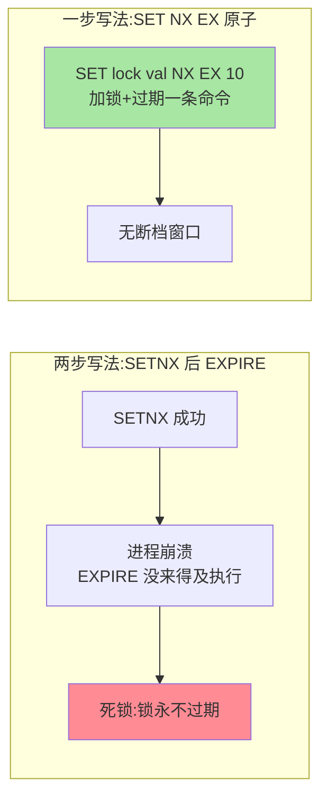
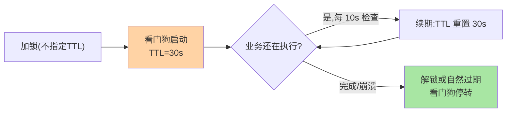

# 从 SETNX 到看门狗：单实例分布式锁的完整演进

> 分布式锁的入门写法三行代码，生产可用要踩四代坑：原子加锁、防误删、续期保命、可重入。这篇沿演进步把单实例 Redis 锁的正确姿势走完——RedLock 之争（篇 2）之前，先把单实例这台戏唱好。

## 一句话摘要

单实例 Redis 锁的演进四步：**① 原子加锁**——`SETNX + EXPIRE` 两步命令有断档风险，`SET key val NX EX n` 一条命令原子完成；**② 唯一值防误删**——锁值用随机标识，释放用 Lua 校验后删（GET 比对 + DEL 两步也有竞态）；**③ 看门狗续期**——业务超时锁先过期是超卖级事故，Redisson 看门狗自动续期保「锁活到业务完」；**④ 可重入**——Hash 结构记持有者与重入计数。四步合起来才是「生产可用的单实例锁」。

## 🎯 本文核心

**核心一句话：单实例锁的正确性 = 四代演进逐个堵竞态窗口——原子加锁堵断档、Lua 校验解锁堵误删、看门狗续期堵「锁先于业务过期」、Hash 计数堵可重入；看门狗保「锁活到业务完」但不保「业务正确性」，进程长停顿（GC/冻结）仍是残余窗口。**

机制链：两步命令断档 → 原子命令 → Lua 校验解锁 → 看门狗（30s TTL/10s 续期）→ Hash 可重入 → 看门狗的架构边界（GC 停顿、篇 2 的哲学接口）。全文一句话可重构：「每个缝隙一个补丁，四补丁合体才是生产锁——但补丁不改变异步复制的天花板」。

## 前置阅读

- 入门层篇 20《分布式锁》：锁的用途与基本用法
- 入门层篇 12《事务与 Lua 脚本》：Lua 的原子执行语义——本篇的实现工具

## 目标导向

本文是什么：单实例分布式锁的正确实现演进。功能是什么：把「锁过期业务没跑完」「A 删了 B 的锁」这类事故在机制层拆解并给出解法。能得到什么：四代演进的完整因果、Redisson 看门狗的工作模型、自研锁的实现清单。为什么用：锁实现评审、超卖排查、锁库选型，必看。

## 一、边界：入门层讲过什么，本文讲什么

| 内容 | 入门层 | 本文 |
|---|---|---|
| 锁的用途与 SETNX 基本用法 | ✅ 讲过 | 不重复 |
| 原子性演进的竞态细节 | 概念级 | **本文核心一** |
| 看门狗续期机制 | 未讲 | **本文核心二** |
| 可重入结构 | 未讲 | **本文核心三** |

## 二、原子性演进：两步命令的断档



同一条原子化思路贯穿全程：**「检查 + 动作」必须在一个原子单元内**。释放锁同理——「GET 比对值再 DEL」两步之间锁可能恰好过期易主，DEL 删掉的是别人的锁；Lua 脚本把「比对 + 删除」打包成 Redis 侧原子执行（入门篇 12 的结论在此兑现）：

```lua
-- 释放锁：值匹配才删，原子执行
if redis.call("GET", KEYS[1]) == ARGV[1] then
    return redis.call("DEL", KEYS[1])
else
    return 0
end
```

## 三、看门狗：锁先过期是超卖级事故

锁过期时间定多少是两难：定短了业务没跑完锁先过期——另一个请求进来，互斥失效（库存扣减场景就是超卖）；定长了持锁进程崩溃后其他请求干等整个过期期。**看门狗的答案：不让人猜业务时长，让锁自己保命**——Redisson 加锁不指定过期时间时启动看门狗：默认锁 30 秒，**后台线程每 10 秒检查一次，业务还在跑就把过期时间重置回 30 秒**；业务完成或进程崩溃（无人续期）锁按期自然释放。



工程边界：**看门狗保的是「锁活到业务完」，不是「业务正确性」**——这是单层防护的架构边界，正确性要在上层加固（篇 2 的多层防御）——进程 GC 停顿期间续期线程同样停转，极端长停顿后锁仍可能过期易主（Martin 论战的接口，篇 2 展开）；另外看门狗要求「不指定 TTL 的加锁方式」，显式给了 TTL 就没有看门狗——配置时别自作聪明。

## 四、可重入：Hash 结构的持有者记账

同一线程内嵌套加锁（方法递归、锁内调用带同一锁的方法）需要可重入语义。Redisson 的实现：锁值不用字符串用 **Hash**——`field = 持有者标识（UUID:threadId）`，`value = 重入计数`：加锁是「field 匹配则计数 +1」，释放是「计数 -1，减到 0 才真删」。看门狗与可重入在同一 Hash 上协同，构成 Redisson 锁的完整数据模型。

## 五、源码与实现关键路径

- Redisson 加锁：`RedissonLock#tryLock` → 底层 Lua（`luaUnlock`/加锁脚本内嵌于源码常量）——Hash 写入 + PEXIRPIRE 原子完成
- 看门狗：`renewExpiration` 定时任务链——每 `lockWatchdogTimeout/3` 续期一次，取消路径在 unlock 与进程退出
- 自研实现清单：SET NX EX 加锁 + Lua 唯一值释放 + 续期线程 + Hash 重入——Redisson 四件套的「素做版」，评审时按此对齐

## 典型场景

- **库存扣减**：锁 + 看门狗 + 扣减 + 释放——锁内逻辑短小，配合 MQ 削峰（tips 互指 job-scheduling 与 MQ 系列）
- **定时任务防重**：单机 cron 在集群下重复执行——锁竞争「谁执行」，到点抢锁即可，失败方静默退出
- **缓存击穿互斥回填**：热点 key 失效时单飞回填——锁粒度到 key 级，超时短（回填本身快），通常无需看门狗

## 业内惯例

> 💡 **实战提示**
> - 什么时候需要看门狗：业务持有时长不可预测（跨 RPC/含 DB 事务）——持有时长确定且短的操作（如缓存回填）显式短 TTL 更简单，别 Everywhere 看门狗
> - 锁等待一律带上限：tryLock(waitTime) 的 waitTime 按「业务可容忍排队时长」定，超时走降级——阻塞式 lock() 在生产是雪崩预备役
> - 锁粒度评审两问：「锁内有没有 RPC/DB 长事务」「锁的 key 粒度能不能更细」——两问都过才准进主干
> - 锁指标进监控：持有时长 P99、锁竞争失败率、看门狗续期失败——三个数是锁体系健康的完整画像

- **直接用 Redisson 不自研**：四代坑的完整实现（含重试、公平锁、读写锁）社区已打磨成熟——自研锁的评审成本高于引入成本，是业内默认
- **锁内逻辑尽量短**：看门狗是保命机制不是长事务许可——锁内 RPC/DB 长事务是滥用。加锁范围与业务吞吐之间是显式 Trade-off：锁粒度最小化 + 逻辑外移是设计正解
- **加锁必须带 TTL**：唯一例外是看门狗模式——「无过期时间的裸锁」在任何场景都是死锁预备役
- **监控锁等待与持有时长分布**：锁链路上下游（调用方—锁—存储）都要盯同一个信号——持有时长 P99 逼近 TTL 时，续期兜着但余量在消失

## 六、常见误区

- **「SETNX + EXPIRE 两步写法加个 try-catch 就安全」**：崩溃/kill -9 不走 catch——断档是系统级风险不是代码级风险，原子命令是唯一解
- **「值校验删除用 GET + DEL 就行」**：两步之间的竞态同样存在——「检查 + 动作」的原子化纪律适用于锁的每个操作
- **「有了看门狗锁就不会失效」**：续期线程依赖进程存活与 CPU 调度，长 GC/容器冻结下同样失守——看门狗收窄了窗口，没有消灭它（篇 2 的哲学讨论由此而来）
- **「可重入就是同一个 key 加两次」**：无重入计数的二次加锁要么失败要么重置 TTL（语义混乱）——计数是可重入的正确实现，裸 SET 做不出它

## 七、与相邻机制的关系

- 本系列篇 2《RedLock 争议与共识替代》：单实例锁的主从切换软肋与 RedLock 的尝试，在那篇展开
- 入门层篇 12/20：Lua 原子语义与锁的用法底座
- tips 互指：锁的「效率 vs 正确性」分类在篇 2；etcd/zk 共识锁的机制在 K8s Etcd 子系列 D 与分布式理论系列互指

## 你们可能会问

**Q1：看门狗的 30 秒/10 秒能改吗？**
能（`lockWatchdogTimeout`），30 秒是「业务合理时长」的默认假设——改它的正确理由是「实测业务持有时长分布」，拍脑袋改小增加续期压力、改大拖长崩溃等待。

**Q2：锁等待怎么设才合理？**
按「业务能容忍等多久」定 tryLock 等待上限，超时快速失败走降级——无限等待（阻塞式 lock）让锁竞争变成服务雪崩源，生产一律带等待上限。

**Q3：Redisson 的红锁（RedissonRedLock）呢？**
它是 RedLock 的 Java 实现——要不要用取决于你对 RedLock 争议的立场，机制与论战细节见篇 2。

## 八、自测三问

1. `SETNX + EXPIRE` 的断档窗口在哪？原子化思路如何贯穿加锁与释放？
2. 看门狗保什么、不保什么？它的续期节奏与失效条件是什么？
3. 可重入为什么必须用 Hash 计数？裸 SET 做不到的是什么？

## 开放问题

- 租约型锁的「业务感知租约到期」（过期前主动检查、安全点中止）在学术与工业界持续讨论，能否用业务协作彻底化解「锁过期业务未完」是长期课题。
- Redis 单线程模型变 multithreaded I/O 后，Lua 原子性的性能特征与锁实现的吞吐上限在版本间漂移，实现选型需要版本感知。

## 🎯 核心带走

- **核心一句话**：生产级单实例锁四件套——SET NX EX 原子加锁、Lua token 校验解锁、看门狗续期、Hash 可重入——每件堵一个竞态窗口；看门狗保锁命不保业务正确
- **机制链**：断档 → 原子命令 → 校验解锁 → 看门狗模型 → 可重入 Hash → 架构边界（GC 停顿）
- **哪里会坏**：两步写法死锁、裸 DEL 误删、显式 TTL 关掉看门狗、锁内长事务、GC 停顿失锁
- **边界**：本篇管单实例锁；主从切换丢锁与 RedLock 争议在篇 2，etcd/zk 共识锁与分布式理论系列互指

## 📌 数据与事实声明

- 写于 2026-09-08，Redisson 机制（默认 watchdog timeout 30s、每 1/3 续期）以其官方文档与源码为准
- 「超卖级事故」「业内默认用 Redisson」为工程共识口径
- 免责：参数与行为以 Redis/Redisson 官方文档为准

## 📚 参考资料

| 类型 | 标题 | 来源 |
|---|---|---|
| 开源项目 | Redisson（分布式锁与看门狗文档） | github.com/redisson/redisson |
| 官方文档 | SET NX / Lua 脚本 | redis.io/docs |
| 实战书 | 《Redis 深度历险》钱文品（分布式锁章） | 公开出版 |
| 社区沉淀 | 分布式锁实现演进的公开讨论（多方博客） | 技术社区公开文章 |
