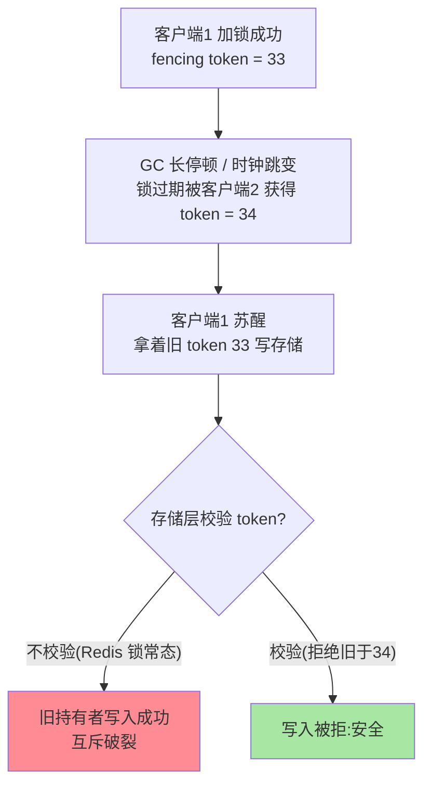
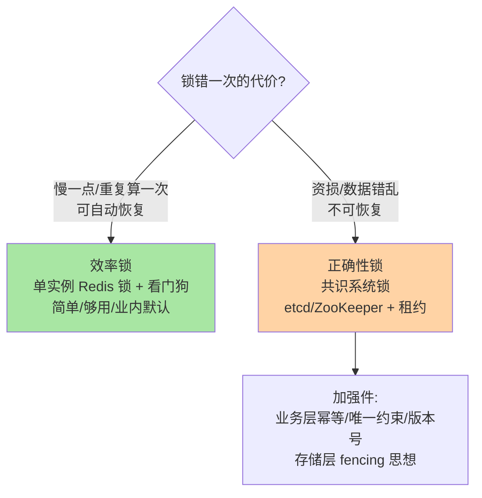

# RedLock 争议与共识替代：分布式锁的正确性边界

> 2016 年，Martin Kleppmann 与 antirez 的一场公开论战把「Redis 分布式锁到底安全吗」变成了分布式系统的经典案例。这场争论的价值不在胜负，在于它逼出了一个清晰的认识：**先分清你要锁的是「效率」还是「正确性」**——答案不同，技术选型完全不同。

## 一句话摘要

RedLock 尝试用「N 个独立 Redis 实例 + 多数派加锁」修复单实例锁的主从切换软肋，但 Martin 指出其安全性**依赖时钟假设**（GC 停顿/时钟跳变下，过期判定失真），并给出 fencing token 思路：锁之外再要一个**单调递增令牌**，存储层拒绝旧令牌的写入。论战的实践收口是分类决策：**效率锁（防重复计算）→ 单实例 Redis 锁足够；正确性锁（错一次就是资损）→ 共识系统（etcd/ZooKeeper）或 fencing token 机制，不赌时钟**。

## 🎯 本文核心

**核心一句话：RedLock 论战的价值不在胜负而在分类——「效率锁」（错一次可恢复）单实例 Redis 锁足够，「正确性锁」（错一次即资损）共识系统 + fencing 思想 + 业务幂等多层防御；超时锁只能提供「大概率互斥」，绝对互斥要靠幂等、约束与共识——锁只是吞吐优化。**

机制链：单实例软肋（主从切换丢锁）→ RedLock 多数派加锁 → 时钟假设反例与 GC 停顿反例 → fencing token 的存储层校验 → 分类选型决策树 → 多层防御的组合拳。全文一句话可重构：「先分类再选锁，正确性永远不靠单一锁」——这句话值得写进团队锁使用规范第一行。

## 前置阅读

- 本系列篇 1：单实例锁的完整演进与看门狗——RedLock 想修复的对象
- tips 互指：分布式理论系列（共识与 fencing 的机制底座）、K8s Etcd 子系列 D（共识系统实现）

## 目标导向

本文是什么：RedLock 机制、两大阵营论战要点与锁的分类选型。功能是什么：把「我的业务该用哪种锁」变成有依据的决策。能得到什么：RedLock 的流程与假设、时钟/GC 两类反例的机制、分类决策树与替代方案清单。为什么用：锁方案选型评审、资金级互斥设计、架构答辩，必看。

## 一、边界：入门层讲过什么，本文讲什么

| 内容 | 入门层 | 本文 |
|---|---|---|
| 锁的用法与单实例实现 | ✅ 讲过（篇 20 + 本系列篇 1） | 不重复 |
| RedLock 流程与安全性假设 | 提了一句 | **本文核心一** |
| 论战双方的核心论点 | 未讲 | **本文核心二** |
| 效率锁 vs 正确性锁的选型 | 未讲 | **本文核心三** |

## 二、单实例锁的软肋与 RedLock 的尝试

单实例（或主从架构）锁的软肋：**主从切换瞬间锁会丢失**——客户端在主库加锁成功、尚未同步到从库时主库宕机，从库提升后锁不存在，另一客户端加锁成功，互斥破裂。库存场景里这就是一次超卖窗口。

RedLock 的思路：**起 N 个完全独立（无主从）的 Redis 实例**，加锁时向全部实例依次 `SET NX EX`，**拿到多数（>N/2）且总耗时小于锁有效期才算成功**；释放时全实例删除。多数派思想让「单点切换丢锁」变成「多数实例同时故障才丢锁」——直觉上安全等级上了一个台阶。

## 三、论战：安全性的假设之争

Martin Kleppmann（《DDIA》作者）的反驳两个核心反例：

1. **异步系统的停顿反例**：锁过期判定发生在 Redis 服务端时钟，而客户端可能经历 GC 停顿/调度冻结——「你以为还持着锁，世界已经换了持有者」。这不是 Redis 的 bug，是**一切基于超时的锁在异步系统里的共同困境**
2. **时钟假设反例**：RedLock 的有效期计算依赖各实例本地时钟大致同步且不跳变——NTP 跳变等现实事件下，「多数派判定」的地基松动

antirez 的回应（公开博客）：时钟问题可用「相对时间/维护窗口」缓解，RedLock 在现实工程里安全性足够。论战没有裁判——但它留下的遗产是明确的：**安全性要求越高的场景，越不能把正确性押在「时钟没坏」这类环境假设上**。

## 四、fencing token：跳出「锁本身」的解法

Martin 给的出路：锁服务在授锁时发**单调递增令牌**，存储层记录「见过的最大令牌」，旧令牌的写入直接拒绝。互斥的正确性从「锁的时序」转移到「存储层的令牌校验」——**校验者是异步系统里唯一需要的一致点**。代价：存储层要配合改造（多数存储不支持原生 fencing），工程成本高。它的思想价值大于直接使用价值：**正确性不能只靠锁，要有「被拒绝的最后一道闸」**。

## 五、分类选型：先问「锁错一次会怎样」

- **效率锁**（防重复计算、防并发缓存回填）：错一次的代价是「重复做了件事」，自身可恢复——单实例 Redis 锁 + 看门狗完全够用，**RedLock 的复杂度属于过度设计**
- **正确性锁**（资金扣减、全局唯一资源分配）：换共识系统——etcd/ZooKeeper 的租约（lease）由共识保证、watch 语义成熟（etcd 机制互指 K8s 子系列 D）；**同时必须配业务加强件**：幂等设计、数据库唯一约束兜底、乐观版本号——多层防御才是正确性场景的标准姿势，没有任何单一锁敢独自扛正确性

业内共识口径：**把「锁」降格为性能优化手段，把「正确性」交给幂等与约束**——锁解决并发吞吐，约束解决正确性，两者分工而不是互相替代。

## 六、典型场景

- **防重复下单回调**：效率锁——回调幂等 + Redis 锁防抖，错一次无害
- **全局任务抢占**：效率锁——重复执行有幂等兜底，Redis 锁足够
- **余额扣减互斥**：正确性——不靠锁，靠数据库事务 + 乐观锁/唯一约束；分布式锁只是减少冲突的优化层
- **跨系统资源租约**（如分布式调度的心抖场景）：正确性——etcd 租约 + watch，或成熟调度平台

## 业内惯例

> 💡 **实战提示**
> - 什么时候需要共识锁：锁失效后果不可恢复（资金/全局唯一资源）且业务幂等与唯一约束都难以覆盖时——多数「以为需要」的场景做完幂等设计后 Redis 锁就够了
> - 正确性场景评审的「假设清单」纪律：时钟同步、停顿频率、分区概率逐条显式回答——RedLock 论战留下的最实用遗产就是这张清单
> - fencing 的最小落地是乐观锁：UPDATE WHERE version=N 就是「拒绝旧令牌」的等价物——先看已有存储能不能做校验者，再谈新组件
> - 效率锁也别忘了兜底：Redis 锁失效 + 重复执行的恢复路径（对账/重放）要存在——效率锁的「错」是小概率不是零概率

- **「锁 + 幂等」成对评审**：代码评审看到分布式锁必问「锁失效时业务还安全吗」——幂等缺失的锁是心理安慰
- **TTL 锁的持有时长监控**：与看门狗篇的结论复用——持有时长逼近 TTL 的告警在正确性场景升级为 P0
- **共识锁也讲租约心跳**：etcd 租约保活与 Redis 看门狗思想同构，区别在「租约的有效性由共识保证」——选型迁移时心智可复用
- **把论战写进设计文档**：正确性场景的方案评审要求「假设清单」（时钟/停顿/网络分区）显式列出并逐条回答——论战的直接遗产

## 源码与实现关键路径

- Redisson RedLock：`RedissonMultiLock` / `RedissonRedLock`——多实例依次 tryLock、累计耗时判定多数派、解锁向全实例广播；RedLock 的复杂度全部在客户端协调层，Redis 服务端无特殊协议（对照篇 1 的单实例 Lua 路径）
- etcd 租约：clientv3 的 `Grant / KeepAlive / Revoke`——租约有效期由 Raft 共识背书，`Watch` 租约失效事件实现锁释放感知；与 Redisson 看门狗的续期思想同构，权威源不同
- fencing 落地参照：数据库乐观锁版本号是 fencing 思想的最小实现——「校验令牌的存储层」未必是新组件，常是你已有的 UPDATE WHERE version

## 七、常见误区

- **「RedLock 用了就安全」**：它的安全边际建立在这批「独立实例」同时不坏且时钟正常——比单实例强，但正确性场景的标准仍高于「更强一点的单实例」
- **「Martin 反对 Redis 锁 = 禁用 Redis 锁」**：论战针对的是「正确性诉求下依赖超时锁」——效率锁场景 Redis 锁的简单与性能依然是业内正解
- **「换 etcd 锁就万事大吉」**：共识系统排除的是「锁服务本身的分叉」，客户端停顿导致的「持过期锁做事」依然存在——fencing/幂等加强件在任何锁体系下都需要
- **「锁的粒度越细越好」**：细粒度锁的维护成本（死锁、顺序、监控）指数上升——先问「这个并发点值得一把锁吗」，很多场景无锁的幂等/队列化更便宜

## 八、与相邻机制的关系

- 本系列篇 1：看门狗与单实例锁的完整实现——RedLock 修复的起点
- tips 互指：共识与租约的机制底座在 `distributed-theory` 系列；etcd 的 Raft 实现与租约细节在 K8s 子系列 D；数据库唯一约束兜底与 MySQL 专题层「分库分表」的幂等设计同源
- MQ 削峰与队列化：把「互斥」需求转化为「串行消费」往往是更便宜的解（job-scheduling 与 MQ 系列互指）

## 你们可能会问

**Q1：那到底还要不要用 RedLock？**
效率场景不需要（单实例够用）；正确性场景不够用（共识 + 加强件）。它的现实生态位很窄——多数「用了 RedLock」的案例重新分类后属于前两者之一。

**Q2：fencing token 落地到底难在哪？**
存储层要原生支持「拒绝旧令牌」——数据库乐观锁（版本号）其实是 fencing 思想的等价实现；真正的门槛是业务改造意愿，不是技术不可行。

**Q3：怎么向团队解释这场论战的结论？**
一句话版本：**超时锁能提供「大概率互斥」，不能提供「绝对互斥」；绝对互斥要靠幂等、约束与共识，锁只是吞吐优化**——把这句话写进锁使用规范的第一行。

## 九、自测三问

1. RedLock 的加锁条件与它想修复的软肋是什么？它的安全性依赖什么假设？
2. GC 停顿反例的完整链条是什么？fencing token 在哪一步拦截了事故？
3. 效率锁与正确性锁的选型标准是什么？正确性场景的「多层防御」包括哪几层？

## 开放问题

- 混合形态锁服务（Redis 性能 + 共识安全性，如基于 Raft 的 Redis 兼容实现）在社区持续出现，「性能锁」与「正确性锁」的工具边界可能被新一代实现重画。
- Serverless 与短生命周期计算形态下「客户端停顿」的定义与频率在变化，超时锁的反例概率模型值得按新负载重新标定。

## 🎯 核心带走

- **核心一句话**：先分「效率锁/正确性锁」再选型——效率锁 Redis 单实例够用，正确性锁共识 + fencing + 幂等多层防御；超时锁只有「大概率互斥」，锁只是吞吐优化
- **机制链**：主从切换软肋 → RedLock 多数派 → 时钟与停顿反例 → fencing 校验 → 分类决策树
- **哪里会坏**：RedLock 当绝对安全、换 etcd 后不配幂等、细粒度锁失控、无兜底的效率锁
- **边界**：本篇管正确性边界；单实例锁实现在篇 1，共识与租约机制在 distributed-theory 系列与 K8s Etcd 子系列互指

## 📌 数据与事实声明

- 写于 2026-09-08；Martin Kleppmann 与 antirez 的论战为 2016 年公开博客与答复（互联网公开归档），本文为其论点的工程归纳
- RedLock 流程以其官方文档为准；etcd 租约语义以其官方文档为准
- 免责：选型建议为工程共识口径，具体场景需按业务容灾等级评审

## 📚 参考资料

| 类型 | 标题 | 来源 |
|---|---|---|
| 论战原文 | Is Redlock safe?（Martin Kleppmann） | martin.kleppmann.com（公开归档） |
| 论战答复 | Is Redlock completely safe?（antirez） | antirez.com（公开归档） |
| 开源项目 | Redisson RedLock 实现 / etcd 租约文档 | github.com/redisson、etcd.io |
| 原理书 | 《数据密集型应用系统设计》（DDIA）锁与共识章 | 公开出版 |
