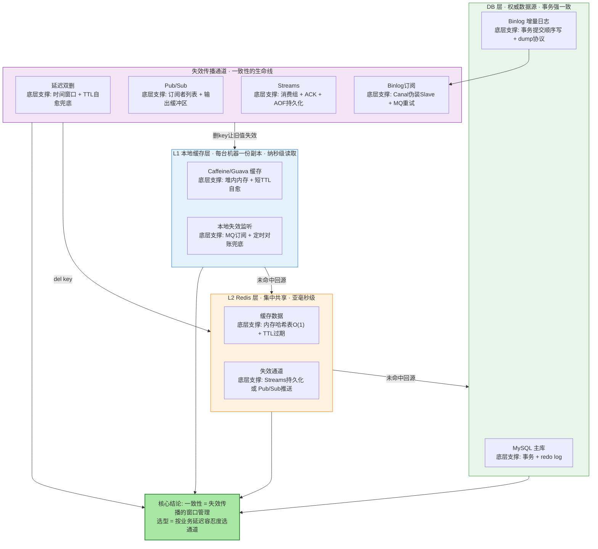
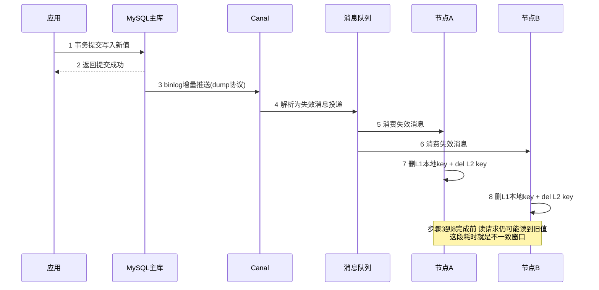
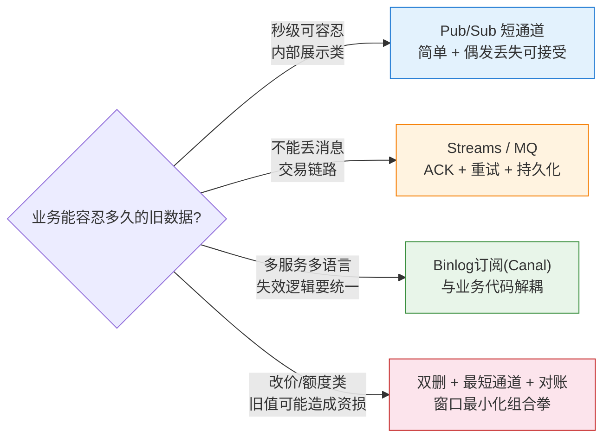

# 深入理解多级缓存一致性协议：失效传播的窗口管理

> 先看图，再看字——这张图就是全文：三层缓存各自靠什么活着、失效传播走哪条通道、每个组件的底层支撑是什么、为什么结论是「一致性 = 失效传播的窗口管理」。

## 一图看懂：多级缓存一致性与失效传播全景



**读图三步**：先看四色分区（蓝=本地缓存、橙=Redis、绿=DB、紫=传播通道，颜色即层），每个小格上面是组件名、下面是它的**底层支撑**——本文余下部分就是把每个「底层」拆开讲透；最后汇聚到绿色结论节点——一致性不是「强一致」，是**失效传播的窗口管理**。

## 🎯 本文核心

多级缓存的一致性从来不等于「强一致」——只要缓存不止一层、节点不止一台，**写完 DB 的那一瞬间，全系统必然存在一段「有人读旧值」的时间**。所以这条协议真正管理的对象不是「数据一致」，而是**失效传播的窗口**：写 DB 之后，让「旧缓存被删掉」这件事尽快、尽量不丢地扩散到每一层每一个节点。**窗口越小、丢失率越低，一致性越好；窗口不可能为零，但必须有界、可控、可兜底。**

机制链一句话：**写 DB → 失效/删除缓存 → 传播通道扩散（双删 / Pub-Sub / Streams / Binlog）→ 兜底（TTL 自愈 + 定时对账）**。

选型一句话：**按业务能容忍的旧数据时长选通道**——内部展示类秒级可容忍，简单通道就够；交易链路不能丢消息，选带确认重试的通道；多服务多语言共享缓存，选 Binlog 订阅把失效下沉到数据层。没有最强方案，只有窗口要求和丢失容忍度的匹配。

## 一句话摘要

多级缓存一致性 = 失效传播的窗口管理：写 DB 后删除缓存，再靠传播通道（延迟双删 / Pub/Sub / Streams / Binlog 订阅 Canal / MQ 广播）把「删」扩散到所有节点，用 TTL 自愈和对账兜底——通道按延迟容忍度选，窗口按量级治理，强一致在分布式缓存里既做不到也不值得追求。

## 5W 速记卡

| 维度 | 一句话 |
|---|---|
| What | L1 本地缓存 + L2 Redis + DB 三级结构下，「写后读旧值」的不一致窗口治理 |
| Why | 多副本 + 跨网络传播决定了窗口必然存在，只能压缩不能消除 |
| When | 写 DB 成功之后、最后一次删除生效之前的每一毫秒 |
| Where | 通道选型在传播层（选 Pub/Sub / Streams / Binlog），兜底在 TTL 与对账 |
| How | 延迟双删补漏 + 通道保送达 + 量化窗口 + 监控通道延迟 + 对账收口 |

## 一、多级缓存为什么「天然」不一致

先承认一个反直觉的事实：**不一致不是故障，是多级缓存的设计前提**。上多级缓存的动机是性能——业内认知口径，一次进程内堆内存读取约几十纳秒量级，一次同机房 Redis 往返约零点几毫秒到一毫秒，一次 DB 查询数毫秒起步——每加一层缓存，就读快了一个数量级。代价是：同一个 key 在 N 台机器的 L1 里各有副本、在 L2 有一份、在 DB 有权威值，**写操作只能按顺序到达这些位置，不可能同时到达**——到达顺序之间的时间差，就是不一致窗口。

用 CAP 映射看清各层的取舍（这是选型的第一性依据）：

| 层 | CAP 取舍 | 含义 |
|---|---|---|
| L1 本地缓存 | **AP**（可用性优先） | 各节点独立存活，宁可短暂不一致也不因广播失败拒绝服务 |
| L2 Redis | **CP 倾向**（一致与失效传播优先） | 集中一份共享副本，失效传播有明确的单点发令处 |
| DB | **CA**（单库强一致） | 事务保证权威数据源自身永远正确 |

这张表的推论很重要：**越往外层（L1），一致性约束越松、性能越极致**——一致性协议的本质，就是把 DB 的「强」以可控的衰减速度往外层传递，而不是在外层假装强一致。

**设计思想**：为什么明知道会不一致还要上多级缓存？因为这是用「有界的旧数据窗口」换「数量级的读性能」——两类成本中，旧数据窗口可以用工程手段压缩到毫秒级，而读性能损失是每一毫秒都在付的。这笔账算下来，窗口是三者中唯一「可谈判」的变量，一致性协议的全部内容就是谈这个变量。

## 二、不一致窗口：先量化，再谈管理

不量化的「一致性」是玄学。把一次写操作之后的时间轴摊开：


**不一致窗口 = T_写DB + T_失效传播 + T_客户端感知**。各段业内认知量级：

| 阶段 | 耗时量级（业内认知） | 决定因素 |
|---|---|---|
| T_写DB | 1-10ms | DB 提交延迟、事务大小 |
| T_失效传播（主动失效） | 1-20ms | 应用内直接调 del 的路径长度 |
| T_失效传播（Pub/Sub） | 5-100ms | 订阅者在线率、缓冲区排队 |
| T_失效传播（Binlog 订阅） | 50-500ms | Canal 解析吞吐、MQ 投递链路 |
| T_客户端感知 | 0-100ms | 下一次读到达的时间 |

三个关键认知，比数字本身更重要：

1. **窗口不可能为零**——跨进程、跨网络的状态同步必有先后，这是物理约束不是工程缺陷；
2. **管理目标是「有界 + 可控」**——最坏窗口能算出来、能监控、有兜底（TTL 到期强制一致），而不是「大概率没问题」；
3. **窗口内读到旧值不一定是事故**——是否构成事故由业务决定：商品详情旧一秒无感，改价后的旧价格被下单就是资损。**业务延迟容忍度是选型的唯一标尺**。

## 三、失效传播四大方案：每个都过三问

每个方案固定三问：**原理是什么 / 为什么有效 / 底层什么在支撑**。背方案没用，记住每个方案站在什么机制上，才知道它什么时候会塌。

### 方案一：延迟双删——用时间窗口换最终一致

- **原理**：写 DB → 删缓存 → **等待一小段时间** → 再删一次。第二次删除是为了清掉「并发读在第一次删除后回填的旧值」。
- **为什么有效**：第一次删除清掉已有旧值；等待窗口专门覆盖「读请求在删除前拿到旧值、在删除后把旧值回填进缓存」这条并发路径；第二次删除把回填的旧值再清掉——脏数据的生存期被限制在一个可控窗口内。
- **底层什么在支撑**：**时间窗口换最终一致 + TTL 自愈兜底**。等待量的常见取法是覆盖读路径 P99 耗时（业内常见 500ms-2s，业内认知口径）；就算第二次删除也失败了，TTL 到期会强制缓存失效——双删不是孤注悬命，它站在 TTL 这个最终兜底之上。

关键路径代码：

```java
// 延迟双删: 写路径
public void updateItem(Item item) {
    transactionTemplate.executeWithoutResult(status ->
        itemMapper.update(item));                  // 1. 先写 DB(权威源优先)
    cacheInvalidator.delete("item:" + item.getId()); // 2. 立即删一次
    delayQueue.schedule(() ->
        cacheInvalidator.delete("item:" + item.getId()),
        pickDelay(), TimeUnit.MILLISECONDS);         // 3. 延迟再删一次
}

private long pickDelay() {
    // 等待窗口 = 覆盖"读旧值并回填"路径的 P99 耗时, 上限保护 2s
    return Math.min(metrics.p99OfReadPathMillis(), 2000L);
}
```

### 方案二：Pub/Sub vs Streams——fire-and-forget 与消费确认的对决

**Pub/Sub（fire-and-forget）**：

- **原理**：发布者 PUBLISH 一条失效消息到 channel，Redis 把消息推进每个在线订阅者的输出缓冲区，订阅者读到后执行删除。
- **为什么有效**：发布即达，在线订阅者毫秒级收到消息，路径最短、实现最简单。
- **底层什么在支撑**：Redis 内部的 **channel 订阅者列表 + 每个客户端连接的输出缓冲区**——这是纯推送模型。也正因为如此，它有三个先天缺口：订阅者离线时消息直接蒸发（不持久化）、订阅者消费慢时缓冲区积压溢出会断连、没有 ACK 所以发出去就再也无法确认送达。

**Streams（消费确认 + 持久化）**：

- **原理**：失效消息 XADD 追加进 stream，消费者组里的消费者 XREADGROUP 领取消息执行删除，处理后 XACK 确认。
- **为什么有效**：消息写进 stream 就持久化（AOF/RDB 覆盖），消费者宕机消息还在，未 ACK 的消息留在 PEL（待确认列表）里可被他人接管重试——**「不丢」从运气变成了机制**。
- **底层什么在支撑**：**消息 ID（时间戳-序号）的有序存储 + 消费者组状态 + PEL 待确认列表**。多个消费者组还能让多个服务独立消费同一条失效流，互不影响游标。

| 维度 | Pub/Sub | Streams |
|---|---|---|
| 投递语义 | fire-and-forget，尽力而为 | 至少一次（ACK + 重试接管） |
| 离线订阅者 | 消息丢失 | 上线后从上次游标继续消费 |
| 持久化 | 无 | AOF/RDB 覆盖 |
| 消费确认 | 无 ACK | XACK + PEL 待确认列表 |
| 堆积表现 | 缓冲区溢出断连 | stream 增长，可控 trimmed |
| 适用 | 可丢消息的加速通道 | 不能丢消息的一致性通道 |

一句话分工：**Pub/Sub 是「加速器」，Streams 是「保证书」**——用 Pub/Sub 前先回答「这条消息丢了会怎样」，答不上来就上 Streams。

### 方案三：订阅 Binlog——Canal 伪装 Slave 拉增量

- **原理**：Canal 向 MySQL 主库发送 dump 协议指令，**伪装成一台从库**；主库按复制协议把 binlog 增量推给它；Canal 把 binlog 解析成结构化变更事件（表 / 行 / 操作类型），按规则过滤后投递到 MQ，消费者订阅 MQ 执行删除 L1/L2。
- **为什么有效**：失效由**数据变更本身**驱动，与业务代码彻底解耦——业务只管写 DB，不存在「某个服务忘了发失效消息」这类问题；binlog 是事务提交顺序写，天然不乱序；MQ 提供重试与堆积缓冲。
- **底层什么在支撑**：**MySQL 复制协议（dump 命令 + binlog 顺序追加写）+ MQ 至少一次投递 + 删除操作的天然幂等**（del 同一个 key 重复执行无副作用，正好吃下 MQ 的重复投递）。

Canal 关键配置（公开口径，以官方文档为准）：

```yaml
canal.instance.master.address=mysql_host:3306
canal.instance.dbUsername=canal
canal.instance.connectionCharset=UTF-8
# 只监听需要失效缓存的表, 降低解析与投递量
canal.instance.filter.regex=.*\\.(user_info|item_info|order_info).*
canal.instance.batch.size=1000
```

源码级关键路径（简化）：`Canal Server → send dump 协议 → 主库推送 binlog event → 解析出 TableMeta / RowChange / EventType → 按过滤规则匹配 → 投递 MQ → Consumer 删 key`。这条链路每一跳都有独立的监控点：binlog 拉取延迟、解析积压、MQ 投递延迟、消费延迟——**通道自身也是需要监控的故障面**，不只是数据对不对。

### 方案四：分布式订阅消息——MQ 广播失效

- **原理**：应用写完 DB 后，向 MQ 发一条失效消息（广播模式或集群消费），各节点消费后删自己的 L1，统一删 L2。
- **为什么有效**：与 Pub/Sub 相比多了**持久化、消费确认、重试队列、死信队列**——消息丢了能查、失败了能重、堆积了能看；广播模式让每台机器的 L1 都能被触达。
- **底层什么在支撑**：MQ 的**持久化存储 + 消费 ACK 机制 + 重投递策略**；以及与方案三共用的「删除幂等」前提。
- **与 Binlog 方案的本质差别**：驱动源不同——MQ 广播是**业务代码双写**（写 DB 后主动发消息），Binlog 是**数据变更本身驱动**。前者轻但可能漏发（代码路径遗漏、异常分支跳过），后者不漏但引入 Canal 组件的运维成本。选哪个取决于「漏发一次的代价」和「多养一个组件的成本」哪个更贵。

## 四、原理图：失效传播全链路时序

把方案三（生产推荐的主干方案）的完整链路画成时序——每一跳都是一个可能延迟或丢失的环节：



对照第二节的时间线图看：时序图的步骤 3-8 对应时间线的 T1→T3 段——**链路上任何一跳卡住，窗口就被拉长；任何一跳断了，窗口就要靠 TTL 或对账来关闭**。这就是「一致性 = 失效传播的窗口管理」的图解形态。

## 五、哪里会坏：两类高频根因

先把根因全貌列表，再拆开两个最高频的：

| 根因 | 发生频率 | 影响范围 | 检测难度 |
|---|---|---|---|
| **失效传播失败** | 中 | 局部节点 | 高（不出事不知道） |
| **双写顺序错误** | 低（写错顺序） | 局部 key | 中 |
| 网络分区 | 低 | 全局 | 高 |
| 客户端并发回填 | 高 | 局部 key | 高 |
| 缓存自然过期 | 高 | 局部 key | 低（本就是设计的一部分） |

**根因一：失效传播失败**——写 DB 成功、删 L2 成功、但删 L1 失败。三条典型路径：L1 的广播消息丢失（Pub/Sub 不持久化）、L1 所在节点恰好在发布重启（离线错过消息）、L1 消费超时被丢弃。它阴险在**无感知**：消息丢了没有任何报错，直到用户投诉「改了怎么没变」。防线有两道：**对账**（定时抽样比对 DB / L2 / 各节点 L1 的值，不一致即修复并告警）和**通道升级**（把「尽力而为」的广播换成「至少一次」的 Streams/MQ）。

**根因二：双写顺序错误**——先更新缓存再写 DB 的路径：更新缓存成功 → 写 DB 失败 → 缓存里是新值、DB 里是旧值，**缓存成了脏数据源头，而且会一直活着直到 TTL**。正确顺序是**先写 DB，再失效（删）缓存**：DB 是权威源，删除后下一次读必然回源拿到权威新值；窗口内的旧值读到也只是「旧」，不是「错」。这里藏着一条设计公理：**让缓存永远从权威源单向填充，禁止缓存反向变成事实**。

## 六、追问链：质疑者三连

**追问一：为什么是「删缓存」而不是「更新缓存」？为什么不是「先删缓存再写 DB」？**
两个「为什么不选」一起答。**为什么不选「先更新缓存」**：并发写场景下两次更新的到达顺序不可控（后提交的写可能先到缓存），缓存值可能停在任意一次写的结果上——而删除是幂等的，把「填什么值」交还给读路径，由 DB 单一权威源决定，并发下不会锁死在错误值上。**为什么不选「先删缓存再写 DB」**：删除后、DB 提交前的空窗里，读请求会回源到**旧 DB 值**并回填缓存，这个脏值要活到下一次失效或 TTL——比「先写 DB 再删」多出一个天然的脏值温床。顺序公理：**权威源先行，失效殿后**。

**再追问：延迟双删的「延迟」到底设多少？为什么不是越大越保险？**
等待窗口的唯一职责是覆盖「读旧值 → 回填旧值」这条并发路径的耗时，所以量取**读路径 P99**——设成 10 秒并不会更保险，反而：其一，第二次删除前的暴露时间被拉长，窗口变大；其二，延迟队列里堆着巨量定时任务，内存与调度成本都在涨。失效了怎么办的答案在兜底层：第二次删除也丢了呢？——TTL 到期强制一致 + 对账发现修复，双删从来不是唯一防线，它是「把窗口从 TTL 量级压到秒级」的加速器。

**打破砂锅：都要上 Binlog + MQ + 对账这么重了，为什么不干脆只用 TTL 被动过期？**
回到窗口账：TTL 方案的不一致窗口上限就是 **TTL 全长**（业内常见 30 分钟量级）——要让窗口变成秒级就得把 TTL 压到秒级，而秒级 TTL 等于高频回源风暴，缓存被自己打穿。传播通道干的事，是把窗口从「TTL 量级（分钟）」压到「传播量级（毫秒到百毫秒）」，TTL 从「主力机制」退位成「兜底机制」。约束来源是业务对旧数据的容忍度：容忍分钟级旧数据的内部报表系统，只上 TTL 完全正确——重方案的每一分复杂度都必须由窗口需求来支付。

## 七、反方案分析：两条「更简单 / 更严格」的路为什么不走

**为什么不选「分布式锁串行化读写」换强一致？**
读缓存前先拿分布式锁、写完 DB 释放——一致性确实上去了，代价是所有读请求挤过同一把锁：锁服务成为新热点、读路径多出一次锁往返的延迟、锁服务抖动直接传染缓存层。**缓存的初心是性能，用全局锁换强一致等于自废武功**；DB 事务已经保证权威源一致，缓存层要的是「有界的最终一致」，不是把缓存变成第二个 DB。

**为什么不选「只用 TTL 被动过期」一条道走到黑？**
见打破砂锅的窗口账——补充一个它真正崩塌的场景：**改价 / 额度类数据**，TTL 窗口内旧价格被下单就是资损，这类数据的一致性要求是「写后秒级内生效」，TTL 物理上给不了。TTL 正确的位置是兜底，不是主力。

## 八、事故复盘（匿名化叙事）

**复盘一：改价后部分机器仍显示旧价格**
现象：某电商系统运营改价后，部分用户仍看到旧价格，且分布与机器相关。**排查**：按机器抽样比对 L1 值，发现几台节点长期持有旧值；回查失效链路，用的是 Redis Pub/Sub 广播删 L1——而那几台节点在改价时段恰好在滚动发布重启，**离线窗口正好错过失效消息**，Pub/Sub 不持久化，错过即永久错过（直到 TTL）。**复盘**结论：fire-and-forget 通道的丢失率在「常态发布」这种日常事件下被系统性放大，不是小概率；修复是把 L1 失效通道升级为 MQ 广播（持久化 + 离线补消费），并加每日对账兜底。教训一句话：**评估通道可靠性时，用「节点常态离线」做基准，不要用「一切正常」做基准**。

**复盘二：缓存与 DB 短暂不一致引发批量客诉**
现象：某账户类服务偶发「操作成功但展示未更新」，集中在业务高峰时段。**排查**：链路追踪显示 Canal 拉取延迟出现秒级尖峰；对齐时间轴，尖峰来自上游一个批量更新大事务——单事务 binlog event 过大，Canal 解析阻塞，后续所有失效消息排队。**复盘**修复三件：大事务拆批（把单条 binlog 的解析耗时压平）、对「binlog 端到端延迟」设阈值告警（之前只监控了「数据最终对不对」，没监控「通道还活着吗」）、消费端按 key 幂等以承接重试风暴。教训一句话：**一致性方案必须监控通道延迟，通道卡住和通道断了是同一类事故**。

## 九、不同量级的思考：约束来源决定解法

量级不是数字标签，是架构约束的边界——每一档的失效传播逻辑完全不同，解法不能套用：

- **十万级 QPS（单体或少量节点）**：约束来源是节点少——失效广播的目标数量小，丢一条的概率与影响都有限；这一档的核心问题是「删没删对顺序」，而不是「通道多可靠」；思考方式是**顺序驱动**——先写 DB 再删缓存 + 延迟双删 + 短 TTL 就构成完整方案，不需要独立的消息组件。
- **百万级 QPS（分布式多节点）**：约束来源是节点数上量——广播丢消息的概率按节点数放大，滚动发布常态化使「离线错过」成为必然而非偶然；这一档的核心问题是「消息会不会丢」，而不是「删得快不快」；思考方式是**可靠性驱动**——Streams 或 MQ 广播 + ACK + 重试 + 离线补消费，再加对账。
- **千万级 QPS（多服务多语言共享缓存）**：约束来源是失效逻辑无法在每个语言栈、每个服务里各写一遍——双写在几十个代码仓库里维护，漏发率随仓库数线性上涨；这一档的核心问题是「失效逻辑放在哪」，而不是「谁去删」；思考方式是**架构驱动**——Binlog 订阅（Canal + MQ）把失效下沉到数据层，业务代码彻底退出失效职责。
- **亿级 QPS / 跨地域**：约束来源是光速——跨机房 RTT（业内认知 30-100ms 量级）与 binlog 链路延迟决定了中心化传播的窗口下限被物理抬升；这一档的核心问题是「窗口边界在哪」，而不是「窗口能不能为零」；思考方式是**窗口治理驱动**——按机房单元化部署传播链路、机房内闭环失效、跨机房只同步权威数据，叠加对账与业务侧降级展示。

思考方式总结：十万级靠「顺序删对」，百万级靠「消息不丢」，千万级靠「下沉数据层」，亿级靠「单元化窗口治理」——每一档的约束来自不同的物理层（进程边界 / 网络可靠性 / 组织复杂度 / 光速），思考方式必须匹配约束来源。解法是思考的产物，不是数字的排列。

**自下而上与触发升级**：先测档位再选思考——节点数、失效消息日丢失/堆积计数、binlog 端到端延迟三个实测值决定你实际站在哪一档，不按预期规模预支上一档的复杂度，也不滞留在下一档的侥幸里。触发升级的信号：节点滚动发布常态化、失效消息出现堆积告警、多语言服务开始共享同一份缓存——任一信号出现，思考方式必须随档升级（顺序驱动 → 可靠性驱动 → 架构驱动 → 窗口治理驱动）。锚点始终是约束来源：进程边界、网络可靠性、光速这些物理层变了，解法才跟着变——业务翻倍只是信号，约束迁移才是升级的依据。

## 十、参数调优：把窗口再压小

窗口的主体是传播耗时，优化全部打在传播链路上：

```text
1. 失效链路同机房部署(Canal + MQ + Consumer 与主库同机房)
   跨机房 RTT 1-5ms → 同机房 0.1-0.5ms, 传播段窗口压缩一个数量级(业内认知)

2. 批量失效合并(同一批变更的 100 个 key 合并为 1 条消息)
   MQ 消息数与消费次数同步下降, 消费端处理延迟约 10ms → 2ms(业内认知)

3. 管道化删除(Redis Pipeline 一次提交多个 del)
   往返次数从 N 次降到 1 次, 100 个 key 约 5ms → 1ms(业内认知)
```

配套的监控四件套——**binlog 端到端延迟、MQ 堆积深度、消费失败率、对账差异数**：前三个管「通道活着吗」，最后一个管「数据最终对不对」。只有对账没有通道监控，等于只在案发后报案；只有通道监控没有对账，等于相信链路永远不静默丢数据。

## 十一点五、业内惯例与生产实践

生产中常见的组合与变体（公开技术社区口径的通行做法）：

- **主力组合**：写 DB → 发失效消息（或 Binlog → MQ）→ 消费端删 L2 → 广播删 L1 → TTL 兜底 → 定时对账。Binlog 订阅（Canal）是多服务场景的生产推荐主干。
- **按数据分级**：改价/额度类用「双删 + 最短通道 + 告警」压窗口；商品详情/资讯类放宽到「失效 + 短 TTL」；纯展示类甚至只靠 TTL。
- **对账节奏**：常态抽样对账（分钟级）+ 全量对账（日级）双轨，差异进入修复队列并计数告警——对账差异曲线是最诚实的一致性健康指标。
- **发布纪律**：滚动发布前先确认失效消息积压清零，重启窗口避开失效高峰——离线补消费是底线，不制造离线是纪律。
- **反模式**：业务代码里散落手工 del（漏发温床）、用 Pub/Sub 承载不能丢的失效消息、只有 TTL 没有对账、只监控命中率不监控通道延迟。

## 💡 实战提示

- 💡 选型先问一句「这条消息丢了会怎样」：答「没什么」用 Pub/Sub 提速，答「出事故」立刻换 Streams/MQ——通道选择是业务问题，不是技术偏好
- 💡 延迟双删的等待量用读路径 P99 实测，不拍脑袋；配上限保护（如 2s），防止延迟队列被极端值撑爆
- 💡 删除天然幂等，正好吃下 MQ 至少一次投递的重复消息——不要为了「防重」把消费端复杂化，del 重复执行无副作用
- 💡 监控四件套（binlog 延迟 / MQ 堆积 / 消费失败率 / 对账差异）缺一不可——前三个管通道，最后一个管数据，混为一谈会漏报
- 💡 大事务是 Binlog 链路的隐形杀手——拆批写入，让单条 binlog event 的解析耗时可控，失效延迟才不会周期性尖峰

## 开放问题

- 跨地域部署下「机房内闭环失效 + 跨机房权威同步」的窗口量化模型，目前多靠经验阈值，缺少公开的通用公式
- 对账频率与业务容忍度之间的成本函数（对账太密打 DB、太疏窗口失控），值得按数据分级建立动态频率策略

## 你们可能会问

**Q1：不一致窗口内读到旧值，业务一定会出问题吗？**
不一定，而且大多数情况不会。窗口内读到旧值是否构成事故，由数据的下游用途决定：展示类读到旧值只是「旧」，无资损；交易类拿旧价格/旧额度做扣减才是事故。所以正确的动作不是「消灭窗口」，而是**给每类数据标注延迟容忍度，让敏感数据走最短通道 + 双删，让钝感数据走便宜通道**。

**Q2：Canal 挂了怎么办？失效会不会全体失效？**
会退化但不会失控。Canal 故障期间失效消息停发，缓存依赖 TTL 自愈（窗口退化为 TTL 量级）——这正是「TTL 必须保留」的原因。工程上要对 Canal 做 HA 部署与 binlog 位点持久化，恢复后从断点续传（binlog 在 MySQL 端有保留期，位点不丢就不漏消息）；同时对 binlog 端到端延迟做告警，让「Canal 静默」在 TTL 到期前就被发现。

**Q3：为什么不直接用「写 DB + 写缓存」（Write-through）一步到位？**
Write-through 把「填什么值」绑死在写路径上：并发写下值可能错序、写缓存失败要处理回滚语义、缓存不可用时写 DB 也被拖累。而「删除 + 读时回填」把填充时机交给读路径，实现最简单、失败语义最干净（删失败大不了等 TTL）。Write-through 适合写少读多且能接受组件耦合的场景，不是多级缓存的默认答案。

**Q4：对账怎么做才不会把 DB 打挂？**
分级 + 抽样：常态对账按分钟级抽样（比如按 key 哈希取 1%），日级做一次全量；比对走从库或专用只读实例；发现的差异数进修复队列限速执行。对账是「健康指标」优先于「修复手段」——差异曲线的突变比绝对值更值得关注。

## 什么时候用 / 不用

先看决策图：



- ✅ **延迟双删**：写后读并发高、回填旧值风险真实的写路径；必须搭配 TTL 兜底
- ✅ **Pub/Sub**：节点稳定在线、容忍偶发丢失、追求链路最简的失效加速
- ✅ **Streams / MQ 广播**：滚动发布常态化的多节点部署、消息不能丢的通道
- ✅ **Binlog 订阅（Canal）**：多服务多语言共享缓存、失效逻辑要与业务解耦的主干方案
- ❌ 不用「先更新缓存」的写顺序——并发错序与失败回滚两头不讨好
- ❌ 不用 Pub/Sub 承载不能丢的失效消息——离线即丢，发布重启窗口必然踩中
- ❌ 不用分布式锁串行化换强一致——锁热点拖垮读路径，缓存自废武功
- ❌ 不用「只用 TTL」应对改价/额度类数据——分钟级窗口对资损类数据不可接受

## Trade-off：每一次一致性都在花什么

一致性在分布式缓存里没有免费档位，每个方案都在三本账上花钱：**性能账**（通道越重，写路径延迟越高——双删多一次删除、Binlog 多一整条链路）、**复杂度账**（Canal/MQ/对账都是要养的基础组件，运维与故障面同步扩大）、**一致账**（窗口从 TTL 量级压到毫秒级的收益，只对敏感数据兑现）。选型的本质是：**先给数据标注延迟容忍度，再为「窗口需求」支付恰好够用的复杂度**——用 Binlog+MQ+对账服务一个内部报表系统是浪费，用裸 TTL 服务改价链路是事故。约束来源（业务容忍度）变，解法才跟着变。

## 🎯 核心带走

- **一图一句**：多级缓存一致性 = 失效传播的窗口管理——写 DB、删缓存、通道扩散、TTL 与对账兜底，四段机制链缺一不可
- **窗口三认知**：窗口不可能为零（物理约束）、必须有界可控（工程目标）、窗口内旧值是否是事故由业务定（选型标尺）
- **四通道分工**：双删补并发回填的漏、Pub/Sub 做加速、Streams/MQ 保送达、Binlog 订阅把失效下沉到数据层
- **两条顺序公理**：权威源先行、失效殿后（先写 DB 再删缓存）；删除优于更新（幂等、交给读路径回填）
- **监控四件套**：binlog 延迟、MQ 堆积、消费失败率管通道，对账差异数管数据——通道卡住和通道断了是同一类事故
- **量级主线**：顺序驱动 → 可靠性驱动 → 架构驱动 → 窗口治理驱动，约束迁移才升级，业务翻倍只是信号
- **跨周期视角**：这套协议的演变轨迹很清晰——从「双删这种进程内小技巧」演进到「Binlog 订阅的数据层下沉」，失效职责离业务代码越来越远、离权威数据越来越近；未来新增缓存层（如浏览器端/网关端），协议不变，只是传播链又多了一跳

## 📌 数据与事实声明

- 写于 2026-09-23（海报式信息图重构：一图看懂 + 每方案三问「原理/为什么/底层支撑」+ 时序图与窗口时间线）；机制以 Redis 7.x 官方文档与 MySQL 复制协议、Canal 公开文档为基准
- 「纳秒级堆内读取 / 毫秒级 Redis 往返 / 各通道窗口 1-500ms」等为业内认知与公开口径的量级判断，非实测数据，决策需按实际业务压测校准
- 事故复盘为公开技术社区高频案例模式的匿名化复述，不含任何真实系统、公司与内部代号
- 工具口径以 Redis 官方文档 + Canal GitHub README 为准，配置默认值随版本演进

## 📚 参考资料

| 类型 | 标题 | 来源 |
|---|---|---|
| 官方文档 | Redis Pub/Sub / Redis Streams（XADD、XREADGROUP、XACK） | redis.io/docs |
| 官方文档 | MySQL Replication（binlog 与 dump 协议） | dev.mysql.com/doc |
| 工程实现 | Canal（伪装 Slave 订阅 binlog） | github.com/alibaba/canal |
| 关联阅读 | 缓存三大问题（穿透/击穿/雪崩） | `docs/middleware/redis/入门层/从零开始认识Redis系列/18_缓存三大问题-入门.md` |
| 系列内 | 多级缓存一致性协议系列后续篇 | 本系列 |
