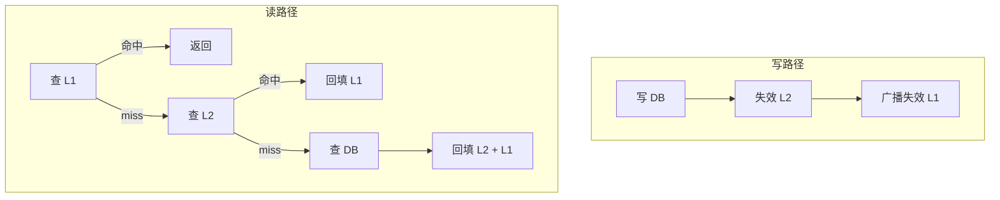

# 多级缓存一致性协议深度

## 本文核心

**一句话摘要**：多级缓存一致性 = 写 DB 后失效缓存 + 失效传播 + 定时对账，金融选 Write-through / 电商选 Invalidate / 社交选 Write-behind。

**核心机制链**：一致性模型 → 三种策略对比 → L1/L2 失效传播 → Binlog 订阅 → 亿级保障 → 验证监控




## 一、一致性问题的本质

多级缓存一致性挑战：L1 (本地缓存) ↔ L2 (Redis) ↔ L3 (DB)。写操作：写 DB → 失效 L2 → 失效 L1，三个节点不可能同时失效 → 短暂不一致窗口。不一致窗口 = 网络延迟 + 失效传播时间 + 客户端重试间隔，量级 ms~s。

## 二、三种一致性策略

### 2.1 Write-through（直写）

写流程：1. 写 DB → 2. 写 L2 (Redis) → 3. 失效 L1 → 4. 返回成功。读流程：1. 查 L1 → 命中返回 / 2. L1 miss → 查 L2 → 命中返回 + 回填 L1 / 3. L2 miss → 查 DB → 返回 + 回填 L2 + L1。一致性：强一致（写后立即一致）。延迟：高（每次写都同步写 Redis）。适用：金融/账务/对账场景。

### 2.2 Write-behind（异步回写）

写流程：1. 写 L1 + L2（延迟队列）→ 2. 异步批量写 DB（每秒/每 1000 条/每 5s）→ 3. 不失效 L1/L2。读流程：1. 查 L1 → 命中返回 / 2. L1 miss → 查 L2 → 命中返回 + 回填 L1 / 3. L2 miss → 查 DB（可能读到旧数据）→ 返回 + 回填。一致性：最终一致（秒级延迟）。延迟：低（写操作仅操作缓存）。适用：社交/Feed/非金融场景。

### 2.3 Invalidate（失效）

写流程：1. 写 DB → 2. 失效 L2（del key）→ 3. 广播失效 L1（Pub/Sub 或 Canal 订阅 binlog）→ 4. 返回成功。读流程：1. 查 L1 → miss → 查 L2 → miss → 查 DB → 回填。一致性：最终一致（失效传播延迟）。延迟：中（写 DB + 失效传播）。适用：电商/商品/大多数场景。

## 三、L1/L2 失效传播机制

### 3.1 失效传播四模式

| 模式 | 机制 | 延迟 | 可靠性 | 适用场景 |
|---|---|---|---|---|
| **主动失效** | 写服务直接 del L1 + L2 | ms | 高 | 单体应用 |
| **Pub/Sub** | Redis Pub/Sub 广播失效 | ms | 中（丢消息） | 分布式应用 |
| **Binlog 订阅** | Canal/Debezium 订阅 DB binlog | 秒 | 高 | 多服务/跨语言 |
| **消息队列** | MQ 失效消息 + 消费者 | 秒 | 高（持久化） | 跨机房/多地域 |

### 3.2 Binlog 订阅（推荐生产方案）

Canal 架构：DB (MySQL) → Canal Server (模拟 Slave) → MQ (Kafka/RabbitMQ) → Consumer (失效 L1+L2)。Canal 工作原理：1. Canal Server 伪装成 MySQL Slave，连接 Master 2. Master 推送 binlog 到 Canal 3. Canal 解析 binlog 事件（INSERT/UPDATE/DELETE）4. 根据配置规则生成失效消息 5. 发送到 MQ，由 Consumer 执行失效。

### 3.3 失效传播的边界条件

- 网络分区：Consumer 与 MQ 断开 → 失效堆积 → 分区恢复后重放 → 解决方案：MQ 持久化 + Consumer offset 管理
- 消费失败：Consumer 处理异常 → 消息重试 → 无限重试 → 解决方案：死信队列 + 人工介入
- 重复消费：MQ 至少一次投递 → 重复失效 → 解决方案：幂等失效（del key 不影响幂等性）
- 失效顺序：先失效 L2 后失效 L1 vs 先 L1 后 L2 → 解决方案：按 L2 → L1 顺序失效（L2 是权威源）

## 四、亿级流量下的一致性保障

### 4.1 缓存预热（Cache Warming）

大促前预热流程：T-2h 计算热点 Key 列表（基于历史流量 + 运营配置）→ T-1h 批量写入 L2 Redis（pipeline 批量写入）→ T-30m 批量失效 L1（广播失效消息）→ T-0 正常服务。预热关键参数：预热 Key 数量 10w-100w，Batch Size 1000-5000（pipeline），预热耗时 5-30min。

### 4.2 动态 TTL（Adaptive TTL）

每个 Key 维护一个访问计数器 + 写入计数器，TTL = 基础 TTL + Σ(调整因子 × 计数器)。访问频次高 → TTL - 10min；写入频次高 → TTL - 5min；大促期间 → TTL + 20min；DB 压力大 → TTL - 5min。

### 4.3 双写一致性（Dual-Write Consistency）

双写场景：同时写 DB + 写缓存。DB 写成功 + 缓存写失败 → 数据不一致。解决方案（按优先级）：1. 先写 DB，后失效缓存（推荐）→ DB 写成功 → 失效缓存 → 下次读自然回填 2. 先失效缓存，后写 DB → 缓存失效后写 DB 失败则读请求直接压 DB 3. 事务补偿（最终一致）→ 定时任务对账 + 补偿重试

## 五、一致性验证与监控

### 5.1 监控指标

| 指标 | 健康阈值 | 危险阈值 |
|---|---|---|
| 不一致 Key 数 | 0 | > 10 |
| 失效延迟 (ms) | < 100 | > 500 |
| 预热命中率 (%) | > 90 | < 80 |
| 双写失败率 (%) | < 0.1 | > 1 |

### 5.2 对账机制

```python
def audit_consistency():
    sample_keys = redis.scan(match="hot:.*", count=1000)
    db_values = db.batch_query(sample_keys)
    cache_values = redis.batch_get(sample_keys)
    inconsistent = [k for k in sample_keys if db_values[k] != cache_values[k]]
    for key in inconsistent:
        redis.setex(key, ttl, db_values[key])
    return len(inconsistent)
```

## 六、核心带走

- **核心一句话**：多级缓存一致性 = 写 DB 后失效缓存 + 失效传播 + 定时对账，金融选 Write-through / 电商选 Invalidate / 社交选 Write-behind
- **策略选择**：金融选 Write-through / 电商选 Invalidate / 社交选 Write-behind
- **失效传播**：Binlog 订阅（Canal）是生产环境推荐方案
- **亿级保障**：预热 + 动态 TTL + 双写补偿 + 定时对账
- **哪里会坏**：网络分区导致失效堆积、消费失败无限重试、双写顺序错误

## 💡 实战提示（Tips）

- **失效顺序**：先失效 L2（Redis）后失效 L1（本地），L2 是权威源
- **Canal 部署**：Canal Server 伪装成 Slave，连接 MySQL Master
- **对账频率**：生产环境 5-30min 一次，大促期间缩短到 1min
- **MQ 持久化**：失效消息必须持久化，防止 MQ 故障导致失效丢失
- **幂等失效**：del key 操作天然幂等——重复失效无副作用

## ❓ 你们可能会问（QA）

**Q1：写 DB 成功后失效缓存失败怎么办？**
A：DB 写成功 + 缓存失效失败 = 数据不一致。解决方案：定时对账（5min 一次）发现不一致时补偿重试。

**Q2：Canal 订阅 binlog 的延迟是多少？**
A：通常 100ms-1s。取决于 binlog 生成速度 + Canal 解析速度 + MQ 投递延迟。生产环境监控 `canal.delay.ms` 指标。

**Q3：为什么先失效 L2 再失效 L1？**
A：L2 是权威源（跨实例共享）。先失效 L2 后，L1 广播失效可能丢失——但下次读时 L1 miss 会查 L2，L2 已失效自然回填 DB 新值。

## 🤔 思考（开放问题/反思）

- **最终一致性的窗口期**：在亿级 QPS 下，不一致窗口能否压缩到 ms 级？需要哪些条件？
- **多地域部署**：跨机房缓存一致性如何保证？——Gossip 协议 vs 单点广播
- **对账的抽样策略**：全量对账成本太高，抽样多少才能在 99% 置信度下发现不一致？

## ⚖️ Trade-off（代价与反方案）

| 方案 | 优势 | 代价 | 反方案 |
|---|---|---|---|
| **Write-through** | 强一致、简单可靠 | 写延迟高（同步写 Redis） | Invalidate + 对账 |
| **Invalidate** | 写延迟低、最终一致 | 不一致窗口（失效传播延迟） | Write-through |
| **Write-behind** | 写延迟最低 | 数据丢失风险（异步批量） | Invalidate |
| **Binlog 订阅** | 跨服务/跨语言、可靠性高 | 架构复杂、需维护 Canal | Pub/Sub |

## 七、源码/关键路径

### 7.1 Canal 订阅 binlog 关键路径

Canal Server → MySQL Master (伪装 Slave)：1. TCP 连接 Master → 发送 dump 协议 2. Master 推送 binlog event → Canal 解析 3. EventParser 解析 INSERT/UPDATE/DELETE 4. SinkTask 路由到 MQ (Kafka/RabbitMQ) 5. Consumer 消费 → 执行 L1/L2 失效。关键路径延迟：binlog 生成 → Canal 接收 → MQ 投递 → Consumer 失效 ≈ 100ms ~ 1s（网络 + 解析 + 投递）。

### 7.2 Redis 失效关键路径

DEL key → Redis 主线程执行 → 返回客户端 → 主从复制 → Slave 同步 DEL → Pub/Sub 广播 → L1 Consumer 接收 → 失效本地缓存。关键路径：DEL → 主从复制延迟 → Pub/Sub 投递延迟 ≈ 1ms (DEL) + 10ms (主从复制) + 50ms (Pub/Sub)。

## 八、业内惯例/生产实践

### 8.1 业内惯例

- **失效策略**：先写 DB 后失效缓存（90% 生产环境采用）
- **Canal 部署**：每 MySQL 集群配 1 个 Canal Server 实例
- **MQ 选用**：Kafka（高吞吐）/ RabbitMQ（低延迟）
- **对账频率**：生产 5-30min，大促期间 1min
- **L1 容量**：Caffeine maximumSize = 10000，expireAfterWrite = 5min

### 8.2 生产实践

| 场景 | 实践 | 效果 |
|---|---|---|
| **大促预热** | T-1h 批量写入 L2 + T-30m 失效 L1 | 命中率 > 95% |
| **Canal 故障** | MQ 持久化 + 死信队列 | 不丢消息 |
| **Redis 故障** | L1 兜底 + 限流降级 | 服务不中断 |
| **DB 压力** | 限流 + 熔断 + 缓存降级 | DB QPS < 1000 |

## 📌 数据与事实声明

- 写于 2026-09-11，机制以 Redis 7.x + Canal 1.x 为基准
- 量级红线为行业认知口径，决策需按实际业务压测校准
- 事故案例为公开技术社区高频案例模式的匿名化复述
- 工具口径以 Redis 官方文档 + Canal GitHub README 为准

## 📚 参考资料

- Redis 官方文档：https://redis.io/documentation
- Canal GitHub：https://github.com/alibaba/canal
- 《Redis 设计与实现》黄健宏
- 《数据密集型应用系统设计》Martin Kleppmann