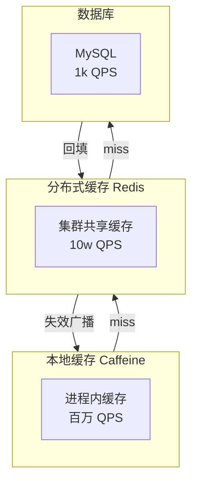

# 多级缓存热点 Key 治理深度

## 本文核心

**一句话摘要**：热点 Key 是多级缓存的"阿喀琉斯之踵"——发现 + 打散 + 本地缓存降级，三步闭环治理。

**核心机制链**：热点发现 → 热点打散 → 本地缓存降级 → 防雪崩 → 监控告警




## 一、热点 Key 的本质

### 1.1 什么是热点 Key

**定义**：在某一时间段内，被大量并发请求访问的缓存 Key。特征：访问频次远高于其他 Key（偏离度 > 10x）/ 单 Key QPS 触达单机瓶颈（Redis: 10w+ QPS, L1: 百万+ QPS）/ 过期后引发连锁反应（击穿 → DB 压力 → 雪崩）。

### 1.2 热点 Key 的来源

| 来源 | 示例 | 量级 |
|---|---|---|
| **大促商品** | 秒杀商品详情 | 爆款商品 QPS 10w+ / 千万级 |
| **社交热点** | 明星动态/热门话题 | 10 分钟内爆发 / 亿级曝光 |
| **金融规则** | 风控规则/汇率/费率 | 秒级变更，全量匹配 / 百万级 QPS |
| **广告配置** | 广告主配置/出价策略 | 实时竞价 / 千万级 QPS |

## 二、热点发现机制

### 2.1 监控指标

- Top K Key 列表 / 单 Key QPS / 命中率突降 (%) / 延迟突增 (ms) / 内存使用率 (%) / 连接数异常

### 2.2 热点发现方法

**方法 1：Redis 内置监控**
```bash
redis-cli --hotkeys
redis-cli info stats | grep keyspace
```

**方法 2：应用层埋点（Caffeine recordStats）**
```java
Cache<String, String> cache = Caffeine.newBuilder().recordStats().build();
CacheStats stats = cache.stats();
double hitRate = stats.hitRate();
```

**方法 3：日志分析**
```python
def find_hot_keys(log_file, threshold=1000):
    key_counts = Counter()
    for line in log_file:
        key = extract_key(line)
        key_counts[key] += 1
    return {k: v for k, v in key_counts.items() if v > threshold}
```

## 三、热点打散策略

### 3.1 一级打散：Key 维度分散

原始 Key：`product:1001:detail` → 打散后 Key：`product:1001:detail:L1`（本地缓存）/ `product:1001:detail:L2`（Redis 集群）

### 3.2 二级打散：请求维度分散

请求按 user_id % N → N 个子 Key：`product:1001:detail:shard-0`（user_id % 5 == 0）... `product:1001:detail:shard-4`（user_id % 5 == 4）

### 3.3 三级打散：时间维度分散

TTL 打散：原始 TTL = 30min → 打散 TTL = 30min + random(0, 10min)

## 四、本地缓存降级

### 4.1 降级策略

| 条件 | 动作 | 恢复策略 | 备注 |
|---|---|---|---|
| **L2 超时** | Redis 响应 > 50ms | 降级到 L1 + 直接查 DB | Redis 恢复后自动回切 |
| **L2 不可用** | 连接失败/超时 | L1 兜底 + 限流降级 | 健康检查自动恢复 |
| **L1 OOM** | 内存超限 | 清空 L1 + 限流 | JVM 重启后重建 |

### 4.2 降级实现

```java
public class CacheDegradeSwitch {
    private static final AtomicBoolean L2_DOWN = new AtomicBoolean(false);
    
    public static Object get(String key) {
        Object data = l1Cache.getIfPresent(key);
        if (data != null) return data;
        if (L2_DOWN.get()) {
            return db.queryWithRateLimit(key);
        }
        try {
            data = redis.get(key);
            if (data != null) {
                l1Cache.put(key, data);
                return data;
            }
        } catch (Exception e) {
            L2_DOWN.set(true);
            return db.queryWithRateLimit(key);
        }
        data = db.query(key);
        redis.setex(key, ttl, data);
        l1Cache.put(key, data);
        return data;
    }
}
```

## 五、防雪崩机制

### 5.1 TTL 随机化

```java
int baseTtl = 30 * 60;
int jitter = ThreadLocalRandom.current().nextInt(10 * 60);
int actualTtl = baseTtl + jitter;
redis.setex(key, actualTtl, value);
```

### 5.2 热点 Key 永不过期

```java
public class HotKeyCache {
    public void put(String key, Object value, int logicalTtl) {
        CacheValue cv = new CacheValue(value, System.currentTimeMillis() + logicalTtl);
        redis.setex(HOT_KEY_PREFIX + key, 0, cv);
    }
    
    public Object get(String key) {
        CacheValue cv = redis.get(HOT_KEY_PREFIX + key);
        if (cv == null) return null;
        if (System.currentTimeMillis() > cv.expireTime) {
            asyncRefresh(key);
        }
        return cv.value;
    }
}
```

## 六、核心带走

- **核心一句话**：热点 Key 治理 = 发现 + 打散 + 本地缓存降级
- **发现手段**：Redis --hotkeys / Caffeine recordStats / 日志分析
- **打散策略**：Key 维度分散 / 请求维度分散 / 时间维度分散
- **降级链路**：L2 故障 → L1 兜底 + 限流；L1+L2 故障 → 直接 DB + 限流
- **防雪崩**：TTL 随机化 + 热点 Key 永不过期 + 逻辑过期

## 💡 实战提示（Tips）

- **热点 Key 探测**：通过监控 QPS + Redis `keyspace_hits`/`keyspace_misses` 识别热点
- **降级策略**：Redis 不可用时直接查 DB + 本地缓存兜底，避免级联故障
- **TTL 随机化**：基础 TTL + 随机偏移是最简单有效的雪崩防护，优先做
- **互斥锁超时**：SETNX 锁必须设超时（30s），防止死锁
- **布隆过滤器部署**：生产环境用 RedisBloom 或本地 Guava BloomFilter，避免单点

## ❓ 你们可能会问（QA）

**Q1：布隆过滤器误判怎么办？**
A：误判率 ε = (1-e^(-kn/m))^k。m=10^9 bit, n=10^8, k=7 时 ε≈0.008%。误判只会多查一次 DB，不会导致数据不一致——可接受。

**Q2：互斥锁和逻辑过期怎么选？**
A：互斥锁实现简单但有延迟（等待重建）；逻辑过期无延迟但实现复杂（客户端需支持）。千万 QPS 选逻辑过期，百万以下选互斥锁。

**Q3：缓存雪崩和缓存击穿有什么区别？**
A：雪崩是**大面积 Key 同时失效**（全局），击穿是**单个热点 Key 过期**（单点）。

## 🤔 思考（开放问题/反思）

- **布隆过滤器的维护**：数据删除时如何更新布隆过滤器？——计数型布隆过滤器 vs 定时重建
- **逻辑过期的客户端实现**：如何保证客户端解析内嵌过期时间的准确性？时钟漂移怎么办？
- **自适应 TTL 的边界**：动态 TTL 是否会导致缓存命中率波动？如何稳定？

## ⚖️ Trade-off（代价与反方案）

| 方案 | 优势 | 代价 | 反方案 |
|---|---|---|---|
| **布隆过滤器+互斥锁** | 精准防护、误判可控 | 实现复杂、需维护过滤器 | 空值缓存+SETNX |
| **空值缓存** | 实现简单 | 存储无效数据、内存浪费 | 布隆过滤器 |
| **TTL 随机化** | 简单有效 | 仍有过期窗口 | 逻辑过期+永不过期 |
| **多级缓存** | 弹性扩展、热点隔离 | 架构复杂、一致性窗口 | 单级 Redis 集群 |

## 七、源码/关键路径

### 7.1 布隆过滤器关键路径

```
查询流程：
  1. 查询布隆过滤器（μs 级）
  2. 可能存在 → 查缓存
  3. 一定不存在 → 直接返回（拦截 DB 查询）

布隆过滤器参数：
  m = 位图大小（bit）
  n = 元素个数
  k = 哈希函数数
  ε = (1-e^(-kn/m))^k（假阳性率）
```

### 7.2 互斥锁关键路径

```
SETNX lock:key → 获取锁 → 查 DB → 写缓存 → del lock
  → 等待重试（50ms 间隔）→ 重新查询

关键路径延迟：
  SETNX + DB 查询 + 缓存写入 ≈ 5-50ms（取决于 DB 延迟）
```

## 八、业内惯例/生产实践

### 8.1 业内惯例

- **布隆过滤器误判率**：ε ≤ 0.1%（m=10^9 bit, n=10^8, k=7）
- **互斥锁超时**：30s（防止死锁）
- **TTL 随机化**：基础 TTL + random(0, 10min)
- **降级链路**：L2 故障 → L1 兜底 + 限流；L1+L2 故障 → 直接 DB + 限流
- **本地缓存选型**：Caffeine（Java 高并发首选）> Guava Cache > Ehcache

### 8.2 生产实践

| 场景 | 实践 | 效果 |
|---|---|---|
| **热点 Key 探测** | Redis --hotkeys + Caffeine recordStats | 提前发现热点 |
| **布隆过滤器部署** | RedisBloom 或本地 Guava BloomFilter | 拦截不存在的数据 |
| **降级演练** | 定期模拟 Redis 故障 | 验证降级链路 |
| **容量规划** | L1 maximumSize = 10000 | 防止 OOM |

## 📌 数据与事实声明

- 写于 2026-09-11，机制以 Redis 7.x / Caffeine 3.x 为基准
- 量级红线为行业认知口径（十万/百万/千万/亿），决策需按实际业务压测校准
- 典型场景为公开技术社区高频案例的匿名化复述
- 工具口径以 Redis 官方文档 + Caffeine GitHub README 为准

## 📚 参考资料

- Redis 官方文档：https://redis.io/documentation
- Caffeine GitHub：https://github.com/ben-manes/caffeine
- 《Redis 设计与实现》黄健宏
- 《大型网站技术架构：核心原理与案例分析》
- 《数据密集型应用系统设计》Martin Kleppmann