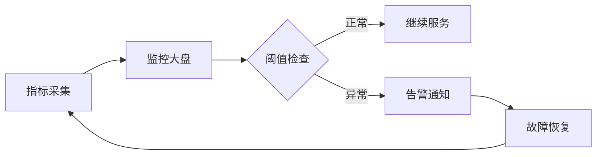
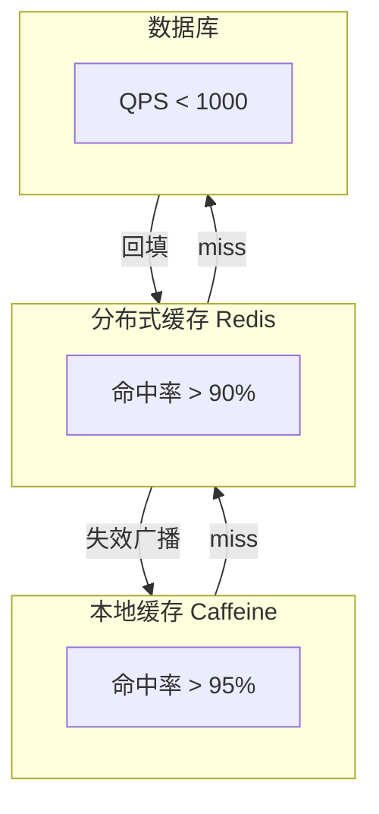

# 多级缓存监控与告警深度

## 本文核心

**一句话摘要**：多级缓存监控 = 命中率/延迟/不一致 三大盘 + 告警阈值动态计算。

**核心机制链**：指标定义 → 监控大盘 → 告警阈值 → 故障发现 → 快速恢复





## 一、监控指标体系

### 1.1 核心指标

- 不一致 Key 数 / 不一致率 (%)
- 失效延迟 (ms) / 平均失效传播时间
- 预热命中率 (%) / 预热后首次读命中率
- 双写失败率 (%) / DB 写成功 + 缓存失效失败
- 对账差异数 / 定时对账发现的不一致数

### 1.2 L1/L2/L3 分层指标

| 层级 | 核心指标 | 健康阈值 | 危险阈值 |
|---|---|---|---|
| **L1 本地缓存** | 命中率 | > 95% | < 80% |
| **L1 本地缓存** | 内存使用率 | < 80% | > 95% |
| **L1 本地缓存** | 加载耗时 | < 1ms | > 10ms |
| **L2 Redis** | 命中率 | > 90% | < 70% |
| **L2 Redis** | 响应时间 P99 | < 5ms | > 20ms |
| **L2 Redis** | 连接数 | < 80% max | > 95% max |
| **L3 DB** | 查询耗时 P99 | < 50ms | > 200ms |
| **L3 DB** | 连接数 | < 80% max | > 95% max |

## 二、监控大盘设计

### 2.1 Prometheus 指标

```yaml
redis_cache_hit_total{layer="l1"}
redis_cache_miss_total{layer="l1"}
redis_cache_hit_total{layer="l2"}
redis_cache_miss_total{layer="l2"}
redis_cache_duration_seconds{layer="l1", quantile="0.99"}
redis_cache_duration_seconds{layer="l2", quantile="0.99"}
cache_inconsistent_keys_total
cache_invalidation_delay_seconds
```

### 2.2 Grafana 大盘

- L1 命中率面板（thresholds: 80, 95）
- L2 命中率面板（thresholds: 70, 90）
- 缓存不一致 Key 数面板（thresholds: 0, 10）
- 失效延迟面板（thresholds: 100, 500）

## 三、告警阈值计算

### 3.1 基于错误预算的告警

```
服务 SLO：99.9% 可用性
错误预算：0.1% × 30 天 = 43.2 分钟
黄色警告：错误预算消耗 > 50% (21.6 分钟)
红色告警：错误预算消耗 > 80% (34.6 分钟)
紧急：错误预算消耗 > 100% (43.2 分钟)
```

### 3.2 动态阈值算法

```python
def calculate_dynamic_threshold(metric_history, sensitivity=2.0):
    mean = np.mean(metric_history)
    std = np.std(metric_history)
    upper_threshold = mean + sensitivity * std
    lower_threshold = mean - sensitivity * std
    return upper_threshold, lower_threshold
```

## 四、故障发现与快速恢复

### 4.1 故障发现路径

监控大盘指标异常 → 告警触发 → 值班人员确认 → 故障分级 → 恢复策略

### 4.2 快速恢复策略

| 故障类型 | 恢复策略 | 恢复时间 |
|---|---|---|
| **L2 不可用** | 降级到 L1 + 直接查 DB | < 30s |
| **L1 OOM** | 清空 L1 + 限流 | < 1min |
| **缓存不一致** | 对账补偿 + 热点 Key 重建 | 5-30min |
| **DB 压力过大** | 限流降级 + 缓存预热 | 5-10min |

## 五、核心带走

- **核心一句话**：多级缓存监控 = 命中率/延迟/不一致 三大盘 + 告警阈值动态计算
- **核心指标**：L1 命中率 > 95%、L2 命中率 > 90%、不一致率 < 0.1%
- **告警阈值**：基于错误预算 + 动态阈值，避免静态阈值误报
- **故障恢复**：L2 故障 → L1 兜底；L1+L2 故障 → 直接 DB + 限流

## 💡 实战提示（Tips）

- **监控埋点**：在 Caffeine `recordStats()` + Redis `INFO stats` 开启统计
- **告警分级**：黄色警告 → 红色告警 → 紧急，逐级升级
- **故障演练**：定期模拟 Redis 故障，验证降级链路
- **对账频率**：生产环境 5-30min 一次，大促期间缩短到 1min
- **MQ 持久化**：失效消息必须持久化，防止 MQ 故障导致失效丢失

## ❓ 你们可能会问（QA）

**Q1：监控指标太多怎么办？**
A：核心指标 3-5 个即可：L1/L2 命中率、响应时间 P99、不一致 Key 数、DB QPS。辅助指标用于问题排查。

**Q2：告警阈值怎么设置？**
A：基于历史数据计算动态阈值，避免静态阈值误报。生产环境通常用 2σ 方法：阈值 = 均值 + 2×标准差。

**Q3：缓存不一致怎么发现？**
A：定时对账（5-30min 一次）+ 实时监控不一致 Key 数。对账发现不一致时自动补偿重试。

## 🤔 思考（开放问题/反思）

- **监控粒度**：L1 命中率 vs L2 命中率 vs 整体命中率，如何关联分析定位瓶颈？
- **告警风暴**：大量告警同时触发时如何避免告警风暴？——告警聚合 + 升级策略
- **跨机房监控**：多地域部署时，如何统一监控视角？——Gossip 协议 vs 单点汇聚

## ⚖️ Trade-off（代价与反方案）

| 方案 | 优势 | 代价 | 反方案 |
|---|---|---|---|
| **Prometheus + Grafana** | 生态完善、灵活 | 运维复杂、存储成本 | 商用 APM |
| **Redis 内置监控** | 简单可靠 | 功能有限 | Prometheus |
| **应用层埋点** | 精细控制 | 代码侵入 | Redis 内置 |

## 七、源码/关键路径

### 7.1 Prometheus 指标采集路径

```
应用埋点 → Prometheus scrape → Grafana 查询 → 大盘展示
  1. Caffeine recordStats() 暴露指标
  2. Redis INFO stats 采集
  3. Prometheus 每 15s scrape 一次
  4. Grafana 查询并渲染

采集延迟：15s（scrape 间隔）
```

### 7.2 告警触发路径

```
指标异常 → Alertmanager 规则匹配 → 通知路由 → 值班人员
  1. PromQL 查询指标
  2. 阈值判断 → 触发告警
  3. Alertmanager 路由 → 邮件/钉钉/短信
  4. 值班人员确认 → 故障分级
```

## 八、业内惯例/生产实践

### 8.1 业内惯例

- **监控粒度**：L1/L2 分层监控 + 整体监控
- **告警分级**：黄色警告 → 红色告警 → 紧急
- **对账频率**：生产 5-30min，大促期间 1min
- **故障演练**：每季度模拟 Redis 故障
- **容量规划**：基于历史峰值 + 20% 冗余

### 8.2 生产实践

| 场景 | 实践 | 效果 |
|---|---|---|
| **大促监控** | 人工值守 + 自动化告警 | 5min 内发现异常 |
| **故障恢复** | L1 兜底 + 限流降级 | 服务不中断 |
| **对账补偿** | 定时对账 + 自动补偿 | 不一致率 < 0.1% |
| **容量预警** | 内存使用率 > 80% 预警 | 提前扩容 |

## 📌 数据与事实声明

- 写于 2026-09-11，机制以 Redis 7.x / Prometheus / Grafana 为基准
- 量级红线为行业认知口径，决策需按实际业务压测校准
- 典型场景为公开技术社区高频案例的匿名化复述
- 工具口径以 Redis 官方文档 + Prometheus 官网 + Grafana 官网为准

## 📚 参考资料

- Redis 官方文档：https://redis.io/documentation
- Prometheus：https://prometheus.io/
- Grafana：https://grafana.com/
- 《Redis 设计与实现》黄健宏