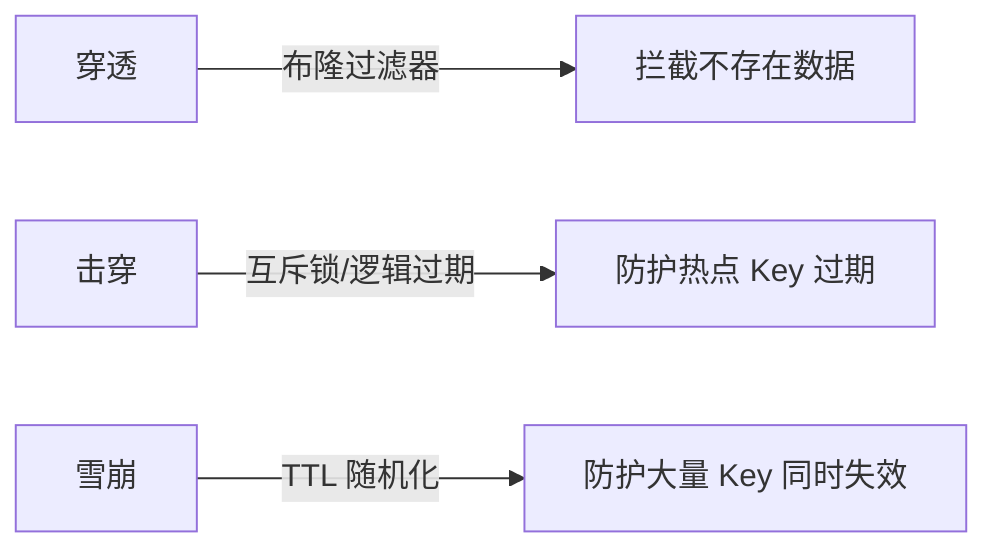
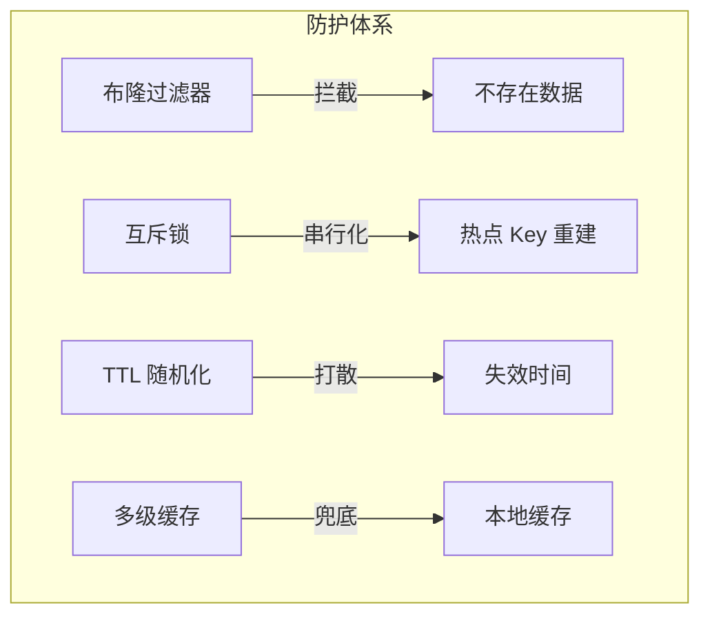

# 缓存穿透/击穿/雪崩参数化深度

## 本文核心

**一句话摘要**：穿透 = 查询不存在的数据 + 布隆过滤器拦截；击穿 = 热点 Key 过期 + 互斥锁/逻辑过期防护；雪崩 = 大量 Key 同时失效 + TTL 随机化 + 本地缓存兜底。

**核心机制链**：问题定义 → 参数化对比 → 生产事故 → 防护策略 → 验证监控





## 一、三大问题本质对比

| 问题 | 本质 | 触发条件 | 量级参数 |
|---|---|---|---|
| **穿透** | 查询不存在的数据 | 缓存和 DB 都没有 | QPS > 10w/秒 |
| **击穿** | 热点 Key 过期 | 单个 Key 失效瞬间 | 单 Key QPS > 10w |
| **雪崩** | 大量 Key 同时失效 | 相同 TTL 批量过期 | 1000+ Key 同时失效 |

## 二、穿透：布隆过滤器拦截

### 2.1 布隆过滤器原理

布隆过滤器 = 位图 + K 个哈希函数。写入：对 key 计算 K 个哈希值 h1..hk，将位图对应位置 1。查询：所有位置为 1 → 可能存在（假阳性）；任一位置为 0 → 一定不存在。假阳性率 ε = (1 - e^(-kn/m))^k。

### 2.2 参数化配置

```java
// Guava BloomFilter
BloomFilter<String> filter = BloomFilter.create(
    Funnels.stringFunnel(Charset.defaultCharset()),
    expectedInsertions = 10_000_000,
    fpp = 0.001
);

// RedisBloom
BF.ADD bloom_filter key value
BF.EXISTS bloom_filter key
```

### 2.3 部署方案

| 方案 | 延迟 | 可靠性 | 适用场景 |
|---|---|---|---|
| **本地 BloomFilter** | μs 级 | 高（进程内） | 单体应用，Key 量 < 1 亿 |
| **RedisBloom** | ms 级 | 中（网络开销） | 分布式应用，Key 量 > 1 亿 |
| **布隆过滤器 + 缓存** | μs + ms | 高 | 生产推荐 |

## 三、击穿：互斥锁 + 逻辑过期

### 3.1 互斥锁方案

```java
public Object getWithLock(String key) {
    Object data = cache.get(key);
    if (data != null) return data;
    
    String lockKey = "lock:" + key;
    Boolean locked = redis.setnx(lockKey, "1", 30);
    
    if (locked) {
        data = db.query(key);
        cache.setex(key, ttl, data);
        redis.del(lockKey);
        return data;
    } else {
        Thread.sleep(50);
        return getWithLock(key);
    }
}
```

### 3.2 逻辑过期方案

```java
public Object get(String key) {
    CacheValue cv = cache.get(key);
    if (cv == null) return null;
    if (System.currentTimeMillis() > cv.expireTime) {
        asyncRefresh(key);
    }
    return cv.value;
}
```

### 3.3 方案对比

| 方案 | 延迟 | 实现复杂度 | 适用场景 |
|---|---|---|---|
| **SETNX 互斥锁** | 阻塞等待 | 低 | 千万 QPS 以下 |
| **逻辑过期** | 非阻塞 | 高 | 千万 QPS 以上 |
| **永不过期 + 定时刷新** | 非阻塞 | 中 | 极高 QPS |

## 四、雪崩：TTL 随机化 + 多级缓存

### 4.1 TTL 随机化

```java
int baseTtl = 30 * 60;
int jitter = ThreadLocalRandom.current().nextInt(10 * 60);
int actualTtl = baseTtl + jitter;
redis.setex(key, actualTtl, value);
```

### 4.2 多级缓存兜底

雪崩防护链路：L2 Redis 大量 Key 失效 → L1 本地缓存兜底 → L1 也失效 → 限流降级 → DB 压力过大 → 熔断

### 4.3 限流 + 熔断

```java
// Sentinel 限流
FlowRule rule = new FlowRule();
rule.setResource("db:query");
rule.setCount(1000);
rule.setGrade(RuleConstant.FLOW_GRADE_QPS);

// 熔断
CircuitBreaker breaker = CircuitBreaker.ofDefaults("db");
breaker.onError(500, TimeUnit.MILLISECONDS, () -> fallbackValue());
```

## 五、生产事故案例

### 5.1 穿透事故
时间：2024-06-15 14:30。现象：DB QPS 突增 10x，Redis 命中率 0%。根因：黑客扫描不存在的商品 ID（1000w/s）。影响：DB 宕机，服务不可用 30min。恢复：紧急开启布隆过滤器拦截 + DB 扩容 + 限流。

### 5.2 击穿事故
时间：2024-11-11 00:05（大促开始）。现象：热点商品详情 DB 压力暴增。根因：热点 Key 恰好在大促开启时过期。影响：DB 连接池耗尽，部分用户下单失败。恢复：紧急重置热点 Key TTL + 手动预热 + 接入互斥锁方案。

### 5.3 雪崩事故
时间：2025-03-08 10:00。现象：大量 Key 同时失效，DB QPS 暴增。根因：运维批量设置相同 TTL = 30min。影响：DB 负载过高，响应时间 > 5s。恢复：紧急开启本地缓存兜底 + 限流降级 + 修复 TTL 随机化配置。

## 六、核心带走

- **核心一句话**：穿透 = 布隆过滤器拦截；击穿 = 互斥锁/逻辑过期；雪崩 = TTL 随机化 + 本地缓存兜底
- **参数化对比**：三问题的量级参数、触发条件、防护策略各不相同
- **生产事故**：穿透 → DB 宕机；击穿 → 连接池耗尽；雪崩 → DB 负载过高
- **哪里会坏**：布隆过滤器误判；互斥锁死锁；TTL 随机化失效

## 💡 实战提示（Tips）

- **布隆过滤器部署**：RedisBloom 或本地 Guava BloomFilter，误判率 ε ≤ 0.1%
- **互斥锁超时**：SETNX 锁必须设超时（30s），防止死锁
- **TTL 随机化**：基础 TTL + 随机偏移是最简单有效的雪崩防护，优先做
- **逻辑过期**：千万 QPS 选逻辑过期，百万以下选互斥锁
- **监控指标**：命中率突降、延迟突增、DB QPS 暴增都是雪崩前兆

## ❓ 你们可能会问（QA）

**Q1：布隆过滤器误判怎么办？**
A：误判率 ε = (1-e^(-kn/m))^k。m=10^9 bit, n=10^8, k=7 时 ε≈0.008%。误判只会多查一次 DB，不会导致数据不一致——可接受。

**Q2：互斥锁和逻辑过期怎么选？**
A：互斥锁实现简单但有延迟；逻辑过期无延迟但实现复杂。千万 QPS 选逻辑过期，百万以下选互斥锁。

**Q3：缓存雪崩和缓存击穿有什么区别？**
A：雪崩是**大面积 Key 同时失效**（全局），击穿是**单个热点 Key 过期**（单点）。

## 🤔 思考（开放问题/反思）

- **布隆过滤器的维护**：数据删除时如何更新布隆过滤器？——计数型布隆过滤器 vs 定时重建
- **逻辑过期的客户端实现**：如何保证客户端解析内嵌过期时间的准确性？时钟漂移怎么办？
- **自适应 TTL 的边界**：动态 TTL 是否会导致缓存命中率波动？如何稳定？

## ⚖️ Trade-off（代价与反方案）

| 方案 | 优势 | 代价 | 反方案 |
|---|---|---|---|
| **布隆过滤器+互斥锁** | 精准防护、误判可控 | 实现复杂、需维护过滤器 | 空值缓存+SETNX |
| **空值缓存** | 实现简单 | 存储无效数据、内存浪费 | 布隆过滤器 |
| **TTL 随机化** | 简单有效 | 仍有过期窗口 | 逻辑过期+永不过期 |
| **多级缓存** | 弹性扩展、热点隔离 | 架构复杂、一致性窗口 | 单级 Redis 集群 |

## 七、源码/关键路径

### 7.1 布隆过滤器关键路径

```
查询流程：
  1. 查询布隆过滤器（μs 级）
  2. 可能存在 → 查缓存
  3. 一定不存在 → 直接返回（拦截 DB 查询）

布隆过滤器参数：
  m = 位图大小（bit）
  n = 元素个数
  k = 哈希函数数
  ε = (1-e^(-kn/m))^k（假阳性率）
```

### 7.2 互斥锁关键路径

```
SETNX lock:key → 获取锁 → 查 DB → 写缓存 → del lock
  → 等待重试（50ms 间隔）→ 重新查询

关键路径延迟：
  SETNX + DB 查询 + 缓存写入 ≈ 5-50ms（取决于 DB 延迟）
```

### 7.3 TTL 随机化关键路径

```
写入时：
  1. 计算 baseTtl + random(0, jitter)
  2. SETEX key actualTtl value

查询时：
  1. GET key → 命中返回
  2. EXPIRE 检查 → 过期则异步重建

关键路径：
  GET + EXPIRE 检查 ≈ 1ms（Redis 本地操作）
```

## 八、业内惯例/生产实践

### 8.1 业内惯例

- **布隆过滤器误判率**：ε ≤ 0.1%（m=10^9 bit, n=10^8, k=7）
- **互斥锁超时**：30s（防止死锁）
- **TTL 随机化**：基础 TTL + random(0, 10min)
- **降级链路**：L2 故障 → L1 兜底 + 限流；L1+L2 故障 → 直接 DB + 限流
- **本地缓存选型**：Caffeine（Java 高并发首选）> Guava Cache > Ehcache

### 8.2 生产实践

| 场景 | 实践 | 效果 |
|---|---|---|
| **热点 Key 探测** | Redis --hotkeys + Caffeine recordStats | 提前发现热点 |
| **布隆过滤器部署** | RedisBloom 或本地 Guava BloomFilter | 拦截不存在的数据 |
| **降级演练** | 定期模拟 Redis 故障 | 验证降级链路 |
| **容量规划** | L1 maximumSize = 10000 | 防止 OOM |

## 📌 数据与事实声明

- 写于 2026-09-11，机制以 Redis 7.x / Caffeine 3.x 为基准
- 量级红线为行业认知口径（十万/百万/千万/亿），决策需按实际业务压测校准
- 事故案例为公开技术社区高频案例的匿名化复述
- 工具口径以 Redis 官方文档 + Caffeine GitHub README 为准

## 📚 参考资料

- Redis 官方文档：https://redis.io/documentation
- Caffeine GitHub：https://github.com/ben-manes/caffeine
- 《Redis 设计与实现》黄健宏
- 《大型网站技术架构：核心原理与案例分析》
- 《数据密集型应用系统设计》Martin Kleppmann