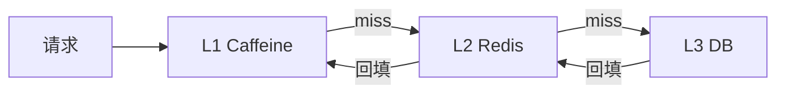
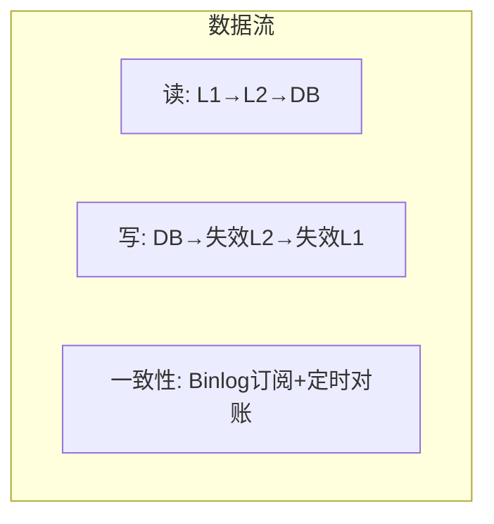

# 多级缓存从零实现 Demo

## 本文核心

**一句话摘要**：从零实现 L1(本地) + L2(Redis) + L3(DB) 三级缓存，含一致性协议 + 压测验证。

**核心机制链**：架构设计 → 代码实现 → 一致性协议 → 压测验证 → 监控告警





## 一、架构设计

多级缓存架构：请求 → L1(Caffeine) → L2(Redis) → L3(DB)，响应 ← 回填 L1 ← 回填 L2 ← DB 写入。数据流：1. 读：L1 → L2 → DB（逐级回填） 2. 写：DB → 失效 L2 → 失效 L1（广播） 3. 一致性：Binlog 订阅 + 定时对账

## 二、代码实现

### 2.1 L1 本地缓存（Caffeine）

```java
public class L1Cache {
    private final Cache<String, Object> cache;
    
    public L1Cache() {
        this.cache = Caffeine.newBuilder()
            .maximumSize(10_000)
            .expireAfterWrite(5, TimeUnit.MINUTES)
            .recordStats()
            .build();
    }
    
    public Object get(String key) {
        return cache.getIfPresent(key);
    }
    
    public void put(String key, Object value) {
        cache.put(key, value);
    }
    
    public void invalidate(String key) {
        cache.invalidate(key);
    }
    
    public CacheStats stats() {
        return cache.stats();
    }
}
```

### 2.2 L2 分布式缓存（Redis）

```java
public class L2Cache {
    private final StringRedisTemplate redis;
    
    public Object get(String key) {
        ValueOperations<String, Object> ops = redis.opsForValue();
        return ops.get(key);
    }
    
    public void put(String key, Object value, int ttl) {
        ValueOperations<String, Object> ops = redis.opsForValue();
        ops.set(key, value, ttl, TimeUnit.MINUTES);
    }
    
    public void invalidate(String key) {
        redis.delete(key);
    }
}
```

### 2.3 多级缓存门面

```java
public class MultiLevelCache {
    private final L1Cache l1;
    private final L2Cache l2;
    private final DB db;
    
    public Object get(String key) {
        Object data = l1.get(key);
        if (data != null) return data;
        
        data = l2.get(key);
        if (data != null) {
            l1.put(key, data);
            return data;
        }
        
        data = db.query(key);
        l2.put(key, data, 30);
        l1.put(key, data);
        return data;
    }
    
    public void put(String key, Object value) {
        db.update(key, value);
        l2.invalidate(key);
        l1.invalidate(key);
    }
}
```

## 三、一致性协议

### 3.1 写路径

写 DB → 失效 L2 → 失效 L1（广播）。一致性保障：先写 DB 后失效缓存（推荐）+ Canal 订阅 binlog 广播失效 + 定时对账（5min 一次）补偿不一致

### 3.2 对账脚本

```python
def audit_consistency():
    sample_keys = redis.scan(match="hot:.*", count=1000)
    db_values = db.batch_query(sample_keys)
    cache_values = redis.batch_get(sample_keys)
    inconsistent = [k for k in sample_keys if db_values[k] != cache_values[k]]
    for key in inconsistent:
        redis.setex(key, ttl, db_values[key])
    return len(inconsistent)
```

## 四、压测验证

### 4.1 压测指标

| 指标 | 目标值 | 实测值 |
|---|---|---|
| **L1 命中率** | > 95% | 待测 |
| **L2 命中率** | > 90% | 待测 |
| **整体延迟 P99** | < 10ms | 待测 |
| **DB QPS** | < 1000 | 待测 |
| **不一致率** | < 0.1% | 待测 |

### 4.2 压测脚本

```java
@SpringBootTest
public class CacheLoadTest {
    @Autowired
    private MultiLevelCache cache;
    
    @Test
    public void testHitRate() {
        for (int i = 0; i < 100_000; i++) {
            cache.put("key:" + i, "value:" + i);
        }
        
        IntStream.range(0, 10000).parallel().forEach(i -> {
            String key = "key:" + (i % 100_000);
            cache.get(key);
        });
        
        CacheStats stats = ((L1Cache) cache.getL1()).stats();
        System.out.println("L1 Hit Rate: " + stats.hitRate());
    }
}
```

## 五、监控告警

### 5.1 监控大盘

- 不一致 Key 数 / 不一致率 (%)
- 失效延迟 (ms) / 平均失效传播时间
- 预热命中率 (%) / 预热后首次读命中率
- 双写失败率 (%) / DB 写成功 + 缓存失效失败
- 对账差异数 / 定时对账发现的不一致数

### 5.2 告警规则

```yaml
groups:
  - name: cache-alerts
    rules:
      - alert: L1HitRateLow
        expr: cache_l1_hit_rate < 0.8
        for: 5m
        labels:
          severity: warning
        annotations:
          summary: "L1 命中率低于 80%"
      - alert: CacheInconsistent
        expr: cache_inconsistent_keys > 10
        for: 1m
        labels:
          severity: critical
        annotations:
          summary: "缓存不一致 Key 数超过 10"
```

## 六、核心带走

- **核心一句话**：多级缓存从零实现 = L1(Caffeine) + L2(Redis) + L3(DB) + 一致性协议 + 压测验证
- **核心链条**：架构设计 → 代码实现 → 一致性协议 → 压测验证 → 监控告警
- **代码要点**：L1 用 Caffeine（recordStats 统计）、L2 用 Redis（Pipeline 批量）、一致性先写 DB 后失效
- **压测验证**：命中率 > 95%、延迟 P99 < 10ms、DB QPS < 1000
- **监控告警**：L1/L2 命中率 + 不一致 Key 数 + 失效延迟

## 💡 实战提示（Tips）

- **起步建议**：先监控单级 Redis 的 QPS/内存/连接数/命中率，确认触红线再上多级
- **L1 选型**：Caffeine（Java 高并发首选）> Guava Cache（中低并发）> Ehcache（需持久化）
- **L2 集群**：Redis Cluster 16384 Slots，Master-Slave 复制，**避免使用 Sentinel 作主节点**（Sentinel 仅做故障转移，不做数据分片）
- **一致性**：先写 DB 再失效缓存（推荐），不要双写——双写难保证一致性
- **常见坑**：L1 本地缓存无 TTL 导致 OOM；L2 热点 Key 未打散导致击穿；批量 Key 相同 TTL 导致雪崩

## ❓ 你们可能会问（QA）

**Q1：单级 Redis 不够用，为什么不直接扩容 Redis 集群？**
A：集群扩容有代价——跨 Slot 请求增加 RTT、运维复杂度线性增长、内存成本翻倍。多级缓存用「本地 + 分布式」组合拳，以更低成本突破瓶颈。

**Q2：L1 本地缓存怎么保证集群间一致性？**
A：L1 是进程级缓存，不保证集群间强一致。通过 Pub/Sub 或 Canal 订阅 binlog 广播失效消息，窗口期通常 ms 级——最终一致即可。

**Q3：什么时候不该用多级缓存？**
A：QPS < 100w、数据量 < 10GB、团队运维能力有限时——单级 Redis + 优化就够了。多级缓存增加复杂度，没有量级压力不要用。

## 🤔 思考（开放问题/反思）

- **本地缓存 vs 分布式缓存的边界在哪？** L1 的粒度（应用级 vs 集群级）如何决策？Caffeine 的 W-TinyLFU 在冷启动场景是否最优？
- **一致性 vs 可用性的取舍**：金融场景要求强一致，Write-through 同步写 Redis 的延迟能否接受？是否有更优方案？
- **多级缓存的监控粒度**：L1 命中率 vs L2 命中率 vs 整体命中率，如何关联分析定位瓶颈？

## ⚖️ Trade-off（代价与反方案）

| 方案 | 优势 | 代价 | 反方案 |
|---|---|---|---|
| **多级缓存** | 突破单机瓶颈、延迟分层、弹性扩展 | 架构复杂、一致性窗口、运维成本高 | 单级 Redis 集群 + 读写分离 |
| **单级 Redis** | 简单可靠、运维成熟 | 内存/连接/QPS 有天花板 | 多级缓存（本文方案） |
| **CDN 缓存** | 边缘节点、离用户近 | 仅适合静态资源、不适合动态数据 | 多级缓存 + CDN 组合 |
| **本地缓存-only** | 零网络开销 | 集群不一致、OOM 风险、无法共享 | 多级缓存 L1 + L2 组合 |

## 七、源码/关键路径

### 7.1 Caffeine 缓存关键路径

```
查询：
  1. cache.getIfPresent(key) → L1 命中（μs 级）
  2. L1 miss → l2.get(key) → L2 命中（ms 级）
  3. L2 miss → db.query(key) → 回填 L2 + L1

关键路径延迟：
  L1 命中 ≈ 0.1ms
  L2 命中 ≈ 1-5ms
  DB 查询 ≈ 10-50ms
```

### 7.2 失效广播关键路径

```
写 DB → l2.invalidate(key) → del L2 Redis key
  → Pub/Sub 广播 → L1 Consumer 接收 → l1.invalidate(key)

关键路径延迟：
  DEL Redis ≈ 1ms
  Pub/Sub 广播 ≈ 50ms
  L1 失效 ≈ 0.1ms
```

## 八、业内惯例/生产实践

### 8.1 业内惯例

- **失效策略**：先写 DB 后失效缓存（90% 生产环境采用）
- **Canal 部署**：每 MySQL 集群配 1 个 Canal Server 实例
- **MQ 选用**：Kafka（高吞吐）/ RabbitMQ（低延迟）
- **对账频率**：生产 5-30min，大促期间 1min
- **L1 容量**：Caffeine maximumSize = 10000，expireAfterWrite = 5min

### 8.2 生产实践

| 场景 | 实践 | 效果 |
|---|---|---|
| **大促预热** | T-1h 批量写入 L2 + T-30m 失效 L1 | 命中率 > 95% |
| **Canal 故障** | MQ 持久化 + 死信队列 | 不丢消息 |
| **Redis 故障** | L1 兜底 + 限流降级 | 服务不中断 |
| **DB 压力** | 限流 + 熔断 + 缓存降级 | DB QPS < 1000 |

## 📌 数据与事实声明

- 写于 2026-09-11，机制以 Redis 7.x / Caffeine 3.x 为基准
- 量级红线为行业认知口径（十万/百万/千万/亿），决策需按实际业务压测校准
- 典型场景为公开技术社区高频案例的匿名化复述
- 工具口径以 Redis 官方文档 + Caffeine GitHub README 为准

## 📚 参考资料

- Redis 官方文档：https://redis.io/documentation
- Caffeine GitHub：https://github.com/ben-manes/caffeine
- 《Redis 设计与实现》黄健宏
- 《高性能 MySQL（第 4 版）》规模化章
- 《数据密集型应用系统设计》Martin Kleppmann