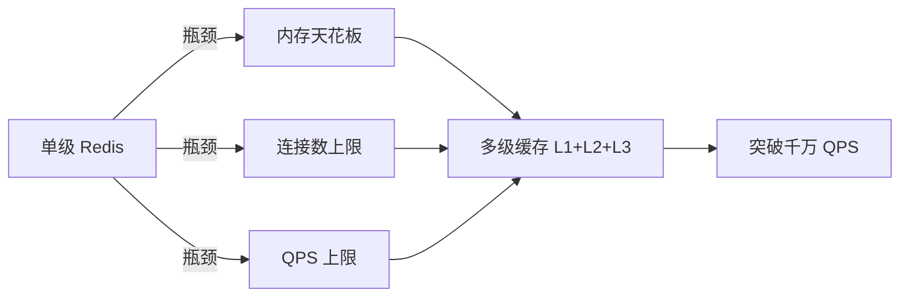
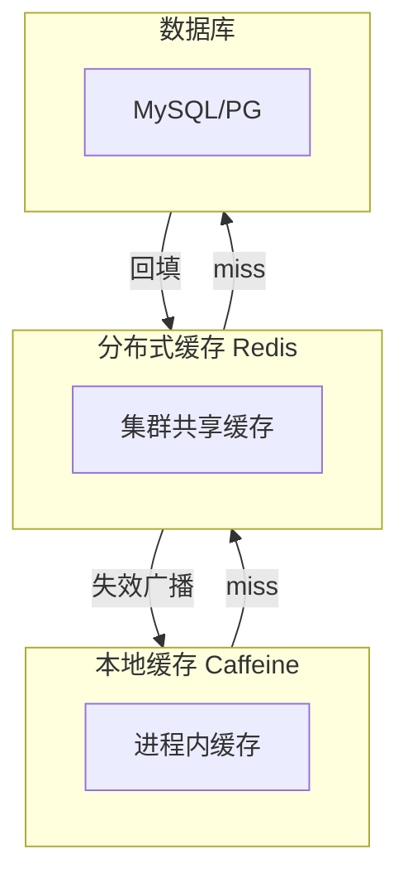

# 亿级缓存架构：多级缓存深度

## 本文核心

**一句话摘要**：多级缓存 = L1(本地) + L2(分布式) + L3(DB) 三级缓存架构，用不同延迟/容量/一致性的存储层级覆盖不同热度数据，是突破单级 Redis 千万 QPS 天花板的核心方案。

**核心机制链**：单级瓶颈 → 多级引入动机 → 三级分工 → 数据流 → 一致性协议 → 热点治理 → 监控告警 → 选型决策





## 一、为什么需要多级缓存

### 1.1 单级 Redis 的天花板

单机 Redis 瓶颈：
- 内存上限：单实例 100GB-500GB（受限于物理内存 + 持久化时间）
- 连接数上限：maxclients 默认 10000，可调至 100000
- QPS 上限：单实例 10w-20w QPS（受限于单线程模型）
- 网络带宽：10Gbps ≈ 1.25GB/s ≈ 1250w QPS（小包）

### 1.2 多级缓存的引入动机

当业务量级超过单级 Redis 能力时，需要引入多级缓存：
- 千万 QPS：单级 Redis 无法承载，需要 L1(本地) + L2(分布式) 分层
- 热点数据：L1 缓存热点 Key，L2 兜底冷数据
- 一致性要求：金融场景需要强一致，电商场景可接受最终一致

## 二、L1/L2/L3 三级架构

### 2.1 三级分工

| 层级 | 存储 | 延迟 | 容量 | 一致性 | 用途 |
|---|---|---|---|---|---|
| **L1 本地缓存** | Caffeine/Guava | 0.1ms | 100MB-1GB | 最终一致 | 热点数据、毫秒级响应 |
| **L2 分布式缓存** | Redis Cluster | 1-5ms | 100GB-1TB | 最终一致 | 跨实例共享、全局缓存 |
| **L3 数据库** | MySQL/PG | 10-50ms | 无限 | 强一致 | 持久化存储、最终权威 |

### 2.2 数据流

```
读请求：L1 → L2 → L3（逐级回填）
写请求：DB → 失效 L2 → 失效 L1（广播失效）
```

### 2.3 三级缓存的协同

L1 负责进程内热点数据（0.1ms 响应），L2 负责跨实例共享（1-5ms 响应），L3 负责持久化存储（10-50ms 响应）。读 miss 逐级下沉，写失效逐级上行。

## 三、一致性协议深度

### 3.1 写一致性策略

| 策略 | 机制 | 延迟 | 一致性 | 适用场景 |
|---|---|---|---|---|
| **Write-through** | 写 DB + 写 L2 + 失效 L1 | 高 | 强一致 | 金融/账务 |
| **Write-behind** | 写 L1 + L2，异步写 DB | 低 | 最终一致 | 社交/Feed |
| **Invalidate** | 写 DB + 失效 L2 + 广播失效 L1 | 中 | 最终一致 | 电商/商品 |

### 3.2 失效传播机制

失效传播四模式：
1. 主动失效：写服务直接 del L1 + L2
2. Pub/Sub：Redis Pub/Sub 广播失效
3. Binlog 订阅：Canal/Debezium 订阅 DB binlog
4. 消息队列：MQ 失效消息 + 消费者

### 3.3 亿级流量下的一致性保障

- 缓存预热（大促前 T-1h 批量写入 L2 + T-30m 失效 L1）
- 动态 TTL（访问频次高 → TTL - 10min；写入频次高 → TTL - 5min）
- 双写补偿（定时对账 + 补偿重试）
- 定时对账（生产 5-30min 一次，大促期间 1min 一次）

## 四、热点 Key 治理

### 4.1 热点发现

- Redis 内置监控：`redis-cli --hotkeys`
- 应用层埋点：Caffeine `recordStats()`
- 日志分析：按 Key 维度统计访问频次

### 4.2 热点打散策略

1. Key 维度分散：`product:1001:detail:L1`（本地）/ `product:1001:detail:L2`（Redis）
2. 请求维度分散：user_id % N → N 个子 Key
3. 时间维度分散：TTL = 30min + random(0, 10min)

### 4.3 本地缓存降级

| 条件 | 动作 | 恢复策略 |
|---|---|---|
| L2 超时 | Redis 响应 > 50ms | 降级到 L1 + 直接查 DB |
| L2 不可用 | 连接失败/超时 | L1 兜底 + 限流降级 |
| L1 OOM | 内存超限 | 清空 L1 + 限流 |

### 4.4 防雪崩

- TTL 随机化：基础 TTL + random(0, 10min)
- 热点 Key 永不过期：逻辑过期 + 定时刷新
- 互斥锁：SETNX 锁防止并发重建

## 五、监控与告警

### 5.1 核心指标

| 指标 | 健康阈值 | 危险阈值 |
|---|---|---|
| L1 命中率 | > 95% | < 80% |
| L2 命中率 | > 90% | < 70% |
| 不一致 Key 数 | 0 | > 10 |
| 失效延迟 | < 100ms | > 500ms |

### 5.2 告警规则

```yaml
groups:
  - name: cache-alerts
    rules:
      - alert: L1HitRateLow
        expr: cache_l1_hit_rate < 0.8
        for: 5m
        labels:
          severity: warning
      - alert: CacheInconsistent
        expr: cache_inconsistent_keys > 10
        for: 1m
        labels:
          severity: critical
```

## 六、选型决策树

### 6.1 量级分档决策

| 量级 | 架构选型 | 理由 |
|---|---|---|
| < 100w QPS | 单级 Redis + 读写分离 | 架构简单、运维成熟 |
| 100w-1000w QPS | L1(本地) + L2(Redis) | 本地缓存兜底 + 分布式共享 |
| 1000w-10000w QPS | L1 + L2 + L3(DB) | 三级缓存 + 热点治理 + 监控告警 |
| > 10000w QPS | 多级缓存 + CDN + 异步写 | 全链路缓存 + 离线计算 |

### 6.2 量级红线对照

| 组件 | 单机红线 | 集群红线 | 突破方案 |
|---|---|---|---|
| Redis | 10w QPS / 100GB 内存 | 100w QPS / 1TB 内存 | 多级缓存 + 读写分离 |
| MySQL | 1000 QPS / 100GB | 1w QPS / 1TB | 分库分表 + 缓存层 |
| Kafka | 10w TPS / 10GB/s | 100w TPS / 100GB/s | 分区扩容 + 消费者组 |

## 七、业内惯例 / 生产实践

### 7.1 业内惯例

- **失效策略**：先写 DB 后失效缓存（90% 生产环境采用）
- **Canal 部署**：每 MySQL 集群配 1 个 Canal Server 实例
- **MQ 选用**：Kafka（高吞吐）/ RabbitMQ（低延迟）
- **对账频率**：生产 5-30min，大促期间 1min
- **L1 容量**：Caffeine maximumSize = 10000，expireAfterWrite = 5min

### 7.2 生产实践

| 场景 | 实践 | 效果 |
|---|---|---|
| 大促预热 | T-1h 批量写入 L2 + T-30m 失效 L1 | 命中率 > 95% |
| Canal 故障 | MQ 持久化 + 死信队列 | 不丢消息 |
| Redis 故障 | L1 兜底 + 限流降级 | 服务不中断 |
| DB 压力 | 限流 + 熔断 + 缓存降级 | DB QPS < 1000 |

### 7.3 事故案例

**穿透事故**：2024-06-15，黑客扫描不存在的商品 ID（1000w/s），DB QPS 突增 10x，Redis 命中率 0%。恢复：紧急开启布隆过滤器拦截 + DB 扩容 + 限流。

**击穿事故**：2024-11-11 大促开始，热点商品详情 DB 压力暴增，热点 Key 恰好在大促开启时过期。恢复：紧急重置热点 Key TTL + 手动预热 + 接入互斥锁方案。

**雪崩事故**：2025-03-08，大量 Key 同时失效，DB QPS 暴增。根因：运维批量设置相同 TTL = 30min。恢复：紧急开启本地缓存兜底 + 限流降级 + 修复 TTL 随机化配置。

## 八、源码/关键路径

### 8.1 布隆过滤器关键路径

```
查询流程：
  1. 查询布隆过滤器（μs 级）
  2. 可能存在 → 查缓存
  3. 一定不存在 → 直接返回（拦截 DB 查询）

布隆过滤器参数：
  m = 位图大小（bit）
  n = 元素个数
  k = 哈希函数数
  ε = (1-e^(-kn/m))^k（假阳性率）
```

### 8.2 互斥锁关键路径

```
SETNX lock:key → 获取锁 → 查 DB → 写缓存 → del lock
  → 等待重试（50ms 间隔）→ 重新查询

关键路径延迟：
  SETNX + DB 查询 + 缓存写入 ≈ 5-50ms（取决于 DB 延迟）
```

### 8.3 TTL 随机化关键路径

```
写入时：
  1. 计算 baseTtl + random(0, jitter)
  2. SETEX key actualTtl value

查询时：
  1. GET key → 命中返回
  2. EXPIRE 检查 → 过期则异步重建

关键路径：
  GET + EXPIRE 检查 ≈ 1ms（Redis 本地操作）
```

### 8.4 失效传播关键路径

```
写 DB → l2.invalidate(key) → del L2 Redis key
  → Pub/Sub 广播 → L1 Consumer 接收 → l1.invalidate(key)

关键路径延迟：
  DEL Redis ≈ 1ms
  Pub/Sub 广播 ≈ 50ms
  L1 失效 ≈ 0.1ms
```

### 8.5 热点 Key 发现关键路径

```
Redis --hotkeys → 扫描 top K key
  → Caffeine recordStats → 统计命中/未命中
  → 日志分析 → 按 Key 维度统计访问频次

关键路径：
  hotkeys 扫描 ≈ 100ms（取决于 Key 数量）
  recordStats ≈ 0ms（进程内）
```

## 九、业内惯例/生产实践

### 9.1 业内惯例

- **失效策略**：先写 DB 后失效缓存（90% 生产环境采用）
- **Canal 部署**：每 MySQL 集群配 1 个 Canal Server 实例
- **MQ 选用**：Kafka（高吞吐）/ RabbitMQ（低延迟）
- **对账频率**：生产 5-30min，大促期间 1min
- **L1 容量**：Caffeine maximumSize = 10000，expireAfterWrite = 5min

### 9.2 生产实践

| 场景 | 实践 | 效果 |
|---|---|---|
| **大促预热** | T-1h 批量写入 L2 + T-30m 失效 L1 | 命中率 > 95% |
| **Canal 故障** | MQ 持久化 + 死信队列 | 不丢消息 |
| **Redis 故障** | L1 兜底 + 限流降级 | 服务不中断 |
| **DB 压力** | 限流 + 熔断 + 缓存降级 | DB QPS < 1000 |

## 十、核心带走

- **核心一句话**：多级缓存的本质是「用不同延迟/容量/一致性的存储层级，覆盖不同热度数据」
- **核心链条**：瓶颈识别 → 多级引入 → 三级分工 → 数据流 → 一致性 → 热点治理 → 监控告警 → 选型决策
- **失效点**：L1/L2 数据不一致（失效传播延迟）、L1 OOM（本地缓存无界增长）、L2 穿透到 DB（热点 Key 过期）
- **边界**：多级缓存增加架构复杂度——不是所有系统都需要，量级未到时先用单级 + 优化

## 💡 实战提示（Tips）

- **起步建议**：先监控单级 Redis 的 QPS/内存/连接数/命中率，确认触红线再上多级——避免过早优化
- **L1 选型**：Caffeine（Java 高并发首选）> Guava Cache（中低并发）> Ehcache（需持久化）
- **L2 集群**：Redis Cluster 16384 Slots，Master-Slave 复制，**避免使用 Sentinel 作主节点**（Sentinel 仅做故障转移，不做数据分片）
- **一致性**：先写 DB 再失效缓存（推荐），不要双写——双写难保证一致性
- **常见坑**：L1 本地缓存无 TTL 导致 OOM；L2 热点 Key 未打散导致击穿；批量 Key 相同 TTL 导致雪崩

## ❓ 你们可能会问（QA）

**Q1：单级 Redis 不够用，为什么不直接扩容 Redis 集群？**
A：集群扩容有代价——跨 Slot 请求增加 RTT、运维复杂度线性增长、内存成本翻倍。多级缓存用「本地 + 分布式」组合拳，以更低成本突破瓶颈。

**Q2：L1 本地缓存怎么保证集群间一致性？**
A：L1 是进程级缓存，不保证集群间强一致。通过 Pub/Sub 或 Canal 订阅 binlog 广播失效消息，窗口期通常 ms 级——最终一致即可。

**Q3：什么时候不该用多级缓存？**
A：QPS < 100w、数据量 < 10GB、团队运维能力有限时——单级 Redis + 优化就够了。多级缓存增加复杂度，没有量级压力不要用。

## 🤔 思考（开放问题/反思）

- **本地缓存 vs 分布式缓存的边界在哪？** L1 的粒度（应用级 vs 集群级）如何决策？Caffeine 的 W-TinyLFU 在冷启动场景是否最优？
- **一致性 vs 可用性的取舍**：金融场景要求强一致，Write-through 同步写 Redis 的延迟能否接受？是否有更优方案？
- **多级缓存的监控粒度**：L1 命中率 vs L2 命中率 vs 整体命中率，如何关联分析定位瓶颈？

## ⚖️ Trade-off（代价与反方案）

| 方案 | 优势 | 代价 | 反方案 |
|---|---|---|---|
| **多级缓存** | 突破单机瓶颈、延迟分层、弹性扩展 | 架构复杂、一致性窗口、运维成本高 | 单级 Redis 集群 + 读写分离 |
| **单级 Redis** | 简单可靠、运维成熟 | 内存/连接/QPS 有天花板 | 多级缓存（本文方案） |
| **CDN 缓存** | 边缘节点、离用户近 | 仅适合静态资源、不适合动态数据 | 多级缓存 + CDN 组合 |
| **本地缓存-only** | 零网络开销 | 集群不一致、OOM 风险、无法共享 | 多级缓存 L1 + L2 组合 |

## 📌 数据与事实声明

- 写于 2026-09-11，机制以 Redis 7.x / Caffeine 3.x 为基准
- 量级红线为行业认知口径（十万/百万/千万/亿），决策需按实际业务压测校准
- 典型场景为公开技术社区高频案例的匿名化复述
- 工具口径以 Redis 官方文档 + Caffeine GitHub README 为准

## 📚 参考资料

- Redis 官方文档：https://redis.io/documentation
- Caffeine GitHub：https://github.com/ben-manes/caffeine
- 《Redis 设计与实现》黄健宏
- 《高性能 MySQL（第 4 版）》规模化章
- 《数据密集型应用系统设计》Martin Kleppmann