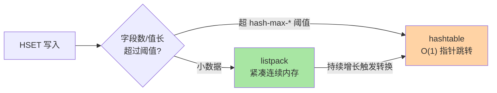
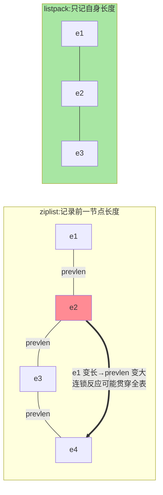

# SDS 与内存编码演进：Redis 快的内存账本

> Redis 的「快」有一半来自事件模型（入门层篇 2），另一半藏在内存账本里：**同一逻辑结构在不同数据量下切换底层编码**——小数据用紧凑编码省内存，大数据转标准结构保性能。这篇从 SDS 讲到 ziplist→listpack 的演进，看清 Redis 是怎么「按需换骨」的。

## 一句话摘要

Redis 每个 value 背后都是「**对象头 + 底层编码**」的组合：字符串的底层是 SDS（带长度头的动态字符串，O(1) 取长、二进制安全），小 Hash/ZSet 的底层从 ziplist 演进到 listpack（紧凑连续内存），List 用 quicklist（listpack 组成的双向链表）。**编码切换是自动的**：元素数或单元素大小超过阈值就转标准结构——`OBJECT ENCODING` 是看穿这一切的窗口。

## 🎯 本文核心

**核心一句话：Redis 的内存效率来自「按需换骨」——对象头与底层结构解耦，同一逻辑结构在小数据用紧凑编码（listpack 连续内存）、大数据转标准结构（hashtable/skiplist），切换自动发生、业务全程无感；SDS 与五种长度头是这套哲学的字符串层样本。**

机制链：SDS 四块短板的补法（len/alloc/预分配/惰性释放）→ 五种头按长度选最小编码 → ziplist 的压缩思想与级联更新之痛 → listpack 从结构上消灭级联 → quicklist 的混合折中 → 阈值参数的边界语义。全文一句话可重构：「对象头管接口，编码管实现，阈值管切换——业务侧的字段设计就是编码设计」。

## 前置阅读

- 入门层篇 3/4《String 与 Hash》《List 与 Set》：五大结构的用法层
- 入门层篇 11《内存管理与大 Key 治理》：内存视角的粗粒度认知

## 目标导向

本文是什么：Redis 底层编码的机制与演进。功能是什么：让「为什么小 Hash 省内存、大 Hash 变慢」可从编码层推理。能得到什么：编码切换阈值的调参依据、大 Key 的编码层归因、版本演进（7.0/8.0）的兼容性判断。为什么用：内存优化专项、大 Key 治理、Redis 版本升级评估，必看。

## 一、边界：入门层讲过什么，本文讲什么

| 内容 | 入门层 | 本文 |
|---|---|---|
| 五大数据结构的命令与场景 | ✅ 讲过 | 不重复 |
| SDS 结构与 C 字符串的差异 | 提了一句 | **本文核心一** |
| ziplist→listpack 演进与级联更新 | 未讲 | **本文核心二** |
| quicklist 的折中设计 | 未讲 | **本文核心三** |

## 二、SDS：给 C 字符串补的四块短板

C 字符串是「以 \0 结尾的字符数组」，四个先天缺陷：取长度 O(n)、不含 \0 的二进制不安全、拼接前不查容量易溢出、改长必 realloc。SDS（简单动态字符串）的解法是**在数据前挂一个头**。这里先补一句架构前提：**对象头（记录编码类型）与底层结构之间的模块边界是「编码自适应」能工作的前提**——上层 API 与命令语义不变，下层结构按数据量换骨，业务全程无感：



```text
┌──────────┬────────┬────────┬─────────┐
│ header   │  len   │ alloc  │  buf[]  │
│ (含flags)│ 已用长  │ 总分配  │ 数据区   │
└──────────┴────────┴────────┴─────────┘
```

- **len 让取长 O(1)**，且**二进制安全**（按 len 读，不依赖 \0）
- **alloc - len = 剩余空间**：拼接前检查，不够就扩——杜绝溢出
- **空间预分配 + 惰性释放**：扩容多给一倍、缩短不立刻还——把连续 N 次增长的重分配摊平

一个精细的演进细节：SDS 头不是一种而是五种（sdshdr5/8/16/32/64），**按字符串长度选最小的头**——短字符串用 1 字节级的头，省下的就是海量小 value 的真金白银。「按数据规模选最小编码」这个思想，贯穿 Redis 整个内存设计，下一节的 listpack 是它的极端形态。

## 三、ziplist 的压缩思想与级联更新之痛

小 Hash（几十个字段、值都短）如果用标准 hashtable 存，指针开销比数据本身还大。ziplist 的答案：**整块连续内存，元素紧密相接**，每个元素带「前一节点长度 + 自身编码 + 数据」。内存效率极高，但埋着一颗雷——「前一节点长度」字段：**中间某节点变长，后面所有节点的 prevlen 字段可能连锁变长，最坏 O(n²) 的级联更新**。



listpack 的**演进**一步到位：**每个元素只记自己的长度，不记别人的**——插入/修改只影响自身，级联更新从结构上消失。版本路线：7.0 引入 listpack 并逐步接管 ziplist 的岗位，8.0 全面化（zipline 退役）——这也是「8.x 视角」写作基准的由来（本系列入门层篇 24 的结论在编码层兑现）。

## 四、quicklist：List 的折中艺术

List 太长时怎么办？纯链表指针开销大、纯 listpack 插入删除要整块搬移。quicklist 的答案：**listpack 组成的双向链表**——每个节点是一小段 listpack，段内连续内存（省指针），段间链表（改 anywhere）。两个调节旋钮：

- `list-max-listpack-size`：每段 listpack 的上限（正数=元素数，负数=按字节数）
- `list-compress-depth`：两端之外压缩几段（LZF）——列表「两端活跃、中部冷」的访问模式适配（如消息流场景）

这就是 Redis 的典型设计哲学：**不在「链表 vs 数组」里二选一，而是按访问模式造一个可调参数的混合架构**——参数暴露给运维，折中留给场景。

## 五、源码关键路径

以 8.0 主线口径（src/）：

- 对象与编码切换：`object.c` 的 `hashTypeConvert` 等一族——元素数/大小过阈值时从 listpack 转 hashtable
- SDS：`sds.c` + `sds.h` 的 `sdshdr` 结构族与 `sdsMakeRoomFor` 预分配
- listpack：`listpack.c` 的 `lpInsert/lpFind`——无级联更新的证明就在插入路径里
- quicklist：`quicklist.c` 的 `quicklistInsertAfter` 一族 + LZF 压缩分支

阅读建议：用 `OBJECT ENCODING key` 对着代码切换点做实验——同一个 Hash 从 listpack 变 hashtable 的那一条命令，就是全部机制的活的演示。

## 典型场景

- **对象缓存**：用户资料存 Hash——控制字段数与单值长度让编码停在 listpack，内存占用可比拟 JSON 字符串还省
- **消息/时间线**：LPUSH+LTRIM 的定长列表——quicklist 两端活跃的特性完全对齐，压缩深度把冷中部压扁
- **内存治理**：大 Key 排查（入门篇 11）时先看 `OBJECT ENCODING`——编码停在「错误的一侧」（该切没切/不该切切了）常是病根

## 业内惯例

> 💡 **实战提示**
> - 什么时候动编码阈值：业务的字段数/值长分布明确偏离默认假设（如字段数恒定 3 个但单值 100 字节）——调完用 MEMORY USAGE 前后对比留证，没有对比的阈值调整等于盲调
> - 大 key 治理先看编码：该切 hashtable 的巨型 listpack（配置失当强留紧凑）先修配置再谈拆分——治理顺序「配置修正 → 结构拆分」是业内默认
> - 升级 7.0/8.0 前后各跑一次编码分布基线：`OBJECT ENCODING` 抽样对比——listpack 全面化的行为差异用数据说话
> - 对象缓存按「编码友好」设计：字段数控制在阈值内、单值长度收短，让高频小对象停在 listpack——业务建模直接省内存

- **编码阈值参数不轻易调**：`hash-max-listpack-entries/value` 等默认值是内存与性能的平衡点，业务有明确画像（字段数、值长分布）才动，动了要用 `MEMORY USAGE` 前后对比留证
- **大 Key 治理先看编码**：拆分大 Hash 前先确认它是不是「早该切 hashtable 却没切」的配置问题——治理顺序业内默认是「配置修正 → 结构拆分」
- **升级 7.0+/8.0 前核对编码假设**：依赖「hash 编码是 ziplist」的底层假设（如某些 RDB 解析工具）要在升级清单里——版本演进的兼容性检查项
- **监控加 `OBJECT ENCODING` 抽样**：编码异常漂移（大量本应紧凑的结构转了标准编码）是内存异常涨价的早期信号——编码分布在监控链路的上下游里，是最靠近病根的那一环

## 六、常见误区

- **「编码是底层细节，业务不用管」**：编码直接决定内存与操作复杂度——同一个 Hash，listpack 下 HGETALL 是 O(n) 连续内存扫描（快），hashtable 下是 O(n) 指针跳转（慢且费缓存）。**业务侧的字段数设计就是编码设计**
- **「listpack 全面胜出，阈值随便放」**：超过阈值强留 listpack 会让每次插入都搬大块内存——阈值的意义是「紧凑编码的适用边界」，不是越大越好
- **「SDS 预分配没成本」**：预分配省的是 realloc 频率，付的是内存碎片；字符串超长场景的碎片回收靠 `activedefrag`（内存篇的结论）——机制没有免费的
- **「8.0 升级与我无关」**：listpack 全面化改变了编码观测结果与极端性能特征——升级前跑一次编码分布基线，升级后对比，是业内升级 SOP 的一环

## 七、与相邻机制的关系

- 本系列篇 2《跳表与 ZSet》：另一条「标准结构」路线的深挖，与本篇的紧凑编码互为两极
- 入门层篇 11《内存管理与大 Key 治理》：编码视角是内存治理的诊断工具
- tips 互指：`MEMORY USAGE` / `activedefrag` 的运维细节在专题层「bigkey 与性能调优深度」

## 你们可能会问

**Q1：怎么知道我的 key 现在是什么编码？**
`OBJECT ENCODING key`——int/embstr/raw（字符串）、listpack/hashtable（小/大 Hash）、listpack/skiplist（小/大 ZSet）……监控抽样脚本按它出「编码分布报表」。

**Q2：embstr 和 raw 的切换线为什么是 44 字节？**
embstr 把对象头与 SDS 一次性分配在一块连续内存（省一次分配、缓存友好），容量受 RedisObject 头 + sdshdr8 + 44 字节数据恰好凑满一个 64 字节 jemalloc 分配单元的约束——数字会随版本微调，机制（凑分配单元）不变。

**Q3：为什么 Redis 8 才让 ziplist 全面退役？**
结构替换要兼容 RDB/AOF 与克隆实现的历史包袱，listpack 从 5.0（用于 ZSet 小编码）试跑到 7.0 扩岗、8.0 收官——大版本演进节奏由兼容性决定，不由技术优劣单独决定。

## 八、自测三问

1. SDS 相对 C 字符串补了哪四块短板？按长度选头省的是什么？
2. ziplist 级联更新的结构根源是什么？listpack 怎么从结构上消灭它？
3. quicklist 在「链表 vs 数组」之间做了什么折中？两个旋钮各调什么？

## 开放问题

- 内存池（jemalloc）与编码设计的协同在持续细化，「按分配单元设计结构」的思路未来可能催生更多紧凑编码变体。
- 新数据结构（如 8.0 的 vector set 类扩展）的底层编码选型将继续检验「紧凑编码 vs 标准结构」这套自适应框架的扩展性。

## 🎯 核心带走

- **核心一句话**：Redis 内存效率 = 按需换骨——对象头解耦接口与实现，小数据 listpack 紧凑、大数据标准结构，SDS 五种头与 listpack 无级联是两个代表样本
- **机制链**：SDS 四补 → 按长度选头 → ziplist 级联之痛 → listpack 消灭级联 → quicklist 折中 → 阈值边界
- **哪里会坏**：编码停在错误一侧、超阈值强留紧凑编码、SDS 预分配碎片、升级未查编码假设
- **边界**：本篇管「字符串与紧凑编码」；跳表路线在篇 2，编码运维细节在专题层 bigkey 篇

## 📌 数据与事实声明

- 写于 2026-09-08，结构描述以 Redis 8.0 主线为基准（listpack 全面化、ziplist 退役为官方演进口径）
- embstr 44 字节阈值随版本可能微调，以官方源码常量为准
- 免责：参数默认值以 redis.io 官方文档为准

## 📚 参考资料

| 类型 | 标题 | 来源 |
|---|---|---|
| 官方源码 | redis/redis（src/listpack.c、sds.c、quicklist.c） | github.com/redis/redis |
| 官方文档 | Redis Data Types / Object Encoding | redis.io/docs |
| 原理书 | 《Redis 设计与实现》黄健宏（ziplist/SDS 章，历史版本视角） | 公开出版 |
| 实战书 | 《Redis 深度历险》钱文品 | 公开出版 |
