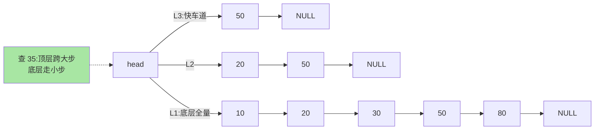
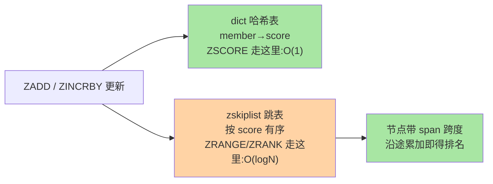

# 跳表与 ZSet：为什么排行榜选它而不是树

> ZSet 的底层是**跳表 + 哈希表的双结构组合**。面试式问答停在「跳表 = 多层链表」，本篇讲工程真相：为什么 Redis 拒绝了红黑树、score 相同怎么排序、rank 是怎么 O(log n) 算出来的——排行榜、延迟队列类场景的性能特征全部由此而来。

## 一句话摘要

ZSet 内部同时维护两个结构：**dict 哈希表**（member → score，O(1) 查分值）和**跳表 zskiplist**（按 score 排序的分层链表，O(log n) 范围操作）。作者 antirez 拒绝红黑树的理由是工程性的：**实现与调试更简单、范围操作天然顺链表走、无旋转操作**；每个跳表节点带 span（跨度）字段，`ZRANK` 才能不数链表直接算排名。小 ZSet 用 listpack 紧凑编码（上篇结论），超阈值才切跳表组合。

## 🎯 本文核心

**核心一句话：ZSet = dict（O(1) 按成员查分）+ 跳表（O(log n) 按分数有序）的双结构分工——查询类型画模块边界；跳表用「1/4 概率分层」替代树的强制平衡，span 跨度让 ZRANK 免数链表；同分排序键是 (score, member 字典序)，保证次序确定。**

机制链：概率分层 vs 强制平衡 → 双结构的查询类型分工 → span 与 rank 的对数级来源 → 同分确定性 → 三方对比（红黑树/B+ 树/listpack 独扛）→ 源码路径。全文一句话可重构：「两结构各答各的题，span 让排名免费，工程简单性压倒理论最优」。

## 前置阅读

- 入门层篇 5《ZSet 与排行榜》：排行榜、延迟队列的用法层
- 本系列篇 1《SDS 与内存编码演进》：listpack 紧凑编码与切换阈值

## 目标导向

本文是什么：ZSet 双结构与跳表的机制深挖。功能是什么：把「排行榜为什么用 ZSet」讲到结构层，让 ZSet 的性能特征可推理。能得到什么：score 相同的处理、rank 的高效来源、内存与操作复杂度的权衡判断。为什么用：排行榜设计、延迟队列实现、大 ZSet 治理，必看。

## 一、边界：入门层讲过什么，本文讲什么

| 内容 | 入门层 | 本文 |
|---|---|---|
| ZADD/ZRANGE 等命令与排行榜用法 | ✅ 讲过 | 不重复 |
| 跳表分层原理与查找路径 | 概念级 | **本文核心一** |
| 双结构组合与 span/rank 机制 | 未讲 | **本文核心二** |
| 「为什么不用红黑树/ B+ 树」 | 未讲 | **本文核心三** |

## 二、跳表：概率分层代替强制平衡

跳表的本质：**在有序链表上加「快车道」**——每个节点以 1/4 概率（Redis 实现）晋升到上一层，查找从顶层往下「跨步逼近」，期望 O(log n)。与红黑树/AVL 的根本差异在**平衡的获得方式**：

- **树**：靠旋转强制平衡——插入删除要维护旋转逻辑，代码与调试复杂
- **跳表**：靠随机层数 + 较低的晋升概率在统计意义上平衡——插入只改前后指针，无需全局调整

每个节点还有一条隐藏字段 **backward 指针**（底层反向），支撑 `ZREVRANGE` 的反向遍历。

## 三、双结构组合与 span：rank 的高效来源

ZSet 为什么维护两份结构？各取所长的架构分工——模块边界画在「查询类型」上：

- **dict**：`ZSCORE` 这类「给定 member 查 score」O(1)——跳表做这件事要 O(log n)
- **zskiplist**：`ZRANGE/ZRANK/ZCOUNT` 这类有序操作 O(log n)——dict 完全做不了有序

span（跨度）是跳表在 Redis 里的关键增强：每个前进指针记录「跨过了几个底层节点」。**rank 不用数链表**——查找路径上把 span 加总，O(log n) 直接得出排名；`ZINCRBY` 更新 score 时沿途 span 同步修正。这也是「排行榜选 ZSet」的机制底气：`ZRANK` 在百万成员量级仍是微秒级。

**score 相同的处理**：排序键是 `(score, member 字典序)`——同分按 member 排出确定次序。这保证了顺序的**确定性**（同分成员的相对位置稳定），业务上「同分按名字排序」就是它的直接映射，想要自定义同分次序需要在 member 上编码业务序。

## 四、为什么不是红黑树 / B+ 树

- **vs 红黑树**（antirez 的公开答复口径归纳）：① 范围取值跳表顺底层链表走，树要中序遍历栈辅助；② 无旋转，实现与调试简单一个量级；③ 内存上跳表每个节点指针多一点，但可控——**工程简单性压倒理论最优性**，这是 Redis 一贯的取舍风格
- **vs B+ 树**：B+ 树为「按页 I/O 的磁盘」设计（MySQL 索引系列篇 1 的结论），跳表为「内存随机访问」设计——介质不同最优结构不同，这是跨系统架构选型的通用结论，两棵结构在各自的地盘都是对的
- **vs listpack 独扛**：小 ZSet 确实只用 listpack（无跳表无 dict），超过 `zset-max-listpack-entries` 阈值才升级双结构——**大数据量才付双结构的内存账**

## 五、源码关键路径

以 8.0 主线口径（src/）：

- 结构定义：`server.h` 的 `zskiplistNode`（`ele/score/level[]/backward`）与 `zskiplist`
- 插入：`t_zset.c` 的 `zslInsert`——逐层记录排名（span 累计）、随机层数 `zslRandomLevel`（1/4 晋升）
- 排名：`zslGetRank`——从顶层向下累加 span，O(log n) 出 rank
- 编码切换：`zsetConvert`——listpack ↔ skiplist 双向，阈值参数 `zset-max-listpack-*`

阅读建议：带着一条 `ZADD` 走完 `zslInsert`，重点看每个 level 的 update 数组与 span 修正——跳表的一切「魔法」都在这条路径上显形。

## 典型场景

- **实时排行榜**：`ZINCRBY + ZREVRANGE WITHSCORES + ZRANK`——分数更新 O(log n)、排名微秒级；同分确定性由 member 字典序兜底
- **延迟队列**：score 存执行时间戳，`ZRANGEBYSCORE key now limit N` 扫到期任务——顺底层链表的有序扫描天然支持「取一段区间」（机制上比轮询全表高一个量级）
- **滑动窗口限流**：member 存请求标识、score 存时间戳，ZCOUNT 数窗口内请求——配合 ZREMRANGEBYSCORE 清理，窗口统计 O(log n)

## 业内惯例

> 💡 **实战提示**
> - 什么时候担心 ZSet 的性能：成员总量与单命令范围宽度——ZRANK/ZADD 是对数级不用担心，ZRANGE 不带 LIMIT 的大范围与无限增长的成员数才是要管的
> - 榜单设计先定「截断策略」：ZREMRANGEBYRANK 只留 Top N（如 1 万名）——排名亿级的需求拆周期榜/分区榜，单 ZSet 扛不了无限量
> - 同分次序要业务可控就在 member 编码：`score + member 字典序`的默认次序对业务是黑盒——排行榜严格次序需求显式编码（时间戳倒序位技巧）
> - ZSet 大 key 的判定与治理口诀：按成员数定警戒线、按周期拆榜、ZREMRANGEBYSCORE 清过期——延迟队列场景的三件套

- **ZSet 成员数设上限**：排行榜场景用 `ZREMRANGEBYRANK` 只留 Top N——无上限的 ZSet 是大 Key 重灾区（入门篇 11 的结论）
- **延迟队列生产多走专业方案**：Redis ZSet 版延迟队列适合中小量级，精确投递/重试语义完整的需求业内默认上成熟 MQ（RocketMQ 定时消息等，tips 互指其特性层）——ZSet 版要自己处理执行失败重投
- **同分排序显式编码**：业务要自定义同分次序时，member 前缀编码业务序（如 `时间戳:ID`）——别依赖字典序的「巧合」
- **监控看编码分布**：大量 ZSet 停在 skiplist 编码但成员数很小 → 阈值配置或字段设计有问题（上篇的编码分布监控结论在此复用）

## 六、常见误区

- **「跳表 = 多层链表，层数是设计死的」**：层数随机生成（1/4 晋升），期望层数 log₄n——「概率平衡」与树的「强制平衡」是两条实现哲学，前者的确定性弱但工程简单
- **「ZSCORE 也是 O(log n）」**：dict 让它是 O(1)——双结构的价值就在「各答各的题」，只知跳表会低估 ZSet 的点查性能
- **「跳表比红黑树快」**：同量级复杂度，差别在实现复杂度与范围操作形态，不在渐近速度——「选跳表」是工程决策不是性能碾压
- **「rank 让它数一遍链表」**：span 机制让 ZRANK 是 O(log n)——百万级成员排行榜的排名查询是微秒级，性能顾虑应该留给「成员总量」而不是排名操作

## 七、与相邻机制的关系

- 本系列篇 1：listpack 小编码与切换阈值——ZSet 双结构只在「大 ZSet」形态生效
- 入门层篇 5：排行榜/延迟队列的用法层，本文是机制底座
- tips 互指：延迟队列与 MQ 定时消息的边界在 RocketMQ 特性层《延迟消息原理》；时间轮等调度算法归 job-scheduling 特性层（单源互指）

## 你们可能会问

**Q1：跳表的层数上限是多少？**
实现上限 ZSKIPLIST_MAXLEVEL（现行为 32）——按 1/4 晋升率，亿级成员期望层数也远够不着上限，它只是防御性封顶。

**Q2：ZINCRBY 更新 score，两个结构怎么保持一致？**
同一事务路径内先改跳表节点 score（沿途修 span），再同步 dict 的 score——单线程执行模型保证两结构不会撕裂（入门篇 2 的单线程结论在数据一致性层的红利）。

**Q3：为什么 Redis 不给 Hash、Set 也配有序结构？**
需求不对称：有序操作的 O(log n) 代价只对「真需要序」的场景值得付——Hash/Set 的访问模型无序即可，多余的结构就是多余的内存。

## 八、自测三问

1. ZSet 为什么同时维护 dict 和跳表？各自负责哪类操作？
2. span 是什么？ZRANK 为什么能 O(log n) 出排名？
3. antirez 拒绝红黑树的三条工程理由是什么？这条决策反映什么取舍风格？

## 开放问题

- 新数据结构场景（地理、位图、向量）持续拷问「跳表是否仍是 Redis 有序结构的最优解」，基于分段跳表或 B+ 树变体的替代实现偶有社区讨论，未成主流。
- 内存数据库的有序结构与 CPU 缓存行的协同（cache-friendly skiplist 变体）是学术与工业的交叉地带，值得跟踪。

## 🎯 核心带走

- **核心一句话**：ZSet = dict（O(1) 点查）+ 跳表（O(log n) 有序）双结构分工；跳表概率分层、span 让 ZRANK 免数链、同分按 member 字典序确定
- **机制链**：概率平衡 → 双结构分工 → span 机制 → 同分确定性 → 结构选型对比
- **哪里会坏**：无上限成员膨胀、ZRANGE 大范围拉取、误以为 ZSCORE 是对数级、同分次序赌字典序
- **边界**：本篇管跳表实现；紧凑编码与阈值在篇 1，排行榜/延迟队列用法在入门层篇 5

## 📌 数据与事实声明

- 写于 2026-09-08，结构描述以 Redis 8.0 主线源码为基准（1/4 晋升率、ZSKIPLIST_MAXLEVEL=32 为源码口径）
- 「antirez 拒绝红黑树的理由」为其公开答复的归纳，非官方文档原文
- 免责：参数默认值以 redis.io 官方文档为准

## 📚 参考资料

| 类型 | 标题 | 来源 |
|---|---|---|
| 官方源码 | redis/redis（src/t_zset.c、server.h） | github.com/redis/redis |
| 历史文献 | antirez 关于跳表 vs 红黑树的公开答复（互联网公开归档） | 公开邮件组/博客存档 |
| 原理书 | 《Redis 设计与实现》黄健宏（跳表章） | 公开出版 |
| 实战书 | 《Redis 深度历险》钱文品 | 公开出版 |
