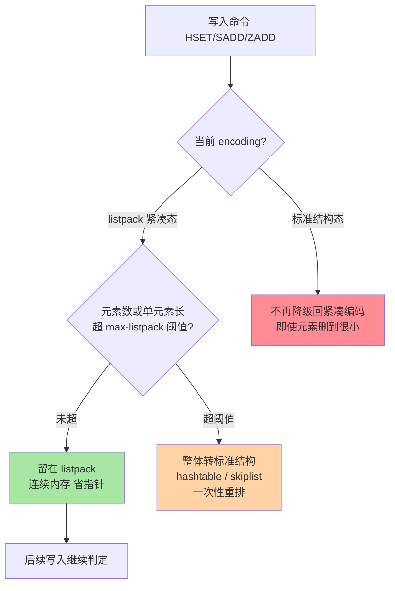
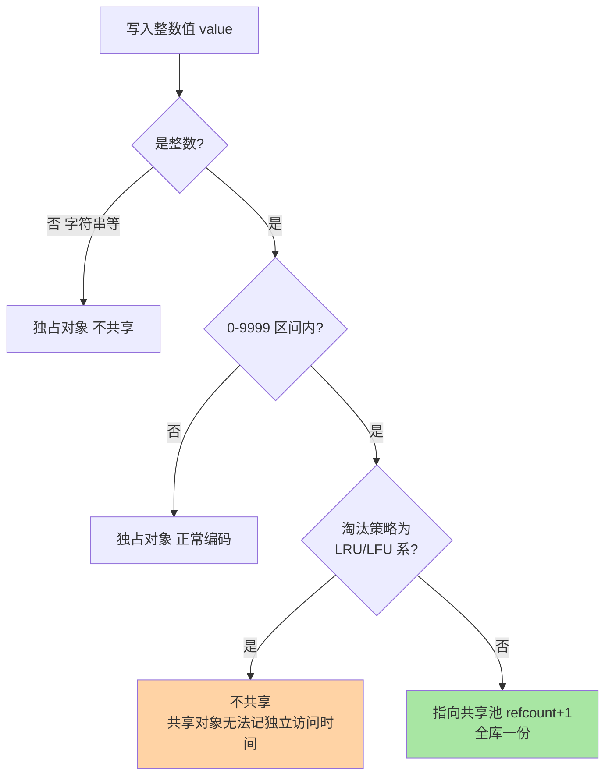
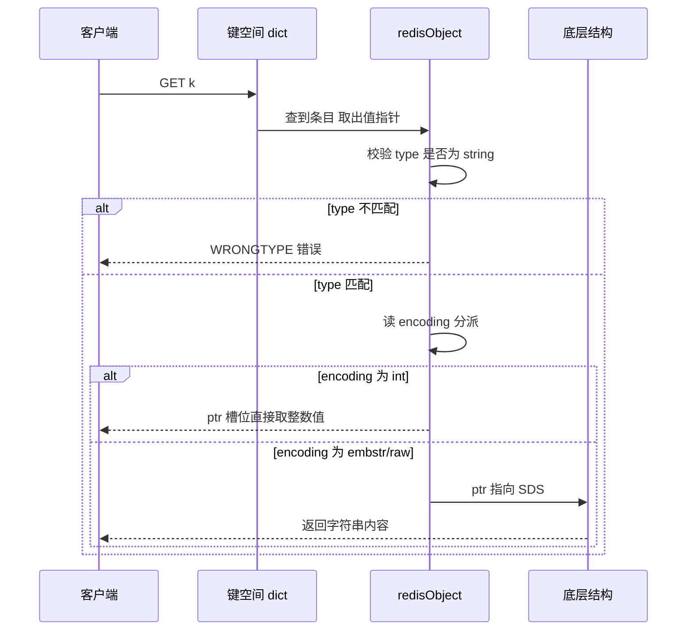

# redisObject 对象系统：type、encoding 与对象共享

> 篇 1 讲了 SDS 这本「内存账本」，篇 2 讲了跳表这根「索引骨」，但它们都是被一个对象头管着的：**redisObject**——`LPUSH` 进去的是 list、`HSET` 进去的是 hash，凭什么小数据自动换紧凑编码、整数自动共享？答案全在这个十几个字节的对象头里。这篇把 redisObject 的结构解剖、type 与 encoding 的二维映射、0-9999 整数共享池、refcount 回收与 OBJECT 排查命令一次讲透——它是前两篇的「总装车间」。

## 一句话摘要

Redis 每个 value 都是 **redisObject（对象头）+ 底层数据结构（编码实现）**的组合：type 记「逻辑类型」（string/list/hash/set/zset 五类），encoding 记「底层实现」（int/embstr/raw、listpack/hashtable、intset、skiplist……），lru 记淘汰元数据，refcount 记引用计数，ptr 指向底层结构。**二维映射 + 自动切换**是核心：同一个 type 在小数据用紧凑编码、大数据转标准结构，切换由阈值触发、业务无感；**0-9999 的整数池共享**让高频小整数全库只有一份；refcount 归零即回收。`OBJECT ENCODING` 是看穿这一切的窗口。

## 🎯 本文核心

**核心一句话：redisObject 是「接口与实现解耦」的运行时载体——type 管对外语义、encoding 管对内实现、阈值管自动切换、共享池管小整数去重、refcount 管生命周期；理解了对象头，SDS/listpack/跳表才从孤立知识点连成一台按需换骨的机器。**

机制链：16 字节的结构解剖（5 个字段各管什么）→ type × encoding 二维映射（每个格子怎么选）→ 共享池的判定条件（整数 + 10000 上限 + 淘汰策略互斥）→ refcount 的回收路径 → OBJECT 命令的排查现场。全文一句话可重构：「**type 是承诺，encoding 是兑现，redisObject 是合同本身**」。

## 前置阅读

- 本系列篇 1《[SDS 与内存编码演进](./1_SDS与内存编码演进-深度.md)》：字符串层的对象头协作
- 本系列篇 2《[跳表与 ZSet 实现](./2_跳表与ZSet实现-深度.md)》：ZSet 双结构的编码协作
- 入门层《[内存管理与大 Key 治理](../../入门层/从零开始认识Redis系列/11_内存管理与大Key治理-入门.md)》：内存视角的粗粒度认知

## 目标导向

本文是什么：redisObject 结构与对象系统的机制篇。功能是什么：让「为什么同一个命令不同数据量表现不同」「内存都被什么吃了」可从对象层推理。能得到什么：编码映射的全景表、共享池的适用边界、OBJECT 命令的排查手法、大 Key 的对象层归因。为什么用：内存优化专项、大 Key 治理、编码相关诡异问题的定位，必看。

## 一、边界：前两篇讲过什么，本文讲什么

| 内容 | 前置篇 | 本文 |
|---|---|---|
| SDS 五种长度头与字符串编码 | 篇 1 讲过 | 只作引用 |
| ZSet 的 listpack/skiplist 协作 | 篇 2 讲过 | 只作引用 |
| redisObject 结构与字段语义 | 未系统讲 | **本文核心一** |
| type × encoding 全景映射与切换 | 各篇分散提过 | **本文核心二** |
| 对象共享池与 refcount 回收 | 未讲 | **本文核心三** |

## 二、结构解剖：一个对象头的 16 字节

64 位系统上（8.0 主线口径），一个 redisObject 占 16 字节：

```text
┌──────────┬──────────┬─────────────┬──────────────┬────────────────┐
│ type 4bit│encoding4b│  lru 24bit  │ refcount 4B  │   ptr 8B       │
│ 逻辑类型  │ 底层编码  │ LRU/LFU 元数据│ 引用计数      │ 指向底层结构     │
└──────────┴──────────┴─────────────┴──────────────┴────────────────┘
```

| 字段 | 宽度 | 作用 | 备注 |
|---|---|---|---|
| type | 4 bit | 逻辑类型（string/list/hash/set/zset 等） | 对外语义的承诺 |
| encoding | 4 bit | 底层编码（int/embstr/raw、listpack/hashtable……） | 对内实现的兑现 |
| lru | 24 bit | 淘汰元数据：LRU 模式存时钟，LFU 模式拆成 16bit 时钟 + 8bit 对数计数器 | 双复用设计 |
| refcount | 32 bit | 引用计数 | 0 即回收；>1 可能是共享池 |
| ptr | 64 bit | 指向底层结构（SDS/listpack/skiplist……） | int 编码时直接存值，ptr 复用为数值槽 |

**最值得停下来的是 ptr 的双关**：整数编码（`SET k 12345`）时，数值直接塞进 ptr 槽位本身，连一次内存分配都省掉——一个小整数 `12345` 的全部成本就是一个 16 字节对象头，没有额外结构。这是「按需分配」哲学在最小尺度上的体现。从对象系统的演变史看，这套字段布局自 Redis 诞生至今大体稳定——底层结构一换再换（ziplist 演进为 listpack），对象头这个上层接口却几乎没动，**接口稳定、实现多变的分层纪律，在这个 16 字节上体现得最完整**。

lru 字段的双复用同样典型：同一块 24 bit，LRU 策略下近似时钟（秒级取整），LFU 策略下拆成「16 bit 衰减时钟 + 8 bit 对数访问计数」。**同一块内存按策略变义**——淘汰策略篇会展开，这里先记住：换策略等于换这块内存的解释方式。

## 三、type 与 encoding 的二维映射

type 是对客户端的承诺（`TYPE` 命令的返回值），encoding 是内部怎么兑现（`OBJECT ENCODING` 的返回值）。全景映射（7.x 主线口径）：

| type | 可选 encoding | 切换条件（公开口径） | 为什么这么设计 |
|---|---|---|---|
| string | int / embstr / raw | 整数值→int；≤44 字节短串→embstr（对象头与 SDS 一次分配）；否则→raw | 短串一次分配省指针跳转，长串走标准 SDS |
| list | quicklist（节点为 listpack） | 统一编码，7.0 起节点内层由 ziplist 换 listpack | 双向链表 + 紧凑节点的混合折中 |
| hash | listpack / hashtable | 元素数或单元素长度超 `hash-max-listpack-*` 阈值即转 | 小 hash 连续内存省指针与碎片 |
| set | intset / listpack / hashtable | 全整数且小→intset；小而杂→listpack；超阈值→hashtable | 三档按数据形态逐级升档 |
| zset | listpack / skiplist | 元素数或成员长度超 `zset-max-listpack-*` 阈值即转 | 小集合牺牲 O(logN) 换内存连续 |



三个容易被忽略的语义：其一，**切换是单向的**——升到 hashtable 后即便元素删得只剩一个也不会降回 listpack（省去反复重排的抖动，这是「宁可占着不降级」的工程取舍）；其二，切换是**写路径的同步动作**——超阈值那次写入会先完成整表重排再返回，大集合转换的那一次写会明显变慢（这也是大 Key 写放大的一种形态）；其三，**type 永远不变、encoding 悄悄变**——客户端协议层完全无感，这正是对象头解耦的价值。

### 追问：embstr 的 44 字节阈值是怎么来的？

再深一层追问：为什么是 44？embstr 的目标是一**次内存分配装下「redisObject + SDS 头 + 字符串」**。主流分配器的最小分配单元按 64 字节对齐（公开口径，jemalloc 尺寸类别）：16 字节对象头 + 至少 3 字节的 SDS 头（len/alloc/flags）+ 结尾 \0，剩余空间就是 44。阈值不是拍脑袋，是「分配器尺寸类别 − 固定开销」的差值——分配器的物理约束决定了这个魔法数字。换个分配器策略，这个数就要重算：**魔法数字背后是内存物理结构，不是经验玄学**。

## 四、对象共享：0-9999 的整数池

服务启动时预建 10000 个整数对象（0-9999，`OBJ_SHARED_INTEGERS` 口径），之后所有命中这个区间的整数 value **不新建对象、直接把引用指过去**，refcount 加一。判断流程：



**为什么只共享整数？** 追问一层：字符串为什么进不了共享池？因为共享的前提是「共享前能 O(1) 判断相等」——整数比较一次搞定；字符串要先算哈希再比较内容，判定成本可能超过省下的那点内存，得不偿失。共享池的收益场景也解释了它的边界：计数器、分页号、状态码这类高频小整数是最大受益者（页大小 10/20/50 的场景全库共享一份 10）；而业务里大量存在的唯一字符串（ID、token）与共享池无缘。

**为什么 LRU/LFU 下不共享？** 共享对象的 lru 字段是全体引用者混用的——A 键频繁访问、B 键从不动，却共用同一个访问计数，淘汰精度被破坏。所以开启 LRU/LFU 策略时共享被禁用：**「内存去重」与「淘汰精度」两个目标在同一块 lru 字段上互斥**，只能二选一。这也是「共享省内存」的收益要先看淘汰配置的原因。

## 五、refcount 与内存回收

Redis 没有 GC，生命周期完全靠引用计数管理：`incrRefCount` 加一、`decrRefCount` 减一、归零即释放底层结构与对象头本身。所有持有该对象的地方（键空间、共享池、正在执行的命令、复制/持久化缓冲）都靠计数保持一致——这是单线程模型下「谁最后用完谁负责释放」的朴素纪律。

- **键删除路径**：从键空间摘除 → refcount 减一 → 归零则连带释放 SDS/listpack 等底层结构——删除大 Key 的卡顿就发生在这一步（大结构释放是同步动作，惰性释放线程只接管部分大块）
- **共享对象的特例**：refcount 永不归零（共享池自身常驻持有），`OBJECT REFCOUNT` 看到的共享对象计数值是一个特殊标记值而非普通计数（公开口径）
- **值对象 vs 键对象**：键和值都是 redisObject，`DEL` 一个键要释放两个对象——对象层视角下「一个键值对」是两次计数管理

### 追问：为什么不用垃圾回收？

打破砂锅：有语言层面的 GC（分代、并发标记）这么成熟，为什么 Redis 选引用计数？答案是**延迟确定性**：GC 的优势是处理环状引用与批量化回收，代价是停顿不可控；Redis 是单线程内存数据库，任何一次不可控停顿都是全局不可用。引用计数的释放时机完全确定（归零的瞬间、且只在操作该对象的命令里释放），代价是环状引用无法自动回收——但 Redis 的数据结构是树形的（键空间到值，值到内部结构），天然无环。**机制选择由底层约束决定：单线程 + 低延迟要求，把 GC 的「平均高效」直接排除**。

## 六、源码关键路径

以 7.x/8.0 主线口径（src/）：

- 对象创建：`object.c` 的 `createObject`（通用五字段初始化）、`createStringObject`（int/embstr/raw 三分支判定的入口）、`tryObjectEncoding`（字符串转 int/embstr 的尝试）
- 编码切换：`t_hash.c`/`t_set.c`/`t_zset.c` 的 `*ConvertAndEncoded*` 族函数——超阈值整体重排的实现
- 共享池：`server.c` 启动时的 `createSharedObjects`；判定逻辑在 `object.c` 的共享分支（整数区间 + 策略互斥）
- 引用计数：`incrRefCount`/`decrRefCount`（`object.c`）——所有数据操作的收尾必经
- OBJECT 命令：`object.c` 的 `objectCommand`（ENCODING/REFCOUNT/IDLETIME/FREQ 四个子命令分发）

阅读建议：拿「`SET k 123`」当剧本从 `createStringObject` 走到共享分支——一个看似最简单的命令，对象系统的全部判定都会经过。读路径同样值得走一遍——`GET` 命令从收到请求到返回数据，每一步都在对象头的字段上做文章：



读路径的对象层视角：一次 `GET` 至少经过「键空间查找 → type 校验 → encoding 分派 → 底层结构解引用」四跳——对象头让每一跳都变成了查表而非分支爆炸，这正是「加一层间接」换来的架构收益，也是这一层设计演变至今没有被推翻的原因。

## 典型场景

- **内存暴涨归因**：`OBJECT ENCODING` 逐键核对——以为是小 hash 实际早已转 hashtable（单字段超大触发阈值），编码层归因比猜快得多
- **大 Key 治理的编码视角**：同样 1 万个字段的 hash，字段名短值短时留 listpack 内存可控；一个超长字段就整体转 hashtable 并触发一次同步重排——治理重点是防「单字段超长」这个触发器
- **高频计数的成本核算**：计数器场景下 0-9999 区间的值全库共享，每键只有键对象 + 键空间条目的成本——这是「值越小越便宜」的对象层解释

### 事故叙事：编码漂移导致的「内存失忆症」

> 某团队的一次排查（同类形态在社区反复出现）：一个缓存集群内存持续上涨，业务方坚称「数据量没涨」。排查从 `INFO memory` 的 memnofrag 入手排除碎片，再抽样大 Key：`OBJECT ENCODING` 显示一组历史 hash 的编码全是 hashtable，而业务侧记忆里它们「一直是小的」。追根溯源：某次批量补数任务往这批 hash 里各塞了一个超长字段，触发了 listpack→hashtable 的单向转换；后续字段删除也再未降级。复盘动作：编码监控进巡检（统计各编码占比的变化）、补数任务按「字段长度阈值」预校验、确认转换不可逆后把「删小了」的预期从认知里移除。复盘结论：**编码是会漂移的状态，不是恒定的属性——容量规划必须按最坏编码算**。

## 业内惯例

> 💡 **实战提示**
>
> 💡 `OBJECT ENCODING key` 是排查第一命令：先看编码再看类型——「类型对、行为怪」的问题九成出在 encoding 层
> 💡 `OBJECT REFCOUNT` 返回异常大的值（共享池标记）说明命中共享，内存估算时该值近乎零成本；返回 1 是独占对象
> 💡 `OBJECT IDLETIME` 与 `OBJECT FREQ` 互斥可用：策略为 LFU 时 IDLETIME 报错、非 LFU 时 FREQ 报错——写巡检脚本要按策略分支
> 💡 阈值参数（`hash-max-listpack-entries/value` 等）调整前先用生产数据样本离线验证转换点——阈值放宽省内存但推高转换时机前的线性查找成本
> 💡 排查内存问题的对象层顺序：类型分布 → 编码分布 → 共享命中率 → 单 Key 编码核对——四步从面到点，跳步容易先去调分配器

业内两条惯例（业内认知口径）：其一，大 Key 治理平台普遍把「编码 + 长度」双维度纳入巡检口径，只看长度会漏掉「短而多」与「长而少」的形态差；其二，版本升级（尤其 6.x→7.x 的 ziplist→listpack 迁移）前用 `OBJECT ENCODING` 批量采样对比编码分布，是验证兼容性的低成本手段。2019 年前后社区对 ziplist 级联更新的反思，到 2022 年 7.0 正式落地 listpack——这条底层结构的演变线说明：对象系统的下游（编码实现）在持续重构，而下游的每次演进都会改变上游对象层的行为边界，上下游的认知必须同步更新。

### 不同量级的思考：架构约束驱动解法

量级不是数字标签，是约束的边界——对象系统的每一档主要矛盾不同：

- **十万级（实例内存 GB 级，键量十万级）**：约束来自「默认配置基本够用」；这一档的核心问题是「别乱调阈值」，而不是「共享率怎么优化」——默认阈值经过大量实践校准，乱放宽最先撞上 listpack 的线性查找。思考方式是「默认驱动」
- **百万级（键量百万，混合读写）**：约束来自「编码分布开始决定内存曲线」；这一档的核心问题是「编码分布可观测」，而不是「逐键手查」——编码占比统计进监控，分布突变即告警。思考方式是「分布驱动」
- **千万级（内存百 GB，大 Key 治理常态化）**：约束来自「单键编码态决定治理动作」；这一档的核心问题是「触发器治理」，而不是「事后扩容」——防超长字段、防巨集合把编码推离紧凑态。思考方式是「触发器驱动」
- **亿级（多实例多业务共享平台）**：约束来自「跨业务编码画像差异」；这一档的核心问题是「按业务画像分阈值」，而不是「全平台一刀切」——计数型业务与 hash 型业务的合理阈值完全不同，按画像分组配置。思考方式是「画像驱动」

思考方式总结：十万级靠「默认」，百万级靠「分布」，千万级靠「触发器」，亿级靠「画像」——每一档的约束来源不同（默认值的适用域/内存曲线的敏感度/单键状态的影响半径/业务异质性），思考方式跟着约束换挡。

**自下而上与触发升级**：先实测三件事再定档——编码分布的当前快照、共享命中的大致比例、超阈值转换的历史频率；触发升级的信号：编码分布突变、内存曲线与键量曲线背离、出现首个超长字段触发案例——任一出现，从「默认信任」切到「分布观测」档，约束变了思考方式就要跟着变。

## 反方案：为什么不选「固定单一编码」？

有人主张取消编码切换，「hash 一律 hashtable」多简单。反方案分析：

- **小数据的内存税无法承受**：hashtable 每个条目带指针开销与散列表空洞，小 hash 用 listpack 连续内存可省数倍（业内常见口径数倍于紧凑态）——海量小键场景下这一项就是内存账本的主导项
- **大数据的紧凑税更痛**：反过来一律 listpack，百万字段的 hash 退化成 O(N) 线性查找——写还行，读直接不可用
- **「固定」没有省掉复杂度，只是把复杂度从系统搬给了用户**：要么为每种数据规模手工选型（人肉阈值），要么承担两头税务——自动切换本质是把选型自动化

为什么不用「更激进的多档编码」（紧凑与标准之间再加几档）？档位越多、转换路径越多，测试矩阵指数膨胀，转换风暴（频繁升降级）风险也随之上升——7.0 用 listpack 统一 ziplist 反而是在**简化档位**。设计取舍的天平长期偏向「少而稳的档位 + 单向切换」，而不是「细粒度的动态调节」。

## 七、常见误区

- **「`TYPE` 一致行为就一致」**：type 是承诺不是实现——同是 hash，listpack 态与 hashtable 态的内存、延迟、转换行为完全两样，判断必须落到 encoding
- **「对象头是纯开销」**：16 字节买来的是编码自适应、共享、回收、淘汰元数据四件事——去掉它，每一件都要在别处更贵地重做
- **「共享池能共享字符串」**：判定成本决定了共享只对整数开放（O(1) 相等判断）；业务里想复用大字符串靠的是应用层对象池或客户端缓存，不是 Redis 的共享机制
- **「refcount 会有环状泄漏」**：Redis 数据结构树形无环，引用计数是完备的——这是数据结构形态决定的，不是运气
- **「embstr 更快所以该把长串截短」**：embstr 的收益区间就到 44 字节（追加操作还会转 raw），为了凑 embstr 截断业务数据是本末倒置

## 八、与相邻机制的关系

- 篇 1（SDS）：embstr/raw 的字符串层细节——本文的 type×encoding 映射在 string 行的展开
- 篇 2（跳表）：ZSet 双结构如何被 encoding 字段指挥——本文映射表的 zset 行
- 过期与淘汰（入门层篇 10）：lru 字段的 24 bit 双复用是淘汰机制的存储基础——对象头与淘汰策略的接口
- 大 Key 治理（入门层篇 11）：编码漂移是大 Key 形态变化的底层推手——对象层视角的治理依据

## 你们可能会问

**Q1：怎么快速统计全库的编码分布？**
`SCAN` 遍历 + `TYPE`/`OBJECT ENCODING` 采样（生产环境务必加 COUNT 限速），或用现成的分析工具离线跑 RDB——线上逐键全量查询本身就是压力源，采样画像足够定位「哪个编码在膨胀」。

**Q2：转换阈值调大一定省内存吗？**
不一定。listpack 留得越久越省内存，但 listpack 内是顺序查找——元素多了读延迟上升；且转换时机后移意味着「攒更大再一次性重排」，转换瞬间的写延迟毛刺更高。省内存与延迟毛刺要一起算账。

**Q3：为什么我的计数器没有命中共享？**
三个常见原因：值超 10000（分页器自增到一万以后就出池）、实例开了 LRU/LFU 策略（共享整体禁用）、或该键是字符串编码但值带非数字字符（判定为非整数）。按顺序排查三个条件即可归因。

**Q4：OBJECT 命令有性能风险吗？**
单键元数据读取本身 O(1)，风险在「全量逐键调用」的用法——亿级键逐键 OBJECT 等于全库扫描。纪律与 SCAN 相同：采样、限速、错峰，画像类巡检一律离线优先。

## 九、自测三问

1. redisObject 五个字段各自管什么？int 编码时 ptr 发生了什么？
2. 对象共享的三个判定条件是什么？为什么 LRU/LFU 策略下共享被禁用？
3. listpack→hashtable 的转换触发后还能降回去吗？这对容量规划意味着什么？

## 开放问题

- 7.x 用 listpack 统一小数据编码后，「紧凑编码家族」是否还会继续收敛（intset 是否最终并入），社区尚无定论——档位简化与形态特化的拉锯会长期存在。
- 内存指令（基于 RDMA/新硬件的远端内存池）若成熟，对象头的「按需换骨」哲学可能延伸到跨实例的内存分级——机制不变，约束的物理层在变，值得跟踪。

## 🎯 核心带走

- **核心一句话**：redisObject 用 16 字节完成「接口与实现解耦」——type 承诺语义、encoding 决定实现、阈值驱动单向切换、共享池去重小整数、refcount 确定性回收；`OBJECT ENCODING` 是这一切的观测窗口
- **机制链**：结构解剖（五字段）→ 二维映射（五行多编码）→ 共享判定（整数/区间/策略互斥）→ 计数回收（树形无环所以计数完备）→ 排查现场（编码归因四步）
- **哪里会坏**：编码单向漂移（转了不回）、超长字段触发器、LRU/LFU 关掉共享、embstr 44 字节边界误判
- **边界**：本篇管对象系统总装；SDS 细节在篇 1、跳表在篇 2、淘汰元数据的消费方在淘汰机制篇

## 📌 数据与事实声明

- 写于 2026-09-18，结构以 Redis 7.x/8.0 主线源码与官方文档为准：redisObject 16 字节、embstr 44 字节阈值、共享整数 0-9999 为公开口径
- 编码切换阈值参数与转换行为以 redis.io 官方文档为准，7.0 的 ziplist→listpack 迁移为版本公开变更
- 事故叙事为多案例合成的匿名化形态，不指向任何特定公司；内存倍数等描述为业内认知量级，非精确实测

## 📚 参考资料

| 类型 | 标题 | 来源 |
|---|---|---|
| 官方源码 | redis/redis（src/object.c 及 t_*.c） | github.com/redis/redis |
| 官方文档 | OBJECT 命令与编码说明 | redis.io/commands/object |
| 原理书 | 《Redis 设计与实现》黄健宏（对象章） | 公开出版 |
| 实战书 | 《Redis 开发与运维》付磊/张益军 | 公开出版 |
