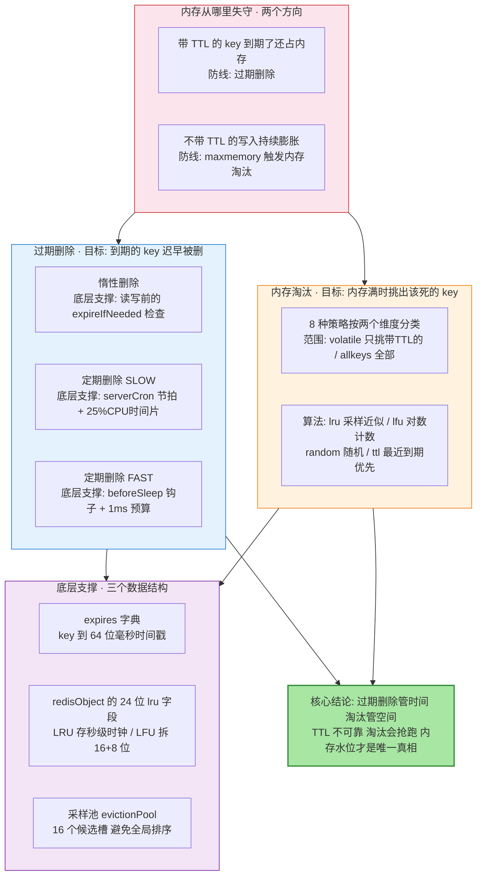
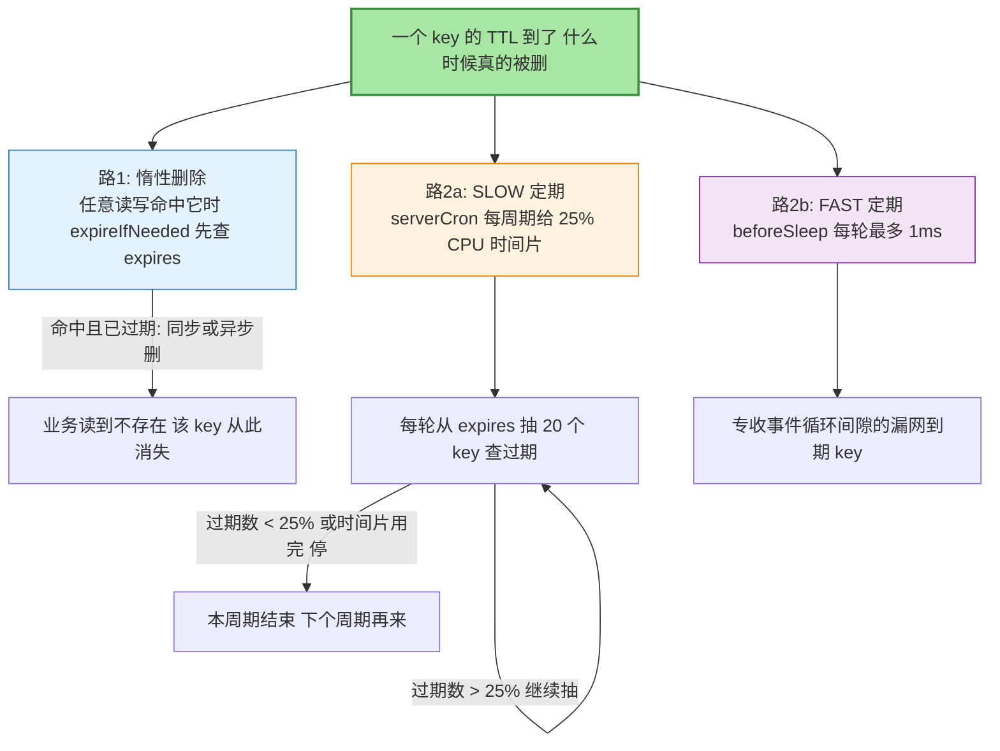
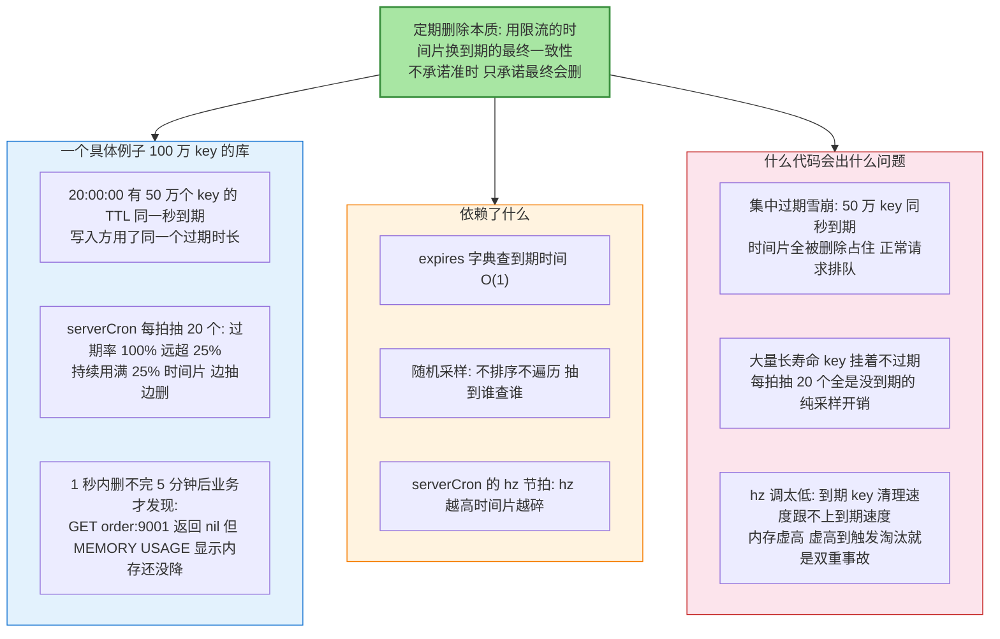
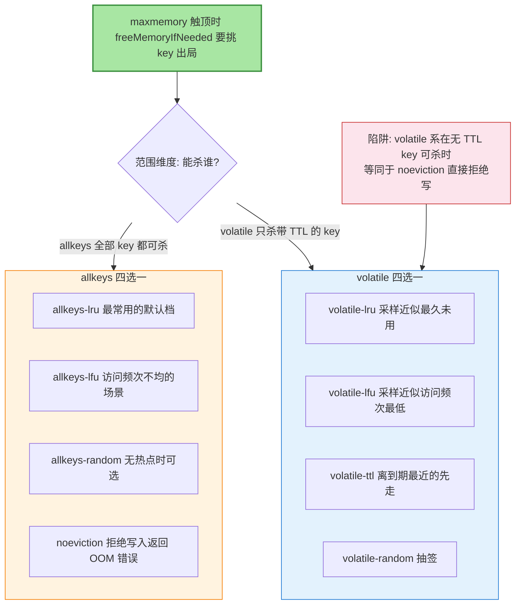
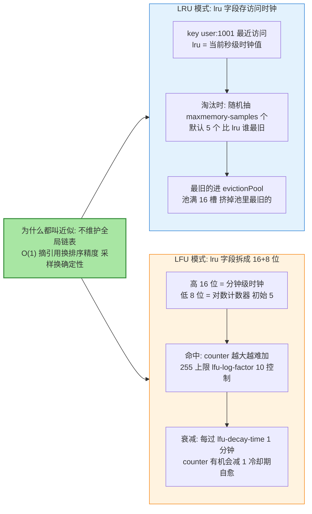
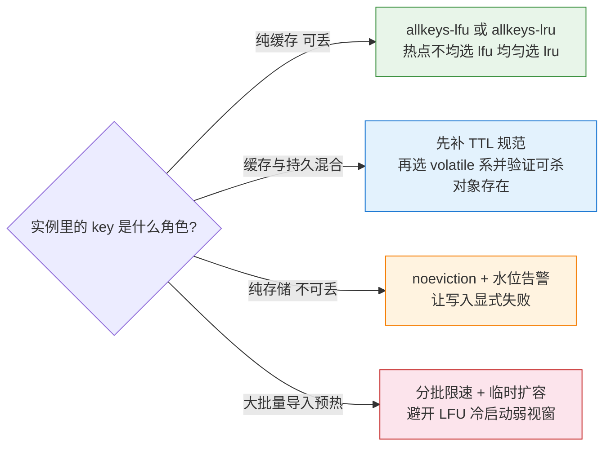

# 过期删除与内存淘汰策略源码：Redis 的两道内存防线

> 先看图，再看字——这张图就是全文：内存从「有 TTL 的 key」和「无 TTL 的膨胀」两个方向失守，Redis 用「过期删除」与「内存淘汰」两道防线各守一边，两道防线的源码支撑与失效形态全在这张图里。

## 一图看懂：过期删除与内存淘汰双防线

**读图三步**：粉红分区是两个失守方向（时间维度的过期、空间维度的膨胀），蓝与橙是两道防线（过期删除、内存淘汰），紫色是它们共同踩着的三个数据结构——`expires` 字典、`redisObject` 的 lru 字段、采样候选池。**最重要的结论在最下面：TTL 只是建议，不是承诺——一旦内存吃紧，没到期照样会被淘汰抢跑。**

## 🎯 本文核心

Redis 管内存靠两道独立防线：**过期删除**处理「活到期的 key」——惰性删除（读写时顺手检查）+ 定期删除（SLOW 模式用 serverCron 的时间片、FAST 模式用主循环收尾的 1ms 预算），保证到期 key 「最终会被删」但不承诺「准时被删」；**内存淘汰**处理「写入超过 maxmemory」——8 种策略按「范围（volatile/allkeys）×算法（lru/lfu/random/ttl）」分类，用采样近似实现 LRU/LFU，绝不维护全局链表。**两道防线的关键区别：过期删除是「延迟执行已确定的删除」，淘汰是「现场决策谁该死」——前者只丢时间点，后者丢的是数据本身。**

机制链一句话：**写入带 TTL → expires 字典登记 → 惰性/定期两条路删除 → 若内存仍超 maxmemory → 按策略采样挑 key 淘汰 → 释放并同步 DEL 给从库**。

## 一句话摘要

过期删除 = 惰性（expireIfNeeded 查 expires 字典）+ 定期（SLOW 每周期最多 25% CPU 时间片、FAST 在 beforeSleep 限 1ms，每轮采样 20 个 key、过期比例超 25% 就继续），到期 key 不准时删除只保证最终删除；内存淘汰 = 内存触及 maxmemory 后按 8 种策略（volatile/allkeys × lru/lfu/random/ttl + noeviction）采样淘汰，LRU/LFU 都靠 redisObject 的 24 位 lru 字段近似实现——TTL 不防淘汰，内存水位才是唯一真相。

## 5W 速记卡

| 维度 | 一句话 |
|---|---|
| What | 惰性+定期两路过期删除、8 种策略采样淘汰，共用 expires 字典与 24 位 lru 字段 |
| Why | 全量定时器/全局 LRU 链表的内存与 CPU 成本不可接受，近似换可行性 |
| When | 过期删除在读写时与后台节拍里持续发生；淘汰只在触顶 maxmemory 时发生 |
| Where | expire.c / evict.c / db.c 的 expires 字典 / redisObject 的 lru 字段 |
| How | 缓存型用 allkeys-lfu、敏感数据别只靠 TTL、盯 INFO 里的 evicted_keys 与 expired_keys |

## 一、过期删除：三个时机两条路

三条路的具体值：**惰性删除**的判定发生在 `expireIfNeeded`——任何读写先查 `expires` 字典里这个 key 的毫秒时间戳，过期则执行删除再返回「不存在」；**SLOW 模式**由 `serverCron`（hz 默认 10，即每 100ms 一拍）触发，每拍预算为 CPU 时间的 25%（公开口径，`activeExpireCycle` 的 SLOW 分支），每轮从 `expires` 字典随机抽 20 个 key（`ACTIVE_EXPIRE_CYCLE_LOOKUPS_PER_LOOP`），抽出的过期比例超过 25% 就继续下一轮，低于 25% 说明这个库里到期 key 不密，收手等下一拍；**FAST 模式**挂在 `beforeSleep`，总预算 1ms，专收事件循环间隙里的到期 key。**过期比例 25% 这个阈值的设计逻辑**：抽 20 个里过期超过 5 个，说明 expires 字典里此刻密密麻麻全是到期 key，多花时间片划算；反之时间比钱贵，赶紧收手。

**过期的 key 会被怎么删**：受 `lazyfree-lazy-expire` 开关控制——开启后删除动作进 BIO 后台线程（大 value 的释放不再阻塞主循环），关闭则同步释放。

### 组件四要素图：activeExpireCycle 定期删除

## 二、内存淘汰：8 种策略按两个维度分类

分类记忆法：**先问范围（带没带 TTL）、再问算法（lru/lfu/random/ttl）**，2×4 减去不存在的组合正好 8 种（`noeviction` 独立成档）。两个最容易被忽略的语义：**其一，`volatile-*` 在库里一个带 TTL 的 key 都没有时，表现与 `noeviction` 一致**——写入直接报错，很多团队配了 `volatile-lru` 以为有淘汰兜底，实际全是持久 key 时兜底是空的；**其二，从库默认不自行淘汰**（公开口径），主库淘汰后把 DEL 同步给从库，主从内存占用存在时间差窗口。

### LRU 与 LFU 的实现差异：同一个 24 位字段的两种用法

**关键路径（源码级）**：LRU 侧，每次访问 key 都会刷新 `redisObject->lru` 为 `LRU_CLOCK()`（秒级精度）；淘汰时 `evictionPool` 维护 16 个候选槽，`freeMemoryIfNeeded` 每轮随机采样 `maxmemory-samples`（默认 5）个 key，算出「空闲时长 = 当前时钟 - lru」，比池里最旧的还旧就挤进池子，真正淘汰时先杀池里空闲最久的。LFU 侧，同 24 位被复用：高 16 位存「最后访问的分钟数」，低 8 位存对数计数器——命中时以概率 `1/(counter×lfu_log_factor+1)` 才递增（计数越大越难涨，255 是天花板），不访问则按 `lfu-decay-time` 每分钟衰减，**「曾经很热但已经冷了」的 key 会被冷却下来让位给新热点**。这是 LRU 与 LFU 最本质的行为差异：LRU 只记得「上次什么时候见过」，LFU 同时记得「见过多少次」和「冷却了多久」。

## 三、为什么不选：两个被舍弃的精确方案

**为什么不选「每个过期 key 挂一个精确定时器」（反方案一）？**到期即删的定时器方案（如每 key 一个 timer）代价是：百万级 key 就是百万级定时器的内存与调度开销，且删除动作全部挤在到期时刻执行——Redis 选择了「惰性 + 定期」把删除成本摊薄到读写路径与后台时间片里，换来 O(1) 的登记成本（写 expires 字典一条）和可控的删除节奏。**代价是时间点不精确**：冷 key 过期后可以一直占内存到被定期删除扫到或被淘汰抢跑——业内认知，一个只写不读的过期 key 平均多存活秒级到分钟级。

**为什么不选「全局双向链表维护精确 LRU」（反方案二）？**真正的 LRU 需要每次访问把节点摘下搬到链表头：链表指针每 key 约 16-24 字节额外内存（业内认知量级），百万 key 就是几十 MB 的纯开销；更致命的是访问路径从「改一个整数」变成「两次指针操作 + 可能的缓存行失效」，每次读写都变慢。**采样近似 LRU 用 5 个样本的精度损失换掉了整条链表**——官方口径，增加 `maxmemory-samples`（如 10）可以让淘汰更接近真 LRU，代价是淘汰判定多耗 CPU。

## 四、事故复盘（匿名化叙事）

**复盘一：缓存实例写满后的批量 OOM 报错。**现象：某内容平台缓存实例高峰期批量报 `OOM command not allowed`，写入全部失败，读不受影响。**排查**：`INFO memory` 显示 `used_memory` 已顶到 `maxmemory`；`CONFIG GET maxmemory-policy` 返回 `volatile-lru`，而 `INFO keyspace` 显示该实例 90% 以上 key 是不带 TTL 的持久化 key——**volatile 系无 key 可杀，等于 noeviction**，淘汰兜底形同虚设；`INFO stats` 的 `evicted_keys` 长期为 0 印证了这一点。**复盘**：把纯缓存实例策略改为 `allkeys-lfu`，并为「无 TTL key 占比」加监控告警。教训一句话：**配了淘汰策略不等于有兜底，要看可杀对象是否真实存在。**

**复盘二：LFU 上线后的新 key 误杀。**现象：某推荐系统把实例从 `allkeys-lru` 切到 `allkeys-lfu` 后，刚导入的新数据频繁「写进去几分钟就查不到了」。**排查**：`evicted_keys` 曲线在导入时段陡增；对被杀 key 抽样 `OBJECT FREQ`，发现新 key 的对数计数器初始值只有 5（`LFU_INIT_VAL`，公开口径），导入时大量一次性写入把内存瞬间推顶，新 key 因「频次最低」批量被淘汰——LFU 需要「预热时间」积累计数，冷启动窗口内它比 LRU 更激进地杀新 key。**复盘**：导入改成分批限速 + 导入期临时调大 `maxmemory`，预热完成后再恢复；同时对计数器衰减参数按业务访问周期重新校准 `lfu-decay-time`。教训一句话：**LFU 的公平是「按历史频次」的公平，新成员在冷启动窗口天然弱势。**

## 五、追问链：质疑者三连

**追问一：TTL 设了 60 秒，第 61 秒读为什么一定读不到？过期删除不是不准时吗？**分两种情况：热 key 在第 61 秒仍被读，惰性删除的 `expireIfNeeded` 先于任何读执行，检查 expires 字典发现过期立即删——**热 key 的删除是准时的，因为删除搭了读请求的便车**；不准时的是冷 key（没人读它），它靠 SLOW/FAST 两个定期删除在时间片里慢慢扫，扫到前一直占内存。所以准确的表述是：「读不到」由惰性删除保证（必然准时），「内存释放」由定期删除保证（最终一致）。

**再追问：集中过期既然危险，业务该怎么拆 TTL？**把同一批数据的 TTL 加随机抖动（业内惯例：基础时长 ±10-20% 随机），把「同一秒到期」摊成「一段时间内陆续到期」；定时删除压力也可以用 `hz` 微调（CONFIG SET hz 100 把节拍从 100ms 提到 10ms，时间片更碎、单拍删除量更小）——但 hz 调高会挤占主循环，需配合延迟监控验证。

**打破砂锅：过期删除已经会删 key 了，为什么还需要内存淘汰？两者不是重复吗？**不重复，因为内存失守还有第三个来源：**不带 TTL 的写入**——它们永远不会过期，`expires` 字典管不到它们；即便全部 key 都有 TTL，到期清理速度也可能落后于写入速度。淘汰是空间维度的最后防线，触发条件是 `used_memory > maxmemory`，与时间无关。**过期删除答「活多久」，淘汰答「谁该让位」**——两个问题，两套机制。

## 六、不同量级的思考：约束来源决定解法

- **十万级 key（小实例）**：约束来源是内存绝对值小——全量 key 都带 TTL 也占不了多少 expires 字典空间，到期清理压力有限；这一档的核心问题是「选对策略别误杀」，而不是「清理吞吐」；思考方式是**语义驱动**——缓存型直接 `allkeys-lru`，一个策略管到底，无需精细分层。
- **百万级 key（中型集群）**：约束来源是定期删除的时间片与到期速度开始赛跑——集中过期、长尾冷 key 的内存虚高真实出现；这一档的核心问题是「删除节奏与写入节奏的平衡」，而不是「策略选哪个」；思考方式是**节奏驱动**——TTL 加抖动、hz 按负载校准、`lazyfree-lazy-expire` 开启把释放挪出主循环、监控 `expired_keys` 速率。
- **千万级 key（大型集群）**：约束来源是单实例内存上限与淘汰频率——`evicted_keys` 从偶发变常态，淘汰开始参与内存管理的日常工作；这一档的核心问题是「淘汰速率的真实含义」，而不是「过期清理快不快」；思考方式是**水位驱动**——maxmemory 留余量、`evicted_keys` 速率告警、`maxmemory-samples` 按误杀容忍度调、按 key 角色拆实例。
- **亿级 key（大规模多实例）**：约束来源是单实例内存上限被迫切小（防止 fork/恢复/迁移被内存规模绑架），实例数暴涨后「策略一致性」成为治理问题；这一档的核心问题是「几百个实例的策略与水位能不能统一管控」，而不是「单实例怎么调」；思考方式是**治理驱动**——配置中心统一下发 `maxmemory-policy`、水位分位数告警、无 TTL key 占比巡检，把单点调优变成全局纪律。这个量级还要把上下游拉进视野：被淘汰的 key 靠回源重建，淘汰率直接折算成 DB 与下游服务的负载，选策略必须看整张架构图而不是只看 Redis 自己。

思考方式总结：十万级靠「选对策略」，百万级靠「管住节奏」，千万级靠「管住水位」，亿级靠「统一治理」——约束从语义正确性迁移到删除吞吐再迁移到规模一致性，解法跟着约束来源走。

**自下而上与触发升级**：三个实测值定档——`INFO keyspace` 里带 TTL 的 key 占比（决定 volatile 系是否可用）、`expired_keys` 与 `evicted_keys` 的每秒速率（速率掉头向上就是节奏失控信号）、实例数（过百就要上统一配置治理）。触发升级的信号：TTL 抖动与 hz 调优后 `expired_keys` 仍堆积，说明该升「节奏驱动」；单实例已最优但全局水位参差，说明该升「治理驱动」。约束来源（内存规模与实例规模）迁移了，思考方式才跟着迁移。

## 七、业内惯例与生产实践

- **策略选择**（公开技术社区口径的通行做法）：纯缓存实例 `allkeys-lfu`（有热点不均）或 `allkeys-lru`（访问均匀）；混合存储 + 缓存的实例慎用 volatile 系——必须确保淘汰候选真实存在；存储型实例用 `noeviction` 加水位告警，让写入方显式失败而不是静默丢数据。
- **maxmemory 留余量**：业内常见设到物理内存的 70-80%，给 fork 写时复制、复制缓冲区、内存碎片留空间（公开口径）。
- **采样可调**：追求更接近真 LRU 可把 `maxmemory-samples` 提到 10（官方口径），淘汰更准、CPU 略升；默认 5 是绝大多数场景的平衡点。
- **主从语义**：淘汰由主库决策并同步 DEL，从库内存占用滞后于主库——容量规划按主库水位算，从库不要反向配置淘汰策略期待它自救。
- **反模式**：只靠 TTL 防内存（冷 key 过期不及时 + 无 TTL key 漏网）、`evicted_keys` 增长无告警（淘汰在偷数据）、LFU 直接承接大批量冷启动导入、把 `noeviction` 的写入报错当业务异常处理而不当容量信号处理。

## 💡 实战提示

- 💡 上线前先跑 `CONFIG GET maxmemory-policy` + `INFO keyspace`：volatile 系策略配在无 TTL key 占 90% 的实例上，等于没有兜底
- 💡 `OBJECT IDLETIME mykey`（LRU 模式）/ `OBJECT FREQ mykey`（LFU 模式）能直接看单个 key 的冷热——排查「为什么这个 key 被淘汰」比猜快得多
- 💡 盯两个速率而不是两个存量：`expired_keys` 涨得快是清理在赛跑，`evicted_keys` 涨得快是内存已经不够——后者意味着数据在被偷走
- 💡 TTL 统一时长是雪崩引信：同批数据统一加 ±10-20% 抖动，把集中到期摊平成坡
- 💡 `lazyfree-lazy-expire yes` 与本系列第 1 篇的 UNLINK 是同一条纪律：删除释放这类粗活永远不该占主循环

## 开放问题

- LFU 冷启动窗口（新 key 计数器弱势期）的通用补偿方案，社区尚无标准做法，按业务分批导入与临时扩容是当前主流
- 采样数与淘汰精度/ CPU 成本的量化关系，官方只给方向性结论，具体数值依赖各实例负载实测

## 你们可能会问

**Q1：TTL 到期的 key 一定查不到吗？会不会读到旧值？**
一定查不到。惰性删除在任何读之前执行——`expireIfNeeded` 先查 expires 字典，过期就先删再返回 nil。所以「过期删除不准时」指的是**内存释放**不准时（冷 key 要等定期删除扫到），不是**可见性**不准时：到期后的读永远拿不到旧值。

**Q2：maxmemory 设多大合适？设成 0 不限制行吗？**
64 位系统默认 0（不限制），意味着内存涨到物理内存耗尽、被操作系统 OOM killer 或 swap 接管——后者会让全部访问变成磁盘级延迟，比主动淘汰更糟。业内常见做法是设物理内存的 70-80% 并搭配淘汰策略与告警，给 fork、复制缓冲区、碎片留出安全余量。

**Q3：为什么我的 volatile-lru 淘汰的是这些 key？怎么预测谁会被杀？**
采样近似决定了「谁被杀」有随机性：每轮随机抽 5 个样本，杀的是样本里最旧的——不在样本里的更旧 key 这次不会死。要预测只有相对判断：长期不访问的 key 大概率先死（空闲时长进得了候选池）。精确复现淘汰名单做不到，也不该追求——那等于退回全局链表方案。

**Q4：从库会不会自己淘汰导致主从数据不一致？**
默认不会。淘汰决策只在主库，主库把 DEL 命令同步给从库——所以主从之间有一个「DEL 传播延迟」窗口，从库内存占用略高于主库属正常。容量规划以主库为准，且不要给从库单独配置不同的淘汰策略来「自保」。

## 什么时候用 / 不用

先看决策图：

- ✅ **纯缓存用 allkeys-lfu/lru 系**：数据可回源重建，淘汰即正常 GC
- ✅ **混合实例先规范 TTL 再上 volatile**：保证淘汰候选真实存在
- ✅ **存储型用 noeviction + 告警**：数据不能丢时，写入失败是比静默淘汰更诚实的信号
- ❌ 不用 TTL 当唯一内存防线——冷 key 清理慢 + 无 TTL key 漏网，两道防线缺一不可
- ❌ 不在无 TTL 环境配 volatile 系然后以为有兜底——OOM 报错会替它说出真相
- ❌ 不用 LFU 硬接大批量冷启动导入——新 key 计数弱势期会被批量误杀
- ❌ 不追求「精确复现淘汰名单」——采样近似的精度损失是换内存与速度的既定交易

## Trade-off：精度、内存、确定性三者只保两个

这套设计处处是同一笔交易：**精确性换可行性**。过期删除用「最终一致」换掉百万级定时器的开销；LRU 用「5 样本近似」换掉全局链表的内存与访问路径变慢；LFU 用「对数计数器 + 概率递增」换掉精确计数的存储成本。工程上真正要权衡的是：**你的业务对「哪个 key 死」有多敏感**——纯缓存对误杀钝感，默认参数就是最优解；热点排行榜这类「误杀一个明星 key 就是事故」的场景，宁可调大 `maxmemory-samples`、留更大内存余量，用钱买精度。反过来，用存储型的严格标准要求缓存实例（比如拒绝任何淘汰），就会在错误的地方付出 noeviction 拒写的可用性代价。先分清 key 的角色，再选交易的价位。

## 🎯 核心带走

- **一图一句**：过期删除管时间（到期 key 最终会删），内存淘汰管空间（触顶时挑 key 让位）——两道防线共用 expires 字典与 24 位 lru 字段
- **过期三路**：惰性（读写便车，可见性准时）、SLOW（serverCron 的 25% 时间片）、FAST（beforeSleep 的 1ms 预算）——热 key 准时死，冷 key 最终死
- **淘汰八种**：范围（volatile/allkeys）×算法（lru/lfu/random/ttl）+ noeviction；volatile 无 key 可杀时等同拒写
- **近似哲学**：不建全局链表、不挂精确定时器——采样换精度、时间片换实时，都是「精确性换可行性」的既定交易
- **监控两速率**：`expired_keys` 速率是清理赛跑的表，`evicted_keys` 速率是数据被偷的表——涨起来的那一刻策略就该升级了
- **量级主线**：语义驱动 → 节奏驱动 → 水位驱动 → 治理驱动，约束从选型迁移到吞吐再迁移到规模一致性

## 📌 数据与事实声明

- 写于 2026-09-24（特性层新增，Redis 底层编码系列第 4 篇）；机制描述以 Redis 官方文档与 GitHub 源码（expire.c / evict.c / db.c，7.x 分支）公开内容为基准
- 「链表指针每 key 16-24 字节、冷 key 平均多存活秒到分钟级、maxmemory 设物理内存 70-80%」等为业内认知与公开口径的经验值，非实测数据
- LFU 参数（lfu-log-factor 10 / lfu-decay-time 1 / LFU_INIT_VAL 5）与采样参数（maxmemory-samples 5、每轮采样 20 个 key、25% 阈值）为 Redis 默认值（公开口径），随版本演进以官方文档为准
- 事故复盘为公开技术社区高频案例模式的匿名化复述，不含任何真实系统、公司与内部代号

## 📚 参考资料

| 类型 | 标题 | 来源 |
|---|---|---|
| 官方文档 | Redis LRU cache / Using Redis as an LRU cache（采样淘汰说明） | redis.io/docs |
| 官方文档 | EXPIRE / OBJECT 命令文档 | redis.io/commands |
| 源码 | expire.c（activeExpireCycle）/ evict.c（freeMemoryIfNeeded）/ lazyfree.c | github.com/redis/redis |
| 系列内 | 本系列第 3 篇：redisObject 对象系统（lru 字段所在结构） | 本系列 |
| 关联阅读 | 线程模型系列：lazyfree 与后台线程 | `docs/middleware/redis/特性层/深入理解线程模型系列/1_Redis单线程模型与IO多路复用-特性.md` |
