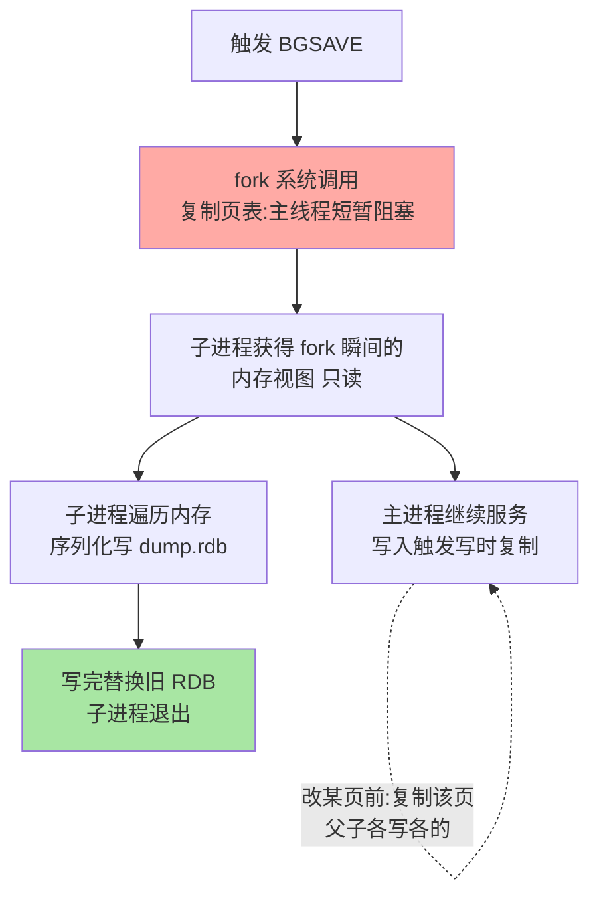
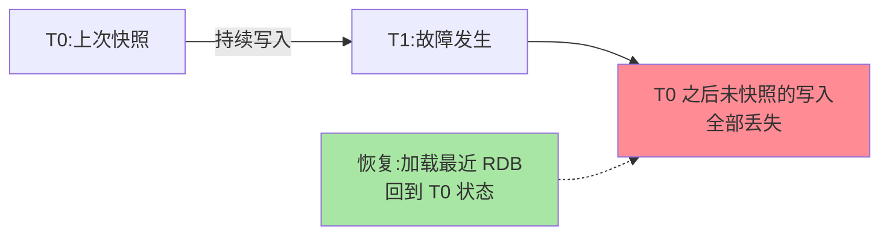

# RDB 与写时复制：快照的代价账本

> RDB 是「某一瞬间的全量快照」——听起来简单，工程上最难的一问是：**怎么在不停止服务的前提下拍下「一瞬间」**？答案是 fork + 写时复制（COW）。这篇把快照机制、内存膨胀的最坏情形、丢失窗口三笔账算清楚。

## 一句话摘要

RDB 通过 **BGSAVE fork 子进程**实现无锁快照：fork 瞬间复制页表让子进程看到「那一刻」的内存视图，之后父子进程靠**写时复制**各写各的页——主进程持续服务，子进程遍历内存生成紧凑的二进制快照。**代价两笔**：fork 瞬间的页表复制阻塞（与内存量成正比），COW 触发的内存膨胀（写密集时最坏接近翻倍）。**RDB 的丢失窗口 = 两次快照的间隔**，这是它与 AOF 的根本分野。

## 🎯 本文核心

**核心一句话：RDB 的「瞬间一致快照」由 fork 的页表复制实现（不复制数据，只复制映射），快照生成与线上服务并行——两笔代价（fork 阻塞 ∝ 内存量、COW 膨胀 ∝ 快照期写入分散度）与一个丢失窗口（两次快照间隔）构成完整代价账本。**

机制链：BGSAVE 流程 → 写时复制的 OS 语义 → fork 阻塞量化 → COW 膨胀量化 → 触发体系（dirty 计数器状态机）→ 丢失窗口与 AOF 的分工。全文一句话可重构：「fork 买一致性，COW 付内存，窗口定丢失」。

## 前置阅读

- 入门层篇 9《持久化机制》：RDB/AOF 的定位与触发配置
- 本系列篇 1《SDS 与内存编码演进》：RDB 序列化的正是这些底层编码结构

## 目标导向

本文是什么：RDB 快照机制与 COW 代价的完整拆解。功能是什么：让「快照期间服务卡不卡、内存为什么涨、会丢多少数据」三问有机制答案。能得到什么：fork 阻塞与 COW 膨胀的量化口径、触发策略的取舍依据、故障排查的归因模型。为什么用：内存容量规划、持久化选型、快照期抖动排查，必看。

## 一、边界：入门层讲过什么，本文讲什么

| 内容 | 入门层 | 本文 |
|---|---|---|
| RDB/AOF 是什么、怎么配 | ✅ 讲过 | 不重复 |
| fork + COW 的机制与代价 | 未讲 | **本文核心一** |
| 触发条件与丢失窗口 | 提了一句 | **本文核心二** |
| 与 AOF/混合持久化的取舍 | 提了一句 | 本系列篇 2 |

## 二、BGSAVE：fork 一瞬间，快照慢慢来

机制要点：fork 不复制内存数据，只复制**页表**（虚拟内存到物理页的映射）——子进程与父进程初始共享所有物理页，谁写谁复制（Copy-On-Write）。于是「拍瞬间快照」不等于「停机拷贝内存」：**快照的一致性由 fork 那一瞬保证，生成过程与线上服务并行**。

两笔代价要算清：

1. **fork 阻塞**：页表复制的耗时与实例内存量成正比——大实例（几十 GB）fork 可达数百毫秒，期间主线程不能处理命令。**这是 RDB 抖动的第一来源**，也解释了为什么「实例宜拆小」在持久化语境同样成立
2. **COW 膨胀**：快照期间主进程改写页，被改页复制一份。**最坏情形（快照期间所有页都被改）内存接近翻倍**；现实写密集负载的经验口径是额外 20%-50%——容量规划必须给 fork+快照窗口留余量，业内以「内存余量不低于 30%-40%」作守门线

## 三、触发体系与丢失窗口

RDB 的触发四路：手动 `SAVE`（阻塞版，生产禁用）/ `BGSAVE`；配置阈值自动触发（`save 900 1` 等，**条件之间是「或」**——任一满足即触发）；主从全量同步时主库自动 BGSAVE；`SHUTDOWN`/`DEBUG RELOAD` 等运维动作。`rdbcompression`（LZF）与 `rdbchecksum` 控制文件体积与完整性。

**丢失窗口 = 上次快照到故障时刻的间隔**。阈值触发的语义正是为此：`save 900 1` = 「900 秒内至少 1 次修改就快照」——修改越频繁快照越勤，但窗口始终存在。这份「可能丢几分钟」的账，就是 RDB 与 AOF 分工的起点：**RDB 管恢复速度与文件体积，AOF 管丢失窗口**，混合持久化让两者兼得（本系列篇 2）。

## 四、源码关键路径

以 8.0 主线口径（src/）：

- BGSAVE 入口：`rdbSaveBackground`（rdb.c）——`fork()` 后子进程走 `rdbSave` 遍历全库序列化
- 序列化：`rdbSaveRio` 按 db 逐键写出，复用底层编码的对象序列化函数（上篇的编码结构在这里落盘）
- COW 依赖：操作系统的 fork 页表复制与页错误（缺页写复制），Redis 侧无额外代码——**机制在 OS，Redis 只是使用者**
- 阈值触发：`serverCron` 里检查 `saveparams` 条件与 dirty 计数器

阅读建议：抓住「dirty 计数器」——每次写命令累加、快照完成清零，它是阈值触发的状态机核心。

## 典型场景

- **纯缓存实例**：数据可重建，业内常见干脆关 RDB（或拉长阈值）——省掉 fork 抖动与 COW 膨胀，可用性反而更好
- **主从全量同步高峰**：主库 BGSAVE 生成的正是全量同步的种子文件——大实例的「从库重连风暴」会叠加 fork 卡顿，错峰重连是运维常识
- **恢复演练**：RDB 加载百万级键只需秒到分钟级（内存直接映射加载），是「重启后快速回血」的首选路径

## 业内惯例

> 💡 **实战提示**
> - 什么时候关 RDB：纯缓存实例（数据可由事实源重建）——省掉 fork 抖动与 COW 膨胀，可用性反而更好；有状态实例反之必须开
> - fork 耗时进监控：`INFO stats` 的 `latest_fork_usec` 持续走高 = 实例内存量已到「持久化不友好」区间，拆小是正解
> - 从库重连风暴错峰：主从全量同步的种子就是 BGSAVE——批量重启从库时错开时间，别让多个全量同步叠加
> - COW 膨胀的压测方法：快照窗口内灌写入负载，观察 RSS 峰值与 used_memory 的差——自己负载的膨胀系数只有压测能给

- **内存余量 30%-40% 守门**：为 fork 页表复制 + COW 膨胀留空间，maxmemory 只设物理内存的 50%-60%——容量规划的业内默认口径
- **快照调度错峰**：自动阈值与业务高峰错开（低峰触发为主的参数组合），大实例固定低峰定时 BGSAVE
- **实例拆小优先于调参**：10GB 实例的 fork 代价远低于 40GB 实例——「大内存实例」与「持久化友好」天然冲突，拆分是架构正解
- **RDB 文件异地备份**：快照文件是「可传送的时间点」，异地副本是最廉价的容灾保险（误删整个实例的最后一根稻草）

## 五、常见误区

- **「BGSAVE 完全不阻塞」**：fork 那一下阻塞主线程，内存越大阻塞越久——「不阻塞」只是「不长时间阻塞」，大实例的短阻塞照样是抖动源
- **「maxmemory 设到物理内存 80% 没问题」**：常态运行没问题，BGSAVE 一来 COW 膨胀直接 OOM——**余量是给持久化的，不是浪费**
- **「触发条件是并且关系」**：`save` 多行配置任一满足即触发（或关系）——理解反了会算错快照频率与丢失窗口
- **「子进程写坏了主进程也完蛋」**：子进程只读共享页 + 写自己的临时文件，完成后原子替换——快照失败不影响线上，这是 fork 隔离的设计红利

## 六、与相邻机制的关系

- 本系列篇 2《AOF 重写与混合持久化》：丢失窗口的另一半答案，重写机制与 RDB 的 fork 逻辑同源
- 入门层篇 11：内存余量与大 Key 的运维视角
- tips 互指：主从全量同步复用 BGSAVE 的细节在高可用系列篇 1 展开

## 你们可能会问

**Q1：为什么不用 «停服 + 拷贝内存» 的朴素快照？**
可用性归零；而 fork+COW 用「页表复制的一次性小代价」换「服务不断 + 快照一致性」——这是 OS 提供的现成解，机制成本远低于应用层自造。

**Q2：COW 期间内存膨胀能精确预估吗？**
不能精确，只能按「快照窗口内的写页比例」估算。写越集中（少数热页）膨胀越小、写越分散膨胀越大——用 `INFO` 的 fork 耗时与内存曲线在压测里量出自己负载的系数。

**Q3：AOF 开着还需要 RDB 吗？**
强烈建议保留（或直接用混合持久化）：AOF 文件大、恢复慢，RDB 是快速回血与异地带档的载体——「AOF 管不丢、RDB 管快回」是分工不是二选一。

## 七、自测三问

1. fork + COW 如何做到「服务不断拍出瞬间一致快照」？
2. RDB 的两笔代价分别与什么成正比？容量规划怎么留余量？
3. RDB 的丢失窗口由什么决定？它在持久化体系里承担什么分工？

## 开放问题

- 大内存实例的 fork 代价催生了「无 fork 快照」的探索（如云厂商的共享存储快照、COW-free 方案），持久化机制与实例形态的耦合正在被云架构重构。
- Redis 的模块化持久化接口（如 RDB 模块 API）让自定义序列化成为可能，快照格式的生态化是潜在演进方向。

## 🎯 核心带走

- **核心一句话**：RDB = fork 页表复制买「瞬间一致」+ COW 付内存代价 + 丢失窗口=快照间隔——fork 阻塞与内存量成正比，容量余量 30-40% 是守门线
- **机制链**：BGSAVE 流程 → COW 语义 → 两笔代价量化 → dirty 计数器触发 → 窗口与 AOF 分工
- **哪里会坏**：大实例 fork 百毫秒阻塞、maxmemory 贴顶 COW OOM、触发条件或关系误读
- **边界**：本篇管 RDB 侧；AOF 重写与混合持久化在篇 2，SDS 编码的落盘形态在系列篇 1

## 📌 数据与事实声明

- 写于 2026-09-08，机制以 Redis 8.0 主线源码与官方文档为准；COW 语义由操作系统提供
- 「fork 耗时数百毫秒/膨胀 20%-50%/余量 30%-40%」为业内经验口径，需按实例与负载实测
- 免责：参数默认值以 redis.io 官方文档为准

## 📚 参考资料

| 类型 | 标题 | 来源 |
|---|---|---|
| 官方文档 | Redis Persistence（RDB 部分） | redis.io/docs/management/persistence |
| 官方源码 | redis/redis（src/rdb.c） | github.com/redis/redis |
| 原理书 | 《Redis 设计与实现》黄健宏（RDB 持久化章） | 公开出版 |
| 实战书 | 《Redis 开发与运维》付磊/张益军 | 公开出版 |
