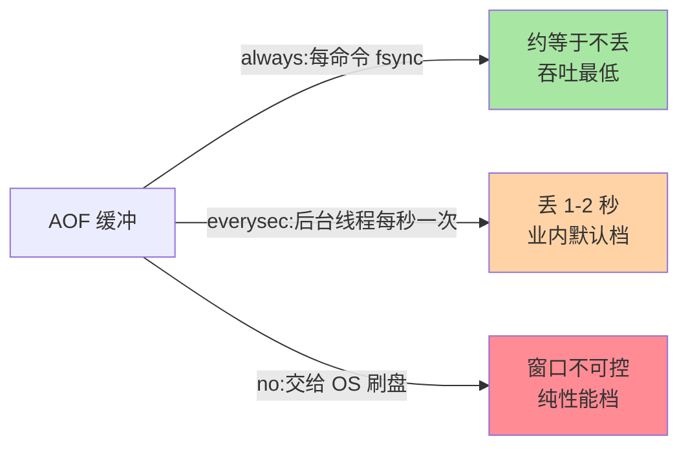
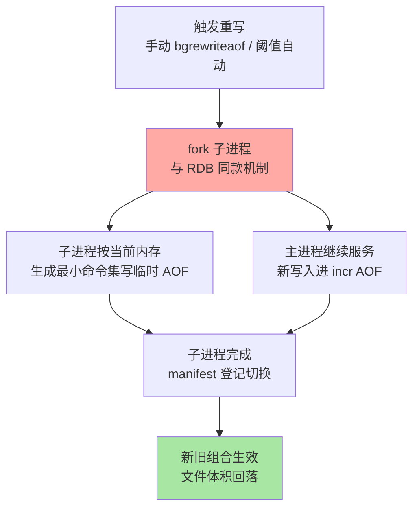

# AOF 重写与混合持久化：丢失窗口的另一半答案

> AOF 把「丢几分钟」压缩到「丢一秒甚至不丢」，但代价是文件无限膨胀——重写机制就是膨胀的解药。这篇讲清三种写回策略的丢失窗口、重写的 fork 复用、7.0 的 Multi-Part AOF 演进，以及 RDB+AOF 合体的混合持久化。

## 一句话摘要

AOF 以**命令追加日志**记录每次写操作，`appendfsync` 的三个值（always/everysec/no）给出**持久化强度从强到弱的三个档位**——everysec 是业内默认（最多丢 1-2 秒）。日志只增不减，**重写（bgrewriteaof）按当前数据状态生成最小命令集**，复用 fork 让重写与线上服务并行。7.0 起 Multi-Part AOF 把「base（RDB 格式）+ incr（增量）+ manifest（清单）」拆成多文件管理，`aof-use-rdb-preamble` 开启的**混合持久化**让恢复速度与丢失窗口兼得。

## 🎯 本文核心

**核心一句话：AOF 用「命令日志 + 周期重写」实现低丢失窗口——everysec 的「丢 1-2 秒」是磁盘卡顿时主动弃车的机制上限而非模糊估计；重写复用 fork（RDB 的代价在这里原样复付）；7.0 Multi-Part 用 manifest 原子切换退役双缓冲，混合持久化让 RDB 恢复速度与 AOF 丢失窗口一次拿全。**

机制链：三档 fsync 的丢失账 → 弃车逻辑 → 重写的最小命令集生成 → auto 重写阈值语义 → Multi-Part 文件布局 → 混合持久化的两全。全文一句话可重构：「everysec 弃车保主，重写复 fork 瘦身，manifest 保原子，base+incr 两全」。

## 前置阅读

- 入门层篇 9《持久化机制》：AOF 的定位
- 本系列篇 1《RDB 与写时复制》：fork + COW——重写机制的同一块地基

## 目标导向

本文是什么：AOF 写回策略、重写机制与混合持久化的完整拆解。功能是什么：把「丢多少、文件多大、恢复多快」三个运维命题钉到机制上。能得到什么：写回策略选型依据、重写触发的调参逻辑、7.0 演进的兼容性认知。为什么用：持久化选型、AOF 文件膨胀治理、Redis 7.0+ 升级评估，必看。

## 一、边界：入门层讲过什么，本文讲什么

| 内容 | 入门层 | 本文 |
|---|---|---|
| AOF 是什么、appendfsync 三档 | ✅ 讲过 | 不重复 |
| 重写机制的 fork 复用细节 | 未讲 | **本文核心一** |
| 7.0 Multi-Part AOF 演进 | 未讲 | **本文核心二** |
| 三档丢失窗口的机制解释 | 提了一句 | **本文核心三** |

## 二、三档写回：丢失窗口的机制账

`appendfsync` 决定「命令写入 AOF 缓冲后，fsync 什么时候发生」：

| 档位 | fsync 时机 | 丢失窗口 | 代价 |
|---|---|---|---|
| always | 每次写命令后同步 fsync | ≈ 不丢 | 每命令一次磁盘同步，吞吐骤降 |
| **everysec** | 后台线程每秒一次 | **1-2 秒**（见误区） | 默认档，性能与安全的平衡 |
| no | OS 决定（约 30 秒级） | 不可控 | 纯性能档 |

三档的强度梯度一眼版：



everysec 的「1-2 秒」不是模糊话术而是机制细节：fsync 由**后台线程**执行，磁盘繁忙时 fsync 卡住超过 2 秒，主线程会**择优丢弃缓冲里最老的一秒**以保证自身不被拖死（`aof_delayed_fsync` 计数可观测）——**「最多丢 2 秒」的上限是用「主动弃车」换来的**，这是 everysec 档最容易被误解的一处机制。

## 三、重写：日志瘦身与 fork 的第二次登场

AOF 记的是「命令流」，同一 key 被写一百次就有一百条——**重写按当前数据状态生成等价的最小命令集**（一个 key 一条最终命令），文件从「历史账本」变成「当前快照的命令表达」：



触发双路：手动 `BGREWRITEAOF`；自动阈值 `auto-aof-rewrite-percentage`（较上次重写后的增长率，默认 100%）+ `auto-aof-rewrite-min-size`（默认 64MB）——「涨了一倍且至少 64MB」才重写，防止小文件反复折腾。**重写同样要 fork**，RDB 篇的 fork 阻塞与 COW 膨胀两笔账在这里原样复算——持久化策略对内存余量的索取是双份的。

## 四、7.0 的演进：Multi-Part AOF

7.0 之前：重写期间的新写入同时追加进「旧 AOF + AOF 重写缓冲」，主进程要维护两份缓冲、内存与 CPU 双开销，且重写完成前的数据全靠缓冲兜底。

**7.0 起 Multi-Part AOF**：AOF 拆成三类文件——

```text
appenddirname/
├── base.rdb / base.aof     ← base:重写产物(RDB 格式或 AOF 格式)
├── incr.aof.1              ← incr:重写之后的新增命令流
├── incr.aof.2              ← 重写一轮,incr 序号 +1
└── manifest                ← 清单:当前有效的 base + incr 组合
```

收益：重写期间新写入只进 incr 文件（**缓冲机制退役**），主进程负担下降；manifest 让「base + incr」的组合切换原子化，恢复加载按清单顺序回放。这是 AOF 架构在十余年里最大的一次演进——升级 7.0+ 前的持久化相关兼容性检查，主要就是它。

## 五、混合持久化：恢复速度与丢失窗口兼得

`aof-use-rdb-preamble yes`（默认开启）：**重写生成的 base 用 RDB 二进制格式**，incr 继续记命令流。恢复时先秒级加载 RDB base、再回放少量 incr——**RDB 的恢复速度 × AOF 的丢失窗口**一次拿到。代价是 base 部分失去「人可读的命令文本」属性（老 AOF 可用 `redis-check-aof` 人工检视的调试习惯失效一部分）。

三方案取舍表（选型收口）：

| 方案 | 恢复速度 | 丢失窗口 | 文件体积 |
|---|---|---|---|
| 纯 RDB | 快 | 分钟级 | 小 |
| 纯 AOF（文本） | 慢（逐命令回放） | 秒级 | 大（靠重写控制） |
| **混合** | **快（base 秒加载）** | **秒级** | 中（base 紧凑） |

## 六、源码关键路径

以 8.0 主线口径（src/）：

- 写回：`aof.c` 的 `flushAppendOnlyFile`——everysec 的后台 fsync 与「择优丢弃」逻辑都在这条路径
- 重写：`rewriteAppendOnlyFile`（fork 子进程）+ `aof_rewrite` 遍历全库生成最小命令集
- Multi-Part：`aofmanifest.c` 一族——manifest 读写与 base/incr 文件切换
- 加载：`loadAppendOnlyFiles` 按 manifest 顺序加载 base + 回放 incr

阅读建议：盯住「manifest 的切换时机」——它是 Multi-Part AOF 一切原子性的支点。

## 典型场景

- **标准持久化配置**：`appendfsync everysec + aof-use-rdb-preamble yes + auto-aof-rewrite 阈值默认`——业内默认组合，覆盖绝大多数场景
- **资金类强持久化**：always + 主从 + 半同步类架构兜底——每档 fsync 的吞吐代价由更小的事务量承受
- **AOF 文件膨胀排查**：先看上次重写时间与文件水位，再查「重写被推迟」的常见原因（fork 余量不足被跳过/阈值配置失当）

## 业内惯例

> 💡 **实战提示**
> - 什么时候调 auto-aof-rewrite 参数：写入量大、重写频繁造成 fork 抖动的实例，调高 min-size/percentage 降低重写频率——用更大的文件与恢复时间换运行期平稳
> - AOF 备份按 manifest 组合打包：base 与 incr 是一体（7.0+），只拷单文件的备份恢复不了——备份脚本升级是 7.0 迁移清单的必查项
> - `aof_delayed_fsync` 增长即存储层预警：说明磁盘在 fsync 上拖后腿——先于「丢 2 秒」事故发生的先行指标
> - always 档要配套小事务量：它的适用前提是「每命令 fsync 的代价可承受」——大吞吐场景硬上 always 属于架构错位

- **混合持久化默认开**：新集群没有理由关——「恢复慢」在故障时刻是真实的业务中断延长
- **everysec + delayed_fsync 监控**：`aof_delayed_fsync` 增长 = 磁盘在拖累持久化，是存储层升级的先行指标
- **重写安排在低峰**：与 RDB 同理由（fork 代价），自动阈值之外大实例加定时重写兜底
- **AOF 与 RDB 文件都进异地备份**：混合方案下 base 与 incr 是一体的，备份要按 manifest 组合打包，别只拷单文件

## 七、常见误区

- **「everysec 精确丢 1 秒」**：机制是「最多丢已缓冲未 fsync 的部分，磁盘卡顿时主动弃最老一秒」——1-2 秒的上限来自弃车逻辑，不是模糊估计
- **「重写就是把文件压缩一下」**：重写按「当前数据状态」生成等价命令集，语义是快照重建不是文本压缩——它复用 fork，RDB 的 fork 代价在 AOF 这边一样要付
- **「7.0 升级对持久化无感」**：文件布局从单文件变 multi-part（appenddirname 目录 + manifest），备份脚本与巡检逻辑必须同步改——高频升级翻车点
- **「关了 RDB 只留 AOF 更纯粹」**：混合方案的 base 本身就是 RDB 格式，「纯 AOF」既慢又不省——除非有明确的可读性调试诉求，混合是更优解

## 八、与相邻机制的关系

- 本系列篇 1：fork + COW 与丢失窗口的第一半答案
- 特性层《深入理解高可用系列》：主从全量同步复用 RDB、持久化与复制在恢复时的协作
- tips 互指：`redis-check-aof`/`redis-check-rdb` 修复工具的运维细节在专题层「bigkey 与性能调优深度」与高可用运维专题

## 你们可能会问

**Q1：AOF 文件损坏了怎么办？**
`redis-check-aof --fix` 截断损坏尾部（丢末尾不完整事务）——everysec 下最多丢秒级数据，属于可接受的修复语义；修复前先备份原文件是铁律。

**Q2：重写期间宕机，数据会丢吗？**
不会。manifest 原子切换保证「要么旧组合完整、要么新组合完整」——重写是一次原子升级，崩溃只会让重写作废重来，不会撕裂数据。

**Q3：always 档真的有人用吗？**
有——事务量小、单笔价值高的场景（配置中心类、计费关键写）撑得起每命令 fsync；大吞吐缓存场景用它属于架构错位。

## 八、自测三问

1. everysec 的丢失上限为什么是 1-2 秒？「弃车」逻辑丢了什么、保住了什么？
2. 重写如何复用 fork？7.0 的 Multi-Part 把哪套缓冲机制退役了？
3. 混合持久化的 base 与 incr 分别是什么格式？它同时拿到了哪两个方案的优点？

## 开放问题

- 持久化与复制的边界在云形态下持续模糊（存储与计算分离后「持久化」由共享存储层承接），Redis 自身的 AOF 机制在托管形态里可能逐步退居角色性存在。
- Multi-Part 之后的 AOF 演进方向（更细粒度的 base 增量、并行回放）取决于大实例恢复时间的持续压力。

## 🎯 核心带走

- **核心一句话**：AOF = 命令日志 + 周期重写——everysec 弃车保主（丢 1-2 秒上限）、重写复 fork 瘦身、Multi-Part manifest 保原子、混合持久化 base+incr 两全
- **机制链**：三档 fsync → 弃车逻辑 → 重写最小命令集 → auto 阈值 → Multi-Part 布局 → 混合恢复
- **哪里会坏**：磁盘卡顿触发弃车、重写 fork 无余量、7.0 升级备份脚本未改、只拷单文件备份
- **边界**：本篇管 AOF 侧；fork+COW 机制在篇 1，恢复演练的组织纪律在入门层篇 9 与专题层运维专题

## 📌 数据与事实声明

- 写于 2026-09-08，机制以 Redis 8.0 主线为基准；Multi-Part AOF 自 7.0 引入、混合持久化默认开启为官方口径
- 「丢 1-2 秒」「磁盘择优丢弃」为 everysec 机制的官方描述归纳
- 免责：参数默认值以 redis.io 官方文档为准

## 📚 参考资料

| 类型 | 标题 | 来源 |
|---|---|---|
| 官方文档 | Redis Persistence（AOF 部分） | redis.io/docs/management/persistence |
| 官方源码 | redis/redis（src/aof.c、aofmanifest.c） | github.com/redis/redis |
| 原理书 | 《Redis 设计与实现》黄健宏（AOF 章，历史版本视角） | 公开出版 |
| 实战书 | 《Redis 开发与运维》付磊/张益军 | 公开出版 |
