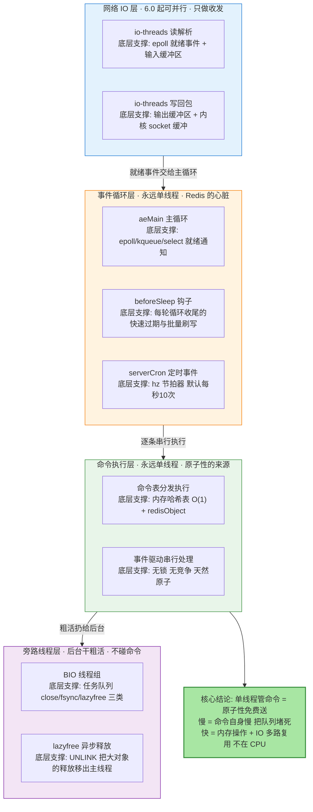
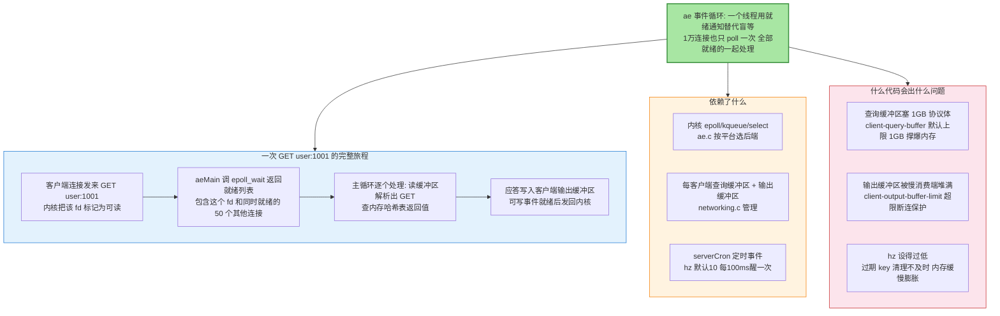
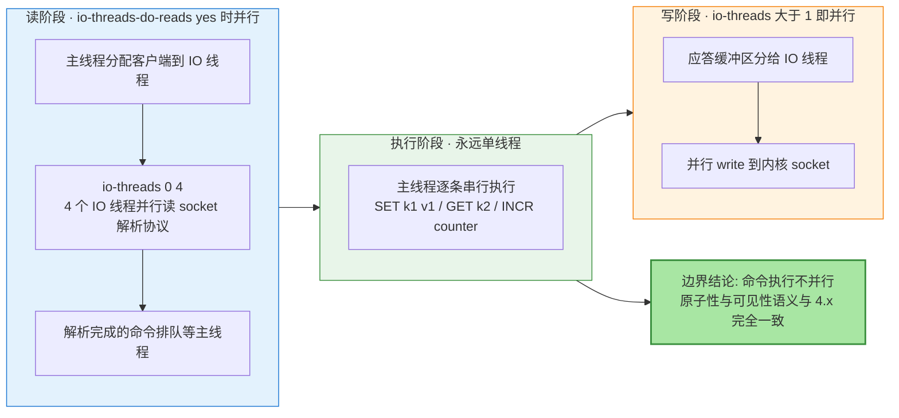
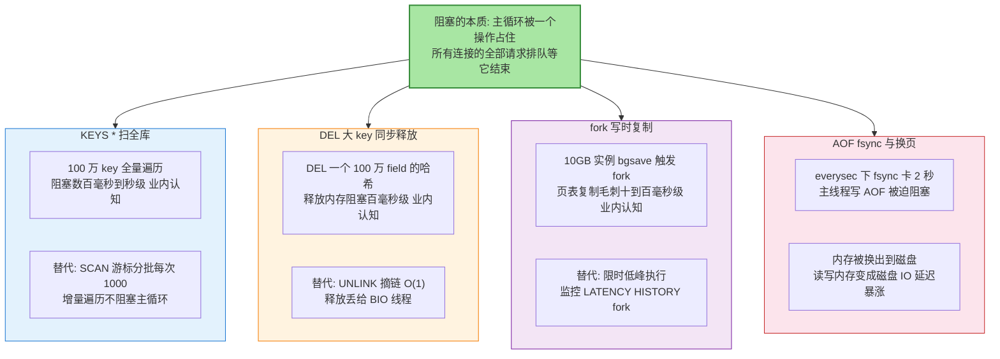
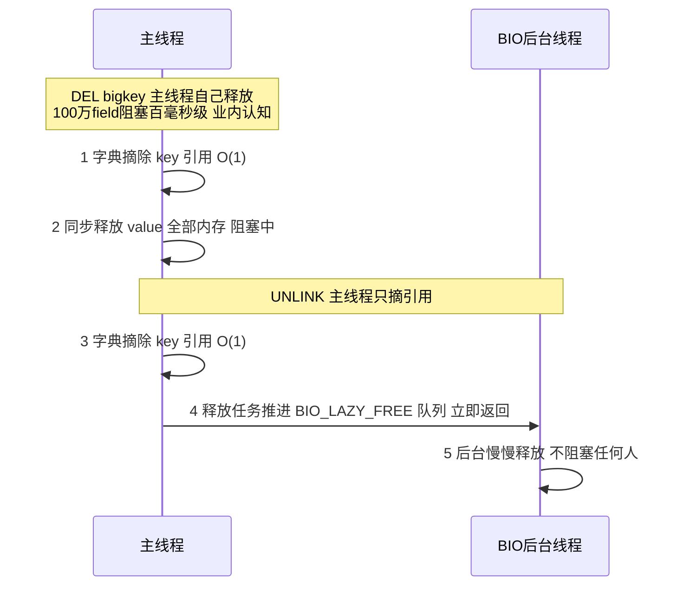
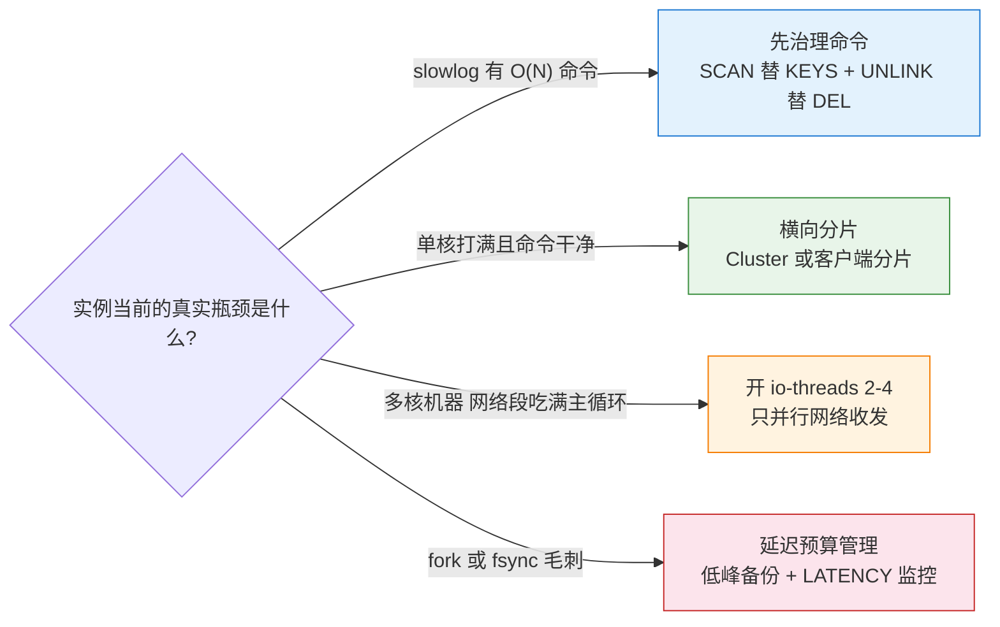

# 深入理解 Redis 单线程模型与 IO 多路复用：快的原因与慢的边界

> 先看图，再看字——这张图就是全文：Redis 靠什么活成一个「单线程却扛住十万 QPS」的系统、网络读写和命令执行各自由谁完成、哪些一行代码就能把整个实例卡住。

## 一图看懂：Redis 线程模型全景



**读图三步**：四色分区即线程边界——蓝（网络收发）是 6.0 之后唯一被允许并行的部分，橙（事件循环）与绿（命令执行）永远单线程且是「Redis 命令天然原子」的全部来源，紫（后台线程）只干关闭文件、fsync、大对象释放这类粗活。**判断一条命令会不会拖垮 Redis，只看一件事：它让主循环停了多久。**

## 🎯 本文核心

Redis 的「快」不是多线程堆出来的，而是**三层分工 + 事件驱动**换来的：网络层用 IO 多路复用（epoll）让一个线程监听成百上千连接的就绪事件；执行层命令全部在单线程里串行跑，换来免锁、免上下文切换、天然原子；粗活（关文件、fsync、大对象释放）交给 BIO 后台线程。**单线程管命令意味着：Redis 的吞吐上限 = 单条命令的执行耗时上限——任何一个 O(N) 命令跑 200ms，后面排队的所有请求全部延迟 200ms，这就是单线程模型的全部代价。**

机制链一句话：**epoll 就绪通知 → aeMain 主循环取事件 → 单线程逐条执行命令 → 结果写回输出缓冲区 → 粗活丢给 BIO**。

边界一句话：**6.0 的 io-threads 只并行「读请求解析」和「写回包」这两个网络环节，命令执行仍然单线程——原子性语义在任何版本、任何配置下不变。**

## 一句话摘要

单线程够快靠三件事：数据在内存（操作耗时纳秒到微秒级，瓶颈根本不在 CPU）、epoll 事件驱动（一个线程管全部连接，无 per-connection 线程开销）、串行执行免锁（原子性免费）。多线程 IO 只并行网络收发不并行命令执行。会卡死 Redis 的从来不是「线程不够」，而是 KEYS 扫全库、DEL 大 key 同步释放、fork 写时复制、内存换页这些**让主循环长时间停摆的操作**。

## 5W 速记卡

| 维度 | 一句话 |
|---|---|
| What | 一个主线程跑事件循环：网络就绪事件 + 定时任务 + 命令执行全在一条线程上 |
| Why | 瓶颈在内存与网络而非 CPU；串行执行免锁免切换，原子性免费 |
| When | 客户端连接就绪（可读/可写）时由 epoll 逐个唤醒主循环处理 |
| Where | ae.c 事件循环 + networking.c 请求解析 + db.c 命令执行 + bio.c 后台线程 |
| How | 防慢命令：禁 KEYS 用 SCAN、DEL 大 key 换 UNLINK、监控 slowlog 与 latency |

## 一、为什么单线程够快：先算数量级账

单线程够不够快，取决于瓶颈在哪。业内认知量级：一次内存随机访问约 100 纳秒，一次同机房网络往返约 0.2-0.5 毫秒，一次磁盘随机访问约 10 毫秒。Redis 的数据全部在内存里，**一条简单命令的执行时间在微秒量级，而它的服务对象（网络请求）本身就要花几百微秒**——执行环节快到可以忽略，瓶颈自然落在「怎么高效等网络」上，这正是 IO 多路复用解决的问题，而不是多线程解决的问题。

反过来看多线程的账：如果每条命令都要加锁保护内存数据结构，锁竞争的开销会反超命令本身；如果每个连接一个线程，1 万个连接就是 1 万个线程的内存与调度成本（业内认知：一个线程栈默认 1-8MB）。**数据在内存 + 命令微秒级执行，这两个前提决定了单线程串行是性价比最高的架构。**

**设计思想**：这是「按瓶颈做架构」而不是「按流行做架构」的典范——瓶颈在网络等待，就用事件驱动；瓶颈不在 CPU，就不为并行付出锁与切换的代价。当 Redis 6.0 发现瓶颈真的转移到网络读写（高并发下协议解析占用了大量主循环时间）时，它也只在网络环节开多线程，执行层纹丝不动。**架构跟着瓶颈迁移，而不是跟着版本号迁移。**

## 二、IO 多路复用：epoll 在 Redis 里的角色

### 2.1 组件四要素图：ae 事件循环



### 2.2 关键路径：一次事件循环

```text
aeMain(server.el)
  └─> aeProcessEvents
        ├─ epoll_wait 拿就绪 fd 列表            (事件层: 谁能读谁能写)
        ├─ 逐个 fd: readQueryFromClient          (网络层: 读进查询缓冲区)
        │     └─ processInputBuffer 解析协议      (RESP 协议切分出 argc/argv)
        ├─ processCommand -> 查命令表执行         (执行层: 单线程串行)
        ├─ beforeSleep 钩子                       (快速过期 + 批量写回 + 6.0 借 io-threads 发包)
        └─ serverCron 时间事件                    (hz 节拍: 过期扫描/主从心跳/统计)
```

图上三点：**epoll 的角色**是「把 1 万次盲等压缩成 1 次系统调用」——主循环每次醒来手里拿到的是一批就绪连接，而不是逐个连接去问；**执行环节**永远是逐条串行，就绪的一批连接也是排队进命令表；**beforeSleep 与 serverCron** 是主循环的两个「顺路干活点」，过期 key 的 FAST 模式清理、异步刷盘都挂在这里。

**追问一：epoll 就比 select/poll 快吗？为什么？**本质区别在「就绪集合的传递方式」：select/poll 每次调用都要把全部连接从用户态拷进内核再逐个检查，1 万连接就是 1 万次遍历；epoll 用内核里的红黑树登记关注列表，就绪的连接由内核回调挂进就绪链表，epoll_wait 只返回就绪的那几十个——连接数越大差距越大。Redis 的 ae 封装了 eventport/epoll/kqueue/select 四个后端（公开口径），Linux 上默认走 epoll。

**再追问：为什么 Redis 不用边缘触发（ET）？**Redis 的 epoll 后端采用水平触发（公开口径）：只要缓冲区还有数据，fd 会反复就绪。对 Redis 这种「一次尽量读完、读不完下次再来」的模型，LT 语义更安全——不会因为一次没读完就永远收不到通知。事件驱动的正确性依赖「不丢事件」，LT 把「丢事件」这个风险从框架上消灭了。

## 三、6.0 多线程 IO：只并行网络读写的边界



边界讲透三点：**其一，并行的是「协议解析」和「回包发送」，不是「命令执行」**——4 个 IO 线程同时读 4 个客户端的请求、同时写 4 份应答，但 `SET` 与 `GET` 依然在主线程排一条队。**其二，为什么这样切**：这里的**设计哲学**是「只并行无共享状态的环节」——网络读写占比高且不同连接之间没有共享状态，最容易并行；命令执行共享全部内存数据结构，并行就要加锁，加锁就丢了原子性这个核心卖点。**其三，默认关着**：`io-threads` 默认 1（等于关闭），`io-threads-do-reads` 默认 no（写并行、读默认仍主线程做，官方口径读解析的并行收益通常不明显）。开启建议在 2-4 核以上、网络吞吐先成为瓶颈的实例，业内常见配置 `io-threads 4` 配 4 核以上机器。

一条命令验证边界：`CONFIG GET io-threads` 看当前值；开 4 线程后跑 `SET` 压测，观察 `INFO stats` 的 `instantaneous_ops_per_sec` 提升幅度的同时用 `MULTI/EXEC` 事务验证——事务里的命令依然原子执行，证明执行层没有被并行化。

## 四、什么会阻塞整个 Redis：主循环停摆清单



### 4.1 UNLINK 与 DEL 的分界：主线程只干 O(1) 的活



一图四要素：**本质**——大对象释放的耗时从主线程挪到后台线程；**实现**——`unlinkCommand` 摘引用后调 `lazyfreeGetFreeObjectsCount` 一族逻辑入队，BIO 线程组的三类任务（关闭文件/AOF fsync/惰性释放）各有一条线程（公开口径，Redis 内部按 BIO 类型分线程）；**依赖**——`lazyfree-lazy-expire/lazyfree-lazy-eviction/lazyfree-lazy-server-del` 一组开关决定过期、淘汰、隐式删除是否也走异步；**问题形态**——`UNLINK` 只对「释放确实很贵」的对象划算（`strlen` 判断阈值，公开口径 64 字节以内的小对象同步释放反而更快），小 key 直接 `DEL` 即可。

### 4.2 阻塞排查命令箱

```bash
# 慢命令日志: 默认记录超过 10000 微秒(10ms)的命令
redis-cli SLOWLOG GET 10
# 大 key 扫描(抽样 非全量 对线上友好)
redis-cli --bigkeys
# 延迟诊断: fork 耗时/ fsync 耗时分开看
redis-cli LATENCY DOCTOR
redis-cli LATENCY HISTORY fork
# 确认 io-threads 是否开启
redis-cli CONFIG GET io-threads
```

## 五、源码/关键路径

- **事件循环**：`ae.c` 的 `aeMain` / `aeProcessEvents` 是全部行为的起点；后端封装在 `ae_epoll.c` / `ae_kqueue.c` / `ae_select.c`，启动时按平台选择。
- **命令执行入口**：`server.c` 的 `processCommand`，按命令名查 `redisCommandTable` 分发到各实现函数（如 `t_string.c` 的 `getCommand`）。
- **网络读写**：`networking.c` 的 `readQueryFromClient`（读）与 `writeToClient`（写），6.0 的多线程逻辑在 `networking.c` 的 `handleClientsWithPendingWritesUsingThreads` / `readClientsFromPendingReadsUsingThreads`。
- **后台线程**：`bio.c`，三类任务 `BIO_CLOSE_FILE` / `BIO_AOF_FSYNC` / `BIO_LAZY_FREE`，任务由 `lazyfree.c` 的 `lazyfreeLazyUnlink` 一族生成。
- **定时任务**：`server.c` 的 `serverCron`（hz 节拍），`beforeSleep` 在 `ae.c` 主循环每轮收尾执行。
- **AOF 阻塞判定**：`aof.c` 中 `aofWrite` 前检查上次 fsync 是否完成、延迟是否超过 2 秒（公开口径），超时则不再 postpone、主线程直接扛阻塞写入。

## 六、追问链：质疑者三连

**追问一：既然瓶颈是内存操作，为什么大 key 会慢？内存操作不是很快吗？**快的是「一次内存访问」，慢的是「次数」——100 万 field 的哈希释放要做 100 万次 free 与析构，微秒级单次乘以百万次就是百毫秒级（业内认知）。Redis 快的前提是「单次操作复杂度低」，`O(N)` 的 N 上到十万百万，单线程就把它变成全实例的等待时间。

**再追问：SCAN 就完全安全吗？它不也要遍历全库吗？**SCAN 把一次大遍历拆成多次小遍历：每次调用只处理 `COUNT` 参数个数的桶（默认 10），游标记在客户端手里，主循环每次只停几微秒。代价有两点：遍历期间数据变动可能漏报或重报（允许重复、业务端去重），以及全程多趟往返总耗时比 KEYS 更长——**它不是更快，是「分批把阻塞切成不阻塞」**。

**打破砂锅：既然执行层永远单线程，那 6.0 的多线程是不是白开了？**不是白开，是「收益有上限」。官方口径：在多核大实例、高连接数场景下，协议解析与回包发送能占到主循环时间的一半以上，把这两段并行化后吞吐可提升约一倍量级（公开口径，视负载而定）。但执行层仍串行意味着：如果慢在命令本身，多线程救不了——这恰好逼出正确的优化方向：**先消慢命令，再谈线程数**。

## 七、反方案分析：两条「看起来更现代」的路为什么不走

**为什么不选「多线程执行命令」？**命令并行意味着所有内存数据结构都要上锁：全局一把锁则并行度归零等于白并行，细粒度锁则复杂度暴涨——Memcached 的「多线程 + 分桶锁」换来了吞吐，也放弃了跨 key 原子性，事务与 Lua 这类能力要么没有要么受限。Redis 用单线程把「免锁 + 原子 + 实现简单」打包成核心卖点，执行层并行等于亲手拆掉自己的差异化。

**为什么不选「每个连接一个线程」？**万级连接就是万级线程的内存与上下文切换开销（业内认知：单线程栈 1-8MB、切换微秒级但量大了显著），而连接之间大部分时间在等数据——等数据的正确姿势是事件驱动「谁就绪处理谁」，而不是开一堆线程干等。per-connection 线程模型在连接数上万时，内存和调度开销会先于 CPU 把系统压垮。

## 八、事故复盘（匿名化叙事）

**复盘一：一次 KEYS 引发的全站缓存抖动。**现象：某电商系统大促前巡检时，接口耗时间歇性上涨，Redis 实例 QPS 不高但延迟飙到秒级。**排查**：`SLOWLOG GET` 发现每次秒级慢查询都对应一条 `KEYS order:*`，来自一个定时任务的「实时统计订单数」逻辑——200 万 key 的全量扫描把主循环占死，期间所有请求排队。**复盘**：改为 `SCAN` 游标分批 + 计数器异步聚合，延迟回落到亚毫秒。教训一句话：**单线程系统里，任何人的 O(N) 都是所有人的 O(N)——命令准入必须有白名单。**

**复盘二：RDB 定时备份带来的周期性毛刺。**现象：某账户类服务每天凌晨固定出现一波 50-100ms 的 Redis 延迟尖峰，业务无发布、无流量高峰。**排查**：`LATENCY HISTORY fork` 显示尖峰时间点与自动 bgsave 完全吻合；实例内存 10GB，fork 的页表复制在宿主机 CPU 争抢时毛刺放大。**复盘**：把备份窗口固定到低峰、限制备份机器的资源争抢、开启 `LATENCY MONITOR` 长期跟踪 fork 耗时。教训一句话：**fork 毛刺与实例内存大小成正比（业内认知），内存规划时要给「备份时刻」单独留延迟预算。**

## 九、不同量级的思考：约束来源决定解法

- **十万级 QPS（单实例常用区间）**：约束来源是主循环单线程——这个量级下单线程的串行能力还有富余（业内认知：简单 GET/SET 单实例可达 8-10 万 QPS 量级）；这一档的核心问题是「别让慢命令上桌」，而不是「要不要开 io-threads」；思考方式是**准入驱动**——命令白名单 + slowlog 告警 + bigkey 治理就构成完整防线。
- **百万级 QPS（读多写多逼近单实例极限）**：约束来源是单线程执行上限真实触顶——继续调参收益趋零；这一档的核心问题是「流量怎么分到多个单线程实例」，而不是「单实例还能榨多少」；思考方式是**分片驱动**——客户端分片、代理分片或 Cluster 把流量切成 N 份单线程实例，每片内部继续执行准入纪律。
- **千万级 QPS（海量连接高并发）**：约束来源是网络协议解析在主循环里的时间占比——连接数上量后 read/write 环节吃掉主循环大半时间；这一档的核心问题是「网络收发要不要并行」，而不是「命令要不要并行」；思考方式是**分层驱动**——6.0 `io-threads` 并行网络段（执行仍串行），配合热点本地缓存把读流量在进程内消化掉一截。

- **亿级 QPS（超大规模集群化）**：约束来源从技术层迁移到组织层——几万个实例的参数一致性、命令白名单的跨团队执行、容量规划的数据化程度，成为延迟稳定性的主导变量；这一档的核心问题是「规范能不能规模化执行」，而不是「还有没有参数可调」；思考方式是**治理驱动**——配置模板化下发、命令审计自动化、延迟预算按业务线分账，把十万级的个人纪律变成组织级的机器纪律。

思考方式总结：十万级靠「准入」，百万级靠「分片」，千万级靠「网络分层」，亿级靠「治理」——约束从命令耗时迁移到实例上限、再迁移到网络占比、最终迁移到组织规模，解法必须跟着约束来源走。

**自下而上与触发升级**：先看三个实测值再定档——`slowlog` 里有没有 O(N) 命令（十万级就该归零）、单实例 ops 与 CPU 是否触顶（触顶就是百万级的信号）、`LATENCY` 里网络段耗时占比（占比过半就是千万级的信号）。触发升级的条件是约束真实迁移：慢命令清完了还顶不住才升分片，分片做完网络段还卡才开 io-threads——跳档预支复杂度（无慢命令就开多线程）与滞档侥幸（触顶了还硬扛）都是同一个错误：让思考方式落后或超前于约束来源。

## 十、业内惯例与生产实践

- **命令准入**：生产环境用 `rename-command` 改名禁用 `KEYS`/`FLUSHALL` 等高危命令（公开口径的通行做法），业务侧一律 `SCAN` + `UNLINK`。
- **慢日志与延迟监控双开**：`slowlog-log-slower-than` 默认 10ms，业内常收紧到 1ms 量级早发现；`LATENCY MONITOR` 跟踪 fork/fsync 这类不在 slowlog 里的系统级毛刺。
- **大 key 治理常态化**：定期 `--bigkeys` 抽扫，value 拆分或改用异步删除开关（`lazyfree-lazy-expire yes` 等）。
- **io-threads 谨慎开**：仅在多核、网络吞吐先触顶的实例上开 2-4 线程（公开口径官方建议 4 核以上再考虑），并压测验证收益，不为「跟上版本」而开。
- **反模式**：用 Redis 跑重计算（大集合求交并）、单 key 塞千万级成员、监控只看 QPS 不看 slowlog 与延迟分位——单线程系统的延迟分位比均值诚实得多。

## 💡 实战提示

- 💡 单线程系统的第一军规：**所有进生产的命令先问复杂度**——O(N) 的 N 是多少，N 会不会随业务增长，答不清就进不了白名单
- 💡 大 key 删除默认换 `UNLINK`，并开 `lazyfree-lazy-expire yes`——过期与淘汰产生的删除同样会阻塞主循环，别只盯着业务代码里的 DEL
- 💡 延迟监控看分位不看均值：P99 尖峰往往来自 fork、fsync、慢命令三类「别人的操作」，`LATENCY DOCTOR` 一条命令就能分诊
- 💡 `io-threads` 不是免费午餐：先确认 slowlog 干净、瓶颈真在网络段，再小步开启并压测对比，否则只是多了线程开销
- 💡 排查延迟先分「命令慢」还是「系统慢」：`SLOWLOG` 里有记录是命令慢（查业务），没有记录但延迟高是系统慢（查 fork/fsync/换页/CPU 争抢）

## 开放问题

- io-threads 读路径（`io-threads-do-reads yes`）的收益边界，官方与社区数据口径不一，需要结合具体负载压测定论
- 未来版本是否会在保持原子性语义的前提下引入更细的执行并行（如无冲突命令并行），目前无公开结论

## 你们可能会问

**Q1：Redis 6.0 之后还能说它是单线程吗？**
准确说法是「命令执行单线程」。网络收发可以有多个 IO 线程，后台还有 BIO 线程组干关闭文件、fsync、惰性释放的粗活——但**客户端视角的原子性语义从未变过**：任何命令、事务、Lua 的执行仍然在主线程串行完成。谈论「Redis 是不是单线程」时先定义问的是执行层还是全进程，就不会吵架。

**Q2：epoll 就绪了，命令也执行完了，应答什么时候发出去？**
应答先进每个客户端的输出缓冲区，主循环在每轮 `beforeSleep` 收尾时批量写回（6.0 起可借 io-threads 并行写）。如果某个客户端消费慢导致输出缓冲区超过 `client-output-buffer-limit`，连接会被强制断开——这是主循环保护机制，防止一个慢客户端的缓冲区吃光内存。

**Q3：MULTI/EXEC 和 Lua 是怎么保证原子的？是不是有锁？**
没有锁。两者只是把一组命令打包进一个队列，在主循环里一次性串行执行完——单线程执行天然没有并发插入，所以「原子」是架构免费送的，不需要任何同步机制。这套**设计思想**的精髓在于把并发问题从运行时挪到架构层：不是「用锁解决并发」，而是「让并发根本不发生」。这也是为什么执行层永远不能并行化：一旦并行，这层免费原子就要用锁重新买回来。

**Q4：10 万 QPS 是单实例的极限吗？什么时候该分片？**
业内认知量级：简单命令在良好网络下单实例可到 8-10 万 QPS。判断依据不是数字而是信号——CPU 单核打满且 slowlog 干净、带宽接近网卡上限，就说明单线程执行或网络段触顶，该横向分片了；如果只是 slowlog 里一堆 O(N) 命令，先把命令治理做掉，分片解决不了慢命令。

## 什么时候用 / 不用

先看决策图：



- ✅ **用 SCAN 替 KEYS**：任何线上遍历场景，游标分批把阻塞切成微秒级
- ✅ **用 UNLINK 替 DEL**：确认 value 可能很大（集合类成千上万成员）的删除路径
- ✅ **开 io-threads**：多核机器 + 高连接数 + 网络段确认触顶的大实例
- ✅ **开 lazyfree 系列开关**：过期 key 多、淘汰频繁的缓存型实例
- ❌ 不用 KEYS/SMEMBERS/SHOW 类全量命令在无白名单的线上跑——单线程下一条命令绑架全实例
- ❌ 不把重计算（大集合交并、聚合统计）压进 Redis——它是内存存取引擎不是计算引擎
- ❌ 不为吞吐焦虑直接开满 io-threads——命令执行仍串行，收益上限在网络段，先测再开
- ❌ 不用「加机器」回应慢命令——慢命令在哪个实例都会慢，分片只是把它分摊到更多受害者头上

## Trade-off：单线程换来了什么、付出了什么

单线程是一笔明确的交易：**得到**的是免锁实现、原子语义、免上下文切换与极简的心智模型；**付出**的是「一条命令的慢 = 全部请求的慢」——延迟的长尾由最慢的那条命令决定，吞吐上限被单核封顶。6.0 的 io-threads 是对这笔交易的一次精细修补：把「付出」里可以并行化的网络段拿走，把「得到」里的原子语义原封不动留下。工程上的正确姿势不是评判单线程好坏，而是守住它的前提——**命令快、内存足、网络顺**，任何一个前提破掉，单线程的代价立刻从理论变成 P99 曲线上的尖峰。

## 🎯 核心带走

- **一图一句**：网络可并行（io-threads）、执行永远单线程（原子性来源）、粗活进后台（BIO）——三层分工是理解一切 Redis 线程现象的坐标系
- **快的三根支柱**：内存操作微秒级、epoll 一次等一批、串行执行免锁免切换——瓶颈从来不在 CPU
- **慢的一条定律**：主循环停摆多久，全实例就慢多久——KEYS 扫库、DEL 大 key、fork 页表、AOF fsync 卡顿是四大惯犯
- **6.0 的边界**：io-threads 只并行协议解析与回包发送，命令执行串行不变，事务与 Lua 原子性跨版本一致
- **治理三件套**：slowlog 收紧到 1ms 量级、LATENCY 盯 fork/fsync、bigkeys 定期扫——单线程系统的延迟分位比均值诚实
- **量级主线**：准入驱动 → 分片驱动 → 网络分层驱动 → 治理驱动，约束迁移才升级，升级顺序不能颠倒
- **跨周期视角**：过去 5 年这套模型的演变轨迹清晰可见——从「单线程扛一切」到「网络段借多线程、执行层焊死单线程」，未来若出现执行并行的版本演进，也只会发生在无冲突命令上，原子语义这条底线不会松

## 📌 数据与事实声明

- 写于 2026-09-24（特性层新增，Redis 线程模型系列第 1 篇）；机制描述以 Redis 官方文档与 GitHub 源码（ae.c / networking.c / bio.c / lazyfree.c，6.x 分支）公开内容为基准
- 「单次内存访问约 100ns、网络往返 0.2-0.5ms、单实例 8-10 万 QPS、100 万 field 大 key 释放百毫秒级」等为业内认知与公开口径的量级判断，非实测数据，决策需按实际负载压测校准
- io-threads 收益幅度、LT/ET 触发模式选择等细节随版本演进，以所用版本的官方文档为准
- 事故复盘为公开技术社区高频案例模式的匿名化复述，不含任何真实系统、公司与内部代号

## 📚 参考资料

| 类型 | 标题 | 来源 |
|---|---|---|
| 官方文档 | Redis latency problems framework / Lazy Redis: async unlink | redis.io/docs |
| 源码 | ae.c（事件循环）/ networking.c（IO 线程）/ bio.c（后台线程） | github.com/redis/redis |
| 官方博客 | Redis 6.0 多线程 IO 说明 | redis.io/blog |
| 系列内 | 本系列第 2 篇：过期删除与内存淘汰 | `docs/middleware/redis/特性层/深入理解底层编码系列/4_过期删除与内存淘汰策略源码-特性.md` |
| 关联阅读 | 深入理解持久化系列（fork 与写时复制细节） | `docs/middleware/redis/特性层/深入理解持久化系列/1_RDB与写时复制-深度.md` |
