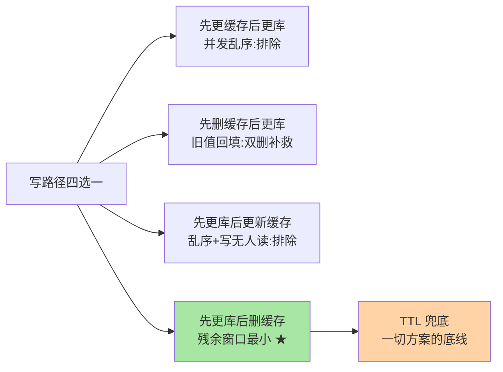

# 缓存一致性方案全景：旁路、双删与取舍

> 缓存与数据库是两个独立组件，**强一致在架构上就不可得**——所有方案都在回答同一个问题：在「不一致窗口」可接受的约束下，选哪种更新顺序、付哪种代价。这篇把旁路缓存、四种更新时序、延迟双删一次讲全，并给出选型决策。

## 一句话摘要

主流方案是 **Cache-Aside（旁路缓存）**：读「缓存未命中→查库→回填」，写「**先更新库、再删缓存**」。其余时序（先删缓存后更新库、先更新缓存后更新库）都有明确的并发缺陷；**延迟双删**是「先删后更」的补救而非首选。**选型的真问题是业务对不一致窗口的容忍度**：窗口可接受（多数读多写少场景）→ Cache-Aside + 过期时间兜底；要求接近实时一致 → 订阅 binlog 异步删缓存（本系列篇 2），本质上都是**最终一致**。

## 🎯 本文核心

**核心一句话：四种更新时序并发推演后只有「先更库后删缓存」（Cache-Aside）胜出——删除优于更新（丢数据安全/懒加载省）、残余窗口最小可被 TTL 兜底；TTL 是一切方案的底线，其上限 = 业务可容忍的最大不一致时长——「怎么做到一致」是错的问题，「能容忍不一致多久」才是对的问题。**

机制链：四时序并发推演 → ④的两个机制理由 → 延迟双删的补救定位 → TTL 底线量化 → 按容忍度选型。全文一句话可重构：「删除代替更新，TTL 兜住一切，容忍度决定方案」。

## 前置阅读

- 入门层篇 19《缓存一致性》：方案的现象级认知
- 入门层篇 18《缓存三大问题》：穿透/击穿/雪崩——本篇的姊妹问题域

## 目标导向

本文是什么：缓存更新时序的并发分析与方案选型。功能是什么：把「为什么业界都选先更库后删缓存」讲成并发时序推演。能得到什么：四种时序的问题清单、延迟双删的适用边界、按业务容忍度选型的决策框架。为什么用：缓存方案评审、不一致 bug 归因、架构选型答辩，必看。

## 一、边界：入门层讲过什么，本文讲什么

| 内容 | 入门层 | 本文 |
|---|---|---|
| 双写不一致的现象与方案名字 | ✅ 讲过 | 不重复 |
| 四种更新时序的并发推演 | 概念级 | **本文核心一** |
| 延迟双删的机制与代价 | 提了一句 | **本文核心二** |
| binlog 异步方案 | 未讲 | 本系列篇 2 |

## 二、四种更新时序：并发推演定优劣

写操作涉及「更新库」与「操作缓存（更新或删除）」两个动作，四种顺序的并发推演：

```text
① 先更新缓存，再更新库
   并发写 A/B 交错：缓存最终可能是旧值（B 库覆盖 A 库，缓存却保留 A 值）
   → 缓存与库永久不一致，最差方案，直接排除

② 先删缓存，再更新库
   删后、库更新前，读请求穿过：读到旧库值并回填旧缓存
   → 旧缓存复活直至过期，不一致窗口 = 到过期时间

③ 先更新库，再更新缓存
   并发写 A/B 交错：库最终 B，缓存可能停在 A（写缓存晚于写库完成）
   → 与①同类的乱序问题；且「更新缓存」可能写入根本没人读的值

④ 先更新库，再删除缓存（Cache-Aside 写路径）★
   残余风险仅一种长尾：删除时读请求正持旧值回填（回填晚于删除完成）
   概率极低（要求「读比写还慢」），且有 TTL 兜底
```

**④ 胜出的两个机制理由**：**删除比更新安全**（删除只丢数据下次再加载，更新则可能把错值写活）+ **删除与懒加载配合天然省**（不写没人读的缓存）。加上读写比例的现实（读多写少），Cache-Aside 成为事实标准——不是它完美，是它的残余风险窗口最小且可被 TTL 兜底。

## 三、延迟双删：补救「先删后更」的药

业务确实需要「先删后更」（如写前必须清缓存的场景）时，**延迟双删**缩小②的窗口：


三个工程要点：**延迟取「一次读请求的业务耗时」量级**（拍脑袋的 100ms 不如实测的读耗时）；**第二次删除异步执行**（消息/线程池，别拖主链路）；**双删仍是概率性补救**——极端并发下旧值仍可能在二删后回填，**TTL 兜底不可省**。定位要摆正：它是「选错时序后的止血带」，不是比 Cache-Aside 更优的方案。

## 四、TTL：所有方案的底线兜底

先收拢选择视野：



一致性方案再精细，**过期时间是最终的兜底防线**——任何残存的不一致最迟在 TTL 处终结。工程含义：**TTL 的上限 = 业务可容忍的最大不一致时长**。这个量化视角是缓存一致性方案演进的分水岭——从此方案选择变成参数选择。选型时的正确问法不是「怎么做到一致」，而是「业务能容忍不一致多久」：分钟级可忍 → Cache-Aside + 长 TTL，简单省事；秒级要求 → 缩 TTL + binlog 异步删（篇 2）；要求读己之写强一致 → 该数据根本不该放缓存（或读主库旁路）。

## 五、源码与实现关键路径

- 回填与删缓存的原子性陷阱：Cache-Aside 的「查库 + 回填」在应用代码里两步执行——无分布式锁时天然允许并发回填，机制上无解，靠④的低概率与 TTL 掩盖（这是「缓存系统天生最终一致」的代码层证据）
- 延迟实现：延迟消息（MQ 定时消息，tips 互指 RocketMQ 特性层）优于线程池 sleep——解耦且可观测
- 观测：删除缓存的成功率、回填命中率、缓存与库的抽样比对（对账式监控）是方案健康度的三个探针

## 典型场景

- **商品详情**（读多写少）：Cache-Aside + TTL 数分钟——不一致窗口可忍，方案最简
- **库存/价格**（强一致诉求）：热点数据走「读库旁路」或不缓存；缓存只做「短 TTL 加速 + 击穿保护」，删缓策略配 binlog 异步
- **用户资料**（写后读自己敏感）：更新后**主动删缓存 + 该用户读走主库一次**（读己之写语义），其余读走缓存

## 业内惯例

> 💡 **实战提示**
> - 什么时候升级到 binlog 异步删（篇 2）：写链路删除失败率不可控、或一致性收口要从业务代码里剥离成基础设施时——先量化当前窗口再决定
> - 不一致窗口的三段量化法：读链路耗时（残余窗口）+ 删除链路可靠性（重试时长）+ TTL（终极上限）——三段取上界，向业务交底有数字
> - 删缓存与击穿防护联合设计：删缓存引发回填风暴的场景配「互斥回填/逻辑过期」（缓存三兄弟的方案）——一致性方案与失效防护是一张设计图
> - 一致率对账进监控：抽样比对缓存与库的一致率曲线，突降先查删除链路——对账是不一致窗口的真实观测

- **先更库后删缓存 + TTL 是默认起点**：没有强一致诉求就别上复杂方案——简单方案的运维成本最低，这也是十余年缓存实践演进收敛的结果，是业内最被反复验证的默认
- **删缓存失败必须重试**：删除丢了的缓存要靠 binlog 兜底或队列重试（篇 2 的方案之一），「删失败就算了」是事故预备役
- **热点 key 的回填风暴**：删除缓存后的回填是击穿场景（tips 互指专题层「缓存三兄弟」）——删缓存策略与击穿防护要联合设计
- **对账式监控兜底**：抽样比对缓存与库的一致率，一致率突降先查「删除链路」而不是缓存本身

## 六、常见误区

- **「选对了时序就一致了」**：④仍有长尾窗口，TTL 是组成部分而不是可选项——**缓存与库之间不存在零窗口方案**（除非放弃缓存）
- **「延迟双删的延迟拍脑袋定」**：延迟的依据是「读请求穿过旧库并回填」的耗时分布，实测定值；固定 100ms 在慢查询场景形同虚设
- **「更新缓存比删除缓存性能好」**：更新省一次 miss，但可能写「无人读」的值 + 引入并发乱序风险——写放大与一致性风险换命中率，多数场景不划算
- **「把 Redis 主从延迟算进一致性窗口」**：删缓存在主库执行、从库复制有时延，读从库缓存的请求窗口更长——讨论一致性时先把「哪套副本」说清楚

## 七、与相邻机制的关系

- 本系列篇 2《订阅 binlog 最终一致落地》：删缓存链路的可靠化改造
- 入门层篇 18：击穿——删缓存引发的回填风暴的防护
- tips 互指：延迟消息（RocketMQ 特性层）、binlog 订阅（CDC 生态）是本方案的两大外挂依赖

## 你们可能会问

**Q1：为什么不能给「查库+回填」加分布式锁做到强一致？**
能做但代价是回填串行化——缓存的高并发价值被锁吃掉大半。加锁回填只在击穿防护的「单飞回填」语境成立（专题层），作为通用一致性手段不经济。

**Q2：写少读极多的数据要不要直接更新缓存？**
「写极少」时④的删除后一次回填成本可忽略，仍推荐删除——统一的写路径少一种方案的心智负担；确有热值（如配置类）可例外。

**Q3：怎么量化我的不一致窗口？**
读链路耗时（决定④残余窗口）+ 删除链路可靠性（决定重试时长）+ TTL 上限——三者取上界即业务感知的最大不一致时长，用它反推 TTL 与方案。

## 八、自测三问

1. 四种更新时序各自的并发缺陷是什么？④胜出的两个机制理由？
2. 延迟双删删的是什么？为什么说它是止血带不是优选方案？
3. TTL 在一致性体系里扮演什么角色？选型的正确问法是什么？

## 开放问题

- 缓存与数据库的一体化（数据库内置缓存层/HTAP 架构）正在把「两组件一致性」变成「单系统内部问题」，Cache-Aside 的应用层心智可能被平台吸收。
- 客户端缓存与多级缓存普及后，「哪一层先失效」的级联一致性问题（浏览器→CDN→应用缓存→Redis）尚无统一治理模型。

## 🎯 核心带走

- **核心一句话**：四时序推演后 Cache-Aside 胜出——删除优于更新、窗口最小、TTL 兜底；延迟双删是止血带不是优选；容忍度（TTL 上限）决定方案
- **机制链**：四时序推演 → ④的两个理由 → 双删定位 → TTL 底线量化 → 选型框架
- **哪里会坏**：时序选错（①③乱序脏）、双删延迟拍脑袋、删失败无重试、把主从延迟漏算进窗口
- **边界**：本篇管「更新时序与取舍」；binlog 订阅的可靠化落地在篇 2，失效类故障（穿透/击穿/雪崩）在入门层篇 18

## 📌 数据与事实声明

- 写于 2026-09-08，方案对比为业界公开共识的归纳；四种时序的并发推演可用双线程压测复现
- 「延迟取实测读耗时」为工程建议口径，非官方文档内容
- 免责：具体参数与行为以 redis.io 与所涉组件官方文档为准

## 📚 参考资料

| 类型 | 标题 | 来源 |
|---|---|---|
| 实战书 | 《Redis 核心技术与实战》蒋德钧（一致性章） | 公开出版 |
| 实战书 | 《高性能 MySQL（第 4 版）》应用层缓存讨论 | 公开出版 |
| 社区沉淀 | Cache-Aside 与延迟双删的公开技术讨论（多方博客） | 技术社区公开文章 |
