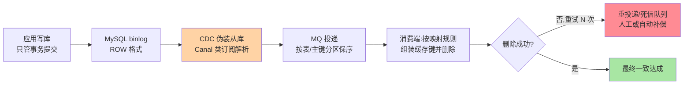

# 订阅 binlog 删缓存：最终一致的工程化落地

> Cache-Aside 的「应用删缓存」有两个软肋：删失败没人管、业务代码到处散落缓存逻辑。订阅 binlog 的方案把删缓存从业务代码里**抽出来搬进变更流**——这篇讲清链路架构、可靠性设计与它换来的代价。

## 一句话摘要

**binlog 异步删缓存**的链路：应用只管写库 → CDC 工具（Canal 类）伪装成从库订阅 binlog → 解析出变更行 → 投递 MQ → 消费端删除对应缓存（失败重试/入死信）。**收益**：业务代码零侵入、删除链路可靠化（MQ 重试兜底）、天然覆盖所有写入入口；**代价**：秒级不一致窗口（复制延迟）、多一套同步基础设施、按表到缓存的映射治理。它不是替代 Cache-Aside，而是把其写路径的「删缓存」环节**工程化加固**。

## 🎯 本文核心

**核心一句话：binlog 方案把「删缓存」从业务代码搬进变更流——CDC 伪装从库订阅 → MQ 保序投递 → 消费删除，靠「至少一次投递 × 幂等删除」的廉价组合达成可靠；覆盖面（所有写入口天然覆盖）与零侵入是收益，秒级窗口与链路运维是代价。**

机制链：端到端五环节（写库→binlog→CDC→MQ→删除）与各自的失败模式 → 表到键的映射治理 → 保序与并发删 → 窗口监控 → 与应用侧删除的取舍表。全文一句话可重构：「业务只管写库，删除变成基础设施——可靠性靠至少一次 + 幂等这对天然盟友」。

## 前置阅读

- 本系列篇 1《缓存一致性方案全景》：时序取舍与 TTL 兜底——本篇方案的坐标系
- MySQL 日志系列篇 2：binlog 的 ROW 格式——本方案的原料

## 目标导向

本文是什么：binlog 驱动删缓存的链路与可靠性设计。功能是什么：给「删缓存不可靠、业务代码侵入」两个痛点一套工程解。能得到什么：端到端链路图、每个环节的失败模式与对策、方案适用边界。为什么用：缓存治理专项、多入口写入的数据一致性、缓存方案升级评审，必看。

## 一、边界：入门层讲过什么，本文讲什么

| 内容 | 入门层 | 本文 |
|---|---|---|
| 方案的名字与基本思想 | 提了一句 | 不重复概念 |
| 端到端链路与失败模式 | 未讲 | **本文核心一** |
| 可靠性设计（重试/幂等/死信） | 未讲 | **本文核心二** |
| 与应用侧删除的取舍 | 未讲 | **本文核心三** |

## 二、端到端链路与失败模式

每一环的失败模式与对策：

| 环节 | 失败模式 | 对策 |
|---|---|---|
| CDC 订阅 | 断连、位点丢失 | 位点持久化 + 自动重连 + 告警 |
| MQ 投递 | 发送失败 | CDC 侧重试；投递至少一次语义 |
| 消费删除 | Redis 瞬断 | 消费重试 + 幂等（删是幂等操作，天然友好） |
| 端到端 | 消费积压 | 积压监控 + 窗口告警；积压即「不一致窗口拉长」 |

**至少一次投递 + 幂等删除**是整条链路的可靠性骨架——删除操作的幂等性（删不存在的键无害）让这套语义格外便宜，是 binlog 方案能工程化的幸运前提。

## 三、三个设计决策点

1. **按表到键的映射治理**：CDC 拿到的是「行变更」，删除需要「缓存键」——映射规则（`表名:主键 → cache:key`）要**配置化集中管理**，散落在消费代码里就是新的「业务侵入」。多级缓存键（列表页 key 与详情 key 不同形）的映射复杂度在这里集中爆发，映射清单是方案的治理核心
2. **保序与并发删**：同一行的多次变更必须按序删除（否则旧删除覆盖新删除的语义错乱）——MQ 按主键哈希分区保证单行有序；跨行无序可接受
3. **窗口监控**：从库提交到缓存删除完成的端到端延迟（CDC 延迟 + MQ 延迟 + 消费延迟之和）是方案的真实「不一致窗口」——分环节埋点，窗口突增即积压/故障告警。**秒级窗口是常态设计目标，丢「至少一次删除」是事故**

## 四、与应用侧删除的取舍

| 维度 | 应用侧删（Cache-Aside 原味） | binlog 异步删 |
|---|---|---|
| 业务侵入 | 每个写入口都要写删逻辑 | 零侵入，写入口自由 |
| 删除可靠性 | 依赖业务代码写对（常被漏） | MQ 重试/死信结构化兜底 |
| 不一致窗口 | 删除即时（毫秒级） | 秒级（链路延迟） |
| 基础设施 | 无额外 | CDC + MQ 两套组件 |
| 覆盖面 | 漏一个入口就漏删 | **所有写入天然覆盖**（含运营后台直改库） |

窗口的构成可视化——端到端延迟是各环节之和：

选型口径：**写入入口多（多服务/多团队/后台直改）→ binlog 方案的覆盖面优势压倒一切**；单入口简单服务 → 应用侧删更轻。两者也可并存：应用侧即时删 + binlog 兜底删，窗口与可靠性双优，代价是链路更重。

## 五、源码与实现关键路径

- Canal 类 CDC 的原理：服务端伪装 MySQL 从库（dump 协议，互指 MySQL 主从复制系列篇 1 的三线程模型）拉取 binlog 流，客户端 SDK 解析为变更事件——**「伪装从库」是理解一切 CDC 工具的钥匙**
- ROW 格式是前提：STATEMENT 格式解析不出行级变更——MySQL 日志系列篇 2 的「ROW 收敛」结论是本方案的生态基础
- 消费幂等：删除天然幂等 + 键级去重可省——但「删除 + 回填」组合动作（如预热）不幂等，需按业务判断
- 死信处置：死信不是终点是工单——「死信队列有东西」必须是告警级事件

## 典型场景

- **多团队写入的核心表**：订单/商品——入口不可枚举，binlog 覆盖面是刚需
- **运营后台直改库**：不经应用层的数据修正——应用侧删除方案对此完全失明，binlog 方案天然覆盖
- **多级缓存失效**：详情缓存 + 列表缓存 + 搜索索引的联合失效——一条变更流驱动多下游失效（ES 索引更新常与缓存删除同链路，互指本仓库 ES 系列）

## 业内惯例

> 💡 **实战提示**
> - 什么时候从应用侧删升级到 binlog 方案：写入入口开始「枚举不全」（多团队/后台直改）、或「删失败率不可控」两个信号任一出现——覆盖面问题是这类方案的唯一硬理由
> - 窗口指标上大盘：CDC 延迟、消费积压、端到端 P99 三段分开埋点——「不一致窗口拉长」的告警要在业务感知之前
> - 死信队列按工单流程治理：死信 = 未完成的删除 = 未收敛的不一致——死信清零率是方案验收的硬指标
> - 映射清单与键规范同库管理：表→键映射、键命名规范、TTL 策略三份清单联动变更——映射漂移的治理依赖单一真相源

- **CDC 延迟与消费积压是一级监控**：窗口指标直接定义方案健康度——比「缓存命中率」更该上大盘
- **映射清单进配置中心**：表→键映射变更走评审发布，与缓存键设计规范联动——映射漂移是「该删没删」的第一病因
- **灰度按表推进**：灰度策略随方案演进而调整，但「非核心表 → 核心表」的顺序是稳定共识，对照期双删（应用删 + binlog 删）并行观测
- **容量预估含变更峰值**：CDC/MQ/消费端的容量按「写峰值 × 变更行数」而非「读峰值」规划——缓存方案的瓶颈常在写链路

## 六、常见误区

- **「上了 binlog 方案就不需要 TTL」**：TTL 是一切最终一致方案的底线兜底（篇 1 结论）——链路再可靠，TTL 不设等于拆掉最后防线
- **「MQ 丢一条删除没关系」**：单条删除丢失 = 该键不一致到 TTL 过期——「至少一次 + 死信告警」是底线语义，不是可选优化
- **「CDC 就是解析个日志，很简单」**：位点管理、DDL 处理、大事务拆分、半同步语义——CDC 是正经分布式组件，自研前先评估成熟工具
- **「秒级窗口对所有业务都可接受」**：库存扣减类场景秒级旧值就是超卖——窗口容忍度按业务数据维度评估，不是全站一刀切

## 七、与相邻机制的关系

- 本系列篇 1：时序取舍与 TTL 底线——本方案是「删缓存环节」的工程化加固
- MySQL 主从复制系列篇 1：CDC 的 dump 协议同源；MySQL 日志系列篇 2：ROW 格式是原料
- tips 互指：ES 索引同步常与本方案共用 CDC 链路（一次订阅多下游）；延迟消息在延迟双删里的角色见 RocketMQ 特性层

## 你们可能会问

**Q1：为什么用 MQ 中转，CDC 直接删缓存不行？**
直删把「CDC 可用性 × Redis 可用性」串进删除链路且无重试语义——MQ 提供缓冲、重试、保序、监控四件套，是链路可靠性的结构化答案。极简场景直删可跑，生产不推荐。

**Q2：删除执行时缓存还没被回填怎么办？**
经典竞态：删发生在「旧值回填」之前 → 旧值复活。这与篇 1 ④的长尾同源——binlog 方案的解法是「删除带版本/延迟」或接受 TTL 兜底；多数场景按后者处理，热点键加防击穿保护。

**Q3：怎么证明方案真的最终一致？**
对账探针：抽样比对的键一致率 + 端到端窗口分布 + 死信清零率三个指标——「最终」的量化就是这三个数，评审时要看曲线不要听口号。

## 八、自测三问

1. 复述端到端链路五个环节，每环的失败模式与对策是什么？
2. 「至少一次 + 幂等删除」为什么是廉价可达的可靠性组合？
3. binlog 方案相对应用侧删除的三优两价是什么？什么场景选它？

## 开放问题

- 数据库内核级缓存失效通知（变更推送替代 binlog 订阅）在云数据库中开始出现，「外挂 CDC」与「内核通知」的边界在重画。
- 多级缓存（本地+Redis+CDN）的联合失效需要统一的变更总线协议，业界尚无跨层标准，开源社区在分散探索。

## 🎯 核心带走

- **核心一句话**：binlog 方案把删缓存工程化为「CDC 订阅 → MQ 保序 → 幂等删除」的变更流——零侵入全覆盖换秒级窗口与链路运维；至少一次 + 幂等是廉价可达的可靠性骨架
- **机制链**：五环节链路 → 失败模式对照 → 映射治理 → 保序决策 → 窗口监控 → 取舍表
- **哪里会坏**：映射漂移该删没删、积压拉长窗口、死信无人治理、误信「上了 binlog 就不用 TTL」
- **边界**：本篇管「删除链路工程化」；时序取舍与 TTL 底线在篇 1，CDC 的 dump 协议同源在 MySQL 主从复制系列

## 📌 数据与事实声明

- 写于 2026-09-08，链路描述以 Canal 类开源 CDC 的公开实现与通用 MQ 语义为准
- 「秒级窗口」「按主键分区保序」为工程常规口径，具体数值按组件与负载实测
- 免责：工具行为以各官方文档为准

## 📚 参考资料

| 类型 | 标题 | 来源 |
|---|---|---|
| 开源项目 | Alibaba Canal（binlog 订阅） | github.com/alibaba/canal |
| 实战书 | 《Redis 核心技术与实战》蒋德钧 | 公开出版 |
| 关联系列 | 本仓库 MySQL《binlog 与 crash-safe》 | docs/data/mysql/特性层/深入理解日志系列/ |
| 社区沉淀 | 缓存一致性方案的公开落地实践（多方博客） | 技术社区公开文章 |
