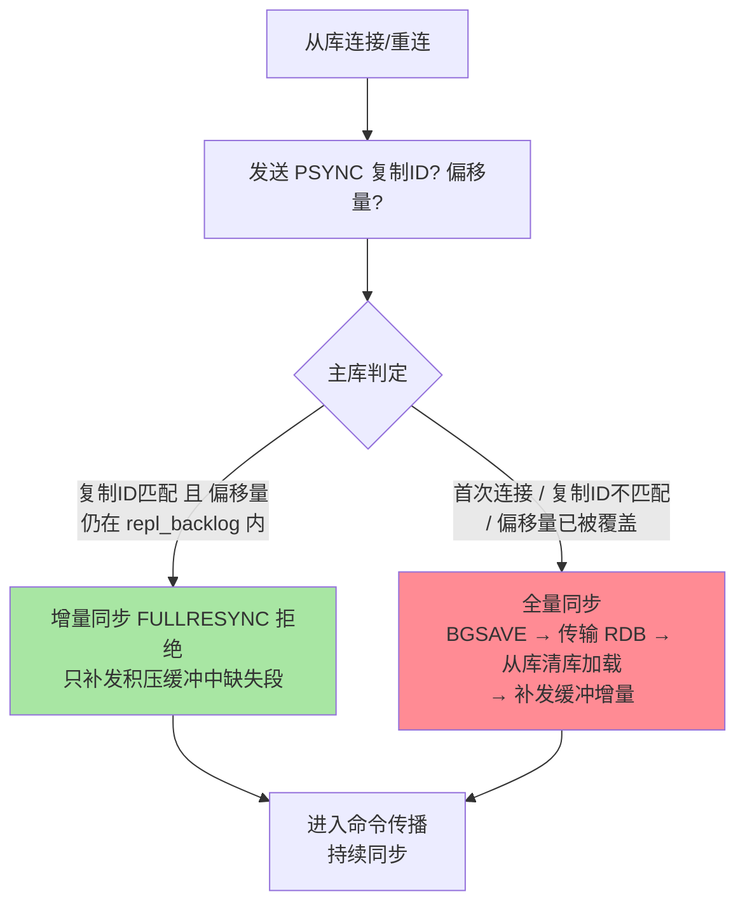
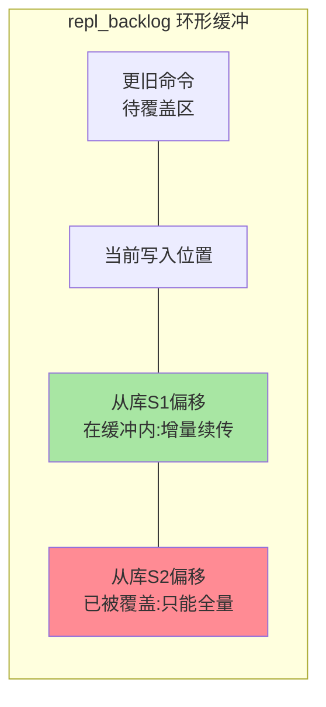

# 主从复制同步细节：全量、增量与积压缓冲

> Redis 复制不是「从库连上就算完」：断线重连后是重新全量同步还是增量续传，取决于一个环形缓冲区（repl_backlog）。这篇把全量同步的代价、增量同步的条件、PSYNC 协议的判定逻辑讲透——高可用的一切讨论都建立在这条同步链路的细节上。

## 一句话摘要

Redis 主从复制分两条路：**全量同步**（主库 BGSAVE 生成 RDB 传给从库，从库清空加载，代价大）与**增量同步**（断线重连时若从库的复制偏移量还在主库 **repl_backlog 环形缓冲**内，只补发缺失部分，代价小）。判定协议本身也有一部演进史——旧版 SYNC 重连必全量，PSYNC 引入「复制 ID + 偏移量」后才有了增量续传的可能。**增量条件只有一个**：偏移量仍在缓冲内，缓冲写满即覆盖旧数据。**复制的高可用工程，本质是「让增量条件尽可能常成立」**。

## 🎯 本文核心

**核心一句话：复制的健康度 = 「增量条件尽可能常成立」——PSYNC 靠「复制 ID + 偏移量在 repl_backlog 内」判定续传，backlog 是全库共享的单个环形缓冲，容量按「断线时长 × 峰值写入速率」给足；默认 1MB 的 backlog 是「从库抖一下就全量」这一高频事故的唯一病根。**

机制链：两条路径（全量成本清单四笔/增量秒级）→ backlog 环形结构（共享语义）→ PSYNC 判定（ID + offset + 部分重同步）→ 心跳与安全阀 → 无盘复制。全文一句话可重构：「缓冲给足，断线落在增量；缓冲不够，一次抖动付一次全量」。

## 前置阅读

- 入门层篇 15《主从复制》：搭建与用途
- 本系列《深入理解持久化系列》篇 1：BGSAVE——全量同步的种子来源

## 目标导向

本文是什么：复制同步的两条路径与 PSYNC 判定机制。功能是什么：让「为什么从库断一下网就全量同步」可归因、可预防。能得到什么：repl_backlog 容量的计算方法、全量同步的成本清单、复制链路的监控口径。为什么用：从库频繁重连排查、主从切换设计、大实例复制规划，必看。

## 一、边界：入门层讲过什么，本文讲什么

| 内容 | 入门层 | 本文 |
|---|---|---|
| 主从复制怎么配、干什么用 | ✅ 讲过 | 不重复 |
| 全量同步的完整流程与代价 | 提了一句 | **本文核心一** |
| repl_backlog 与增量条件 | 未讲 | **本文核心二** |
| PSYNC 判定与复制 ID | 未讲 | **本文核心三** |

## 二、两条同步路径的完整流程

**全量同步的成本清单**（大实例每项都疼）：主库 fork 生成 RDB（fork 阻塞 + COW 膨胀，持久化篇的两笔账）；网络传输整个快照；从库清空内存 + 加载 RDB 期间不可服务；之后再补发缓冲内的增量。**一次全量 = 数分钟级的资源大动作**——避免不必要的全量，是复制运维的核心目标。

**增量同步的成本**只有「补发一段缺失命令」，秒级完成——两条路径的成本差两到三个量级。

## 三、repl_backlog：增量条件的唯一裁判

主库维护一个**固定大小的环形缓冲区**（`repl-backlog-size`，默认 1MB），持续记录最近写入的命令流；每个从库记录自己的复制偏移量。重连时判定「我要的偏移量还在不在缓冲里」：

- **在**（断线期间主库写入量 < 缓冲大小）→ 增量补发
- **被覆盖**（写入太快/断线太久）→ 只能全量

**容量计算法**：`repl-backlog-size ≥ 断线时长 × 峰值写入速率 × 安全系数`。例：峰值写入 60MB/s、预期容忍断线 60 秒 → 至少 3.6GB（含系数）。默认 1MB 对任何有规模的主库都形同虚设——**「从库抖一下就全量同步」的病根几乎都是这个默认值没调**。缓冲的环形结构与两个从库的判定差异一目了然：

环形结构还带来一个隐含语义：**缓冲是全库共享的**（不是每从库一份）——这是复制架构里的关键取舍：一份命令流服务全部从库，容量按最挑剔的从库规划。

## 四、PSYNC：复制 ID 与偏移量的协议语言

- **复制 ID（Replication ID）**：主库身份标识。从库记住「我同步的是哪个 ID 的哪个偏移」；**主库故障切换后新主的复制 ID 变化**，但从库记录的「上一主 ID」仍在判定范围内（部分重同步语义），这是切换后能续传的协议基础
- **偏移量（offset）**：复制流的全局进度尺，主从双方各自维护并互报（`INFO replication` 的 master_repl_offset / slave_repl_offset）
- **心跳**：从库每秒报 `REPLCONF ACK offset`——主库据此计算每个从库的滞后，**`min-replicas-to-write` 等安全阀读的就是这个滞后值**

无盘复制（`repl-diskless-sync`）：主库生成的 RDB 不落盘直接走网络传给从库——磁盘慢/不放 RDB 的场景用，代价是传输失败需重来且多从库并发时调度不同。

## 五、源码关键路径

以 8.0 主线口径（src/）：

- 握手与判定：`replication.c` 的 `masterTryPartialResynchronization`——PSYNC 判定的全部逻辑（ID 匹配 + 偏移量在 backlog 内）
- backlog 维护：`feedReplicationBacklog`——命令传播时环形写入
- 全量：`syncCommand` → `startBgsaveForReplication`（复用 BGSAVE 管线）
- 心跳：`replicationFeedSlaves` 与 `REPLCONF ACK` 处理路径

阅读建议：以「从库断线 60 秒后重连」为剧本走一遍判定——backlog 的每个字节都出现在这条路径上。

## 典型场景

- **从库网络抖动**：backlog 足够 → 增量秒级续传，业务无感——容量规划到位时的理想形态
- **新增从库**：必然全量——大实例加从库选低峰，多个新从库错峰发起（避免主库 fork 风暴）
- **主从切换后追平**：新主复制 ID 变化 + 部分重同步语义，旧主的从库多数能增量续传——哨兵/集群的切换成本控制依赖它（篇 2/3 的基础）

## 业内惯例

> 💡 **实战提示**
> - 什么时候调 backlog：每次主从断线后 `sync_full` 计数 +1 就是「增量没接住」的证据——按「断线时长 × 峰值写速 × 安全系数」重算给足
> - 新增从库的操作纪律：大实例加从库选低峰、多个从库错峰发起——同时全量 = fork 风暴叠加网络带宽挤兑
> - 切换设计前先验证部分重同步：演练切换后旧主从库的续传形态（增量 or 全量）——切换成本的真实数字来自演练而不是文档
> - 复制偏移差突增的归因顺序：先查 backlog 是否被覆盖（sync_full 并发增长）→ 再查从库负载（重放被抢资源）→ 最后查网络——顺序错了容易先换网卡

- **backlog 按峰值写入速率公式给足**：默认 1MB 一律视为「未配置」——这是 Redis 复制参数里被漏配率最高的一项，业内巡检必查
- **从库实例规格不低于主库**：与 MySQL 同一条常识——加载 RDB 与持续重放都是重活，倒挂 = 追不上
- **主从部署同机房就近**：复制是持续流量，跨机房复制延迟与带宽成本长期在账上；跨机房容灾用「级联 + 专用复制链路」收敛
- **复制链路监控三件套**：主从偏移差、从库加载/重放状态、last IO 延迟秒数——偏移差突增优先怀疑 backlog 被覆盖

## 六、常见误区

- **「断线重连总会自动增量」**：增量有硬条件——偏移量还在 backlog 内。默认 1MB 的 backlog 让这条条件几乎总是不成立，于是「以为有增量、实际全量」
- **「backlog 越大越好」**：它是常驻内存的固定开销——按「断线时长 × 写速」计算给足即可，天量 backlog 白吃内存
- **「全量同步只影响从库」**：主库 fork（阻塞 + COW）、网络带宽、从库清库加载，三方都在付账——「全量」是全链路事件
- **「复制 ID 变了就得全量」**：PSYNC 的部分重同步语义保留了「上一主 ID」的判定空间——切换后能否增量由协议机制决定，不是「ID 变 = 必全量」

## 七、与相邻机制的关系

- 本系列篇 2《哨兵脑裂与 quorum》：切换决策建立在本文的滞后观测（ACK 心跳）之上
- 本系列篇 3《集群槽迁移与 failover》：Cluster 模式把同样的同步逻辑复制到每个主从对
- tips 互指：持久化系列篇 1——BGSAVE 是全量同步的引擎，fork 代价两篇同源

## 你们可能会问

**Q1：怎么知道我的从库经历过「本可避免的全量」？**
`INFO stats` 的 `sync_full` 计数（全量同步次数）——它非预期增长就是「backlog 不够/网络不稳」的直接证据，配上 `master_repl_offset` 曲线一起看归因立现。

**Q2：从库加载 RDB 期间能提供服务吗？**
不能（旧数据已清空、新数据未加载完），配置 `replica-serve-stale-data no` 时直接拒读——这也是「从库数量多≠读可用性高」的原因之一（全量期间集体哑火）。

**Q3：多级复制（级联）下 backlog 怎么算？**
每一级主库只对自己直属从库的断线负责——中间层的 backlog 按其下游从库的断线容忍度规划，逐级独立计算。

## 八、自测三问

1. 增量同步成立的三个条件是什么？repl_backlog 在其中扮演什么角色？
2. 全量同步的成本清单有哪些？谁在付每一笔？
3. 复制 ID 与偏移量在 PSYNC 判定里各起什么作用？切换后为什么多数能续传？

## 开放问题

- 无盘复制与共享存储形态（云 Redis 的存储计算分离）正在改变「全量同步 = 传 RDB」的带宽模型。
- 多主写入（CRDT 类同步）在 Redis 企业版与社区提案中长期讨论，主从单写的复制语义是否会被多写场景扩容，值得跟踪。

## 🎯 核心带走

- **核心一句话**：复制 = 全量（四笔成本）+ 增量（秒级续传）——增量唯一条件是「offset 在共享的 repl_backlog 内」，backlog 默认 1MB 是高频事故唯一病根
- **机制链**：PSYNC 判定 → 全量成本清单 → backlog 环形与共享 → 心跳安全阀 → 无盘复制
- **哪里会坏**：backlog 未调（抖动即全量）、从库规格倒挂、多从库同时全量（fork 风暴）、误信 ID 变=必全量
- **边界**：本篇管同步链路细节；切换决策在篇 2，Cluster 的复制形态在篇 3，BGSAVE 引擎在持久化系列篇 1

## 📌 数据与事实声明

- 写于 2026-09-08，机制以 Redis 8.0 主线源码与官方文档为准；repl-backlog-size 默认 1MB 为官方默认
- 容量公式与「60MB/s 示例」为计算口径示例，需按实际写入速率代入
- 免责：参数默认值以 redis.io 官方文档为准

## 📚 参考资料

| 类型 | 标题 | 来源 |
|---|---|---|
| 官方文档 | Replication（PSYNC/Backlog 部分） | redis.io/docs/management/replication |
| 官方源码 | redis/redis（src/replication.c） | github.com/redis/redis |
| 原理书 | 《Redis 设计与实现》黄健宏（复制章） | 公开出版 |
| 实战书 | 《Redis 开发与运维》付磊/张益军 | 公开出版 |
