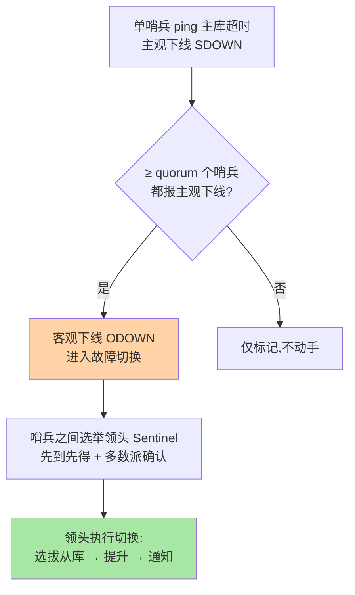
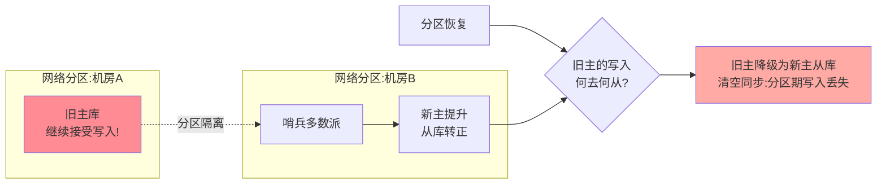

# 哨兵机制：quorum、选主与脑裂防护

> 哨兵（Sentinel）是主从架构的自动故障切换层，但它不是「装上就高可用」：quorum 设错、脑裂没防、选主失真，三类配置事故比主库宕机更常见。这篇把「下线判定 → 领头哨兵选举 → 从库选拔 → 切换执行 → 脑裂防护」五步讲透。

## 一句话摘要

哨兵体系三个关键机制环环相扣：**主观下线（单哨兵ping 不通）→ 客观下线（≥ quorum 个哨兵同意）→ 领头哨兵选举（Raft 式多数派）→ 从库选拔与提升 → 客户端经哨兵发现新主**。脑裂的老剧本是「旧主在分区侧继续接受写入，切换后新主丢这部分数据」，**防护靠 `min-replicas-to-write`/`min-replicas-max-lag` 让旧主在失去从库联系后拒绝写入**——哨兵的高可用质量 = 判定准确率 × 切换速度 × 脑裂防护三者的乘积。

## 🎯 本文核心

**核心一句话：哨兵体系有两个独立的多数派——quorum 管「判定门槛」（客观下线），哨兵多数派管「执行授权」（选领头），两者分开配置分开理解；脑裂的防护不在哨兵侧而在主库侧安全阀（min-replicas 组合让被分区的旧主写不进）——「判定准、切换稳、裂不丢」三件事三套机制。**

机制链：SDOWN → ODOWN（quorum 门槛）→ 领头选举（epoch 多数派）→ 从库选拔三级规则 → 切换执行与通知 → 脑裂剧本与安全阀。全文一句话可重构：「两个多数派管判定与授权，主库安全阀管脑裂，客户端哨兵协议收尾」。

## 前置阅读

- 入门层篇 16《哨兵机制》：架构与部署形态
- 本系列篇 1：复制偏移与 ACK 心跳——「从库滞后」是本篇安全阀的数据来源

## 目标导向

本文是什么：哨兵的判定、选举、切换与脑裂防护机制。功能是什么：把「哨兵为什么误判/为什么切换慢/怎么还会丢数据」归因到机制。能得到什么：quorum 与哨兵数量的配置方法、脑裂防护参数的语义、切换流程的观测点。为什么用：哨兵集群建设、误切换排查、高可用评审，必看。

## 一、边界：入门层讲过什么，本文讲什么

| 内容 | 入门层 | 本文 |
|---|---|---|
| 哨兵是什么、怎么部署 | ✅ 讲过 | 不重复 |
| 下线判定与领头选举机制 | 未讲 | **本文核心一** |
| 从库选拔与切换执行 | 未讲 | **本文核心二** |
| 脑裂剧本与防护参数 | 未讲 | **本文核心三** |

## 二、下线判定与领头选举：两个「多数派」



**quorum 的语义是「客观下线的门槛」，不是「执行切换的门槛」**——切换还需要领头哨兵获得**哨兵多数派**授权。这就引出部署铁律：**哨兵数量 ≥ 3 且为奇数**，quorum 设为「哨兵数的一半向下取整 + 1」（如 3 哨兵配 2）——quorum 过高会「判得动切不动」（客观下线了但凑不齐多数派选领头），过低则误判风险上升。

领头选举借鉴 Raft 的先到先得 + 任期（epoch）：每个发现客观下线的哨兵都拉票，**同一 epoch 只投一票**，多数派确认产生领头——这套协议设计随版本演进不断吸收共识算法的成熟经验。这也是「哨兵数必须奇数」的第二个理由：偶数在平票场景拖慢选举。

## 三、从库选拔与切换执行

领头哨兵提升从库的选拔优先级（业内口径从高到低）：

1. **replica-priority 配置值**（越小越优先；0 = 永不参选——留给「只想当备份」的机房从库）
2. **复制偏移量最大**（数据最新，丢失最少）
3. **runid 字典序**（最终兜底的确定性打破平局）

切换执行四步：提升最优从库为新主（`SLAVEOF NO ONE`）→ 其余从库改挂新主 → 旧主降级标记 → 通过 **Pub/Sub（`+switch-master` 频道）与配置重写**通知客户端。客户端的语义是「问哨兵要当前主库地址」而不是「写死主库地址」——哨兵体系的客户端协议（`SENTINEL get-master-addr-by-name`）是高可用的最后一环，写死地址的客户端让哨兵白装。

## 四、脑裂：剧本与防护

经典脑裂剧本：



**机制根源**：旧主在分区侧「不知道自己已被退位」，继续收写；恢复后它降级为从库并按新主同步——分区期间的写入被清掉。**防护靠主库侧的安全阀**：

```text
min-replicas-to-write 1        # 至少 1 个从库连着且滞后达标才接受写
min-replicas-max-lag 10        # 从库滞后 ≤ 10 秒
```

组合语义：**主库发现自己失去全部（或达标数量的）从库联系时拒绝写入**——分区侧的旧主「写不进」，脑裂窗口的丢失量收敛到参数边界内。代价同样明确：正常运维（滚动重启全部从库）也会触发拒绝写——**这是「可用性换一致性」的显式取舍**，参数值按业务容灾等级定，不是越大越好。

## 五、源码关键路径

以 8.0 主线口径（src/sentinel.c，单文件巨石）：

- 下线判定：`sentinelCheckSubjectivelyDown` / `sentinelCheckObjectivelyDown`
- 领头选举：`sentinelGetLeader`——epoch 拉票与多数派统计
- 从库选拔：`sentinelSelectSlave`——priority/offset/runid 三级排序
- 安全阀：主库侧 `replication.c` 的 `checkGoodReplicasStatus`——min-replicas 组合的执行点

阅读建议：sentinel.c 按状态机读——每个定时任务（10Hz/1Hz/2Hz 的三档周期函数）对应本文一节，状态流转即切换全流程。

## 典型场景

- **三哨兵 + 一主二从**：最小生产形态——哨兵与数据节点异机部署（哨兵挂了等于判定系统失明），quorum=2
- **误切换归因**：主库没挂却被切换——先查网络抖动（哨兵到主库链路），再查 quorum 配置过低、慢查询阻塞 ping（`down-after-milliseconds` 过小放大误判）
- **跨机房部署取舍**：哨兵跨机房分布保证「机房级故障时判定系统存活」，但分区场景自动触发切换——是否允许「跨机房自动切」是容灾等级决策，与脑裂防护参数联动评审

## 业内惯例

> 💡 **实战提示**
> - 什么时候收紧 min-replicas 参数：业务从「可容忍切换丢失」升级为「切换也不许丢」时——参数收紧前先算「从库全部重启的运维场景会被拒绝写」的代价
> - 误切换排查从 `down-after-milliseconds` 开始：阈值过小（<10 秒）在网络抖动环境放大误判——放宽到 30-60 秒区间是业内常态
> - 优先级 0 的从库是「容灾开关」：灾备机房的从库标 0，避免自动切换把主库切到「业务没准备好接流量的机房」——人为事故比故障更常见
> - 切换演练必测「客户端发现链路」：SENTINEL 协议拿新主地址 → 连接池刷新 → 写入恢复，三段任何一段断链都会让「切换成功」变成「业务故障」

- **哨兵数量 3 或 5，quorum = 过半**：偶数、单哨兵、quorum=1 都是反模式——判定与选举两个多数派都要奇数支撑
- **`down-after-milliseconds` 不激进**：默认 30 秒被多数团队放宽到 30-60 秒区间——误切换的代价（切换风暴 + 潜在丢失）远大于多等几秒
- **客户端必须走哨兵协议**：直连主库地址是哨兵体系出现之前的演进遗产，也是切换失败的高发因素——上线前演练客户端发现链路
- **`min-replicas-to-write` 按容灾等级开**：资金类开启（一致优先），纯缓存类可不开（可用优先）——参数背后是业务取舍，不是默认值之争

## 六、常见误区

- **「quorum 越大越安全」**：quorum 只管「判定门槛」，过高会让客观下线达成却选不出领头（若哨兵多数派被分区）——两个多数派要分开配置、分开理解
- **「哨兵和主库放一起省机器」**：哨兵与它判定的主库同生共死 = 判定系统失明——异机是底线
- **「开了哨兵就不会丢数据」**：哨兵只管切换不管脑裂；分区窗口的写入丢失靠主库安全阀参数防——两层机制职责不同
- **「优先级 0 的从库是浪费」**：它是「多机房容灾的开关」——把从不参选的机房从库标记出来，避免「切到灾备机房但业务没准备好」的人为事故

## 七、与相邻机制的关系

- 本系列篇 1：ACK 心跳的滞后数据是安全阀的输入；切换后能否增量续传决定切换的丢失量
- 本系列篇 3：Cluster 把「哨兵 + 主从」合一为内置 gossip 判定——机制思想同源，形态不同
- tips 互指：客户端哨兵协议的接入细节在入门层篇 23（客户端与连接池）的哨兵支持段

## 你们可能会问

**Q1：哨兵自己也挂了怎么办？**
哨兵是多数派系统——3 挂 1 照常工作，3 挂 2 失去切换能力但**不产生误动作**（没有多数派就不会有领头）。这就是「至少 3 个」的意义：失效模式是「丧失自动切换」而非「乱切」。

**Q2：切换期间客户端会丢请求吗？**
切换窗口（秒到十秒级）内写请求会失败——哨兵不是零切换成本的魔法。业务的应对是重试 + 幂等，与「哨兵切换快」是互补关系，不是替代。

**Q3：怎么验证脑裂防护真的生效？**
演练：主库与所有从库之间拔网线（保持客户端到主库通），观察主库在 `min-replicas-max-lag` 超时后开始拒绝写入——写入被拒即防护生效，这是容灾演练的标准剧本之一。

## 八、自测三问

1. 主观下线、客观下线、领头选举分别需要什么门槛？quorum 与哨兵多数派为什么是两回事？
2. 从库选拔的三级优先级是什么？优先级 0 的从库什么场景用？
3. 脑裂的机制根源是什么？`min-replicas-to-write` 组合用什么换什么？

## 开放问题

- Redis Cluster 的内置故障检测逐步吸收哨兵经验，「哨兵 + 主从」与「Cluster」两条高可用路线的客户边界在持续重画（篇 3 展开）。
- 哨兵的通知机制（Pub/Sub + 钩子脚本）向「云控制台事件流」迁移是托管形态下的演进方向，自建哨兵的必要性持续下降。

## 🎯 核心带走

- **核心一句话**：哨兵 = quorum 判定 + 多数派授权领头 + 三级规则选拔 + 主库安全阀防脑裂——两个多数派分开理解，脑裂防护在主库侧不在哨兵侧
- **机制链**：SDOWN/ODOWN → 领头选举 → 选拔与切换 → 脑裂剧本 → min-replicas 安全阀
- **哪里会坏**：quorum 与哨兵数失配（判得动切不动）、哨兵与主库同生共死、客户端直连 IP、误信零丢失
- **边界**：本篇管哨兵侧；同步链路细节在篇 1，Cluster 的内置判定在篇 3，客户端接入在入门层篇 23

## 📌 数据与事实声明

- 写于 2026-09-08，机制以 Redis 8.0 主线源码与官方文档为准；min-replicas 组合、replica-priority 为官方参数
- 「3-60 秒区间」「异机部署」为业内经验口径
- 免责：参数默认值以 redis.io 官方文档为准

## 📚 参考资料

| 类型 | 标题 | 来源 |
|---|---|---|
| 官方文档 | Sentinel documentation | redis.io/docs/management/sentinel |
| 官方源码 | redis/redis（src/sentinel.c） | github.com/redis/redis |
| 原理书 | 《Redis 设计与实现》黄健宏（Sentinel 章） | 公开出版 |
| 实战书 | 《Redis 开发与运维》付磊/张益军 | 公开出版 |
