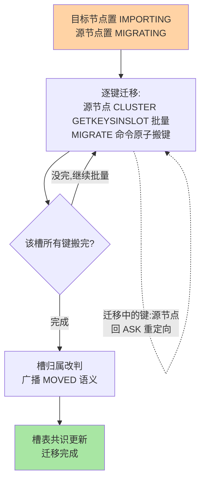
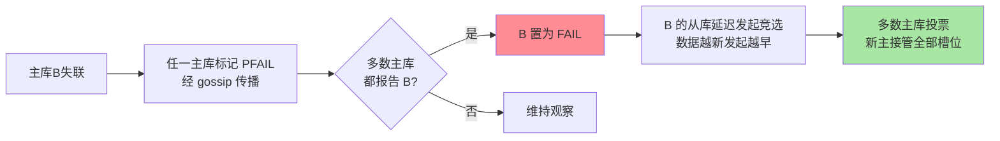

# 集群槽迁移与 Failover：Cluster 的分布与自愈

> Redis Cluster 把「分片」与「高可用」合进一套体系：16384 个哈希槽决定数据分布，gossip 协议决定彼此认知，故障时从库自动竞选上位。这篇讲透「键怎么路由、槽怎么迁移、节点挂了谁说了算」三大机制。

## 一句话摘要

Cluster 的三块基石：**路由**——键按 `CRC16(key) % 16384` 落槽，客户端智能路由（本地槽表直连）+ `MOVED/ASK` 重定向兜底；**扩缩**——槽迁移按「逐键迁移 + 两段重定向（ASK 期间）」渐进完成，在线不断服；**自愈**——节点故障经 gossip 传播、多数主库确认后，故障主库的从库发起竞选（与哨兵同思想的内置版）自动提升。**Cluster = 分片 + 哨兵两套机制的一体化重构**，代价是运维模型与多键命令的限制。

## 🎯 本文核心

**核心一句话：Cluster 把哨兵的「多数派判定 + 自愈」内置进节点的 gossip 协议——路由靠「槽表 + MOVED/ASK 两副面孔」承载渐进迁移，扩容靠「逐键 MIGRATE 原子搬移」在线完成，故障靠「PFAIL→FAIL→从库竞选」自动接管；16384 槽是调度刻度不是物理分片。**

机制链：键 → 槽 → 节点的两层映射 → MOVED（终态）/ASK（中间态）语义 → 槽迁移状态机 → gossip 与多数派 FAIL 判定 → 从库竞选与槽接管。全文一句话可重构：「槽是刻度，gossip 是神经，竞选是自愈——三套机制一个集群」。

## 前置阅读

- 入门层篇 17《集群模式》：Cluster 的搭建与用法
- 本系列篇 1/2：主从同步与哨兵判定——Cluster 的自愈机制是两者的内置化

## 目标导向

本文是什么：Cluster 的路由、迁移、故障自愈三大机制。功能是什么：把「MOVED 是什么、扩容数据怎么搬、挂了谁顶上」讲成可推理的流程。能得到什么：客户端选择依据、槽迁移的操作要点与坑、故障演练的观测点。为什么用：Cluster 选型评审、扩容实施、集群故障排查，必看。

## 一、边界：入门层讲过什么，本文讲什么

| 内容 | 入门层 | 本文 |
|---|---|---|
| Cluster 怎么搭、怎么用 | ✅ 讲过 | 不重复 |
| 槽路由与 MOVED/ASK 语义 | 提了一句 | **本文核心一** |
| 槽迁移的渐进流程 | 未讲 | **本文核心二** |
| 故障检测与从库竞选 | 未讲 | **本文核心三** |

## 二、槽路由：16384 的分寸

键 → 槽：`CRC16(key) mod 16384`；槽 → 节点：集群槽表（各节点共识维护）。`{user1000}.profile` 这类 **hash tag** 强制多键落同槽（取 `{}` 内内容计算）——多键命令的前提。

重定向的两副面孔：

- **MOVED**：槽已永久归属另一节点——「搬完了，以后直连它」，智能客户端据此**更新本地槽表**
- **ASK**：槽正在迁移中、该键已临时落在目标节点——「只此一次去那边问」，**不改**本地槽表

两副面孔的区分正是渐进迁移的精巧处：迁移没有「停写窗口」，靠 MOVED（终态）与 ASK（中间态）两个语义把「数据在搬」这件事无害地暴露给客户端。

**客户端怎么选**：智能客户端（Lettuce/Redisson 等）维护槽表、本地直连——少一跳、批量友好；简单客户端走任意节点重定向——实现省、延迟与吞吐差。生产用智能客户端是业内默认，但要处理「槽表失效兜底」（重定向风暴 = 槽表过期的信号）。

## 三、槽迁移：在线搬数据的标准流程

扩容（新增节点） = 把若干槽从老节点迁给新节点，`redis-cli --cluster reshard` 的底层动作：

三个工程要点：**① 逐键 MIGRATE 是原子的**（单键搬移超时整体回滚），但**大 Key 是迁移风暴眼**——一个几百 MB 的键搬移期间两边都阻塞，bigkey 治理（专题层）在 Cluster 扩容前是前置手术；**② 迁移期间对该槽的写入在源节点命中未迁移键照常、命中已迁移键收 ASK**——客户端无感的前提是正确处理 ASK；**③ reshard 的批次数与并发可调**，业务低峰执行是业内默认。

## 四、故障自愈：gossip 检测 + 从库竞选

Cluster 没有独立哨兵进程，检测与竞选内置——把哨兵的多数派思想搬进节点间协议，是 Redis 高可用架构演进的关键一步：

检测与竞选四步：
1. **确定下线（FAIL）**：**多数主库**都报告 B 的 PFAIL → B 进入 FAIL——与哨兵客观下线同思想的多数派判定
2. **从库竞选**：FAIL 主库的从库们延迟发起竞选（数据越新发起越早——偏移量参与延迟计算），**多数主库投票**选出新主
3. **槽接管**：新主接管旧主的全部槽，广播更新槽表

「多数主库」的两个推论：**集群必须 ≥ 3 主库**（否则无多数派可言）；部署架构上主库要跨故障域（机架/机房）分布——多数派必须在多数故障域里存活，Cluster 才真的自愈。

## 五、源码关键路径

以 8.0 主线口径（src/cluster.c 为核心巨石文件）：

- 路由与重定向：`getNodeByQuery` / `clusterRedirectClient`——MOVED/ASK 的判定与返回
- 迁移状态机：`MIGRATING/IMPORTING` 标记与 `MIGRATE` 命令实现（`clusterCommand` + `migrateCommand`）
- gossip：`clusterCron`——节点间 PING/PONG/MEET 与 PFAIL 传播
- 竞选：`clusterHandleSlaveFailover`——竞选延迟计算与投票处理

阅读建议：以「一个键从源槽搬到目标槽」为主线走 MIGRATE 路径，再以「主库拔电」为剧本走 PFAIL→FAIL→竞选——两条线读完 cluster.c 的骨架就通了。

## 典型场景

- **在线扩容**：新增节点 → reshard 迁移部分槽——低峰执行、控制批量、提前治理 bigkey 三件套
- **机架感知部署**：主从跨机架/机房分布（`cluster-migration-barrier` 与手动指定主从关系）——多数派跨故障域是自愈有效的前提
- **多键业务改造**：购物车、事务类多键操作——hash tag 把相关键聚到同槽，代价是该槽可能热点（键设计在「分布均匀」与「原子多键」间的显式取舍）

## 业内惯例

> 💡 **实战提示**
> - 扩容前的三件前置：bigkey 治理（迁移风暴眼）、业务多键操作审计（CROSSSLOT 清单）、客户端槽表失效兜底验证——三件没做完的 reshard 是线上事故预约
> - 什么时候监控 MOVED 命中率：持续高位 = 客户端槽表过期未更新——智能客户端的槽表刷新机制有问题的直接信号
> - 主从跨故障域用「手动指定主从关系」落地：autoscale 的自动分配不感知机架拓扑——部署规划阶段人工固定主从映射更可控
> - 演练「主从同时挂」的槽位影响面：确认 cluster-require-full-coverage 的取舍（整集群判定 vs 部分可用）在演练中过一遍，别在真实故障时第一次面对

- **生产 ≥ 3 主 3 从、主从跨故障域**：Cluster 的最低尊严配置——少于 3 主失去多数派，主从不跨域失去自愈意义
- **智能客户端 + 重定向监控**：MOVED/ASK 命中率纳监控——持续高位的 MOVED 说明槽表/客户端有病
- **扩容走官方 reshard 工具而非手工搬槽**：状态机复杂度不值得手工挑战；大键先治理是前置 checklist
- **Cluster 与哨兵体系不混用**：一套数据体系选一条高可用路线——哨兵主从是先行演进的组合形态，Cluster 是一体化重构，混合部署是运维噩梦（选型决策见专题层「高可用与集群运维深度」）

## 六、常见误区

- **「16384 个槽 = 16384 个数据分片」**：槽是路由与搬移的调度单位，数据在槽内无序共存——「槽」是逻辑刻度不是物理分区
- **「Cluster 支持所有 Redis 功能」**：多键命令要求同槽（hash tag）、`SELECT` 多库不可用（只有 db0）、部分命令语义受限——功能面收窄是 Cluster 的固定代价，选型前对清单
- **「从库越多越保险」**：竞选只看数据新旧与多数派投票，冗余从库主要是读扩散资源——「从库数」与「自愈能力」不成正比，跨故障域才成
- **「迁移期间业务要限流」**：正确的渐进迁移不需要——ASK 语义就是为「迁移中照常服务」设计的；需要限流的是「bigkey 搬移」这类实现层面的坑

## 七、与相邻机制的关系

- 本系列篇 1：主从同步是 Cluster 每个主从对的内部机制，全量/增量语义完全一致
- 本系列篇 2：哨兵的下线判定/多数派架构思想在 Cluster 内置化（PFAIL/FAIL、竞选投票）——哨兵体系是先行演进的独立形态
- tips 互指：选型决策（哨兵主从 vs Cluster）在专题层「高可用与集群运维深度」；bigkey 与迁移的关系在「bigkey 与性能调优深度」

## 你们可能会问

**Q1：为什么是 16384 而不是更多槽？**
antirez 的公开口径：心跳包携带槽位图，16384 恰好 2KB——** gossip 消息体积与槽粒度的平衡**；1 万级节点上限远超实际需求，粒度够用。

**Q2：迁移中途客户端写入会丢吗？**
不会。未迁移键照常写在源节点、已迁移键走 ASK 到目标节点写——渐进语义保证每笔写都落在「键当前真正的家」，不丢只是可能多一跳。

**Q3：主库和它的从库同时挂怎么办？**
该主库的槽不可用（Cluster 部分失效），`cluster-require-full-coverage yes`（默认）时影响整集群可用性判定——多故障域部署 + 充分从库是对冲；关闭该参数换「部分可用」是显式取舍。

## 八、自测三问

1. MOVED 与 ASK 的语义差异是什么？各对应迁移的什么阶段？
2. 复述槽迁移的状态机流程，为什么 bigkey 是迁移风暴眼？
3. PFAIL 到 FAIL 的判定链是什么？「≥ 3 主库」的协议原因是什么？

## 开放问题

- Cluster 的 proxy 形态（智能代理承接路由）在云产品中广泛存在，「客户端直连」与「代理接入」的生态分叉持续。
- 跨地域 Cluster（多活）依赖 CRDT 或冲突解决层的补齐，社区与厂商的多活方案尚未统一，是多活诉求选型的最大变数。

## 🎯 核心带走

- **核心一句话**：Cluster = 槽路由（MOVED 终态/ASK 中间态）+ 渐进迁移（逐键 MIGRATE 原子）+ 内置自愈（gossip 多数派 + 从库竞选）——分片与哨兵的一体化重构
- **机制链**：两层映射 → 重定向语义 → 迁移状态机 → PFAIL/FAIL 判定 → 竞选接管
- **哪里会坏**：bigkey 迁移阻塞、客户端槽表过期（重定向风暴）、主从不跨域（自愈失效）、3 主以下无多数派
- **边界**：本篇管 Cluster 机制；同步链路在篇 1、哨兵判定在篇 2，选型决策（哨兵主从 vs Cluster）在专题层高可用与集群运维深度

## 📌 数据与事实声明

- 写于 2026-09-08，机制以 Redis 8.0 主线源码与官方文档为准；16384 槽与 2KB 心跳的权衡为 antirez 公开口径的归纳
- 「3 主 3 从最低配置」「低峰 reshard」为业内经验口径
- 免责：参数默认值以 redis.io 官方文档为准

## 📚 参考资料

| 类型 | 标题 | 来源 |
|---|---|---|
| 官方文档 | Redis Cluster specification / tutorial | redis.io/docs/management/scaling |
| 官方源码 | redis/redis（src/cluster.c） | github.com/redis/redis |
| 原理书 | 《Redis 设计与实现》黄健宏（集群章，历史版本视角） | 公开出版 |
| 实战书 | 《Redis 开发与运维》付磊/张益军 | 公开出版 |
