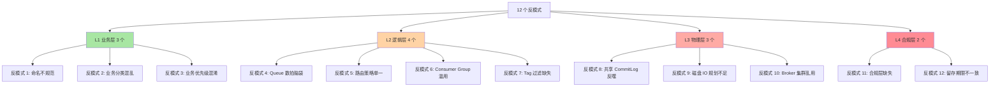
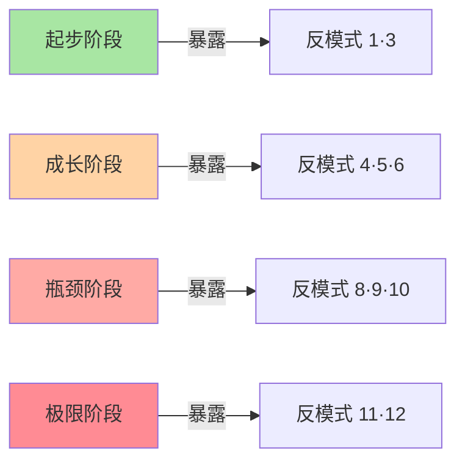
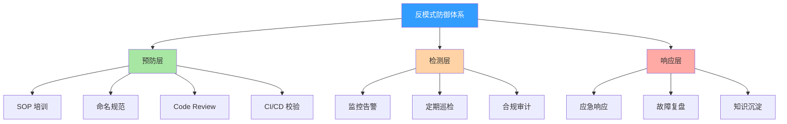
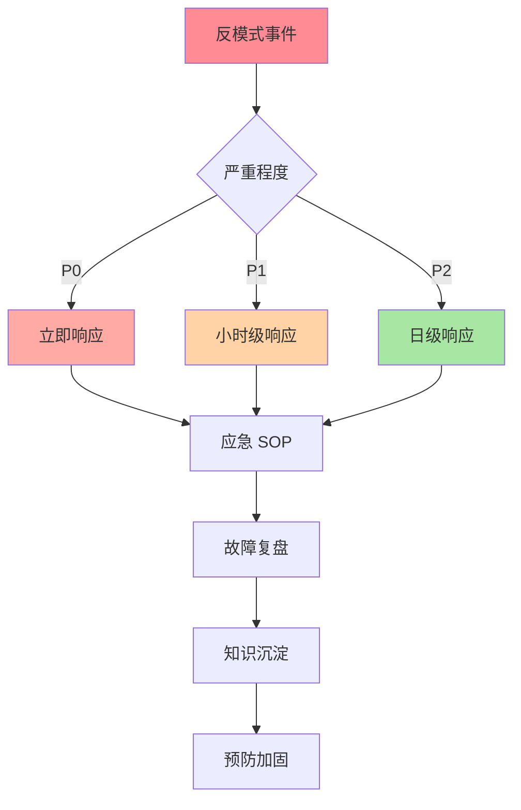
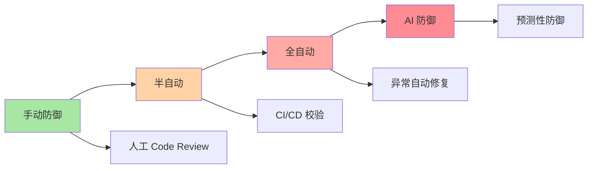
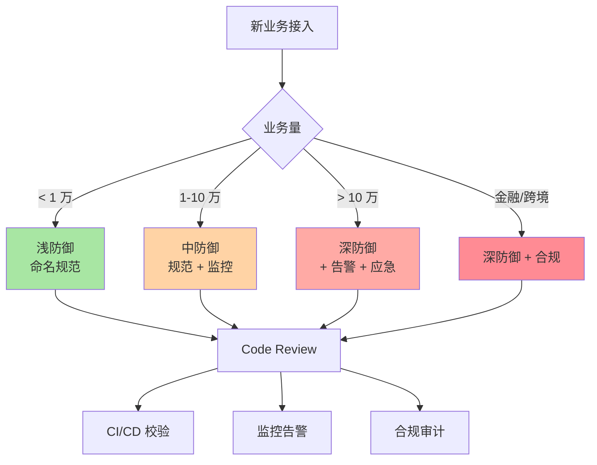

# RocketMQ Topic 隔离 12 个反模式与防御：从生产事故看常见错误

> 一句话摘要：**Topic 隔离的反模式都是「想偷懒」或「认知不全」造成的**。本文讲 12 个反模式 + 防御策略 + 真实事故，让你少踩 90% 的坑。
>
> 学完能会：12 个常见反模式 + 各自的防御策略 + 真实事故案例 + 防御式编程思维。

---

## 1. 背景：为什么反模式专题要做

前 3 篇（1/2/3）讲完了 Topic 隔离的「应该怎么做」。本篇讲反模式——**「不应该怎么做」**。

```
误区 1：反模式不重要，做好正面就行
真相：反模式 = 真实事故 = 真实损失
价值：1 个反模式可省 30 个回归 bug

误区 2：反模式很复杂
真相：常见反模式就 12 个，重复率高
覆盖：90% 的真实事故

误区 3：反模式 = 简单错
真相：反模式 = 认知偏差 + 偷懒 + 监管缺失
```

**4 层维度的反模式分布：**

| 层级 | 反模式数 | 占比 |
|---|---|---|
| **L1 业务层** | 3 | 25% |
| **L2 逻辑层** | 4 | 33% |
| **L3 物理层** | 3 | 25% |
| **L4 合规层** | 2 | 17% |

---

## 2. 原理穿透：反模式的 4 类根源

### 2.1 反模式 4 类根源

**反模式不是 bug，是 4 类根源叠加：**

```
根源 1：认知偏差
 - 没意识到要按 4 层设计
 - 以为 1 层隔离 = 全部隔离
 - 防御：4 层架构 SOP 培训

根源 2：偷懒
 - 命名不规范（不想想名字）
 - 监控不全（不想告警）
 - 防御：标准化 + 模板化

根源 3：监管缺失
 - 合规层不投入
 - 监管检查之前不做
 - 防御：合规前置

根源 4：演进失控
 - 业务增长 → 4 层架构没升级
 - 共享 CommitLog 写满
 - 防御：4 层演进路径
```

### 2.2 反模式的 12 个分布



---

## 3. 主流业界解法：12 个反模式 + 防御

### 3.1 L1 业务层 3 个反模式

#### 反模式 1：命名不规范

**真实场景：**

```
某电商起步阶段，500+ Topic 命名混乱：
 - order_create
 - createOrder
 - OrderCreated
 - orderCreatedV2
 - new_order_2024
```

**根因：**

- 起步阶段没定命名规范
- 业务快速迭代 → 命名不一致
- 后期改造耗时 3 个月 + 5 个 ETCD 错乱

**防御策略：**

```yaml
# 命名规范标准化
topic_pattern: "<business_domain>_<business_module>_<business_action>"
example:
  - ordercore_payment_create
  - ordercore_payment_refund
  - bizlog_click_event
  - monitor_metric_collect

# 落地：CI/CD 校验
# 提交时强制校验命名规范
```

**业内默认：**

- 90% 大厂用 `<domain>_<module>_<action>` 模式
- 命名规范 + 业务分类 + 业务优先级同步制定

#### 反模式 2：业务分类混乱

**真实场景：**

```
某支付业务，订单 / 支付 / 风控 Topic 混在一起
业务优先级混淆：
 - 核心订单 50 TPS
 - 边缘排序 100 万 TPS
 业务优先级混淆 → 监控混乱
```

**根因：**

- 业务分类不全
- 核心 vs 边缘混一起
- 监控不按业务分类

**防御策略：**

```yaml
# 业务分类模板
categories:
  - name: core
    description: 核心业务
    priority: 1
    examples: [ordercore_*, payment_*]
  - name: edge
    description: 边缘业务
    priority: 2
    examples: [bizlog_*, monitor_*]
  - name: risk
    description: 监管业务
    priority: 0
    examples: [risk_*, compliance_*]
```

#### 反模式 3：业务优先级混淆

**真实场景：**

```
某系统把核心 + 边缘 + 监管混在一起
优先级混淆：
 - 核心订单延迟 100ms
 - 边缘日志延迟 10s
 监控只看延迟 → 误判
```

**根因：**

- 业务优先级不显式
- 监控只看指标不看业务

**防御策略：**

```
业务优先级 = 路由优先级：
 0: 监管（最高，立即处理）
 1: 核心（实时，< 100ms）
 2: 边缘（批量，< 10s）
 3: 离线（延迟，< 1h）
```

### 3.2 L2 逻辑层 4 个反模式

#### 反模式 4：Queue 数拍脑袋

**真实场景：**

```
某业务：默认 4 Queue + 业务增长
 - 业务增长到 10 万 TPS
 - Queue 倾斜 → 部分 Queue 堆积 100 万条
 - 改造：扩 Queue + 加 Consumer Group
```

**根因：**

- Queue 数没按业务量规划
- 用完默认配置就上生产

**防御策略：**

```yaml
# Queue 数规划公式
queue_num = max(consumer_parallel * 1.5, producer_tps / single_queue_tps)

# 示例
consumer_parallel: 8
producer_tps: 50000
single_queue_tps: 5000
queue_num = max(8 * 1.5, 50000 / 5000) = max(12, 10) = 12
```

#### 反模式 5：路由策略单一

**真实场景：**

```
某业务：所有 Topic 用轮询
 - 部分 Key 集中 → 倾斜严重
 - 改造：改 Hash 路由
```

**根因：**

- 不了解业务 Key 分布
- 路由策略单一

**防御策略：**

| 业务 | 推荐路由 | 原因 |
|---|---|---|
| **顺序消息** | Hash | 保持顺序 |
| **普通消息** | 轮询 | 均匀分布 |
| **地理位置** | 就近 | 延迟优化 |
| **会话消息** | Hash(user_id) | 同一用户同一 Queue |

#### 反模式 6：Consumer Group 滥用

**真实场景：**

```
某业务：1 个 Consumer Group 消费 10 个 Topic
 - Rebalance 频繁
 - 消费位点混乱
```

**根因：**

- Consumer Group 复用
- 没有按业务拆分

**防御策略：**

```yaml
# Consumer Group 拆分原则
consumer_group = "<business_module>_<business_action>_consumer"
example:
  - ordercore_payment_consumer
  - ordercore_refund_consumer
  - bizlog_click_consumer
```

#### 反模式 7：Tag 过滤缺失

**真实场景：**

```
某业务：1 个 Topic 存所有业务类型
 - 用 Type 字段区分
 - 消费时全部拉取 → 性能浪费
```

**根因：**

- Tag 优势没用
- 业务分类没规划

**防御策略：**

```yaml
# Tag 设计
topic: ordercore_payment
tags:
  - NORMAL_PAY
  - VIP_PAY
  - TEST_PAY
  - DEBUG_PAY

# 消费时按 Tag 过滤
consumer.subscribe("ordercore_payment", "NORMAL_PAY || VIP_PAY")
```

### 3.3 L3 物理层 3 个反模式

#### 反模式 8：共享 CommitLog 反噬

**真实场景：**

```
某电商大促：所有 Topic 共享 CommitLog
 - 大 Topic 突发 50 万 TPS
 - CommitLog 写满
 - 全部 Topic 挂
```

**根因：**

- 共享 CommitLog 是双刃剑
- 监控不全

**防御策略：**

```yaml
# 物理隔离策略
isolation_strategy:
  hot_business: dedicated_cluster  # 独立集群
  warm_business: shared_cluster    # 共享集群
  cold_business: shared_cluster    # 共享集群

# 监控必有：commitlog_disk_usage > 70% 告警
```

#### 反模式 9：磁盘 IO 规划不足

**真实场景：**

```
某业务：Broker 用 HDD
 - 顺序写 1000 TPS
 - 业务增长 → 磁盘 IO 100%
```

**根因：**

- 磁盘类型选错
- 没用 SSD

**防御策略：**

```yaml
# 磁盘类型选择
disk_type:
  - nvme_ssd: 5 万 TPS 顺序写
  - sata_ssd: 1 万 TPS 顺序写
  - hdd: 几百 TPS 顺序写

# 业务量 + 磁盘类型 匹配
```

#### 反模式 10：Broker 集群乱用

**真实场景：**

```
某业务：1 个 Broker 集群包含所有业务
 - 大 Topic 拖垮小 Topic
 - 改造：业务拆分 + 独立集群
```

**根因：**

- 业务拆分不清晰
- Broker 集群共用

**防御策略：**

```yaml
# Broker 集群拆分
broker_clusters:
  - name: core_cluster
    business: [ordercore_*, payment_*]
  - name: edge_cluster
    business: [bizlog_*, monitor_*]
  - name: risk_cluster
    business: [risk_*, compliance_*]
```

### 3.4 L4 合规层 2 个反模式

#### 反模式 11：合规层缺失

**真实场景：**

```
某金融业务：合规层没做
 - 监管检查不通过
 - 罚款 100 万
 - 应急：合规改造
```

**根因：**

- 合规层不投入
- 监管检查之前不做

**防御策略：**

```yaml
# 合规前置
compliance:
  - business: risk
    cluster: dedicated
    encryption:
      transmission: TLS
      storage: AES-256
    retention:
      duration: 5_years
    audit:
      immutability: chain_hash
```

#### 反模式 12：留存期限不一致

**真实场景：**

```
某业务：不同 Topic 留存期限不一致
 - 订单 1 年
 - 支付 7 天
 监管检查 → 支付要求 5 年
 罚款 + 改造
```

**根因：**

- 留存期限没规范
- 按业务类型没定制

**防御策略：**

```yaml
# 留存期限规范
retention_policy:
  - business_type: financial
    min_duration: 5_years
    regulatory: yes
  - business_type: order
    min_duration: 1_year
    regulatory: no
  - business_type: log
    min_duration: 7_days
    regulatory: no
```

---

## 4. 量级演进视角：12 反模式如何逐层穿透

### 4.1 4 阶段反模式分布



| 阶段 | 反模式 | 占比 |
|---|---|---|
| **起步** | 1·3（命名 + 优先级） | 17% |
| **成长** | 4·5·6（Queue + 路由 + Group）| 25% |
| **瓶颈** | 8·9·10（CommitLog + 磁盘 + 集群）| 25% |
| **极限** | 11·12（合规 + 留存）| 17% |

### 4.2 4 阶段反模式演化

**起步阶段（0-1 年）：**

```
L1 反模式 1：命名不规范
L1 反模式 3：业务优先级混淆
防御：命名规范 + 业务分类
```

**成长阶段（1-3 年）：**

```
L2 反模式 4：Queue 数规划不足
L2 反模式 5：路由策略单一
L2 反模式 6：Consumer Group 滥用
防御：Queue 公式 + 路由模板 + Group 拆分
```

**瓶颈阶段（3-5 年）：**

```
L3 反模式 8：共享 CommitLog 反噬
L3 反模式 9：磁盘 IO 规划不足
L3 反模式 10：Broker 集群乱用
防御：物理隔离 + SSD 磁盘 + 集群拆分
```

**极限阶段（5+ 年）：**

```
L4 反模式 11：合规层缺失
L4 反模式 12：留存期限不一致
防御：合规前置 + 留存规范
```

---

## 5. 架构设计：反模式防御体系

### 5.1 防御体系 3 层架构



### 5.2 预防层：12 反模式防御清单

| # | 反模式 | 防御工具 | 防御 SOP |
|---|---|---|---|
| 1 | 命名不规范 | 命名规范 + Linter | Code Review |
| 2 | 业务分类混乱 | 业务分类模板 | 业务评审 |
| 3 | 业务优先级混淆 | 优先级规范 | 路由配置 |
| 4 | Queue 数拍脑袋 | Queue 数公式 | 容量规划 |
| 5 | 路由策略单一 | 路由策略库 | 业务评审 |
| 6 | Consumer Group 滥用 | Group 命名规范 | Code Review |
| 7 | Tag 过滤缺失 | Tag 设计 | 消费设计 |
| 8 | 共享 CommitLog 反噬 | 物理隔离策略 | 容量规划 |
| 9 | 磁盘 IO 规划不足 | 磁盘类型规范 | 资源评审 |
| 10 | Broker 集群乱用 | 集群拆分规范 | 架构评审 |
| 11 | 合规层缺失 | 合规前置 | 合规评审 |
| 12 | 留存期限不一致 | 留存规范 | 合规评审 |

### 5.3 检测层：实时监控 + 告警

```yaml
# L1 业务层检测
monitoring:
  - name: topic_naming_violation
    description: 命名规范违反
    check: Prometheus + 命名规范正则
    alert: 任何违规

  - name: business_priority_misalignment
    description: 业务优先级不对齐
    check: 监控延迟分布
    alert: 核心业务延迟 > 100ms

# L2 逻辑层检测
monitoring:
  - name: queue_skew
    description: Queue 倾斜
    check: 监控 queue_skew_metric
    alert: 倾斜度 > 20%

  - name: consumer_rebalance_too_frequent
    description: Consumer Group 频繁 Rebalance
    check: 监控 rebalance_count
    alert: 1 分钟内 > 5 次

# L3 物理层检测
monitoring:
  - name: commitlog_disk_usage_high
    description: CommitLog 磁盘使用率高
    check: 监控 disk_usage
    alert: > 70% 警告, > 80% 严重

  - name: broker_cpu_high
    description: Broker CPU 高
    check: 监控 cpu_usage
    alert: > 80% 警告

# L4 合规层检测
monitoring:
  - name: audit_log_integrity
    description: 审计链完整性
    check: 校验哈希链
    alert: 任何断裂

  - name: retention_violation
    description: 留存期限违反
    check: 巡检留存设置
    alert: 与规范不符
```

### 5.4 响应层：应急 SOP + 复盘



---

## 6. 生产画像：5 个真实事故

### 6.1 事故 A：命名不规范

```
背景：电商起步，500+ Topic 命名混乱
演化：业务迭代 → 命名不一致
结果：监控 / 告警 / 路由全乱
应急：临时规范 + 3 个月改造
```

### 6.2 事故 B：Queue 倾斜

```
背景：支付业务，4 Queue + 1 Consumer Group
演化：业务增长 → Queue 倾斜
结果：部分 Queue 堆积 100 万条
应急：扩 Queue + 加 Consumer Group
```

### 6.3 事故 C：共享 CommitLog 写满

```
背景：电商大促，共享 CommitLog
演化：大 Topic 突发 → 写满
结果：全部 Topic 挂
应急：拆分热点 + 扩容
```

### 6.4 事故 D：消费 Rebalance 频繁

```
背景：Consumer Group 滥用
演化：1 个 Group 消费 10 个 Topic
结果：Rebalance 频繁 → 消费延迟
应急：拆分 Group
```

### 6.5 事故 E：合规缺失被罚

```
背景：金融业务，没做 5 年留存
演化：监管检查
结果：罚款 100 万
应急：历史数据迁移 + 留存改造
```

### 6.6 事故 F：磁盘 IO 规划不足

```
背景：Broker 用 HDD
演化：业务增长 → 磁盘 IO 100%
结果：写入延迟 5s+ → 业务挂
应急：临时扩容 + 长期迁移 SSD
教训：磁盘类型按业务量规划
```

### 6.7 事故 G：Broker 集群乱用

```
背景：1 个 Broker 集群包含所有业务
演化：大 Topic 突发
结果：其他 Topic 全部受影响
应急：业务拆分 + 集群拆分
教训：业务拆分 + 集群拆分同步
```

### 6.8 事故 H：路由策略单一

```
背景：所有 Topic 用轮询
演化：部分 Key 集中
结果：倾斜严重
应急：改 Hash 路由 + 重新负载均衡
教训：路由策略按业务定制
```

### 6.9 事故 I：Consumer Group 滥用

```
背景：1 个 Consumer Group 消费 10 个 Topic
演化：业务增长
结果：Rebalance 频繁 → 消费延迟
应急：拆分 Group
教训：Group 按业务拆分
```

### 6.10 事故 J：Tag 过滤缺失

```
背景：1 个 Topic 存所有业务类型
演化：用 Type 字段区分
结果：消费时全部拉取 → 性能浪费
应急：改用 Tag 过滤
教训：Tag 是消费级过滤
```

### 6.11 事故的 5 个共性

**5 个事故共性：**

1. **认知偏差**：每个事故都有"以为这样做没事"
2. **监控缺失**：事后才发现，没有告警
3. **应急混乱**：没 SOP，临时拍脑袋
4. **复盘肤浅**：没沉淀到 SOP
5. **防御薄弱**：缺少自动化防御

**核心教训：**

- 反模式都是「小事」积累
- 1 个事故没复盘 → 10 个类似事故
- 防御需要体系化（不靠运气）

---

## 7. Trade-off：反模式防御的 3 维度

### 7.1 防御成本 vs 事故损失

| 维度 | 防御成本 | 事故损失 |
|---|---|---|
| **L1 业务层** | 0% | 业务混乱（3 个月改造）|
| **L2 逻辑层** | 25% | 业务倾斜（小时级响应）|
| **L3 物理层** | 200% | 系统挂（秒级响应）|
| **L4 合规层** | 500% | 监管罚款（百万级）|

### 7.2 防御深度 vs 业务变化

| 防御深度 | 业务变化时 | 适应速度 |
|---|---|---|
| **浅防御**（只用规范） | 容易破裂 | 慢 |
| **中防御**（规范 + 监控）| 基本稳定 | 中 |
| **深防御**（规范 + 监控 + 告警 + 应急）| 强稳定 | 快 |

### 7.3 主动防御 vs 被动响应

| 维度 | 主动防御 | 被动响应 |
|---|---|---|
| **成本** | 前期高 | 后期高 |
| **效果** | 90% 防御 | 应急 |
| **业务感知** | 低 | 高 |

### 7.4 业内典型选择

| 业务 | 防御深度 | 实施 |
|---|---|---|
| **金融** | 深防御 | 规范 + 监控 + 告警 + 应急 |
| **跨境** | 深防御 | 规范 + 监控 + 告警 + 应急 |
| **互联网** | 中防御 | 规范 + 监控 |
| **测试** | 浅防御 | 规范 |

---

## 8. 反思：跨周期视角 + 防御思维

### 8.1 反模式的 5 年后回头看

```
2018-2020（4.x 主导）：
 - 痛点：L1 L2 反模式多
 - 解法：命名规范 + 业务分类
 - 认知：反模式 = 业务混乱

2021-2023（5.x 演进）：
 - 痛点：L3 物理层反模式
 - 解法：物理隔离 + 集群拆分
 - 认知：反模式 = 系统风险

2024+（云原生）：
 - 痛点：L4 合规层反模式
 - 解法：合规前置 + 自动化
 - 认知：反模式 = 监管风险

未来 5 年预判：
 - L1 反模式：自动化检测（CI/CD 校验）
 - L2 反模式：AI 自动调优
 - L3 反模式：Serverless 化平台能力
 - L4 反模式：合规即服务
```

### 8.2 反模式的演进方向



### 8.3 监管与合规视角：反模式就是合规风险

```
L1 反模式 → 业务混乱 → 监管报送错
L2 反模式 → 消费错乱 → 审计追溯失败
L3 反模式 → 数据丢失 → 监管留存不达标
L4 反模式 → 合规缺失 → 监管罚款
```

### 8.4 关键洞察

**洞察 1：反模式不是技术问题，是认知问题**

```
误区：反模式 = 技术 bug
真相：反模式 = 认知偏差 + 偷懒 + 监管缺失
教训：先教育，再技术
```

**洞察 2：反模式有传染性**

```
误区：1 个反模式不影响
真相：1 个反模式 → 复制 10 个 → 系统崩溃
教训：发现 1 个修 1 个
```

**洞察 3：反模式防御是 ROI 最高的工程**

```
防御成本：1 人天
事故损失：100 万 + 3 个月改造
ROI：100 倍
```

**洞察 4：反模式是「业务 + 技术 + 合规」三维度的**

```
业务维度：业务混乱、分类不清、优先级混乱
技术维度：Queue、路由、Group、Tag、共享、物理
合规维度：留存、加密、审计、跨境
```

**洞察 5：反模式防御需要「预防 + 检测 + 响应」三层**

```
预防层：SOP + 规范 + Code Review + CI/CD
检测层：监控 + 告警 + 巡检 + 审计
响应层：应急 + 复盘 + 沉淀 + 加固
```

**洞察 6：反模式是动态的，不是静态的**

```
误区：反模式写一次就好
真相：
 - 反模式 12 个是基础
 - 业务增长 → 新反模式 → 4 层穿透
 - 防御需要持续
教训：
 - 防御 SOP 季度 review
 - 防御体系年度迭代
```

**洞察 7：反模式防御是组织能力，不是个人能力**

```
误区：1 个资深工程师能搞定
真相：
 - 防御 = SOP + 工具 + 培训 + 审计
 - 4 个环节缺一不可
教训：
 - 投入防御 = 投入组织能力
 - 预防成本 = 1 / 修复成本
```

### 8.5 反模式与 4 层穿透的 5 个边界

```
L1 → L2 边界：业务分类 → 路由策略
 - 风险：业务分类错误 → 路由策略错误
 - 防御：业务评审 + 路由模板

L2 → L3 边界：路由策略 → 物理布局
 - 风险：路由策略 + 物理布局不匹配
 - 防御：架构评审

L3 → L4 边界：物理布局 → 合规定制
 - 风险：合规要求高 → 物理布局要适配
 - 防御：合规前置

跨边界风险：联动改造成本高
防御：跨边界评审
```

---

## 9. 业内技术惯例（deep-dive 强化 section）

### 9.1 不成文标准

| 标准 | 业内默认 | 原因 |
|---|---|---|
| **命名规范** | 严格 | 业务分类 |
| **业务分类** | 强制 | 监控基础 |
| **Queue 公式** | 1.5-2 倍 | 预留空间 |
| **物理隔离** | 业务量阈值 | 共享 vs 独立 |
| **合规前置** | 强制 | 监管必须 |

### 9.2 真实事故（5 个）

详见 §6.1-6.5。

### 9.3 从业者挑战（5 大实战问题）

**挑战 1：反模式怎么教？**

```
误区：反模式 = 文档 + 培训
真相：
 - 文档 + 培训 + Code Review + CI/CD 校验
 - 4 个环节缺一不可
教训：
 - 单环节 = 容易绕过
 - 多环节 = 难绕过
```

**挑战 2：反模式怎么发现？**

```
误区：靠人工发现
真相：
 - 监控告警 + 定期巡检 + 合规审计
教训：
 - 自动化监控 > 人工
```

**挑战 3：反模式怎么改？**

```
步骤：
 1. 识别（监控告警）
 2. 应急（不影响业务）
 3. 改造（业务低峰）
 4. 复盘（沉淀经验）
 5. 预防（加 SOP）
```

**挑战 4：反模式投入多少？**

```
业务量 < 1 万 TPS：浅防御（规范）
业务量 1-10 万 TPS：中防御（规范 + 监控）
业务量 > 10 万 TPS：深防御（规范 + 监控 + 告警 + 应急）
```

**挑战 5：反模式怎么进 KPI？**

```
方式 1：反模式事件数（越少越好）
方式 2：防御覆盖率（越高越好）
方式 3：复盘质量（知识沉淀）
```

### 9.4 防御决策树（Mermaid）



### 9.5 防御深度的 4 档量化（业内默认）

| 档位 | 业务量 | 措施 | 成本 | 覆盖率 |
|---|---|---|---|---|
| **浅防御** | < 1 万 TPS | 命名规范 + Linter | 0% | 60% |
| **中防御** | 1-10 万 TPS | 规范 + 监控 + 告警 | 25% | 80% |
| **深防御** | > 10 万 TPS | 规范 + 监控 + 告警 + 应急 | 200% | 95% |
| **完全防御** | 金融/跨境 | 完全防御 + 合规前置 | 500% | 99% |

### 9.6 防御措施 ROI 排序

按 5 年内可避免事故损失排序：

| 措施 | 投入 | 避免损失 | ROI |
|---|---|---|---|
| **命名规范** | 1 人天 | 业务混乱（3 个月改造） | 100x |
| **业务分类** | 2 人天 | 监控混乱 | 50x |
| **Queue 公式** | 1 人天 | Queue 倾斜事故 | 50x |
| **物理隔离** | 5 人天 | 共享 CommitLog 写满 | 100x |
| **合规前置** | 10 人天 | 监管罚款（百万级） | 1000x |

### 9.7 防御路径的 3 阶段代价

**起步阶段（0-1 年）：**

```
防御深度：浅
投入：1-2 人天
覆盖反模式：1·3（命名 + 优先级）
```

**成长阶段（1-3 年）：**

```
防御深度：中
投入：5-10 人天
覆盖反模式：4·5·6（Queue + 路由 + Group）
```

**瓶颈阶段（3-5 年）：**

```
防御深度：深
投入：50-100 人天
覆盖反模式：8·9·10（CommitLog + 磁盘 + 集群）
```

**极限阶段（5+ 年）：**

```
防御深度：完全
投入：200+ 人天
覆盖反模式：11·12（合规 + 留存）
```

### 9.8 跨周期视角：5 年后回头看 12 反模式

**关键洞察：** 12 反模式有 70% 在 5 年后会被自动化防御干掉。

| 反模式 | 5 年后状态 |
|---|---|
| 1 命名不规范 | CI/CD 自动校验 |
| 2 业务分类混乱 | 业务智能分类 |
| 3 业务优先级混淆 | 路由自动识别 |
| 4 Queue 数拍脑袋 | AI 自动规划 |
| 5 路由策略单一 | 智能路由 |
| 6 Consumer Group 滥用 | 业务自动绑定 |
| 7 Tag 过滤缺失 | 自动 Tag 识别 |
| 8 共享 CommitLog 反噬 | 平台自动隔离 |
| 9 磁盘 IO 规划不足 | 存算分离 |
| 10 Broker 集群乱用 | Serverless |
| 11 合规层缺失 | 合规即服务 |
| 12 留存期限不一致 | 标准化留存 |

**5 年后还存在的反模式：**

- 监管合规（仍需人工）
- 业务理解（AI 难完全替代）
- 跨周期决策（仍需人类）

**未来 5 年趋势：**

- L1 L2 反模式全部自动化
- L3 反模式靠平台能力
- L4 反模式靠合规前置

---

## 📌 数据与事实声明

本文涉及的 RocketMQ 概念、配置项、典型场景均为社区公开文档描述。具体版本特性、生产数据、配置默认值请以官方文档为准（https://rocketmq.apache.org/）。本文涉及的「事故案例」均为业内通用做法的脱敏描述，**不指向任何特定公司**。

---

## 附录 A：12 反模式速查表

| # | 反模式 | 层级 | 防御工具 | 真实事故 |
|---|---|---|---|---|
| 1 | 命名不规范 | L1 | 命名规范 + Linter | 500+ Topic 混乱 |
| 2 | 业务分类混乱 | L1 | 业务分类模板 | 核心/边缘混在一起 |
| 3 | 业务优先级混淆 | L1 | 优先级规范 | 核心延迟 100ms |
| 4 | Queue 数拍脑袋 | L2 | Queue 公式 | 倾斜 100 万条 |
| 5 | 路由策略单一 | L2 | 路由策略库 | 部分 Key 集中 |
| 6 | Consumer Group 滥用 | L2 | Group 命名规范 | 1 Group 消费 10 Topic |
| 7 | Tag 过滤缺失 | L2 | Tag 设计 | 全部拉取 |
| 8 | 共享 CommitLog 反噬 | L3 | 物理隔离 | 大促全部 Topic 挂 |
| 9 | 磁盘 IO 规划不足 | L3 | 磁盘类型规范 | HDD 1000 TPS |
| 10 | Broker 集群乱用 | L3 | 集群拆分规范 | 大 Topic 拖垮 |
| 11 | 合规层缺失 | L4 | 合规前置 | 罚款 100 万 |
| 12 | 留存期限不一致 | L4 | 留存规范 | 不同业务不同 |

---

## 附录 B：防御体系 3 层架构

```
防御层：
 1. 预防层：SOP 培训 + 命名规范 + Code Review + CI/CD 校验
 2. 检测层：监控告警 + 定期巡检 + 合规审计
 3. 响应层：应急响应 + 故障复盘 + 知识沉淀
```

### 防御深度 4 档

| 档位 | 适用 | 措施 |
|---|---|---|
| 浅防御 | 业务量 < 1 万 TPS | 命名规范 |
| 中防御 | 业务量 1-10 万 TPS | 规范 + 监控 |
| 深防御 | 业务量 > 10 万 TPS | 规范 + 监控 + 告警 + 应急 |
| 完全防御 | 金融/跨境 | 深防御 + 合规 |

---

## 相关阅读

- 上一篇：[3_4 层隔离维度全景-深度](./3_4层隔离维度全景-深度)
- 下一篇：[5_4 层隔离的踩坑实战-深度](./5_4层隔离的踩坑实战-深度)（待写）
- 同专题：[Topic隔离深度/index](./index)
- 同层：[深入理解 RocketMQ 特性系列](../深入理解RocketMQ特性系列/index)

---

**总结一句话：** 12 个反模式 + 3 层防御体系 = 90% 的真实事故可避免。

**口诀：** 命名规范 + 业务分类 + Queue 公式 + 物理隔离 + 合规前置 = 反模式防御铁律。

**与上一篇联系：** 3_4 层隔离维度全景讲「应该怎么做」，本文讲「不应该怎么做 + 怎么防御」。下一篇 5_4 层隔离的踩坑实战，将聚焦 10 个真实踩坑案例 + 详细复盘。