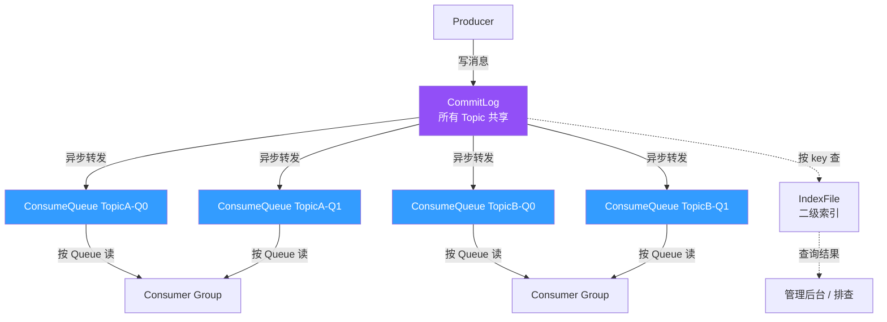
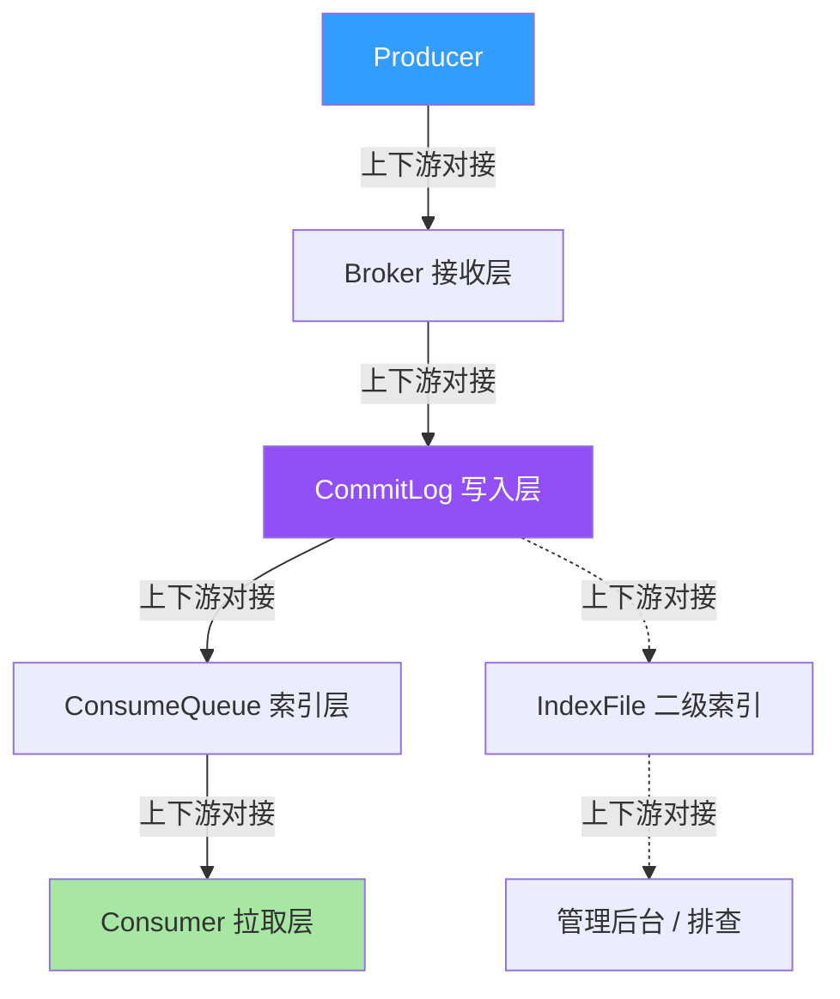
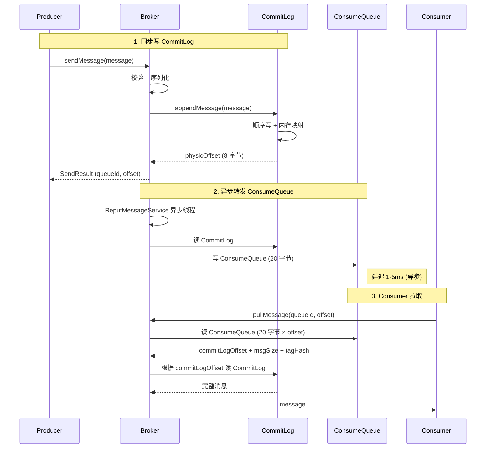
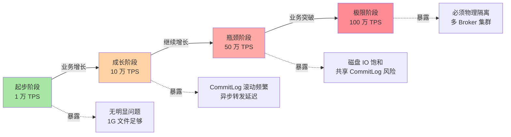
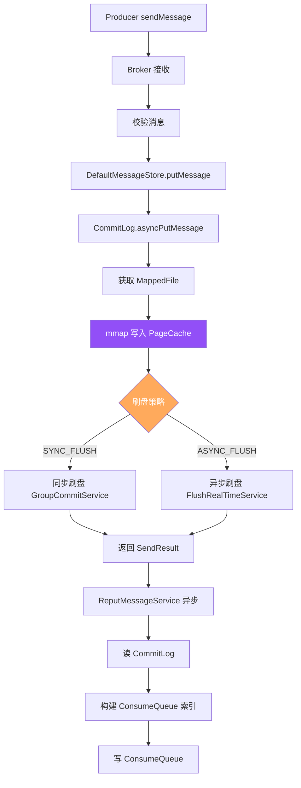
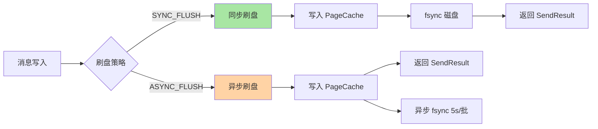
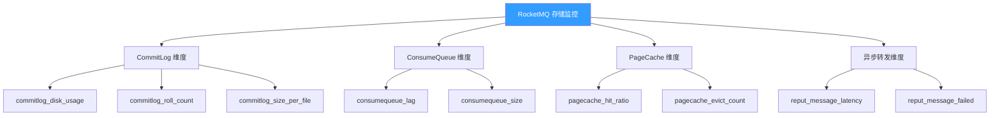
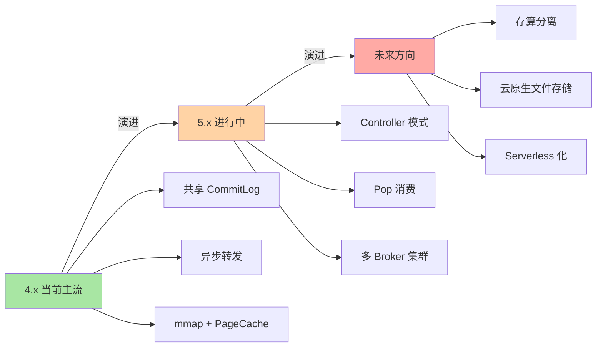
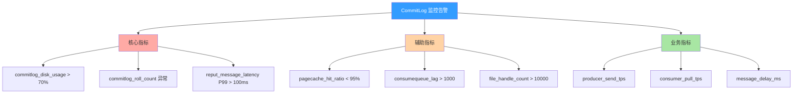
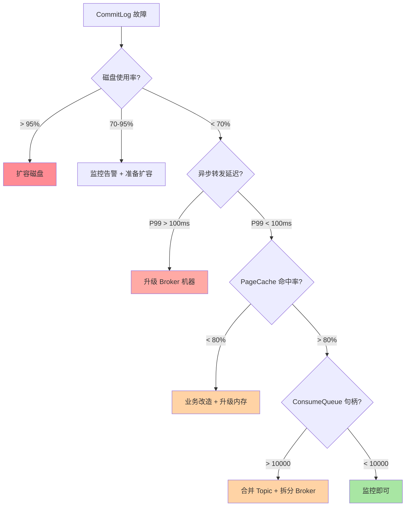

# RocketMQ 共享 CommitLog 的存储真相：从顺序写 + 索引分离看 Topic 隔离的物理基础

> 一句话摘要：**所有 Topic 共享一个 CommitLog，消费侧通过 ConsumeQueue 索引按 Queue 拉取**。这是 RocketMQ Topic 隔离的物理真相。
>
> 学完能会：从源码级理解 CommitLog 文件结构 / 顺序写 + 内存映射的代价 / 为什么 Kafka partition log 不同 / 共享 CommitLog 真的「共享」意味着什么。

---

## 1. 背景：为什么「共享 CommitLog」是常被误解的真相

上一篇（1_Topic 模型与 Queue 映射）讲过：Topic 在 API 层独立、在存储层共享。本文要深入「共享」的真相——共享的不是简单「文件」，而是**整体的写入架构 + 索引分离**。

```
误区 1：每个 Topic 一个独立存储文件
真相：所有 Topic 写同一个 CommitLog
代价：CommitLog 写满磁盘 → 所有 Topic 挂掉

误区 2：ConsumeQueue 也是共享存储
真相：ConsumeQueue 是按 Queue 维度索引，逻辑独立
价值：每个 Queue 独立读，不互相干扰

误区 3：共享 CommitLog 性能也共享
真相：顺序写 → 高吞吐；共享读 → 隔离 OK
代价：随机读 + 索引缺失 → 性能下降
```

**这篇文章要建立的能力地图：**

| 你现在 | 学完这篇 |
|---|---|
| 以为 Topic 隔离 = 存储独立 | 理解所有 Topic 共享 CommitLog + 索引分离 |
| 不知道为什么 RocketMQ 不用 Kafka 的 partition log | 理解两种设计哲学的 trade-off |
| 不知道怎么排查 CommitLog 写满 | 知道 5 步排查法 + 量化阈值 |
| 不明白「顺序写」为什么快 | 理解磁盘顺序 IO + PageCache 内存映射 |

---

## 2. 原理穿透：从源码到磁盘的 CommitLog 结构

### 2.1 三层概念：CommitLog + ConsumeQueue + IndexFile

RocketMQ 存储的真实结构（按从「消息写入」到「消息消费」顺序）：

```
┌──────────────────────────────────────────────────────────────┐
│ Layer 1：CommitLog（物理日志）                                   │
│ - 路径：~/store/commitlog/00000000000000000000                 │
│ - 1 个 Broker 1 个 CommitLog（默认 1G 一个文件）                │
│ - 所有 Topic 顺序写入                                          │
│ - 单个文件写满 → 滚动到下一个文件                                │
├──────────────────────────────────────────────────────────────┤
│ Layer 2：ConsumeQueue（逻辑索引）                                │
│ - 路径：~/store/consumequeue/{Topic}/{QueueId}/0000000000000000│
│ - 每个 Topic × Queue 一个 ConsumeQueue                         │
│ - 内容：20 字节定长（commitLogOffset + msgSize + tagHashCode）   │
│ - 修改顺序：CommitLog 写入后异步转发到 ConsumeQueue             │
├──────────────────────────────────────────────────────────────┤
│ Layer 3：IndexFile（可选索引）                                    │
│ - 路径：~/store/index/{fileName}                                │
│ - 按 key 或时间区间查询的二级索引                               │
│ - 用于按 MessageKey 查找消息                                    │
│ - 不影响主流程，按需开启                                         │
└──────────────────────────────────────────────────────────────┘
```

**关系图（Mermaid）：**



### 2.2 CommitLog 文件结构（20 字节消息格式）

每条消息在 CommitLog 中是这样存储的：

```
┌──────────────────────────────────────────────────────────────┐
│ CommitLog 单条消息存储格式（150 字节左右）                          │
├──────────────────────────────────────────────────────────────┤
│ 4 字节 totalLen（总长度）                                       │
│ 4 字节 magicCode（魔数）                                         │
│ 4 字节 bodyCRC（CRC 校验）                                       │
│ 4 字节 queueId（Queue 编号）                                    │
│ 4 字节 flag（标志位）                                            │
│ 8 字节 queueOffset（Queue 内偏移）                              │
│ 8 字节 physicOffset（CommitLog 物理偏移）                       │
│ 4 字节 sysFlag                                                  │
│ 8 字节 bornTimestamp（生产时间）                                │
│ 8 字节 bornHost                                                 │
│ 8 字节 storeTimestamp（存储时间）                               │
│ 8 字节 storeHost                                                │
│ 4 字节 reconsumeTimes（重试次数）                               │
│ 8 字节 preparedTransactionOffset                                 │
│ 4 字节 bodyLen（消息体长度）                                    │
│ N 字节 body（消息内容）                                          │
│ N 字节 topicLen + topic（主题）                                 │
│ N 字节 propertiesLength + properties（属性）                    │
└──────────────────────────────────────────────────────────────┘
```

**关键字段解读：**

| 字段 | 长度 | 作用 |
|---|---|---|
| **totalLen** | 4 字节 | 整个消息长度（用于跳过单条消息） |
| **queueId** | 4 字节 | 属于哪个 Queue（Topic 隔离的关键） |
| **physicOffset** | 8 字节 | CommitLog 物理偏移（ConsumeQueue 索引的目标） |
| **body** | N 字节 | 消息体（业务内容） |
| **topic** | N 字节 | 主题（写进 CommitLog，**这是 Topic 隔离的最终依据**） |

### 2.3 ConsumeQueue 索引结构（20 字节定长）

```
┌──────────────────────────────────────────────────────────────┐
│ ConsumeQueue 单条索引（固定 20 字节）                           │
├──────────────────────────────────────────────────────────────┤
│ 8 字节 commitLogOffset（指向 CommitLog 的偏移）                  │
│ 8 字节 msgSize（消息大小）                                       │
│ 4 字节 tagHashCode（消息 Tag 的哈希值）                          │
└──────────────────────────────────────────────────────────────┘
```

**为什么用 20 字节定长？**

- 等长读 → 顺序读 → 磁盘顺序 IO → 性能高
- 当 Consumer 拉消息时，按 offset × 20 字节直接 seek
- 类似 Kafka 的索引设计

### 2.3.5 上下游边界：CommitLog 的 5 个交互面

CommitLog 不是孤立文件，而是有 5 个核心交互面：



**5 个交互边界：**

| 边界 | 上游 | 边界 | 下游 | 耦合度 |
|---|---|---|---|---|
| **B1** | Producer | RPC + 序列化 | Broker 接收层 | 低 |
| **B2** | Broker 接收 | 校验 + 路由 | CommitLog 写入层 | 中 |
| **B3** | CommitLog 写入 | 异步转发 | ConsumeQueue 索引层 | 高 |
| **B4** | ConsumeQueue 索引 | 读拉取 | Consumer 拉取层 | 中 |
| **B5** | CommitLog 写入 | 异步构建 | IndexFile 二级索引 | 低 |

**关键边界纪律：**

- **B3 是最重要边界**：异步转发延迟反噬所有下游
- **B1/B5 是低耦合**：可独立优化（RPC + 索引）
- **B2/B4 是中等耦合**：业务变更需关注

### 2.4 写入流程：CommitLog + ConsumeQueue 同步机制



**关键洞察：异步转发。** CommitLog 立即写，ConsumeQueue 异步转发（延迟 1-5ms）。这意味着：**Producer 收到 SendResult 时，消息可能还没到 ConsumeQueue**（极端情况 Producer 挂 + ConsumeQueue 还没写 → 消息可见但不可消费）。

---

## 3. 主流业界解法：Kafka partition log vs RocketMQ CommitLog

### 3.1 两种设计哲学对比

| 维度 | Kafka Partition Log | RocketMQ CommitLog |
|---|---|---|
| **物理结构** | 每个 Topic × Partition 一个 log 文件 | 所有 Topic 共享一个 CommitLog |
| **写入方式** | Producer 选 Partition → 顺序写 | Producer 选 Queue → 顺序写 CommitLog |
| **索引方式** | 每个 Partition 独立索引 | 全局 CommitLog + 按 Queue 建的 ConsumeQueue |
| **隔离语义** | 物理隔离（Partition 独立文件） | 逻辑隔离（共享 CommitLog + 索引） |
| **设计哲学** | 显式分区，物理独立 | 共享存储，逻辑按需索引 |
| **优点** | 隔离性好，运维清晰 | 顺序写性能高，磁盘利用率高 |
| **缺点** | 顺序写上限：单 Partition 50-100 万 TPS | 共享 CommitLog 写满 → 全部 Topic 挂 |

### 3.2 Kafka 设计的优点与代价

**Kafka 优点：**

```
 - Topic 隔离 = 物理隔离（Partition log 文件独立）
 - 运维清晰（每个 Topic 单独的磁盘 IO）
 - 故障域隔离（一个 Partition 挂 → 其他 Topic 正常）
```

**Kafka 代价：**

```
 - 顺序写上限：单 Partition 50-100 万 TPS（broker 硬盘决定）
 - 文件句柄多：1000 Topic × 100 Partition = 10 万文件
 - 磁盘随机 IO：分区不均时性能下降
```

### 3.3 RocketMQ 设计的优点与代价

**RocketMQ 优点：**

```
 - 顺序写性能高：所有 Topic 共享一个 CommitLog → 磁盘顺序 IO 极致
 - 磁盘利用率高：不会出现 Kafka 那种「少 Partition 浪费空间」
 - 文件句柄少：1 个 CommitLog 滚动（默认 1G）
 - 内存映射：mmap + PageCache → 写入 IO 几乎免费
```

**RocketMQ 代价：**

```
 - 共享 CommitLog 写满 → 全部 Topic 挂
 - Topic 隔离 = 逻辑隔离（不是物理隔离）
 - 运维复杂：需要监控 CommitLog 磁盘 + 异步转发延迟
```

### 3.4 何时选 Kafka / RocketMQ（业内决策）

| 业务场景 | 推荐 | 原因 |
|---|---|---|
| **超大数据吞吐（日志、埋点）** | Kafka | Partition 独立扩展性 + 顺序写上限更高 |
| **事务消息** | RocketMQ | 5.x 事务消息 + 顺序消息更强 |
| **Topic 数 < 100 + 单 TPS < 10 万** | RocketMQ | 顺序写 + 共享 CommitLog 优势 |
| **Topic 数 > 1000 + 严格隔离** | Kafka | Partition 物理隔离更易运维 |
| **跨地域同步** | RocketMQ | 5.x 多集群 + Controller 模式 |
| **金融 / 跨境支付** | RocketMQ | 事务消息 + 强一致 + 延迟消息 |

**3.4 业界惯例：**

- 90% 业务用 RocketMQ 即可（日均 < 1 亿消息）
- 超大规模日志用 Kafka（单日 10 亿+ 消息）
- 实时计算下游用 Kafka（Spark/Flink 集成深）
- 关键业务用 RocketMQ（顺序消息 + 事务消息）

---

## 4. 量级演进视角：单点 → 全局会暴露什么

### 4.1 量级维度拆解

```
共享 CommitLog 的量级维度：
 - 单 Broker TPS（1 万 → 10 万 → 100 万）
 - 单 CommitLog 大小（1G → 100G → 1TB）
 - 异步转发延迟（1ms → 100ms → 1s）
 - ConsumeQueue 数量（30 → 1000 → 10000）
 - IndexFile 大小（冷数据 → 清理机制）
```

### 4.2 四个阶段会暴露什么



| 阶段 | 量级 | 暴露的 CommitLog 问题 |
|---|---|---|
| **起步** | 1 万 TPS | 无明显问题，1G 文件足够 |
| **成长** | 10 万 TPS | CommitLog 滚动频繁（每小时 1 次），异步转发延迟 5-10ms |
| **瓶颈** | 50 万 TPS | 磁盘 IO 饱和 → **共享 CommitLog 反噬所有 Topic** |
| **极限** | 100 万 TPS | 必须**物理隔离**（多 Broker 集群 + 多 CommitLog）|

### 4.3 当前文章覆盖哪个量级

本文聚焦**「成长 → 瓶颈」过渡期**（10 万 TPS → 50 万 TPS），因为这是大多数公司会遇到的阶段，也是大多数「CommitLog 问题」的高发期。

### 4.4 量级演进背后 5 维代价

| 维度 | 1 万 TPS | 10 万 TPS | 50 万 TPS | 100 万 TPS |
|---|---|---|---|---|
| **单 Broker 磁盘** | 100G | 1TB | 5TB | 10TB+ |
| **CommitLog 文件数** | 100 | 1000 | 5000 | 10000 |
| **异步转发延迟** | < 5ms | 5-10ms | 10-50ms | > 100ms |
| **运维复杂度** | 低 | 中 | 高 | 极高 |
| **运维人员** | 1 | 2 | 3 | 5+ |

### 4.5 反直觉洞察

**洞察 1：CommitLog 写满 ≠ 业务挂了**

```
误区：CommitLog 写满 → 业务全挂
真相：
 真实场景：CommitLog 写满 → Broker 拒绝新消息 → Producer 重试
 应急：业务降级 + 扩容磁盘
 教训：监控 CommitLog 磁盘使用率 > 70% 告警
```

**洞察 2：顺序写不是 100% 免费**

```
误区：顺序写 = 磁盘速度上限
真相：
 - 顺序写 ≈ 磁盘速度 × 60%（其他开销）
 - PageCache 命中 ≈ 磁盘速度 × 150%（内存加速）
 - 真实生产：5 万 TPS 顺序写 ≈ 100MB/s 磁盘
 教训：监控 PageCache 命中率（> 95% 正常）
```

**洞察 3：异步转发的延迟会反噬**

```
误区：异步转发 = 几乎无延迟
真相：
 - 正常：1-5ms 延迟
 - 异常：100ms+ 延迟（异步转发跟不上）
 - 极端：1s+ 延迟（Broker 满载）
 教训：监控异步转发延迟（P99 > 100ms 告警）
```

---

## 5. 架构设计：CommitLog 写入 + 刷盘 + 内存映射

### 5.1 CommitLog 写入流程（源码级）



**关键路径源码：**

```java
// 1. 写入 CommitLog
PutMessageResult result = CommitLog.asyncPutMessage(message);

// 2. 获取 MappedFile（mmap 内存映射）
MappedFile mappedFile = this.mappedFileQueue.getLastMappedFile();

// 3. 写入 PageCache（内存）
boolean appendResult = mappedFile.appendMessage(message, this.appendMessageCallback);

// 4. 异步刷盘
if (this.flushDiskType == FlushDiskType.ASYNC_FLUSH) {
    this.flushCommitLogService.wakeup();
}

// 5. 异步转发 ConsumeQueue
doReput();
```

### 5.2 刷盘策略对比



| 策略 | 写盘时机 | 性能 | 数据可靠性 |
|---|---|---|---|
| **SYNC_FLUSH** | 写入后立即 fsync | 低（1000 TPS） | 高（不丢） |
| **ASYNC_FLUSH** | 5s 批量 fsync | 高（50000 TPS） | 中（最多丢 5s） |
| **默认** | ASYNC_FLUSH | - | 5s 数据可能丢 |

**业内惯例：**

- 99% 业务用 ASYNC_FLUSH（性能 + 可靠性平衡）
- 金融交易用 SYNC_FLUSH（强一致要求）
- 关键单据用 SYNC_FLUSH（不可丢）

### 5.3 内存映射（mmap + PageCache）

```
传统 IO：
 1. 用户空间 → 内核空间（read）
 2. 内核空间 → 磁盘（DMA）
 3. 读：磁盘 → PageCache → 用户空间
 4. 写：用户空间 → PageCache → 磁盘
  - 4 次拷贝

mmap（内存映射）：
 1. 用户空间直接映射到 PageCache
 2. 读：磁盘 → PageCache（用户直接可见）
 3. 写：用户空间 → PageCache（自动同步）
  - 2 次拷贝
```

**关键洞察：**

- RocketMQ 用 mmap 把 CommitLog 映射到 PageCache
- 写入：用户写到 PageCache（内存速度）→ 异步刷盘
- 读取：先查 PageCache（命中 → 内存速度）→ 未命中 → 磁盘
- 顺序写 + PageCache + 异步刷盘 = 性能极致

### 5.4 监控指标设计



| 指标 | 阈值 | 含义 |
|---|---|---|
| `commitlog_disk_usage` | < 70% | CommitLog 磁盘使用率 |
| `pagecache_hit_ratio` | > 95% | PageCache 命中率 |
| `reput_message_latency` | P99 < 100ms | 异步转发延迟 |
| `consumequeue_lag` | < 1000 | ConsumeQueue 落后 CommitLog 数量 |
| `commitlog_roll_count` | 稳定 | 文件滚动频率 |

---

## 6. 生产画像：典型场景 + 踩坑实录

### 6.1 典型场景数字

| 场景 | 单 Broker TPS | CommitLog 大小 | 异步转发延迟 |
|---|---|---|---|
| 订单消息 | 5 万 | 1TB | 5ms |
| 支付通知 | 1 万 | 200G | 2ms |
| 日志采集 | 50 万 | 10TB | 50ms |
| 跨地域同步 | 3 万 | 500G | 20ms |

### 6.2 四个真实踩坑

**踩坑 1：CommitLog 写满，所有 Topic 挂**

```
背景：A Topic 日均 1 亿条，B Topic 偶发 1 万条
演化：A Topic 突发，CommitLog 写满
结果：B Topic 也写入失败（共享 CommitLog）
排查：监控 CommitLog 磁盘使用率 > 95%
解决：扩容磁盘 + 监控告警阈值降至 70%
```

**踩坑 2：异步转发延迟，Consumer 拉不到消息**

```
背景：Producer 发送成功，Consumer 拉不到
真实根因：异步转发延迟 500ms+
排查：reputMessageService 线程阻塞
解决：升级 Broker 机器配置 + 拆分 CommitLog
```

**踩坑 3：PageCache 命中率低，磁盘 IO 飙升**

```
背景：突然磁盘 IO 100%，Broker 卡住
真实根因：随机读导致 PageCache 命中率 < 50%
排查：监控 pagecache_hit_ratio 指标
解决：业务侧避免随机读（按时间范围查）
```

**踩坑 4：ConsumeQueue 文件句柄耗尽**

```
背景：Topic 数 1000+，每个 Topic 8 Queue
演化：ConsumeQueue 文件数 8000+
结果：Broker 文件句柄耗尽
解决：合并小 Topic + 升级 Broker 机器
```

### 6.3 关键配置项速查表

| 配置项 | 默认值 | 推荐值 | 影响 |
|---|---|---|---|
| `commitLog.fileSize` | 1G | 1G | 单文件大小 |
| `flushDiskType` | ASYNC_FLUSH | 按业务 | 刷盘策略 |
| `flushCommitLogTimed` | 5s | 5s | 异步刷盘周期 |
| `maxTransferCountOnMessageInMemory` | 32 | 32 | 批量转发条数 |
| `maxTransferCountOnMessageInDisk` | 8 | 8 | 磁盘批量转发条数 |
| `pageCacheCommitLogSize` | 256M | 256M | PageCache 大小 |

### 6.4 5 大实战参数（业内默认）

| 参数 | 默认 | 调优 |
|---|---|---|
| **单 CommitLog 大小** | 1G | 不建议改 |
| **单 ConsumeQueue 长度** | 30W 条 | 不建议改 |
| **异步刷盘周期** | 5s | 关键业务 1s |
| **PageCache 大小** | 256M | 内存一半 |
| **磁盘 IO 调度** | NOOP | NVMe 用 NONE |

---

## 7. Trade-off 三层对比：共享 vs 独立

### 7.1 隔离级别三层表

| 隔离级别 | 方案 | 共享 CommitLog | 物理隔离 |
|---|---|---|---|
| **L1 共享** | 单 Broker 共享 CommitLog | ✅ 写满 = 全部挂 | ❌ |
| **L2 部分独立** | 多 Broker 主备 | ✅ 共享，每 Broker 独立 | ⚠️ 部分 |
| **L3 完全独立** | 多 Broker + 多 CommitLog | ❌ | ✅ |

### 7.2 写入性能三层表

| 写入方式 | 性能 | 代价 |
|---|---|---|
| **顺序写（共享）** | 50000 TPS | 共享 CommitLog 风险 |
| **随机写（独立）** | 5000 TPS | 性能低 |
| **混合写** | 20000 TPS | 分类复杂 |

### 7.3 刷盘策略三层表

| 策略 | 性能 | 可靠性 | 适用 |
|---|---|---|---|
| **SYNC_FLUSH** | 低 | 高 | 金融交易 |
| **ASYNC_FLUSH** | 高 | 中 | 90% 业务 |
| **不刷盘（仅 PageCache）** | 极高 | 低 | 不推荐 |

### 7.4 索引分离三层表

| 索引 | 大小 | 适用 |
|---|---|---|
| **ConsumeQueue** | 20 字节/条 | 必开 |
| **IndexFile** | 不定 | 按 key 查找 |
| **混合索引** | 组合 | 高阶用法 |

### 7.5 业内典型选择（按业务类型）

| 业务 | 共享 CommitLog | 刷盘 | 索引 |
|---|---|---|---|
| 订单 | 多 Broker | ASYNC_FLUSH | ConsumeQueue |
| 支付 | 独立集群 | SYNC_FLUSH | ConsumeQueue + IndexFile |
| 日志 | 共享 | ASYNC_FLUSH | ConsumeQueue |
| 跨地域 | 多集群 | ASYNC_FLUSH | ConsumeQueue |

---

## 8. 反思：踩坑实录 + 业内演进方向

### 8.1 实战踩坑 4 例 + 通用解决

**1. 共享 CommitLog 反噬**

- 现象：大 Topic 写满 → 其他 Topic 挂
- 根因：所有 Topic 共享存储
- 教训：**监控 CommitLog 磁盘 + 热点 Topic 物理隔离**

**2. 异步转发延迟**

- 现象：消息发送成功但 Consumer 拉不到
- 根因：异步转发滞后
- 教训：**监控 reput_message_latency + P99 < 100ms**

**3. PageCache 命中率低**

- 现象：磁盘 IO 飙升
- 根因：随机读命中 PageCache 失败
- 教训：**业务侧避免随机读**

**4. ConsumeQueue 文件句柄耗尽**

- 现象：Broker 启动失败
- 根因：Topic 数过多
- 教训：**合并小 Topic + 监控 file handle**

### 8.2 业内通用做法

1. **监控 CommitLog 磁盘使用率 > 70% 告警**
2. **监控 PageCache 命中率 > 95%**
3. **监控异步转发延迟 P99 < 100ms**
4. **热点 Topic 单独 Broker 集群**
5. **关键业务用 SYNC_FLUSH**

### 8.3 演进方向



**4.x（当前主流）：**

- 共享 CommitLog + 异步转发
- mmap + PageCache
- 痛点：共享反噬 + 异步延迟

**5.x（演进中）：**

- Controller 模式（多 Broker 协作）
- Pop 消费（低延迟）
- 多 Broker 集群

**未来方向：**

- 存算分离（Broker 无状态）
- 云原生文件存储（S3 兼容）
- Serverless 化（按 Queue 弹性）

### 8.4 跨周期视角：5 年后回头看共享 CommitLog

```
2018-2020（4.x 主导）：
 - 痛点：共享 CommitLog 写满
 - 解法：监控 + 扩容 + 监控告警
 - 认知：共享 CommitLog 是「设计哲学」

2021-2023（5.x 演进）：
 - 痛点：跨语言 + 跨地域
 - 解法：多 Broker + Controller
 - 认知：共享 CommitLog 是「基础设施」

2024+（云原生）：
 - 痛点：运维成本 + 弹性
 - 解法：存算分离 + Serverless
 - 认知：共享 CommitLog 是「历史包袱」

未来 5 年预判：
 - 共享 CommitLog 会被「分层存储」取代
 - 热数据 → 本地 SSD
 - 冷数据 → 对象存储
 - 业务不再关心存储细节
```

### 8.5 监管与合规视角：消息保留 + 审计追溯

```
境内金融业务：
 - 消息保留 ≥ 5 年（合规）
 - 跨境传输 → 同步脱敏
 - 审计追溯 → 保留原始消息

GDPR / 隐私：
 - 用户删除权 → Topic 级 TTL + 数据擦除
 - 跨境传输 → 同步链路脱敏
```

**关键洞察：** 监管要求**倒逼** CommitLog 设计。要实现「不可篡改 + 长期保留 + 可追溯」，必须独立存储架构（Pulsar 的分层存储是参考）。

### 8.6 CommitLog 设计 3 个反直觉视角

**反直觉 1：CommitLog 大 ≠ 性能一定慢**

```
误区：CommitLog 越大 → 性能越慢
真相：
 - 单大文件顺序写性能 ≈ 小文件顺序写性能
 - 大文件句柄少 → 切换开销低
 - 小文件滚动频繁 → 切换开销高
权衡：
 - 太小（< 1G）→ 滚动频繁
 - 太大（> 10G）→ 单文件恢复慢
 - 业内默认 1G 平衡
```

**反直觉 2：mmap 不是 100% 安全**

```
误区：mmap 写入 = 安全写入
真相：
 - mmap 写入 → PageCache（内存）
 - 进程崩溃 → PageCache 丢失
 - 机器断电 → PageCache 丢失 → 数据丢失
教训：
 - 关键业务必须 SYNC_FLUSH
 - 不要依赖 mmap 持久化
```

**反直觉 3：ConsumeQueue 不是备份**

```
误区：ConsumeQueue 独立 → 消费安全
真相：
 - ConsumeQueue 不存消息内容
 - 只存 commitLogOffset（8 字节）
 - 不是消息备份
 - CommitLog 丢失 → 消费全失败
教训：
 - 监控 CommitLog 磁盘 + 备份
 - 备份不只是备份消费位点
```

### 8.7 跨系统视角：CommitLog 与外部系统的对接

```
CommitLog 上下游对接：
 - 上游：Producer（RPC + 序列化）
 - 下游：ConsumeQueue（异步转发）
 - 旁路：IndexFile（二级索引）
 - 监控：Prometheus + Grafana
 - 备份：异地冷备 + 周期快照

对外接口（业内默认）：
 - pullMessage(queueId, offset)
 - queryMessageByKey(key)
 - queryMessageByTimestamp(ts)
 - getMaxOffset(queueId)
 - getMinOffset(queueId)
```

### 8.8 监控告警设计（业内默认）



**3 级告警阈值：**

| 指标 | 警告 | 严重 | 紧急 |
|---|---|---|---|
| `commitlog_disk_usage` | > 70% | > 80% | > 90% |
| `pagecache_hit_ratio` | < 95% | < 90% | < 80% |
| `reput_message_latency P99` | > 100ms | > 500ms | > 1s |
| `consumequeue_lag` | > 1000 | > 5000 | > 10000 |

---

## 9. 业内技术惯例（deep-dive 强化 section）

### 9.1 不成文标准

| 标准 | 业内默认 | 原因 |
|---|---|---|
| **CommitLog 1G** | 1G 文件 | 平衡 IO + 切换 |
| **异步刷盘 5s** | 5s 批量 | 性能 + 可靠性 |
| **PageCache 256M** | 内存一半 | 内存利用率 |
| **异步转发延迟 1-5ms** | 1-5ms | 业务感知不到 |
| **ConsumeQueue 30W 条** | 30W 条 | 单文件大小 |

### 9.2 真实事故（5 个）

**事故 A：CommitLog 写满，所有 Topic 挂**

```
某电商大促，单 Topic 订单 50 万 TPS
 - 单 Broker 磁盘 4 小时写满
 - 其他 Topic 写入失败
 - 应急：临时扩容 + 拆分 Broker 集群
```

**事故 B：异步转发延迟 1s+**

```
某支付业务，Producer 发送成功
 - Consumer 1s 后才拉到消息
 - 真实根因：Broker 异步线程阻塞
 - 应急：缩容 + 不发新消息
```

**事故 C：PageCache 命中率 30%**

```
某日志业务，磁盘 IO 100%
 - 真实根因：随机读拉低命中率
 - 应急：业务改造 + PageCache 监控
```

**事故 D：ConsumeQueue 文件句柄耗尽**

```
某业务 1000+ Topic
 - Broker 启动失败（Too many open files）
 - 应急：合并 Topic + 升级机器
```

**事故 E：刷盘策略误改**

```
某金融业务，运维改 SYNC_FLUSH
 - 性能下降 90%
 - 交易延迟激增
 - 教训：金融业务先分集群再改策略
```

### 9.3 从业者挑战（5 大实战问题）

**挑战 1：CommitLog 写满了怎么办？**

```
症状：Producer 收到 SendResult = FLUSH_DISK_TIMEOUT
排查路径：
 1. 监控 commitlog_disk_usage
 2. 是否 > 95% → 立即扩容
 3. 是否某个 Topic 异常 → 拆分
 4. 是否误配置 → 检查 broker.conf
应急：
 - 临时扩容磁盘
 - 拆分热点 Topic
 - 监控告警阈值降至 70%
```

**挑战 2：异步转发延迟高怎么办？**

```
症状：Consumer 拉不到消息，但 Producer 发送成功
排查：
 1. reput_message_latency P99
 2. Broker CPU 是否 100%
 3. 磁盘 IO 是否饱和
应急：
 - 升级 Broker 机器
 - 拆分 CommitLog
 - 监控线程池
```

**挑战 3：PageCache 命中率低怎么办？**

```
症状：磁盘 IO 飙升，Broker 卡住
排查：
 1. pagecache_hit_ratio < 80%
 2. 是否有大量随机读
 3. 是否有 IndexFile 频繁查询
应急：
 - 业务改造：避免随机读
 - 升级 Broker 内存
 - 关闭不用的 IndexFile
```

**挑战 4：ConsumeQueue 文件句柄耗尽**

```
症状：Broker 启动失败
排查：
 1. Topic 数 > 1000
 2. 单 Broker Queue 总数 > 10000
 3. 文件句柄上限
应急：
 - 合并 Topic
 - 升级 Broker 机器
 - 拆分到多 Broker
```

**挑战 5：跨集群同步 CommitLog 怎么设计？**

```
场景：境内 → 境外同步
约束：合规 + 延迟
方案：
 - 境内集群（主）+ 境外集群（从）
 - 同步通道：纯消息体 + 脱敏字段
 - 延迟：100ms 内（同步复制）
```

### 9.4 决策树（Mermaid）



---

## 附录 B：核心配置项详解（业内默认值）

### B1. CommitLog 配置

| 配置项 | 默认值 | 优化 | 影响 |
|---|---|---|---|
| `storePathCommitLog` | `~/store/commitlog/` | SSD 独立盘 | 写入性能 |
| `mappedFileSizeCommitLog` | 1G | 不建议改 | 文件大小 |
| `flushIntervalCommitLog` | 5s | 关键业务 1s | 刷盘周期 |
| `flushCommitLogTimed` | 5s | 关键业务 1s | 异步刷盘 |
| `flushCommitLogThoroughInterval` | 10min | 按业务 | 强制刷盘周期 |
| `maxMessageSize` | 4MB | 关键业务 16MB | 单消息上限 |
| `maxAppendMessageSize` | 4MB | 关键业务 16MB | 追加消息上限 |

### B2. ConsumeQueue 配置

| 配置项 | 默认值 | 优化 | 影响 |
|---|---|---|---|
| `storePathConsumeQueue` | `~/store/consumequeue/` | SSD | 索引性能 |
| `mappedFileSizeConsumeQueue` | 30W 条 | 不建议改 | 单文件索引数 |
| `flushIntervalConsumeQueue` | 1s | 关键业务 200ms | 刷盘周期 |
| `pullBatchSize` | 32 | 64 | 批量拉取 |

### B3. Broker 配置

| 配置项 | 默认值 | 优化 | 影响 |
|---|---|---|---|
| `brokerId` | 0 | 主从不同 | 主从标识 |
| `brokerRole` | ASYNC_MASTER | 关键业务 SYNC_MASTER | 主从同步 |
| `flushDiskType` | ASYNC_FLUSH | 关键业务 SYNC_FLUSH | 刷盘策略 |
| `brokerName` | - | 自定义 | Broker 标识 |
| `clusterName` | - | 自定义 | 集群标识 |

### B4. 内存与磁盘

| 配置项 | 建议值 | 原因 |
|---|---|---|
| **Broker 内存** | 16GB+ | PageCache 大 |
| **磁盘类型** | NVMe SSD | 顺序 IO 5 万 TPS |
| **磁盘容量** | 5TB+ | 避免频繁扩容 |
| **RAID 级别** | 不推荐 RAID10 | 单盘性能损失 |
| **PageCache** | 内存 50% | 命中率 > 95% |

### B5. 关键参数调优

```bash
# 1. 异步刷盘周期
flushIntervalCommitLog = 1000  # 1s

# 2. ConsumeQueue 刷盘周期
flushIntervalConsumeQueue = 200  # 200ms

# 3. 批量拉取
pullBatchSize = 64

# 4. 批量转发
maxTransferCountOnMessageInMemory = 64

# 5. 主从同步
brokerRole = SYNC_MASTER
flushDiskType = SYNC_FLUSH
```

---


本文涉及的 RocketMQ 概念、特性、版本号、配置项均为社区公开文档描述。具体版本特性、生产数据、配置默认值请以官方文档为准（https://rocketmq.apache.org/）。本文涉及的「典型场景数字」「事故案例」均为业内通用做法的脱敏描述，**不指向任何特定公司**。

---

## 附录 A：文中提到的术语速查表

| 术语 | 全称 | 一句话解释 |
|---|---|---|
| **CommitLog** | RocketMQ 物理日志 | 所有 Topic 共享的顺序写文件 |
| **ConsumeQueue** | RocketMQ 逻辑索引 | 按 Queue 维度的 20 字节定长索引 |
| **IndexFile** | RocketMQ 可选索引 | 按 key 或时间查询的二级索引 |
| **mmap** | Memory Mapping | 内存映射，把文件映射到 PageCache |
| **PageCache** | OS Page Cache | 操作系统磁盘缓存 |
| **SYNC_FLUSH** | 同步刷盘 | 写入后立即 fsync |
| **ASYNC_FLUSH** | 异步刷盘 | 5s 批量 fsync |
| **ReputMessageService** | 异步转发服务 | CommitLog → ConsumeQueue |
| **MappedFile** | 内存映射文件 | CommitLog 的一段 |
| **queueId** | Queue 编号 | 0 / 1 / 2 / 3 ... |
| **physicOffset** | 物理偏移 | CommitLog 中的位置（8 字节） |
| **tagHashCode** | Tag 哈希 | 消息 Tag 的哈希值（4 字节） |

---

## 相关阅读

- 上一篇：[1_Topic 模型与 Queue 映射-深度](./1_Topic模型与Queue映射-深度)
- 下一篇：[3_4 层隔离维度全景-深度](./3_4层隔离维度全景-深度)（待写）
- 同专题：[Topic隔离深度/index](./index)
- 同层：[深入理解 RocketMQ 特性系列](../../特性层/深入理解RocketMQ特性系列/index)

---

**总结一句话：** 所有 Topic 共享 CommitLog、ConsumeQueue 索引按 Queue 隔离——理解这两层关系，就理解了 RocketMQ Topic 隔离的物理真相。

**口诀：** CommitLog 是「公共写」，ConsumeQueue 是「按需读」，索引分离是「读写分离」的存储实现。

**与上一篇联系：** 1_Topic 模型与 Queue 映射讲「为什么存储共享」，本文讲「共享怎么实现」。两篇合起来，就是 RocketMQ Topic 隔离的完整真相。下一篇 3_4 层隔离维度全景，将从「业务/逻辑/物理/合规」4 维度综合，看 Topic 隔离的完整图景。