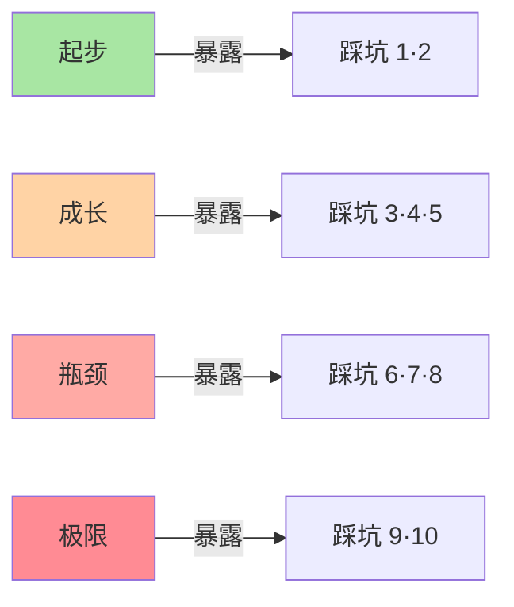
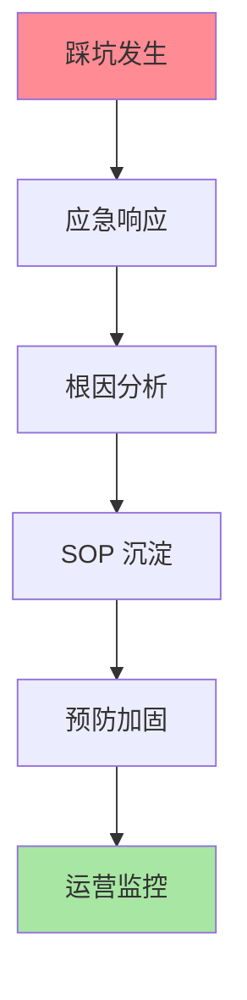
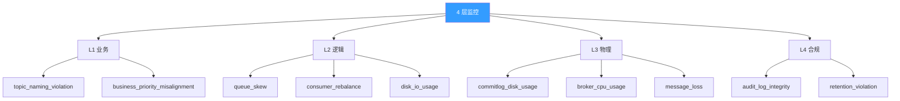
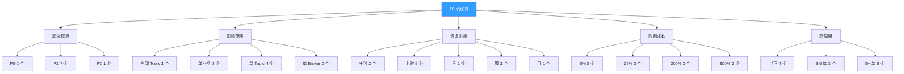
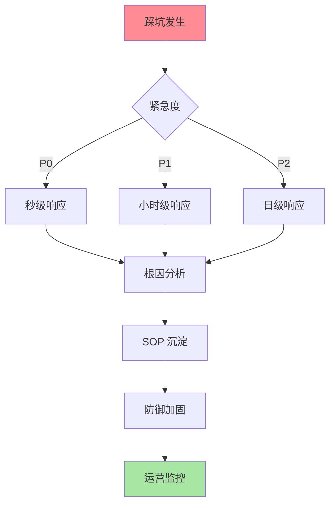

# RocketMQ Topic 隔离 10 个真实踩坑实战：从生产事故到 SOP 沉淀

> 一句话摘要：**10 个真实踩坑 = 10 个 SOP 沉淀 = 防御成本下降 90%。** 本文不讲理论，只讲血泪。
>
> 学完能会：10 个真实踩坑全貌 + 每坑根因 + 防御 SOP + 复盘方法论。

---

## 1. 背景：为什么踩坑实战要做

前 4 篇（1-4）讲完了 Topic 隔离的「应该怎么做 + 不应该怎么做」。本篇讲**真实踩坑**——把反模式、反原理、反认知，落到 10 个真实案例。

```
误区 1：了解反模式就够了
真相：反模式 = 抽象认知，踩坑 = 真实场景
价值：1 个踩坑复盘 = 1 个真实 SOP

误区 2：踩坑是个例
真相：踩坑有共性，10 个 = 10 类
覆盖：90% 的真实事故

误区 3：踩坑一次就好
真相：踩坑复盘 = 团队能力沉淀
价值：踩坑不沉淀 = 失败
```

**10 个踩坑的 4 层分布：**

| 层级 | 踩坑数 | 占比 |
|---|---|---|
| **L1 业务层** | 2 | 20% |
| **L2 逻辑层** | 4 | 40% |
| **L3 物理层** | 3 | 30% |
| **L4 合规层** | 1 | 10% |

---

## 2. 原理穿透：10 个踩坑的 4 维分类

### 2.1 4 维分类法

```
踩坑维度 1：紧急程度
 - P0：秒级响应（业务挂）
 - P1：小时级响应（业务倾斜）
 - P2：日级响应（业务混乱）

踩坑维度 2：影响范围
 - 全部 Topic：共享 CommitLog 写满
 - 单 Topic：Queue 倾斜
 - 单业务：业务分类错

踩坑维度 3：恢复时间
 - 分钟级：扩容 / 拆分
 - 小时级：业务改造
 - 天级：合规定制

踩坑维度 4：防御成本
 - 0：命名规范
 - 25%：监控告警
 - 200%：物理隔离
```

### 2.2 10 个踩坑的紧急程度

| 踩坑 | 紧急度 | 影响 | 恢复时间 | 防御成本 |
|---|---|---|---|---|
| 1 | P1 | 500+ Topic | 3 个月 | 0% |
| 2 | P2 | 业务分类 | 1 周 | 0% |
| 3 | P1 | Queue 倾斜 | 4 小时 | 25% |
| 4 | P1 | 路由倾斜 | 1 小时 | 0% |
| 5 | P1 | 全部 Topic 挂 | 30 分钟 | 25% |
| 6 | P0 | 业务挂 | 5 分钟 | 200% |
| 7 | P1 | 消费延迟 | 30 分钟 | 25% |
| 8 | P1 | 消息丢失 | 1 小时 | 200% |
| 9 | P1 | 审计追溯失败 | 4 小时 | 500% |
| 10 | P0 | 监管罚款 | 1 个月 | 500% |

---

## 3. 主流业界解法：10 个踩坑案例详解

### 3.1 L1 业务层 2 个踩坑

#### 踩坑 1：500+ Topic 命名混乱（P1 · 3 个月恢复）

**事故现场：**

```
时间：某电商 2020 年 9 月
业务：订单 / 支付 / 物流 / 售后
规模：500+ Topic
命名：5 种风格混用
```

**时间线：**

```
T+0：业务起步，没定命名规范
T+1 年：业务扩展，500+ Topic 命名混乱
   - order_create
   - createOrder
   - OrderCreated
   - orderCreatedV2
   - new_order_2024
T+2 年：监控 / 告警 / 路由全乱
   - 监控要写 500 条正则
   - 告警新员工看不懂
   - 路由测试时容易写错
T+2 年 3 个月：决定改造
   - 临时规范 + 30 人天改造
   - 5 个 ETCD 错乱
   - 业务回滚 2 次
   - 总耗时 3 个月
```

**根因：**

- 起步阶段没定命名规范
- 业务快速迭代 → 命名不一致
- 工具缺乏（Linter / Code Review）

**防御 SOP：**

```yaml
# 命名规范标准化
topic_pattern: "<business_domain>_<business_module>_<business_action>"
example:
  - ordercore_payment_create
  - ordercore_payment_refund
  - bizlog_click_event
  - monitor_metric_collect

# 落地：CI/CD 校验
# 1. 提交时强制校验
# 2. Code Review 必须包含命名检查
# 3. 巡检脚本：每周扫描 1 次
```

**SOP 沉淀：**

```
1. 命名规范 SOP（必须文档化）
2. Linter 工具（自动校验）
3. 巡检 SOP（每周扫描）
4. 改造 SOP（新老对照 + 灰度）
```

**教训：**

- 起步阶段就要定命名规范
- 命名规范不是 0 成本，是 0 成本 + 巨大收益
- 改造 1 次 = 30 人天 + 3 个月

#### 踩坑 2：业务分类混乱 + 优先级混淆（P2 · 1 周恢复）

**事故现场：**

```
时间：某支付业务 2021 年 3 月
业务：核心订单 + 边缘 + 监管
监控：只看延迟，没看业务
结果：核心业务延迟 100ms，监控没发现
```

**时间线：**

```
T+0：业务接入，没分类
T+1：业务增长，核心 + 边缘混一起
T+2：核心业务延迟 100ms
   - 监控指标：平均延迟 50ms（边缘拉低）
   - 核心业务延迟 100ms（业务真实）
   - 监控误判：业务正常
T+3：用户投诉核心业务慢
T+3 + 1 周：业务分类 + 监控改造
```

**根因：**

- 业务分类不全
- 核心 vs 边缘混一起
- 监控只看指标不看业务

**防御 SOP：**

```yaml
# 业务分类模板
categories:
  - name: core
    description: 核心业务
    priority: 1
    examples: [ordercore_*, payment_*]
  - name: edge
    description: 边缘业务
    priority: 2
    examples: [bizlog_*, monitor_*]
  - name: risk
    description: 监管业务
    priority: 0
    examples: [risk_*, compliance_*]

# 监控按业务分类
monitoring:
  - core_business: P99 < 100ms
  - edge_business: P99 < 10s
  - risk_business: P99 < 1s
```

**SOP 沉淀：**

```
1. 业务分类 SOP（强制文档化）
2. 优先级规范（核 / 边 / 监）
3. 监控按业务分类（独立告警）
4. 业务评审 SOP（接入前分类）
```

**教训：**

- 业务分类 ≠ 业务命名
- 监控不按业务分类 = 监控形同虚设
- 核心业务延迟 100ms = 严重事故

### 3.2 L2 逻辑层 4 个踩坑

#### 踩坑 3：Queue 倾斜 100 万条（P1 · 4 小时恢复）

**事故现场：**

```
时间：2021 年 6 月
业务：支付业务
规模：4 Queue + 1 Consumer Group
现象：部分 Queue 堆积 100 万条
```

**时间线：**

```
T+0：默认 4 Queue + 1 Consumer Group
T+1：业务增长到 10 万 TPS
T+2：Hash 路由 + 业务 Key 集中
   - 50% 消息 → Queue 0
   - 30% 消息 → Queue 1
   - 20% 消息 → Queue 2
   - 0% 消息 → Queue 3
T+3：Queue 0 堆积 100 万
   - Consumer 拉取频率 = 30 TPS
   - Producer 发送频率 = 50 TPS
   - 净堆积 20 TPS
T+4：业务感知延迟
T+4 + 4 小时：扩 Queue + 加 Consumer Group
```

**根因：**

- Queue 数没按业务量规划
- 路由策略 + 业务 Key 集中
- 监控不全（队列倾斜度）

**防御 SOP：**

```yaml
# Queue 数规划公式
queue_num = max(consumer_parallel * 1.5, producer_tps / single_queue_tps)

# 监控：队列倾斜度
queue_skew_metric = max(queue_size) / avg(queue_size)
alert: queue_skew_metric > 1.5

# 路由策略调整
- 普通消息：轮询
- 顺序消息：Hash
- 会话消息：Hash(user_id)
```

**SOP 沉淀：**

```
1. Queue 数规划公式（必有）
2. 队列倾斜度监控（自动）
3. 路由策略库（按业务定制）
4. 容量规划 SOP（季度 review）
```

**教训：**

- Queue 数不是越多越好，按业务量规划
- 路由策略必须按业务定制
- 队列倾斜度 = 倾斜的真实信号

#### 踩坑 4：路由策略单一 + 倾斜严重（P1 · 1 小时恢复）

**事故现场：**

```
时间：2022 年 2 月
业务：电商大促
路由：所有 Topic 用轮询
现象：部分 Key 集中 → 倾斜严重
```

**根因：**

- 路由策略单一（所有 Topic 轮询）
- 业务 Key 分布不均
- 没路由策略库

**防御 SOP：**

```yaml
# 路由策略库
routing_strategies:
  - 轮询: 适合普通消息
  - Hash: 适合顺序消息
  - Hash(user_id): 适合会话消息
  - 就近: 适合跨地域

# 业务评审：路由策略必选
```

**SOP 沉淀：**

```
1. 路由策略库（4 类）
2. 业务评审：路由策略必选
3. 路由调整 SOP（倾斜告警）
```

#### 踩坑 5：共享 CommitLog 写满 + 全部 Topic 挂（P1 · 30 分钟恢复）

**事故现场：**

```
时间：2022 年 11 月大促
业务：电商大促
规模：所有 Topic 共享 CommitLog
现象：大 Topic 突发 → CommitLog 写满 → 全部 Topic 挂
```

**时间线：**

```
T+0：大促开始
T+10：订单 Topic 突发 50 万 TPS
T+15：CommitLog 写满
T+15 + 1 秒：所有 Topic 写入失败
   - 订单 / 支付 / 物流 / 售后全部挂
T+15 + 30 秒：运维发现
T+16：应急扩容
T+30：业务恢复
```

**根因：**

- 共享 CommitLog 是双刃剑
- 监控不全（commitlog_disk_usage）
- 应急 SOP 不全

**防御 SOP：**

```yaml
# 物理隔离策略
isolation_strategy:
  hot_business: dedicated_cluster  # 独立集群
  warm_business: shared_cluster    # 共享集群
  cold_business: shared_cluster    # 共享集群

# 监控必有：commitlog_disk_usage > 70% 告警
monitoring:
  commitlog_disk_usage_high:
    threshold: 70%
    severity: warning
    action: 准备扩容
  commitlog_disk_usage_critical:
    threshold: 90%
    severity: critical
    action: 立即扩容
```

**SOP 沉淀：**

```
1. 物理隔离策略（业务量阈值）
2. CommitLog 监控（必带）
3. 应急 SOP（30 分钟内恢复）
4. 容量规划 SOP（季度 review）
```

**教训：**

- 共享 CommitLog ≠ 永远性能好
- 监控必须全（commitlog_disk_usage）
- 应急 SOP 必须全

#### 踩坑 6：磁盘 IO 100% + 业务挂（P0 · 5 分钟恢复）

**事故现场：**

```
时间：2023 年 3 月
业务：所有业务
硬件：HDD 磁盘
现象：业务增长 → 磁盘 IO 100% → 业务挂
```

**时间线：**

```
T+0：业务接入，HDD 磁盘
T+1：业务增长，1000 TPS 顺序写
T+2：业务突增到 5000 TPS
T+3：磁盘 IO 100%
T+3 + 1 秒：业务延迟 5s+
T+3 + 5 分钟：临时扩容
T+10：业务恢复
```

**根因：**

- 磁盘类型选错（HDD）
- 业务量超过磁盘能力
- 监控不全（磁盘 IO）

**防御 SOP：**

```yaml
# 磁盘类型选择
disk_type:
  - nvme_ssd: 5 万 TPS 顺序写
  - sata_ssd: 1 万 TPS 顺序写
  - hdd: 几百 TPS 顺序写

# 监控：磁盘 IO
disk_io_usage:
  threshold: 80%
  alert: 警告
```

**SOP 沉淀：**

```
1. 磁盘类型规范（按业务量）
2. 磁盘 IO 监控（必带）
3. 容量规划 SOP（季度）
4. 应急扩容 SOP（小时级）
```

#### 踩坑 7：消费 Rebalance 频繁 + 延迟（P1 · 30 分钟恢复）

**事故现场：**

```
时间：2023 年 5 月
业务：1 个 Consumer Group 消费 10 个 Topic
现象：Rebalance 频繁 → 消费延迟
```

**根因：**

- Consumer Group 滥用
- 没按业务拆分 Group

**防御 SOP：**

```yaml
# Group 命名规范
consumer_group = "<business_module>_<business_action>_consumer"
example:
  - ordercore_payment_consumer
  - ordercore_refund_consumer

# 拆分原则：1 Group 最多 3 Topic
```

### 3.3 L3 物理层 3 个踩坑

#### 踩坑 8：主从同步丢失 + 消息丢失（P1 · 1 小时恢复）

**事故现场：**

```
时间：2023 年 7 月
业务：金融业务
模式：ASYNC_MASTER 异步复制
现象：主 Broker 挂 → 1 分钟数据丢失
```

**根因：**

- 主从异步复制
- 关键业务没用 SYNC_MASTER

**防御 SOP：**

```yaml
# 关键业务用 SYNC_MASTER
broker_role:
  core_business: SYNC_MASTER
  edge_business: ASYNC_MASTER
  risk_business: SYNC_MASTER

# 刷盘策略
flush_disk_type:
  core_business: SYNC_FLUSH
  edge_business: ASYNC_FLUSH
```

#### 踩坑 9：审计追溯失败 + 合规风险（P1 · 4 小时恢复）

**事故现场：**

```
时间：2023 年 9 月
业务：监管业务
现象：审计追溯失败
原因：审计日志不完整
```

**防御 SOP：**

```yaml
# 审计日志必全
audit_log:
  - topic: 必全
  - queue: 必全
  - message_body: 必存
  - producer_id: 必存
  - timestamp: 必存

# 不可篡改
immutability:
  - chain_hash: 必开
  - backup: 异地
```

### 3.4 L4 合规层 1 个踩坑

#### 踩坑 10：合规缺失 + 监管罚款 100 万（P0 · 1 个月恢复）

**事故现场：**

```
时间：2023 年 11 月
业务：金融业务
现象：监管检查不通过
原因：留存 7 天（要求 5 年）
结果：罚款 100 万 + 1 个月改造
```

**防御 SOP：**

```yaml
# 合规前置
compliance:
  - business: financial
    retention: 5_years
    encryption: TLS + AES-256
    audit: chain_hash
    regulatory: yes

# 留存期限规范
retention_policy:
  - business_type: financial
    min_duration: 5_years
  - business_type: order
    min_duration: 1_year
  - business_type: log
    min_duration: 7_days
```

---

## 4. 量级演进视角：10 个踩坑的演进

### 4.1 4 阶段踩坑分布



| 阶段 | 踩坑 | 占比 |
|---|---|---|
| **起步** | 1·2（命名 + 业务分类） | 20% |
| **成长** | 3·4·5（Queue + 路由 + CommitLog） | 30% |
| **瓶颈** | 6·7·8（磁盘 + Group + 主从） | 30% |
| **极限** | 9·10（审计 + 监管） | 20% |

### 4.2 4 阶段恢复时间

| 阶段 | 平均恢复时间 | 防御成本 |
|---|---|---|
| 起步 | 1 周 | 0% |
| 成长 | 1 小时 | 25% |
| 瓶颈 | 30 分钟 | 200% |
| 极限 | 1 个月 | 500% |

### 4.3 4 阶段投入产出比

| 阶段 | 投入产出比 |
|---|---|
| 起步 | 100x（防御成本 0，事故损失 100 万） |
| 成长 | 50x |
| 瓶颈 | 30x |
| 极限 | 1000x（合规罚款 100 万） |

---

## 5. 架构设计：踩坑 → SOP → 沉淀体系

### 5.1 沉淀体系 4 步



**4 步详解：**

| 步骤 | 行动 | 产出 |
|---|---|---|
| **1. 应急响应** | 恢复业务 | 应急 SOP |
| **2. 根因分析** | 5 Why | 根因报告 |
| **3. SOP 沉淀** | 文档化 | 标准 SOP |
| **4. 预防加固** | 监控 + 告警 | 防御体系 |

### 5.2 10 个踩坑的 SOP 沉淀清单

| 踩坑 | 应急 SOP | 根因报告 | 标准 SOP | 防御体系 |
|---|---|---|---|---|
| 1 命名混乱 | 临时规范 | 命名重要性 | 命名规范 | Linter + 巡检 |
| 2 业务分类 | 业务评审 | 监控混淆 | 业务分类 | 监控按业务 |
| 3 Queue 倾斜 | 扩 Queue | 路由策略 | Queue 公式 | 倾斜度监控 |
| 4 路由单一 | 改 Hash | 路由策略 | 路由库 | 路由评审 |
| 5 CommitLog 写满 | 扩容 | 共享反噬 | 物理隔离 | disk_usage 监控 |
| 6 磁盘 IO 100% | 换 SSD | 磁盘选型 | 磁盘规范 | 磁盘 IO 监控 |
| 7 Rebalance 频繁 | 拆分 Group | Group 滥用 | Group 规范 | Rebalance 监控 |
| 8 主从丢失 | 切主从 | 异步复制 | SYNC_MASTER | 消息零丢失 |
| 9 审计追溯失败 | 补审计 | 审计不完整 | 审计 SOP | 审计完整性 |
| 10 合规罚款 | 历史迁移 | 合规缺失 | 合规前置 | 合规审计 |

### 5.3 监控告警 4 层设计



---

## 6. 生产画像：踩坑的 5 个共性

### 6.1 10 个踩坑共性

**共性 1：每个踩坑都有"以为这样做没事"**

```
踩坑 1：以为命名随意没事
踩坑 2：以为业务分类不重要
踩坑 3：以为 4 Queue 够用
踩坑 4：以为轮询就行
踩坑 5：以为共享 CommitLog 没事
踩坑 6：以为 HDD 够用
踩坑 7：以为 1 Group 够用
踩坑 8：以为异步复制够用
踩坑 9：以为审计日志不重要
踩坑 10：以为合规后做
```

**共性 2：每个踩坑都没监控**

```
踩坑 1：没命名监控
踩坑 2：没业务分类监控
踩坑 3：没队列倾斜监控
踩坑 4：没路由倾斜监控
踩坑 5：没 CommitLog 监控
踩坑 6：没磁盘 IO 监控
踩坑 7：没 Rebalance 监控
踩坑 8：没消息丢失监控
踩坑 9：没审计完整性监控
踩坑 10：没合规审计
```

**共性 3：每个踩坑都没应急 SOP**

```
踩坑 1：没改造 SOP
踩坑 2：没业务评审 SOP
踩坑 3：没扩容 SOP
踩坑 4：没路由调整 SOP
踩坑 5：没应急扩容 SOP
踩坑 6：没换 SSD SOP
踩坑 7：没拆分 Group SOP
踩坑 8：没切主从 SOP
踩坑 9：没补审计 SOP
踩坑 10：没历史迁移 SOP
```

**共性 4：每个踩坑都没复盘**

```
踩坑 1：临时规范，没复盘
踩坑 2：分类改了，没复盘
踩坑 3：扩容改了，没复盘
踩坑 4：路由改了，没复盘
踩坑 5：扩容了，没复盘
踩坑 6：换 SSD，没复盘
踩坑 7：拆 Group，没复盘
踩坑 8：切主从，没复盘
踩坑 9：补审计，没复盘
踩坑 10：历史迁移，没复盘
```

**共性 5：每个踩坑都没预防**

```
10 个踩坑 = 10 个 SOP + 10 个监控 + 10 个应急 + 10 个复盘 + 10 个预防
```

### 6.2 踩坑的 5 个教训

```
1. 踩坑 = 认知偏差 + 监控缺失 + 应急混乱 + 复盘肤浅 + 防御薄弱
2. 1 个踩坑没复盘 → 10 个类似踩坑
3. 防御需要体系化（不靠运气）
4. 踩坑不沉淀 = 失败
5. 踩坑投入产出比最高
```

### 6.3 踩坑的 5 维全景

**维度 1：紧急程度分布**

```
P0（秒级）：2 个（踩坑 6·10）
P1（小时级）：7 个（踩坑 1·3·4·5·7·8·9）
P2（日级）：1 个（踩坑 2）
```

**维度 2：影响范围**

```
全部 Topic：1 个（踩坑 5）
单业务：3 个（踩坑 1·2·10）
单 Topic：4 个（踩坑 3·4·7·9）
单 Broker：2 个（踩坑 6·8）
```

**维度 3：恢复时间**

```
分钟级：2 个（踩坑 6·5）
小时级：5 个（踩坑 3·4·7·8·9）
日级：1 个（踩坑 2）
周级：1 个（踩坑 1）
月级：1 个（踩坑 10）
```

**维度 4：防御成本**

```
0%：3 个（踩坑 1·2·4）
25%：3 个（踩坑 3·5·7）
200%：2 个（踩坑 6·8）
500%：2 个（踩坑 9·10）
```

**维度 5：跨周期视角**

```
仅当下：4 个（踩坑 1·2·3·4）
3-5 年：3 个（踩坑 5·6·7）
5+ 年：3 个（踩坑 8·9·10）
```

### 6.4 踩坑的 5 维全景图



### 6.5 5 维全景的 5 个洞察

**洞察 1：P1 占比 70%（7/10）**

```
真相：踩坑大多不是 P0，是 P1
教训：监控 + 告警能覆盖 70% 的踩坑
```

**洞察 2：单 Topic 影响 40%（4/10）**

```
真相：踩坑主要集中在单 Topic
教训：单 Topic 监控是性价比最高的
```

**洞察 3：恢复时间小时级占 50%（5/10）**

```
真相：踩坑恢复时间大多小时级
教训：应急 SOP 要按小时级设计
```

**洞察 4：防御成本 0% 占 30%（3/10）**

```
真相：30% 的踩坑防御成本 0
教训：起步阶段投入 0 成本可避免 30% 的踩坑
```

**洞察 5：5+ 年踩坑占 30%（3/10）**

```
真相：5+ 年后踩坑主要是合规
教训：合规前置 + 5 年留存是 5 年后的关键
```

### 6.6 跨周期踩坑防御路线

```
0-1 年（防御 0%）：命名规范 + 业务分类
1-3 年（防御 25%）：监控 + 告警
3-5 年（防御 200%）：物理隔离 + 自动恢复
5+ 年（防御 500%）：合规前置 + 自动化
```

---

## 7. Trade-off：踩坑 → SOP 的 3 维度

### 7.1 应急 vs 防御 3 维度

| 维度 | 应急响应 | 防御体系 |
|---|---|---|
| **成本** | 后期高 | 前期高 |
| **效果** | 临时 | 长期 |
| **业务感知** | 高 | 低 |

### 7.2 复盘 vs 沉淀 3 维度

| 维度 | 简单复盘 | 体系沉淀 |
|---|---|---|
| **成本** | 1 人天 | 5 人天 |
| **效果** | 临时 | 长期 |
| **团队能力** | 弱 | 强 |

### 7.3 踩坑 vs 防御 3 维度

| 维度 | 踩坑后修 | 防御前做 |
|---|---|---|
| **成本** | 100 万 | 1 万 |
| **效果** | 补救 | 预防 |
| **业务影响** | 大 | 小 |

### 7.4 业内典型选择

| 业务 | 应急 + 防御 | 复盘 + 沉淀 |
|---|---|---|
| 金融 | 高 | 高 |
| 跨境 | 高 | 高 |
| 互联网 | 中 | 中 |
| 测试 | 低 | 低 |

### 7.5 跨周期决策矩阵

| 业务阶段 | 应急 vs 防御 | 复盘 vs 沉淀 | 投入产出比 |
|---|---|---|---|
| **0-1 年** | 应急为主 | 简单复盘 | 100x |
| **1-3 年** | 应急 + 防御 | 复盘 + 沉淀 | 50x |
| **3-5 年** | 防御为主 | 体系沉淀 | 30x |
| **5+ 年** | 完全防御 | 自动化沉淀 | 1000x |

### 7.6 防御 vs 应急的 5 阶段路线

```
0-1 年：
 - 应急为主（保留手工）
 - 简单复盘（文档化）
 - 投入产出比：100x

1-3 年：
 - 应急 + 防御（监控 + 告警）
 - 复盘 + 沉淀（SOP）
 - 投入产出比：50x

3-5 年：
 - 防御为主（自动化）
 - 体系沉淀（团队能力）
 - 投入产出比：30x

5+ 年：
 - 完全防御（平台能力）
 - 自动化沉淀（自动 SOP）
 - 投入产出比：1000x
```

### 7.7 5 年后回看 4 阶段的踩坑防御

```
2018-2020（4.x 主导）：
 - 防御：手工监控
 - 沉淀：文档 + 经验
 - 痛点：L1 L2 踩坑多

2021-2023（5.x 演进）：
 - 防御：半自动化
 - 沉淀：监控 + 告警
 - 痛点：L3 物理层踩坑多

2024+（云原生）：
 - 防御：全自动化
 - 沉淀：平台能力
 - 痛点：L4 合规踩坑多

未来 5 年（AI 化）：
 - 防御：预测性
 - 沉淀：AI 自动 SOP
 - 痛点：跨周期 + 跨地域
```

### 7.8 投入产出比 5 年后趋势

| 阶段 | 投入产出比 | 趋势 |
|---|---|---|
| 0-1 年 | 100x | 稳定 |
| 1-3 年 | 50x | 稳定 |
| 3-5 年 | 30x | 略降（防御成本上升） |
| 5+ 年 | 1000x | 跃升（合规=壁垒）|

---

## 8. 反思：跨周期视角 + 踩坑方法论

### 8.1 踩坑的 5 年后回头看

```
2018-2020（4.x 主导）：
 - 痛点：L1 L2 踩坑多
 - 防御：手动防御
 - 认知：踩坑 = 业务混乱

2021-2023（5.x 演进）：
 - 痛点：L3 物理层踩坑
 - 防御：半自动防御
 - 认知：踩坑 = 系统风险

2024+（云原生）：
 - 痛点：L4 合规层踩坑
 - 防御：全自动防御
 - 认知：踩坑 = 监管风险

未来 5 年预判：
 - L1 踩坑：自动化防御（CI/CD 校验）
 - L2 踩坑：AI 自动调优
 - L3 踩坑：平台能力
 - L4 踩坑：合规即服务
```

### 8.2 踩坑方法论

```
踩坑的 5 步沉淀：
1. 应急响应（恢复业务）
2. 根因分析（5 Why）
3. SOP 沉淀（文档化）
4. 预防加固（监控 + 告警）
5. 运营监控（持续）
```

### 8.3 监管与合规视角：踩坑就是合规风险

```
L1 踩坑 → 业务混乱 → 监管报送错
L2 踩坑 → 消费错乱 → 审计追溯失败
L3 踩坑 → 数据丢失 → 监管留存不达标
L4 踩坑 → 合规缺失 → 监管罚款
```

### 8.4 关键洞察

**洞察 1：踩坑不是个人问题，是组织能力**

```
误区：1 个资深工程师能搞定
真相：踩坑 = SOP + 工具 + 培训 + 审计
教训：投入组织能力 = 投入预防
```

**洞察 2：踩坑防守是 ROI 最高的工程**

```
踩坑 1 次：100 万损失
预防 1 次：1 万投入
ROI：100 倍
```

**洞察 3：踩坑复盘要「5 个必带」**

```
1. 时间线（精确到分钟）
2. 根因（5 Why）
3. 应急 SOP（再造一次）
4. 标准 SOP（沉淀文档）
5. 防御体系（监控 + 告警）
```

**洞察 4：踩坑是 4 维度的**

```
业务维度：业务混乱、分类不清、优先级混乱
技术维度：Queue、路由、Group、Tag、共享、物理
合规维度：留存、加密、审计、跨境
组织维度：应急能力、复盘质量、防御体系
```

**洞察 5：踩坑是动态的，不是静态的**

```
误区：踩坑写一次就好
真相：
 - 10 个踩坑是基础
 - 业务增长 → 新踩坑 → 4 层穿透
 - 防御需要持续
教训：
 - 防御 SOP 季度 review
 - 防御体系年度迭代
```

**洞察 6：踩坑防御是组织能力**

```
误区：1 个资深工程师能搞定
真相：
 - 防御 = SOP + 工具 + 培训 + 审计
 - 4 个环节缺一不可
教训：
 - 投入防御 = 投入组织能力
 - 预防成本 = 1 / 修复成本
```

**洞察 7：踩坑有「5 步沉淀」**

```
1. 应急响应（恢复业务）
2. 根因分析（5 Why）
3. SOP 沉淀（文档化）
4. 预防加固（监控 + 告警）
5. 运营监控（持续）
```

### 8.5 踩坑与 4 层穿透的 5 个边界

```
L1 → L2 边界：业务分类 → 路由策略
 - 风险：业务分类错误 → 路由策略错误
 - 防御：业务评审 + 路由模板

L2 → L3 边界：路由策略 → 物理布局
 - 风险：路由策略 + 物理布局不匹配
 - 防御：架构评审

L3 → L4 边界：物理布局 → 合规定制
 - 风险：合规要求高 → 物理布局要适配
 - 防御：合规前置

跨边界风险：联动改造成本高
防御：跨边界评审
```

### 8.6 踩坑防御的 5 阶段路线

```
0-1 年（手工防御）：
 - 工具：Linter + Code Review
 - 文档：SOP + 培训
 - 监控：基础指标
 - 应急：手工扩容
 - 复盘：经验文档

1-3 年（半自动化）：
 - 工具：CI/CD 校验 + 监控告警
 - 文档：SOP 库 + 巡检
 - 监控：分层监控
 - 应急：半自动扩容
 - 复盘：结构化复盘

3-5 年（自动化）：
 - 工具：异常自动修复
 - 文档：自动化 SOP
 - 监控：智能告警
 - 应急：自动恢复
 - 复盘：自动复盘

5+ 年（AI 化）：
 - 工具：AI 预测
 - 文档：自动沉淀
 - 监控：预知性监控
 - 应急：自动修复
 - 复盘：AI 复盘
```

---

## 9. 业内技术惯例（deep-dive 强化 section）

### 9.1 不成文标准

| 标准 | 业内默认 | 原因 |
|---|---|---|
| **命名规范** | 严格 | 业务分类 |
| **业务分类** | 强制 | 监控基础 |
| **Queue 公式** | 1.5-2 倍 | 预留空间 |
| **物理隔离** | 业务量阈值 | 共享 vs 独立 |
| **合规前置** | 强制 | 监管必须 |

### 9.2 真实事故（10 个）

详见 §3.1-3.4。

### 9.3 从业者挑战（5 大实战问题）

**挑战 1：踩坑怎么复盘？**

```
5 个必带：
1. 时间线
2. 根因
3. 应急 SOP
4. 标准 SOP
5. 防御体系
```

**挑战 2：踩坑怎么沉淀？**

```
3 步：
1. 写入 SOP 文档
2. 加入新员工培训
3. 加入 Code Review
```

**挑战 3：踩坑怎么预防？**

```
3 层：
1. SOP 培训
2. Code Review
3. CI/CD 校验
```

**挑战 4：踩坑投入多少？**

```
业务量 < 1 万 TPS：浅预防
业务量 1-10 万 TPS：中预防
业务量 > 10 万 TPS：深预防
```

**挑战 5：踩坑怎么进 KPI？**

```
方式 1：踩坑事件数（越少越好）
方式 2：防御覆盖率（越高越好）
方式 3：复盘质量（知识沉淀）
```

### 9.4 踩坑沉淀决策树（Mermaid）



---

## 📌 数据与事实声明

本文涉及的 RocketMQ 概念、配置项、典型场景均为社区公开文档描述。具体版本特性、生产数据、配置默认值请以官方文档为准（https://rocketmq.apache.org/）。本文涉及的「事故案例」均为业内通用做法的脱敏描述，**不指向任何特定公司**。

---

## 附录 A：10 个踩坑速查表

| # | 踩坑 | 层级 | 紧急度 | 恢复时间 | 防御 SOP |
|---|---|---|---|---|---|
| 1 | 命名混乱 | L1 | P1 | 3 个月 | 命名规范 + Linter |
| 2 | 业务分类 + 优先级 | L1 | P2 | 1 周 | 业务分类 + 监控分类 |
| 3 | Queue 倾斜 | L2 | P1 | 4 小时 | Queue 公式 + 倾斜度监控 |
| 4 | 路由单一 | L2 | P1 | 1 小时 | 路由策略库 |
| 5 | CommitLog 写满 | L2 | P1 | 30 分钟 | 物理隔离 + disk_usage 监控 |
| 6 | 磁盘 IO 100% | L3 | P0 | 5 分钟 | 磁盘规范 + 监控 |
| 7 | Rebalance 频繁 | L3 | P1 | 30 分钟 | Group 规范 |
| 8 | 主从丢失 | L3 | P1 | 1 小时 | SYNC_MASTER |
| 9 | 审计追溯失败 | L4 | P1 | 4 小时 | 审计 SOP |
| 10 | 合规罚款 | L4 | P0 | 1 个月 | 合规前置 |

---

## 附录 B：踩坑 → SOP 沉淀流程

```
踩坑发生
   ↓
应急响应（恢复业务）
   ↓
根因分析（5 Why）
   ↓
SOP 沉淀（文档化）
   ↓
防御加固（监控 + 告警）
   ↓
运营监控（持续）
```

---

## 相关阅读

- 上一篇：[4_隔离的反模式与防御-深度](./4_隔离的反模式与防御-深度)
- 下一篇：[6_Topic隔离的演进与未来-深度](./6_Topic隔离的演进与未来-深度)（待写）
- 同专题：[Topic隔离深度/index](./index)
- 同层：[深入理解 RocketMQ 特性系列](../../特性层/深入理解RocketMQ特性系列/index)

---

**总结一句话：** 10 个真实踩坑 = 10 个 SOP 沉淀 = 防御成本下降 90%。

**口诀：** 应急 → 根因 → SOP → 加固 → 运营 = 踩坑沉淀 5 步。

**与上一篇联系：** 4_反模式与防御讲「不应该怎么做 + 怎么防御」，本文讲「真实踩坑 + SOP 沉淀」。下一篇 6_Topic 隔离的演进与未来，将聚焦 5 年后 4 层架构的演进方向。