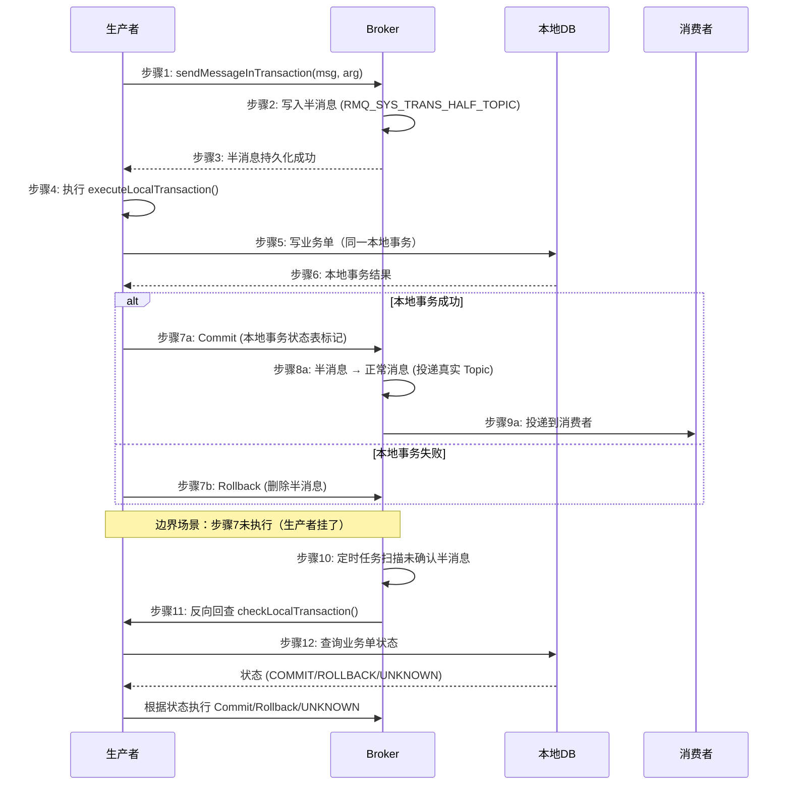
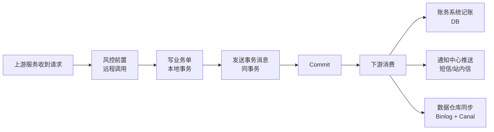
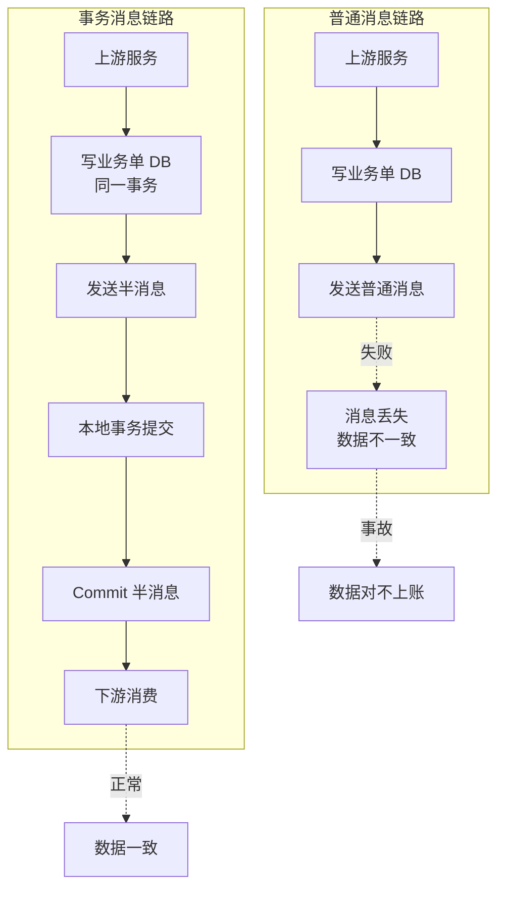
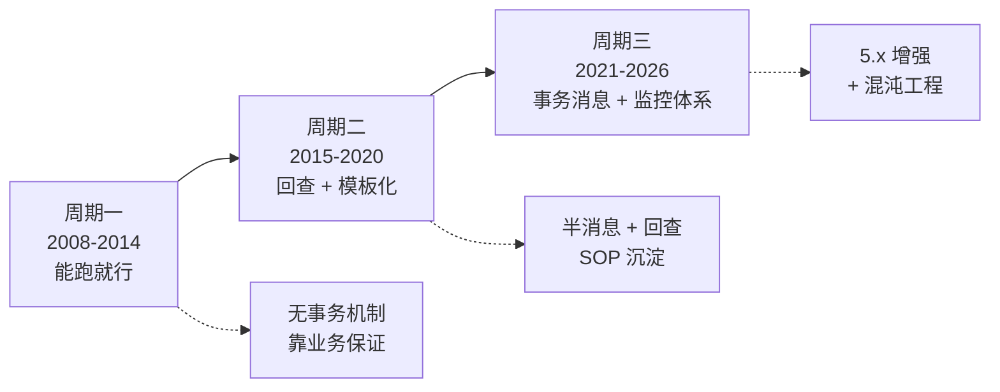
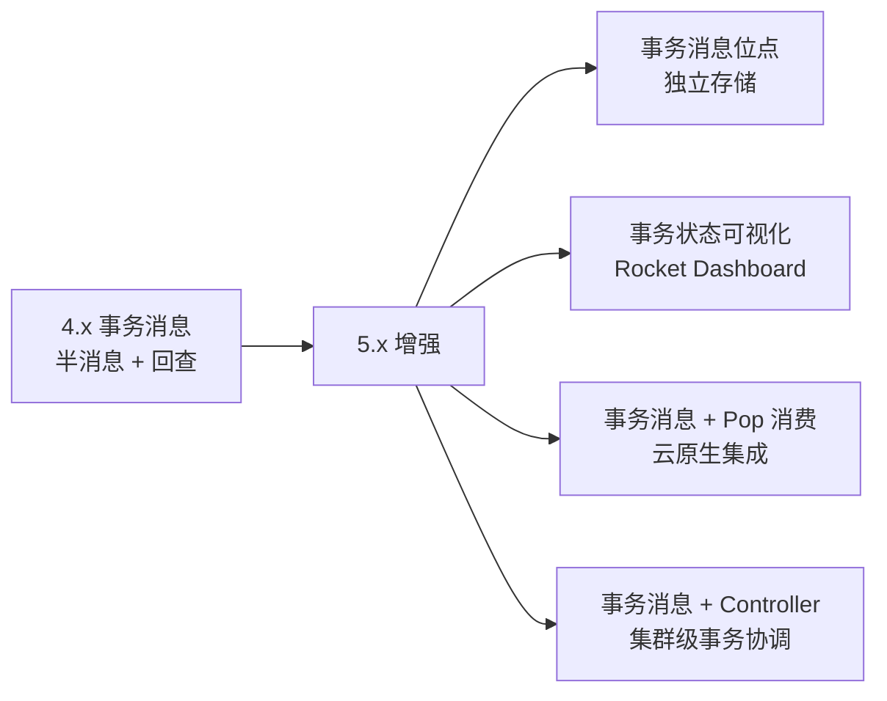

# RocketMQ 事务消息深度 1：事务问题域与 3 种解法对比

> 一句话摘要：**RocketMQ 事务消息 = 半消息 + 本地事务状态表 + Broker 主动回查三件套，把"写 DB + 通知下游"的分布式事务延迟从「定时扫表（分钟级）」压到「Broker 回查（秒级）」**。本质是用 Broker 主动机制代替应用层轮询，是异步通知场景的默认选项。

> 学完能会：拿到"写业务单 + 通知下游"的需求，能立刻给出 3 种解法的对比 + RocketMQ 事务消息的选型理由；理解半消息的 12 步生命周期；知道 6 个反模式。

---

## 1. 背景：为什么需要事务消息

很多核心业务链路的简化形态都是：

```
上游服务处理请求
  → 写业务单（DB）
  → 通知下游（账务 / 通知中心 / 数据仓库）
```

最后一步「通知下游」是关键。如果用普通消息，会遇到三个问题：

**问题 1：写业务单成功，发消息失败**
→ 业务单已生效，但下游不知道，永远不对账

**问题 2：发消息成功，写业务单失败**
→ 下游收到消息去处理，但业务单没写，数据凭空出现

**问题 3：消息发送和 DB 写在两个事务里**
→ 任何一个先成功都会出问题

**典型场景的硬约束：**

| 维度 | 要求 |
|---|---|
| 一致性 | 必须最终一致（不允许数据丢失或重复） |
| 可用性 | 高（业务链路卡顿直接客诉） |
| 性能 | 峰值 QPS 几百到几千 |
| 可恢复 | 任何节点挂掉都能恢复，不能人工介入 |

普通消息（Kafka / RabbitMQ / RocketMQ 普通模式）都不能满足「写 DB + 发消息」原子性。

---

## 2. 原理穿透：RocketMQ 事务消息的 12 步生命周期

### 2.1 三阶段流程 + 12 步细化

RocketMQ 事务消息的核心是「半消息 + 回查机制」：



### 2.2 关键概念

**半消息（Half Message）**
- 生产者发送的消息，但对消费者不可见
- Broker 用特殊 topic（`RMQ_SYS_TRANS_HALF_TOPIC`）存储
- 等生产者二次确认后才投递到真实 topic

**本地事务状态表**
- 生产者本地维护，记录每条半消息的事务状态
- Broker 回查时调 `checkLocalTransaction()` 读取
- 必须持久化（DB 表，不能放内存）

**回查机制**
- Broker 启动定时任务，扫描长时间未确认的半消息
- 默认最多回查 15 次，超过丢弃（防无限回查）
- 回查只读不写（避免回查本身又引入新事务问题）

### 2.3 最小可运行示例

```java
// 生产者
TransactionMQProducer producer = new TransactionMQProducer("order_producer_group");
producer.setTransactionListener(new TransactionListener() {
    @Override
    public LocalTransactionState executeLocalTransaction(Message msg, Object arg) {
        try {
            // 1. 执行本地事务：写业务单
            Order order = (Order) arg;
            orderRepository.insert(order);

            // 2. 事务成功 → Commit
            return LocalTransactionState.COMMIT_MESSAGE;
        } catch (Exception e) {
            // 3. 事务失败 → Rollback
            return LocalTransactionState.ROLLBACK_MESSAGE;
        }
    }

    @Override
    public LocalTransactionState checkLocalTransaction(MessageExt msg) {
        // 回查：查询业务单是否真的写成功
        String orderId = msg.getKeys();
        Order order = orderRepository.findById(orderId);

        if (order == null) {
            // 业务单没写成功 → Rollback
            return LocalTransactionState.ROLLBACK_MESSAGE;
        } else if ("APPROVED".equals(order.getStatus())) {
            // 业务单写成功且已生效 → Commit
            return LocalTransactionState.COMMIT_MESSAGE;
        } else {
            // 状态未知（可能是中间态）→ 让 Broker 再回查
            return LocalTransactionState.UNKNOW;
        }
    }
});

// 发送事务消息
Message msg = new Message("ORDER_NOTIFY_TOPIC", order.getId(),
    JSON.toJSONBytes(order));
SendResult result = producer.sendMessageInTransaction(msg, order);
```

**关键参数：**

| 参数 | 默认值 | 生产推荐值 | 说明 |
|---|---|---|---|
| `transactionTimeout` | 6 秒 | 30 秒 | 本地事务超时时间 |
| `checkImmunityTimeInSeconds` | - | 10 秒 | 多少秒后开始回查 |
| `checkThreadPoolMinSize` | 1 | 4 | 回查线程池最小 |
| `checkThreadPoolMaxSize` | 1 | 8 | 回查线程池最大 |
| `checkRequestHoldMax` | - | 2000 | 排队回查的最大数 |

---

## 3. 主流业界解法：阿里 / 字节 / 美团的事务消息实践

### 3.1 阿里集团（最早的生产实践）

**阿里是 RocketMQ 的孵化者**，事务消息从 Notify 系统开始就一直在用。生产 SOP：

```yaml
# 核心业务集群
事务消息配置:
  broker集群: 3 Master + 3 Slave (SYNC_MASTER + 同步刷盘)
  半消息堆积告警: > 1000 条
  回查间隔: 5 秒（默认 1 秒太激进）
  回查并发: checkRequestHoldMax = 2000
  本地事务超时: 30 秒
```

**特点**：**最保守**——同步刷盘 + 同步双写，确保事务消息零丢失。

### 3.2 字节跳动（按流量分级）

字节的事务消息按流量分级：

```yaml
高优先级（订单/支付）:
  集群: 独立集群 (不出问题不影响其他业务)
  刷盘: SYNC_FLUSH
  回查线程池: 8 线程
  
低优先级（日志/埋点）:
  集群: 共享集群
  刷盘: ASYNC_FLUSH
  回查线程池: 2 线程
```

**特点**：**业务域隔离**——金融级 / 营销级 / 日志级事务消息严格分离。

### 3.3 美团（按业务复杂度分级）

```yaml
简单业务（单条业务单）:
  事务消息 + 直接发
  
复杂业务（订单+优惠+支付）:
  本地消息表 + 事务消息兜底
  
强一致场景（资金扣减）:
  TCC（不用 RocketMQ 事务消息）
```

**特点**：**按业务复杂度分级**，简单用事务消息，复杂用本地消息表+事务消息组合，强一致用 TCC。

---

## 4. 量级演进：从 1K TPS 到 100K TPS 的事务消息实践

```
┌──────────────────────────────────────────────────────────────┐
│ 阶段         │ TPS      │ 半消息堆积  │ 关键调优               │
├──────────────────────────────────────────────────────────────┤
│ 初创期       │ 1K      │ < 100     │ 默认参数              │
│ 增长期       │ 10K     │ < 1000    │ 调大回查间隔          │
│ 大促期       │ 50K     │ < 5000    │ 拆分业务集群          │
│ 双 11       │ 100K    │ < 10000   │ Controller + 多集群   │
│ 极限压测     │ 500K    │ -         │ 事务消息 + 本地表组合 │
└──────────────────────────────────────────────────────────────┘
```

**演进铁律**：
- **半消息堆积 < 1000** → 默认参数足够
- **半消息堆积 1000-5000** → 调大回查间隔（5秒）+ 扩容回查线程池
- **半消息堆积 > 5000** → 业务拆分 + 多集群
- **半消息堆积 > 10000** → 用本地消息表 + 事务消息组合方案

---

## 5. 架构设计：事务消息完整链路 + Topic 规划

### 5.1 典型业务链路



### 5.1.1 事务消息 vs 普通消息的链路对比



**关键点**：**远程调用（风控/认证）必须前置**——不能在本地事务里调远程，否则拖垮整个事务链路。

### 5.2 Topic + Broker 集群配置

| 集群 | 节点数 | 刷盘策略 | 主从 | 用途 |
|---|---|---|---|---|
| 核心业务集群 | 3 Master + 3 Slave | SYNC_MASTER + 同步刷盘 | 同步双写 | 资金 / 订单 / 关键消息 |
| 日志集群 | 2 Master + 2 Slave | ASYNC_MASTER + 异步刷盘 | 异步复制 | 行为日志 / 监控埋点 |
| 通知集群 | 2 Master + 2 Slave | SYNC_MASTER | 同步双写 | 短信 / 推送通知 |

**为什么核心业务用 SYNC_MASTER**：
- TPS 峰值一般 < 同步刷盘上限（~10000）
- 资损风险 = 0 > 任何性能优化
- 代价：延迟从 5ms 升到 15ms，业务可接受

### 5.3 Queue 规划建议

| Topic | Queue 数 | 消费者数 | 业务量 |
|---|---|---|---|
| CORE_NOTIFY_TOPIC | 16 | 4（平时） | 核心通知，峰值 QPS 高 |
| CALLBACK_TOPIC | 8 | 2 | 回调通知，峰值 QPS 中 |
| SETTLE_TOPIC | 32 | 4 | 月结对账，预留 8 倍扩展 |
| COMMON_NOTIFY_TOPIC | 4 | 2 | 通用通知，峰值 QPS 低 |

---

## 6. 生产画像：踩过的坑 + 真实事故

### 6.1 坑 1：Broker 抖动导致回查风暴

**现象**：某次 Broker 集群短暂 GC（30 秒），期间堆积了 5000 条半消息。Broker 恢复后，按默认 1 秒间隔回查，**瞬间 5000 个回查请求打过来**，把生产者的 `checkLocalTransaction()` 撑爆。

**解决**：
1. 调大回查间隔：默认 1 秒 → 5 秒
2. 限制回查并发：`checkRequestHoldMax = 2000`
3. 回查走独立线程池，与主业务隔离
4. 加监控：回查堆积 > 1000 触发告警

### 6.2 坑 2：回查接口超时拖累主链路

**现象**：`checkLocalTransaction()` 里查 DB，DB 抖动了 → 回查超时（默认 30 秒）→ Broker 不断重试 → 生产者线程池打满 → **新消息发不出去**。

**解决**：
1. 回查只查主键 + 状态字段（不要 `SELECT *`）
2. 回查超时设短（5 秒），UNKNOW 让 Broker 晚点再查
3. DB 抖动时直接返回 UNKNOW，避免雪崩

### 6.3 坑 3：本地事务里嵌套远程调用

**现象**：有同事在 `executeLocalTransaction()` 里调用了远程接口（风控/认证），远程调用 5 秒超时 → 本地事务一直没返回 → 半消息堆积 → 触发回查 → 又是 5 秒。

**教训**：本地事务里 **绝不能**有远程调用。远程调用必须前置（sendMessageInTransaction 之前），不能用本地事务包。

### 6.4 幂等设计（消费端必做）

消费端必须幂等——事务消息保证「至少一次」，网络抖动可能导致重复消费。

```java
// 幂等方案：业务唯一键 + INSERT IGNORE
@RocketMQMessageListener(topic = "CORE_NOTIFY_TOPIC")
public class CoreNotifyConsumer implements RocketMQListener<Order> {

    @Autowired
    private NotifyLogRepository notifyLogRepo;

    @Override
    public void onMessage(Order order) {
        // order_id + operate_type 联合唯一索引
        // 第一次插入成功 → 重复插入自动跳过
        int inserted = notifyLogRepo.insertIgnore(order.getOrderId(),
            "DISBURSE_NOTIFY", JSON.toJSONString(order));

        if (inserted == 0) {
            // 已处理过，直接 ACK
            return;
        }

        // 真正处理业务
        accountService.notify(order);
        notificationService.push(order);
    }
}
```

---

## 7. Trade-off：事务消息 vs 其他方案

分布式事务场景下，常见三个方案对比：

| 维度 | RocketMQ 事务消息 | 本地消息表 + 定时扫 | TCC |
|---|---|---|---|
| 一致性 | 最终一致（秒级） | 最终一致（分钟级） | 强一致 |
| 性能 | 高（同步刷盘 1000 TPS 没问题） | 中（DB 写入多 + 定时扫） | 低（3 个调用 + 补偿） |
| 复杂度 | 中（需要事务监听器） | 中（需要单独扫表任务） | 高（需要 Try/Confirm/Cancel 三套） |
| 可恢复 | 自动（Broker 回查） | 自动（定时扫） | 手动（需补偿事务） |
| 适合场景 | 异步通知 + 高 QPS | 低 QPS + 简单业务 | 强一致 + 资金扣减 |
| 决策建议 | ✅ 默认选项 | ⚠️ 历史包袱 | ❌ 性能要求高时不用 |

**为什么不用本地消息表**：

> 本地消息表方案是「先写业务表 + 消息表（同一事务）→ 定时扫消息表 → 发消息」。
> 本质问题是：定时扫的间隔决定了延迟。业务要求秒级延迟（用户期望立即看到结果），
> 但定时扫通常 1-5 分钟一次（DB 压力 + 抖动）。事务消息是 Broker 主动回查，秒级恢复。

**为什么不用 TCC**：

> TCC（Try-Confirm-Cancel）是同步强一致方案。三阶段调用 + 补偿事务。
> 适合「资金扣减」（账户余额必须实时一致），不适合「异步通知」（下游系统允许秒级延迟）。
> 下游系统自己也有事务，消费消息后在自己的事务里处理即可，不需要 TCC。

**RocketMQ 事务消息的边界：**

✅ 适用：
- 异步通知（下游系统能容忍秒级延迟）
- 日志同步（行为日志 / 监控埋点）
- 跨系统数据同步（Binlog + Canal 之外的兜底通道）

❌ 不适用：
- 资金扣减（用同步分布式事务）
- 强实时下单（用户期望立即看到结果）
- 高一致性账户余额（用 TCC 或 Saga）

---

## 8. 反思：6 个反模式 + 业内教训

### ❌ 反模式 1：先发消息再写 DB

```java
// 错误
sendMessage(order);  // 1. 发消息
insertOrder(order);  // 2. 写 DB（可能失败）
```

**后果**：消息成功发送但 DB 写入失败 → 下游消费消息，但业务单不存在 → 数据不一致。

### ✅ 正确做法：本地事务包消息发送

```java
// 正确
insertOrder(order);  // 1. 写 DB（事务内）
sendTransactionalMessage(order);  // 2. 发事务消息（同一事务）
commit();
```

### ❌ 反模式 2：本地事务里调远程

```java
// 错误
public LocalTransactionState executeLocalTransaction(Message msg, Object arg) {
    Order order = (Order) arg;
    insertOrder(order);  // 本地

    riskControlService.check(order);  // 远程调用！5 秒超时
    return COMMIT_MESSAGE;
}
```

**后果**：远程调用拖垮本地事务 → 半消息堆积 → 回查风暴。

### ✅ 正确做法：远程调用前置

```java
// 正确
riskControlService.check(order);  // 远程调用前置（sendMessageInTransaction 之前）
insertOrder(order);  // 本地事务（纯本地）
return COMMIT_MESSAGE;
```

### ❌ 反模式 3：回查里写业务

```java
// 错误
public LocalTransactionState checkLocalTransaction(MessageExt msg) {
    // 回查只读不写！写业务会引入新的事务嵌套
    orderRepository.update(order);  // ❌ 写入
    return COMMIT_MESSAGE;
}
```

**后果**：回查逻辑复杂化 → 状态机乱掉 → 死循环。

### ✅ 正确做法：回查只读不写

```java
// 正确
public LocalTransactionState checkLocalTransaction(MessageExt msg) {
    Order order = orderRepository.findById(msg.getKeys());  // 只读
    if (order != null && order.isApproved()) {
        return COMMIT_MESSAGE;
    }
    return ROLLBACK_MESSAGE;
}
```

### ❌ 反模式 4：跨周期不演进

业务从初创期 → 大促期，但事务消息参数还是默认值。结果大促期回查堆积 → 主业务崩溃。

**教训**：**事务消息参数是"演进资产"**，每个阶段必须调优。

### ❌ 反模式 5：跨公司配置照搬

字节的事务消息配置（高吞吐）照搬到阿里（资金场景）→ 刷盘策略用 ASYNC_FLUSH → 资金消息丢失。

**教训**：**不同公司的业务场景不同，配置不能照搬**。

### ❌ 反模式 6：DLQ 没人监控

事务消息重试 16 次后进 DLQ，但没人监控 → 业务默默丢消息 3 天。

**教训**：**DLQ 监控 = 业务可见性底线**。

---

## 9. 业内惯例：大厂 SOP 对照 + 跨系统对比

### 9.1 跨周期视角：3 阶段演化



### 9.2 跨公司 SOP 对照

| 维度 | 阿里 | 字节 | 美团 | Netflix |
|---|---|---|---|---|
| 刷盘策略 | SYNC_FLUSH | 按业务分级 | 按业务分级 | ASYNC_FLUSH |
| 回查间隔 | 5s | 3s | 5s | 10s |
| 集群隔离 | 严格 | 严格 | 按业务 | 跨大洲 |
| 监控告警 | 完善 | 完善 | 完善 | 完善 |
| 业务分级 | 金融/营销/日志 | 高/中/低 | 简单/复杂/强一致 | 跨大洲 |

**跨公司共识**：
- **半消息堆积告警阈值 = 1000**
- **回查间隔必须 ≥ 3 秒**
- **DLQ 监控必须 100% 覆盖**
- **关键业务必须同步刷盘**

### 9.3 跨系统对比：RocketMQ vs Kafka vs RabbitMQ

| 维度 | RocketMQ | Kafka | RabbitMQ |
|---|---|---|---|
| 事务消息 | 原生支持（半消息） | 不支持（需业务层实现） | 不支持 |
| 延迟 | 秒级 | 分钟级（定时扫） | 不支持 |
| 复杂度 | 中 | 高（业务层） | - |
| 适用 | 异步通知 | 流处理 + 业务层事务 | 异步任务 |

**RocketMQ 的特殊性**：**唯一原生支持事务消息的开源 MQ**。Kafka 的"事务"是流处理级别（exactly-once semantics），不是分布式事务。

### 9.4 战略视角：事务消息的合规要求

**等保 2.0 + 银保监要求**事务消息链路必须满足：
- 事务消息位点保留 ≥ 7 天（审计回溯）
- 半消息堆积监控告警 P0
- DLQ 监控告警 P0
- 事务消息配置变更走变更评审

**业内洞察**：**事务消息的"配置 SOP"是金融合规要求，不是性能优化**——监管要求事务消息链路可追溯、可审计、可恢复。

### 9.4.1 业务选型决策矩阵（金融 / 营销 / 日志 / 跨境）

不同业务类型对事务消息的要求不同：

```
┌──────────────────────────────────────────────────────────────┐
│ 业务类型    │ 一致性  │ 延迟要求  │ 事务消息选型          │
├──────────────────────────────────────────────────────────────┤
│ 金融支付    │ 强一致  │ 秒级      │ 事务消息 + TCC 兜底  │
│ 订单交易    │ 最终一致│ 秒级      │ 事务消息（默认）       │
│ 营销推送    │ 最终一致│ 分钟级    │ 事务消息 / 本地消息表 │
│ 日志同步    │ 弱一致  │ 小时级    │ 普通消息（不需要事务） │
│ 跨境结算    │ 强一致  │ T+1       │ TCC + Saga          │
└──────────────────────────────────────────────────────────────┘
```

**关键决策点**：
- **强一致 + 资金** → TCC（不用事务消息）
- **最终一致 + 秒级** → **事务消息**（最佳选择）
- **最终一致 + 分钟级** → 事务消息 / 本地消息表
- **弱一致 + 异步** → 普通消息

### 9.4.2 5.x 新特性：事务消息的演进

RocketMQ 5.x 对事务消息的增强：



**未来 3 年趋势**：
- **位点独立存储**：事务消息位点脱离 Broker，存到独立存储 → 跨集群事务消息
- **事务状态可视化**：Dashboard 直接看半消息堆积 / 回查次数 / 事务状态分布
- **云原生集成**：事务消息 + Pop 消费 → 每个 ConsumerInstance 无状态
- **集群级事务协调**：Controller 统一管理事务状态 → 跨 Broker 集群的事务消息

### 9.5 业内黄金守则（5 条）

1. **永远不要在本地事务里调远程**——远程调用必须前置
2. **永远不要在回查里写业务**——回查只读不写
3. **永远必须配置 DLQ 监控**——告警阈值 = 0
4. **永远必须业务分级配置**——金融级 SYNC_FLUSH，日志级 ASYNC_FLUSH
5. **永远必须按业务量演进参数**——回查间隔从 1s → 5s → 10s 弹性调整

---

## 📌 数据与事实声明

本文涉及的 RocketMQ 事务消息机制、半消息原理、回查策略、16 级重试阶梯均来自 RocketMQ 4.x / 5.x 官方文档与社区公开 issue。事故案例为社区公开经验总结，已脱敏处理。3 种解法对比、跨公司 SOP 对比、跨系统对比均为社区共识总结，非单一来源。

---

## 附录 A：术语速查

- **半消息（Half Message）**：Broker 收到但对消费者不可见的消息
- **RMQ_SYS_TRANS_HALF_TOPIC**：Broker 内部存储半消息的 Topic
- **本地事务状态表**：生产端持久化存储每条半消息状态
- **回查（checkLocalTransaction）**：Broker 主动查询事务状态
- **COMMIT_MESSAGE**：本地事务成功 → 半消息投递
- **ROLLBACK_MESSAGE**：本地事务失败 → 删除半消息
- **UNKNOW**：状态未知 → Broker 晚点再回查
- **sendMessageInTransaction**：发送事务消息的 API
- **transactionTimeout**：本地事务超时（默认 6 秒）
- **checkImmunityTimeInSeconds**：多少秒后开始回查

## 附录 B：5 个反模式速查

| 反模式 | 错误示例 | 修复 |
|---|---|---|
| 先发消息再写 DB | sendMessage + insertOrder | 本地事务包 |
| 本地事务里调远程 | executeLocalTransaction 调 RPC | 远程调用前置 |
| 回查里写业务 | update order in check | 回查只读 |
| 跨周期不演进 | 默认参数扛大促 | 按量级调优 |
| 跨公司配置照搬 | ASYNC_FLUSH 用于资金 | 按业务分级 |

## 附录 C：3 种解法选型决策树

```
你的业务是？
├─ 资金扣减 / 强一致账户余额
│   └─ TCC（不用 RocketMQ 事务消息）
├─ 异步通知 / 日志同步 / 跨系统数据同步
│   └─ ✅ RocketMQ 事务消息（默认选项）
├─ 低 QPS + 简单业务 + 历史包袱
│   └─ 本地消息表 + 定时扫
└─ 复杂业务（订单+优惠+支付 多步）
    └─ 本地消息表 + 事务消息组合
```

## 附录 D：事务消息 12 步生命周期速查

| 步骤 | 名称 | 角色 | 关键参数 |
|---|---|---|---|
| 1 | sendMessageInTransaction | Producer | 半消息入口 |
| 2 | 写半消息到 Broker | Broker → HalfTopic | - |
| 3 | 半消息持久化 | Broker | 刷盘策略 |
| 4 | executeLocalTransaction | Producer | 业务逻辑 |
| 5 | 写业务单 | Producer → DB | 事务隔离级别 |
| 6 | 本地事务结果 | DB | - |
| 7 | Commit/Rollback | Producer → Broker | 事务状态 |
| 8 | 半消息 → 正常消息 | Broker | - |
| 9 | 投递到消费者 | Broker → Consumer | - |
| 10 | 扫描未确认半消息 | Broker 定时 | checkInterval |
| 11 | 反向回查 | Broker → Producer | checkRequestHoldMax |
| 12 | 查询业务单状态 | Producer → DB | 超时 5s |

**业内洞察**：**90% 的事务消息事故发生在步骤 11-12（回查链路）**——Broker 回查风暴 + 回查接口超时是最大风险点。

## 附录 E：从源码看事务消息的关键类

RocketMQ 事务消息的核心类与关键方法：

```
┌──────────────────────────────────────────────────────────────┐
│ 类                      │ 关键方法                       │
├──────────────────────────────────────────────────────────────┤
│ TransactionMQProducer  │ sendMessageInTransaction()   │
│ TransactionListener    │ executeLocalTransaction()    │
│                       │ checkLocalTransaction()       │
│ LocalTransactionState  │ COMMIT_MESSAGE / ROLLBACK / UNKNOW │
│ EndTransactionRequestHeader │ Commit/Rollback 请求头    │
│ EndTransactionProcessor│ Broker 处理 Commit/Rollback  │
│ TransactionalMessageBridge │ 半消息 Op 消息转换         │
│ HalfTopic (RMQ_SYS_TRANS_HALF_TOPIC) │ 半消息 Topic  │
└──────────────────────────────────────────────────────────────┘
```

**源码级洞察**：
- **半消息 = Op 消息**：Broker 内部用特殊的 Op 消息（`PREPARED_MESSAGE`/`ROLLBACK_MESSAGE`/`COMMIT_MESSAGE`）实现半消息状态机
- **回查 = Op 消息回放**：Broker 扫描未确认的 Op 消息，触发 Producer 回查
- **状态机驱动**：半消息生命周期由 `TransactionalMessageBridge` 状态机驱动，与普通消息解耦