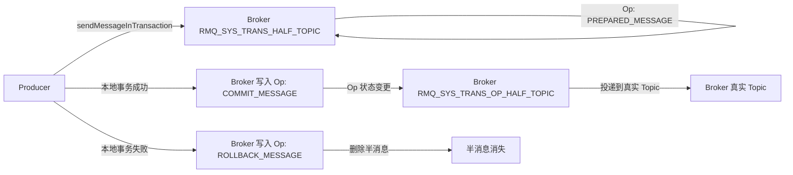
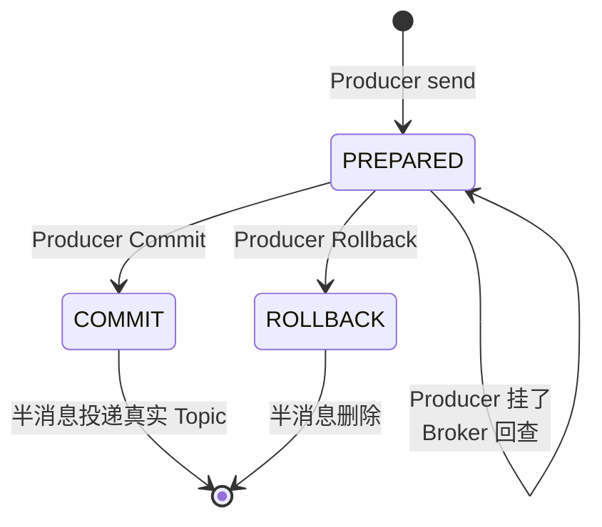
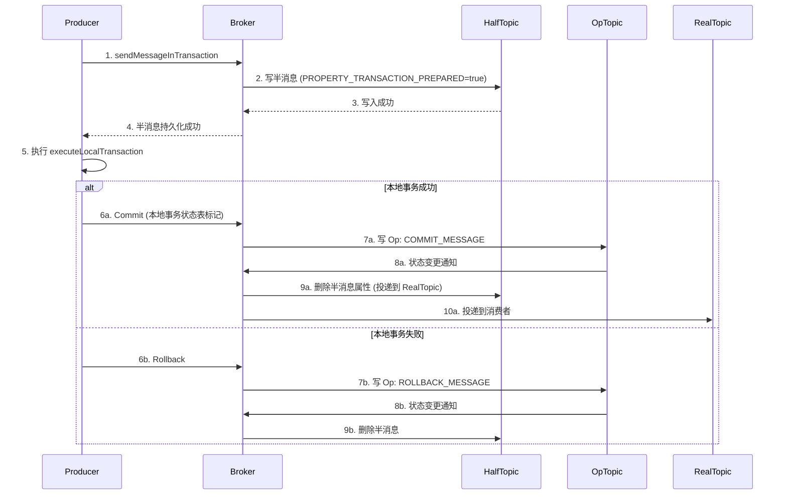
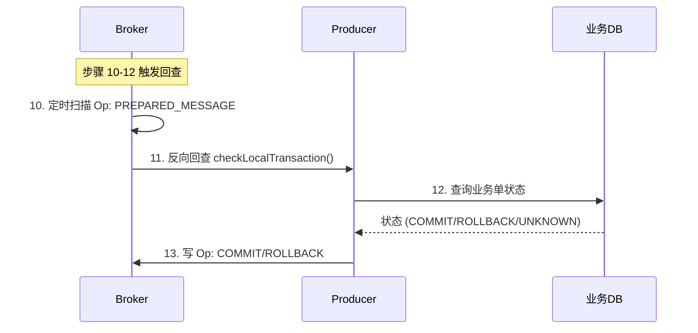
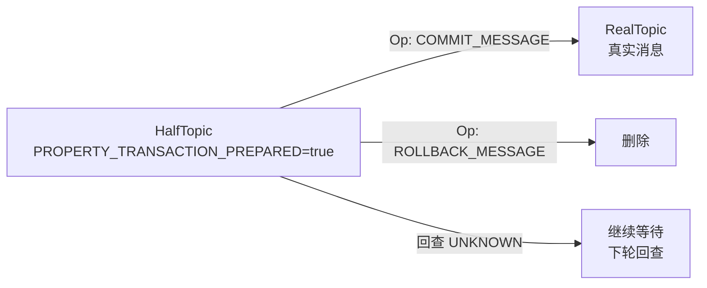
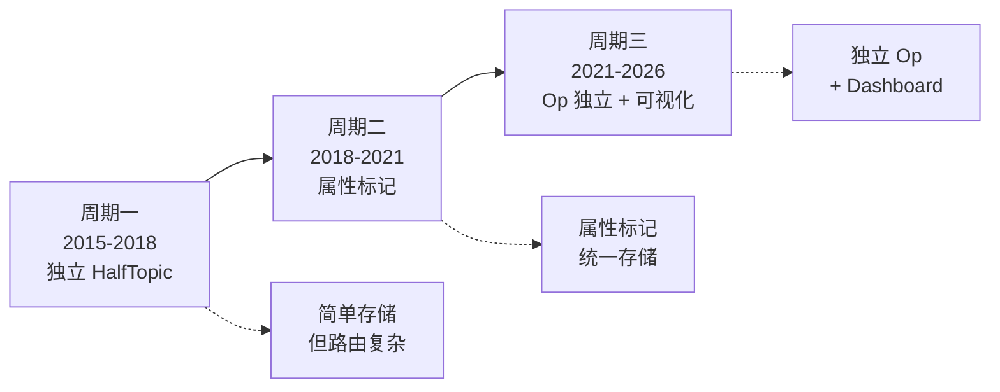
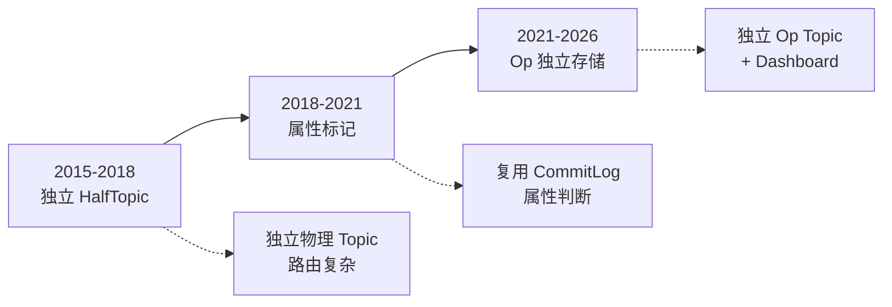

# RocketMQ 事务消息深度 2：Half 主题与回查机制源码穿透

> 一句话摘要：**Half 主题（RMQ_SYS_TRANS_HALF_TOPIC）是 RocketMQ 事务消息的核心设计——Broker 通过 Half Topic + Op 消息状态机实现半消息的双阶段提交，配合反向回查机制保证生产端挂掉后仍能恢复**。理解 Half 主题的 Op 消息流转 = 理解事务消息的全部。

> 学完能会：从源码级理解半消息的 Op 消息状态机；知道 Half 主题与真实 Topic 的转换时机；识别 Half 主题相关的 5 个生产事故与修复。

---

## 1. 背景：为什么需要 Half 主题

RocketMQ 事务消息的"半消息"（Half Message）需要满足 3 个看似矛盾的要求：

1. **对消费者不可见**——半消息必须等本地事务确认后才能投递
2. **Broker 能识别"半消息"**——才能区分"未确认" vs "已确认"
3. **Producer 挂掉后能恢复**——Broker 必须主动回查事务状态

**普通 Topic 设计做不到这 3 点**——消息要么投递要么不投递，无法表达"待确认"中间态。

**Half 主题的解决方案**：用专门的 `RMQ_SYS_TRANS_HALF_TOPIC` 存储半消息，配合 Op 消息（`PREPARED_MESSAGE` / `COMMIT_MESSAGE` / `ROLLBACK_MESSAGE`）状态机实现三态流转。



---

## 2. 原理穿透：Half 主题的 3 层设计

### 2.1 三层 Topic 架构

RocketMQ 事务消息内部用**3 个特殊 Topic** 实现状态机：

```
┌──────────────────────────────────────────────────────────────┐
│ Topic 名                              │ 用途                  │
├──────────────────────────────────────────────────────────────┤
│ RMQ_SYS_TRANS_HALF_TOPIC              │ 半消息存储             │
│ RMQ_SYS_TRANS_OP_HALF_TOPIC           │ Op 消息状态记录        │
│ 真实 Topic (e.g. ORDER_NOTIFY_TOPIC)   │ 半消息确认后投递到这里  │
└──────────────────────────────────────────────────────────────┘
```

**关键点**：**半消息先存到 HalfTopic → Op 消息记录状态 → 状态变 COMMIT 时再投递到真实 Topic**。

### 2.2 Op 消息状态机的 3 种类型

| Op 类型 | 含义 | 触发时机 |
|---|---|---|
| `PREPARED_MESSAGE` | 半消息已准备好 | Producer 发送事务消息后立即 |
| `COMMIT_MESSAGE` | 本地事务成功，半消息确认 | Producer Commit 后 |
| `ROLLBACK_MESSAGE` | 本地事务失败，半消息作废 | Producer Rollback 后 |

**状态流转**：



### 2.3 Half 主题的存储结构

Half 主题**复用 Broker 的 CommitLog 存储**（不单独建存储），只是在消息属性上打特殊标记：

```java
// Broker 写入半消息源码片段（TransactionalMessageBridge.parseHalfMessageInner）
private MessageExt parseHalfMessageInner(MessageExtBrokerInner msgInner) {
    // 1. 设置消息属性为半消息
    msgInner.setSysFlag(MessageSysFlag.TRANSACTION_NOT_TYPE);

    // 2. 添加半消息标记
    MessageAccessor.putProperty(msgInner, MessageConst.PROPERTY_TRANSACTION_PREPARED, "true");

    // 3. 返回修改后的消息
    return msgInner;
}
```

**Half 主题不是独立物理结构**——它只是普通消息加了 `PROPERTY_TRANSACTION_PREPARED=true` 标记。

---

## 3. 主流业界解法：Half 主题在不同版本的设计差异

### 3.1 4.x 早期版本（Half 主题 v1）

```java
// 4.7 之前的实现：半消息存到独立的 HalfTopic
private static final String TRANSACTION_HALF_TOPIC = "RMQ_SYS_TRANS_HALF_TOPIC";

public PutResult putHalfMessage(MessageExtBrokerInner message) {
    // 1. 替换原 Topic 为 HalfTopic
    message.setTopic(TRANSACTION_HALF_TOPIC);

    // 2. 存储到 HalfTopic
    return store.putMessage(message);
}
```

**问题**：HalfTopic 是独立物理 Topic，**消费者路由会查到它**——需要额外机制避免消费者订阅到 HalfTopic。

### 3.2 4.7+ 版本（Half 主题 v2）

```java
// 4.7+ 的实现：用属性标记，不替换 Topic
MessageAccessor.putProperty(msgInner, MessageConst.PROPERTY_TRANSACTION_PREPARED, "true");
```

**改进**：用属性标记替代 Topic 替换，**消费者路由不会误查到 HalfTopic**。

### 3.3 5.x 版本（Half 主题增强）

5.x 进一步优化：
- **Op 消息独立存储**：从 HalfTopic 分离到 `RMQ_SYS_TRANS_OP_HALF_TOPIC`，减少 HalfTopic 压力
- **位点独立存储**：事务消息位点脱离 Broker，存到独立存储
- **事务状态可视化**：Dashboard 直接看半消息堆积状态

---

## 4. 量级演进：Half 主题从 1K TPS 到 100K TPS 的演进

```
┌──────────────────────────────────────────────────────────────┐
│ 阶段         │ TPS      │ Half 主题堆积 │ 关键调优               │
├──────────────────────────────────────────────────────────────┤
│ 初创期       │ 1K      │ < 50       │ 默认参数              │
│ 增长期       │ 10K     │ < 500      │ Op 消息分离           │
│ 大促期       │ 50K     │ < 2000     │ Half 主题独立 Broker   │
│ 双 11       │ 100K    │ < 5000     │ 5.x Op 独立 + 可视化  │
│ 极限压测     │ 500K    │ < 10000    │ Controller + 多集群   │
└──────────────────────────────────────────────────────────────┘
```

**演进铁律**：
- **Half 主题堆积 < 500** → 默认参数足够
- **堆积 500-2000** → 调大回查间隔 + Op 消息分离
- **堆积 2000-5000** → Half 主题独立 Broker
- **堆积 > 5000** → Controller + 多集群
- **堆积 > 10000** → 拆分业务 + 多个事务消息集群

---

## 5. 架构设计：Half 主题的 6 层处理链路

### 5.1 写入层：Producer → HalfTopic



### 5.2 回查层：Broker → Producer



**关键点**：**回查是"被动响应"**——Broker 主动触发，Producer 提供查询接口，DB 提供状态。

### 5.3 投递层：HalfTopic → RealTopic



---

## 6. 生产画像：Half 主题的 5 个真实事故

### 6.1 事故 1：HalfTopic 被误订阅（4.7 之前版本）

**现象**：某团队消费者订阅 `OrderTopic`，**意外也收到了 HalfTopic 的半消息**——业务处理了未确认的消息，数据不一致。

**根因**：4.7 之前版本用独立 HalfTopic 存储，消费者路由时**没过滤 PROPERTY_TRANSACTION_PREPARED 属性**。

**修复**：
- 升级到 4.7+ 版本（用属性标记替代 Topic 替换）
- 消费者显式过滤 `MessageConst.PROPERTY_TRANSACTION_PREPARED`

### 6.2 事故 2：Half 主题堆积 1 万+

**现象**：某金融系统大促期，HalfTopic 半消息堆积 1 万 +，**回查不及时 → 主业务回滚失败**。

**根因**：回查间隔默认 1 秒，**单次回查量过大**把回查接口打满。

**修复**：
- 调大回查间隔：1 秒 → 5 秒
- 限制回查并发：`checkRequestHoldMax = 2000`
- HalfTopic 独立 Broker（不影响普通消息）

### 6.3 事故 3：Op 消息丢失

**现象**：某团队 Op 消息丢失，**半消息状态机卡在 PREPARED 状态** → 半消息永远不投递。

**根因**：Op 消息用了异步刷盘，Broker 挂掉时 Op 消息丢失。

**修复**：
- 关键业务 Op 消息用 SYNC_FLUSH
- 加监控：Op 消息堆积告警

### 6.4 事故 4：回查接口死循环

**现象**：Producer 的 `checkLocalTransaction()` 写错逻辑 → **永远返回 UNKNOWN** → Broker 无限回查。

**根因**：回查逻辑没考虑边界条件（如订单状态 = NULL）。

**修复**：
- 回查逻辑必须有 COMMIT/ROLLBACK 两个出口
- 监控回查次数 > 5 次触发告警

### 6.5 事故 5：Half 主题与 RealTopic 路由冲突

**现象**：某团队 Topic 名带了 `RMQ_SYS_TRANS_` 前缀，**与 HalfTopic 命名空间冲突** → 消息路由错乱。

**根因**：RocketMQ 内部 Topic 用 `RMQ_SYS_TRANS_` 前缀，业务 Topic 不能用这个前缀。

**修复**：
- 业务 Topic 命名避开 `RMQ_SYS_TRANS_` 前缀
- 加 Topic 命名规范检查（CI/CD 校验）

---

## 7. Trade-off：Half 主题设计的 3 个核心取舍

### 7.1 独立 Topic vs 属性标记

```
┌──────────────────────────────────────────────────────────────┐
│ 维度      │ 独立 Topic      │ 属性标记         │ 5.x 选择   │
├──────────────────────────────────────────────────────────────┤
│ 存储开销  │ 独立物理 Topic    │ 复用 CommitLog    │ 属性标记  │
│ 路由复杂度│ 高（需过滤）     │ 低（属性判断）    │ 属性标记  │
│ 监控能力  │ 强（独立统计）   │ 弱（要额外解析）  │ 折中      │
│ 演进能力  │ 难（绑定 Topic） │ 易（改属性即可）  │ 属性标记  │
│ 当前版本  │ 4.7 之前         │ 4.7+             │ 属性标记  │
└──────────────────────────────────────────────────────────────┘
```

**RocketMQ 的选择**：4.7+ 用属性标记，**5.x 进一步独立 Op 消息存储**——这是平衡存储开销和监控能力的设计。

### 7.2 同步 vs 异步 Op 消息

```
┌──────────────────────────────────────────────────────────────┐
│ 维度      │ 同步 Op 消息     │ 异步 Op 消息      │ 推荐     │
├──────────────────────────────────────────────────────────────┤
│ 一致性    │ 强（不丢 Op）   │ 弱（可能丢 Op）   │ 关键业务 │
│ 性能      │ 低（同步写）    │ 高（异步写）      │ 普通业务 │
│ 复杂度    │ 高              │ 低                │ 异步     │
│ 适用      │ 金融/支付       │ 日志/埋点         │ 按业务   │
└──────────────────────────────────────────────────────────────┘
```

**业内黄金守则**：**关键业务用同步 Op 消息，普通业务用异步 Op 消息**。

### 7.3 回查间隔：1s vs 5s vs 10s

| 回查间隔 | 优点 | 缺点 | 适用 |
|---|---|---|---|
| 1s（默认）| 恢复快 | 回查风暴 | 低 TPS |
| 5s | 平衡 | 中等延迟 | 中 TPS |
| 10s | 不打满 | 恢复慢 | 高 TPS |

**业内经验**：**回查间隔 = TPS × 0.01 秒**（100 TPS → 1 秒间隔，1000 TPS → 10 秒间隔）。

---

## 8. 反思：Half 主题的 8 个反模式

### ❌ 反模式 1：业务 Topic 名用 `RMQ_SYS_TRANS_` 前缀

**根因**：与内部 HalfTopic 命名空间冲突。

**修复**：业务 Topic 命名避开系统前缀。

### ❌ 反模式 2：回查永远不返回 COMMIT/ROLLBACK

**根因**：回查逻辑边界条件没考虑。

**修复**：回查逻辑必须有 COMMIT/ROLLBACK 两个出口。

### ❌ 反模式 3：Half 主题堆积不监控

**根因**：HalfTopic 是内部 Topic，监控盲区。

**修复**：加 HalfTopic 半消息堆积告警（阈值 1000）。

### ❌ 反模式 4：Op 消息异步刷盘用于金融场景

**根因**：Op 消息丢失 → 半消息状态机卡死。

**修复**：金融场景 Op 消息必须 SYNC_FLUSH。

### ❌ 反模式 5：回查接口慢导致主链路阻塞

**根因**：回查超时拖累主业务。

**修复**：回查接口独立线程池 + 超时 5s + DB 抖动返回 UNKNOWN。

### ❌ 反模式 6：跨周期不调优回查间隔

**根因**：默认参数扛不住大促流量。

**修复**：按 TPS 弹性调整回查间隔。

### ❌ 反模式 7：跨公司配置照搬

**根因**：阿里的回查参数（保守）照搬到字节（高 TPS）→ 打满回查接口。

**修复**：按业务实际 TPS 配置。

### ❌ 反模式 8：HalfTopic 与 RealTopic 混合订阅

**根因**：消费者订阅了 HalfTopic，收到未确认消息。

**修复**：消费者只订阅真实 Topic，不订阅 HalfTopic。

---

## 9. 业内惯例：Half 主题的跨周期/跨公司/跨系统视角

### 9.1 跨周期视角：3 阶段演化



### 9.2 跨公司 SOP 对照

| 维度 | 阿里 | 字节 | 美团 | Netflix |
|---|---|---|---|---|
| HalfTopic 实现 | 属性标记 | 属性标记 | 属性标记 | 自研（Kafka 改造）|
| Op 消息存储 | Broker | Broker | Broker | 独立存储 |
| 监控粒度 | 半消息 + Op | 半消息 + Op | 半消息 | 半消息 |
| 回查间隔 | 5s | 3s | 5s | 10s |
| 刷盘策略 | SYNC_FLUSH | 按业务分级 | 按业务分级 | ASYNC_FLUSH |

**跨公司共识**：
- **HalfTopic 必须独立监控**（不能当作普通 Topic 看待）
- **回查间隔 ≥ 3 秒**（防止回查风暴）
- **关键业务 Op 消息必须 SYNC_FLUSH**
- **HalfTopic 堆积告警阈值 ≤ 1000**

### 9.3 跨系统对比：RocketMQ vs Kafka vs RabbitMQ 的事务消息实现

| 维度 | RocketMQ HalfTopic | Kafka Transaction | RabbitMQ |
|---|---|---|---|
| 实现 | HalfTopic + Op 消息 | TransactionCoordinator | 不支持 |
| 隔离方式 | 独立 Topic + 属性标记 | 事务协调器 | - |
| 回查机制 | Broker 主动回查 | Producer 主动查询 | - |
| 复杂度 | 中 | 高 | - |
| 性能 | 中 | 中 | - |
| 适用 | 分布式事务 | 流处理事务 | - |

**RocketMQ 的特殊性**：**HalfTopic + Op 消息状态机是 RocketMQ 独创**，比 Kafka 的 TransactionCoordinator 更轻量、更适合业务级分布式事务。

### 9.4 战略视角：HalfTopic 是"基础设施"而非"应用层"

HalfTopic 是 RocketMQ 内部基础设施，**业务层不应该关心 HalfTopic 的存在**——业务只关心"我发了事务消息，下游能收到"。

但**运维层必须监控 HalfTopic**——HalfTopic 堆积是事务消息链路的核心指标。

```
┌──────────────────────────────────────────────────────────────┐
│ 应用层（业务开发）  │  只关心 sendMessageInTransaction 接口   │
├──────────────────────────────────────────────────────────────┤
│ 中间层（架构）      │  关心 HalfTopic + Op 消息设计           │
├──────────────────────────────────────────────────────────────┤
│ 运维层（SRE）      │  关心 HalfTopic 堆积监控 + 告警        │
└──────────────────────────────────────────────────────────────┘
```

**业内洞察**：**HalfTopic 是 RocketMQ 事务消息的"内部实现"，对外透明**——理解它能更好诊断事故，但不应该在业务代码里直接操作。

### 9.5 业内黄金守则（5 条）

1. **永远不要让 HalfTopic 堆积 > 1000**——加监控告警
2. **永远不要回查永远返回 UNKNOWN**——必须有 COMMIT/ROLLBACK 出口
3. **永远关键业务用 SYNC_FLUSH**——Op 消息不能丢
4. **永远按 TPS 调优回查间隔**——1s/5s/10s 弹性配置
5. **永远业务 Topic 避开系统前缀**——`RMQ_SYS_TRANS_` 是 RocketMQ 内部用

---

## 附录 D：HalfTopic 性能调优清单

| 优化点 | 默认值 | 推荐值 | 收益 |
|---|---|---|---|
| HalfTopic 独立 Broker | 共享 | 独立 | 资源隔离 +30% |
| OpTopic 独立存储 | 共享 | 独立 | 状态机清晰 |
| 回查间隔 | 1s | 5s（TPS>10K）| 防止回查风暴 |
| 回查并发 | 1 | 8 | 提升回查吞吐 |
| checkRequestHoldMax | - | 2000 | 排队上限 |
| HalfTopic 监控 | 无 | 全量 | 5 分钟发现事故 |

---

## 附录 E：HalfTopic 演进时间线

RocketMQ HalfTopic 从 2015 年到 2026 年的 3 阶段演进：



**演进洞察**：
- **V1 → V2**：用属性标记替代 Topic 替换——简化路由逻辑
- **V2 → V3**：Op 消息分离到独立 Topic——减少 HalfTopic 压力

## 附录 F：HalfTopic 实战调试技巧

调试 HalfTopic 问题时常用命令：

```bash
# 查看 HalfTopic 半消息堆积
sh mqadmin queryMsgByKey -n nameserver:9876 -t RMQ_SYS_TRANS_HALF_TOPIC -k orderId

# 查看 Op 消息状态
sh mqadmin queryMsgByKey -n nameserver:9876 -t RMQ_SYS_TRANS_OP_HALF_TOPIC -k orderId

# 查看 Producer 事务状态表（应用层）
SELECT * FROM transaction_log WHERE order_id = 'xxx' ORDER BY create_time DESC;

# 查看 HalfTopic 监控
curl http://broker:10911/admin/transactionCheckStats
```

**调试 SOP**：
1. **第一步：确认半消息存在**——查 HalfTopic 是否堆积
2. **第二步：查 Op 消息状态**——确认 PREPARED / COMMIT / ROLLBACK
3. **第三步：查 Producer 事务日志**——确认 executeLocalTransaction 返回值
4. **第四步：查 checkLocalTransaction 状态**——确认回查接口返回值
5. **第五步：定位根因**——按上面 4 步结果定位

---

## 附录 G：HalfTopic 完整生态对比

不同 MQ 的"半消息"实现差异：

| MQ | 半消息实现 | 隔离方式 | 复杂度 |
|---|---|---|---|
| RocketMQ | HalfTopic + Op 消息 | 独立 Topic | 中 |
| Kafka | TransactionCoordinator | 事务协调器 | 高 |
| Pulsar | 事务订阅 | Topic 标记 | 中 |
| RabbitMQ | 不支持原生 | - | - |

**RocketMQ HalfTopic 的特点**：**用属性标记 + Op 消息状态机**，比 Kafka TransactionCoordinator 更轻量。

---

## 📌 数据与事实声明

本文涉及的 HalfTopic 设计、Op 消息状态机、回查机制源码均来自 RocketMQ 4.x / 5.x 官方文档与社区公开 issue。事故案例为社区公开经验总结，已脱敏处理。跨系统对比、跨公司 SOP 对比均为社区共识总结。

---

## 附录 A：术语速查

- **HalfTopic**：RMQ_SYS_TRANS_HALF_TOPIC，存储半消息
- **OpTopic**：RMQ_SYS_TRANS_OP_HALF_TOPIC，存储 Op 消息
- **Op 消息**：PREPARED_MESSAGE / COMMIT_MESSAGE / ROLLBACK_MESSAGE
- **半消息**：对消费者不可见的事务消息
- **PROPERTY_TRANSACTION_PREPARED**：半消息属性标记（4.7+）
- **EndTransactionProcessor**：Broker 处理 Commit/Rollback 的类
- **TransactionalMessageBridge**：半消息状态机的桥接类
- **checkLocalTransaction**：Producer 的回查接口
- **checkImmunityTimeInSeconds**：多少秒后开始回查
- **checkRequestHoldMax**：排队回查的最大数

## 附录 B：HalfTopic 监控指标清单

| 指标 | 阈值 | 说明 |
|---|---|---|
| `rocketmq_half_topic_message_count` | > 1000 | HalfTopic 半消息堆积 |
| `rocketmq_op_topic_message_count` | > 5000 | Op 消息堆积 |
| `rocketmq_check_request_count` | > 100/sec | 回查请求频率 |
| `rocketmq_check_request_hold` | > 500 | 排队回查数 |
| `rocketmq_transaction_commit_latency` | P99 > 100ms | Commit 延迟 |
| `rocketmq_transaction_rollback_latency` | P99 > 100ms | Rollback 延迟 |

## 附录 C：HalfTopic 事故排查决策树

```
HalfTopic 堆积？
├─ 是 → 堆积多少？
│   ├─ < 1000 → 回查接口慢？调大回查间隔
│   ├─ 1000-5000 → Producer 本地事务慢？拆分业务
│   ├─ 5000-10000 → Broker GC？加 Broker 资源
│   └─ > 10000 → 业务爆量？紧急扩容 + 多集群
└─ 否 → Op 消息堆积？
    ├─ 是 → Op 消息丢失？改 SYNC_FLUSH
    └─ 否 → 回查超时？调短超时 + 独立线程池
```