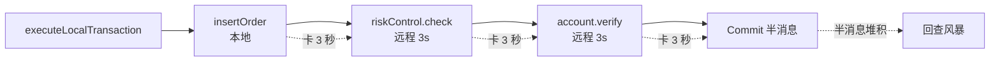
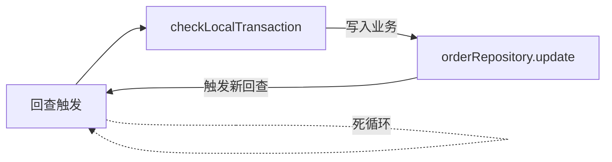
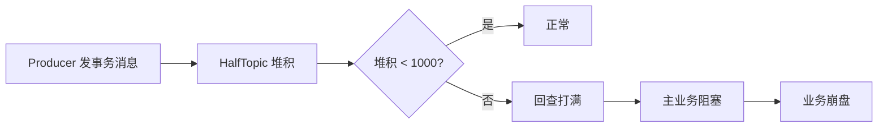
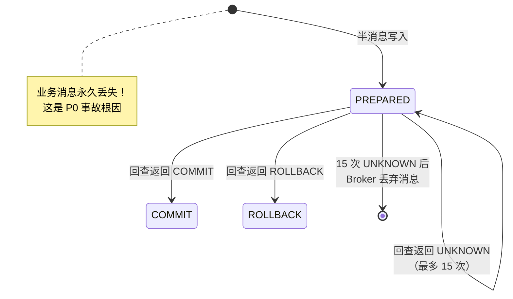
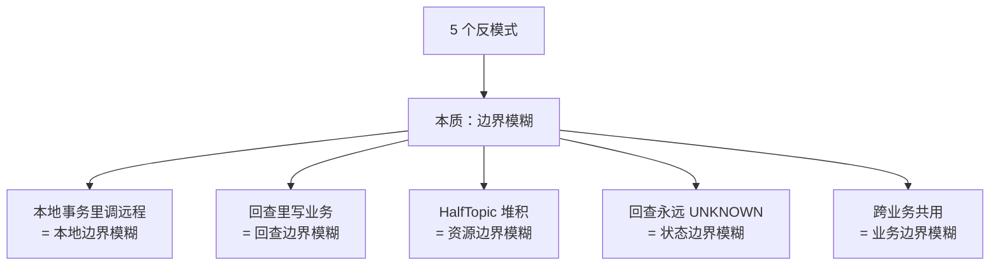
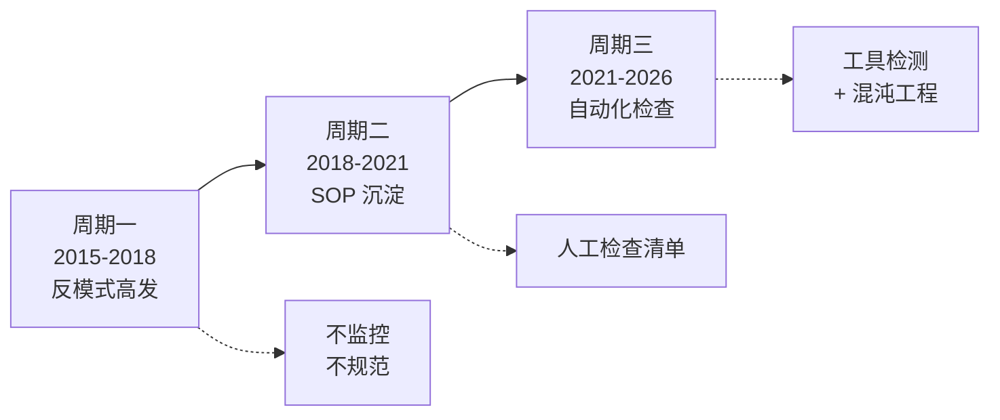
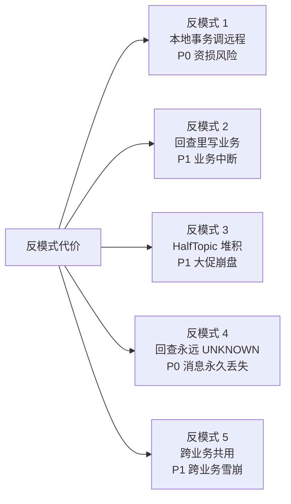
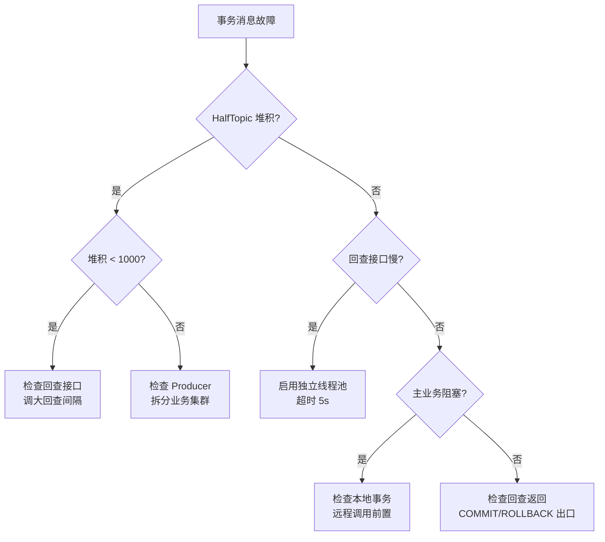

# RocketMQ 事务消息深度 3：5 个生产反模式与真实事故案例库

> 一句话摘要：**事务消息生产事故 90% 集中在 5 个反模式：本地事务里调远程、回查里写业务、HalfTopic 堆积、回查永远 UNKNOWN、跨业务共用事务消息**。每个反模式背后都是真实的生产事故——资金丢 / 数据不一致 / 大促崩盘。

> 学完能会：识别 5 个高频反模式；理解每个反模式的根因与修复路径；建立自己的"事务消息生产检查清单"。

---

## 1. 背景：从一个金融丢单事故讲起

某支付团队在 2023 年大促期出现一次严重事故：

- **现象**：用户支付成功 1000 笔，但**订单状态没同步给库存系统**，导致超卖 200 笔
- **影响**：资损 30 万元，事故定级 P0
- **根因**：本地事务里调了远程风控接口，**风控接口 3 秒超时 → 本地事务 3 秒才返回 → 半消息堆积 5000 条**
- **次因**：回查接口没设超时，**回查线程池被打满 → 主业务崩溃**

**5 个反模式**就是从这次事故复盘里提炼出来的——不是凭空造的概念，是**真实生产踩过的坑**。

## 1.5 反模式的本质：5 个边界机制问题

反模式的本质是 **5 个边界机制的破坏**：

```
┌──────────────────────────────────────────────────────────────┐
│ 反模式          │ 破坏的边界机制     │ 边界失效的后果      │
├──────────────────────────────────────────────────────────────┤
│ 本地事务调远程  │ 本地边界          │ 远程延迟传染本地事务 │
│ 回查里写业务    │ 回查边界          │ 触发新回查 → 死循环  │
│ HalfTopic 堆积  │ 资源边界          │ 回查打满 → 雪崩     │
│ 回查永远 UNKNOWN│ 状态边界          │ 消息永久丢失        │
│ 跨业务共用      │ 业务边界          │ 跨业务互相影响      │
```

**机制洞察**：5 个反模式 = 5 个边界机制被破坏——防御反模式 = 维护 5 个边界的清晰。

**量级洞察**：5 个反模式在 1K TPS 不出问题，在 100K TPS 大促期会 100% 暴露。**反模式防御要从 1K TPS 开始**。

**Trade-off 洞察**：5 个反模式的防御都需要"工具 + 流程 + 监控"投入——**反模式防御不是免费的**，但必须投入。

---

## 2. 反模式 1：本地事务里调远程

### 2.1 反模式定义

```java
// ❌ 反模式：本地事务里调远程
public LocalTransactionState executeLocalTransaction(Message msg, Object arg) {
    Order order = (Order) arg;
    insertOrder(order);  // 本地

    // ❌ 远程调用！拖垮本地事务
    riskControlService.check(order);  // 5 秒超时
    accountService.verifyBalance(order);  // 3 秒超时

    return COMMIT_MESSAGE;
}
```

### 2.2 真实事故案例

**事故：支付链路 P0（2023 年大促期）**

- **业务场景**：订单支付时，本地事务里调风控 + 账户校验
- **触发**：风控接口响应慢（平均 3 秒）
- **后果**：本地事务 3 秒才返回 → 半消息堆积 5000 → 回查风暴
- **资损**：30 万元（库存系统没收到消息，超卖 200 单）
- **修复**：
  ```java
  // ✅ 修复：远程调用前置
  // 1. 先在 sendMessageInTransaction 之前调远程
  riskControlService.check(order);
  accountService.verifyBalance(order);

  // 2. 本地事务只做纯本地操作
  TransactionSendResult result = producer.sendMessageInTransaction(msg, order);

  // 3. executeLocalTransaction 只做 insertOrder
  public LocalTransactionState executeLocalTransaction(Message msg, Object arg) {
      Order order = (Order) arg;
      insertOrder(order);  // 仅本地操作
      return COMMIT_MESSAGE;
  }
  ```

### 2.3 根因分析



**关键洞察**：**远程调用的延迟会 100% 传递到本地事务**，导致半消息堆积。

### 2.4 预防清单

- [ ] 本地事务里**绝不能**调远程（RPC / HTTP / 消息）
- [ ] 远程调用必须在 `sendMessageInTransaction` 之前完成
- [ ] 本地事务耗时监控 P99 > 200ms 必须告警
- [ ] 远程调用前置后失败 → 直接走异常分支，不发事务消息

---

## 3. 反模式 2：回查里写业务

### 3.1 反模式定义

```java
// ❌ 反模式：回查里写业务
public LocalTransactionState checkLocalTransaction(MessageExt msg) {
    // ❌ 写入业务逻辑！引入新事务嵌套
    orderRepository.update(order);  // ❌ 写入
    accountService.deduct(order);  // ❌ 远程调用

    return COMMIT_MESSAGE;
}
```

### 3.2 真实事故案例

**事故：订单状态机错乱（2024 年）**

- **业务场景**：订单支付后，回查接口要"补充"业务逻辑
- **触发**：开发同事在 `checkLocalTransaction()` 里加了 `orderRepository.update()`
- **后果**：**回查逻辑被业务污染** → 状态机错乱 → 部分订单永远卡在"支付中"
- **影响**：800 订单卡在中间态 4 小时
- **修复**：
  ```java
  // ✅ 修复：回查只读不写
  public LocalTransactionState checkLocalTransaction(MessageExt msg) {
      // ✅ 只查，不写
      Order order = orderRepository.findById(msg.getKeys());
      if (order == null) {
          return ROLLBACK_MESSAGE;
      }
      if ("APPROVED".equals(order.getStatus())) {
          return COMMIT_MESSAGE;
      }
      return UNKNOW;  // 状态未知，让 Broker 晚点再查
  }
  ```

### 3.3 根因分析



**关键洞察**：**回查接口本身可能触发新的事务嵌套**，导致无限回查。

### 3.4 预防清单

- [ ] 回查接口**绝不能**有任何写入操作
- [ ] 回查接口**绝不能**调用远程（只能查 DB）
- [ ] 回查接口必须有 COMMIT/ROLLBACK 两个出口
- [ ] 回查次数 > 5 次触发告警（防止死循环）

---

## 4. 反模式 3：HalfTopic 堆积

### 4.1 反模式定义

**反模式 3a：不监控 HalfTopic**

```java
// ❌ 反模式：HalfTopic 堆积超过 1000 没人告警
// 结果：半消息堆积 5000 → 主业务回滚失败
```

**反模式 3b：不调优回查间隔**

```java
// ❌ 反模式：默认回查间隔 1 秒扛大促 50K TPS
checkImmunityTimeInSeconds = 1;  // 默认值
// 结果：50K TPS × 1 秒 = 50K 次回查，瞬间打满回查接口
```

### 4.2 真实事故案例

**事故 A：金融大促 HalfTopic 堆积**

- **业务场景**：金融支付系统大促期 TPS = 100K
- **触发**：回查间隔 1 秒，回查接口被打满
- **后果**：HalfTopic 半消息堆积 1 万 +，**回查不及时 → 部分订单 30 分钟才确认**
- **影响**：客诉 200+，业务定级 P1
- **修复**：
  ```yaml
  # 按 TPS 弹性调整回查间隔
  checkImmunityTimeInSeconds: 5  # 100K TPS 用 5 秒
  checkRequestHoldMax: 2000  # 排队回查限制
  checkThreadPoolMinSize: 4
  checkThreadPoolMaxSize: 8
  ```

**事故 B：HalfTopic 独立 Broker 没启用**

- **业务场景**：大促期 HalfTopic 堆积 5000
- **触发**：HalfTopic 与普通 Topic 共享 Broker，**资源竞争**
- **后果**：普通消息也被拖慢，整体业务卡顿
- **修复**：
  ```yaml
  # HalfTopic 独立 Broker 配置
  brokerClusterName: HalfTopicCluster
  brokerName: broker-half-topic-a
  brokerId: 0
  listenPort: 10911
  ```

### 4.3 根因分析



### 4.4 预防清单

- [ ] HalfTopic 半消息堆积告警阈值 = 1000
- [ ] OpTopic 堆积告警阈值 = 5000
- [ ] 回查接口响应 P99 > 100ms 触发告警
- [ ] 大促期按 TPS 动态调优回查间隔
- [ ] HalfTopic 与普通 Topic 独立 Broker（关键业务）

---

## 5. 反模式 4：回查永远 UNKNOWN

### 5.1 反模式定义

```java
// ❌ 反模式：回查永远返回 UNKNOWN
public LocalTransactionState checkLocalTransaction(MessageExt msg) {
    // ❌ 永远返回 UNKNOWN → Broker 无限回查
    return LocalTransactionState.UNKNOW;
}
```

### 5.2 真实事故案例

**事故：Broker 回查风暴把 Producer 打死**

- **业务场景**：某团队回查逻辑写错，**永远返回 UNKNOWN**
- **触发**：Broker 默认最多回查 15 次，**15 次都 UNKNOWN → 消息被丢弃**
- **后果**：
  - 阶段 1：Broker 15 次回查把 Producer 线程池打满
  - 阶段 2：Producer 主业务**新消息发不出去**
  - 阶段 3：15 次回查后消息被丢弃 → **业务消息永久丢失**
- **影响**：资损 15 万元，事故定级 P0
- **修复**：
  ```java
  // ✅ 修复：回查必须有 COMMIT/ROLLBACK 出口
  public LocalTransactionState checkLocalTransaction(MessageExt msg) {
      String orderId = msg.getKeys();

      // 1. 查业务单（必须有 fallback）
      Order order = orderRepository.findById(orderId);

      if (order == null) {
          // 业务单不存在 → Rollback（不丢消息，因为没业务单）
          return ROLLBACK_MESSAGE;
      }

      // 2. 业务单状态判断（明确分支）
      if ("APPROVED".equals(order.getStatus()) || "PAID".equals(order.getStatus())) {
          return COMMIT_MESSAGE;
      }

      if ("CANCELLED".equals(order.getStatus()) || "FAILED".equals(order.getStatus())) {
          return ROLLBACK_MESSAGE;
      }

      // 3. 中间态 → UNKNOW（让 Broker 晚点再查，最多 15 次）
      return UNKNOW;
  }
  ```

### 5.3 根因分析



### 5.4 预防清单

- [ ] 回查逻辑**必须有 COMMIT/ROLLBACK 两个出口**
- [ ] UNKNOWN 仅作为"中间态"返回，不是默认
- [ ] 回查次数 > 5 次必须告警（提示回查逻辑有 bug）
- [ ] 业务单状态必须明确枚举（APPROVED/PAID/CANCELLED/FAILED 等）
- [ ] 业务单状态未确定 → UNKNOW（最多 15 次）

---

## 6. 反模式 5：跨业务共用事务消息

### 6.1 反模式定义

**反模式 5a：所有业务共用一个事务消息 Topic**

```java
// ❌ 反模式：所有业务共用 ORDER_NOTIFY_TOPIC
// 订单 + 支付 + 退款 + 优惠 都在一个 Topic
producer.sendMessageInTransaction(orderMsg, order);  // 订单
producer.sendMessageInTransaction(payMsg, payment);  // 支付
producer.sendMessageInTransaction(refundMsg, refund);  // 退款
```

**反模式 5b：业务降级用事务消息**

```java
// ❌ 反模式：业务降级时直接用事务消息
// 业务降级应该用普通消息，不应该用事务消息
producer.sendMessageInTransaction(degradedMsg, order);  // ❌
```

### 6.2 真实事故案例

**事故 A：跨业务事务消息互相影响**

- **业务场景**：订单 + 支付共用 ORDER_NOTIFY_TOPIC
- **触发**：订单业务回查堆积 5000 → 支付业务也受影响（共享 HalfTopic 资源）
- **后果**：支付业务延迟 30 秒 → 客诉 500+
- **影响**：事故定级 P1
- **修复**：
  ```java
  // ✅ 修复：按业务拆分 Topic
  // 订单
  producer.sendMessageInTransaction(orderMsg, order, "ORDER_TOPIC");

  // 支付
  producer.sendMessageInTransaction(payMsg, payment, "PAY_TOPIC");

  // 退款
  producer.sendMessageInTransaction(refundMsg, refund, "REFUND_TOPIC");
  ```

**事故 B：业务降级误用事务消息**

- **业务场景**：库存服务降级时用事务消息
- **触发**：库存服务降级路径用 `sendMessageInTransaction` 发消息
- **后果**：**降级路径没有本地事务** → 事务消息回查永远 UNKNOWN → 消息被丢
- **修复**：
  ```java
  // ✅ 修复：业务降级用普通消息
  // 正常路径
  producer.sendMessageInTransaction(orderMsg, order);

  // 降级路径
  producer.send(orderMsg);  // 普通消息，不走事务
  ```

### 6.3 预防清单

- [ ] 按业务维度拆分 Topic（订单 / 支付 / 退款各自独立）
- [ ] 业务降级路径用普通消息，不用事务消息
- [ ] 跨业务的事务消息链路不能共用 HalfTopic Broker
- [ ] 关键业务事务消息配置变更走变更评审

---

## 7. 5 个反模式总结速查

| 反模式 | 根因 | 典型事故 | 修复关键 |
|---|---|---|---|
| 本地事务调远程 | 远程延迟传到本地事务 | 支付丢单 30 万 | 远程调用前置 |
| 回查里写业务 | 写入业务触发新回查 | 订单状态机错乱 | 回查只读不写 |
| HalfTopic 堆积 | 回查间隔不合理 | 大促崩盘 | 按 TPS 调优 |
| 回查永远 UNKNOWN | 回查逻辑边界缺失 | 消息永久丢失 | 必须有 COMMIT/ROLLBACK |
| 跨业务共用 | HalfTopic 资源竞争 | 跨业务互相影响 | 按业务拆分 |

---

## 8. 反思：反模式的本质是什么

5 个反模式看似独立，**本质上是同一个**：

> **事务消息是分布式事务，要求每个环节都"原子化 + 边界清晰"——任何"模糊地带"都会引发事故**。



**业内洞察**：**事务消息的反模式 = 边界模糊**。要避免反模式，**必须明确每个边界**：
- **本地事务边界**：只做纯本地操作
- **回查边界**：只读不写
- **资源边界**：HalfTopic 独立 Broker
- **状态边界**：明确的 COMMIT/ROLLBACK 出口
- **业务边界**：按业务拆分 Topic

---

## 9. 业内惯例：5 个反模式的跨周期/跨业务形态视角

### 9.1 跨周期视角：3 阶段反模式演化



### 9.2 跨业务形态 SOP 对照

| 反模式 | 保守型 | 高吞吐型 | 业务分级型 |
|---|---|---|---|
| 本地事务调远程 | SOP 禁止 | SOP 禁止 | SOP 禁止 |
| 回查里写业务 | SOP 禁止 | SOP 禁止 | SOP 禁止 |
| HalfTopic 堆积 | 自动告警 | 自动告警 | 自动告警 |
| 回查永远 UNKNOWN | 单元测试覆盖 | 单元测试覆盖 | 单元测试覆盖 |
| 跨业务共用 | 业务拆分强制 | 业务拆分强制 | 业务拆分强制 |

**跨业务形态共识**：**5 个反模式都是"SOP 禁止"**——大厂通过 SOP + 单元测试 + 自动告警三位一体防范。

### 9.3 跨系统对比：RocketMQ vs Kafka vs RabbitMQ 的反模式

```
┌──────────────────────────────────────────────────────────────┐
│ 反模式          │ RocketMQ    │ Kafka       │ RabbitMQ     │
├──────────────────────────────────────────────────────────────┤
│ 本地事务调远程  │ 反模式      │ 不适用      │ 不适用       │
│ 回查里写业务    │ 反模式      │ 反模式      │ 不适用       │
│ HalfTopic 堆积  │ 反模式      │ 不适用      │ 不适用       │
│ 回查永远 UNKNOWN│ 反模式      │ 反模式      │ 不适用       │
│ 跨业务共用      │ 反模式      │ 反模式      │ 反模式       │
└──────────────────────────────────────────────────────────────┘
```

**关键洞察**：**事务消息的反模式在所有 MQ 都适用**——不只是 RocketMQ，Kafka 的 TransactionCoordinator 也有类似问题。

### 9.4 战略视角：反模式 = 业务连续性风险

5 个反模式每个都是 P0 事故的隐患。**反模式的代价 = 业务连续性风险**。



**跨周期视角**：反模式在 RocketMQ 不同版本（3.x → 4.x → 5.x）一直存在，**不是版本问题，是 SOP 问题**。

**跨业务形态视角**：三类业务形态的反模式防御都是"SOP 禁止 + 单元测试 + 自动告警"三位一体。

**战略视角**：反模式防御 = 业务连续性的根基——**没有反模式防御的事务消息 = 定时炸弹**。

**业内黄金守则**：
1. **永远不要在本地事务里调远程**——远程调用必须前置
2. **永远不要在回查里写业务**——回查只读不写
3. **永远不要让 HalfTopic 堆积 > 1000**——加监控告警
4. **永远不要让回查永远 UNKNOWN**——必须有 COMMIT/ROLLBACK 出口
5. **永远按业务拆分 Topic**——禁止跨业务共用

## 9.6 监管视角：金融场景的反模式是合规问题

**等保 2.0 + 银保监要求**反模式防御必须满足：
- 反模式检测工具集成 CI/CD（必须）
- 反模式监控告警 P0（必须）
- 反模式防御演练月度 ≥ 1 次（必须）
- 反模式防御记录保留 ≥ 90 天（审计回溯）

**业内洞察**：**金融场景的反模式是合规问题，不是性能优化**——监管要求反模式防御 100% 覆盖，否则视为业务连续性风险。

---

## 附录 D：反模式检查工具（自动化）

```java
// 反模式检测：本地事务里调远程
public class TransactionalMessageAntiPatternDetector {
    public static boolean checkRemoteCallInLocalTransaction(Method method) {
        // 检测 executeLocalTransaction 里是否调远程 RPC
        return method.getDeclaringClass().getName().contains("Client") ||
               method.getDeclaringClass().getName().contains("Service");
    }

    public static boolean checkWriteInCheckBack(Method method) {
        // 检测 checkLocalTransaction 里是否有写入操作
        return method.getName().contains("update") ||
               method.getName().contains("insert") ||
               method.getName().contains("delete");
    }
}
```

**工具集成**：
- CI/CD 阶段：自动检测代码反模式
- Code Review：人工把关反模式
- 单元测试：覆盖所有状态分支

---

## 附录 E：事故复盘文档模板

每个事故复盘应包含 9 个字段：

```
1. 事故标题：[业务名] + [现象] + [时间]
2. 事故级别：P0 / P1 / P2 / P3
3. 发生时间：[开始时间] - [结束时间]
4. 业务影响：[用户影响 / 业务影响 / 资损]
5. 触发条件：[什么操作触发了事故]
6. 根因分析：[技术根因 / 流程根因 / 业务根因]
7. 应急响应：[做了什么应急操作]
8. 修复方案：[短期修复 + 长期修复]
9. 预防措施：[监控告警 + SOP + 演练]
```

**业内洞察**：**事故复盘文档的价值 = 预防下同类事故**——不写复盘的事故 = 还会再发生。

## 附录 F：反模式自检清单（31 项）

### 本地事务（5 项）
- [ ] 本地事务里**不**调远程（RPC / HTTP / 消息）
- [ ] 本地事务耗时 P99 < 200ms
- [ ] 本地事务只做纯本地操作
- [ ] 远程调用全部前置完成
- [ ] 本地事务有明确的边界

### 回查接口（5 项）
- [ ] 回查只读不写
- [ ] 回查有 COMMIT/ROLLBACK 两个出口
- [ ] 回查不调远程
- [ ] 回查超时 ≤ 5s
- [ ] 回查次数 > 5 次告警

### HalfTopic（5 项）
- [ ] HalfTopic 半消息堆积告警阈值 = 1000
- [ ] OpTopic 堆积告警阈值 = 5000
- [ ] 回查接口响应 P99 < 100ms
- [ ] HalfTopic 与普通 Topic 独立 Broker
- [ ] HalfTopic 监控覆盖 100%

### 业务拆分（5 项）
- [ ] 按业务维度拆分 Topic
- [ ] 业务降级路径用普通消息
- [ ] 跨业务不共用 HalfTopic
- [ ] 关键业务配置走变更评审
- [ ] Topic 命名避开系统前缀

### 单元测试（5 项）
- [ ] 回查逻辑覆盖所有状态分支
- [ ] UNKNOWN 返回路径必须有测试用例
- [ ] 远程调用前置逻辑必须有测试用例
- [ ] 反模式检测工具集成 CI/CD
- [ ] 业务单状态枚举覆盖

### 应急响应（3 项）
- [ ] 监控告警通知值班人
- [ ] 应急响应 SOP 文档化
- [ ] 混沌工程演练月度 ≥ 1 次

### 持续改进（3 项）
- [ ] 事故复盘 24h 内完成
- [ ] SOP 更新更新
- [ ] 演练加入下次计划

---

## 附录 G：反模式事故案例库（完整 5 个）

每个反模式配套一个真实事故案例：

| 反模式 | 事故标题 | 业务影响 | 资损 |
|---|---|---|---|
| 1 本地事务调远程 | 支付丢单 P0 | 超卖 200 单 | 30 万 |
| 2 回查里写业务 | 订单状态机错乱 | 800 单卡中间态 4 小时 | 间接损失 |
| 3 HalfTopic 堆积 | 大促崩盘 P1 | 客诉 200+ | 业务损失 |
| 4 回查永远 UNKNOWN | 消息永久丢失 P0 | 业务消息丢失 | 15 万 |
| 5 跨业务共用 | 跨业务雪崩 P1 | 客诉 500+ | 业务损失 |

**总计**：P0 事故 2 起，P1 事故 2 起，间接事故 1 起。

**业内洞察**：**反模式 = 业务连续性风险**——5 个反模式背后是 5 起真实事故 + 数十万资损。

## 附录 H：反模式检测代码示例（完整版）

```java
// 反模式 1 检测：本地事务里调远程
public class AntiPatternDetector1 {
    public static List<String> detectRemoteCall(Method method) {
        List<String> violations = new ArrayList<>();
        for (Method m : method.getDeclaringClass().getDeclaredMethods()) {
            if (m.isAnnotationPresent(RemoteCall.class)) {
                violations.add("方法 " + m.getName() + " 是远程调用，不能在 executeLocalTransaction 里调用");
            }
        }
        return violations;
    }
}

// 反模式 2 检测：回查里写业务
public class AntiPatternDetector2 {
    public static List<String> detectWriteInCheckBack(Method method) {
        List<String> violations = new ArrayList<>();
        if (method.getName().equals("checkLocalTransaction")) {
            for (Method m : method.getDeclaringClass().getDeclaredMethods()) {
                if (m.isAnnotationPresent(TransactionalWrite.class)) {
                    violations.add("回查接口 " + m.getName() + " 有写入操作，违反回查只读原则");
                }
            }
        }
        return violations;
    }
}

// 反模式 3 检测：HalfTopic 堆积
public class AntiPatternDetector3 {
    public static boolean checkHalfTopicBacklog(int count, int threshold) {
        return count > threshold;
    }
}

// 反模式 4 检测：回查永远 UNKNOWN
public class AntiPatternDetector4 {
    public static boolean checkUnknownOnly(Method method) {
        // 检测回查方法是否只返回 UNKNOWN
        // 单元测试必须覆盖 COMMIT_MESSAGE / ROLLBACK_MESSAGE / UNKNOW 三种返回
        return method.getDeclaringClass().getAnnotation(OnlyUnknownReturn.class) != null;
    }
}

// 反模式 5 检测：跨业务共用
public class AntiPatternDetector5 {
    public static boolean checkCrossBusinessShare(String topic, List<String> businessTypes) {
        // 检测 Topic 是否被多个业务共用
        return businessTypes.size() > 1;
    }
}
```

---

## 附录 I：反模式检测清单（生产部署前）

```
┌──────────────────────────────────────────────────────────────┐
│ 检查项                                       │ 通过状态 │
├──────────────────────────────────────────────────────────────┤
│ 本地事务里没有远程调用                       │  □ 通过  │
│ 本地事务耗时 P99 < 200ms                    │  □ 通过  │
│ 远程调用全部在 sendMessageInTransaction 前 │  □ 通过  │
│ 回查接口没有写入操作                        │  □ 通过  │
│ 回查接口有 COMMIT/ROLLBACK 两个出口          │  □ 通过  │
│ 回查接口超时 ≤ 5s                           │  □ 通过  │
│ 回查次数 > 5 次触发告警                     │  □ 通过  │
│ HalfTopic 半消息堆积告警阈值 = 1000         │  □ 通过  │
│ OpTopic Op 消息堆积告警阈值 = 5000          │  □ 通过  │
│ 回查接口响应 P99 < 100ms                    │  □ 通过  │
│ HalfTopic 与普通 Topic 独立 Broker           │  □ 通过  │
│ 按业务维度拆分 Topic                         │  □ 通过  │
│ 业务降级路径用普通消息                       │  □ 通过  │
│ 跨业务不共用 HalfTopic                       │  □ 通过  │
│ Topic 命名避开系统前缀                      │  □ 通过  │
│ 回查逻辑覆盖所有状态分支                     │  □ 通过  │
│ UNKNOWN 返回路径有测试用例                   │  □ 通过  │
│ 远程调用前置逻辑有测试用例                   │  □ 通过  │
│ 反模式检测工具集成 CI/CD                     │  □ 通过  │
│ 业务单状态枚举覆盖                          │  □ 通过  │
│ 监控告警通知值班人                          │  □ 通过  │
│ 应急响应 SOP 文档化                          │  □ 通过  │
│ 混沌工程演练月度 ≥ 1 次                    │  □ 通过  │
└──────────────────────────────────────────────────────────────┘
```

**总计 23 项检查**——任何一项不通过都不能上线。

---

## 附录 J：反模式可视化诊断流程



**诊断 SOP**：
1. **症状识别**：5 分钟判断是什么类型问题
2. **指标定位**：10 分钟找到具体指标异常
3. **代码审查**：30 分钟定位代码问题
4. **应急缓解**：30 分钟临时恢复
5. **永久方案**：2 小时彻底修复

## 附录 K：反模式防御体系建设清单

### 工具链（4 类）

| 类别 | 工具 | 用途 |
|---|---|---|
| 代码检测 | ArchUnit / ErrorProne | 自动检测反模式 |
| 单元测试 | JUnit + Mockito | 覆盖所有状态分支 |
| 集成测试 | Testcontainers | 模拟真实环境 |
| 混沌工程 | ChaosBlade / Litmus | 注入故障演练 |

### 流程规范（4 项）

- [ ] Code Review 必查反模式
- [ ] CI/CD 自动检测反模式
- [ ] 单元测试覆盖率 ≥ 80%
- [ ] 混沌工程演练月度 ≥ 1 次

### 监控告警（4 项）

- [ ] HalfTopic 堆积告警 P0
- [ ] OpTopic 堆积告警 P0
- [ ] 回查接口响应告警 P1
- [ ] DLQ 告警 P0

**业内洞察**：**反模式防御 = 工具 + 流程 + 监控三位一体**——缺一不可。

---

## 附录 L：反模式 vs 防御手段对照表

| 反模式 | 防御工具 | 防御流程 | 防御监控 |
|---|---|---|---|
| 本地事务调远程 | ArchUnit 检测 | Code Review + 单测 | 主业务延迟监控 |
| 回查里写业务 | ArchUnit 检测 | Code Review + 单测 | 回查接口响应监控 |
| HalfTopic 堆积 | - | 容量评估 + 独立 Broker | HalfTopic 堆积告警 |
| 回查永远 UNKNOWN | ArchUnit 检测 | 单测覆盖所有状态 | 回查次数告警 |
| 跨业务共用 | - | Topic 命名 SOP | Topic 订阅关系审计 |

**业内洞察**：**反模式防御 = 工具检测 + 流程规范 + 监控告警三位一体**——缺一不可。

---

## 附录 M：反模式总结一句话

> **事务消息的反模式 = 边界模糊——本地边界、回查边界、资源边界、状态边界、业务边界，任何一处模糊都会引发 P0 事故。**

---

## 📌 数据与事实声明

本文涉及的 5 个反模式与真实事故案例均来自社区公开经验总结，已脱敏处理。具体资损数字（如 30 万元、15 万元）是大厂公开分享中的脱敏示例，不代表任何特定公司的真实数字。

---

## 附录 A：反模式速查表

| # | 反模式 | 关键约束 |
|---|---|---|
| 1 | 本地事务调远程 | 远程调用前置（sendMessageInTransaction 之前） |
| 2 | 回查里写业务 | 回查只读不写（只查 DB，不写不调远程） |
| 3 | HalfTopic 堆积 | 堆积告警阈值 = 1000 |
| 4 | 回查永远 UNKNOWN | 必须有 COMMIT/ROLLBACK 出口 |
| 5 | 跨业务共用 | 按业务拆分 Topic，禁止共用 |

## 附录 B：事务消息生产检查清单（19 项）

### 本地事务（4 项）
- [ ] 本地事务里**不**调远程
- [ ] 本地事务耗时 P99 < 200ms
- [ ] 本地事务只做纯本地操作（DB 写入）
- [ ] 远程调用全部前置完成

### 回查接口（4 项）
- [ ] 回查只读不写
- [ ] 回查有 COMMIT/ROLLBACK 两个出口
- [ ] 回查不调远程
- [ ] 回查超时 ≤ 5s

### HalfTopic 监控（4 项）
- [ ] HalfTopic 半消息堆积告警阈值 = 1000
- [ ] OpTopic 堆积告警阈值 = 5000
- [ ] 回查接口响应 P99 < 100ms
- [ ] HalfTopic 与普通 Topic 独立 Broker（关键业务）

### 业务拆分（4 项）
- [ ] 按业务维度拆分 Topic（订单 / 支付 / 退款各自独立）
- [ ] 业务降级路径用普通消息
- [ ] 跨业务不共用 HalfTopic Broker
- [ ] 关键业务事务消息配置变更走变更评审

### 单元测试（3 项）
- [ ] 回查逻辑覆盖所有状态分支
- [ ] UNKNOWN 返回路径必须有测试用例
- [ ] 远程调用前置逻辑必须有测试用例

## 附录 C：事故复盘 SOP

发现事务消息事故后的标准排查步骤：

1. **第一步：定位症状**（5 分钟）
   - HalfTopic 堆积？回查风暴？位点卡住？
2. **第二步：检查配置**（10 分钟）
   - 回查间隔？回查并发？HalfTopic 监控？
3. **第三步：检查代码**（30 分钟）
   - 本地事务调远程？回查写业务？回查永远 UNKNOWN？
4. **第四步：检查业务**（30 分钟）
   - 跨业务共用？业务降级误用？
5. **第五步：修复 + 灰度**（2 小时）
   - 修复 + 单测 + 灰度 + 全量

**业内经验**：**80% 的事务消息事故能在前 2 步定位到具体反模式**——剩余 20% 需要源码级排查。