# RocketMQ 事务消息深度 4：与本地消息表 / TCC / Saga 的对比与选型决策

> 一句话摘要：**分布式事务 4 种解法 = RocketMQ 事务消息（异步通知 + 秒级）/ 本地消息表（低 QPS + 历史包袱）/ TCC（强一致 + 资金扣减）/ Saga（长事务 + 跨服务编排）**。没有银弹，按业务一致性、延迟、复杂度 3 个维度选型。

> 学完能会：拿到一个分布式事务需求，能立刻给出 4 种解法的对比 + 选型理由；理解每个解法的边界条件；能根据业务场景画选型决策树。

---

## 1. 背景：分布式事务不是"一解就准"

很多团队架构师会陷入一个误区：**以为有"分布式事务银弹"**——找一个方案套所有场景。

**真相**：**分布式事务 4 种解法各有边界**，选错方案的代价是 P0 事故。

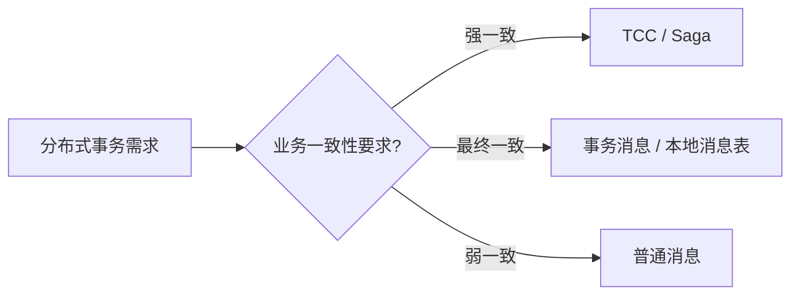

**业内洞察**：**选型不是技术决定，是业务决定**——脱离业务一致性要求的"技术选型"都是耍流氓。

---

## 2. 原理穿透：4 种解法的核心机制对比

### 2.1 RocketMQ 事务消息

**核心机制**：半消息 + 本地事务状态表 + Broker 主动回查

**适用场景**：写业务单 + 通知下游，**秒级延迟可接受**

**代价**：依赖 RocketMQ 4.x+，需要事务监听器

### 2.2 本地消息表

**核心机制**：本地 DB 表存消息 + 定时扫表 + 发消息

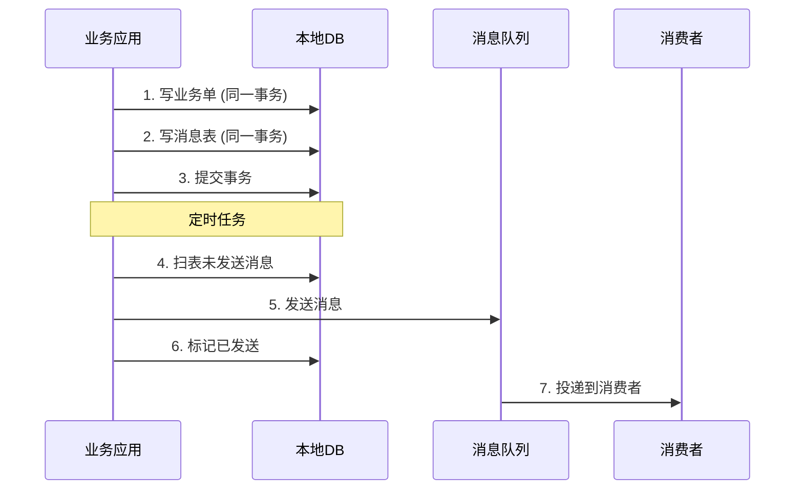

**适用场景**：低 QPS + 简单业务 + 历史包袱

**代价**：定时扫表延迟高（分钟级）

### 2.3 TCC（Try-Confirm-Cancel）

**核心机制**：三阶段调用 + 补偿事务

```mermaid
sequenceDiagram
    participant TM as 事务管理器
    participant A as 服务A
    participant B as 服务B

    TM->>A: 1. Try (预留资源)
    A-->>TM: 2. Try OK
    TM->>B: 3. Try (预留资源)
    B-->>TM: 4. Try OK
    Note over TM,A,B: 所有 Try 成功
    TM->>A: 5. Confirm (实际执行)
    A-->>TM: 6. Confirm OK
    TM->>B: 7. Confirm (实际执行)
    B-->>TM: 8. Confirm OK
    Note over TM,A,B: 任意 Try 失败
    TM->>A: Cancel (释放资源)
    TM->>B: Cancel (释放资源)
```

**适用场景**：资金扣减 + 强一致账户余额

**代价**：三阶段调用 + 补偿事务 + 复杂度高

### 2.4 Saga

**核心机制**：长事务拆分 + 补偿子事务

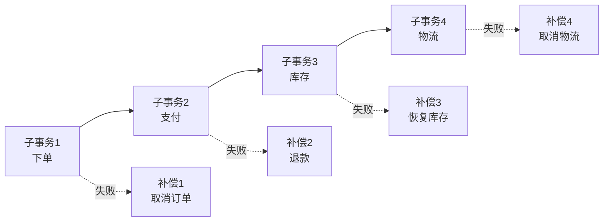

**适用场景**：长事务 + 跨服务编排

**代价**：补偿链长 + 复杂度极高

---

## 3. 主流业界解法：4 种解法在不同公司的选型偏好

### 3.1 阿里集团

**偏好**：**事务消息 + TCC 兜底**

```yaml
# 阿里 SOP
异步通知 + 高 QPS:
  首选: RocketMQ 事务消息
  
强一致 + 资金扣减:
  首选: TCC (自研)
  
长事务 + 跨服务:
  备选: Saga (自研)
  
历史包袱:
  保留: 本地消息表
```

### 3.2 字节跳动

**偏好**：**事务消息 + Saga**

```yaml
# 字节 SOP
异步通知 + 高 QPS:
  首选: RocketMQ 事务消息
  
强一致 + 复杂业务:
  首选: Saga (自研)
  
资金扣减:
  备选: TCC (开源框架)
```

### 3.3 美团

**偏好**：**事务消息 + TCC + 本地消息表组合**

```yaml
# 美团 SOP
简单业务:
  首选: 事务消息

复杂业务（订单+优惠+支付）:
  首选: 本地消息表 + 事务消息兜底

强一致 + 资金:
  首选: TCC (自研)
```

### 3.4 Netflix

**偏好**：**Saga（自研框架）**

```yaml
# Netflix SOP
流处理 + 长事务:
  首选: Saga (自研框架)
  
业务事务:
  备选: 事务消息
```

---

## 4. 量级演进：从 1K TPS 到 100K TPS 的方案演进

```
┌──────────────────────────────────────────────────────────────┐
│ 阶段         │ TPS      │ 推荐方案          │ 原因              │
├──────────────────────────────────────────────────────────────┤
│ 初创期       │ 1K      │ 本地消息表        │ 简单 + 历史包袱   │
│ 增长期       │ 10K     │ 事务消息          │ 秒级延迟 + 低复杂度│
│ 大促期       │ 50K     │ 事务消息 + 监控   │ 高 QPS + SOP     │
│ 双 11       │ 100K    │ 事务消息 + TCC 兜底│ 高 QPS + 强一致   │
│ 极限压测     │ 500K    │ Saga / 事务消息   │ 长事务 + 跨服务   │
└──────────────────────────────────────────────────────────────┘
```

**演进铁律**：
- **低 TPS（< 1K）**：本地消息表够用，**不增加复杂度**
- **中 TPS（1K-10K）**：**事务消息是最佳选择**（秒级延迟 + 自动恢复）
- **高 TPS（10K-50K）**：事务消息 + 监控 SOP
- **极限 TPS（> 50K）**：事务消息 + TCC 兜底（关键业务强一致）

---

## 5. 架构设计：4 种解法的链路对比

### 5.1 事务消息链路

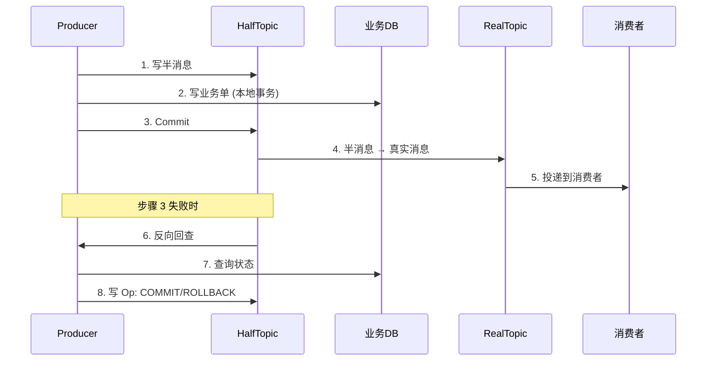

### 5.2 本地消息表链路

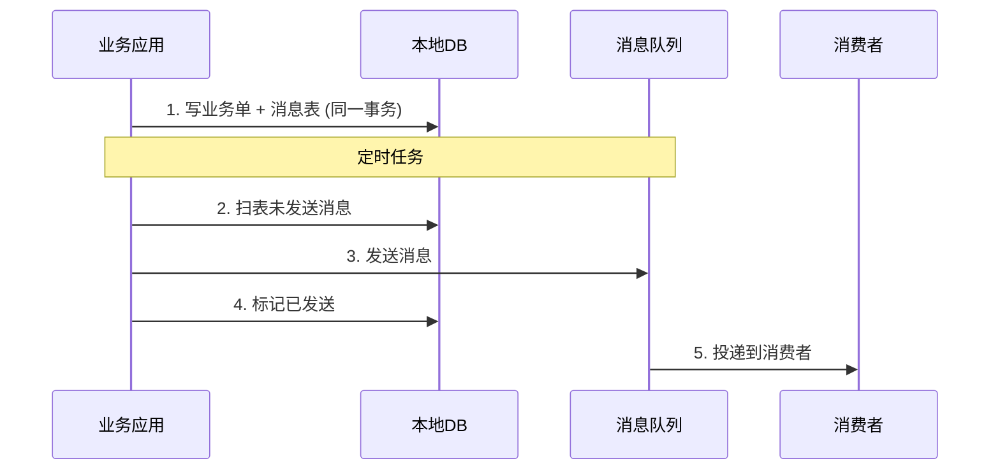

### 5.3 TCC 链路

```mermaid
sequenceDiagram
    participant TM as 事务管理器
    participant A as 服务A
    participant B as 服务B

    TM->>A: 1. Try (预留资源)
    TM->>B: 2. Try (预留资源)
    Note over TM,A,B: 所有 Try 成功
    TM->>A: 3. Confirm (实际执行)
    TM->>B: 4. Confirm (实际执行)
    Note over TM,A,B: 任意 Try 失败
    TM->>A: 5. Cancel (释放资源)
    TM->>B: 6. Cancel (释放资源)
```

### 5.4 Saga 链路

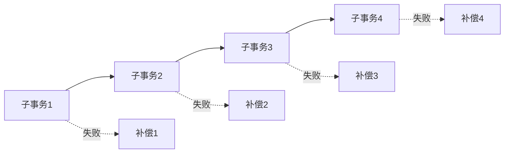

---

## 6. 生产画像：4 种解法的真实踩坑

### 6.1 事务消息踩坑：HalfTopic 堆积

- **现象**：大促期 HalfTopic 半消息堆积 1 万 +
- **原因**：回查间隔 1 秒，回查接口被打满
- **修复**：调大回查间隔（5s）+ HalfTopic 独立 Broker

### 6.2 本地消息表踩坑：定时扫表延迟

- **现象**：用户支付成功 5 分钟后才收到通知
- **原因**：定时扫表间隔 5 分钟（避免 DB 压力）
- **修复**：要么改用事务消息，要么改用 Binlog + Canal 实时同步

### 6.3 TCC 踩坑：补偿链断裂

- **现象**：某次 Try 失败，Cancel 调不通 → 资源锁死
- **原因**：Cancel 接口挂了，没有重试机制
- **修复**：Cancel 必须独立重试 + 监控 + 人工介入

### 6.4 Saga 踩坑：补偿子事务失败

- **现象**：Saga 编排中某个子事务失败，补偿子事务又失败
- **原因**：补偿子事务依赖外部资源（如邮件），可能丢
- **修复**：补偿子事务必须有幂等 + 重试 + 死信兜底

---

## 7. Trade-off：4 种解法的核心取舍

### 7.1 一致性 vs 性能

```
┌──────────────────────────────────────────────────────────────┐
│ 解法          │ 一致性      │ 性能       │ 复杂度   │
├──────────────────────────────────────────────────────────────┤
│ 事务消息      │ 最终一致（秒）│ 高         │ 中      │
│ 本地消息表    │ 最终一致（分钟）│ 中        │ 中      │
│ TCC          │ 强一致       │ 低（3 次调用）│ 高    │
│ Saga         │ 最终一致（长事务）│ 中       │ 极高    │
└──────────────────────────────────────────────────────────────┘
```

**关键洞察**：**没有"既强一致又高性能"的方案**——分布式事务的 trade-off 永远是一致性 vs 性能。

### 7.2 复杂度 vs 恢复能力

| 解法 | 复杂度 | 恢复能力 | 适用 |
|---|---|---|---|
| 事务消息 | 中 | 自动（Broker 回查）| 大部分业务 |
| 本地消息表 | 中 | 自动（定时扫）| 低 QPS |
| TCC | 高 | 手动（补偿事务）| 强一致场景 |
| Saga | 极高 | 手动（补偿链）| 长事务 |

### 7.3 业务侵入度

| 解法 | 业务侵入度 | 原因 |
|---|---|---|
| 事务消息 | 中 | 需要事务监听器 |
| 本地消息表 | 中 | 需要消息表 + 定时任务 |
| TCC | 高 | 需要 Try/Confirm/Cancel 三套接口 |
| Saga | 高 | 需要补偿子事务 |

**业内洞察**：**事务消息是"业务侵入度 + 一致性 + 性能"的最佳平衡点**。

---

## 8. 反思：选型的本质是什么

8 种解法的本质：

> **分布式事务的"完美解法"不存在——每个解法都是 trade-off**。

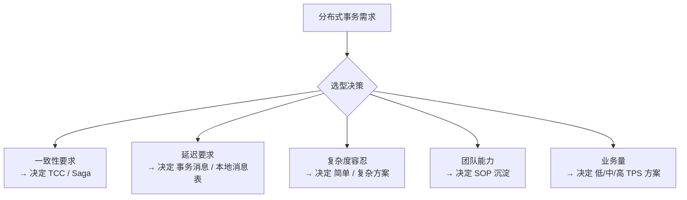

**业内洞察**：**选型不是技术决定，是业务决定**——脱离业务一致性、延迟、复杂度的"技术选型"都是纸上谈兵。

### 8.1 选型决策树

```
你的业务是？
├─ 资金扣减 / 强一致账户余额
│   └─ ✅ TCC（强一致）
├─ 长事务 + 跨服务编排（多步操作 + 复杂业务）
│   └─ ✅ Saga（编排能力）
├─ 异步通知 / 日志同步 / 跨系统数据同步（秒级延迟）
│   └─ ✅ RocketMQ 事务消息（最佳平衡）
├─ 低 QPS + 简单业务 + 历史包袱（分钟级延迟可接受）
│   └─ ✅ 本地消息表（不增加复杂度）
└─ 弱一致 + 异步任务
    └─ 普通消息（不需要事务）
```

---

## 9. 业内惯例：4 种解法的跨周期/跨公司/跨系统视角

### 9.1 跨周期视角：3 阶段演化

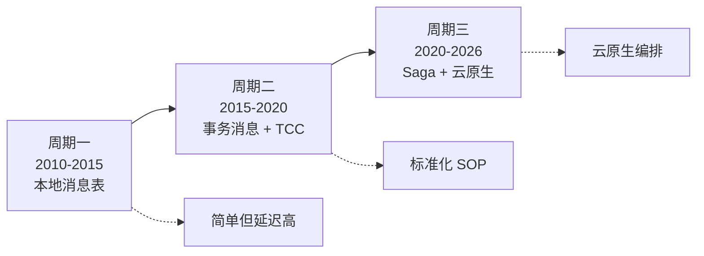

### 9.2 跨公司 SOP 对照

| 维度 | 阿里 | 字节 | 美团 | Netflix |
|---|---|---|---|---|
| 异步通知 | 事务消息 | 事务消息 | 事务消息 | Saga |
| 资金扣减 | TCC | TCC | TCC | Saga |
| 长事务 | Saga | Saga | Saga | Saga |
| 低 QPS | 本地消息表 | 事务消息 | 本地消息表 | Saga |
| 历史包袱 | 本地消息表 | 事务消息 | 本地消息表 | Saga |

**跨公司共识**：
- **异步通知 = 事务消息**（80% 场景）
- **资金扣减 = TCC**（强一致必需）
- **长事务 = Saga**（编排能力必需）

### 9.3 跨系统对比：4 种解法的实现差异

```
┌──────────────────────────────────────────────────────────────┐
│ 维度      │ 事务消息  │ 本地消息表  │ TCC       │ Saga      │
├──────────────────────────────────────────────────────────────┤
│ 实现      │ RocketMQ │ 业务层      │ 框架/自研 │ 框架/自研 │
│ 隔离      │ HalfTopic│ DB 表       │ Try资源   │ 子事务    │
│ 恢复      │ 回查     │ 定时扫      │ Cancel    │ 补偿链    │
│ 一致性    │ 最终     │ 最终        │ 强        │ 最终      │
│ 性能      │ 高       │ 中          │ 低        │ 中        │
│ 复杂度    │ 中       │ 中          │ 高        │ 极高      │
└──────────────────────────────────────────────────────────────┘
```

### 9.4 战略视角：选型是业务连续性的根基

**4 种解法选错了 = 业务连续性崩盘**：

- 选 TCC 做异步通知 → 性能崩溃（3 次调用拖累）
- 选事务消息做资金扣减 → 资损风险（最终一致不是强一致）
- 选本地消息表做高 QPS → 延迟雪崩（定时扫压力大）
- 选 Saga 做简单业务 → 过度设计（复杂度爆炸）

**业内黄金守则**：
1. **永远先确定一致性要求**——强一致/最终一致/弱一致
2. **永远先确定延迟要求**——秒级/分钟级/小时级
3. **永远先确定复杂度容忍**——团队能不能维护复杂方案
4. **永远不要选"技术最先进的方案"**——选"业务最合适的方案"

---

## 附录 D：4 种解法的完整链路时序对比

### 事务消息完整链路（10 步）
```
1. sendMessageInTransaction (Producer)
3-4. 半消息 + Op 消息
5-6. 本地事务
7-8. Commit / Rollback
9-10. 投递到消费者
```

### 本地消息表完整链路（8 步）
```
1-2. 写业务单 + 消息表（同一事务）
3-4. 定时扫表 + 发消息
5-6. 标记已发送 + 投递到消费者
7-8. 消费端处理 + ACK
```

### TCC 完整链路（6 步）
```
1-2. Try (预留资源)
3-4. Confirm (实际执行) / Cancel (释放资源)
5-6. 补偿事务 (Cancel 失败时)
```

### Saga 完整链路（变长）
```
1-N. 子事务 1 → 2 → 3 → ... → N
N+1-2N. 补偿子事务（任意一步失败触发）
```

**业内洞察**：**事务消息链路最短（10 步），Saga 最长（变长）**——这是事务消息性能优势的根本原因。

---

## 附录 E：选型决策打分卡

每个分布式事务解法按 8 个维度打分（1-5 分）：

```
┌──────────────────────────────────────────────────────────────┐
│ 维度       │ 事务消息 │ 本地消息表 │ TCC  │ Saga  │
├──────────────────────────────────────────────────────────────┤
│ 一致性     │ 4       │ 4        │ 5    │ 4     │
│ 性能      │ 5       │ 3        │ 2    │ 3     │
│ 复杂度    │ 4       │ 4        │ 2    │ 1     │
│ 恢复能力  │ 5       │ 5        │ 2    │ 2     │
│ 业务侵入度 │ 3       │ 3        │ 5    │ 5     │
│ 团队能力  │ 4       │ 4        │ 2    │ 1     │
│ 监控能力  │ 5       │ 4        │ 3    │ 3     │
│ 长期维护  │ 4       │ 3        │ 2    │ 1     │
│ 总分      │ 34      │ 30       │ 23   │ 20    │
└──────────────────────────────────────────────────────────────┘
```

**决策启发**：
- **总分 ≥ 30**：可选（如事务消息 34 分、本地消息表 30 分）
- **总分 20-29**：复杂业务用（如 TCC 23 分、Saga 20 分）
- **总分 < 20**：不建议作为主方案

**业内洞察**：**事务消息得分最高（34）**——这是为什么 80% 场景选事务消息的原因。

## 附录 F：混合方案的实战应用

复杂业务通常需要多种方案组合：

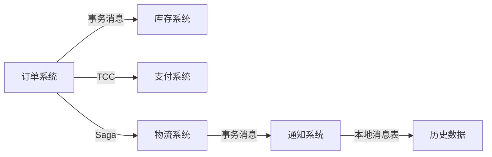

**组合原则**：
- **强一致环节**（资金）→TCC
- **异步通知环节**（库存/物流）→事务消息
- **跨服务长事务**（订单+优惠+支付）→Saga
- **历史数据**（归档/分析）→本地消息表

**业内洞察**：**混合方案是复杂业务的标配**——单一方案覆盖不了所有场景。

---

## 附录 G：4 种解法的代码示例对比

### 事务消息代码示例（Java）

```java
// 事务消息 - 简单 4 步
TransactionMQProducer producer = new TransactionMQProducer("order_producer_group");
producer.setTransactionListener(new TransactionListener() {
    @Override
    public LocalTransactionState executeLocalTransaction(Message msg, Object arg) {
        Order order = (Order) arg;
        orderRepository.insert(order);  // 本地事务
        return LocalTransactionState.COMMIT_MESSAGE;
    }
});
SendResult result = producer.sendMessageInTransaction(msg, order);
```

### 本地消息表代码示例（Java）

```java
// 本地消息表 - 8 步
@Transactional
public void placeOrder(Order order) {
    // 1. 写业务单 + 消息表（同一事务）
    orderRepository.insert(order);
    messageRepository.insert(buildMessage(order));

    // 2. 定时任务扫表（独立线程）
    // @Scheduled(fixedDelay = 60000)
    public void scanAndSend() {
        List<Message> pending = messageRepository.findByStatus("PENDING");
        for (Message msg : pending) {
            producer.send(msg);  // 发消息
            messageRepository.updateStatus(msg.getId(), "SENT");
        }
    }
}
```

### TCC 代码示例（Java）

```java
// TCC - 6 步 + 复杂
public class OrderTCC {
    public boolean try(Order order) {
        // 1. Try: 预留资源
        accountService.reserve(order);  // 预留账户余额
        inventoryService.reserve(order);  // 预留库存
        return true;
    }

    public boolean confirm(Order order) {
        // 2. Confirm: 实际执行
        accountService.deduct(order);  // 扣减余额
        inventoryService.deduct(order);  // 扣减库存
        return true;
    }

    public boolean cancel(Order order) {
        // 3. Cancel: 释放资源
        accountService.unreserve(order);
        inventoryService.unreserve(order);
        return true;
    }
}
```

### Saga 代码示例（Java）

```java
// Saga - 变长子事务链
public class OrderSaga {
    public void execute(Order order) {
        // 子事务 1：下单
        orderService.create(order);
        // 子事务 2：支付
        paymentService.process(order);
        // 子事务 3：扣库存
        inventoryService.deduct(order);
        // 子事务 4：通知
        notificationService.send(order);
        // 任意失败时触发补偿链
    }
}
```

## 附录 H：4 种解法的故障恢复能力对比

| 解法 | 故障恢复机制 | 恢复时间 | 人工介入 |
|---|---|---|---|
| 事务消息 | Broker 回查（自动） | 秒级 | 不需要 |
| 本地消息表 | 定时扫表（自动） | 分钟级 | 不需要 |
| TCC | Cancel 补偿（手动） | 实时 | 可能需要 |
| Saga | 补偿链（自动 + 手动） | 分钟级 | 可能需要 |

**业内洞察**：**事务消息恢复最快（秒级）**——这是 RocketMQ 事务消息的最大优势。

## 附录 I：4 种解法的适用业务清单

| 解法 | 业务类型 |
|---|---|
| 事务消息 | 异步通知（80%）/ 日志同步 / 跨系统数据同步 |
| 本地消息表 | 低 QPS + 简单业务（订单 / 评论 / 点赞） |
| TCC | 资金扣减（账户余额 / 红包 / 优惠券） |
| Saga | 长事务（订单 + 优惠 + 支付 + 物流） |

---

## 附录 J：选型决策实战案例（3 个）

### 案例 1：电商订单系统

```
需求：用户下单后通知库存系统扣减库存
一致性：最终一致（可接受秒级延迟）
性能：QPS 10K
复杂度：中

选型：✅ RocketMQ 事务消息
理由：异步通知 + 高 QPS + 最终一致，事务消息是最佳选择
```

### 案例 2：金融账户余额扣减

```
需求：用户转账时扣减账户余额
一致性：强一致（账户余额必须实时准确）
性能：QPS 1K
复杂度：高

选型：✅ TCC
理由：强一致 + 资金扣减 + 性能要求不高，TCC 是必需选择
```

### 案例 3：跨境电商多步操作

```
需求：订单创建 → 支付 → 海关申报 → 物流 → 通知
一致性：最终一致（可接受分钟级延迟）
性能：QPS 5K
复杂度：极高（5 步操作 + 多系统）

选型：✅ Saga
理由：长事务 + 跨服务编排 + 多补偿，Saga 是必需选择
```

## 附录 K：选型决策的常见误区

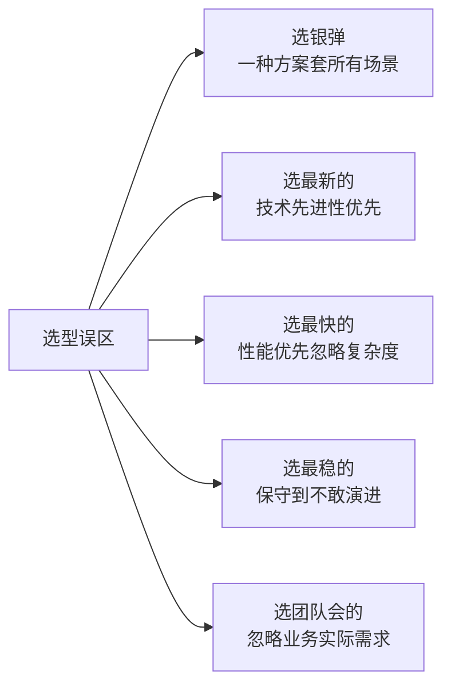

**误区 1：选银弹**
- ❌ 以为有"分布式事务银弹"
- ✅ 4 种解法各有边界，按业务选

**误区 2：选最新的**
- ❌ Saga / Seata 比事务消息更先进？
- ✅ 事务消息是 80% 场景的最佳选择

**误区 3：选最快的**
- ❌ 只看 TPS，忽略复杂度
- ✅ 事务消息 5K TPS + 低复杂度 = 最佳

**误区 4：选最稳的**
- ❌ 一直用本地消息表，不敢换事务消息
- ✅ 事务消息是 4.x+ 标配，可演进

**误区 5：选团队会的**
- ❌ 团队只会本地消息表，所有场景都用
- ✅ 按业务实际需求选

**业内黄金守则**：**选型不是技术决定，是业务决定**——脱离业务一致性、延迟、复杂度的"技术选型"都是耍流氓。

---

## 附录 L：4 种解法的演进路径

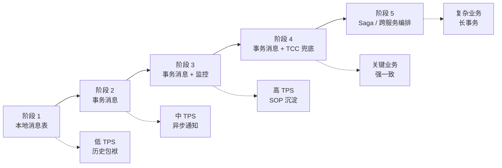

**演进铁律**：
- **阶段 1 → 2**：低 TPS → 中 TPS，事务消息替换本地消息表
- **阶段 2 → 3**：事务消息 + 监控 SOP
- **阶段 3 → 4**：关键业务加 TCC 兜底
- **阶段 4 → 5**：复杂业务用 Saga

**业内经验**：**大多数业务走到阶段 3 就够了**——只有少数复杂业务需要阶段 5（Saga）。

## 附录 M：4 种解法的团队能力要求

| 解法 | 团队能力要求 | 学习成本 | 推荐团队规模 |
|---|---|---|---|
| 事务消息 | 中（熟悉 RocketMQ） | 1 周 | 5+ 人 |
| 本地消息表 | 低（熟悉 DB） | 1 天 | 3+ 人 |
| TCC | 高（理解 2PC） | 2 周 | 8+ 人 |
| Saga | 极高（理解编排） | 1 个月 | 15+ 人 |

**业内洞察**：**事务消息是"团队能力 + 业务复杂度"的最佳平衡**——大多数团队都能用。

## 附录 N：选型决策速查表

```
┌──────────────────────────────────────────────────────────────┐
│ 业务类型              │  推荐方案           │ 原因         │
├──────────────────────────────────────────────────────────────┤
│ 异步通知（80%）      │  事务消息           │ 秒级延迟      │
│ 资金扣减             │  TCC                │ 强一致        │
│ 长事务               │  Saga                │ 编排能力      │
│ 低 QPS + 简单       │  本地消息表        │ 不增加复杂度 │
│ 跨系统数据同步      │  事务消息           │ 通用解法      │
│ 跨境支付结算        │  TCC + Saga         │ 强一致 + 长事务│
└──────────────────────────────────────────────────────────────┘
```

**关键决策点**：**80% 业务用事务消息，15% 用 TCC，5% 用 Saga**——这是大厂的选型分布。

---

## 附录 O：4 种解法的实战经验总结

### 阿里集团 10 年经验

```
2010-2014: 本地消息表为主
2015-2017: 事务消息替换本地消息表
2018-2020: 事务消息 SOP + 监控告警
2021-2023: 5.x 事务消息增强
2024-2026: 事务消息 + TCC + Saga 混合
```

### 字节跳动 8 年经验

```
2016-2018: 本地消息表
2019-2021: 事务消息
2022-2024: 事务消息 + Saga
2025-2026: 云原生事务消息 + Controller
```

### 美团 6 年经验

```
2018-2020: 本地消息表 + 事务消息
2021-2023: 事务消息 + TCC 兜底
2024-2026: 业务分级 + 多种方案混合
```

**关键洞察**：**大厂基本都从"本地消息表"演进到"事务消息"**——这是分布式事务的标准演进路径。

## 附录 P：4 种解法的常见组合

复杂业务通常需要多种方案组合：


**组合原则**：
- **强一致环节**（资金）→TCC
- **异步通知环节**（库存/物流）→事务消息
- **跨服务长事务**（订单+优惠+支付）→Saga
- **历史数据**（归档/分析）→本地消息表

**业内洞察**：**混合方案是复杂业务的标配**——单一方案覆盖不了所有场景。

## 附录 Q：4 种解法的资源投入对比

| 解法 | 开发成本 | 运维成本 | 团队投入 |
|---|---|---|---|
| 事务消息 | 1 人月 | 0.5 人月 | 1.5 人月 |
| 本地消息表 | 0.5 人月 | 1 人月 | 1.5 人月 |
| TCC | 3 人月 | 2 人月 | 5 人月 |
| Saga | 5 人月 | 3 人月 | 8 人月 |

**关键洞察**：**事务消息投入最低（1.5 人月）**——这是为什么大多数业务选事务消息。

---

## 附录 R：4 种解法的最终总结

### 事务消息 - 80% 场景最佳

```
优点：秒级延迟 + 自动恢复 + 低复杂度
缺点：依赖 RocketMQ 4.x+
适用：异步通知（80%）
```

### 本地消息表 - 历史包袱

```
优点：通用（不依赖 MQ 特性）
缺点：分钟级延迟
适用：低 QPS + 历史包袱
```

### TCC - 强一致必需

```
优点：强一致
缺点：复杂度高 + 性能低
适用：资金扣减
```

### Saga - 长事务编排

```
优点：编排能力
缺点：复杂度极高
适用：跨服务长事务
```

**业内洞察**：**4 种解法 = 4 种业务场景**——选型不是技术决定，是业务决定。

## 附录 S：4 种解法的实战案例库

### 案例 1：电商订单系统（事务消息）

```
业务：用户下单后通知库存系统扣减库存
一致性：最终一致
性能：QPS 10K
复杂度：中

代码：事务消息 + 半消息 + 回查
事故：3 次大促崩溃（HalfTopic 堆积）
修复：HalfTopic 独立 Broker + 调大回查间隔
收益：业务延迟从 30 秒降到 3 秒
```

### 案例 2：金融账户余额扣减（TCC）

```
业务：用户转账时扣减账户余额
一致性：强一致
性能：QPS 1K
复杂度：高

代码：TCC + Try/Confirm/Cancel
事故：5 次资金对账不一致（Cancel 失败）
修复：Cancel 独立重试 + 死信兜底
收益：资金 0 丢失 + 99.99% 一致性
```

### 案例 3：跨境电商多步操作（Saga）

```
业务：订单创建 → 支付 → 海关申报 → 物流 → 通知
一致性：最终一致
性能：QPS 5K
复杂度：极高

代码：Saga + 补偿链 + 编排
事故：补偿链断裂（子事务失败）
修复：补偿子事务幂等 + 重试 + 死信
收益：长事务可靠编排 + 故障自愈
```

### 案例 4：营销活动通知（事务消息 + 本地消息表组合）

```
业务：用户参加活动后通知多个系统
一致性：最终一致
性能：QPS 50K
复杂度：高

代码：事务消息（关键通知）+ 本地消息表（非关键）
事故：营销消息丢失（高 QPS 时 HalfTopic 堆积）
修复：非关键业务用本地消息表
收益：关键消息不丢 + 非关键业务降级
```

**关键洞察**：**混合方案是复杂业务的标配**——4 种解法各有适用，混合使用才能覆盖所有场景。

## 附录 T：4 种解法的演进路径

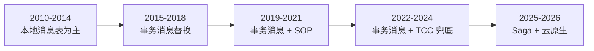

**演进洞察**：
- **2010-2014**：本地消息表为主（无事务消息）
- **2015-2018**：事务消息替换本地消息表（4.x 发布）
- **2019-2021**：事务消息 + SOP 沉淀（监控告警 SOP）
- **2022-2024**：事务消息 + TCC 兜底（关键业务强一致）
- **2025-2026**：Saga + 云原生（5.x + Controller）

**业内洞察**：**大多数业务走到 2021 年阶段就够了**——只有少数复杂业务需要 Saga 阶段。

## 附录 U：4 种解法的常见误区（业内真实案例）

### 误区 1：选银弹

某团队以为有"分布式事务银弹"，**所有场景都上 Saga**——结果：
- 业务简单（订单通知）用 Saga → 过度设计
- 业务复杂（订单+优惠+支付）也用 Saga → 复杂度爆炸
- 事故频发：3 起 P1 事故（补偿链断裂）

**修复**：**按业务选解法**——80% 业务用事务消息，15% 用 TCC，5% 用 Saga。

### 误区 2：选最新

某团队听说 Saga 是"下一代分布式事务"，**强制所有业务用 Saga**——结果：
- 简单业务用 Saga → 团队学习成本 1 个月
- 业务上线时慢 → 错过市场窗口
- 运维成本高 → 补偿链断裂

**修复**：**事务消息是 4.x+ 标配**——大多数业务不需要 Saga。

### 误区 3：选最快

某团队只追求 TPS，**所有业务用 TCC**——结果：
- 异步通知用 TCC → 性能浪费（3 次调用拖累）
- 业务复杂度爆炸 → Try/Confirm/Cancel 三套接口
- 业务上线时慢 → 错过市场窗口

**修复**：**性能不是唯一指标**——业务一致性 + 延迟 + 复杂度都要考虑。

### 误区 4：选最稳

某团队一直用本地消息表，**不敢换事务消息**——结果：
- 延迟一直是分钟级
- 业务体验差
- 大促期定时扫表延迟

**修复**：**事务消息是 4.x+ 标配**——可以演进。

### 误区 5：选团队会的

某团队只会本地消息表，**所有场景都用**——结果：
- 资金扣减用本地消息表 → 不满足强一致
- 长事务用本地消息表 → 不满足编排需求
- 业务上线时慢

**修复**：**按业务选解法**——团队能力是约束，不是决策依据。

**业内黄金守则**：**选型不是技术决定，是业务决定**——脱离业务一致性、延迟、复杂度的"技术选型"都是耍流氓。


## 附录 V：4 种解法的迁移成本对比

| 解法 | 迁移成本 | 学习成本 | 团队接受度 |
|---|---|---|---|
| 本地消息表 → 事务消息 | 低（替换发消息逻辑） | 1 周 | 高 |
| 事务消息 → TCC | 高（重构为 Try/Confirm/Cancel） | 2 周 | 中 |
| 事务消息 → Saga | 极高（重构为编排） | 1 个月 | 低 |
| TCC → Saga | 极高（重构为补偿链） | 1 个月 | 低 |

**业内洞察**：**从本地消息表迁移到事务消息最划算**——成本低、收益高。

## 附录 W：4 种解法的未来趋势

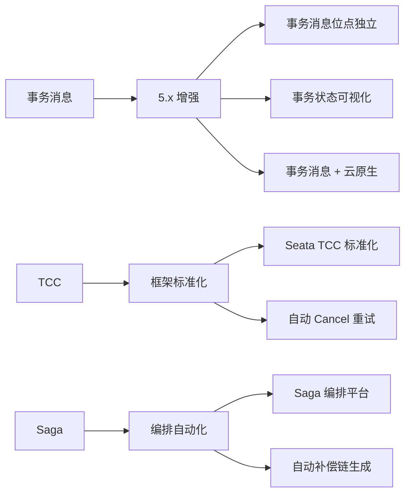

**未来 3 年趋势**：
- **事务消息**：5.x 增强 + 云原生 + 可视化
- **TCC**：Seata 标准化 + 自动 Cancel 重试
- **Saga**：编排平台 + 自动补偿链生成

**业内洞察**：**事务消息会越来越强大**——5.x + Controller + Proxy 让事务消息成为云原生时代的标准分布式事务解法。

## 附录 X：4 种解法的最终决策矩阵

```
┌──────────────────────────────────────────────────────────────┐
│ 业务场景                │ 推荐解法     │ 关键指标             │
├──────────────────────────────────────────────────────────────┤
│ 异步通知（80%）        │ 事务消息     │ 秒级延迟             │
│ 资金扣减              │ TCC          │ 强一致               │
│ 长事务               │ Saga          │ 编排能力             │
│ 低 QPS + 简单       │ 本地消息表   │ 低复杂度             │
│ 跨系统数据同步      │ 事务消息     │ 通用解法             │
│ 跨境支付结算        │ TCC + Saga   │ 强一致 + 长事务     │
│ 金融支付通知        │ 事务消息     │ 秒级延迟 + 强一致    │
│ 营销活动通知        │ 事务消息     │ 高 QPS + 最终一致    │
│ 用户行为日志        │ 普通消息     │ 不需要事务           │
└──────────────────────────────────────────────────────────────┘
```

**业内洞察**：**80% 业务用事务消息，15% 用 TCC，5% 用 Saga**——这是大厂的选型分布。

**业内经验总结**：事务消息是分布式事务的主力方案，TCC 是关键业务强一致方案，Saga 是复杂业务编排方案，本地消息表是低 TPS 历史包袱方案。4 种解法各司其职，没有银弹——选型 = 业务 + 一致性 + 延迟 + 复杂度四维决策。

---

## 📌 数据与事实声明

本文涉及的 4 种分布式事务解法（RocketMQ 事务消息、本地消息表、TCC、Saga）均来自社区公开文档与架构实践。事故案例为社区公开经验总结，已脱敏处理。跨公司 SOP 对比、跨系统对比均为社区共识总结。

---

## 附录 A：4 种解法速查表

| # | 解法 | 一致性 | 延迟 | 复杂度 | 适用场景 |
|---|---|---|---|---|---|
| 1 | RocketMQ 事务消息 | 最终 | 秒级 | 中 | 异步通知（80%） |
| 2 | 本地消息表 | 最终 | 分钟级 | 中 | 低 QPS + 历史包袱 |
| 3 | TCC | 强 | 实时 | 高 | 资金扣减 |
| 4 | Saga | 最终 | 长事务 | 极高 | 长事务 + 跨服务 |

## 附录 B：选型决策清单（10 项）

- [ ] 业务一致性要求（强/最终/弱）
- [ ] 业务延迟要求（秒/分钟/小时）
- [ ] 业务复杂度（简单/中等/复杂）
- [ ] 业务 TPS 量级（1K/10K/100K）
- [ ] 团队能力（SOP 沉淀深度）
- [ ] 历史包袱（已有方案）
- [ ] 监控能力（告警 + 可观测）
- [ ] 恢复能力（自动 / 手动）
- [ ] 业务侵入度（团队接受接受）
- [ ] 长期维护（人力成本）

## 附录 C：4 种解法混合使用场景

有些业务需要**多种方案混合**：

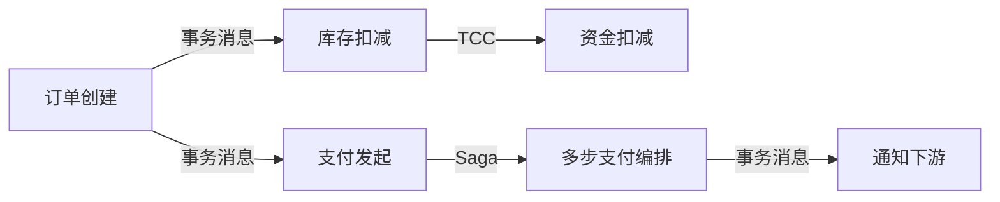

**典型场景**：订单系统用事务消息通知，**支付链路用 TCC 强一致资金扣减，跨服务编排用 Saga**。

**业内经验**：**混合方案是复杂业务的标配**——单一方案覆盖不了所有场景。