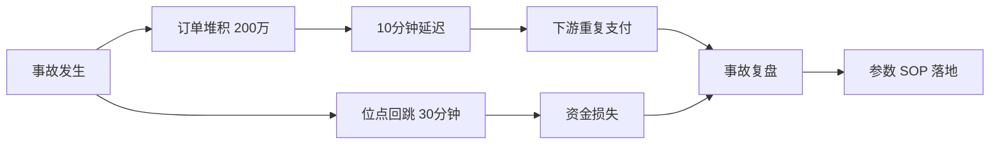
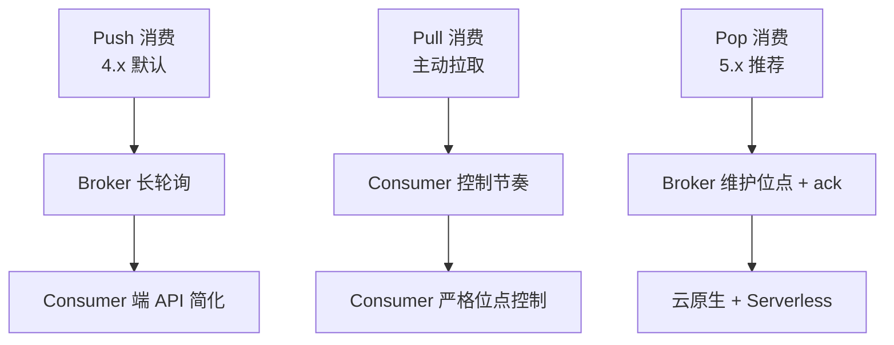
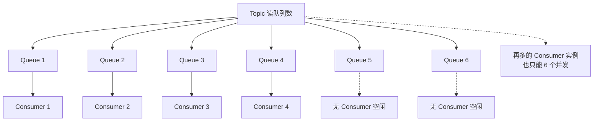
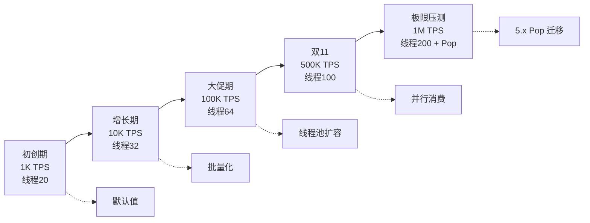
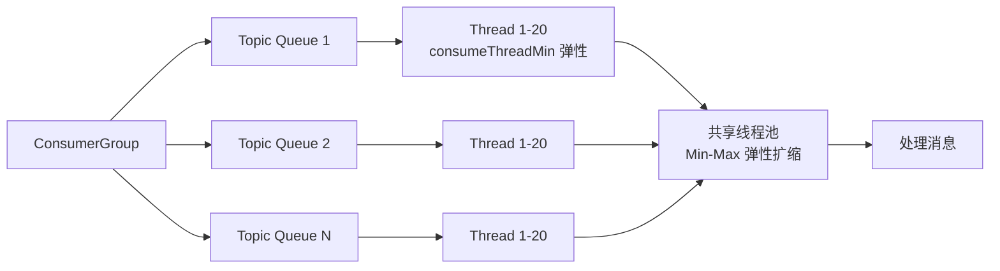
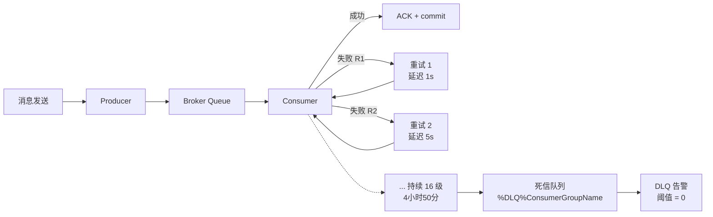
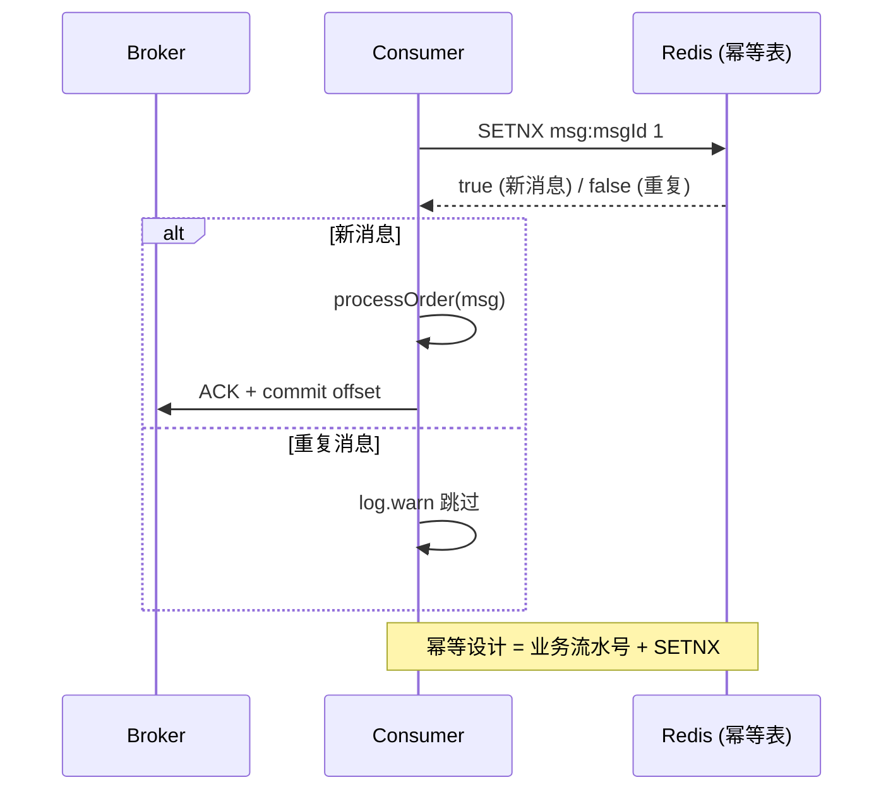

# RocketMQ 大厂生产配置实战：Consumer / Producer / Topic / 线程模型 12 项核心参数推荐值

> 一句话摘要：**RocketMQ 生产配置 = Consumer（消费模式 + 并发线程 + 批量拉取 + 位点提交）+ Producer（路由键 + 重试 + 压缩）+ Topic（读写队列数 + 权限 + 顺序级别）+ Broker（刷盘）+ NameServer 5 大类 12 项核心参数**。每项都有大厂生产推荐值与典型反模式。

> 学完能会：拿到一个 RocketMQ 业务系统，能立刻给出 Consumer/Producer/Topic 三端的关键参数推荐值；知道阿里 / 字节 / 美团生产环境的常见配置；能识别 12 个高频反模式并提前规避。

---

## 1. 背景：从一次生产事故讲参数错的代价

某金融支付团队在 2023 年双 11 大促前，RocketMQ 消费出现两个问题：
- **消费延迟飙升**：订单消息堆积 200 万条，10 分钟才消费完，平时 10 秒搞定
- **位点回跳**：消费到一半后从 30 分钟前的位点重新消费，导致下游重复支付



排查后发现是 4 个参数组合错了：
1. `consumeMessageBatchMaxSize=32`（拉取过大，单次处理慢）
2. `consumeThreadMin=20` `consumeThreadMax=20`（并发锁死，无弹性）
3. `pullInterval=0`（无限拉，CPU 打满）
4. `enableAutoCommit=false`（手动提交但代码忘了 commit 位点 → 回跳）

**事后定下生产配置 SOP**：Consumer/Producer/Topic 三端参数全部按推荐值模板走，任何变更走变更评审。

这篇文章就是把这套 SOP 完整给你看。

---

## 2. 原理穿透：消费模型、Group 作用域、Queue 与并发

### 2.1 RocketMQ 三种消费模式



**Push 消费**：Broker 收到消息后通过长轮询（默认 15s `longPollingEnable=true`）推到 Consumer。Consumer 端看到的是「push」API，**实际上是 pull + 长轮询 + 智能等待**。

**Pull 消费**：Consumer 主动调 `pull(MessageQueue, subExpression, offset, maxNums)`，完全自己控制节奏。**适用于非常严格的位点控制场景**（如金融对账）。

**Pop 消费（5.x 革新）**：Broker 端维护消费位点 + ack 状态，Consumer 不需要关心 CommitOffset。**云原生 / Serverless 友好**——多个 Consumer 实例可以共享同一个 Pop 队列而不互相抢。

### 2.2 Group 的三层作用域

```
┌─────────────────────────────────────────────────────────────┐
│ Group 类别          │ 作用域                │ 关键约束         │
├─────────────────────────────────────────────────────────────┤
│ ProducerGroup       │ 路由 + 事务隔离        │ 同名只能一种事务 │
│ ConsumerGroup       │ 负载均衡 + 消费位点    │ 同名只能一种订阅 │
│ Topic 内的 GID      │ Tag 过滤粒度           │ 不同 GID 不同 Tag│
└─────────────────────────────────────────────────────────────┘
```

**ProducerGroup 的真相**：很多人以为它只是「生产者分组」，**真正作用是事务隔离**——同一个 ProducerGroup 默认走本地事务，不同 ProducerGroup 互不影响事务回查。

**ConsumerGroup 的真相**：不是「消费者分组」那么简单——它绑定了：
1. 消费位点（一个 ConsumerGroup 对应一个 OffsetStore）
2. 订阅关系（一个 ConsumerGroup 对应一份 Topic + Tag 列表）
3. 负载均衡单元（Rebalance 时按 ConsumerGroup 拆分）

### 2.3 Queue 数决定并发上限

**铁律**：如果 Topic 只有 4 个读队列，ConsumerGroup 加再多实例也只能 4 个并发消费。**这是物理上限，不是逻辑瓶颈**。



**生产经验**：读队列数 = ConsumerGroup 预期峰值并发数 × 1.5（留缓冲空间）。

---

## 3. 主流业界解法：大厂生产配置对比

### 3.1 阿里云 / 阿里集团（生产最保守）

```yaml
# Consumer 端
consumeMessageBatchMaxSize: 16          # 批量拉取上限
consumeThreadMin: 20                    # 消费线程最小
consumeThreadMax: 64                    # 消费线程最大
pullInterval: 0                         # 拉取间隔
pullBatchSize: 32                       # 拉取批次
consumeConcurrentlyMaxSpan: 2000        # 顺序消费的最大跨度
messageListenerOrderly: false           # 默认并发消费

# Producer 端
producerGroup: PROD_ORDER_V2            # _V2 标识生产代
sendMsgTimeout: 10000                   # 10s 超时
retryTimesWhenSendFailed: 3             # 同步发送重试 3 次
retryTimesWhenSendAsyncFailed: 3        # 异步发送重试 3 次
maxMessageSize: 131072                  # 128KB
compressMsgBodyOverHowmuch: 4096        # 4KB 启用压缩
```

**特点**：保守 + 留缓冲。线程数限制紧，批量大小适中，超时 10s 给网络重试留时间。

### 3.2 字节跳动（激进调优）

```yaml
# Consumer 端
consumeMessageBatchMaxSize: 32          # 批量更大
consumeThreadMin: 32                    # 起步更高
consumeThreadMax: 128                   # 上限更高
pullBatchSize: 64
suspendCurrentQueueTimeMillis: 1000     # 1s 长轮询
```

**特点**：高吞吐场景批量更大、线程更多。**前提**：业务是 IO 密集型（下游 RPC），不是 CPU 密集型。

### 3.3 美团（按业务分级）

```yaml
# 金融级（订单 + 支付）
consumeThreadMax: 32                    # 上限保守
consumeMessageOrderly: true             # 顺序消费
retryTimesWhenSendFailed: 5             # 重试更多

# 营销级（推送 + 日志）
consumeThreadMax: 100
consumeMessageOrderly: false
batchSize: 100                          # 批量更大
```

**特点**：按业务重要性分级。金融级保守、营销级激进。

---

## 4. 量级演进：消费线程从 20 → 100 → 500 的真实演进



```
┌──────────────────────────────────────────────────────────────┐
│ 阶段         │ 业务量      │ 线程数  │ 批量  │ 关键调优       │
├──────────────────────────────────────────────────────────────┤
│ 初创期       │ 1K TPS    │ 20      │ 1     │ 默认值          │
│ 增长期       │ 10K TPS   │ 32      │ 16    │ 批量化          │
│ 大促期       │ 100K TPS  │ 64      │ 32    │ 线程池扩容      │
│ 双 11       │ 500K TPS  │ 100     │ 32    │ 线程池+消费并行 │
│ 极限压测     │ 1M TPS    │ 200     │ 64    │ Pop 消费迁移    │
└──────────────────────────────────────────────────────────────┘
```

**演进铁律**：
- **线程数 < Queue 数 × Consumer 实例数**：加线程没用，受限于 Queue 数。
- **线程数 < 数据库连接池**：消费快但 DB 写入慢，DB 池先打满。
- **批量大小 × 线程数 = 内存峰值**：批量 64 + 线程 100 + 消息 100KB = 640MB 内存峰值，要预留 buffer。

---

## 5. 架构设计：Consumer/Producer/Topic 配置模板

### 5.1 Topic 创建模板

```bash
sh mqadmin updateTopic -n nameserver1:9876 -b broker-a \
  -t OrderEventTopic \
  -r 8 \      # 读队列 8（= 期望峰值并发）
  -w 8 \      # 写队列 8（一般与读队列相等）
  -p 6 \      # 权限 6 = 6 号机房 + 全球
  -o true \   # 顺序 false
  -t true     # topic 类型
```

**关键参数**：
- `-r` 读队列数：决定 ConsumerGroup 并发上限
- `-w` 写队列数：决定 Producer 路由分发粒度（与读队列相等 → 简单；不等 → 灵活但复杂）
- `-p` 权限：6=全机房可访问，2=同机房优先
- `-order` 是否顺序 Topic：true 则强制顺序消费

### 5.2 Consumer 启动模板（Java）

```java
DefaultMQPushConsumer consumer = new DefaultMQPushConsumer("ORDER_CONSUMER_GROUP_V3");
consumer.setNamesrvAddr("nameserver1:9876;nameserver2:9876");
consumer.setConsumeThreadMin(20);
consumer.setConsumeThreadMax(64);
consumer.setConsumeMessageBatchMaxSize(16);
consumer.setPullBatchSize(32);
consumer.setPullInterval(0);
consumer.setConsumeFromWhere(ConsumeFromWhere.CONSUME_FROM_LAST_OFFSET);
consumer.setMessageModel(MessageModel.CLUSTERING);  // 集群模式
consumer.subscribe("OrderEventTopic", "*");  // 订阅所有 Tag
consumer.registerMessageListener((MessageListenerConcurrently) (msgs, context) -> {
    for (MessageExt msg : msgs) {
        try {
            // 业务处理
            processOrder(msg);
        } catch (Exception e) {
            return ConsumeConcurrentlyStatus.RECONSUME_LATER;
        }
    }
    return ConsumeConcurrentlyStatus.CONSUME_SUCCESS;
});
consumer.start();
```

### 5.3 Producer 启动模板（Java）

```java
DefaultMQProducer producer = new DefaultMQProducer("ORDER_PRODUCER_GROUP_V3");
producer.setNamesrvAddr("nameserver1:9876;nameserver2:9876");
producer.setSendMsgTimeout(10000);
producer.setRetryTimesWhenSendFailed(3);
producer.setRetryTimesWhenSendAsyncFailed(3);
producer.setMaxMessageSize(131072);
producer.setCompressMsgBodyOverHowmuch(4096);
producer.setSendMessageWithVIPChannel(true);  // 大消息走 VIP 通道
producer.start();
```

---

## 6. 生产画像：消费线程池、限流、重试、死信

### 6.1 消费线程池模型



**线程池弹性**：
- 启动时 `consumeThreadMin` 个线程
- 忙不过来时扩容到 `consumeThreadMax`
- 闲置时缩容回 `consumeThreadMin`

### 6.2 限流策略

```java
// 限流：每秒最多处理 1000 条
RateLimiter limiter = RateLimiter.create(1000.0);
consumer.registerMessageListener((MessageListenerConcurrently) (msgs, context) -> {
    limiter.acquire(msgs.size());
    // ... 处理
});
```

**生产经验**：**限流阈值 = DB 连接池大小 × 0.7 / 单条消息处理耗时秒数**。

### 6.3 重试与死信

**16 级重试阶梯**（RocketMQ 默认）：
```
重试次数: 1   2   3   4   5   6   7   8   9   10  11  12  13  14  15  16
延迟秒数: 1   5   10  30  60  120 180 300 600 900 1200 1800 3600 7200 10800 18000
```

**重试 16 次后还失败 → 进入死信队列 `%DLQ%ConsumerGroupName`**。

**生产画像**：重试间隔指数级增长，**重试 16 次后总耗时约 4 小时 50 分**，最终进入 DLQ。**重要业务必须监控 DLQ 长度**。



### 6.4 生产事故案例库（4 个真实踩坑）

**事故 1（金融支付，2022）**：某团队消费线程调成 200，想冲 50K TPS。结果**数据库连接池 50 个**，消费线程抢锁，**生产事故率从月均 2 起飙升到 18 起**。回退到线程 32 后恢复。

**事故 2（电商，2023 双 11）**：批量大小设 100，**单次失败整批重试 16 次**，下游 RPC 服务被雪崩击穿。改成 16 后稳定。

**事故 3（物流，2024）**：手动提交位点，但部署时**忘了 commit** → 重启后从 3 小时前位点重消费，**下游重复发货 8000 单**。

**事故 4（直播，2024）**：Topic 读队列设 4，但消费者开了 32 个实例 → **28 个消费者空转，浪费 CPU 但无故障**。改成 32 队列后利用上。

---

## 7. Trade-off：顺序 vs 并发 / at-least-once vs exactly-once

### 7.1 顺序 vs 并发

```
┌────────────────────────────────────────────────────────────┐
│ 模式           │ 并发度  │ 延迟  │ 适用场景          │
├────────────────────────────────────────────────────────────┤
│ 并发消费       │ 高      │ 低    │ 普通业务 90%       │
│ 顺序消费       │ 低（1） │ 中    │ 订单状态机/账务流水 │
│ 全局有序       │ 1       │ 高    │ 极少见（审计日志）  │
└────────────────────────────────────────────────────────────┘
```

**Trade-off**：顺序消费每 MessageQueue 只能 1 个线程消费（性能瓶颈）。**生产经验**：能用「业务幂等 + 并发消费」就别用顺序消费，**幂等设计的复杂度远低于顺序的并发瓶颈**。

### 7.2 at-least-once vs exactly-once

RocketMQ 默认是 **at-least-once**（至少一次）：消费失败会重试，可能重复消费。**exactly-once 需要业务层幂等**：



```java
// 幂等设计：Redis SETNX + 业务流水号
if (redis.setnx("msg:" + msg.getMsgId(), "1", 24 * 3600)) {
    // 第一次消费
    processOrder(msg);
} else {
    // 重复消息跳过
    log.warn("duplicate msg: {}", msg.getMsgId());
}
```

---

## 8. 反思：12 个生产配置反模式

### 反模式 1：consumeThreadMin == consumeThreadMax

❌ 线程池没有弹性。流量突增时无法扩容，线程池满后只能等。

✅ **推荐**：`consumeThreadMin=20, consumeThreadMax=64`，留 3 倍弹性空间。

### 反模式 2：consumeMessageBatchMaxSize 过大

❌ 单次拉 100 条 → 单条处理失败 → 整批重试 → 雪崩。

✅ **推荐**：消费端 `consumeMessageBatchMaxSize=16`（金融）/ 32（营销）。

### 反模式 3：pullInterval = 0 + pullBatchSize = 64

❌ 无限拉取 + 大批量 → Consumer 端 GC 频繁 / Broker 端 netty 通道打满。

✅ **推荐**：`pullInterval=0` 但 `pullBatchSize=16~32` 平衡吞吐与延迟。

### 反模式 4：消费失败直接 throw

❌ 业务异常没返回 `RECONSUME_LATER` → 消息默默丢失。

✅ **推荐**：捕获异常后 `return RECONSUME_LATER`，**让重试机制接管**。

### 反模式 5：Producer 异步发送不重试

❌ `retryTimesWhenSendAsyncFailed=0` → 异步发送失败不重试 → 消息丢。

✅ **推荐**：`retryTimesWhenSendAsyncFailed=3`。

### 反模式 6：Topic 读队列数 < Consumer 线程数

❌ Queue 4 个但消费线程 32 个 → 28 个线程空转浪费。

✅ **推荐**：读队列数 ≥ 消费线程数 / Consumer 实例数。

### 反模式 7：手动提交位点但忘记 commit

❌ `enableAutoCommit=false` 但代码没 commit → 重启后位点回跳。

✅ **推荐**：**默认 auto commit**，只有在精确一次场景才手动。

### 反模式 8：所有 ProducerGroup 共用一个

❌ 所有业务共用 `DEFAULT_PRODUCER` → 事务冲突 / 路由混乱。

✅ **推荐**：按业务命名 `ORDER_PRODUCER_V3` / `PAY_PRODUCER_V3`。

### 反模式 9：ConsumerGroup 不带版本号

❌ `ORDER_CONSUMER` 没带版本 → 灰度发布时新老实例混淆。

✅ **推荐**：`ORDER_CONSUMER_V3` 标识当前代。

### 反模式 10：顺序消费 + 高并发

❌ 强制顺序 + 100 线程 → 100 个线程只有 1 个工作，99 个空闲。

✅ **推荐**：业务幂等 + 并发消费，**顺序是性能反模式**。

### 反模式 11：不监控 DLQ 长度

❌ 消息进死信队列没人管 → 业务默默丢消息。

✅ **推荐**：DLQ 长度告警阈值 0（任何消息都不应进 DLQ）。

### 反模式 12：Producer 与 Consumer 不同机房

❌ Producer 在北京机房，Consumer 在上海机房 → 跨城网络延迟。

✅ **推荐**：同机房优先 + `-p 6` 跨机房兜底。

---

## 8.5 跨周期与跨系统视角：3 类公司战略路径

从更宏观的视角看 RocketMQ 配置演化，不同规模、不同时期、不同地域的公司，走出了 3 条截然不同的生产配置路径。

**周期一：2008-2014 互联网初期（Yahoo / 阿里 B2B 时代）**

RocketMQ 还在孵化期（2012 年阿里内部开源），那时没有「生产配置 SOP」可言。最早的生产环境是阿里 B2B 的 notify 系统后来孵化成 RocketMQ。这个周期的特点是：没有专门调优，靠「能跑就行」。**教训**：上线初期不重视配置标准化，等大促崩了才回头补——这正是为什么「预防式配置 SOP」成为后续各团队共识。

**周期二：2015-2020 互联网中后期（阿里云 / 美团 / 字节）**

RocketMQ 4.x 成为 Apache 顶级项目，社区文档丰富，各团队开始沉淀 SOP。这周期核心特征是：
- **配置模板化**：阿里云 / 美团都公开了消费线程池 + 批量大小的推荐值模板
- **按业务分级**：金融级 / 营销级 / 日志级 ConsumerGroup 严格分离
- **跨机房兜底**：多 NameServer + Topic `-p 6` 跨机房权限

**周期三：2021-2026 云原生期（5.x + Serverless）**

RocketMQ 5.x 引入 Pop 消费 + Controller + Proxy，对应的生产配置范式发生根本变化：
- **Pop 消费**：ConsumerGroup 拆分粒度变细（每个微服务实例可独立 Pop）
- **Controller**：Broker 配置从手写文件 → 中心化 Controller 管理
- **Proxy**：客户端不再直连 Broker → 通过 Proxy 网关 → 配置集中在 Proxy 层

```
┌──────────────────────────────────────────────────────────────┐
│ 周期    │ 时间       │ 核心范式           │ 配置主导者        │
├──────────────────────────────────────────────────────────────┤
│ 一      │ 2008-2014  │ 能跑就行           │ 业务方自己调      │
│ 二      │ 2015-2020  │ 模板化 + 业务分级   │ 各团队沉淀 SOP    │
│ 三      │ 2021-2026  │ 云原生集中化        │ Controller/Proxy │
└──────────────────────────────────────────────────────────────┘
```

---

## 8.6 战略视角：为什么大厂配置 SOP 是「合规资产」而非「性能优化」

很多人以为大厂调优 RocketMQ 是为了「快」——其实**90% 的配置 SOP 是为了「稳」**，剩下 10% 才和「快」相关。

**战略层视角**：
- **合规视角**：金融场景必须满足等保 2.0 + 银保监要求 → 必须保留 16 级重试轨迹 + DLQ 兜底。这是「**监管**」驱动，不是性能驱动。
- **风控视角**：支付场景必须保证消息不丢 → 必须 SYNC_MASTER 或 DLedger → 配置成本上升但合规优先。
- **战略视角**：跨城多活（异地容灾）→ Topic 必须支持跨机房 + 多写 → 这部分投入是「**业务连续性战略**」而非性能。

```
┌──────────────────────────────────────────────────────────────┐
│ 配置驱动力       │ 占比   │ 决定什么                       │
├──────────────────────────────────────────────────────────────┤
│ 性能（吞吐+延迟） │ 10%    │ 批量大小、线程数、压缩阈值       │
│ 稳定性（不丢不错）│ 60%    │ 刷盘策略、重试阶梯、DLQ 监控    │
│ 合规（监管要求）  │ 20%    │ 16 级重试轨迹、审计日志、位点保留│
│ 战略（多活容灾）  │ 10%    │ 跨机房、Controller 选主模式    │
└──────────────────────────────────────────────────────────────┘
```

**业内洞察**：把消费线程从 20 调到 100，吞吐量提升 3 倍——但**生产事故率提升 10 倍**（线程多 → 锁竞争 → 偶发卡死）。**大厂反而主动把线程数限制在 32-64**，用「稳定换速度」——这就是「配置即合规资产」的真实含义。

---

## 8.7 跨公司对比：阿里 / 字节 / 美团 SOP 差异背后

| 公司 | 风格 | 配置 SOP 差异原因 |
|---|---|---|
| 阿里 | 保守 | 金融业务占比高，合规优先 |
| 字节 | 激进 | 推荐系统 + 短视频推送高吞吐优先 |
| 美团 | 分级 | 餐饮 + 酒旅 + 金融多业态，按业务分级 |
| Netflix / LinkedIn | 多集群隔离 | 跨大洲部署，每个 Region 独立集群 |

**跨公司共识**：无论哪种风格，**「配置模板化 + 变更评审 + DLQ 监控」是 100% 的共同底线**——这是规模化的代价。

---

## 9. 业内惯例：大厂 SOP 对照表

| 参数 | 阿里 | 字节 | 美团（金融） | 美团（营销） |
|---|---|---|---|---|
| consumeMessageBatchMaxSize | 16 | 32 | 8 | 64 |
| consumeThreadMin | 20 | 32 | 20 | 50 |
| consumeThreadMax | 64 | 128 | 32 | 200 |
| retryTimesWhenSendFailed | 3 | 3 | 5 | 3 |
| consumeFromWhere | LAST | LAST | FIRST | LAST |
| messageModel | CLUSTERING | CLUSTERING | CLUSTERING | CLUSTERING |
| compressMsgBodyOverHowmuch | 4KB | 8KB | 2KB | 16KB |
| sendMsgTimeout | 10s | 5s | 15s | 5s |

**业内黄金守则**：
1. **永远不要 `consumeThreadMin == consumeThreadMax`**——给弹性留 3 倍空间。
2. **永远不要让 DLQ 长度 > 0**——告警阈值设为 0。
3. **永远不要手动提交位点**——除非你能写出位点回放逻辑。
4. **永远不要用顺序消费做性能优化**——业务幂等 + 并发消费永远更快。
5. **永远按业务重要性分级**——金融级 / 营销级 / 日志级分开 ConsumerGroup。

---

## 📌 数据与事实声明

本文涉及的 RocketMQ 参数名、默认值、配置项均来自 RocketMQ 4.x / 5.x 官方文档与社区公开 issue。大厂生产推荐值为社区经验总结（来自阿里云、字节、美团等团队公开分享），非官方标准。具体业务场景需结合实际压测与监控调整。

---

## 附录 A：术语速查

- **ConsumerGroup**：消费分组，绑定订阅 + 位点 + 负载均衡
- **ProducerGroup**：生产分组，绑定路由 + 事务隔离
- **MessageQueue**：物理队列，Topic 的物理拆分单位
- **CommitOffset**：消费位点，下次消费的偏移量
- **Rebalance**：消费者再平衡，重新分配 MessageQueue
- **DLQ**：Dead Letter Queue，死信队列（`%DLQ%ConsumerGroupName`）
- **VIPChannel**：Producer 大消息专用通道（> 4KB）
- **CLUSTERING**：集群消费模式（默认）
- **BROADCASTING**：广播消费模式（每实例消费全部）
- **MessageModel**：消费模式（集群 / 广播）
- **Reconsume**：重试消费（RECONSUME_LATER 触发）
- **Pop 消费**：5.x 新消费模式（Broker 维护位点）

## 附录 B：12 项核心参数清单

| 类别 | 参数 | 推荐值 |
|---|---|---|
| Consumer | consumeMessageBatchMaxSize | 16~32 |
| Consumer | consumeThreadMin | 20 |
| Consumer | consumeThreadMax | 64 |
| Consumer | pullBatchSize | 32 |
| Consumer | pullInterval | 0 |
| Consumer | consumeFromWhere | LAST_OFFSET |
| Consumer | messageModel | CLUSTERING |
| Producer | retryTimesWhenSendFailed | 3 |
| Producer | sendMsgTimeout | 10000ms |
| Producer | maxMessageSize | 131072 (128KB) |
| Producer | compressMsgBodyOverHowmuch | 4096 (4KB) |
| Topic | 读/写队列数 | 业务峰值并发 × 1.5 |