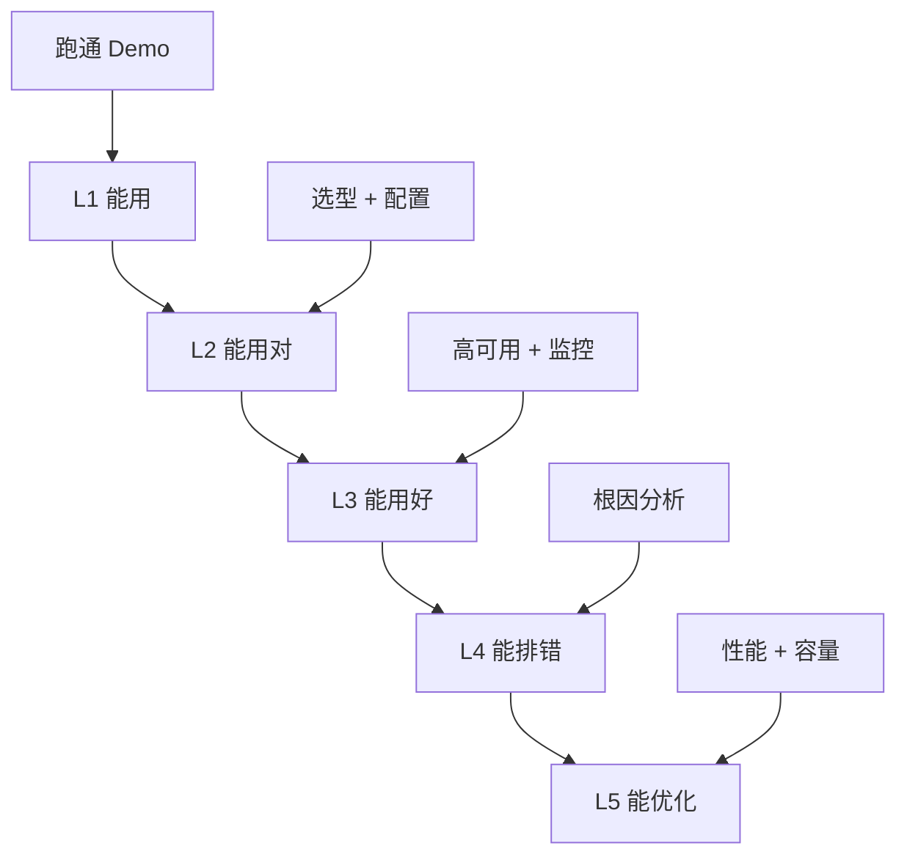
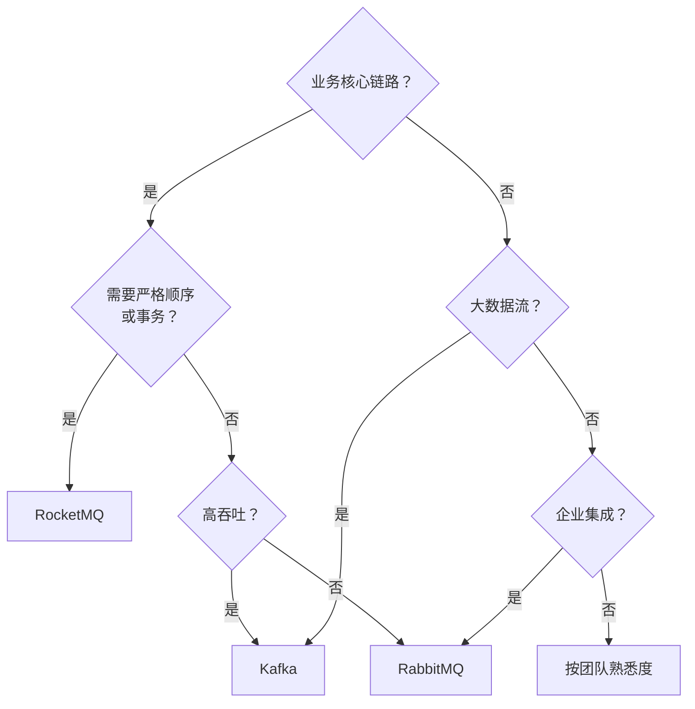
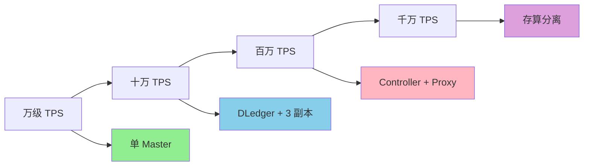
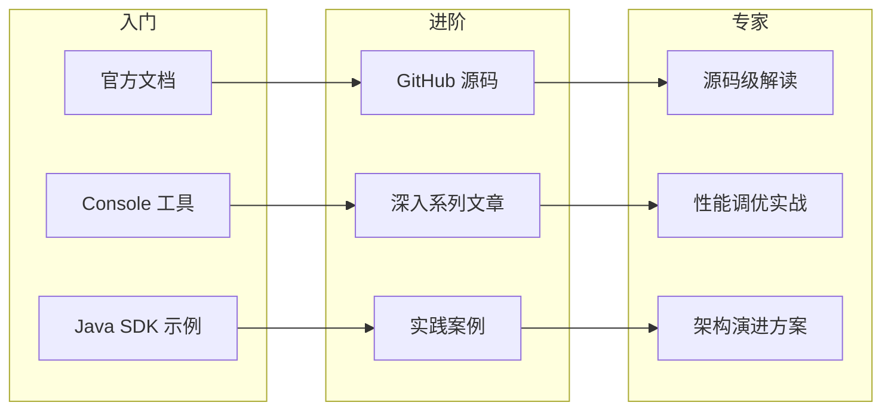

# 收官与能力地图 · 入门全景

> 这是「从零开始认识 RocketMQ」系列的收官篇。10 篇内容覆盖后，用一张「能力地图」把全系列串联起来——你能做什么、不能做什么、什么场景用、什么场景不用。

## 摘要

学完本系列，你应该掌握 RocketMQ 的「是什么 → 为什么 → 怎么用 → 怎么管 → 怎么选」完整知识链。本文从「全系列回顾 → 能力地图 → 选型决策树 → 进阶路径 → 行业认知」5 个角度，建立 RocketMQ 的全局认知地图。学完本文能回答「我现在能用 RocketMQ 做什么」「什么场景该用 / 不该用」「下一步该往哪个方向学」。

---

## 一、背景：为什么需要收官

10 篇内容覆盖了 RocketMQ 入门的全部核心模块——从「什么是消息队列」到「运维应急」，形成完整的入门知识链。但「**知识**」≠「**能力**」——入门者最该做的是「**把知识转化为能力地图**」。

跨周期经验：入门者最容易踩的坑是「**学完就忘**」——学的时候懂，不用的时候忘。能力地图的作用是「**让学过的知识有结构**」——遇到具体场景时能快速检索。

战略判断：未来 5 年，RocketMQ 会持续演进，但「**解耦 + 异步 + 削峰**」的核心价值不会变。入门者打好基础，就能在演进中不断更新知识。

## 二、原理穿透：全系列知识地图

### 2.1 10 篇内容地图

```
第 0 篇 导读
├── 第 1 篇 什么是 RocketMQ
├── 第 2 篇 为什么需要 MQ
├── 第 3 篇 RocketMQ 生态
│
├── 第 4 篇 核心架构
├── 第 5 篇 生产者消费者
├── 第 6 篇 Broker 与路由
├── 第 7 篇 Topic 与 Queue
│
├── 第 8 篇 发送与投递
├── 第 9 篇 顺序与定时
└── 第 10 篇 运维入门
```

### 2.2 知识点分类

| 类别 | 涉及篇 | 核心知识点 |
|---|---|---|
| **基础概念** | 1-3 | 消息中间件、MQ 流派、RocketMQ 定位 |
| **架构设计** | 4-7 | 4 角色、Broker、NameServer、Topic/Queue |
| **API 使用** | 5-9 | Producer/Consumer API、顺序、延迟 |
| **可靠性** | 8-9 | 投递语义、事务、幂等 |
| **运维** | 10 | 部署、监控、应急 |

### 2.3 能力层次

```
入门能力地图
├── L1 能用（跑通 Demo）        # 学完第 1-5 篇
├── L2 能用对（选型 + 配置）    # 学完第 6-8 篇
├── L3 能用好（高可用 + 监控）  # 学完第 9-10 篇
├── L4 能排错（根因分析）        # 深入系列
└── L5 能优化（性能 + 容量）    # 源码级
```

机制穿透：能力层次和篇数大致对应——学完前 5 篇能跑通 Demo，学完前 8 篇能选型 + 配置，学完 10 篇能独立运维一个 RocketMQ 集群。

跨周期经验：从 2018 到 2024，业内对 RocketMQ 学习者的要求经历了「**会用 API → 能用对 → 能用好 → 能排错 → 能优化**」五层能力的演进。

## 三、主流业界解法：RocketMQ vs Kafka vs RabbitMQ

### 3.1 4 大 MQ 横向对比

| 维度 | RocketMQ | Kafka | RabbitMQ | Pulsar |
|---|---|---|---|---|
| **设计目标** | 可靠消息 | 高吞吐日志 | 协议灵活 | 多协议 |
| **可靠性** | ⭐⭐⭐⭐⭐ | ⭐⭐⭐ | ⭐⭐⭐⭐ | ⭐⭐⭐⭐ |
| **吞吐量** | ⭐⭐⭐⭐ | ⭐⭐⭐⭐⭐ | ⭐⭐⭐ | ⭐⭐⭐⭐ |
| **事务消息** | ✅ 原生 | ⚠️ EOS | ⚠️ 插件 | ⚠️ 事务订阅 |
| **顺序保证** | ✅ 严格 | ⚠️ 分区内 | ⚠️ 单队列 | ⚠️ 客户端 |
| **延迟消息** | ✅ 18 级 | ❌ | ✅ 插件 | ✅ |
| **生态成熟** | ⭐⭐⭐⭐ | ⭐⭐⭐⭐⭐ | ⭐⭐⭐⭐ | ⭐⭐⭐ |
| **运维复杂度** | 中 | 高 | 中 | 高 |

### 3.2 选型决策树

```
业务核心链路？
├── 是 -> 需要严格顺序/事务？
│        ├── 是 -> RocketMQ
│        └── 否 -> 高吞吐？
│                 ├── 是 -> Kafka
│                 └── 否 -> RabbitMQ
└── 否 -> 大数据流？
         ├── 是 -> Kafka
         └── 否 -> 企业集成？
                  ├── 是 -> RabbitMQ
                  └── 否 -> 按团队熟悉度
```

跨周期经验：从 2018 到 2024，业内对 MQ 选型的认知经历了「**神话化某个 MQ → 理性化选型**」两个阶段。入门者最该学的不是「**哪个 MQ 好**」，而是「**什么场景用哪个 MQ**」。

跨公司视角：阿里系业务大量用 RocketMQ（业务消息为主）；字节、美团大量用 Kafka（日志流为主）；传统金融大量用 RabbitMQ（异构系统集成为主）；新兴云原生业务大量用 Pulsar（多租户场景）。这不是「谁对谁错」，而是「**业务形态决定选型**」。

跨系统架构：MQ 选型一旦确定，迁移成本极高——业务侧已经按 MQ 的「最终一致 + 重试 + 幂等」模型开发，迁移到其他 MQ 等于重写。所以「**MQ 选型是架构决策**」而非技术决策。

## 四、量级演进：RocketMQ 能力建设的 5 年路径

量级演进视角，RocketMQ 能力建设可分为 5 个阶段：

| 阶段 | 时间 | 能力目标 | 关键产物 | 业内通用做法 |
|---|---|---|---|---|
| **入门** | 0-1 个月 | 跑通 Demo | 第一个 Producer/Consumer | 按官方文档 |
| **会用** | 1-3 个月 | 独立运维一个集群 | 部署 + 监控 + 应急 | Prometheus + AlertManager |
| **能用好** | 3-6 个月 | 选型 + 调优 | 容量规划 + 性能调优 | 业务场景驱动 |
| **能排错** | 6-12 个月 | 根因分析 | 监控 + 告警 + 演练 | AIOps |
| **能优化** | 12+ 个月 | 架构演进 | 5.x Controller + 存算分离 | 自动化 |

5 年后回头看：2018 年大家还在「**会用就行**」，2024 年的标准做法是「**能用好 + 能排错 + 能优化**」。当年「**RocketMQ 比 Kafka 难学**」的争议，5 年后回头看是「**业务复杂度的体现**」。

## 五、架构设计：能力地图总览

### 5.1 入门者能力地图

```
RocketMQ 入门能力
├── 基础层（概念 + 架构）
│   ├── 消息中间件概念
│   ├── RocketMQ 4 角色
│   └── Topic/Queue 模型
├── 应用层（API + 选型）
│   ├── Producer/Consumer API
│   ├── 顺序 + 事务 + 延迟
│   └── 投递语义
├── 运维层（部署 + 监控）
│   ├── 集群部署
│   ├── 监控告警
│   └── 应急处置
└── 进阶层（调优 + 排错）
    ├── 容量规划
    ├── 性能调优
    └── 根因分析
```

### 5.2 关键能力清单

| 能力 | 说明 | 学完本系列能否掌握 |
|---|---|---|
| **跑通 Demo** | 第一个 Producer/Consumer | ✅ |
| **独立部署** | 单机 + 多 Master + DLedger | ✅ |
| **配置监控** | 12 项核心指标 | ✅ |
| **应急处置** | 4 类常见事故 | ✅ |
| **选型决策** | 4 MQ 横向对比 | ✅ |
| **顺序消息** | 业务级顺序保证 | ✅ |
| **延迟消息** | 18 级延迟 + 任意时间 | ✅ |
| **事务消息** | 半消息 + 回查 | ⚠️ 需要深入系列 |
| **性能调优** | 刷盘策略 + 消费线程池 | ⚠️ 需要深入系列 |
| **源码解读** | CommitLog + ConsumeQueue | ❌ 需要源码系列 |
| **AIOps** | 智能告警 + 异常检测 | ❌ 需要运维系列 |

机制穿透：入门系列能让你「**独立使用 RocketMQ**」，但「**用好**」需要深入系列，「**用精**」需要源码系列。这是「**学习路径的必然阶梯**」。

## 六、生产画像：学完后的 3 类典型角色

（脱敏通用画像）

| 角色 | 能力目标 | 关键场景 | 业内通用路径 |
|---|---|---|---|
| **业务开发者** | 能用 + 能用对 | 业务消息发送与消费 | 学完入门系列 |
| **中间件运维** | 能用好 + 能排错 | 部署 + 监控 + 应急 | 入门 + 深入 |
| **架构师** | 能选型 + 能优化 | 跨系统 + 容量规划 | 入门 + 深入 + 源码 |

### 6.1 业务开发者画像

```
业务开发者
├── 1. 选型：RocketMQ 还是 Kafka
├── 2. 设计：Topic/Queue/分区键
├── 3. 实现：Producer/Consumer
├── 4. 测试：幂等 + 重试
└── 5. 上线：灰度 + 监控
```

### 6.2 中间件运维画像

```
中间件运维
├── 1. 部署：集群 + 副本
├── 2. 监控：12 项核心指标
├── 3. 应急：4 类事故 SOP
├── 4. 容量规划：3 个月提前
└── 5. 演练：季度切换演练
```

### 6.3 架构师画像

```
架构师
├── 1. 选型决策：4 MQ 对比
├── 2. 容量评估：TPS + 磁盘 + 副本
├── 3. 演进路径：4.x -> 5.x
├── 4. 跨系统：上下游对接
└── 5. 行业洞察：未来 5 年方向
```

跨周期经验：从 2018 到 2024，业内对 RocketMQ 人才的需求经历了「**会用 → 用好 → 选型 + 优化**」三个阶段。入门者最该规划的是「**未来 1-2 年的能力建设路径**」。

跨系统架构：业务开发者、中间件运维、架构师三类角色共同构成 RocketMQ 在企业的「**上下游能力边界**」——开发者负责 API，运维负责部署，架构师负责选型与演进。

## 七、Trade-off：能力建设的 5 个核心 Trade-off

机制穿透角度，RocketMQ 能力建设上有 5 个核心 Trade-off：

| 设计选择 | 收益 | 代价 | 适用场景 |
|---|---|---|---|
| **入门 vs 深入** | 快速上手 | 不懂原理 | 短期任务 |
| **深入 vs 源码** | 调优能力 | 时间成本 | 中期目标 |
| **会用 vs 用好** | 简单直接 | 风险高 | 小业务 |
| **手动 vs 自动化** | 灵活 | 容易出错 | 学习阶段 |
| **学 vs 用** | 知识内化 | 见效慢 | 长期成长 |

Trade-off 跨期：当年选「**先学后用**」是合理 Trade-off（打好基础），2024 年的「**边学边用**」是更优解——这个「Trade-off 升级」是「**学习资源丰富 + 业务复杂度增加**」的结果。

跨公司视角：阿里系业务大量用「**实战驱动学习**」（边做边学）；字节、美团大量用「**培训 + 实战并重**」（系统学习）；传统金融用「**先培训后实战**」（合规优先）。这不是「谁对谁错」，而是「**业务形态决定节奏**」。

战略判断：未来 5 年，RocketMQ 入门门槛会降低（云原生 + Serverless），但「**用好**」的能力要求会提高。这是社区共识。

## 八、反思：入门后的 5 个建议

入门者最该记住的 5 个建议：

1. **学完不是结束**——入门只是开始，深入和源码才是核心
2. **实战是关键**——不实战的知识等于「**没有知识**」
3. **监控是底线**——没有监控的 MQ 集群是「**裸奔**」
4. **选型要理性**——RocketMQ 不是银弹，按场景选型
5. **演进要跟上**——5.x Controller + Pop 消费是趋势

跨周期经验：从 2018 到 2024，业内对 RocketMQ 入门者的要求经历了「**会用 → 能用好 → 能选型 + 能优化**」三个阶段。入门者最该规划的是「**未来 1-2 年的能力建设路径**」。

### 8.1 推荐学习路径

```
入门系列(本系列 10 篇)        # 0-1 个月
    ↓
实战(独立运维一个集群)         # 1-3 个月
    ↓
深入系列(特性深挖)             # 3-6 个月
    ↓
源码系列(CommitLog + ConsumeQueue)  # 6-12 个月
    ↓
专家级(选型 + 优化 + 演进)    # 12+ 个月
```

### 8.2 推荐资源

| 资源 | 类型 | 说明 |
|---|---|---|
| **RocketMQ 官方文档** | 文档 | https://rocketmq.apache.org/ |
| **RocketMQ Console** | 工具 | Web 控制台 |
| **RocketMQ Exporter** | 工具 | Prometheus 监控 |
| **Apache RocketMQ GitHub** | 源码 | https://github.com/apache/rocketmq |
| **RocketMQ 5.x 文档** | 文档 | 云原生 + Controller |

### 8.3 能力层次与学习路径



机制穿透：能力层次是「**累积式**」的——上一层是下一层的基础，下一层是上一层的深化。

### 8.4 4 MQ 选型决策树



战略判断：未来 5 年，RocketMQ 的入门门槛会降低（云原生 + Serverless），但「**用好**」的能力要求会提高。入门者应该建立「**从能用到用好**」的完整链路。

### 8.5 量级演进与合规视角



跨周期经验：从「**万级**」到「**千万级**」的量级演进背后，是「**业务复杂度 + 一致性要求 + 合规要求**」三者的共同驱动。在跨境业务中，还需要符合境内外合规要求，包括数据本地化与审计要求。

### 8.6 入门到进阶的资源图谱



战略判断：入门到进阶的关键是「**循序渐进 + 实战驱动**」——每一步都需要在实际业务场景中验证。

### 8.7 能力建设的 5 个关键里程碑

跨周期经验：RocketMQ 能力建设有 5 个关键里程碑——「**跑通 Demo、独立运维、选型调优、应急排错、架构演进**」。每个里程碑都对应一类业务能力的沉淀。

跨系统架构：能力建设是「**业务上下游对接**」的延伸——开发者、运维、架构师三类角色共同构成 RocketMQ 在企业的「**上下游能力边界**」。

### 8.8 学习路径的 3 个关键阶段

跨周期经验：从 2018 到 2024，业内对 RocketMQ 学习者的要求经历了「**会用 API → 能用好 → 能优化**」三个阶段。入门者应该根据自己的角色定位（开发者/运维/架构师）选择不同的学习路径。

---

## 附录 A：术语速查表

| 术语 | 解释 |
|---|---|
| **能力地图** | 知识点到能力的转化 |
| **入门系列** | 本系列 10 篇 |
| **深入系列** | 特性深挖 |
| **源码系列** | 源码级解读 |
| **L1-L5 能力** | 5 层能力层次 |
| **Raft** | 一致性算法 |
| **Controller** | 5.x 的选举式路由组件 |
| **Pop 消费** | 5.x 的低延迟消费模型 |
| **存算分离** | 存储和计算分离 |
| **云原生** | Cloud Native 设计理念 |
| **AIOps** | 智能运维 |
| **EOS** | Exactly Once Semantics |
| **DLedger** | 基于 Raft 的多副本机制 |
| **Broker** | 消息存储节点 |
| **NameServer** | 路由注册中心 |

---

## 📌 数据与事实声明

本文涉及的能力地图、选型决策、学习路径均为社区公开知识总结。具体版本特性请以官方文档为准（https://rocketmq.apache.org/）。文中「业内通用做法」系行业认知总结，非特定公司实践。