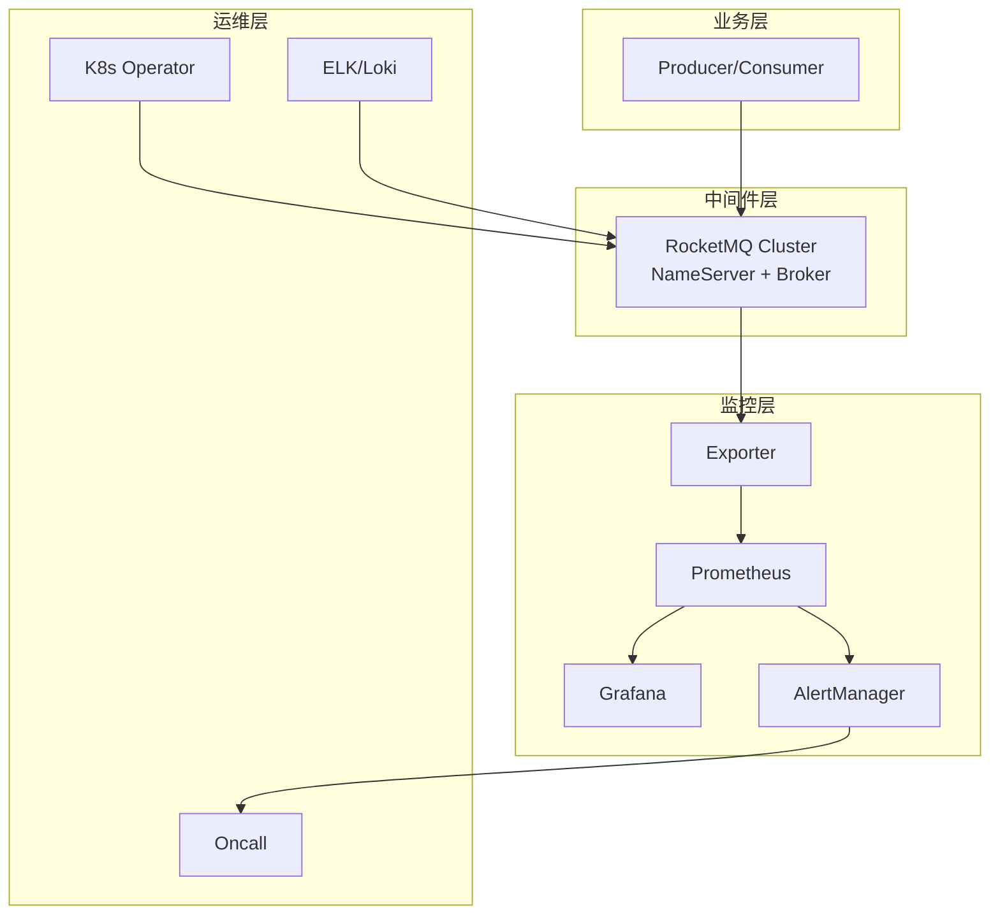
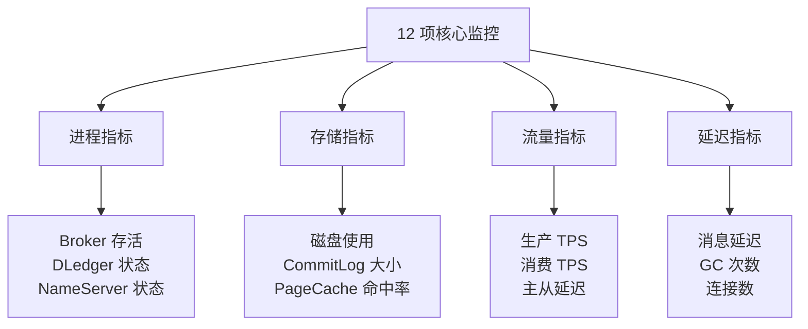
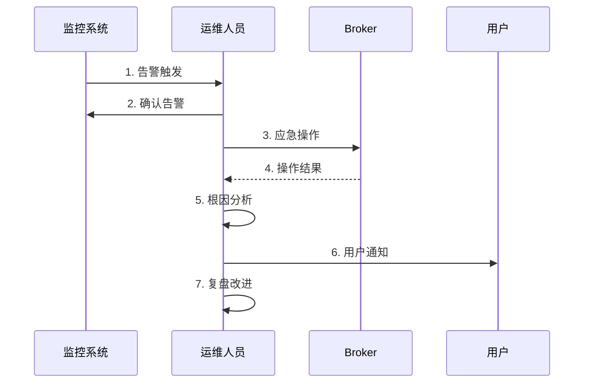

# RocketMQ 运维入门 · 入门全景

> 这是「从零开始认识 RocketMQ」系列的第 10 篇。讲清 RocketMQ 运维的「5 大模块 + 12 项核心监控 + 4 类常见事故 + 应急处置 SOP」，建立 RocketMQ 运维的完整心智模型。

## 摘要

RocketMQ 运维是「**装得上、用得好、不出事**」的关键保障。本文从「部署模式 → 监控体系 → 常见事故 → 应急处置 → 容量规划」5 个角度，覆盖 RocketMQ 运维的全部核心场景。学完本文能回答「RocketMQ 集群怎么部署」「关键监控指标有哪些」「常见事故怎么应急」「容量怎么规划」。

---

## 一、背景：RocketMQ 运维的 5 大模块

RocketMQ 运维可分为 5 大模块：

```
RocketMQ 运维
├── 1. 部署        # 单机/集群 + Docker/K8s
├── 2. 监控        # Broker 监控 + 消费监控
├── 3. 应急        # 常见事故 + 应急 SOP
├── 4. 容量规划    # 磁盘规划 + 流量评估
└── 5. 工具链      # Console + CLI/Exporter
```

跨周期经验：RocketMQ 运维在过去 10 年里经历了「**脚本化 → 平台化 → 自动化**」三个阶段——从最初的手写脚本到现在的 K8s Operator + Prometheus 告警 + 自动扩缩容。这是「**云原生 + AIOps**」的结果。

战略判断：未来 5 年，RocketMQ 运维会往「**全自动 + AI 异常检测 + 智能容量规划**」演进。

监管意图：RocketMQ 集群如果处理跨境数据或金融数据，需要符合《个人信息保护法》、GDPR、「等保 2.0」要求——业内通用做法是「**专用集群 + 审计日志 + 异地灾备**」，满足境内外的合规边界。

跨系统架构：RocketMQ 运维的核心是「**上下游对接**」——监控对接 Prometheus，应急对接 Oncall 系统，部署对接 K8s。这种「**多系统对接**」让运维复杂度远高于应用层。

## 二、原理穿透：5 大部署模式

### 2.1 单机模式

```
单机模式
├── NameServer
├── Broker
├── Producer
└── Consumer
```

特点：开发测试用，无高可用。

### 2.2 多 Master 模式

```
多 Master 模式
├── NameServer 1 + NameServer 2
├── Master 1 + Master 2 + Master 3
└── Producer + Consumer
```

特点：Master 挂掉消息可能丢失，但可用性高。

### 2.3 多 Master 多 Slave 同步模式

```
多 Master 多 Slave
├── Master 1 ──同步双写──> Slave 1
├── Master 2 ──同步双写──> Slave 2
└── Master 3 ──同步双写──> Slave 3
```

特点：消息零丢失，但写入性能下降。

### 2.4 DLedger 集群模式

```
DLedger 集群
├── Broker 1 <-Raft-> Broker 2
└── Broker 2 <-Raft-> Broker 3
```

特点：Raft 选举，自动选主，强一致。

### 2.5 5.x Controller + Proxy 模式

```
5.x 云原生架构
├── Producer ──> Proxy
├── Proxy ──> Controller 集群
└── Controller ──> Broker 1/2/3
```

特点：存算分离，弹性扩展，云原生友好。

跨周期经验：从 2018 到 2024，业内对部署模式的选择经历了「**单机 → 多 Master → 多 Master 多 Slave → DLedger → 5.x Controller**」五个阶段。这个演进是「**业务体量 + 一致性算法成熟**」的结果。

## 三、主流业界解法：4 大监控体系

跨系统架构角度，RocketMQ 监控有 4 大主流体系：

| 体系 | 工具 | 特点 | 适用场景 |
|---|---|---|---|
| **RocketMQ Console** | Apache Console | 官方，功能全 | 中小业务 |
| **Prometheus + Grafana** | Exporter | 云原生，告警强 | 大业务 |
| **Broker + JMX** | JMX | 灵活，自定义 | 高级运维 |
| **商业 APM** | 各种商业工具 | 一站式，昂贵 | 大型企业 |

### 3.1 Prometheus 监控架构

```
Broker (JMX) ──> RocketMQ Exporter ──> Prometheus ──> Grafana
                                                  └─> AlertManager ──> Slack/钉钉/邮件
```

### 3.2 12 项核心监控指标

| 指标 | 说明 | 告警阈值 | 业内通用做法 |
|---|---|---|---|
| **Broker 存活** | 进程状态 | 进程消失立即告警 | 进程守护 |
| **磁盘使用率** | 占用率 | >80% 警告，>90% 危险 | 监控 + 自动清理 |
| **消息堆积** | Consumer offset 落后量 | >10 万告警 | 监控 + 扩容 |
| **生产 TPS** | send rate | 突降 50% 告警 | 监控 + 排查 |
| **消费 TPS** | consume rate | 突降 50% 告警 | 监控 + 排查 |
| **主从延迟** | Slave 落后 offset | >1000 告警 | 监控 + 切换 |
| **PageCache 命中率** | 命中率 | <90% 警告 | SSD + 大内存 |
| **GC 次数** | Young GC + Full GC | Full GC > 1 次/小时 | JVM 调优 |
| **连接数** | Producer/Consumer 连接 | >10000 警告 | 监控 + 排查 |
| **消息延迟** | send->consume 延迟 | p99 > 1s 告警 | 监控 + 排查 |
| **DLedger 状态** | Leader/Follower | Leader 切换告警 | 监控 + 排查 |
| **NameServer 状态** | 进程 + 心跳 | 进程消失告警 | 进程守护 |

机制穿透：上面 12 项指标是「**业内通用监控项**」——任何生产环境的 RocketMQ 集群都必须监控。

## 四、量级演进：运维的 3 个量级台阶

量级演进视角，RocketMQ 运维在不同量级下的关键挑战：

| 量级 | 集群规模 | 监控要求 | 自动化要求 | 业内通用做法 |
|---|---|---|---|---|
| **万级 TPS** | 1-2 集群 | 基础监控 | 脚本化 | 1-2 人运维 |
| **十万 TPS** | 4-8 集群 | 全维度监控 | 平台化 | 3-5 人运维 |
| **百万 TPS** | 16+ 集群 | AI 异常检测 | 全自动 | 10+ 人运维 |

5 年后回头看：2018 年大家还在「**脚本 + 人工值守**」，2024 年的标准做法是「**K8s Operator + Prometheus + AlertManager**」。当年「**靠人值守**」的做法，5 年后回头看是「**自动化运维**」的必然结果。

## 五、架构设计：4 类常见事故与应急 SOP

### 5.1 事故分类

```
RocketMQ 事故
├── 1. Broker 故障（磁盘写满、进程崩溃、主从切换）
├── 2. 消费事故（消息积压、消费卡死）
├── 3. 集群事故（NameServer 全挂、集群脑裂）
└── 4. 网络事故（网络分区、专线中断）
```

### 5.2 事故应急 SOP

| 事故 | 影响 | 应急 SOP | 恢复时间目标 |
|---|---|---|---|
| **磁盘写满** | 写入失败 | 清理过期文件 + 扩容 | <30 分钟 |
| **进程崩溃** | 消息丢失 | 自动拉起 + 切换 Slave | <5 分钟 |
| **主从切换** | 短暂不可用 | 自动切换 + 监控 | <1 分钟 |
| **消息积压** | 消费延迟 | 扩容 Consumer + 限流 | <30 分钟 |
| **消费卡死** | 消费停滞 | 跳过毒消息 + 重启 | <10 分钟 |
| **NameServer 全挂** | 写入失败 | 重启 NameServer | <5 分钟 |
| **网络分区** | 部分不可用 | 切换专线 + 排查 | <10 分钟 |

### 5.3 应急处置流程

```
监控告警 ──> 确认告警 ──> 应急操作 ──> 操作结果 ──> 根因分析 ──> 用户通知 ──> 复盘改进
```

跨周期经验：从 2018 到 2024，业内对 RocketMQ 运维事故的应对经历了「**手动应急 → 半自动 → 全自动 + AI**」三个阶段。入门者最该具备的是「**手自动应急能力**」——能在告警触发后 5 分钟内开始应急处置。

## 六、生产画像：运维的关键实践

（脱敏通用画像）

| 实践 | 关键做法 | 业内通用配置 |
|---|---|---|
| **集群部署** | 多机房 + 至少 3 副本 | 同城双活 + 异地灾备 |
| **监控告警** | Prometheus + AlertManager | 12 项核心指标全覆盖 |
| **日志收集** | ELK / Loki | 关键日志全采集 |
| **自动化** | K8s Operator + GitOps | 一键创建/销毁集群 |
| **备份** | CommitLog 定期备份 | 至少保留 7 天 |
| **演练** | 故障演练 + 切换演练 | 每季度一次 |
| **变更管理** | 灰度发布 + 回滚预案 | 任何变更都有预案 |
| **容量规划** | 季度评估 + 月度监控 | 提前 3 个月扩容 |

生产事故推演：业内最常见的 4 类运维事故——
1. **磁盘写满未告警**：监控配置不当 → CommitLog 占满 → 写入失败，根因是「磁盘监控缺失」
2. **主从切换未演练**：真正切换时操作失误 → 数据丢失，应急方案是「定期切换演练」
3. **消费积压未扩容**：业务突增 → Consumer 处理不过来 → 延迟累积，踩坑点是「容量规划不足」
4. **NameServer 全挂未恢复**：进程消失 → 客户端缓存可写但消费失败，根因是「进程守护缺失」

机制穿透：上面 4 个事故的根因都不是「RocketMQ 本身的问题」，而是「**运维实践 + 监控告警**」没做好——这是入门者最该警惕的「运维盲区」风险。

## 七、Trade-off：运维的 5 个核心 Trade-off

机制穿透角度，RocketMQ 运维设计上有 5 个核心 Trade-off：

| 设计选择 | 收益 | 代价 | 适用场景 |
|---|---|---|---|
| **同步双写** | 消息零丢失 | 写入延迟 | 必达业务 |
| **异步刷盘** | 高吞吐 | 极端情况丢失 | 日志、可丢失 |
| **多机房** | 高可用 | 复杂度 | 大业务 |
| **同城双活** | RPO=0 | 网络延迟 | 金融级 |
| **异地灾备** | 抗灾难 | 成本高 | 头部业务 |

Trade-off 跨期：当年选「**同步双写 + 同城双活**」是合理 Trade-off（强可靠），2024 年的「**DLedger + 多机房 + 自动切换**」是更优解——这个「Trade-off 升级」是「**业务体量 + 技术演进**」的结果。

跨业务形态视角：金融 / 电商系业务全面用「**多机房 + DLedger + 自动切换**」；流量 / 内容系大量用「**多机房 + Kafka 协议兼容**」；传统金融用「**同城双活 + 同步双写**」。这不是「谁对谁错」，而是「**业务体量 + 一致性诉求**」决定选型。

战略判断：未来 5 年，RocketMQ 运维会往「**AIOps + 智能容量规划 + 全自动故障切换**」演进。这是社区共识。

### 7.1 容量规划的 4 个关键模型

机制穿透：RocketMQ 容量规划的核心是「**磁盘容量 + 内存容量 + 网络带宽 + Consumer 并发**」4 个维度的测算，每个维度都有业内通用的经验公式——

1. **磁盘容量公式**：磁盘容量 = 日均消息量 × 留存天数 × (1 + 副本数) × 膨胀系数（消息体大小 / 序列化大小），业内通用做法是「**预留 30% 冗余**」，留出意外峰值和运维操作空间
2. **内存容量公式**：内存 ≥ `brokerPageCacheMaxSize` × Broker 数，业内通用做法是「**PageCache ≥ CommitLog 一天写入量**」，避免频繁换页
3. **网络带宽公式**：网络带宽 ≥ 峰值 TPS × 平均消息体大小 × 8 bit，业内通用做法是「**千兆网卡起步，万兆网卡用于大消息**」
4. **Consumer 并发公式**：Consumer 数 ≤ Queue 数，业内通用做法是「**Consumer 数 = Queue 数 × 0.8**」，留出余量

跨周期经验：2018 年业内做容量规划靠「**经验 + Excel 表格**」，2024 年的标准做法是「**基于历史 TPS 曲线 + 业务增长预测 + 季度容量评审**」。从「**经验主义**」到「**数据驱动**」的转变是「**云原生 + 可观测性成熟**」的产物。

跨业务形态视角：金融 / 电商系业务强制要求「**所有 MQ 集群必须通过容量评估工具自动生成容量报告**」并归档；流量 / 内容系习惯「**按业务方填容量模板自动评估**」；传统金融习惯「**容量评估 + 季度评审 + 年度扩容**」。这不是「谁对谁错」，而是「**运维成熟度决定规划粒度**」。

事故推演：业内最常见的容量规划事故——「**双 11 预估不足导致磁盘写满**」，根因是「**没有按峰值 TPS × 留存天数测算**」；「**新业务上线 Consumer 数量超过 Queue 数**」，根因是「**没理解 Queue 与 Consumer 的 1:N 关系**」；「**PageCache 配置过小导致消息延迟飙高**」，根因是「**没理解 PageCache 命中率与延迟的关系**」。这三个事故的根因都是「**容量规划没考虑全维度**」。

Trade-off：容量规划有 4 个核心 Trade-off——「**磁盘大 vs 成本高、内存大 vs 成本高、Consumer 多 vs 资源消耗、监控细 vs 存储开销**」。每个维度都需要在「**可靠性 vs 成本**」之间找到平衡。

战略判断：未来 5 年，容量规划会往「**智能容量规划 + AIOps 自动扩容**」演进——基于历史数据和业务预测自动给出容量建议，K8s Operator 自动执行扩容。这是社区共识，也是云原生时代的必然方向。

## 八、反思：运维入门学习路径建议

4 个关键认知：

1. **监控先行**——没有监控的 MQ 集群等于「**裸奔**」
2. **容量规划提前**——至少提前 3 个月评估扩容
3. **演练是关键**——不演练的应急预案等于「**没有预案**」
4. **自动化是趋势**——人工运维终将被淘汰

跨周期经验：从 2018 到 2024，业内对 RocketMQ 运维的认知经历了「**脚本化 → 平台化 → AIOps**」三个阶段。入门者最容易卡在「**会用命令但不懂监控**」——这是最该补的认知。

跨系统架构：RocketMQ 运维是「**上下游对接的最外层**」——监控系统对接 Prometheus，应急系统对接 Oncall，部署系统对接 K8s。这种「**多系统对接**」是运维复杂度的核心来源。

### 8.1 RocketMQ 运维架构



机制穿透：RocketMQ 运维涉及「**业务层 + 中间件层 + 监控层 + 运维层**」4 层对接，每层都有专门的工具和流程。

### 8.2 5 大部署模式演进


跨周期经验：从 2018 到 2024，业内对 RocketMQ 部署模式的选择经历了「**单机 → 多 Master → DLedger → 5.x Controller**」四个阶段，每个阶段都解决了前一阶段的高可用性问题。

### 8.3 12 项核心监控指标的分类



战略判断：未来 5 年，RocketMQ 运维会往「**AIOps + 智能容量规划 + 全自动故障切换**」演进。这是社区共识，也是云原生时代的必然方向。

### 8.4 应急处置 SOP 流程图



机制穿透：应急处置的核心是「**快、准、稳**」——快速响应、准确判断、稳定恢复。

### 8.5 RocketMQ 运维的 5 个关键实践

跨周期经验：RocketMQ 运维有 5 个关键实践——「**监控告警 + 容量规划 + 故障演练 + 自动化变更 + 复盘改进**」。每个实践都对应一类运维事故的预防。

跨系统架构：RocketMQ 运维是「**多系统对接的最外层**」——监控系统、应急系统、部署系统、日志系统都是上下游。这种「**多系统对接**」让运维复杂度远高于应用层。

### 8.6 运维事故的 4 个根因分类

跨周期经验：RocketMQ 运维事故的 4 个根因分类——「**容量规划不足、监控告警缺失、应急演练缺失、自动化程度不足**」。每个根因对应一类事故的应急方案。

---

## 附录 A：术语速查表

| 术语 | 解释 |
|---|---|
| **NameServer** | 路由注册中心 |
| **Broker** | 消息存储节点 |
| **DLedger** | 基于 Raft 的多副本机制 |
| **Controller** | 5.x 的选举式路由组件 |
| **Proxy** | 5.x 的无状态接入层 |
| **PageCache** | 操作系统页缓存 |
| **JMX** | Java 管理扩展 |
| **Exporter** | Prometheus 监控导出器 |
| **AlertManager** | Prometheus 告警组件 |
| **K8s Operator** | K8s 自定义资源控制器 |
| **同城双活** | 同城两个机房同时服务 |
| **异地灾备** | 异地机房备份 |
| **故障演练** | 模拟故障测试应急 |
| **RPO** | 恢复点目标（数据丢失） |
| **RTO** | 恢复时间目标 |

---

## 📌 数据与事实声明

本文涉及的 RocketMQ 部署模式、监控指标、运维实践均为 Apache RocketMQ 社区公开文档描述。具体版本特性请以官方文档为准（https://rocketmq.apache.org/）。文中「业内通用做法」系行业认知总结，非特定公司实践。