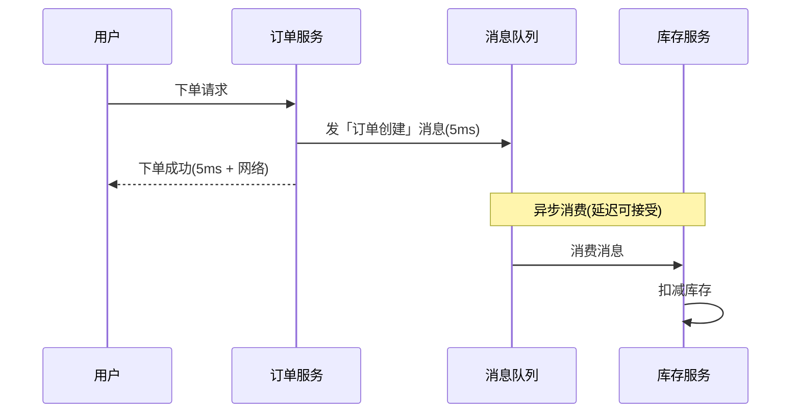
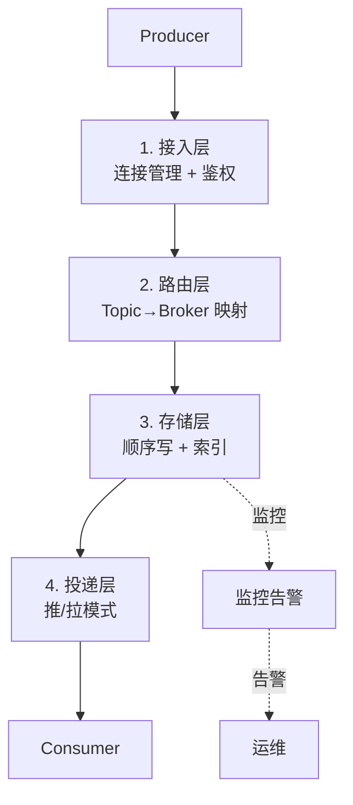
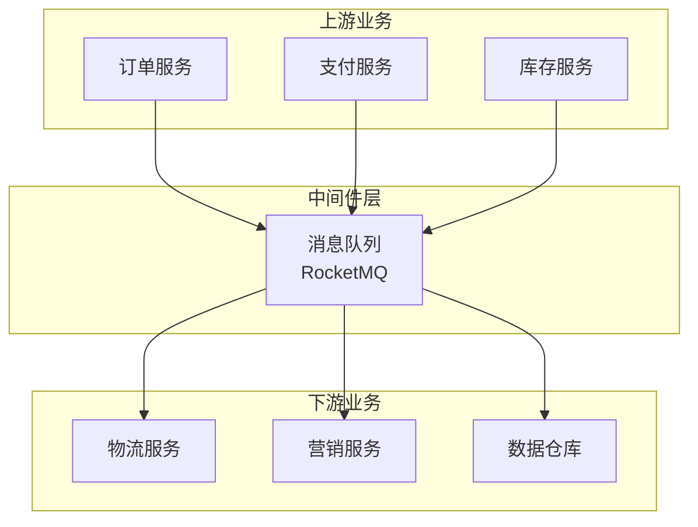
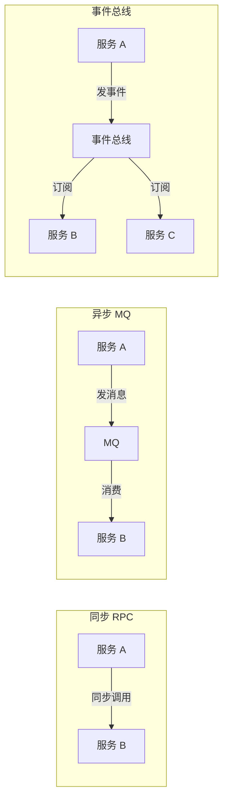

# 为什么需要消息队列 · 入门全景

> 这是「从零开始认识 RocketMQ」系列的第 2 篇。不讲 RocketMQ 怎么用，先讲「消息队列这个品类为什么存在」——理解它的设计动机，比会用 API 更重要。

## 摘要

消息队列（Message Queue）是分布式系统的「解耦、异步、削峰」三大基础设施之一。本文从「一个电商下单的例子」切入，讲清消息队列要解决的 3 个核心问题、与同步 RPC 的本质差异、引入 MQ 后带来的新问题（消息丢失、重复、顺序），以及业内通用解决思路。学完本文能从「业务架构师」视角判断「什么时候该用 MQ，什么时候不该用」。

---

## 一、背景：没有 MQ 时的世界

让我们从 0 开始搭建一个「订单系统」，看看不引入 MQ 会发生什么。

### 1.1 最朴素的同步调用

```
用户 -> 订单服务 -> 库存服务 -> 支付服务 -> 物流服务 -> 用户
```

这个流程**能跑**，但有 3 个明显问题：

1. **响应慢**：4 次同步调用串行，p99 延迟 = 4 个服务的延迟之和
2. **强耦合**：任何一个服务挂掉，整个下单链路失败
3. **流量不平滑**：大促时 10 万 QPS 全压在下游服务，凌晨又几乎为零

### 1.2 第一次优化：并行调用

聪明的工程师会改成并行——库存、支付、物流 3 个调用同时发起，然后等所有结果都回来再返回用户：

```
用户 -> 订单服务
        ├──> 库存服务 ──┐
        ├──> 支付服务 ──┼──> 汇总 ──> 用户
        └──> 物流服务 ──┘
```

并行优化了延迟，但**耦合问题没解决**——任何一个下游挂了，订单还是要回滚。

跨周期经验：在「分布式系统」这个领域，「解耦」是过去 10 年最反复出现的设计目标。从 SOA 到微服务到事件驱动架构，本质都是「如何让两个服务之间的依赖变弱」。

## 二、原理穿透：消息队列的 3 大核心价值

### 2.1 解耦（Decoupling）

```
订单服务 ──> MQ ──> 库存服务
                  ──> 支付服务
                  ──> 物流服务
                  ──> 积分服务
                  ──> 营销服务
```

机制穿透：消息队列是「发布-订阅」模型的物理实现——订单服务只关心「把订单事件发出去」，下游哪些服务消费、消费顺序、消费时机，订单服务一概不管。

这就是「**时间解耦**」：订单服务在 12:00:00.123 发出消息，下游可以在 12:00:00.456 消费，也可以在 13:00 消费；可以在 1 秒内消费，也可以堆积 1 天后消费。

跨系统架构角度，订单服务只与 MQ 产生上下游关系，下游服务的变更（增加新服务、修改现有服务）不会影响订单服务——这就是「**接口边界**」在事件总线层面的实现。

### 2.2 异步（Asynchronism）



机制穿透：用户感知到的「下单成功」耗时从 500ms 降到 5ms。库存扣减是「**最终一致**」而不是「实时一致」——这个 Trade-off 是异步的代价。

### 2.3 削峰（Traffic Shaping）

```
12:00 流量高峰 10 万 QPS
  │
  ▼
API 网关 (限流到 1 万 TPS)
  │
  ▼
订单服务 ──> 消息队列 (堆积 1000 万条)
                     │
                     ▼
              库存服务 (稳定消费 5000 TPS)
```

机制穿透：MQ 充当「**缓冲区**」——上游抗住流量洪峰，下游按自己的能力匀速消费。这是消息队列作为「**流量整形器**」的核心价值。

行业视角：业内通用做法是「**核心链路同步 + 非核心链路异步**」——订单写库同步，库存扣减、积分、营销全异步。如果连订单写库都异步化，出问题时的对账成本极高。

监管意图：异步化后，消息会暂时持久化在 MQ 中。如果消息内容包含用户隐私数据（身份证、银行卡），需要符合《个人信息保护法》和 GDPR 的合规要求——业内做法是「敏感字段脱敏后再入队」，避免 MQ 成为合规盲区。在跨境场景下，消息流转还需要符合「本地化」与「境外」的双重审计要求。

## 三、主流业界解法：消息队列的 3 大流派

跨系统架构角度，市面上的 MQ 可归为 3 个流派：

| 流派 | 代表 | 设计哲学 | 典型场景 |
|---|---|---|---|
| **可靠消息流派** | RocketMQ | 业务事件优先、可靠 + 事务 | 交易、订单、支付 |
| **日志流流派** | Kafka / Pulsar | 高吞吐日志优先、客户端保证可靠性 | 大数据、实时计算、监控 |
| **AMQP 流派** | RabbitMQ | 协议标准优先、灵活路由 | 企业集成、异构系统 |

3 个流派的核心差异是「**可靠性由谁保证**」：

- **RocketMQ 流派**：服务端保证可靠 + 事务消息 + 顺序消息，客户端简单
- **Kafka 流派**：服务端只保证日志副本 + 顺序写，客户端保证幂等 + 事务
- **RabbitMQ 流派**：协议灵活，Exchange+Binding，运维复杂

跨周期经验：过去 10 年，「服务端做更多」和「客户端做更多」这两条路线一直在交替演进——这是分布式系统设计的经典 Trade-off。

战略判断：未来 5 年，3 个流派的边界会越来越模糊——RocketMQ 5.x 支持轻量消息和流式计算；Kafka 4.x 引入事务和 EOS；Pulsar 主打「多协议统一」。**收敛方向是「一个中间件，多种语义」**。

## 四、量级演进：消息队列的 4 个量级台阶

量级演进视角，消息队列的量级可分为 4 个台阶：

| 量级 | 典型场景 | 核心挑战 | 业内通用方案 |
|---|---|---|---|
| **万级 TPS** | 中小型业务 | 单机扛得住 | 单 Master + 异步刷盘 |
| **十万 TPS** | 大型业务 | 单机扛不住 | 多 Broker + 同步刷盘 |
| **百万 TPS** | 头部业务 | 写入瓶颈 | 分片 + 多集群 |
| **千万 TPS** | 超头部 | 存储瓶颈 | 存算分离 + 冷热分层 |

跨周期经验：从「万级」到「千万级」，不是简单的「加机器」——每个量级台阶都要解决不同的「第一性问题」（分布式协调、复制协议、冷热数据分层）。

5 年后回头看：2018 年大家还在用 ZK 做 NameServer 的高可用，2024 年已经全部 DLedger/Controller 化。这个演进是「**架构去重 + 运维自动化**」的必然结果。

## 五、架构设计：消息队列的通用架构

无论哪个流派，消息队列的架构都可以抽象为 5 层：



| 层 | RocketMQ 实现 | Kafka 实现 | 关键差异 |
|---|---|---|---|
| **接入层** | Remoting Client | Kafka Client | RocketMQ 轻量，Kafka 协议重 |
| **路由层** | NameServer | Controller（KRaft） | NameServer 无状态 |
| **存储层** | CommitLog + ConsumeQueue | Partition + Log Segment | 设计哲学不同 |
| **投递层** | 长轮询拉 | 拉（Fetch API） | RocketMQ 多了「推」封装 |
| **监控** | Console + Exporter | JMX + Burrow | 工具链成熟度不同 |

跨系统架构：消息队列是「上下游边界的物理实现」——上游只需要「发消息」，下游只需要「收消息」，中间的存储、路由、投递全部由 MQ 负责。这就是「**消息队列 = 分布式系统的事件总线**」的本质。

## 六、生产画像：消息队列的典型业务场景

（脱敏通用画像）

| 业务场景 | 是否适合用 MQ | 关键判断 | 业内通用做法 |
|---|---|---|---|
| **交易订单** | ✅ 强烈推荐 | 核心链路必须可靠 | RocketMQ + 事务消息 |
| **支付回调** | ✅ 强烈推荐 | 异步 + 幂等 | RocketMQ + 至少 3 副本 |
| **日志采集** | ✅ 推荐 | 量大、丢点没事 | Kafka + 异步刷盘 |
| **跨系统同步** | ✅ 推荐 | 解耦异构系统 | RabbitMQ / RocketMQ |
| **同步 RPC 调用** | ❌ 不适合 | 必须实时返回 | 用 gRPC / Dubbo |
| **高频小消息** | ⚠️ 慎用 | 消息成本 > 业务价值 | 评估能否合并 |
| **金融强一致** | ⚠️ 慎用 | MQ 是最终一致 | 强一致用 DB 事务 |

生产事故推演：业内最常见的 4 类 MQ 事故——
1. **消息丢失**：异步刷盘 + 单副本 → 机器重启后数据丢失，根因是「刷盘策略与副本数错配」
2. **消息重复**：消费侧未做幂等 → 网络抖动导致重复投递，踩坑点是「幂等设计缺失」
3. **消息积压**：消费速度跟不上生产速度 → 队列越堆越深，应急方案是「扩容 Consumer + 限流」
4. **消费卡死**：某条消息处理失败 → 阻塞后续所有消息，根因是「失败重试未设上限」

机制穿透：上面 4 个事故的根因都不是「MQ 本身的问题」，而是「**使用者没有理解 MQ 的语义保证边界**」——这是关键认知。

## 七、Trade-off：消息队列的代价

机制穿透角度，引入 MQ 不是「银弹」，它带来 4 个新代价：

| 代价 | 说明 | 应对 |
|---|---|---|
| **最终一致性** | 业务从「实时一致」变成「最终一致」 | 对账 + 补偿 |
| **消息丢失风险** | 极端情况下消息可能丢失 | 同步双写 + 副本 |
| **消息重复风险** | 至少一次语义可能重复 | 消费侧幂等 |
| **运维复杂度** | 多了 MQ 集群要维护 | 监控 + 告警 + 演练 |

Trade-off 跨期：「实时一致 vs 最终一致」是分布式系统的经典 Trade-off。10 年前大家追求强一致，5 年后回头看，业内通用做法是「**核心同步 + 周边异步 + 对账兜底**」——这个 Trade-off 升级是技术演进的常态。

跨业务形态视角：金融 / 电商系大量用 RocketMQ（业务消息为主）；流量 / 内容系大量用 Kafka（日志流为主）；金融、电信大量用 RabbitMQ（异构系统集成为主）。这不是「谁好谁坏」，而是「**业务形态决定选型**」。

战略判断：未来 5 年，消息队列会和 Serverless、流计算深度融合——「消息即函数」会成为新形态。

## 八、反思：什么时候该用 MQ

4 个判断标准：

| 标准 | 应该用 MQ | 不该用 MQ |
|---|---|---|
| **实时性** | 业务可接受秒级延迟 | 必须毫秒级响应 |
| **一致性** | 可接受最终一致 | 必须强一致 |
| **量级** | 流量有波峰波谷 | 流量长期平稳 |
| **解耦** | 上下游依赖需要解耦 | 上下游紧耦合是设计需要 |

机制穿透：MQ 不是「分布式系统的万能解药」——强一致、高实时、小流量、强耦合场景用 MQ 反而是负担。

跨周期经验：从 2018 到 2024，业内对 MQ 的态度经历了「**神话化 → 滥用 → 理性化**」三个阶段。早期以为「MQ 能解决一切」，后来发现「MQ 引入了更多问题」，现在理性化为「**MQ 是特定场景的工具，不是银弹**」。

跨系统架构：MQ 的上下游对接一旦确定，迁移成本非常高——业务侧已经按 MQ 的「最终一致 + 重试 + 幂等」模型开发，迁移到其他 MQ 等于重写。这是「**消息队列选型是架构决策而非技术选型**」的本质。

### 8.1 消息队列在系统中的位置



机制穿透：MQ 是「**上下游对接的中间层**」——上游只管发消息，下游只管收消息，MQ 负责中间的存储、路由、投递。这种「**边界清晰的对接**」是分布式系统的关键设计。

### 8.2 3 种集成模式的对比



跨周期经验：从「同步 RPC」到「异步 MQ」到「事件总线」，是分布式系统集成的 3 个演进阶段。每个阶段都解决前一阶段的问题，但也都引入了新的复杂性。

---

## 附录 A：术语速查表

| 术语 | 解释 |
|---|---|
| **消息队列（MQ）** | 分布式消息中间件 |
| **Producer** | 消息生产者 |
| **Consumer** | 消息消费者 |
| **Topic** | 消息主题（逻辑分类） |
| **Queue** | 消息物理队列 |
| **发布-订阅** | Pub/Sub 模型 |
| **点对点** | P2P 模型 |
| **最终一致** | 最终达到一致状态，允许中间不一致 |
| **强一致** | 任何时刻读到的都是最新值 |
| **消息幂等** | 同一条消息消费多次结果一致 |
| **消息积压** | 队列中堆积大量未消费消息 |
| **消息轨迹** | 消息从生产到消费的完整链路 |
| **消费位点** | Consumer 当前消费的位置 |
| **死信队列** | 消费失败次数过多后的归宿 |
| **同步双写** | 写盘 + 同步副本后才返回成功 |

---

## 📌 数据与事实声明

本文涉及的 MQ 概念、对比维度、量级数据均为社区公开知识。具体版本特性、性能数据请以各 MQ 官方文档为准。文中「业内通用做法」系行业认知总结，非特定公司实践。