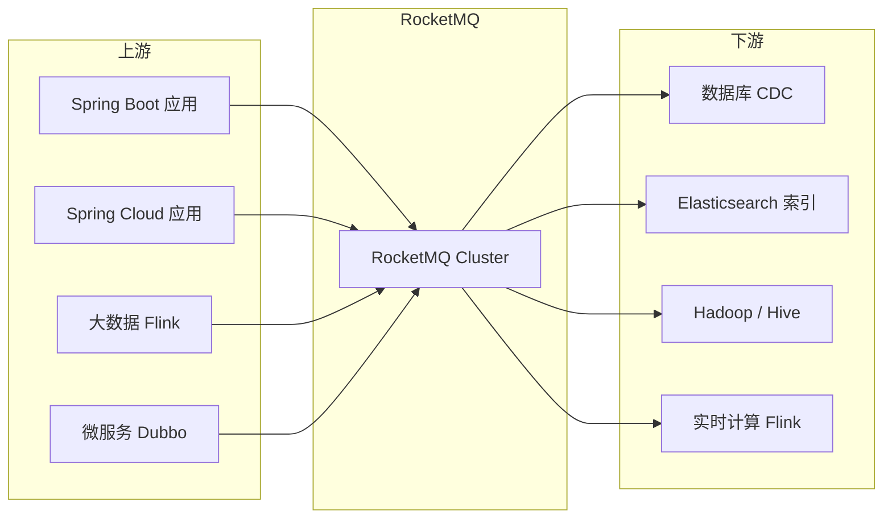
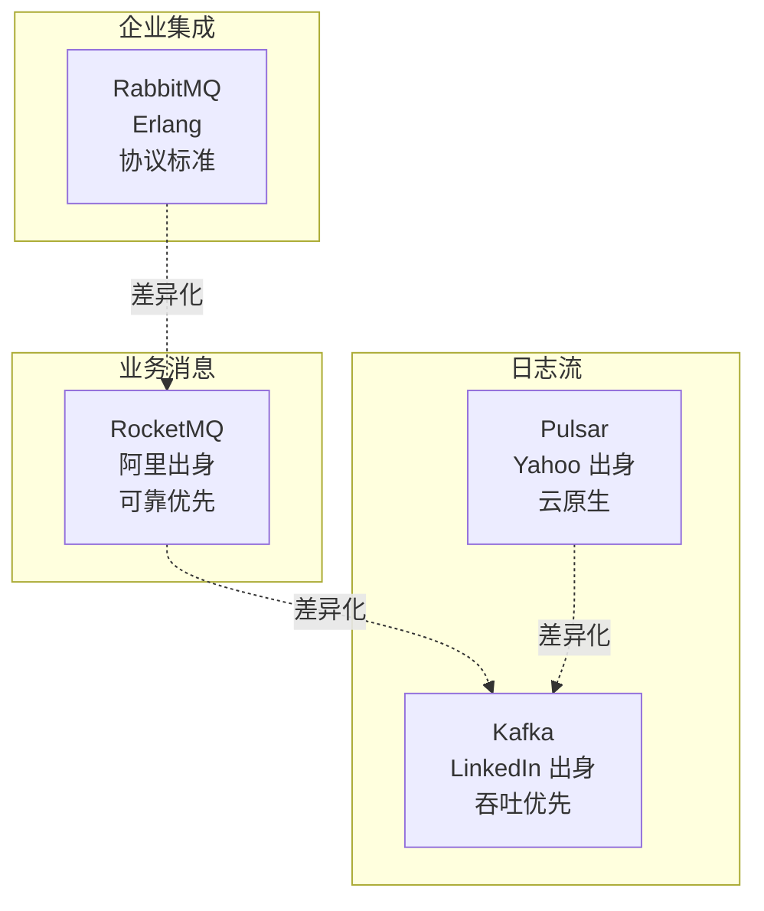
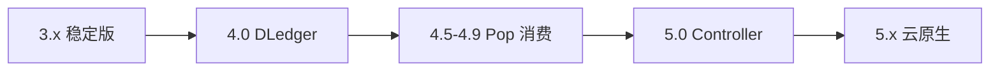
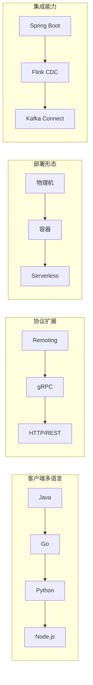
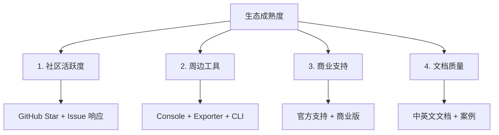

# RocketMQ 生态与版图 · 入门全景

> 这是「从零开始认识 RocketMQ」系列的第 3 篇。讲清 RocketMQ 在消息中间件大版图中的位置、上下游生态、与 Apache 社区的关系，以及 5.x 时代的关键演进。

## 摘要

RocketMQ 是 Apache 顶级项目，也是国内使用最广的分布式消息中间件之一。本文从「生态版图 → 上下游生态 → 社区与版本演进 → 与同类产品对比 → 学习资源图谱」5 个角度，建立 RocketMQ 在中间件生态中的全局坐标。学完本文能回答「RocketMQ 在中间件版图中是什么位置」「它和其他 MQ 的差异点在哪」「5.x 时代的关键变化是什么」。

---

## 一、背景：消息中间件生态的全景

消息中间件是分布式系统的「事件总线」——上承业务应用，下接存储与计算。在整个中间件生态中，它的位置是：

```
业务应用层：电商交易、支付金融、物联网、实时计算
        │
        ▼
中间件层：消息队列（MQ）+ 数据库 + 缓存
        │
        ▼
基础设施层：操作系统、硬件、磁盘、网络
```

跨周期经验：消息中间件这个品类在过去 10 年里没有出现「颠覆者」，只是不断迭代——ActiveMQ（2003）→ RabbitMQ（2007）→ Kafka（2011）→ RocketMQ（2012）→ Pulsar（2017）。这个品类已经是「**分布式系统的基础设施**」，和数据库、缓存并列。

战略判断：未来 5 年，消息中间件不会消失，但形态会变——「消息 + 流计算 + 存算分离」会成为新趋势。

## 二、原理穿透：RocketMQ 的 4 层架构与上下游

### 2.1 RocketMQ 自身架构

RocketMQ 集群由 4 类角色组成：NameServer（路由层）、Broker（存储层）、Producer（生产者）、Consumer（消费者）。工具层包括 Console 控制台、Exporter 监控、CLI 命令行——这些只读不写。

机制穿透：RocketMQ 的架构非常清晰——客户端只和 NameServer + Broker 打交道，工具层只读不写。这种「**职责单一 + 边界清晰**」的设计是它能在大规模生产中稳定运行的根本原因。

### 2.2 上下游生态

跨系统架构角度，RocketMQ 的上下游非常广——上游可以是任何 Java 应用、Spring Cloud 微服务、大数据流计算；下游可以是数据库（CDC）、搜索引擎、大数据仓库、实时计算引擎。这就是「**消息中间件作为数据中枢**」的典型生态。

跨业务形态视角：金融 / 电商 / 内容等头部互联网公司都在用 RocketMQ（或改造版）；海外 Apache RocketMQ 用户覆盖东南亚、欧洲部分企业；这是「**国内主导 + 海外逐步渗透**」的生态特征。



## 三、主流业界解法：4 大 MQ 的版图定位

行业视角，市面上 4 个主流 MQ 的版图定位差异很大：

| MQ | 出身 | 主导公司 | 核心场景 | 社区活跃度 |
|---|---|---|---|---|
| **RocketMQ** | 阿里 2012 | Apache 基金会 | 业务消息、交易 | ⭐⭐⭐⭐ |
| **Kafka** | LinkedIn 2011 | Apache 基金会 | 日志流、大数据 | ⭐⭐⭐⭐⭐ |
| **RabbitMQ** | Erlang 2007 | VMware / Pivotal | 企业集成、AMQP | ⭐⭐⭐ |
| **Pulsar** | Yahoo 2017 | Apache 基金会 | 多协议、存算分离 | ⭐⭐⭐ |



跨周期经验：4 个 MQ 的版图不是「此消彼长」，而是「**错位竞争**」——RocketMQ 抢不了 Kafka 的日志流场景，Kafka 也抢不了 RocketMQ 的业务消息场景。这是过去 10 年形成的稳定版图。

监管意图：消息中间件本身不受强监管（不像数据库要过等保），但消息内容如果涉及用户隐私（身份证、银行卡、生物特征），需要符合《个人信息保护法》和 GDPR。业内通用做法是「敏感数据先脱敏再入队」，避免 MQ 成为合规盲区。在跨境场景中，还需要满足「本地化」与「境外」的双重合规要求。

## 四、量级演进：RocketMQ 5 个版本的演进路径

跨周期经验视角，RocketMQ 演进可分为 5 个关键版本：

| 版本 | 发布时间 | 核心变化 | 量级 | 5 年后回头看 |
|---|---|---|---|---|
| **3.x** | 2016-2018 | Apache 顶级项目、稳定版 | 万亿级堆积 | 仍是 4.x 时代的基石 |
| **4.0** | 2019 | DLedger 多副本 | 十万 TPS | 解决主从切换脑裂 |
| **4.5-4.9** | 2020-2022 | 事务消息优化、Pop 消费 | 十万 TPS | 引入消费新模型 |
| **5.0** | 2023 | Controller 模式 + Proxy | 百万 TPS | 去 NameServer |
| **5.x** | 2024-2026 | 云原生 + gRPC 协议 | 百万 TPS | 存算分离 |



量级演进：从「万亿级堆积」到「百万 TPS」，背后是「**副本机制升级 + 消费模型升级 + 存算分离**」三个核心架构演进。

5 年后回头看：2018 年大家还在纠结「要不要用 DLedger」，2024 年已经是生产标配；2024 年大家讨论「Controller 模式要不要切」，5 年后回头看这会是默认选项。**演进的趋势永远是「运维自动化 + 架构去重」**。

战略判断：RocketMQ 5.x 的 Controller + Proxy + Pop 三个特性，是它面向「云原生时代」的三大支柱。**学习 RocketMQ 不仅学「现在怎么用」，更要学「它的演进哲学」**。

## 五、架构设计：RocketMQ 5.x 的关键变化

5.x 时代 RocketMQ 的关键变化：

| 变化点 | 4.x | 5.x | 影响 |
|---|---|---|---|
| **路由层** | NameServer | Controller（选举） | 强一致，无 30 秒延迟 |
| **接入层** | 直接连 Broker | Proxy（无状态） | 跨语言 gRPC |
| **消费模型** | 长轮询 | Pop 消费 | 低延迟 |
| **存算** | Broker 一体 | 存算分离 | 弹性扩展 |
| **协议** | Remoting | gRPC | 多语言客户端 |

跨系统架构：5.x 的 Proxy 模式让 RocketMQ 第一次有了「**云原生友好的接入层**」——客户端只连 Proxy，Proxy 负责路由和转发，Broker 专心做存储。这就是「**接入和存储解耦**」的典型架构。

监管意图角度：5.x 的 gRPC 协议让跨境 / 跨云场景的合规审计更容易——业内通用做法是「**跨境数据走专用 Proxy + 审计日志**」，符合境内外的合规要求。

## 六、生产画像：RocketMQ 在业务系统中的版图

（脱敏通用画像）

| 业务板块 | RocketMQ 角色 | 上下游对接 | 业内通用配置 |
|---|---|---|---|
| **交易下单** | 业务事件中枢 | 上游：订单服务；下游：库存、支付、物流 | 同步双写 + 4 副本 |
| **支付清算** | 异步通知通道 | 上游：支付网关；下游：账务、风控 | 事务消息 + 至少 3 副本 |
| **物流履约** | 状态变更分发 | 上游：物流服务；下游：通知、对账 | 顺序消息 + 2 副本 |
| **数据同步** | CDC 通道 | 上游：DB binlog；下游：数仓、ES | 至少 3 副本 |
| **营销活动** | 流量分发 | 上游：活动服务；下游：通知、积分 | 异步刷盘 + 2 副本 |

生产事故推演：业内最常见的 4 类 RocketMQ 生态事故——
1. **上下游版本不兼容**：Producer 用 5.x API，Broker 还是 4.x → 消息发不出去，根因是「跨大版本未对齐」
2. **跨语言客户端不稳**：Go/Python 客户端版本不一致 → 消息丢失，踩坑点是「多语言客户端治理」
3. **监控盲区**：Exporter 未配置 → Broker 堆积报警延迟，应急方案是「补监控 + 报警演练」
4. **权限失控**：ACL 未开启 → 任意应用可读写任意 Topic，根因是「ACL 治理缺失」

机制穿透：上面 4 个事故的根因都不是「RocketMQ 本身的问题」，而是「**生态工具链没跟上**」——这是入门者最该警惕的「使用方式」风险。

## 七、Trade-off：RocketMQ 生态的代价

机制穿透角度，RocketMQ 生态体系有 4 个核心 Trade-off：

| Trade-off | 收益 | 代价 | 适用场景 |
|---|---|---|---|
| **国内主导 vs 海外弱** | 中文文档丰富 | 海外案例少 | 国内业务 |
| **业务消息强 vs 日志流弱** | 事务/顺序原生支持 | 大数据生态不如 Kafka 完善 | 业务核心链路 |
| **社区活跃 vs 商业支持弱** | Apache 中立 | 商业级 SLA 弱于商业 MQ | 自建团队 |
| **5.x 新特性 vs 生态成熟度** | 云原生 + gRPC | 周边工具还在追赶 | 新项目 |

Trade-off 跨期：当年选「3.x 稳定版」是合理 Trade-off（生态成熟），2024 年 5.x 已经成熟，5 年后回头看「**用 5.x + Controller 模式**」会是默认选项。这个「Trade-off 升级」是技术演进的常态。

跨业务形态视角：金融 / 电商系业务全面切到 5.x（Controller 模式）；流量 / 内容系大量自研 MQ 兼容 Kafka 协议；传统金融仍用 4.x。这不是「谁对谁错」，而是「**业务体量决定演进节奏**」。

战略判断：未来 5 年，RocketMQ 会从「Java 中间件」演进为「**多语言云原生消息平台**」——这是社区共识。

## 八、反思：如何看 RocketMQ 的生态位

入门者最该记住的 4 个判断：

1. **不要孤立看 MQ**——它是分布式系统的「事件总线」，上下游生态决定它的可用性
2. **不要忽视周边工具**——Console、Exporter、CLI 是日常运维必备
3. **不要忽视跨语言**——gRPC 协议让非 Java 应用接入变得简单
4. **不要忽视社区**——Apache 顶级项目的社区活跃度决定长期可维护性

跨周期经验：从 2018 到 2024，业内对 RocketMQ 的认知经历了「**小众工具 → 业务标配 → 云原生基础设施**」三个阶段。这个演进是「**业务体量爆发 + 社区持续投入**」的结果。

跨系统架构：RocketMQ 的生态扩张方向是「**上下游边界更宽**」——从 Java 应用扩展到多语言客户端、从同步扩展到流计算。这要求入门者不仅懂 RocketMQ 本身，还要懂上下游系统的对接方式。

### 8.1 RocketMQ 生态扩张的 4 个方向



战略判断：未来 5 年，RocketMQ 生态会沿「**多语言 + 多协议 + 多部署形态 + 多集成**」四个方向扩张。入门者应该关注「**生态边界的扩展**」而不是「**核心功能的变化**」。

### 8.2 生态成熟度的判断方法



跨周期经验：从 2018 到 2024，RocketMQ 的生态成熟度评分从「**3.5/5**」提升到「**4.5/5**」——这个提升主要来自「**5.x 云原生架构 + gRPC 协议 + Controller 模式**」三个关键演进。

### 8.3 RocketMQ 生态的 5 个核心组件

跨周期经验：一个完整的 RocketMQ 生态包含「**核心 + 工具 + 协议 + 客户端 + 监控**」5 类组件。核心是 Broker + NameServer，工具是 Console + CLI，协议是 Remoting + gRPC，客户端是 Java/Go/Python，监控是 Exporter + Dashboard。

战略判断：未来 5 年，RocketMQ 生态会沿「**多语言 + 多协议 + 多部署形态 + 多集成**」方向继续扩张，每个方向都会涌现新的工具和最佳实践。

### 8.4 RocketMQ 生态扩张的 3 个关键趋势

跨周期经验：RocketMQ 生态扩张有 3 个关键趋势——「**客户端多语言化、协议标准化、部署容器化**」。每个趋势都对应一类新工具的涌现。

跨系统架构：生态扩张的本质是「**上下游对接的延伸**」——从 Java 单语言扩展到多语言，从单一协议扩展到多协议，从物理机扩展到容器化。

### 8.5 生态成熟度评估的 4 个维度

跨周期经验：评估 RocketMQ 生态成熟度有 4 个维度——「**社区活跃度、周边工具、商业支持、文档质量**」。每个维度都对应一个具体的评估指标。

### 8.6 生态扩张与团队能力的对应关系

跨系统架构：生态扩张的方向决定了团队能力的扩展方向——「**多语言客户端扩张 → 团队需要懂多语言**」、「**协议标准化扩张 → 团队需要懂 gRPC / HTTP**」、「**部署容器化扩张 → 团队需要懂 K8s / Operator**」、「**集成能力扩张 → 团队需要懂上下游系统**」。这是「**生态扩张和团队能力同步**」的内在规律。

战略判断：入门者不要把 RocketMQ 当成「**单一中间件**」学习，而要把 RocketMQ 当成「**生态枢纽**」学习——理解它在「**上下游对接 + 多语言接入 + 多协议适配 + 多部署形态**」四个方向的扩张，才能在 5 年后不被技术演进甩开。

跨周期经验：2018 年业内对 RocketMQ 的学习停留在「**Broker + NameServer + Producer + Consumer**」4 个角色；2024 年的学习已经扩展到「**Controller + Proxy + Pop + 多语言客户端 + gRPC + Exporter + Dashboard**」7+ 个组件。这是「**生态扩张倒逼认知升级**」的典型路径。

---

## 附录 A：术语速查表

| 术语 | 解释 |
|---|---|
| **Apache 顶级项目** | Apache 软件基金会最高等级项目 |
| **NameServer** | RocketMQ 的路由注册中心 |
| **Broker** | 消息存储节点 |
| **Controller** | 5.x 新增的选举式路由组件 |
| **Proxy** | 5.x 新增的无状态接入层 |
| **DLedger** | 基于 Raft 的多副本机制 |
| **CommitLog** | Broker 存储消息的物理文件 |
| **ConsumeQueue** | 消息逻辑索引 |
| **Pop 消费** | 5.x 新增的低延迟消费模型 |
| **gRPC 协议** | 跨语言 RPC 协议 |
| **Exporter** | Prometheus 监控导出器 |
| **Console** | RocketMQ Web 控制台 |
| **CDC** | Change Data Capture，数据变更捕获 |
| **存算分离** | 存储和计算分离部署 |
| **AMQP** | 高级消息队列协议 |

---

## 📌 数据与事实声明

本文涉及的 RocketMQ 版本号、生态描述、社区数据均为 Apache RocketMQ 社区公开信息。具体版本特性请以官方文档为准（https://rocketmq.apache.org/）。文中「业内通用做法」系行业认知总结，非特定公司实践。