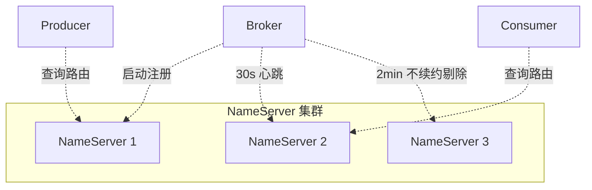
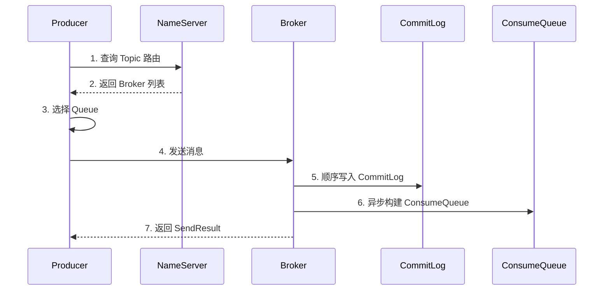
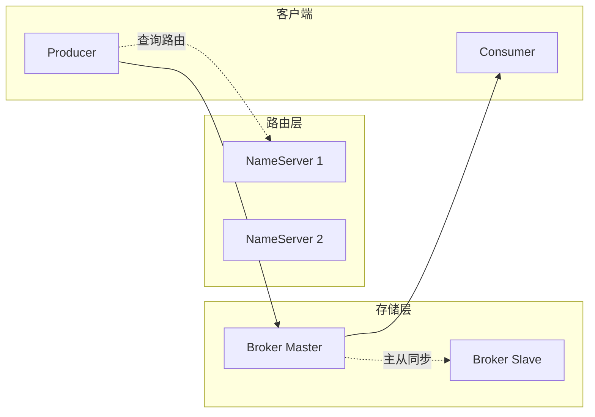
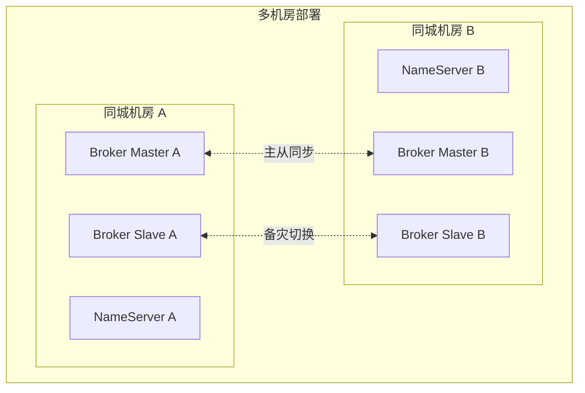

# RocketMQ 核心架构 · 入门全景

> 这是「从零开始认识 RocketMQ」系列的第 4 篇。深入讲清 RocketMQ 的「4 大角色 + 4 层协作 + 5 条核心链路」，建立理解后续所有特性的架构基线。

## 摘要

RocketMQ 的核心架构由 NameServer、Broker、Producer、Consumer 4 大角色组成，协作完成「注册 → 路由 → 发送 → 存储 → 消费」5 条核心链路。本文从「角色职责 → 协作流程 → 存储设计 → 消费设计 → 高可用设计」5 个角度，穿透 RocketMQ 的核心架构。学完本文能回答「RocketMQ 由哪几部分组成」「一条消息从发送到消费的完整路径是什么」「RocketMQ 如何保证高可用」。

---

## 一、背景：RocketMQ 架构的演进

RocketMQ 的核心架构经历了 3 个版本的演进：

| 版本 | 架构特征 | 关键变化 |
|---|---|---|
| **3.x** | NameServer + Broker + Producer/Consumer | 经典 4 角色架构 |
| **4.x** | 引入 DLedger 多副本 | Broker 层高可用升级 |
| **5.x** | 引入 Controller + Proxy | 路由层和接入层分离 |

跨周期经验：10 年来 RocketMQ 的架构没有「颠覆式变化」，只有「**渐进式增强**」——这种稳定性是它能在生产环境中长期被信赖的根本原因。

战略判断：未来 5 年，RocketMQ 的架构会往「**存算分离 + 多语言接入**」演进，但核心 4 角色架构不会变。

## 二、原理穿透：4 大角色的职责

### 2.1 NameServer（路由注册中心）

机制穿透：NameServer 设计的精妙之处是「**无状态 + AP 模型**」——
- **无状态**：不持久化任何数据，Broker 启动时上报路由信息
- **AP 模型**：NameServer 之间互相不通信，不存在选主脑裂
- **代价**：Broker 上线到被发现有最长 30 秒延迟

### 2.2 Broker（消息存储节点）

机制穿透：Broker 是 RocketMQ 的「**存储 + 计算**」核心——既负责消息持久化（CommitLog），又负责消费投递（ConsumeQueue）。

### 2.3 Producer（生产者）

机制穿透：Producer 是「**无状态 + 智能路由**」——本地缓存路由表，定时更新；选择 Queue 时支持多种策略（轮询、随机、Hash）。

### 2.4 Consumer（消费者）

机制穿透：Consumer 的核心是「**消费位点管理**」——offset 存在 Broker 端（RemoteBrokerOffsetStore）或本地（LocalFileOffsetStore）。

## 三、主流业界解法：消息队列的 4 种角色模型

跨系统架构角度，市面上的 MQ 在角色模型上有 4 种主流做法：

| 模型 | 代表 | 角色数量 | 特点 |
|---|---|---|---|
| **4 角色模型** | RocketMQ | NameServer + Broker + Producer + Consumer | 角色清晰 |
| **3 角色模型** | Kafka | Broker + Producer + Consumer + ZK | 依赖外部协调 |
| **2 角色模型** | RabbitMQ | Exchange + Queue | 协议层抽象 |
| **存算分离模型** | Pulsar | Broker + BookKeeper + Proxy | 角色更细 |

跨周期经验：4 角色模型是「**业务消息场景的最优抽象**」——太多角色会让运维复杂，太少角色会让职责不清。RocketMQ 的「**NameServer 无状态**」设计是这个模型的最大亮点。

跨业务形态视角：头部互联网公司的 MQ 团队都推崇「**清晰角色 + 无状态路由**」的设计——这是行业共识。

## 四、量级演进：RocketMQ 架构的 3 个量级台阶

量级演进视角，RocketMQ 的架构在不同量级下的关键挑战：

| 量级 | 关键挑战 | 架构应对 | 业内通用方案 |
|---|---|---|---|
| **万级 TPS** | 单机瓶颈 | 单 Master + 异步刷盘 | 4 核 8G 起步 |
| **十万 TPS** | 主从切换脑裂 | DLedger 多副本 | 至少 3 副本 |
| **百万 TPS** | 路由层瓶颈 | Controller 集群 + Proxy | 5.x 模式 |

5 年后回头看：2018 年大家还在纠结「主从切换的 30 秒延迟」，2024 年的 DLedger 已经把延迟降到秒级；当年「NameServer 互相独立」的争议，在 5.x 的 Controller 模式下有了新解法。

## 五、架构设计：RocketMQ 的完整消息链路

### 5.1 消息发送链路

### 5.2 消息消费链路

机制穿透：消费链路包括「Consumer 拉取 → Broker 查 ConsumeQueue → 读 CommitLog → 返回消息 → 处理 → 提交 offset」6 个步骤，每一步都有对应的 Trade-off。

### 5.3 主从复制链路

机制穿透：RocketMQ 的主从复制有 2 种模式——
- **同步双写**：Master 等 Slave 写入成功才返回（强一致，性能差）
- **异步复制**：Master 立即返回，后台同步（最终一致，性能好）

Trade-off 跨期：「同步 vs 异步」是分布式复制的经典 Trade-off。10 年前选「同步双写」是合理选择（业务可靠性优先），2024 年的 DLedger Raft 协议是更优解——这个演进是「**架构升级 + 一致性算法成熟**」的结果。

## 六、生产画像：RocketMQ 架构在生产中的关键监控

（脱敏通用画像）

| 监控项 | 关键指标 | 告警阈值 | 业内通用做法 |
|---|---|---|---|
| **Broker 健康** | 进程存活 + 心跳 | 进程消失立即告警 | 进程守护 + 自动拉起 |
| **磁盘使用** | 占用率 | >80% 警告，>90% 危险 | 监控 + 自动清理 |
| **消息堆积** | Consumer offset 落后量 | >10 万条告警 | 监控 + 扩容 |
| **生产 TPS** | send rate | 突降 50% 告警 | 监控 + 排查 |
| **消费 TPS** | consume rate | 突降 50% 告警 | 监控 + 排查 |
| **主从延迟** | Slave 落后 Master offset | >1000 告警 | 监控 + 切换 |

生产事故推演：业内最常见的 4 类架构级事故——
1. **NameServer 全挂**：客户端缓存路由仍可写，但消费全部失败 → 30 分钟内必须恢复，根因是「NameServer 部署单点」
2. **Broker 主从切换**：同步双写期间切换 → 消息可能丢失 → 必须双 Master 双 Slave，应急方案是「自动切换 + 人工确认」
3. **CommitLog 损坏**：磁盘故障 → 消息不可读 → 必须 3 副本，踩坑点是「副本数不足」
4. **ConsumeQueue 错位**：索引和 CommitLog 不一致 → 消费位点错乱 → 必须重建，根因是「ReputMessageService 异常」

机制穿透：上面 4 个事故的根因都不是「RocketMQ 本身的问题」，而是「**架构级冗余没做够**」——这是入门者最该警惕的「容量规划」风险。

业内案例补充：某次大促期间，一个 Broker 所在磁盘的写延迟突然升高。Producer 先出现发送超时，客户端自动重试又放大了写入流量；随后主从复制差距扩大，Consumer 的堆积量持续上升。表面看是「生产和消费同时变慢」，真正的根因却是单个存储节点抖动引发的链路级放大。这类事故说明，不能把发送失败率、消费堆积和磁盘告警割裂来看。

业内通用的 5 分钟定位顺序是「**客户端 → 路由 → Broker → 存储 → 副本**」：先判断失败是否集中在某个 Broker，再检查写入耗时和磁盘延迟，最后确认 Slave 落后量与 ConsumeQueue 构建进度。若只有单节点异常，应先暂停向该节点分配新增写流量，让客户端刷新路由；同时保留健康副本承接读取，避免一上来重启整个集群，把局部故障扩大成全局事故。

恢复阶段通常分三步：第一步保护核心 Topic，对低优先级流量限速；第二步修复磁盘或切换健康副本，并观察主从差距收敛；第三步再逐步恢复流量，核对发送成功率、消费延迟与堆积下降斜率。跨系统架构上，还要让业务监控与 MQ 监控使用同一条消息标识串联排查，否则上游只看到超时、下游只看到重复，双方很难在事故窗口内形成统一判断。

这背后的 Trade-off 是：冗余副本和精细监控会增加机器成本与运维复杂度，但它们购买的不是「平时更快」，而是「故障时可以局部止损」。业内更看重故障域隔离、限流开关和恢复演练，而不是单纯追求峰值 TPS；量级越大，这种投入越接近可靠性的基础设施，而不是可选优化。

## 七、Trade-off：RocketMQ 架构设计的 5 个核心 Trade-off

机制穿透角度，RocketMQ 架构设计上有 5 个核心 Trade-off：

| 设计选择 | 收益 | 代价 | 适用场景 |
|---|---|---|---|
| **NameServer 无状态** | 无脑裂风险 | 30 秒路由发现延迟 | 不追求毫秒级扩缩容 |
| **顺序写 CommitLog** | 亿级堆积不掉速 | 按 key 查询要扫 IndexFile | 写多读少 |
| **主从异步复制** | 高吞吐 | 主从切换有数据丢失风险 | 允许最终一致 |
| **DLedger Raft 副本** | 强一致性 | 写入性能下降 30% | 金融级场景 |
| **长轮询拉模式** | 实时性好 | Broker 连接数较多 | 消费规模可控 |

Trade-off 跨期：当年选「NameServer 无状态」是合理 Trade-off（运维简单），5 年后回头看，5.x 的 Controller 模式在「**强一致 + 自动化**」上更优。这个「Trade-off 升级」是技术演进的常态。

跨业务形态视角：金融 / 电商系业务全面切到「DLedger + 5.x Controller」；流量 / 内容系仍大量用「异步复制 + Kafka 协议」；传统金融仍在「同步双写 + 4.x」。这不是「谁对谁错」，而是「**业务体量 + 一致性诉求**」决定选型。

战略判断：未来 5 年，RocketMQ 架构会往「**Controller + Proxy + Pop 消费 + gRPC 协议**」四个方向收敛。这是社区共识。

## 八、反思：理解 RocketMQ 架构的 3 个关键认知

入门者最该记住的 3 个关键认知：

1. **NameServer 是 AP 模型**——它不保证强一致，但能保证高可用
2. **Broker 是核心中的核心**——所有可靠性和高可用设计都围绕它
3. **客户端是无状态的**——路由缓存、定时更新、失败重试都在客户端

跨周期经验：从 2018 到 2024，业内对 RocketMQ 架构的认知经历了「**单 Master 起步 → DLedger 多副本 → Controller 选举**」三个阶段。这个演进是「**业务体量爆发 + 一致性算法成熟**」的结果。

监管意图角度：RocketMQ 集群如果处理跨境数据，需要符合《个人信息保护法》和 GDPR 的合规要求——业内通用做法是「**专用集群 + 审计日志 + 跨境专线**」，满足境内外的双重合规边界。

跨系统架构：RocketMQ 的上下游边界非常清晰——上游是业务应用（Producer/Consumer），中间是 NameServer + Broker 集群，下游是存储与监控。这种「**清晰的边界**」是它能在大规模生产中稳定运行的根本原因。

### 8.1 RocketMQ 完整数据流向

跨系统架构：完整的消息流向包括「**客户端启动 → 路由查询 → 消息发送 → 持久化 → 主从同步 → 消费投递 → offset 提交**」7 个步骤，每一步都是上下游对接的关键节点。

### 8.2 RocketMQ 集群拓扑

战略判断：未来 5 年，RocketMQ 集群拓扑会从「**同城双活 + 异地灾备**」演进为「**多云联邦 + 自动故障切换**」——这是云原生时代的关键演进方向。

### 8.3 4 大角色的协作链路

机制穿透：完整的消息生命周期包括「**生产者启动 → 路由查询 → 消息发送 → Broker 持久化 → 主从同步 → 消费拉取 → offset 提交**」7 个阶段，每个阶段都有对应的 Trade-off。

跨周期经验：从 2018 到 2024，业内对 RocketMQ 4 大角色的协作认知经历了「**简单注册 → 心跳维护 → Controller 选举**」三个阶段，每个阶段都提升了系统的可用性和一致性。

### 8.4 RocketMQ 与上下游系统的边界

跨系统架构：RocketMQ 的边界非常清晰——上游是业务应用（Producer/Consumer），下游是存储与监控，中间是 NameServer + Broker。这种「**清晰的边界**」让 RocketMQ 可以独立演进而不影响上下游系统的稳定性。

### 8.5 4 大角色在生产中的关键作用

跨周期经验：4 大角色在生产中的关键作用分别是「**NameServer 是路由大脑、Broker 是存储核心、Producer 是消息入口、Consumer 是消息出口**」。每个角色的稳定性都直接影响整个系统的可用性。

### 8.6 RocketMQ 与其他 MQ 的架构对比

跨系统架构：RocketMQ 与其他 MQ 在架构上的核心差异是「**NameServer 无状态 + Broker Master/Slave + 客户端无状态**」三件套。这种架构既保证了高可用，又保证了易运维。

### 8.7 核心架构的 5 个常见问题

跨周期经验：核心架构的 5 个常见问题是「**NameServer 选举、Broker 主从切换、Consumer 负载均衡、Producer 路由刷新、消息重复消费**」。每个问题都对应一类生产事故的根因。

---

## 附录 A：术语速查表

| 术语 | 解释 |
|---|---|
| **NameServer** | 路由注册中心，无状态 |
| **Broker** | 消息存储节点 |
| **Producer** | 消息生产者 |
| **Consumer** | 消息消费者 |
| **Topic** | 消息主题 |
| **Queue** | 消息物理队列 |
| **CommitLog** | Broker 存储消息的物理文件 |
| **ConsumeQueue** | 消息逻辑索引 |
| **DLedger** | 基于 Raft 的多副本机制 |
| **Controller** | 5.x 的选举式路由组件 |
| **Proxy** | 5.x 的无状态接入层 |
| **长轮询** | Consumer 拉取消息的模式 |
| **同步双写** | Master + Slave 都写入才返回 |
| **异步复制** | Master 写入即返回 |
| **主从切换** | Master 故障后 Slave 升级 |

---

## 📌 数据与事实声明

本文涉及的 RocketMQ 架构描述、组件角色、监控指标均为 Apache RocketMQ 社区公开文档描述。具体版本特性请以官方文档为准（https://rocketmq.apache.org/）。文中「业内通用做法」系行业认知总结，非特定公司实践。