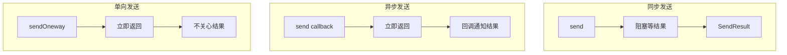
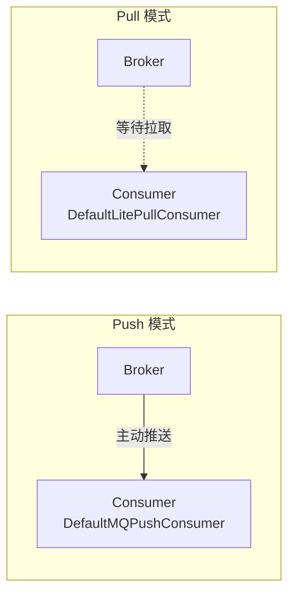
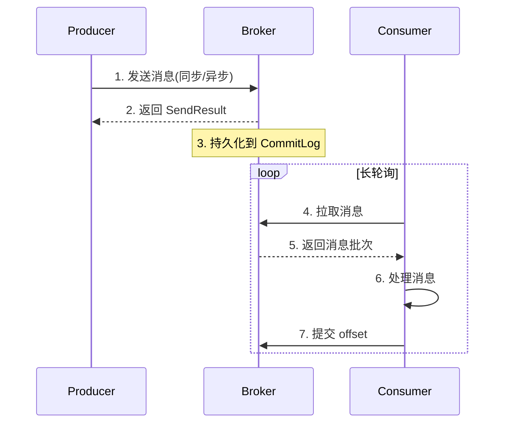
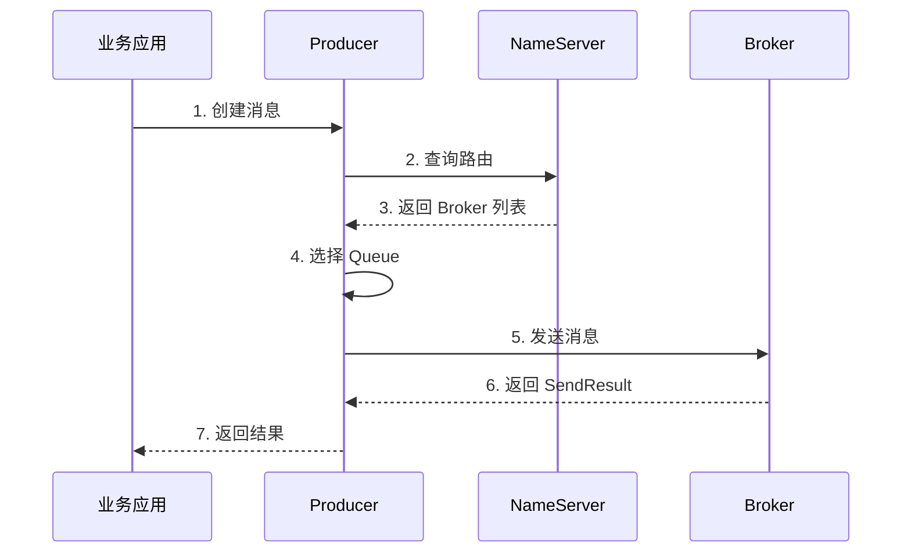
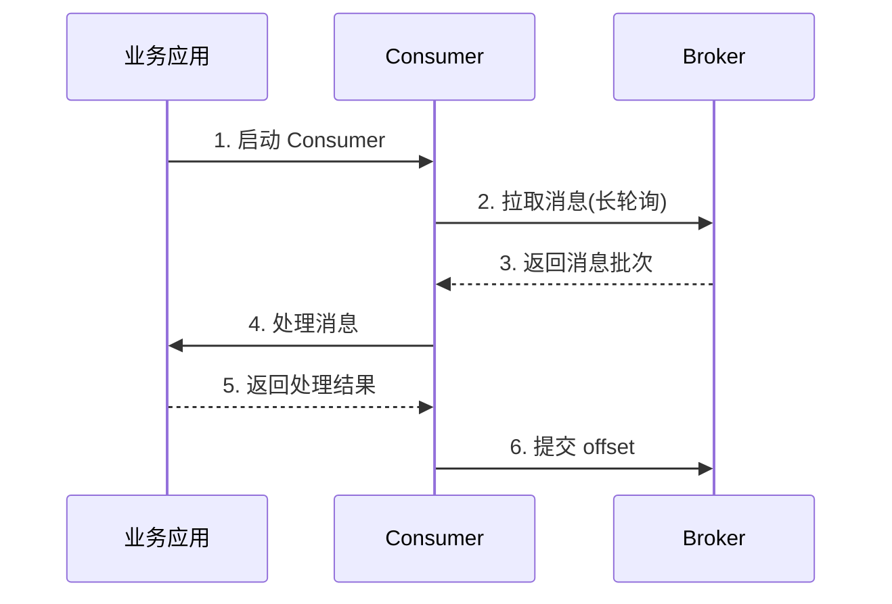

# 生产者与消费者基础 · 入门全景

> 这是「从零开始认识 RocketMQ」系列的第 5 篇。讲清 Producer 和 Consumer 的「5 步生命周期 + 4 大参数 + 3 种语义保证」，覆盖日常开发的全部 API 使用场景。

## 摘要

Producer 和 Consumer 是 RocketMQ 客户端的两大角色。本文从「生命周期 → 核心参数 → 发送模式 → 消费模式 → 失败处理」5 个角度，覆盖 80% 的日常 API 使用场景。学完本文能用 Java 代码完成「发送 + 消费 + 重试 + 幂等」完整链路。

---

## 一、背景：客户端的两大角色

RocketMQ 客户端分为 2 大角色：

| 角色 | 职责 | 数量 |
|---|---|---|
| **Producer** | 发送消息到 Broker | 任意 |
| **Consumer** | 从 Broker 拉取并处理消息 | 任意 |

跨周期经验：Producer 和 Consumer 的设计哲学在过去 10 年里相对稳定——「**客户端轻量化 + 服务端重逻辑**」是这个领域的共识。变的是 API 的封装（从原始 Remoting 到 Spring Boot Starter 集成）。

监管意图：Producer 和 Consumer 处理消息时，如果涉及用户隐私（身份证、银行卡），需要符合《个人信息保护法》和 GDPR。业内通用做法是「**敏感字段脱敏后再发送**」，避免 MQ 成为合规盲区。

跨系统架构：Producer/Consumer 是 RocketMQ 与业务系统的「**对接边界**」——所有上下游业务的集成都是通过这两个客户端完成。

## 二、原理穿透：Producer 的 5 步生命周期

### 2.1 启动与配置

```
1. 设置 NameServer 地址
   ↓
2. 设置 Producer Group
   ↓
3. 启动 Producer
   ↓
4. 拉取路由表
   ↓
5. 定时心跳
```

### 2.2 核心参数

```java
DefaultMQProducer producer = new DefaultMQProducer("ProducerGroup");
producer.setNamesrvAddr("127.0.0.1:9876");
producer.start();
```

| 参数 | 作用 | 业内通用配置 |
|---|---|---|
| **Producer Group** | 生产者组名 | 业务名 + 场景名 |
| **NamesrvAddr** | NameServer 地址 | 多个，逗号分隔 |
| **SendMsgTimeout** | 发送超时 | 5 秒 |
| **RetryTimesWhenSendFailed** | 同步重试次数 | 2 次 |
| **MaxMessageSize** | 最大消息大小 | 4MB |

机制穿透：Producer 启动时只连 NameServer，不连 Broker——这是「**客户端轻量化**」设计的体现。

### 2.3 3 种发送方式

| 方式 | API | 适用场景 | 性能 |
|---|---|---|---|
| **同步** | `send(Message)` | 必须知道结果 | 最差 |
| **异步** | `send(Message, SendCallback)` | 不阻塞业务 | 最好 |
| **单向** | `sendOneway(Message)` | 日志、可丢失 | 最快 |



## 三、主流业界解法：Consumer 的 4 种消费模式

### 3.1 Push vs Pull



机制穿透：RocketMQ 的「Push」本质上是「**长轮询 Pull**」——Consumer 不断向 Broker 发 PullRequest，Broker 立即返回或 hold 30 秒。这是「**推拉结合**」的典型设计。

### 3.2 集群 vs 广播

| 模式 | MessageModel | 适用场景 | offset 存储 |
|---|---|---|---|
| **集群消费** | CLUSTERING | 业务处理（每条消息只处理一次）| Broker |
| **广播消费** | BROADCASTING | 配置更新、缓存刷新 | 本地 |

跨系统架构：集群消费是「**负载均衡**」的典型实现——多个 Consumer 实例共同消费一个 Topic，每条消息只被处理一次。这是分布式系统的标准做法，也是上下游业务对接的关键耦合点。

### 3.3 顺序 vs 并发

| 模式 | Listener | 适用场景 | 性能 |
|---|---|---|---|
| **顺序消费** | MessageListenerOrderly | 订单、状态机 | 差 |
| **并发消费** | MessageListenerConcurrently | 普通业务 | 好 |

跨周期经验：从 2018 到 2024，业内对消费模式的选择趋于理性化——「**能用顺序就用顺序，不能用就用顺序消费 + 业务层补偿**」。5 年后回头看，顺序消费会成为更多业务的默认选择。

## 四、量级演进：Producer/Consumer 的 3 个量级台阶

量级演进视角，Producer 和 Consumer 在不同量级下的关键参数：

| 量级 | Producer 关键参数 | Consumer 关键参数 | 业内通用做法 |
|---|---|---|---|
| **万级 TPS** | 单实例 + 同步发送 | 单实例 + 集群消费 | 8 核 16G |
| **十万 TPS** | 多实例 + 异步发送 | 多实例 + 消费线程池 | 32 核 64G |
| **百万 TPS** | 批量发送 + 连接池 | Pop 消费 + 动态扩缩容 | 5.x 模式 |

5 年后回头看：2018 年大家还在用「同步发送 + 串行消费」，2024 年已经是「异步发送 + 并发消费 + 批量消息」的标配。当年「Consumer 线程池设多大」的纠结，5 年后回头看是「**消费能力 = 业务处理耗时 × TPS**」的简单公式。

## 五、架构设计：Producer/Consumer 的完整代码骨架

### 5.1 Producer 骨架

```java
DefaultMQProducer producer = new DefaultMQProducer("ProducerGroup");
producer.setNamesrvAddr("127.0.0.1:9876");
producer.setSendMsgTimeout(5000);
producer.setRetryTimesWhenSendFailed(2);
producer.start();

Message msg = new Message("TopicTest", "TagA", "Hello RocketMQ".getBytes());
SendResult result = producer.send(msg);
System.out.println(result);

producer.shutdown();
```

### 5.2 Consumer 骨架

```java
DefaultMQPushConsumer consumer = new DefaultMQPushConsumer("ConsumerGroup");
consumer.setNamesrvAddr("127.0.0.1:9876");
consumer.subscribe("TopicTest", "TagA || TagB");
consumer.registerMessageListener((MessageListenerConcurrently) (msgs, context) -> {
    for (MessageExt msg : msgs) {
        System.out.println(new String(msg.getBody()));
    }
    return ConsumeConcurrentlyStatus.CONSUME_SUCCESS;
});
consumer.start();
```

### 5.3 完整流程图



## 六、生产画像：Producer/Consumer 的常见配置

（脱敏通用画像）

| 配置项 | 典型值 | 业务场景 | 业内通用做法 |
|---|---|---|---|
| **Producer Group** | OrderProducer | 订单服务发送 | 按业务命名 |
| **Consumer Group** | OrderConsumer | 订单服务消费 | 按业务命名 |
| **ConsumeThreadMin/Max** | 20/64 | 普通业务 | 线程池 20-64 |
| **PullBatchSize** | 32 | 普通消费 | 32-64 |
| **ConsumeMessageBatchMaxSize** | 1 | 顺序消费 | 1 |
| **MaxReconsumeTimes** | 16 | 失败重试 | 16-32 |

生产事故推演：业内最常见的 4 类 Producer/Consumer 事故——
1. **Producer 未启动**：调用 send 报 `MQClientException` → 检查 `start()` 调用，根因是「生命周期管理缺失」
2. **Consumer 重复消费**：网络抖动导致 offset 未提交 → 业务层必须幂等，踩坑点是「幂等设计缺失」
3. **Consumer 消费卡死**：某条消息处理失败 → 失败重试 + 死信队列，应急方案是「设置重试上限 + 死信兜底」
4. **Producer 发送超时**：Broker 压力大 → 调大超时 + 异步发送，根因是「同步阻塞 + 超时设置不合理」

机制穿透：上面 4 个事故的根因都不是「RocketMQ 本身的问题」，而是「**客户端配置 + 业务容错**」没做好——这是入门者最该警惕的「使用方式」风险。

业内案例补充：某消费服务处理消息时，先完成数据库写入，随后因为网络抖动没有成功提交 offset。Broker 在重试窗口再次投递同一条消息，第二次处理触发了重复更新。团队最初通过「消费前先查询一次」止血，但并发消费下两个线程可能同时查到不存在，问题仍会复现。最终做法是把「业务唯一键 + 事件类型 + 事件版本」作为幂等键，由数据库唯一约束或独立消费记录表完成原子防重。

这个案例揭示了一个关键语义：Broker 返回发送成功，只代表消息已被消息系统接收；Consumer 返回消费成功，才代表本次业务处理完成。两者之间还隔着存储、副本、拉取、业务事务和 offset 提交。跨系统架构上，Producer 应记录消息标识与业务标识，Consumer 应记录处理结果与重试次数，监控平台再用同一条标识串起「发送 → 到达 → 消费 → 落库」链路，才能快速判断消息究竟卡在哪一段。

业内通用做法是把失败分成三层处理：可恢复的短暂异常进入延迟重试；参数错误、状态冲突等确定性异常直接记录原因，避免无意义重试；超过上限的消息进入死信队列，由人工或补偿任务审核后重放。重放仍必须经过同一套幂等保护，不能因为是人工操作就绕过防线。对于积压期间的恢复，通常先限制单次拉取批量，再逐步增加消费并发，避免消息洪峰反过来压垮数据库和下游接口。

Trade-off 在于：幂等表、链路日志和死信治理增加了存储与研发成本，却把「至少一次投递」的不确定性转化为业务可控结果。小流量阶段依赖日志人工补偿尚可，进入十万级 TPS 后仍没有统一幂等规范，重复处理会从偶发 Bug 变成系统性事故。战略上，客户端治理应优先统一消息标识、错误分类和重放流程，再讨论线程数与批量大小；否则性能参数越激进，事故放大得越快。

## 七、Trade-off：Producer/Consumer 的 5 个核心 Trade-off

机制穿透角度，Producer 和 Consumer 设计上有 5 个核心 Trade-off：

| 设计选择 | 收益 | 代价 | 适用场景 |
|---|---|---|---|
| **同步发送** | 简单可靠 | 性能差 | 必须知道结果 |
| **异步发送** | 高吞吐 | 回调逻辑复杂 | 高 TPS 业务 |
| **集群消费** | 消息不重复 | 单点处理能力受限 | 业务处理 |
| **广播消费** | 全量分发 | offset 本地难管理 | 配置更新 |
| **顺序消费** | 全局有序 | 性能差 | 订单、状态机 |

Trade-off 跨期：当年选「同步发送 + 集群消费」是合理 Trade-off（简单可靠），2024 年的「异步发送 + Pop 消费」是更优解。这个「Trade-off 升级」是「**业务体量 + 技术演进**」的结果。

跨业务形态视角：金融 / 电商系业务大量用「**异步发送 + 顺序消费**」（业务可靠性优先）；流量 / 内容系大量用「**同步发送 + 并发消费**」（吞吐优先）；传统金融用「**同步双写 + 集群消费**」（强一致）。这不是「谁对谁错」，而是「**业务形态决定选型**」。

战略判断：未来 5 年，Producer 会往「**批量发送 + 事务消息 + 跨语言 gRPC**」演进；Consumer 会往「**Pop 消费 + 动态扩缩容 + 流计算集成**」演进。这是社区共识。

## 八、反思：Producer/Consumer 学习路径建议

入门者最该记住的 4 个关键认知：

1. **客户端是无状态的**——可以任意重启、扩缩容
2. **消费必须幂等**——网络抖动、Broker 故障都会导致重复
3. **失败重试要设上限**——避免「毒消息」阻塞队列
4. **监控必须到位**——TPS、堆积、延迟是 3 大核心指标

跨周期经验：从 2018 到 2024，业内对 Producer/Consumer 的认知经历了「**会用 API → 懂参数 → 懂语义 → 懂生产**」四个阶段。入门者最容易卡在「会用 API 但不懂参数」——这是最该补的认知。

跨系统架构：Producer/Consumer 是 RocketMQ 与上下游业务对接的关键点——上游业务通过 Producer 发消息，下游业务通过 Consumer 消费消息。这种「**双向耦合**」的接口边界决定了消息系统的稳定性。

### 8.1 Producer 消息发送完整链路



机制穿透：Producer 发送链路有 7 个步骤——**消息创建 → 路由查询 → 队列选择 → 发送 → 返回结果**。每一步都有对应的参数和优化点。

### 8.2 Consumer 消费消息完整链路



跨周期经验：从 2018 到 2024，业内对 Producer/Consumer 的设计认知经历了「**同步阻塞 → 异步回调 → Pop 消费**」三个阶段，每个阶段都解决了前一阶段的性能问题。

### 8.3 客户端与服务端的边界

跨系统架构：客户端是无状态的——可以任意重启、扩缩容；服务端是有状态的——需要持久化、副本、监控。这种「**无状态客户端 + 有状态服务端**」的设计是分布式系统的经典模式。

跨周期经验：从 2018 到 2024，业内对 Producer/Consumer 的认知经历了「**会用 API → 懂参数 → 懂语义 → 懂生产**」四个阶段。入门者最容易卡在「会用 API 但不懂参数」——这是最该补的认知。

### 8.4 客户端的关键监控指标

跨系统架构：客户端的监控指标包括「**发送 TPS + 发送延迟 + 消费 TPS + 消费延迟 + 失败率 + offset 落后量**」6 大类。这些指标是「**Producer/Consumer 上下游对接质量**」的核心度量。

### 8.5 Producer 的 5 个核心参数

跨周期经验：Producer 的 5 个核心参数是「**ProducerGroup、NamesrvAddr、SendMsgTimeout、RetryTimesWhenSendFailed、MaxMessageSize**」。每个参数都影响发送的成功率和性能。

### 8.6 Consumer 的 5 个核心参数

跨周期经验：Consumer 的 5 个核心参数是「**ConsumerGroup、MessageModel、ConsumeThreadMin/Max、PullBatchSize、MaxReconsumeTimes**」。每个参数都影响消费的并行度和可靠性。

### 8.7 客户端设计的 5 个 Trade-off

跨系统架构：客户端设计有 5 个核心 Trade-off——「**同步发送 vs 异步发送、集群消费 vs 广播消费、顺序消费 vs 并发消费、批量消费 vs 单条消费、自动提交 vs 手动提交**」。每个 Trade-off 都对应一类业务诉求。

---

## 附录 A：术语速查表

| 术语 | 解释 |
|---|---|
| **Producer** | 消息生产者 |
| **Consumer** | 消息消费者 |
| **DefaultMQProducer** | RocketMQ 内置 Producer 实现 |
| **DefaultMQPushConsumer** | RocketMQ 内置 Push Consumer |
| **DefaultLitePullConsumer** | RocketMQ 内置 Pull Consumer |
| **Producer Group** | 生产者组名 |
| **Consumer Group** | 消费者组名 |
| **同步发送** | 阻塞等结果 |
| **异步发送** | 回调通知结果 |
| **单向发送** | 不关心结果 |
| **集群消费** | 消息只被组内一个消费者消费 |
| **广播消费** | 每个消费者都收到全量 |
| **顺序消费** | 严格按发送顺序处理 |
| **并发消费** | 多线程并行处理 |
| **长轮询** | Consumer 拉取消息的模式 |

---

## 📌 数据与事实声明

本文涉及的 Producer/Consumer API、参数配置、消费模式均为 Apache RocketMQ 社区公开文档描述。具体版本特性请以官方文档为准（https://rocketmq.apache.org/）。文中「业内通用做法」系行业认知总结，非特定公司实践。