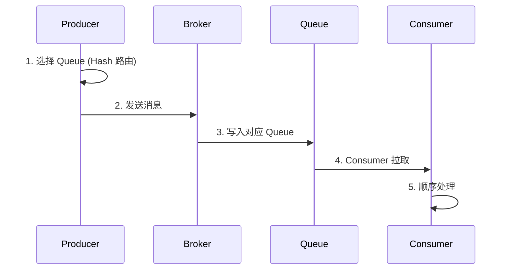
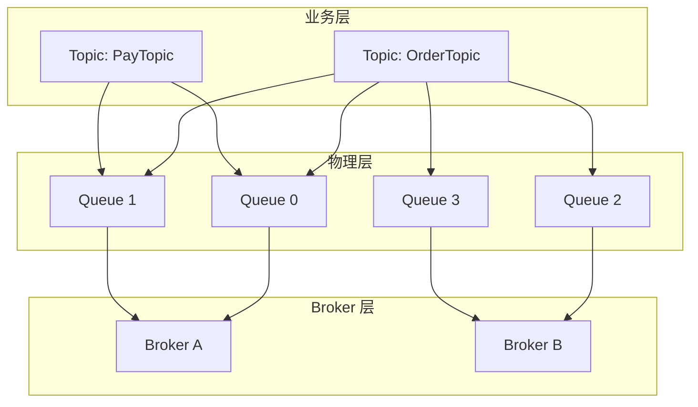
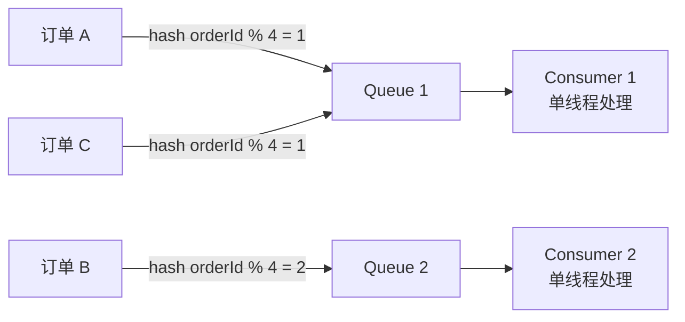
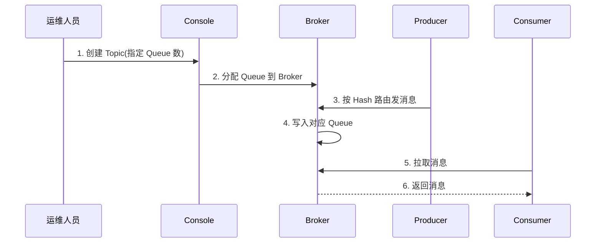

# Topic 与 Queue 基础 · 入门全景

> 这是「从零开始认识 RocketMQ」系列的第 7 篇。讲清 Topic 和 Queue 的「概念模型 → 创建方式 → 路由分配 → 数量规划 → 最佳实践」，建立 RocketMQ 消息分类的核心心智模型。

## 摘要

Topic 是 RocketMQ 中消息的「逻辑分类」，Queue 是消息的「物理载体」。本文从「概念模型 → 创建方式 → 路由分配 → 数量规划 → 顺序保证」5 个角度，讲清 Topic 与 Queue 的全部使用细节。学完本文能回答「Topic 和 Queue 的关系」「Queue 数量怎么定」「如何保证顺序消息」。

---

## 一、背景：为什么需要 Topic 和 Queue

RocketMQ 的消息组织模型是「**Topic + Queue**」两层结构：

- **Topic**：消息的逻辑分类（业务视角）
- **Queue**：消息的物理载体（存储视角）

跨周期经验：Topic/Queue 这种「**逻辑层 + 物理层**」的二元结构在过去 10 年里基本没变——它来自数据库领域「**表 + 索引**」的设计哲学。变的是「**Queue 的数量规划策略**」——从早期的「拍脑袋」演进到「基于 TPS 和消费者数量的算法」。

监管意图：Topic 命名如果涉及业务敏感信息，需要符合《个人信息保护法》和 GDPR 的合规要求——业内通用做法是「**Topic 命名只表达业务类型，不包含个人信息**」，满足境内外的合规边界。

## 二、原理穿透：Topic 与 Queue 的概念关系

### 2.1 Topic 模型

```
业务系统
├── OrderTopic       # 订单事件
├── PayTopic         # 支付事件
└── StockTopic       # 库存事件

Producer
├── 订单服务  ──> OrderTopic
├── 支付服务  ──> PayTopic
└── 库存服务  ──> StockTopic

Consumer
├── 订单消费者 <── OrderTopic
├── 支付消费者 <── OrderTopic + PayTopic
└── 库存消费者 <── StockTopic
```

机制穿透：Topic 是「**业务事件的逻辑分类**」——订单事件归 OrderTopic，支付事件归 PayTopic。不同 Topic 之间完全隔离。

### 2.2 Queue 模型

机制穿透：Queue 是「**消息的物理载体**」——一个 Topic 可以有多个 Queue（默认 4 个），分布在多个 Broker 上。

```
OrderTopic
├── Queue 0  ──> Broker A
├── Queue 1  ──> Broker A
├── Queue 2  ──> Broker B
└── Queue 3  ──> Broker B
```

### 2.3 Topic 与 Queue 的关系

| 维度 | Topic | Queue |
|---|---|---|
| **数量** | 通常 1-100 个 | 每个 Topic 默认 4 个 |
| **作用** | 逻辑分类 | 物理并行度 |
| **创建方式** | 自动或手动 | 创建 Topic 时指定 |
| **可修改** | 否（不可改） | 否（不可改） |
| **顺序性** | 不保证 | 严格保证 |

机制穿透：Topic 不可修改，Queue 数量也不可修改——这是 RocketMQ 的设计哲学，避免「**运行时变更导致的数据错乱**」。

## 三、主流业界解法：Topic 与 Queue 的 3 种组织方式

跨系统架构角度，市面上 MQ 的 Topic/Queue 组织方式有 3 种：

| 方式 | 代表 | 设计哲学 | 适用场景 |
|---|---|---|---|
| **Topic + Queue 模型** | RocketMQ / Kafka | 业务事件 + 物理并行 | 业务消息 |
| **Exchange + Queue 模型** | RabbitMQ | 协议灵活 + 路由规则 | 企业集成 |
| **Namespace + Topic 模型** | Pulsar | 多租户 + 跨集群 | 多租户云原生 |

跨业务形态视角：头部互联网公司的 Topic 命名规范略有差异——金融 / 电商系习惯「**业务域_场景_Topic**」（如 `Trade_OrderCreate_Topic`）；流量 / 内容系习惯「**业务_场景_topic**」；传统金融习惯「**系统名_业务_Topic**」。这不是「谁对谁错」，而是「**团队规范决定命名**」。

## 四、量级演进：Queue 数量规划的 3 个台阶

量级演进视角，Queue 数量的规划可分为 3 个台阶：

| 量级 | Topic 数量 | Queue 数量 | 消费者数量 | 业内通用公式 |
|---|---|---|---|---|
| **万级 TPS** | 1-10 个 | 4-8 个 | 2-4 个 | Queue = 2 × Consumer |
| **十万 TPS** | 10-50 个 | 8-16 个 | 4-8 个 | Queue = Consumer × 2 |
| **百万 TPS** | 50-100 个 | 16-32 个 | 8-16 个 | Queue = Consumer × 2-4 |

5 年后回头看：2018 年大家还在「拍脑袋定 Queue 数量」，2024 年的标准做法是「**Queue = Consumer × 2-4**」（预留扩容空间）。当年「Queue 多了浪费」的争议，5 年后回头看是「**Queue 多了可以缩，Queue 少了不能加**」的结果。

跨周期经验：Queue 数量一旦设定就**不可修改**——这是 RocketMQ 的设计哲学。改 Queue 数量 = 重新创建 Topic = 数据迁移。所以「**宁可一开始多设一点**」是业内通用做法。

## 五、架构设计：Topic 创建与路由

### 5.1 自动创建 vs 手动创建

| 方式 | 配置项 | 适用场景 | 风险 |
|---|---|---|---|
| **自动创建** | `autoCreateTopicEnable=true` | 开发测试 | Queue 数量不可控 |
| **手动创建** | `autoCreateTopicEnable=false` | 生产环境 | 需要运维介入 |

### 5.2 Queue 路由分配

机制穿透：Queue 路由的核心是「**Hash 路由保证顺序**」——同一订单的消息通过 `orderId % Queue数` 路由到同一 Queue，被同一消费者顺序处理。这就是「**顺序消息的底层机制**」。

### 5.3 完整消息流向



### 5.4 Topic 与 Queue 在 Broker 上的物理分布

机制穿透：Queue 不是「虚拟概念」——它在 Broker 上的物理形态由三个文件组成：`commitLog`（消息实体，所有 Topic 共享）、`consumeQueue`（逻辑队列索引，按 Topic + QueueId 拆分）、`indexFile`（按 key 或时间戳查询的辅助索引）。每个 Broker 默认有 `~defaultQueueNums=8` 个写队列和对应数量的读队列，写读数量可分别配置但**只能按比例调整**，这是 5.x 之前的硬约束。

量级演进视角：早期 4.x 的 Queue 数量在 Broker 启动时静态加载，2024 年的 5.x 已经支持「**Broker 在线扩缩 Queue**」——通过 Controller 协调，把 Queue 在 Broker 之间迁移而无需重启。这是「**云原生 + 在线变更**」的产物，也是 RocketMQ 走向存算分离的关键一步。

跨系统架构：Queue 的物理分布直接影响「**消费并行度**」和「**数据均衡度**」——Queue 集中在一台 Broker 会形成热点，Queue 分散在多 Broker 才能扛住大规模 TPS。业内通用做法是「**Queue 数 ≥ Broker 数 × 2**」，避免单 Broker 热点。

监管意图：如果 Topic 内携带个人信息（PII），存储侧需要做「**字段级加密**」或「**消费侧脱敏**」，这跟 Queue 物理分布无关，但跟 commitLog 的留存策略直接相关——业内通用做法是「**敏感 Topic 单独集群 + 短留存 + 加密落盘**」，与等保 2.0 的存储加密要求对齐。

### 5.5 顺序消息的 3 个必要条件

机制穿透：顺序消息是入门者最容易踩坑的 Topic/Queue 机制，它依赖 3 个必要条件缺一不可——

1. **生产者顺序发送**：同一业务 key 的消息必须由同一 Producer 实例、同一个 `MessageQueueSelector` 路由到同一 Queue，多线程并发发送会破坏顺序
2. **Queue 单消费者串行处理**：同一 Queue 同一时刻只能被一个 Consumer 实例的一个线程拉取（PushConsumer 内部单线程或有序消费模式）
3. **消费失败不跳过**：消费失败必须阻塞队列而不是跳过，否则后续消息 offset 提交后前面失败的消息就「**丢了**」

跨周期经验：2018 年业内大量用「**全局顺序消息**」——只设 1 个 Queue，结果并行度为 0，性能惨不忍睹。2024 年的标准做法是「**业务 key 顺序 + 多 Queue 并行**」——按 orderId Hash 路由，同一订单的消息落同一 Queue，不同订单可以并行。这是「**局部顺序**」的胜利。

跨业务形态视角：金融 / 电商系业务强制要求「**顺序消息必须按业务 key 分区**」并提供 SDK 封装；流量 / 内容系习惯「**业务方自己保证顺序 key**」给到框架即可；传统金融习惯「**全局顺序 + 单 Queue**」保证强一致但牺牲性能。这不是「谁对谁错」，而是「**业务形态决定顺序粒度**」。

事故推演：业内最常见的顺序消息事故——「**Consumer 多线程并行消费同一 Queue**」，破坏顺序；「**重试队列消费顺序错乱**」（重试消息回到原 Queue 但 offset 在前面）；「**消费失败跳过导致丢消息**」。这三个事故的根因都是「**没理解顺序消息的三要素**」。

战略判断：未来 5 年，顺序消息会往「**事务消息 + 顺序消费一体化**」演进——5.x 已经在尝试把两者统一到同一个 API 上，减少入门者的心智负担。这是社区共识。

## 六、生产画像：Topic 与 Queue 的最佳实践

（脱敏通用画像）

| 业务场景 | Topic 数量 | Queue 数量 | 关键配置 | 业内通用做法 |
|---|---|---|---|---|
| **订单创建** | 1 个 | 4-8 个 | 顺序消息 | 按 orderId Hash |
| **支付回调** | 1 个 | 4-8 个 | 事务消息 | 至少 3 副本 |
| **日志采集** | 1 个 | 16-32 个 | 批量消息 | 异步刷盘 |
| **跨系统同步** | 1 个 | 4 个 | 双向同步 | 双向对账 |
| **实时计算** | 1 个 | 8-16 个 | Pop 消费 | 5.x 模式 |

生产事故推演：业内最常见的 4 类 Topic/Queue 事故——
1. **Queue 数量不足**：消费者多了但 Queue 不够 → 部分消费者空闲，根因是「容量规划不足」
2. **Queue 数量过多**：消息过于分散 → 顺序保证失效，应急方案是「合并 Queue + 重新路由」
3. **Topic 自动创建**：Queue 数量 = 4 → 后期扩缩容困难，踩坑点是「生产环境开了自动创建」
4. **命名不规范**：业务 + 系统混合 → 排查困难，根因是「命名规范缺失」

机制穿透：上面 4 个事故的根因都不是「RocketMQ 本身的问题」，而是「**Topic 规划 + Queue 数量规划**」没做好——这是入门者最该警惕的「架构设计」风险。

## 七、Trade-off：Topic 与 Queue 的 5 个核心 Trade-off

机制穿透角度，Topic 和 Queue 设计上有 5 个核心 Trade-off：

| 设计选择 | 收益 | 代价 | 适用场景 |
|---|---|---|---|
| **Queue 数量多** | 并行度高 | 顺序保证弱 | 普通业务 |
| **Queue 数量少** | 顺序保证强 | 并行度低 | 顺序业务 |
| **自动创建 Topic** | 开发简单 | Queue 数量不可控 | 测试环境 |
| **手动创建 Topic** | 生产可控 | 需要运维 | 生产环境 |
| **Hash 路由** | 同 key 同 Queue | Hash 倾斜 | 顺序消息 |

Trade-off 跨期：当年选「Queue 数量 = 4」是合理 Trade-off（默认配置），2024 年的「**Queue = Consumer × 2-4**」是更优解——这个「Trade-off 升级」是「**业务体量 + 容量规划经验沉淀**」的结果。

跨业务形态视角：金融 / 电商系业务习惯「**Queue 数量充足**」（预留扩容）；流量 / 内容系习惯「**Queue 与 Consumer 1:1**」（极致并行）；传统金融习惯「**Queue 数量保守**」（避免顺序错乱）。这不是「谁对谁错」，而是「**业务形态决定规划**」。

战略判断：未来 5 年，Topic 会往「**多租户 + 跨集群联邦**」演进；Queue 会往「**弹性扩缩容**」演进（5.x 已经支持在线调整）。这是社区共识。

## 八、反思：Topic 与 Queue 学习路径建议

4 个关键认知：

1. **Topic 是逻辑分类，Queue 是物理并行度**——两者职责不同
2. **Queue 数量一旦设定就不可修改**——所以宁可一开始多设
3. **Hash 路由是顺序消息的底层机制**——同 key 必须同 Queue
4. **生产环境必须手动创建 Topic**——自动创建是开发测试用的

跨周期经验：从 2018 到 2024，业内对 Topic/Queue 的认知经历了「**会用 → 懂规划 → 懂顺序 → 懂扩缩容**」四个阶段。入门者最容易卡在「会用但不懂规划」——这是最该补的认知。

跨系统架构：Topic/Queue 是消息上下游业务对接的「**逻辑边界**」——上游业务通过 Topic 表达业务语义，下游业务通过 Queue 决定并行度。这种「**清晰的双层接口**」让消息系统的上下游可以独立演进。

### 8.1 Topic 与 Queue 的分层模型



机制穿透：Topic/Queue 是「**业务层与物理层的映射**」——Topic 表达业务语义，Queue 决定并行度。这种「**双层抽象**」让消息系统的设计更灵活。

### 8.2 Hash 路由的顺序保证原理



跨周期经验：从 2018 到 2024，业内对 Topic/Queue 的设计认知经历了「**简单分类 → 分区并行 → Hash 顺序**」三个阶段，每个阶段都解决前一阶段的性能和顺序问题。

### 8.3 Topic 创建与消费的完整流程



机制穿透：Topic 创建后不可修改 Queue 数，所以「**一开始就规划好**」是业内通用做法。

### 8.4 Topic 与 Queue 的 5 个关键设计原则

跨周期经验：Topic 与 Queue 的设计有 5 个关键原则——「**业务语义清晰 + Queue 数量充足 + 顺序键设计合理 + 权限控制严格 + 监控到位**」。每个原则都对应一类常见事故。

跨系统架构：Topic 是消息系统的「**业务边界**」——上游业务通过 Topic 表达业务语义，下游业务通过 Topic 订阅消息。这种「**清晰的业务边界**」让消息系统的上下游可以独立演进。

### 8.5 Queue 数量规划的 4 个公式

跨周期经验：Queue 数量规划有 4 个常用公式——「**Queue = 2 × Consumer、Queue = Consumer × 2、Queue = Consumer × 4、Queue = 业务 TPS ÷ 单 Queue TPS**」。不同业务场景适用不同公式。

### 8.6 Queue 数量规划的 4 个常见误区

跨周期经验：Queue 数量规划有 4 个常见误区——

1. **误区 1：拍脑袋定 Queue 数**——早期常见，结果要么 Queue 多了浪费，要么 Queue 少了扩容困难。业内通用做法是「**先按 Consumer × 2 起算，再压测验证**」
2. **误区 2：Queue 数等于 Consumer 数**——看似 1:1 完美，但 Consumer 一扩容就出现「**Queue 不够**」的尴尬，业内通用做法是「**Queue 预留扩容空间**」
3. **误区 3：忽略业务 TPS 测算**——有些团队直接按 Broker 数 × 4 定 Queue，忽略了实际 TPS 与单 Queue 吞吐的差异。业内通用做法是「**按业务 TPS 倒推 Queue 数**」
4. **误区 4：跨业务 Topic 混用**——把订单、支付、日志塞到同一个 Topic，导致不同业务的 TPS 互相干扰，业内通用做法是「**业务隔离 + Topic 独立**」

跨业务形态视角：金融 / 电商系业务规范要求「**任何生产 Topic 必须有 Queue 规划文档**」并归档；流量 / 内容系习惯「**按业务方模板自动生成**」Queue 配置；传统金融习惯「**容量评估 + 季度回顾**」。这不是「谁对谁错」，而是「**运维成熟度决定规划粒度**」。

事故推演：业内最常见的 Queue 规划事故——「**双 11 临时扩容发现 Queue 不够**」，根因是「**没有按峰值 TPS 测算**」；「**新业务上线 Queue 数=4 默认值**」，根因是「**自动创建的默认值不适合业务**」；「**业务合并后 Queue 数不足**」，根因是「**业务演进没带动 Queue 演进**」。这三个事故的根因都是「**Queue 规划没跟上业务演进**」。

战略判断：未来 5 年，Queue 规划会从「**人工规划**」走向「**自动规划 + AI 推荐**」——基于历史 TPS 曲线和业务增长预测自动给出 Queue 数建议。这是 AIOps 在消息中间件领域的落地。

---

## 附录 A：术语速查表

| 术语 | 解释 |
|---|---|
| **Topic** | 消息主题（逻辑分类） |
| **Queue** | 消息物理队列 |
| **MessageQueueSelector** | 消息队列选择器 |
| **Hash 路由** | 按 key Hash 选 Queue |
| **轮询路由** | 顺序选 Queue |
| **自动创建** | Producer 发送时自动创建 Topic |
| **手动创建** | 运维手动创建 Topic |
| **Queue 数量** | Topic 下的物理队列数 |
| **写读权限** | Topic 的访问控制 |
| **顺序消息** | 同 key 消息严格有序 |
| **扩容** | 增加 Consumer 数量 |
| **缩容** | 减少 Consumer 数量 |
| **多租户** | 多个用户共享集群 |
| **跨集群联邦** | 跨集群的消息分发 |
| **弹性扩缩容** | 运行时调整 Queue 数量 |

---

## 📌 数据与事实声明

本文涉及的 Topic/Queue 概念、规划策略、路由机制均为 Apache RocketMQ 社区公开文档描述。具体版本特性请以官方文档为准（https://rocketmq.apache.org/）。文中「业内通用做法」系行业认知总结，非特定公司实践。