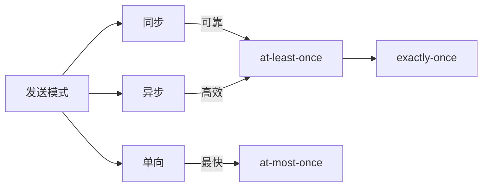
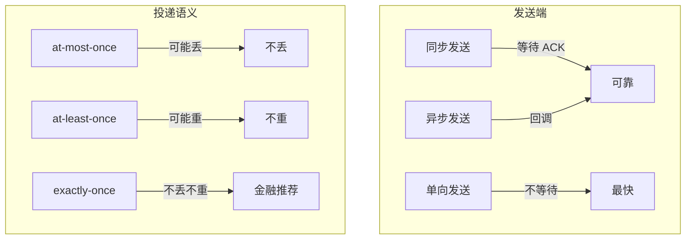

# 消息发送与投递语义

## 本文核心

**一句话摘要**：RocketMQ 支持同步/异步/单向三种发送模式，投递语义分为 at-least-once / exactly-once / at-most-once，金融场景推荐同步 + exactly-once。

**核心机制链**：发送模式 → 投递语义 → 可靠性保证 → 消息追踪 → 生产实践





## 一、三种发送模式

### 1.1 同步发送

```java
SendResult result = producer.send(message);
// 阻塞等待 Broker 返回 ACK
// 结果：SendStatus.SEND_OK / SEND_FLUSH_DISK_TIMEOUT / SEND_FLUSH_SLAVE_TIMEOUT
```

特点：可靠、延迟高（10-50ms）、适用于大多数场景。

### 1.2 异步发送

```java
producer.send(message, new SendCallback() {
    public void onSuccess(SendResult result) {
        // 处理成功
    }
    public void onException(Throwable e) {
        // 处理失败
    }
});
// 非阻塞、回调通知、适用于高吞吐场景
```

特点：高效、延迟低（1-10ms）、需处理回调异常。

### 1.3 单向发送

```java
producer.sendOneway(message);
// 不等待 ACK、不关心结果
```

特点：最快、可能丢消息、适用于日志/监控等不关键场景。

## 二、投递语义

### 2.1 三种语义对比

| 语义 | 可靠性 | 性能 | 适用场景 |
|---|---|---|---|
| **At-most-once** | 可能丢消息 | 最高 | 日志/监控 |
| **At-least-once** | 不丢消息、可能重 | 中 | 大多数场景 |
| **Exactly-once** | 不丢不重 | 最低 | 金融/账务 |

### 2.2 At-least-once 实现

```java
// 生产者：同步发送 + 重试
producer.setRetryTimesWhenSendFailed(3);
producer.setRetryTimesWhenSendAsyncFailed(2);

// 消费者：手动 ACK + 幂等处理
consumer.registerMessageListener((MessageListenerConcurrently) (msgs, context) -> {
    for (MessageExt msg : msgs) {
        try {
            process(msg);
            return ConsumeConcurrentlyStatus.CONSUME_SUCCESS;
        } catch (Exception e) {
            return ConsumeConcurrentlyStatus.RECONSUME_LATER;
        }
    }
});
```

### 2.3 Exactly-once 实现

```java
// 方案 1：本地消息表 + 事务消息
// 方案 2：幂等消费者 + 去重表
// 方案 3：Kafka Streams / Flink 端到端 exactly-once
```

## 三、消息追踪

### 3.1 MsgId 追踪

```java
String msgId = result.getMsgId();
// 通过 MsgId 查询消息状态
```

### 3.2 Key 追踪

```java
message.putUserProperty("KEYS", "orderId-12345");
// 通过 Key 查询消息
```

## 四、生产实践

### 4.1 参数配置

| 参数 | 默认值 | 推荐值 | 说明 |
|---|---|---|---|
| retryTimesWhenSendFailed | 2 | 3 | 同步发送失败重试次数 |
| retryTimesWhenSendAsyncFailed | 0 | 2 | 异步发送失败重试次数 |
| maxMessageSize | 4MB | 8MB | 最大消息大小 |
| compressMsgBodyOverHowmuch | 4KB | 1KB | 超过此大小压缩 |

### 4.2 可靠性分级

| 场景 | 发送模式 | 投递语义 | 重试策略 |
|---|---|---|---|
| **订单创建** | 同步 | Exactly-once | 3 次 + 死信队列 |
| **支付通知** | 同步 | At-least-once | 3 次 + 幂等 |
| **日志上报** | 单向 | At-most-once | 不重试 |
| **库存扣减** | 同步 | Exactly-once | 3 次 + 事务消息 |

## 五、核心带走

- **核心一句话**：RocketMQ 发送模式 = 同步/异步/单向，投递语义 = at-most-once / at-least-once / exactly-once
- **核心链条**：发送模式 → 投递语义 → 可靠性保证 → 消息追踪 → 生产实践
- **金融推荐**：同步发送 + Exactly-once + 事务消息
- **哪里会坏**：网络超时导致重复发送、消费端幂等缺失

## 💡 实战提示（Tips）

- **同步发送超时**：timeout 默认 3s，大促期间建议 5-10s
- **异步发送回调**：必须处理 onException，否则异常被吞
- **单向发送**：只适用于不关键场景，生产环境慎用
- **消息大小**：超过 4KB 自动压缩，大消息建议拆分
- **重试策略**：同步 3 次 + 异步 2 次，超过重试进死信队列

## ❓ 你们可能会问（QA）

**Q1：同步发送和异步发送怎么选？**
A：可靠性优先选同步（订单/支付），吞吐优先选异步（日志/通知）。

**Q2：At-least-once 为什么可能重？**
A：网络超时或 Broker 故障时，生产者未收到 ACK 会重试，导致重复消息。

**Q3：Exactly-once 怎么实现？**
A：三种方案：本地消息表 + 事务消息 / 幂等消费者 + 去重表 / Flink 端到端。金融场景推荐本地消息表。

## 🤔 思考（开放问题/反思）

- **端到端 Exactly-once 的代价**：性能损耗多少？是否值得？
- **大消息场景**：4MB 上限能否突破？拆分策略如何设计？
- **重试风暴**：大量消息同时重试是否会导致 Broker 压力暴增？

## ⚖️ Trade-off（代价与反方案）

| 方案 | 优势 | 代价 | 反方案 |
|---|---|---|---|
| **同步+Exactly-once** | 强一致、可靠 | 延迟高、吞吐低 | 异步+At-least-once |
| **异步+At-least-once** | 吞吐高、延迟低 | 可能重复 | 同步+Exactly-once |
| **单向+At-most-once** | 最快 | 可能丢消息 | 同步+At-least-once |
| **事务消息** | 强一致、分布式 | 架构复杂 | 本地消息表 |

## 📌 数据与事实声明

- 写于 2026-09-11，机制以 RocketMQ 4.x/5.x 为基准
- 量级红线为行业认知口径，决策需按实际业务压测校准
- 典型场景为公开技术社区高频案例的匿名化复述
- 工具口径以 RocketMQ 官方文档为准

## 📚 参考资料

- RocketMQ 官方文档：https://rocketmq.apache.org/docs/
- 《RocketMQ 技术内幕》耿雨春
- Apache RocketMQ GitHub：https://github.com/apache/rocketmq