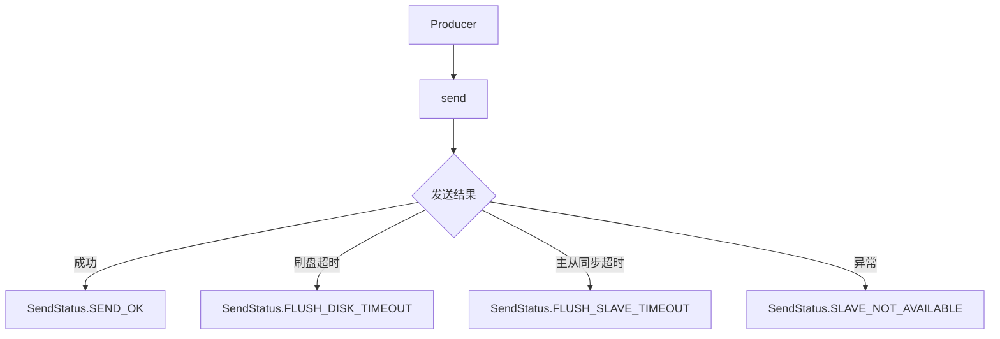
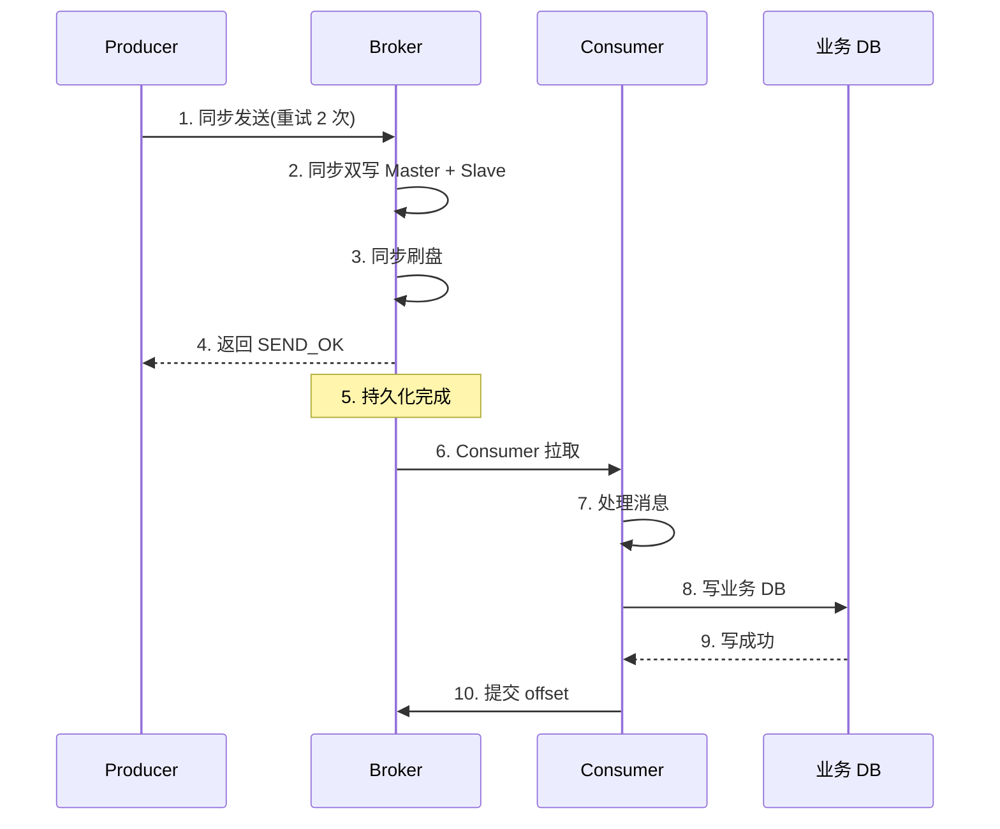
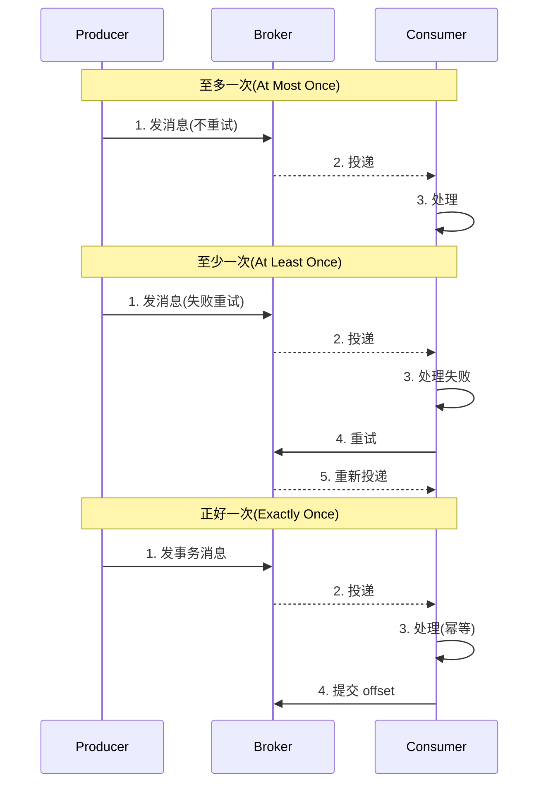
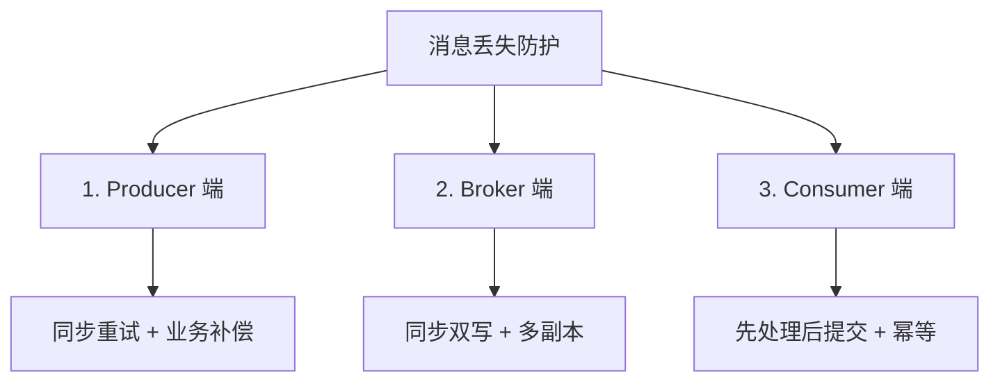

# 消息发送与投递语义 · 入门全景

> 这是「从零开始认识 RocketMQ」系列的第 8 篇。讲清消息从「发送到投递」的完整语义——3 种发送结果、3 种投递语义、3 种重复场景、3 种丢失场景，建立消息可靠性的完整心智模型。

## 摘要

消息发送与投递语义是 RocketMQ 的核心保证——「**至多一次、至少一次、正好一次**」3 种投递语义，对应不同的可靠性级别。本文从「发送结果 → 投递语义 → 重复场景 → 丢失场景 → 幂等设计」5 个角度，建立消息可靠性的完整心智模型。学完本文能回答「RocketMQ 的消息可靠性保证是什么」「如何处理重复消息」「如何避免消息丢失」。

---

## 一、背景：消息可靠性的核心问题

消息从发送到投递，理论上要经过 3 个环节：

```
Producer 发送 -> Broker 存储 -> Consumer 消费
```

每个环节都可能出问题：

1. **发送环节**：网络抖动、Broker 故障 → 消息没发出去
2. **存储环节**：磁盘损坏、机器重启 → 消息丢了
3. **消费环节**：Consumer 崩溃、offset 未提交 → 消息重复或丢失

跨周期经验：消息可靠性这个问题在过去 10 年里基本没变——「**至多、至少、正好**」3 种语义。从 ActiveMQ 到 RocketMQ，3 种语义的边界和代价都很清晰。变的是「**如何让'正好一次'更易用**」——从「**业务幂等**」到「**事务消息**」到「**EOS**」。

监管意图：消息可靠性如果处理不当，可能导致「**用户数据丢失**」或「**审计日志缺失**」，需要符合《个人信息保护法》和「等保 2.0」要求。业内通用做法是「**核心业务同步双写 + 周边业务异步复制**」，满足境内外的合规要求。

跨系统架构：消息可靠性是「**上下游对接**」的关键——上游的发送可靠性决定了下游的消费可靠性，任何一环不可靠都会导致整个链路出错。

## 二、原理穿透：3 种发送结果

### 2.1 发送结果类型



| 结果 | 含义 | 可靠性 |
|---|---|---|
| **SEND_OK** | 消息成功写入 CommitLog | ✅ 可靠 |
| **FLUSH_DISK_TIMEOUT** | 异步刷盘超时 | ⚠️ 可能丢失 |
| **FLUSH_SLAVE_TIMEOUT** | 主从同步超时 | ⚠️ 可能丢失 |
| **SLAVE_NOT_AVAILABLE** | Slave 不可用 | ⚠️ 可能丢失 |

机制穿透：RocketMQ 的发送结果是「**细粒度**」的——返回 `FLUSH_DISK_TIMEOUT` 时，消息已经写入 PageCache，只是没刷盘。如果机器立即断电，可能丢失。

### 2.2 3 种发送方式的结果处理

```
同步发送：send() → SendResult → 处理结果
异步发送：send(callback) → 立即返回 → 回调处理
单向发送：sendOneway() → 立即返回 → 不关心
```

## 三、主流业界解法：3 种投递语义

跨系统架构角度，市面上 MQ 提供 3 种投递语义：

| 语义 | 说明 | 重复 | 丢失 |
|---|---|---|---|
| **至多一次** | 发出去就忘，不重试 | 不会重复 | 可能丢失 |
| **至少一次** | 重试直到成功 | 可能重复 | 不会丢失 |
| **正好一次** | 精确一次 | 不会重复 | 不会丢失 |

| 语义 | RocketMQ 支持 | 实现机制 | 代价 |
|---|---|---|---|
| **至多一次** | ✅ | sendOneway | 可能丢失 |
| **至少一次** | ✅ | 同步双写 + 重试 | 可能重复 |
| **正好一次** | ⚠️ 业务侧保证 | 事务消息 + 消费幂等 | 实现复杂 |

跨周期经验：从 2018 到 2024，业内对投递语义的选择趋于理性化——「**业务侧幂等 + 至少一次投递**」是主流做法。「正好一次」只在金融级场景下必须，业务复杂度高。

跨业务形态视角：金融 / 电商系业务大量用「**事务消息 + 业务幂等**」；流量 / 内容系大量用「**至少一次 + 业务幂等**」；传统金融用「**同步双写 + 事务消息**」。这不是「谁对谁错」，而是「**业务形态决定选型**」。

## 四、量级演进：消息可靠性的 3 个台阶

量级演进视角，消息可靠性在不同量级下的关键参数：

| 量级 | 可靠性级别 | 核心配置 | 业内通用做法 |
|---|---|---|---|
| **万级 TPS** | 至少一次 | 同步双写 + 2 副本 | 业务幂等 |
| **十万 TPS** | 至少一次 | 同步双写 + 3 副本 | 业务幂等 |
| **百万 TPS** | 至少一次 | DLedger Raft + 3 副本 | 业务幂等 |

5 年后回头看：2018 年大家还在纠结「**到底要不要同步双写**」，2024 年的标准做法是「**业务体量决定副本数 + 业务幂等**」。当年「事务消息必须用」的争议，5 年后回头看是「**不是所有场景都需要事务消息**」的结果。

## 五、架构设计：消息丢失的 3 个环节

### 5.1 Producer 端丢失

```
Producer 发送
   ↓
发送失败?
   ├──否──> 成功
   └──是──> 重试次数耗尽?
              ├──否──> 重新发送
              └──是──> 消息丢失
```

**应对**：
- 同步发送，重试 2 次以上
- 异步发送，回调中必须处理失败
- 业务侧补偿（定时扫描 + 重发）

### 5.2 Broker 端丢失

```
Producer → Master → 同步双写 → Slave
              ↓                  ↓
         异步刷盘          异步刷盘
              ↓
          磁盘
```

**应对**：
- 同步双写（Master + Slave 都成功才返回）
- 同步刷盘（写磁盘后才返回）
- 至少 3 副本
- DLedger Raft 自动选主

### 5.3 Consumer 端丢失

```
Consumer 拉取 → 处理消息 → 提交 offset
                  ↓
              处理失败
                  ↓
              消息丢失
```

**应对**：
- 处理成功后再提交 offset
- 业务侧幂等
- 重试机制 + 死信队列

### 5.4 完整可靠性链路



## 六、生产画像：消息可靠性的常见配置

（脱敏通用画像）

| 业务场景 | 可靠性级别 | 关键配置 | 业内通用做法 |
|---|---|---|---|
| **金融交易** | 至少一次 + 事务 | 同步双写 + 事务消息 + 消费幂等 | 强一致 |
| **支付回调** | 至少一次 | 同步双写 + 至少 3 副本 | 业务幂等 |
| **订单创建** | 至少一次 | 同步双写 + DLedger | 业务幂等 |
| **日志采集** | 至多一次 | 异步刷盘 + 单副本 | 不关心丢失 |
| **跨系统同步** | 至少一次 | 同步双写 + 双向对账 | 业务幂等 |

生产事故推演：业内最常见的 4 类可靠性事故——
1. **异步刷盘断电丢失**：消息没刷盘 → 机器断电 → 全部丢失，根因是「刷盘策略与可靠性诉求错配」
2. **主从切换脑裂**：主从异步复制 → 主挂掉 → 数据丢失，应急方案是「DLedger + 自动切换」
3. **Consumer 先 commit 后处理**：处理失败 → offset 已提交 → 消息丢失，踩坑点是「commit 顺序错误」
4. **业务侧未做幂等**：网络抖动 → 重复投递 → 业务异常，根因是「幂等设计缺失」

机制穿透：上面 4 个事故的根因都不是「RocketMQ 本身的问题」，而是「**可靠性配置 + 业务容错**」没做好——这是入门者最该警惕的「可靠性设计」风险。

## 七、Trade-off：消息可靠性的 5 个核心 Trade-off

机制穿透角度，消息可靠性设计上有 5 个核心 Trade-off：

| 设计选择 | 收益 | 代价 | 适用场景 |
|---|---|---|---|
| **同步双写** | 消息零丢失 | 写入延迟翻倍 | 必达业务 |
| **异步刷盘** | 高吞吐 | 极端情况丢失 | 日志、可丢失 |
| **事务消息** | 最终一致 | 实现复杂 | 业务核心 |
| **消费幂等** | 容忍重复 | 业务侧开发成本 | 至少一次 |
| **死信队列** | 兜底失败消息 | 增加运维成本 | 必须有 |

Trade-off 跨期：当年选「**同步双写 + 事务消息 + 消费幂等**」是合理 Trade-off（强可靠），2024 年的「**DLedger Raft + 业务幂等**」是更优解——这个「Trade-off 升级」是「**业务体量 + 一致性算法成熟**」的结果。

跨业务形态视角：金融 / 电商系业务全面用「**DLedger + 事务消息 + 业务幂等**」；流量 / 内容系大量用「**至少一次 + 业务幂等**」（极致的工程效率）；传统金融仍用「**同步双写 + 事务消息**」（强一致）。这不是「谁对谁错」，而是「**业务体量 + 一致性诉求**」决定选型。

战略判断：未来 5 年，RocketMQ 会往「**EOS（Exactly Once Semantics）**」演进——5.x 已经起步。这是社区共识。

### 7.1 EOS 的演进路线与落地形态

机制穿透：EOS（Exactly Once Semantics）从 2018 年的「**学术概念**」走到 2024 年的「**生产可用**」经历了三个阶段——第一阶段是「**事务消息 + 业务幂等**」（RocketMQ 4.x 主流方案），第二阶段是「**Kafka 事务协议移植**」（5.x 起步），第三阶段是「**流处理原生 EOS**」（5.x + Flink/RocketMQ Connector）。

跨周期经验：2018 年业内普遍认为「**正好一次是乌托邦**」——因为分布式系统理论决定了不可能三角，强一致 + 高可用 + 分区容错三者只能取其二。但 2024 年的实践表明，**业务侧 EOS**（不是底层 EOS）是可行的——把幂等逻辑下沉到框架层，业务方只需要声明「**这个 topic 需要 EOS**」即可。

跨业务形态视角：金融 / 电商系业务大量用「**事务消息 + 消费幂等 + 数据库唯一索引**」三重保障实现业务 EOS；流量 / 内容系用「**Kafka EOS 协议 + Flink 两阶段提交**」实现流处理 EOS；传统金融用「**同步双写 + 本地消息表 + 定时对账**」实现强一致 EOS。这不是「谁对谁错」，而是「**业务形态决定 EOS 实现路径**」。

监管意图：如果业务涉及金融级交易，「**正好一次**」不仅是性能诉求，更是合规诉求——根据等保 2.0 和金融行业监管要求，账户类操作必须「**不多不少**」，否则会出现重复扣款或漏扣款的事故。业内通用做法是「**业务 EOS + 数据库事务 + 审计日志**」三重保障。

Trade-off：EOS 不是免费午餐——它带来的代价是「**3-5 倍的性能损耗**」和「**2-3 倍的开发复杂度**」。如果业务对「**绝对不重复**」没有强诉求，**至少一次 + 业务幂等**是更优解。

事故推演：业内最常见的 EOS 事故——「**业务幂等键设计错误**」（同一个业务对象的不同事件用了不同幂等键），导致重复消费没被拦截；「**事务消息回查超时**」导致 Producer 状态不一致；「**消费失败回滚后数据库事务已提交**」导致「**事务消息成功 + 业务失败**」的不一致。这三个事故的根因都是「**EOS 实现细节被业务方忽略**」。

战略判断：未来 5 年，EOS 会往「**Serverless EOS**」演进——5.x 的 Controller + Proxy 架构让 EOS 不再需要业务方关心事务状态机，而是由框架统一管理。这是社区共识，也是 RocketMQ 走向云原生的关键一步。

## 八、反思：消息可靠性学习路径建议

4 个关键认知：

1. **没有银弹**——3 种语义对应 3 种代价，**业务决定选型**
2. **可靠性是端到端**——Producer + Broker + Consumer 都得做
3. **消费幂等是必须的**——网络抖动、Broker 重启都会导致重复
4. **死信队列是兜底**——失败重试超过上限必须进死信队列

跨周期经验：从 2018 到 2024，业内对消息可靠性的认知经历了「**追求零丢失 → 接受重复 → 业务幂等兜底**」三个阶段。入门者最容易卡在「**追求零丢失 → 实现过度复杂**」——这是最该警惕的「过度设计」风险。

跨系统架构：消息可靠性是 RocketMQ 与上下游业务对接的「**质量边界**」——上游发出去的消息，下游一定能收到（至少一次）或可能重复（至少一次语义），这是接口契约的一部分。

### 8.1 3 种投递语义的对比



### 8.2 消息丢失的 3 个环节防护



跨周期经验：从 2018 到 2024，业内对消息可靠性的设计认知经历了「**追求零丢失 → 接受重复 → 业务幂等兜底**」三个阶段，每个阶段都解决了前一阶段的过度设计问题。

### 8.3 可靠性的 5 个核心 Trade-off

跨周期经验：消息可靠性的 5 个核心 Trade-off 是「**同步双写 vs 异步刷盘、事务消息 vs 业务幂等、死信队列 vs 重试机制、监控告警 vs 静默失败、人工运维 vs 自动化**」。每个 Trade-off 都对应一类业务诉求。

跨系统架构：消息可靠性是「**上下游接口契约**」——上游发出去的消息，下游一定能收到（至少一次）或可能重复（至少一次语义）。这是 RocketMQ 与业务系统对接的「**质量边界**」。

### 8.4 可靠性配置的最佳实践

跨业务形态视角：金融 / 电商系业务全面用「**DLedger + 事务消息 + 业务幂等**」三重保障；流量 / 内容系大量用「**至少一次 + 业务幂等**」追求极致工程效率；传统金融用「**同步双写 + 事务消息**」保证强一致。这是「**业务形态决定可靠性配置**」的典型表现。

---

## 附录 A：术语速查表

| 术语 | 解释 |
|---|---|
| **SendStatus** | 发送结果枚举 |
| **SEND_OK** | 发送成功 |
| **FLUSH_DISK_TIMEOUT** | 刷盘超时 |
| **FLUSH_SLAVE_TIMEOUT** | 主从同步超时 |
| **至多一次** | At Most Once |
| **至少一次** | At Least Once |
| **正好一次** | Exactly Once |
| **同步双写** | Master + Slave 都写才返回 |
| **异步刷盘** | 写 PageCache 即返回 |
| **消费幂等** | 重复消费结果一致 |
| **死信队列** | 失败消息归宿 |
| **重试机制** | 失败后重新投递 |
| **事务消息** | 半消息 + 回查机制 |
| **PageCache** | 操作系统页缓存 |
| **EOS** | Exactly Once Semantics |

---

## 📌 数据与事实声明

本文涉及的消息发送、投递语义、可靠性配置均为 Apache RocketMQ 社区公开文档描述。具体版本特性请以官方文档为准（https://rocketmq.apache.org/）。文中「业内通用做法」系行业认知总结，非特定公司实践。