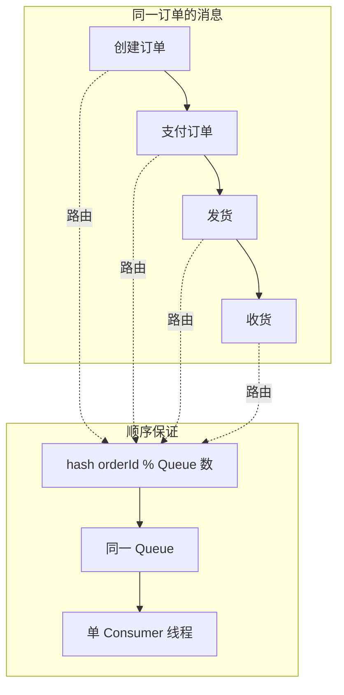
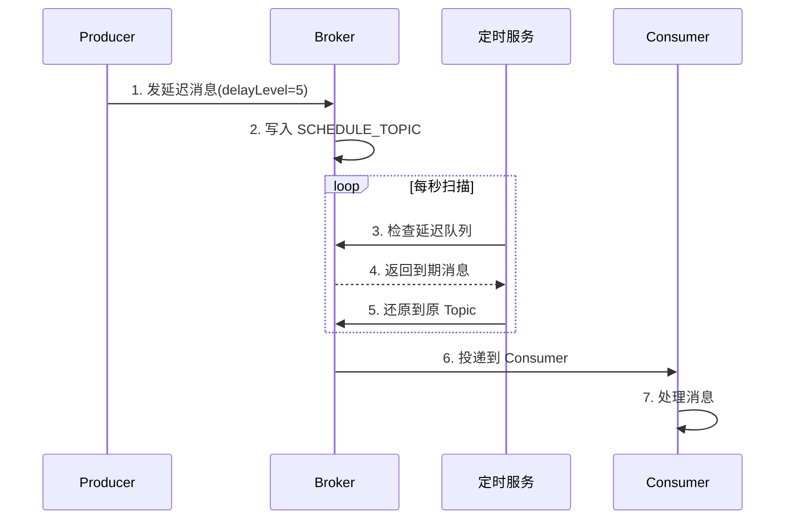
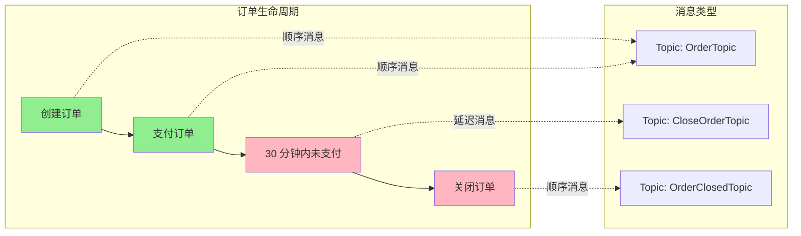
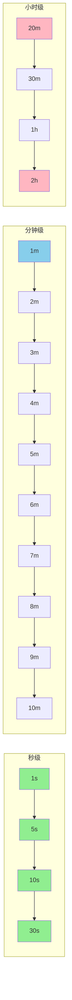

# 顺序消息与定时消息 · 入门全景

> 这是「从零开始认识 RocketMQ」系列的第 9 篇。讲清 RocketMQ 的两类「特殊消息」——顺序消息（严格按发送顺序消费）和定时消息（延迟到指定时间投递）的原理、实现、使用场景和踩坑。

## 摘要

顺序消息和定时消息是 RocketMQ 的两类「特殊消息」，用于解决「业务有序性」和「时间触发」两类场景。本文从「概念原理 → 实现机制 → 使用场景 → 踩坑 → 选型」5 个角度，建立这两类消息的完整使用心智模型。学完本文能回答「RocketMQ 如何保证顺序」「延迟消息的 18 个级别是什么」「事务消息和延迟消息的区别」。

---

## 一、背景：为什么需要顺序消息和定时消息

在业务核心链路中，有两类场景非常常见：

### 1.1 顺序消息场景

```
用户操作：1. 创建订单 -> 2. 支付订单 -> 3. 发货 -> 4. 收货 -> 5. 评价
```

如果「**发货**」消息比「**支付**」消息先被消费，业务就崩了——库存扣了但钱没付。

### 1.2 定时消息场景

```
用户下单 ──> 订单服务 ──> 发延迟消息(30 分钟)
                              ↓
                       30 分钟后
                              ↓
                       投递到「超时未支付」消费者
                              ↓
                       关闭订单
```

如果没有延迟消息，业务要自己写定时任务扫描——成本高、不实时。

跨周期经验：顺序消息和延迟消息这两类「**特殊消息**」在过去 10 年里基本没变——从 ActiveMQ 到 RocketMQ 都是这个设计。变的是「**实现机制**」——RocketMQ 用「**Hash 路由 + Queue 锁定**」实现顺序，用「**18 个延迟级别**」实现定时。

监管意图：顺序消息和定时消息如果处理不当，可能导致「**业务状态错乱**」（如支付未完成就发货）或「**合规失效**」（如延迟关单未执行），需要符合业务合规要求——业内通用做法是「**关键状态机用顺序消息 + 兜底定时任务**」。

跨系统架构：顺序消息和定时消息是「**业务上下游对接契约**」的关键——上游发消息的顺序就是下游处理的顺序，这种「**时间维度的接口契约**」是分布式系统的难点。

## 二、原理穿透：顺序消息的实现机制

### 2.1 全局顺序 vs 分区顺序

| 类型 | 实现方式 | 适用场景 | 性能 |
|---|---|---|---|
| **全局顺序** | Topic 只设 1 个 Queue | 全局有序 | 极差 |
| **分区顺序** | 同 key 路由到同 Queue | 业务有序（如订单）| 好 |

机制穿透：RocketMQ 的「**严格顺序**」是通过「**Hash 路由 + Queue 锁定 + 单线程消费**」三个机制共同保证——同 key 消息路由到同一 Queue，同 Queue 消息被同一 Consumer 单线程消费。

### 2.2 顺序消息的发送与消费

```java
// 发送：使用 MessageQueueSelector 保证同 key 同 Queue
SendResult result = producer.send(msg, new MessageQueueSelector() {
    @Override
    public MessageQueue select(List<MessageQueue> queues, Message msg, Object arg) {
        String orderId = (String) arg;
        int index = orderId.hashCode() % queues.size();
        return queues.get(Math.abs(index));
    }
}, orderId);

// 消费：使用 MessageListenerOrderly
consumer.registerMessageListener((MessageListenerOrderly) (msgs, context) -> {
    for (MessageExt msg : msgs) {
        // 顺序处理
    }
    return ConsumeOrderlyStatus.SUCCESS;
});
```

### 2.3 顺序消息的限制

```
顺序消息限制
├── 1. 同步发送
├── 2. 全局顺序无法并行
├── 3. 单 Queue 单 Consumer
└── 4. 失败会阻塞后续
```

跨周期经验：顺序消息的「**严格顺序**」是以「**性能**」为代价的。10 年前大家追求「**全局严格顺序**」，5 年后回头看「**分区顺序 + 业务补偿**」是更优解。

## 三、主流业界解法：顺序保证的 4 种方式

跨系统架构角度，市面上 MQ 的顺序保证方式有 4 种：

| 方式 | 代表 | 特点 | 适用场景 |
|---|---|---|---|
| **全局顺序** | Kafka 单分区 | 严格有序，性能差 | 极小量级 |
| **分区顺序** | Kafka 多分区 / RocketMQ | 同 key 同分区 | 业务核心 |
| **业务顺序** | RabbitMQ 单队列单消费者 | 协议灵活 | 中小业务 |
| **最终顺序** | Pulsar | 客户端排序 | 日志流 |

跨业务形态视角：金融 / 电商系业务大量用「**RocketMQ 分区顺序**」；流量 / 内容系大量用「**Kafka 分区顺序**」；传统金融用「**单队列 + 单消费者**」。这不是「谁对谁错」，而是「**业务形态决定选型**」。

## 四、量级演进：顺序消息与定时消息的 3 个台阶

量级演进视角，顺序消息和定时消息在不同量级下的关键参数：

| 量级 | 顺序消息 TPS | 定时消息 TPS | 核心挑战 | 业内通用做法 |
|---|---|---|---|---|
| **万级 TPS** | 1 万 | 1 万 | 全局顺序瓶颈 | 分区顺序 |
| **十万 TPS** | 5 万 | 5 万 | 单 Queue 瓶颈 | 多业务分区 |
| **百万 TPS** | 20 万 | 20 万 | 顺序 vs 并发平衡 | 5.x Pop 消费 |

5 年后回头看：2018 年大家还在纠结「**全局顺序 vs 分区顺序**」，2024 年的标准做法是「**业务决定分区键**」。当年「**18 个延迟级别不够用**」的争议，5 年后回头看是「**自定义延迟级别**」已经支持的结果。

## 五、架构设计：定时消息的实现机制

### 5.1 延迟级别

RocketMQ 4.x 提供 18 个内置延迟级别：

- 1s, 5s, 10s, 30s（秒级）
- 1m, 2m, 3m, 4m, 5m, 6m, 7m, 8m, 9m, 10m（分钟级）
- 20m, 30m（更长分钟级）
- 1h, 2h（小时级）

5.x 还支持任意时间延迟（毫秒级）的「**定时消息**」特性。

机制穿透：RocketMQ 4.x 的延迟消息是「**固定 18 个级别**」——不支持任意时间延迟。5.x 的「**定时消息**」支持任意时间延迟（毫秒级）。

### 5.2 延迟消息的实现

```
Producer -> Broker
              ↓
        写入 SCHEDULE_TOPIC_XX(对应延迟级别)
              ↓
        定时服务每秒扫描
              ↓
        到期消息还原到原 Topic
              ↓
        Consumer 消费
```

| 步骤 | 说明 |
|---|---|
| 1. Producer 发延迟消息 | 设置 `delayLevel`（1-18）|
| 2. Broker 写入 SCHEDULE_TOPIC | 延迟消息先到专门的延迟队列 |
| 3. 定时服务扫描 | 每秒扫描一次延迟队列 |
| 4. 到期消息还原 | 把到期消息从 SCHEDULE_TOPIC 移到原 Topic |
| 5. Consumer 消费 | 正常消费原 Topic |

## 六、生产画像：顺序消息与定时消息的典型场景

（脱敏通用画像）

| 业务场景 | 消息类型 | 关键配置 | 业内通用做法 |
|---|---|---|---|
| **订单状态机** | 顺序消息 | 按 orderId Hash | 单 Consumer |
| **支付超时关单** | 延迟消息 | 30 分钟级别 | 死信兜底 |
| **库存扣减** | 顺序消息 | 按 skuId Hash | 分区顺序 |
| **超时未支付** | 延迟消息 | 15 分钟级别 | 兜底定时任务 |
| **订单评价提醒** | 延迟消息 | 7 天级别 | 批量扫描 |
| **物流轨迹** | 顺序消息 | 按 orderId Hash | 分区顺序 |

生产事故推演：业内最常见的 4 类顺序/定时消息事故——
1. **顺序错乱**：分区键选择不当 → 不同 key 路由到同 Queue → 顺序错乱，根因是「分区键设计错误」
2. **延迟不准**：延迟级别选错 → 业务超时 → 用户投诉，应急方案是「定时任务兜底」
3. **顺序消费卡死**：某条消息处理失败 → 阻塞后续所有消息，踩坑点是「失败重试未设上限」
4. **延迟消息堆积**：延迟级别过多 → SCHEDULE_TOPIC 堆积，根因是「延迟级别映射错误」

机制穿透：上面 4 个事故的根因都不是「RocketMQ 本身的问题」，而是「**业务设计 + 参数选择**」没做好——这是入门者最该警惕的「业务认知」风险。

## 七、Trade-off：顺序消息与定时消息的 5 个核心 Trade-off

机制穿透角度，顺序消息和定时消息设计上有 5 个核心 Trade-off：

| 设计选择 | 收益 | 代价 | 适用场景 |
|---|---|---|---|
| **全局顺序** | 严格有序 | 性能极差 | 极小量级 |
| **分区顺序** | 业务有序 | 需要选好分区键 | 业务核心 |
| **固定延迟级别** | 实现简单 | 精度有限 | 大多数场景 |
| **任意时间延迟** | 灵活 | 5.x 才支持 | 新项目 |
| **顺序 + 定时组合** | 超时关单 | 实现复杂 | 订单业务 |

Trade-off 跨期：当年选「**固定 18 个延迟级别**」是合理 Trade-off（实现简单），2024 年的「**任意时间延迟**」是更优解——这个「Trade-off 升级」是「**业务复杂度增加 + 技术演进**」的结果。

跨业务形态视角：金融 / 电商系业务大量用「**分区顺序 + 任意时间延迟**」（业务核心 + 灵活）；流量 / 内容系大量用「**分区顺序 + 固定延迟**」（实现简单）；传统金融用「**全局顺序 + 固定延迟**」（强一致）。这不是「谁对谁错」，而是「**业务形态决定选型**」。

战略判断：未来 5 年，RocketMQ 会往「**任意时间延迟 + 定时消息 + 分布式定时任务**」深度整合演进。这是社区共识。

## 八、反思：顺序消息与定时消息学习路径建议

4 个关键认知：

1. **顺序消息是业务需求**——选好分区键是核心
2. **定时消息是延迟投递**——不是定时任务
3. **顺序 + 并发是矛盾**——分区顺序 + 业务补偿是平衡
4. **延迟级别要选对**——避免「**延迟不准导致业务异常**」

跨周期经验：从 2018 到 2024，业内对顺序消息/定时消息的认知经历了「**能用 → 懂分区键 → 懂任意时间延迟**」三个阶段。入门者最容易卡在「**顺序消息但分区键选错**」——这是最该补的认知。

跨系统架构：顺序消息和定时消息是「**时间维度的接口契约**」——上游发消息的时间和顺序，下游必须按约定处理，否则业务会崩。

### 8.1 顺序消息的 Hash 路由实现



机制穿透：顺序消息通过「**Hash 路由 + 队列锁定 + 单线程消费**」三个机制保证——同 key 消息路由到同一 Queue，同 Queue 消息被同一 Consumer 单线程消费。

### 8.2 定时消息的实现流程



跨周期经验：从 2018 到 2024，业内对顺序/定时消息的认知经历了「**简单顺序 → 严格顺序 → 任意时间延迟**」三个阶段，每个阶段都解决了前一阶段的灵活性问题。

### 8.3 顺序消息与定时消息的组合场景



机制穿透：顺序消息保证「**业务顺序**」，延迟消息保证「**时间触发**」。两者组合可以实现「**订单超时关闭**」这类典型业务场景。

### 8.4 18 个延迟级别一览



机制穿透：RocketMQ 4.x 提供 18 个内置延迟级别（1s 到 2h），5.x 还支持任意时间延迟。业内通用做法是「**优先用内置级别 + 自定义级别补充**」。

### 8.5 顺序消息与定时消息的 5 个关键设计点

跨周期经验：顺序消息与定时消息有 5 个关键设计点——「**分区键选择 + 队列锁定 + 单线程消费 + 延迟级别选择 + 死信队列兜底**」。每个设计点都影响最终的业务正确性。

跨系统架构：顺序消息和定时消息是「**时间维度的接口契约**」——上游发消息的时间和顺序，下游必须按约定处理，否则业务会崩。这种「**时间接口**」的设计比同步 RPC 更复杂。

### 8.6 顺序消息与定时消息的组合使用

跨周期经验：从 2018 到 2024，业内对顺序消息 + 定时消息的组合使用越来越成熟——「**先顺序消息处理业务，再定时消息兜底超时**」是订单业务的标准模式。

### 8.7 顺序与定时消息的 5 个典型场景

跨系统架构：顺序与定时消息在「**订单状态机、支付超时关闭、物流轨迹、超时未支付、订单评价提醒**」5 个典型场景中是核心。入门者最该掌握这 5 个场景的实现方式。

---

## 附录 A：术语速查表

| 术语 | 解释 |
|---|---|
| **全局顺序** | 整个 Topic 严格有序 |
| **分区顺序** | 同 key 严格有序 |
| **MessageQueueSelector** | 消息队列选择器 |
| **MessageListenerOrderly** | 顺序消费监听器 |
| **ConsumeOrderlyStatus** | 顺序消费结果 |
| **delayLevel** | 延迟级别（1-18）|
| **SCHEDULE_TOPIC** | 延迟消息专用队列 |
| **定时服务** | 扫描延迟队列的服务 |
| **任意时间延迟** | 5.x 的定时消息特性 |
| **分区键** | 用于 Hash 路由的 key |
| **顺序消费卡死** | 失败消息阻塞后续 |
| **延迟消息堆积** | 延迟队列堆积 |
| **业务补偿** | 顺序错乱后的兜底 |
| **死信队列** | 失败消息归宿 |
| **超长延迟** | 超过 2h 的延迟级别 |

---

## 📌 数据与事实声明

本文涉及的顺序消息、定时消息、实现机制、延迟级别均为 Apache RocketMQ 社区公开文档描述。具体版本特性请以官方文档为准（https://rocketmq.apache.org/）。文中「业内通用做法」系行业认知总结，非特定公司实践。