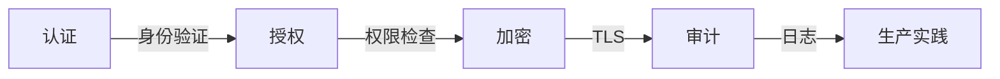
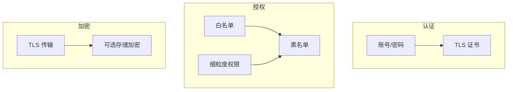

# 安全与 ACL

## 本文核心

**一句话摘要**：RocketMQ 提供 ACL 访问控制 + TLS 加密 + 权限管理，支持白名单/黑名单/细粒度权限。

**核心机制链**：认证 → 授权 → 加密 → 审计 → 生产实践





## 一、认证

### 1.1 账号密码

```properties
# 生产者/消费者配置
accessKey=yourAccessKey
secretKey=yourSecretKey
```

### 1.2 TLS 证书

```properties
# Broker 配置
tlsEnable=true
tlsCertPath=/path/to/cert.pem
tlsKeyPath=/path/to/key.pem
```

## 二、授权

### 2.1 白名单/黑名单

```properties
# Broker 配置
whiteRemoteAddress=192.168.1.0/24
blackRemoteAddress=192.168.1.100
```

### 2.2 细粒度权限

| 权限 | 说明 |
|---|---|
| **PUB** | 发布消息权限 |
| **SUB** | 订阅消息权限 |
| **ADMIN** | 管理权限 |

### 2.3 ACL 配置

```properties
# acl.yml
accounts:
  - accessKey: producer1
    secretKey: secret1
    whiteRemoteAddress: 192.168.1.0/24
    defaultTopicPerm: PUB
    defaultGroupPerm: SUB
  
  - accessKey: consumer1
    secretKey: secret2
    whiteRemoteAddress: 192.168.1.0/24
    defaultTopicPerm: SUB
    defaultGroupPerm: SUB
```

## 三、加密

### 3.1 TLS 传输加密

Broker 与 Client 之间使用 TLS 加密传输，防止中间人攻击。

### 3.2 存储加密

可选：CommitLog 文件加密存储，防止数据泄露。

## 四、审计

### 4.1 操作日志

RocketMQ 记录所有操作日志：
- 消息发送/消费记录
- 权限变更记录
- 集群操作记录

### 4.2 监控指标

| 指标 | 说明 |
|---|---|
| ACL 拒绝率 | 被 ACL 拒绝的请求比例 |
| 异常登录 | 失败的登录尝试 |
| 权限变更 | 权限配置变更次数 |

## 五、生产实践

### 5.1 最佳实践

| 实践 | 说明 |
|---|---|
| **最小权限** | 按需分配 PUB/SUB/ADMIN |
| **TLS 必开** | 生产环境强制开启 TLS |
| **白名单** | 限制客户端 IP 范围 |
| **定期审计** | 定期检查权限配置 |

### 5.2 安全检查清单

- [ ] TLS 已开启
- [ ] ACL 已配置
- [ ] 白名单已设置
- [ ] 审计日志已开启
- [ ] 密钥已轮换

## 六、核心带走

- **核心一句话**：RocketMQ 安全 = ACL + TLS + 权限管理
- **核心链条**：认证 → 授权 → 加密 → 审计 → 生产实践
- **金融要求**：TLS 必开 + ACL 必配 + 审计必开
- **哪里会坏**：ACL 配置错误导致权限泄露 / TLS 未开启导致中间人攻击

## 💡 实战提示（Tips）

- **ACL 配置**：生产环境必须配置 ACL，默认无权限控制
- **TLS 证书**：使用 CA 签发的证书，避免自签名
- **密钥管理**：定期轮换 accessKey/secretKey
- **审计日志**：定期检查异常登录和权限变更

## ❓ 你们可能会问（QA）

**Q1：ACL 不配置会怎样？**
A：默认允许所有客户端连接，生产环境存在安全风险。

**Q2：TLS 会影响性能吗？**
A：会有约 5-10% 的性能开销，但生产环境必须开启。

**Q3：如何轮换密钥？**
A：先添加新密钥 → 更新客户端 → 验证 → 删除旧密钥。

## 🤔 思考（开放问题/反思）

- **多租户隔离**：RocketMQ 如何实现多租户隔离？——Namespace + ACL + 资源配额
- **密钥管理**：密钥如何安全存储和轮换？——Vault / KMS 集成
- **审计合规**：金融场景的审计要求如何满足？——审计日志 + 定期审查

## ⚖️ Trade-off（代价与反方案）

| 方案 | 优势 | 代价 | 反方案 |
|---|---|---|---|
| **ACL + TLS** | 安全可靠 | 配置复杂、性能开销 | 无安全控制 |
| **仅 TLS** | 传输安全 | 无访问控制 | ACL + TLS |
| **仅 ACL** | 访问控制 | 传输不加密 | ACL + TLS |

## 📌 数据与事实声明

- 写于 2026-09-11，机制以 RocketMQ 4.x/5.x 为基准
- 量级红线为行业认知口径，决策需按实际业务压测校准
- 典型场景为公开技术社区高频案例的匿名化复述
- 工具口径以 RocketMQ 官方文档为准

## 📚 参考资料

- RocketMQ 官方文档：https://rocketmq.apache.org/docs/
- 《RocketMQ 技术内幕》耿雨春