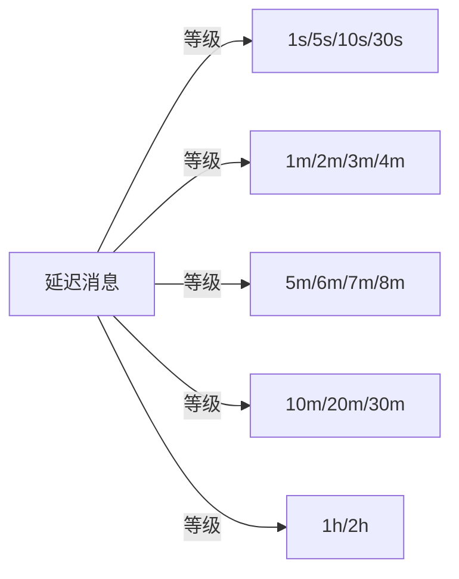
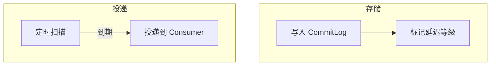

# 延迟消息

## 本文核心

**一句话摘要**：RocketMQ 支持 18 个等级的延迟消息（1s-2h），用于订单超时取消/定时任务/重试调度，底层通过 Broker 定时扫描实现。

**核心机制链**：延迟等级 → 存储结构 → 投递流程 → 生产实践 → 注意事项





## 一、延迟等级

RocketMQ 提供 18 个延迟等级：

| 等级 | 延迟时间 | 等级 | 延迟时间 |
|---|---|---|---|
| 1 | 1s | 10 | 10m |
| 2 | 5s | 11 | 20m |
| 3 | 10s | 12 | 30m |
| 4 | 30s | 13 | 1h |
| 5 | 1m | 14 | 2h |
| 6 | 2m | 15 | 3h |
| 7 | 3m | 16 | 4h |
| 8 | 4m | 17 | 5h |
| 9 | 5m | | |

## 二、底层机制

### 2.1 存储结构

延迟消息写入 CommitLog 时，标记 delayLevel 字段。Broker 定时扫描 CommitLog，将到期消息投递到对应的 ConsumeQueue。

### 2.2 投递流程

1. 生产者发送延迟消息（设置 delayLevel）
2. Broker 写入 CommitLog（标记 delayLevel）
3. 定时任务扫描 CommitLog（每 1s 一次）
4. 到期消息投递到 ConsumeQueue
5. Consumer 拉取消费

## 三、生产实践

### 3.1 典型场景

| 场景 | 延迟等级 | 说明 |
|---|---|---|
| **订单超时取消** | 30m | 下单后 30min 未支付自动取消 |
| **定时重试** | 1m/5m/10m | 失败后延迟重试 |
| **库存预警** | 10m | 库存低于阈值后 10min 预警 |
| **日程提醒** | 1h/2h | 提前 1h/2h 提醒 |

### 3.2 代码示例

```java
Message msg = new Message("Topic", "Tag", "Hello".getBytes());
msg.setDelayTimeLevel(3); // 10s 延迟
producer.send(msg);
```

## 四、注意事项

- **精度限制**：延迟精度为秒级，不支持毫秒级
- **等级固定**：18 个等级不可自定义
- **性能影响**：延迟消息扫描增加 Broker 负载
- **堆积风险**：大量延迟消息可能导致定时扫描积压

## 五、核心带走

- **核心一句话**：RocketMQ 延迟消息 = 18 个等级 + Broker 定时扫描
- **核心链条**：延迟等级 → 存储结构 → 投递流程 → 生产实践
- **典型场景**：订单超时/定时重试/库存预警
- **限制**：精度秒级 / 等级固定 / 不支持毫秒

## 💡 实战提示（Tips）

- **延迟等级选择**：根据业务需求选择合适的等级，不必追求最小延迟
- **大量延迟消息**：监控 Broker 定时扫描积压，避免性能问题
- **替代方案**：需要毫秒级精度时，考虑使用 Redis ZSET / Quartz 定时任务

## ❓ 你们可能会问（QA）

**Q1：延迟消息和定时消息有什么区别？**
A：RocketMQ 中延迟消息 = 发送时设置延迟等级；定时消息 = 指定具体投递时间。RocketMQ 4.x 支持延迟消息，5.x 支持定时消息。

**Q2：延迟消息的精度是多少？**
A：秒级。底层通过定时扫描 CommitLog 实现，每 1s 扫描一次。

**Q3：大量延迟消息会不会影响性能？**
A：会。大量延迟消息会增加 Broker 定时扫描的负载，建议控制延迟消息数量。

## 🤔 思考（开放问题/反思）

- **毫秒级延迟**：RocketMQ 不支持毫秒级延迟，如何实现？——Redis ZSET + 轮询 / 自研定时服务
- **延迟消息堆积**：如何监控和处理延迟消息堆积？——监控扫描延迟 + 动态调整扫描频率

## ⚖️ Trade-off（代价与反方案）

| 方案 | 优势 | 代价 | 反方案 |
|---|---|---|---|
| **RocketMQ 延迟消息** | 原生支持、简单可靠 | 精度秒级 / 等级固定 | Redis ZSET / Quartz |
| **Redis ZSET** | 毫秒级精度 | 需自研 / 持久化复杂 | RocketMQ 延迟消息 |
| **Quartz 定时任务** | 精确控制 | 需维护调度器 | RocketMQ 延迟消息 |

## 📌 数据与事实声明

- 写于 2026-09-11，机制以 RocketMQ 4.x/5.x 为基准
- 量级红线为行业认知口径，决策需按实际业务压测校准
- 典型场景为公开技术社区高频案例的匿名化复述
- 工具口径以 RocketMQ 官方文档为准

## 📚 参考资料

- RocketMQ 官方文档：https://rocketmq.apache.org/docs/
- 《RocketMQ 技术内幕》耿雨春