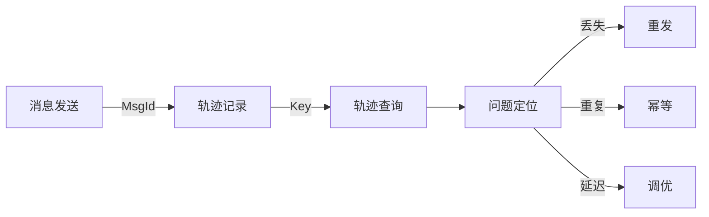
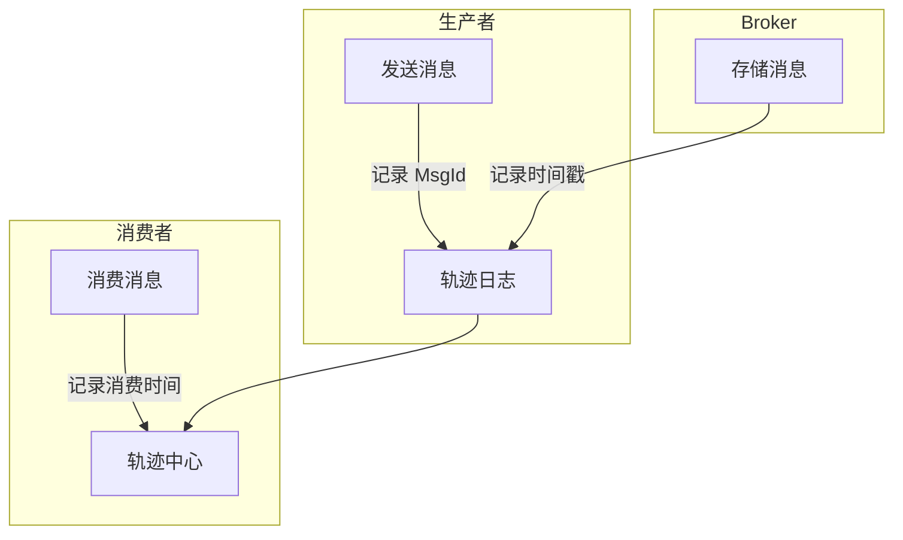

# 消息轨迹与追踪

## 本文核心

**一句话摘要**：RocketMQ 消息轨迹 = MsgId + Key + 生产者/消费者追踪链路，用于定位消息丢失/重复/延迟问题。

**核心机制链**：消息标识 → 轨迹采集 → 轨迹查询 → 问题定位 → 生产实践





## 一、消息标识

### 1.1 MsgId

消息全局唯一 ID，由生产者生成。用于精确追踪单条消息。

### 1.2 Key

业务自定义 Key，用于批量查询。通常设置为业务 ID（如 orderId）。

### 1.3 关联查询

```java
// 通过 MsgId 查询
MessageExt msg = producer.messageAccessor().get(msgId);

// 通过 Key 查询
MessageExt msg = producer.messageAccessor().getKey(msg);
```

## 二、轨迹采集

### 2.1 生产者轨迹

记录：发送时间 + MsgId + Topic + Tags + Body 大小 + 发送结果

### 2.2 Broker 轨迹

记录：存储时间 + CommitLog 偏移 + ConsumeQueue 偏移

### 2.3 消费者轨迹

记录：消费时间 + MsgId + 消费结果 + 消费耗时

## 三、轨迹查询

### 3.1 控制台查询

RocketMQ Console 提供消息轨迹查询界面：
- 输入 MsgId → 查看完整链路
- 输入 Key → 批量查询

### 3.2 命令行查询

```bash
# 查询消息轨迹
mqadmin message -i <MsgId>

# 按 Key 查询
mqadmin message -k <Key>
```

## 四、问题定位

### 4.1 消息丢失定位

1. 检查生产者是否发送成功（SendResult）
2. 检查 Broker 是否存储成功（CommitLog 偏移）
3. 检查消费者是否消费成功（ACK）

### 4.2 消息重复定位

1. 检查生产者是否重试（retryTimes）
2. 检查消费者是否重复消费（幂等性）

### 4.3 消息延迟定位

1. 检查发送耗时（生产者 → Broker）
2. 检查存储耗时（Broker 写入磁盘）
3. 检查消费耗时（Broker → 消费者）

## 五、生产实践

### 5.1 最佳实践

| 实践 | 说明 |
|---|---|
| **设置 Key** | 每条消息设置业务 Key，便于批量查询 |
| **记录轨迹** | 开启轨迹日志，记录完整链路 |
| **监控延迟** | 监控消费耗时，超过阈值告警 |
| **幂等处理** | 消费者必须幂等，防止重复消费 |

### 5.2 轨迹日志配置

```properties
# 开启轨迹日志
trace.enable=true
trace.topic=TRACE_TOPIC
```

## 六、核心带走

- **核心一句话**：RocketMQ 消息轨迹 = MsgId + Key + 生产者/消费者追踪链路
- **核心链条**：消息标识 → 轨迹采集 → 轨迹查询 → 问题定位 → 生产实践
- **关键标识**：MsgId（精确查询）/ Key（批量查询）
- **问题定位**：丢失 → 三段检查 / 重复 → 幂等 / 延迟 → 耗时分析

## 💡 实战提示（Tips）

- **MsgId 唯一**：每条消息自动生成，无需手动设置
- **Key 业务化**：设置为业务 ID（如 orderId），便于业务查询
- **轨迹开销**：轨迹日志增加少量开销，生产环境建议开启
- **批量查询**：Key 支持批量查询，适合对账场景

## ❓ 你们可能会问（QA）

**Q1：MsgId 如何生成？**
A：RocketMQ 自动生成，基于 IP + 时间 + 计数器，保证全局唯一。

**Q2：轨迹查询的延迟是多少？**
A：通常 < 1s。轨迹数据存储在 RocketMQ 内置 Topic 中，查询延迟低。

**Q3：消息轨迹会丢吗？**
A：轨迹数据本身也是消息，可能丢失。建议：轨迹 Topic 独立部署 + 持久化。

## 🤔 思考（开放问题/反思）

- **轨迹数据量**：亿级消息下轨迹数据量如何管理？——采样存储 / 冷热分离
- **跨集群追踪**：多集群环境下如何统一追踪？——全局 MsgId + 集群标识
- **轨迹与监控**：轨迹数据如何接入监控系统？——Prometheus + Grafana 集成

## ⚖️ Trade-off（代价与反方案）

| 方案 | 优势 | 代价 | 反方案 |
|---|---|---|---|
| **RocketMQ 轨迹** | 原生支持、简单可靠 | 数据量大、存储成本 | 自研追踪系统 |
| **自研追踪** | 灵活控制 | 架构复杂、需维护 | RocketMQ 轨迹 |
| **采样追踪** | 成本低 | 可能遗漏问题 | 全量追踪 |

## 📌 数据与事实声明

- 写于 2026-09-11，机制以 RocketMQ 4.x/5.x 为基准
- 量级红线为行业认知口径，决策需按实际业务压测校准
- 典型场景为公开技术社区高频案例的匿名化复述
- 工具口径以 RocketMQ 官方文档为准

## 📚 参考资料

- RocketMQ 官方文档：https://rocketmq.apache.org/docs/
- 《RocketMQ 技术内幕》耿雨春