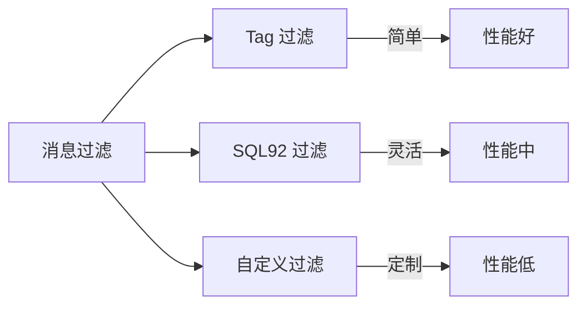
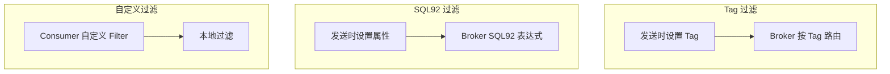

# 消息过滤机制

## 本文核心

**一句话摘要**：RocketMQ 支持 Tag 过滤 + SQL92 属性过滤 + 自定义过滤三类方式，SQL92 支持 WHERE 条件表达式，性能好但灵活性低。

**核心机制链**：Tag 过滤 → SQL92 过滤 → 自定义过滤 → 性能对比 → 生产实践





## 一、Tag 过滤

### 1.1 基本用法

```java
// 生产者设置 Tag
Message msg = new Message("Topic", "TagA", "Hello".getBytes());
producer.send(msg);

// 消费者订阅 Tag
consumer.subscribe("Topic", "TagA || TagB");
```

### 1.2 Tag 表达式

| 表达式 | 含义 |
|---|---|
| `TagA` | 只消费 TagA |
| `TagA 或 TagB` | 消费 TagA 或 TagB |
| `TagA && TagB` | 消费同时满足 TagA 和 TagB |
| `*` | 消费所有 Tag |

## 二、SQL92 过滤

### 2.1 基本用法

```java
// 生产者设置属性
Message msg = new Message("Topic", "TagA", "Hello".getBytes());
msg.putUserProperty("orderId", "12345");
msg.putUserProperty("amount", "100");
producer.send(msg);

// 消费者 SQL92 过滤
consumer.subscribe("Topic", MessageSelector.bySql("orderId = '12345' AND amount > 50"));
```

### 2.2 支持的运算符

| 运算符 | 说明 | 示例 |
|---|---|---|
| = | 等于 | amount = 100 |
| != | 不等于 | status != 'done' |
| > | 大于 | amount > 50 |
| >= | 大于等于 | amount >= 100 |
| < | 小于 | amount < 200 |
| <= | 小于等于 | amount <= 150 |
| BETWEEN | 范围 | amount BETWEEN 50 AND 100 |
| IN | 集合 | status IN ('pending', 'done') |
| LIKE | 模糊 | name LIKE 'order%' |
| IS NULL | 空值 | amount IS NULL |

### 2.3 注意事项

- SQL92 过滤在 Broker 端执行，性能优于 Consumer 端过滤
- 属性值类型支持：字符串 / 数字 / 布尔值
- 属性数量无限制，但建议控制在 10 个以内

## 三、自定义过滤

### 3.1 Consumer 端过滤

```java
consumer.registerMessageListener((MessageListenerConcurrently) (msgs, context) -> {
    for (MessageExt msg : msgs) {
        String orderId = msg.getUserProperty("orderId");
        if ("12345".equals(orderId)) {
            process(msg);
        }
    }
    return ConsumeConcurrentlyStatus.CONSUME_SUCCESS;
});
```

### 3.2 性能对比

| 过滤方式 | 执行位置 | 性能 | 灵活性 |
|---|---|---|---|
| **Tag 过滤** | Broker | 最高 | 低 |
| **SQL92 过滤** | Broker | 中 | 中 |
| **自定义过滤** | Consumer | 低 | 高 |

## 四、生产实践

### 4.1 选型建议

| 场景 | 过滤方式 | 理由 |
|---|---|---|
| **简单分类** | Tag | 性能好、配置简单 |
| **条件过滤** | SQL92 | 灵活、Broker 端执行 |
| **复杂逻辑** | 自定义 | 任意逻辑 |

### 4.2 性能优化

- Tag 过滤：尽量使用 Tag，避免 SQL92 开销
- SQL92 过滤：属性值类型一致，避免类型转换
- 自定义过滤：本地过滤 + 批量处理

## 五、核心带走

- **核心一句话**：RocketMQ 过滤 = Tag（简单）+ SQL92（灵活）+ 自定义（定制）
- **核心链条**：过滤方式 → 执行位置 → 性能对比 → 生产实践
- **性能排序**：Tag > SQL92 > 自定义
- **选型建议**：简单用 Tag / 条件用 SQL92 / 复杂用自定义

## 💡 实战提示（Tips）

- **Tag 命名**：使用有意义的 Tag 名（如 ORDER_CREATED / PAYMENT_DONE）
- **SQL92 属性**：属性值用字符串表示，Broker 端自动转换
- **过滤开销**：SQL92 过滤增加 Broker CPU 开销，监控 Broker 负载
- **自定义过滤**：Consumer 端过滤增加网络传输开销

## ❓ 你们可能会问（QA）

**Q1：Tag 和 SQL92 过滤有什么区别？**
A：Tag 是粗粒度分类（发送时设置），SQL92 是细粒度条件过滤（属性 + WHERE 表达式）。Tag 性能更好，SQL92 更灵活。

**Q2：SQL92 过滤的性能如何？**
A：Broker 端执行，比 Consumer 端过滤性能好。但比 Tag 过滤慢，因为需要解析 SQL 表达式。

**Q3：自定义过滤会不会丢消息？**
A：不会。自定义过滤是 Consumer 端本地过滤，未匹配的消息不会被消费，但会返回 CONSUME_SUCCESS（视为已消费）。

## 🤔 思考（开放问题/反思）

- **Tag 数量膨胀**：Tag 数量过多是否影响性能？——建议控制在 100 个以内
- **SQL92 表达式复杂度**：复杂表达式是否会导致 Broker 性能问题？——建议简单条件
- **自定义过滤的可靠性**：Consumer 端过滤失败怎么办？——需配合重试机制

## ⚖️ Trade-off（代价与反方案）

| 方案 | 优势 | 代价 | 反方案 |
|---|---|---|---|
| **Tag 过滤** | 性能最高、配置简单 | 灵活性低 | SQL92 过滤 |
| **SQL92 过滤** | 灵活、Broker 端执行 | 性能中 | Tag 过滤 |
| **自定义过滤** | 任意逻辑 | 性能低、网络开销 | SQL92 过滤 |

## 📌 数据与事实声明

- 写于 2026-09-11，机制以 RocketMQ 4.x/5.x 为基准
- 量级红线为行业认知口径，决策需按实际业务压测校准
- 典型场景为公开技术社区高频案例的匿名化复述
- 工具口径以 RocketMQ 官方文档为准

## 📚 参考资料

- RocketMQ 官方文档：https://rocketmq.apache.org/docs/
- 《RocketMQ 技术内幕》耿雨春