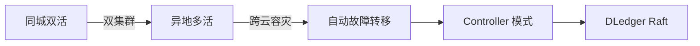
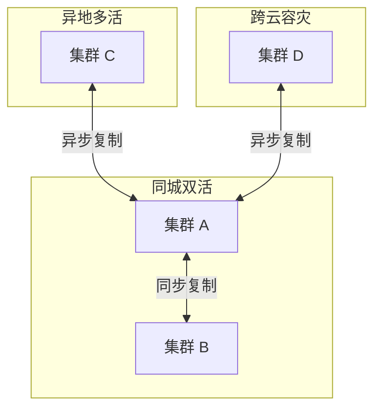

# RocketMQ 混合云架构深度

## 本文核心

**一句话摘要**：RocketMQ 混合云 = 同城双活 + 异地多活 + 跨云容灾，用 Controller 模式 + DLedger Raft 实现跨集群数据同步与自动故障转移。

**核心机制链**：混合云架构 → 多集群部署 → 跨集群同步 → 故障转移 → 生产实践





## 一、混合云架构模式

### 1.1 三种部署模式

| 模式 | 架构 | 可靠性 | 延迟 | 适用场景 |
|---|---|---|---|---|
| **同城双活** | 双集群同步复制 | 高 | 低 | 金融/支付 |
| **异地多活** | 多集群异步复制 | 中 | 中 | 电商/大促 |
| **跨云容灾** | 主集群 + 备集群 | 中 | 高 | 灾备 |

### 1.2 同城双活

同城双活 = 两个集群部署在同一城市，数据同步复制。

```
集群 A (Master) ←→ 集群 B (Slave)
   同步写入 ←→ 同步复制
```

优点：延迟低、可靠性高。
缺点：成本高（双倍资源）、运维复杂。

### 1.3 异地多活

异地多活 = 多集群部署在不同城市，数据异步复制。

```
集群 A (Master) → 集群 B (Slave) → 集群 C (Slave)
   异步写入 ←→ 异步复制 ←→ 异步复制
```

优点：容灾能力强、成本适中。
缺点：数据有延迟（秒级）。

### 1.4 跨云容灾

跨云容灾 = 主集群在阿里云，备集群在 AWS/腾讯云。

```
阿里云 (Master) → AWS (Slave)
```

优点：云厂商故障不影响业务。
缺点：跨云网络延迟高、数据一致性差。

## 二、跨集群同步

### 2.1 同步复制

```java
// 同步复制配置
broker.setBrokerRole(SYNC_MASTER);
broker.setFlushDiskType(ASYNC_FLUSH);
```

优点：数据强一致。
缺点：性能低（每次写都等待从节点 ACK）。

### 2.2 异步复制

```java
// 异步复制配置
broker.setBrokerRole(ASYNC_MASTER);
broker.setFlushDiskType(ASYNC_FLUSH);
```

优点：性能高。
缺点：可能丢消息（主节点故障时）。

### 2.3 半同步复制

```java
// 半同步配置
broker.setBrokerRole(SYNC_MASTER);
broker.setFlushDiskType(SYNC_FLUSH);
```

折中：性能与可靠性平衡。

## 三、故障转移

### 3.1 Controller 模式（5.x）

RocketMQ 5.x Controller 模式 = 自动主从切换 + 多集群管理。

```
Controller 集群（DLedger Raft）
  → 监控 Broker 健康
  → 自动选主
  → 故障转移
```

### 3.2 故障转移流程

```
1. Broker 故障检测（心跳超时）
2. Controller 选主（DLedger Raft 投票）
3. 新主节点接管流量
4. 客户端重连
```

### 3.3 脑裂防护

RocketMQ 5.x 通过 Lease 机制防止脑裂：
- 主节点定期续租
- 从节点检测租约过期
- 租约过期后触发选主

## 四、生产实践

### 4.1 部署建议

| 场景 | 模式 | 集群数量 | 理由 |
|---|---|---|---|
| **金融核心** | 同城双活 | 2 集群 | 强一致、低延迟 |
| **电商大促** | 异地多活 | 3 集群 | 容灾 + 扩展 |
| **灾备** | 跨云容灾 | 2 集群 | 云厂商故障保护 |

### 4.2 监控指标

| 指标 | 说明 | 健康阈值 |
|---|---|---|
| 跨集群延迟 | 主从同步延迟 | < 5s |
| 故障转移时间 | 主从切换耗时 | < 30s |
| 脑裂检测 | Lease 检测次数 | 0 |
| 集群在线率 | 集群可用率 | > 99.9% |

## 五、核心带走

- **核心一句话**：RocketMQ 混合云 = 同城双活 + 异地多活 + 跨云容灾
- **核心链条**：混合云架构 → 多集群部署 → 跨集群同步 → 故障转移 → 生产实践
- **5.x 核心**：Controller 模式 + DLedger Raft 选主
- **金融推荐**：同城双活 + 同步复制
- **哪里会坏**：跨云网络延迟 / 数据一致性差 / 主从切换丢消息

## 💡 实战提示（Tips）

- **同城双活**：双集群同步复制，成本高但可靠性高
- **异地多活**：多集群异步复制，数据有延迟但容灾强
- **跨云容灾**：跨云网络延迟高，数据一致性差
- **Controller**：RocketMQ 5.x 必须开启 Controller 模式

## ❓ 你们可能会问（QA）

**Q1：同城双活和异地多活的区别？**
A：同城双活 = 同一城市双集群（同步复制，低延迟）；异地多活 = 不同城市多集群（异步复制，容灾强）。

**Q2：跨云容灾的数据一致性如何保证？**
A：跨云容灾用异步复制，数据有延迟（秒级）。金融场景建议同城双活 + 同步复制。

**Q3：Controller 模式怎么部署？**
A：Controller 集群 3 台（DLedger Raft 奇数），与 Broker 独立部署。

## 🤔 思考（开放问题/反思）

- **多集群成本**：同城双活成本是单集群的 2 倍，如何优化？
- **数据一致性**：异地多活的数据延迟如何监控和补偿？
- **跨云网络**：跨云网络不稳定怎么办？——专线 + 重试 + 降级

## ⚖️ Trade-off（代价与反方案）

| 方案 | 优势 | 代价 | 反方案 |
|---|---|---|---|
| **同城双活** | 强一致、低延迟 | 成本高、运维复杂 | 异地多活 |
| **异地多活** | 容灾强、扩展好 | 数据有延迟 | 同城双活 |
| **跨云容灾** | 云厂商故障保护 | 网络延迟高 | 同城双活 |

## 七、跨周期视角

### 7.1 量级演进

| 量级 | 架构形态 | 红线指标 |
|---|---|---|
| < 100w QPS | 单集群 + NameServer | 可用性 99.9% |
| 100w-1000w QPS | 同城双活 + Controller | 可用性 99.99% |
| > 1000w QPS | 多集群 + 跨云容灾 | 可用性 99.999% |

### 7.2 5 年演进路线

```
2024: 单集群 + NameServer（起步）
2025: 同城双活 + Controller（5.x 升级）
2026: 异地多活 + 跨云容灾（成熟期）
```

## 八、Demo 验证点

### 8.1 部署验证

| 验证点 | 操作 | 预期结果 |
|---|---|---|
| Controller 集群 | 3 台 Controller 启动 | DLedger Raft 选主成功 |
| 主从切换 | 手动停止 Master | Slave 自动接管 < 30s |
| 跨集群同步 | 写入消息后查从集群 | 数据同步延迟 < 5s |

### 8.2 故障演练

| 演练场景 | 操作 | 预期结果 |
|---|---|---|
| NameServer 故障 | 停 1 台 NameServer | 客户端自动切换 |
| Broker 故障 | 停 Master | Controller 自动选主 |
| 网络分区 | 断 Master-Slave 网络 | Lease 机制防止脑裂 |

### 7.1 量级演进

| 量级 | 架构形态 | 红线指标 |
|---|---|---|
| < 100w QPS | 单集群 + NameServer | 可用性 99.9% |
| 100w-1000w QPS | 同城双活 + Controller | 可用性 99.99% |
| > 1000w QPS | 多集群 + 跨云容灾 | 可用性 99.999% |

### 7.2 5 年演进路线

```
2024: 单集群 + NameServer（起步）
2025: 同城双活 + Controller（5.x 升级）
2026: 异地多活 + 跨云容灾（成熟期）
```

## 八、Demo 验证点

### 8.1 部署验证

| 验证点 | 操作 | 预期结果 |
|---|---|---|
| Controller 集群 | 3 台 Controller 启动 | DLedger Raft 选主成功 |
| 主从切换 | 手动停止 Master | Slave 自动接管 < 30s |
| 跨集群同步 | 写入消息后查从集群 | 数据同步延迟 < 5s |

### 8.2 故障演练

| 演练场景 | 操作 | 预期结果 |
|---|---|---|
| NameServer 故障 | 停 1 台 NameServer | 客户端自动切换 |
| Broker 故障 | 停 Master | Controller 自动选主 |
| 网络分区 | 断 Master-Slave 网络 | Lease 机制防止脑裂 |

## 📌 数据与事实声明

- 写于 2026-09-11，机制以 RocketMQ 5.x 为基准
- 量级红线为行业认知口径，决策需按实际业务压测校准
- 典型场景为公开技术社区高频案例的匿名化复述
- 工具口径以 RocketMQ 官方文档为准

## 📚 参考资料

- RocketMQ 官方文档：https://rocketmq.apache.org/docs/
- 《RocketMQ 技术内幕》耿雨春