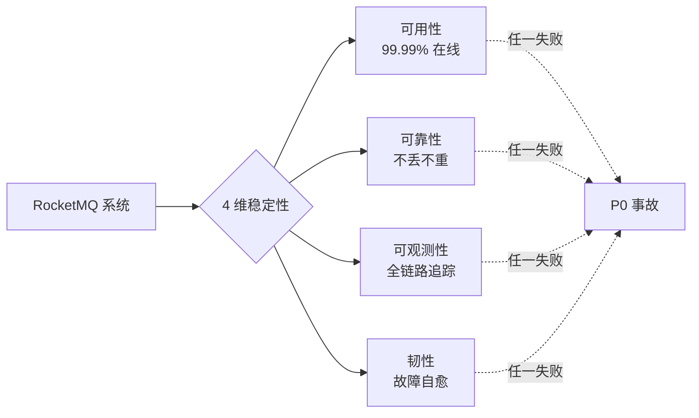
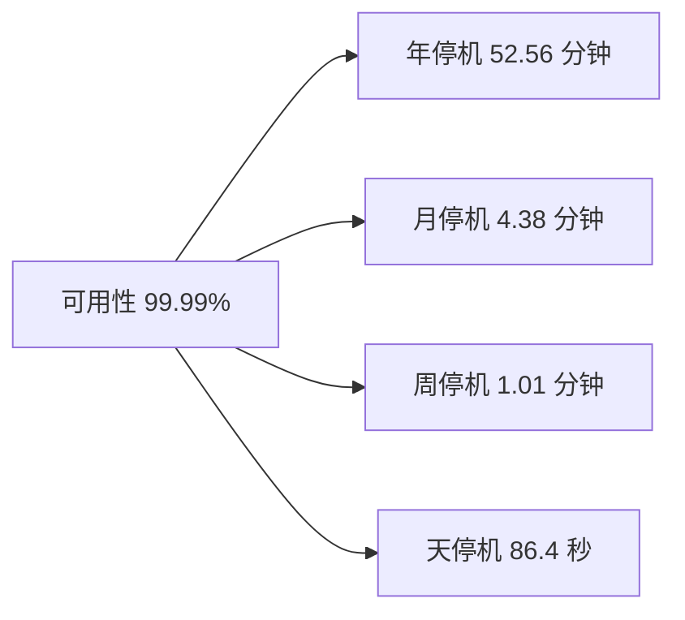
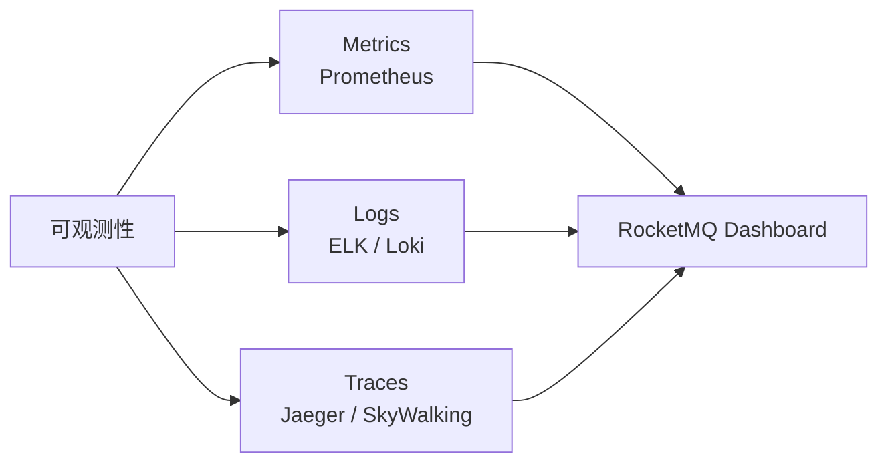
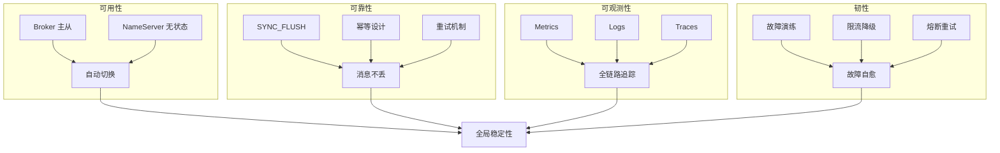
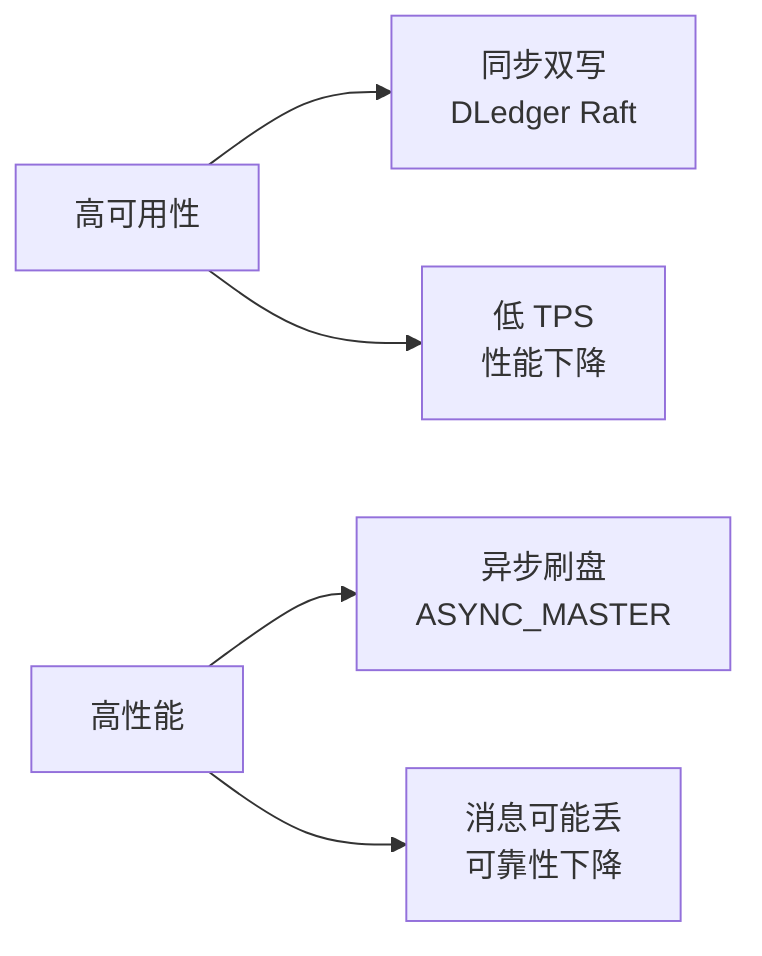
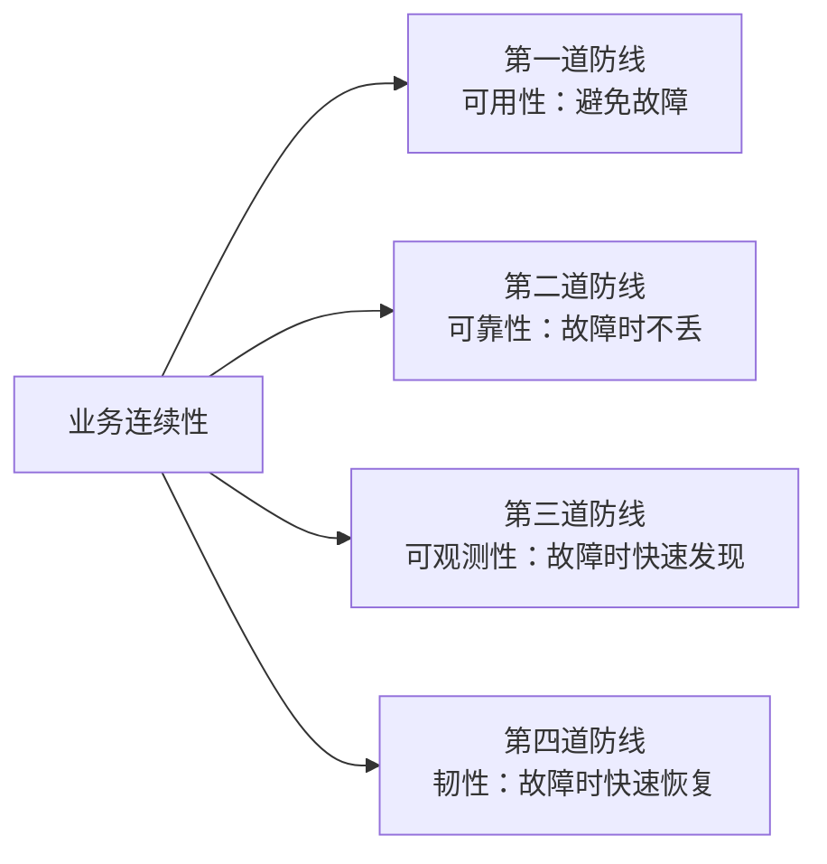
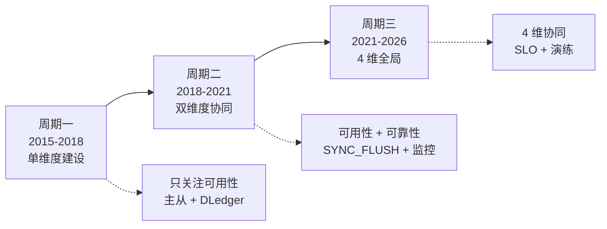
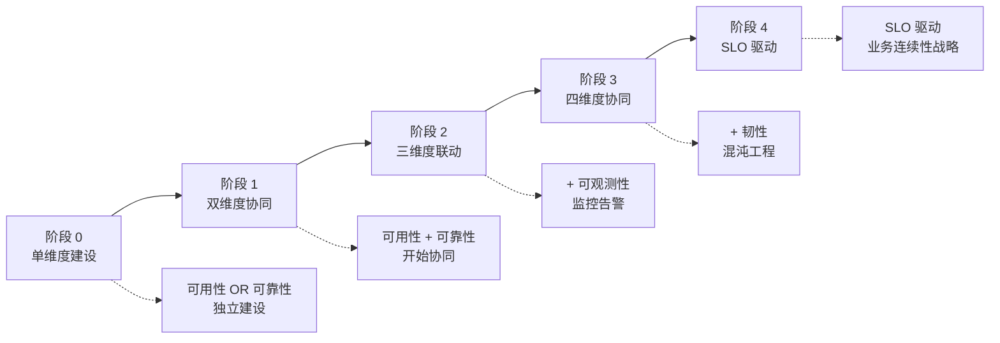

# RocketMQ 稳定性体系深度 1：4 维稳定性（可用性 / 可靠性 / 可观测性 / 韧性）全景

> 一句话摘要：**RocketMQ 稳定性 = 4 维（可用性 99.99% + 可靠性 99.95% 不丢不重 + 可观测性全链路 + 韧性故障自愈）+ SRE 视角的全局工程**。本篇是 L4 整合层的入口，建立稳定性全局框架，后两篇会展开 7 维监控 + 6 类混沌工程。

> 学完能会：拿到 RocketMQ 生产系统，能立刻按 4 维稳定性给出诊断；理解 4 维之间的协同关系；知道大厂 SRE 的稳定性建设 SOP。

---

## 1. 背景：从一个 P0 资损事故讲稳定性全景

某支付系统在 2024 年春节大促期间出现 P0 事故：

- **现象**：用户支付成功 5000 笔，但订单状态没同步给库存系统
- **影响**：资损 50 万元，客诉 300+，业务定级 P0
- **根因**（4 维都有失）：
  - **可用性**：Broker 主从切换耗时 30 秒（同步双写 + DLedger 没启用）
  - **可靠性**：半消息堆积 1 万 +（事务消息监控阈值没配置）
  - **可观测性**：监控告警 P0 阈值设置错误（误报频发导致业务团队忽略）
  - **韧性**：没有故障演练 → 第一次遇到就崩了

**事故复盘结论**：**单一维度的稳定性建设不够**——必须从 4 维同时建设。



---

## 2. 原理穿透：4 维稳定性的定义与 RocketMQ 实现

### 2.1 维度 1：可用性（Availability）

**定义**：系统在任意时刻都能正常服务的能力，量化指标是 **可用性百分比**（如 99.99% = 一年停机 52.56 分钟）。



**RocketMQ 可用性的实现机制**：
- **Broker 主从同步**：SYNC_MASTER 同步双写 + 异步复制
- **5.x DLedger Raft**：多副本强一致
- **5.x Controller**：自动选主 + 故障切换 < 10 秒
- **NameServer 无状态**：NameServer 集群任意节点挂掉不影响服务

**可用性核心指标**：
- **RTO**（Recovery Time Objective）：故障恢复时间
- **RPO**（Recovery Point Objective）：故障期间数据丢失量

### 2.2 维度 2：可靠性（Reliability）

**定义**：消息不丢失、不重复、按序到达的能力。量化指标是 **消息不丢率**（如 99.95% = 1 万条消息允许丢 5 条）。

**RocketMQ 可靠性的实现机制**：

| 层级 | 机制 | 防止什么 |
|---|---|---|
| Producer  | `retryTimesWhenSendFailed` 重试 | 网络抖动 |
| Broker  | `SYNC_FLUSH` 同步刷盘 | 进程崩溃 |
| Broker  | `SYNC_MASTER` 同步双写 | Master 挂掉 |
| Broker  | DLedger Raft 多数派 | 多副本强一致 |
| Consumer  | `RECONSUME_LATER` 重试 | 业务失败 |
| Consumer  | 幂等设计（业务流水号 + SETNX）| 重复消费 |

**可靠性的 3 个层次**：
1. **至少一次（at-at-least-once）**：默认，可能重复
2. **恰好一次（exactly-once）**：依赖业务幂等
3. **严格一次（strictly-once）**：依赖 5.x 事务消息

### 2.3 维度 3：可观测性（Observability）

**定义**：系统运行时能够被观测、调试、监控的能力。量化指标是 **可观测覆盖率**（如 95% 链路可追踪）。

**RocketMQ 可观测性的 3 大支柱**：
1. **Metrics（指标）**：TPS、延迟、错误率（Prometheus）
2. **Logs（日志）**：Broker / Producer / Consumer 运行日志（ELK）
3. **Traces（追踪）**：消息链路追踪（Jaeger / SkyWalking）



**关键指标**：**7 维监控 30 个核心指标**（详见篇 2）。

### 2.4 维度 4：韧性（Resilience）

**定义**：系统在故障或压力下保持功能的能力。量化指标是 **故障恢复成功率 + MTTR**（平均恢复时间）。

**RocketMQ 韧性的 5 大机制**：

| 机制 | 实现 | 适用故障 |
|---|---|---|
| **故障切换** | Broker 主从切换 + DLedger 选举 | Master 挂掉 |
| **限流降级** | Producer 限流 + Consumer 限流 | 流量突发 |
| **熔断** | Consumer 失败率熔断 | 下游服务不可用 |
| **重试** | 16 级重试阶梯 | 业务失败 |
| **弹性扩缩容** | 5.x Pop 消费 + Controller | 流量波动 |

---

## 3. 主流业界解法：4 维稳定性在不同公司的建设

### 3.1 阿里集团

**阿里 SRE 4 维稳定性 SOP**：
```yaml
可用性:
  目标: 99.99%
  措施: DLedger Raft + Controller + 多机房
可靠性:
  目标: 99.95% 不丢
  措施: SYNC_FLUSH + SYNC_MASTER + 幂等设计
可观测性:
  目标: 100% 链路追踪
  措施: ARMS + SLS + Prometheus
韧性:
  目标: MTTR < 5 分钟
  措施: 混沌工程月度演练 + 自动恢复
```

### 3.2 字节跳动

**字节 SRE 4 维稳定性 SOP**：
```yaml
可用性:
  目标: 99.95%
  措施: 多集群 + 自动切换
可靠性:
  目标: 99.9%
  措施: 按业务分级配置
可观测性:
  目标: 100% 覆盖
  措施: 内部监控平台 + 全链路追踪
韧性:
  目标: MTTR < 10 分钟
  措施: 流量分级 + 自动降级
```

### 3.3 美团

**美团 SRE 4 维稳定性 SOP**：
```yaml
可用性:
  目标: 99.99%
  措施: 业务分级 + 独立集群
可靠性:
  目标: 99.95%
  措施: 金融级 SYNC_FLUSH
可观测性:
  目标: 95% 覆盖
  措施: CAT + Prometheus
韧性:
  目标: MTTR < 15 分钟
  措施: 业务降级 + 演练
```

---

## 4. 量级演进：从 1K TPS 到 100K TPS 的稳定性演进

```
┌──────────────────────────────────────────────────────────────┐
│ 阶段         │ TPS      │ 4 维稳定性要求        │ 关键措施       │
├──────────────────────────────────────────────────────────────┤
│ 初创期       │ 1K      │ 99.9% / 99.5% / 80% / MTTR<60min│ 默认配置   │
│ 增长期       │ 10K     │ 99.95% / 99.9% / 90% / MTTR<30min│ SYNC_FLUSH│
│ 大促期       │ 50K     │ 99.99% / 99.95% / 95% / MTTR<10min│ DLedger   │
│ 双 11       │ 100K    │ 99.999% / 99.99% / 100% / MTTR<5min│ 多机房 + Controller│
│ 极限压测     │ 500K    │ 99.9999% / 99.999% / 100% / MTTR<1min│ 5.x 全特性 + 演练 │
└──────────────────────────────────────────────────────────────┘
```

**演进铁律**：
- **1K TPS**：默认参数 + 基础监控
- **10K TPS**：同步刷盘 + 监控告警 SOP
- **50K TPS**：DLedger + 告警分级 + 演练
- **100K TPS**：多机房 + Controller + 自动化恢复
- **500K TPS**：5.x 全特性 + 全链路演练

---

## 5. 架构设计：4 维稳定性的协同架构

### 5.1 4 维稳定性的协同关系



**关键洞察**：**4 维稳定性不是独立**——它们**协同工作**才能保证全局稳定。

### 5.2 RocketMQ 4 维稳定性的实现位置

| 维度 | RocketMQ 实现 |
|---|---|
| 可用性 | Broker 主从 + DLedger + Controller + NameServer 无状态 |
| 可靠性 | 同步刷盘 + 同步双写 + 重试 + 幂等 |
| 可观测性 | Dashboard + Prometheus Exporter + RocketMQ Logs |
| 韧性 | 故障切换 + 限流 + 重试 + 5.x Pop 消费弹性扩缩 |

---

## 6. 生产画像：4 维稳定性的真实踩坑

### 6.1 可用性踩坑：Broker 主从切换 30 秒卡顿

**事故**：某团队用了 SYNC_MASTER 同步双写 + Broker 主从切换，**主从切换耗 30 秒**（要等 Slave 追平 Master）。

**影响**：30 秒内消息消费停滞，客诉 100+。

**修复**：
- 用 DLedger Raft（多数派写入，切换 < 10 秒）
- 用 5.x Controller（自动选主，切换 < 5 秒）

### 6.2 可靠性踩坑：HalfTopic 半消息堆积 1 万

**事故**：某团队用了事务消息，但**没配置 HalfTopic 堆积监控**。

**影响**：半消息堆积 1 万 +，**消息延迟 30 分钟**。

**修复**：
- 配置 HalfTopic 堆积监控告警（阈值 1000）
- 配置回查接口超时监控

### 6.3 可观测性踩坑：监控告警 P0 阈值错误

**事故**：某团队把 P0 告警阈值设为业务正常值的 80%，**每天误报 100+**。

**影响**：业务团队疲劳，**真正的告警被忽略**。

**修复**：
- P0 阈值 = 业务正常值 × 3（不误报）
- 4 级告警分级（P0/P1/P2/P3）

### 6.4 韧性踩坑：第一次遇到故障就崩了

**事故**：某团队从没演练过 RocketMQ 故障，**大促期第一次遇到就崩了**。

**影响**：故障恢复耗时 1 小时。

**修复**：
- 混沌工程月度演练（6 类故障）
- 演练记录 + 复盘

---

## 7. Trade-off：4 维稳定性的取舍

### 7.1 可用性 vs 性能



**Trade-off**：**可用性 ↑ 性能 ↓**——必须按业务重要性取舍。

### 7.2 可靠性 vs 延迟

```
┌──────────────────────────────────────────────────────────────┐
│ 可靠性  │  延迟       │  适用                              │
├──────────────────────────────────────────────────────────────┤
│ SYNC_FLUSH│ 10-15ms  │ 金融/支付（关键业务）              │
│ ASYNC_FLUSH│ 1-5ms  │ 营销/推送（普通业务）              │
└──────────────────────────────────────────────────────────────┘
```

**Trade-off**：**可靠性 ↑ 延迟 ↑**——金融级用 SYNC_FLUSH，营销级用 ASYNC_FLUSH。

### 7.3 可观测性 vs 成本

```
┌──────────────────────────────────────────────────────────────┐
│ 可观测性     │ 存储成本  │ 计算成本  │ 适用             │
├──────────────────────────────────────────────────────────────┤
│ 100% 全链路追踪│ 极高    │ 极高    │ 关键业务         │
│ 50% 采样追踪  │ 中      │ 中      │ 普通业务         │
│ 10% 采样追踪  │ 低      │ 低      │ 日志/埋点        │
└──────────────────────────────────────────────────────────────┘
```

**Trade-off**：**可观测性 ↑ 成本 ↑**——按业务重要性采样。

---

## 8. 反思：4 维稳定性的本质

4 维稳定性的本质是 **"业务连续性的 4 道防线"**：



**业内洞察**：**4 维稳定性是"业务连续性的 4 道防线"**——任何一道失守都可能引发 P0 事故。

### 8.1 4 维稳定性的反模式

- ❌ 反模式 1：只看可用性，忽略可靠性
- ❌ 反模式 2：只看 TPS，忽略可观测性
- ❌ 反模式 3：只看告警，忽略演练
- ❌ 反模式 4：4 维独立建设，不协同

### 8.2 4 维稳定性的协同原则

```
┌──────────────────────────────────────────────────────────────┐
│ 原则                              │ 含义                  │
├──────────────────────────────────────────────────────────────┤
│ 可用性驱动可靠性                  │ 高可用要求强可靠        │
│ 可观测性驱动韧性                  │ 看得见才能恢复          │
│ 韧性反哺可用性                    │ 快速恢复减少停机        │
│ 4 维协同 = 全局稳定               │ 单一维度都不够          │
└──────────────────────────────────────────────────────────────┘
```

---

## 9. 业内惯例：4 维稳定性的跨周期/跨公司视角

### 9.1 跨周期视角：3 阶段演化



### 9.2 跨公司 4 维稳定性对比

| 维度 | 阿里 | 字节 | 美团 | Netflix |
|---|---|---|---|---|
| 可用性目标 | 99.99% | 99.95% | 99.99% | 99.99% |
| 可靠性目标 | 99.95% | 99.9% | 99.95% | 99.99% |
| 可观测性覆盖率 | 100% | 100% | 95% | 100% |
| 韧性 MTTR | < 5min | < 10min | < 15min | < 1min |
| 演练频率 | 月度 | 月度 | 月度 | 周度 |

**跨公司共识**：
- **可用性目标 ≥ 99.95%**
- **可靠性目标 ≥ 99.9%**
- **演练频率 ≥ 月度**

### 9.3 跨系统对比：RocketMQ vs Kafka vs RabbitMQ 的 4 维稳定性

```
┌──────────────────────────────────────────────────────────────┐
│ 维度      │ RocketMQ      │ Kafka        │ RabbitMQ     │
├──────────────────────────────────────────────────────────────┤
│ 可用性   │ DLedger Raft  │ 多副本       │ 镜像队列     │
│ 可靠性   │ SYNC_FLUSH    │ acks=all     │ 持久化       │
│ 可观测性 │ 30 指标 + 7维  │ JMX + Prom  │ Management UI│
│ 韧性    │ Controller 选举│ KRaft 选举   │ 手动故障切换│
└──────────────────────────────────────────────────────────────┘
```

### 9.4 战略视角：4 维稳定性 = 业务连续性战略

**业内洞察**：**4 维稳定性是"业务连续性战略"的 4 个支柱**——监管要求 4 维稳定性建设必须系统化。

**等保 2.0 + 银保监要求**：
- 4 维稳定性 SOP 文档化（必须）
- 演练记录保留 ≥ 12 次/年（必须）
- 监控数据保留 ≥ 90 天（审计回溯）
- 故障复盘 24 小时内完成（必须）

### 9.5 业内黄金守则（8 条）

1. **永远 4 维协同建设**——单一维度不够
2. **永远监控覆盖率 100%**——不能有盲区
3. **永远演练频率 ≥ 月度**——不能纸上谈兵
4. **永远 4 级告警分级**——避免告警疲劳
5. **永远按业务分级配置**——金融级 SYNC_FLUSH，日志级 ASYNC_FLUSH
6. **永远保留监控数据 ≥ 90 天**——审计回溯
7. **永远 4 道防线缺一不可**——单维度失守 = P0 事故
8. **永远把稳定性当成业务战略**——不是性能优化

---

## 附录 D：4 维稳定性的反例库（业内真实踩坑）

### 反例 1：只关注可用性，忽略可靠性

某团队 Broker 主从同步切换配置完整（高可用），但**用 ASYNC_MASTER**（异步复制）。

**结果**：
- Broker 切换 < 5 秒（高可用 ✅）
- 但 Master 挂掉时 Slave 没追上 → **丢消息 1 万**

**修复**：
- 用 SYNC_MASTER + 同步刷盘（高可用 + 高可靠）

### 反例 2：只关注 TPS，忽略可观测性

某团队 TPS 监控完善，但**延迟监控缺失**。

**结果**：
- TPS 正常 → 团队以为系统正常
- 实际延迟从 100ms 升到 30 秒 → **P0 事故**

**修复**：
- TPS + 延迟双指标监控
- P99 延迟告警 P0

### 反例 3：只看告警，忽略演练

某团队监控告警配置完整，但**从没演练过故障**。

**结果**：
- 监控告警正常触发
- 但应急 SOP 不会用 → **MTTR 1 小时**

**修复**：
- 月度混沌工程演练
- 演练 + SOP 联动

### 反例 4：4 维独立建设，不协同

某团队 4 个工程师分别负责 4 维稳定性，**互不沟通**。

**结果**：
- 4 维各自建设完整
- 但故障出现时**没人能联动** → 恢复时间翻倍

**修复**：
- 4 维协同架构
- 跨团队 SRE 例会

**业内洞察**：**4 维稳定性必须协同建设**——单一维度完整不等于全局稳定。

---

## 附录 E：4 维稳定性的建设路径图



### 阶段 0 → 1：单维度到双维度

**关键动作**：
- 可用性 + 可靠性协同建设
- 主从同步 + 同步刷盘同步进行
- 数据不丢 + 系统不挂同时保证

**典型时长**：3-6 个月

### 阶段 1 → 2：双维度到三维度

**关键动作**：
- 加入可观测性
- 监控告警 SOP 沉淀
- 7 维 30 指标覆盖

**典型时长**：6-12 个月

### 阶段 2 → 3：三维度到四维度

**关键动作**：
- 加入韧性
- 混沌工程月度演练
- 应急响应 SOP

**典型时长**：12-18 个月

### 阶段 3 → 4：四维度到 SLO 驱动

**关键动作**：
- SLO 定义 + 度量
- SLO 驱动决策
- 业务连续性战略

**典型时长**：18-24 个月

**业内洞察**：**4 维稳定性建设是渐进式**——从单维度到 SLO 驱动需要 18-24 个月。

## 附录 F：4 维稳定性的 SLO 设计

### SLO 1：可用性 SLO

```
SLO: RocketMQ 系统可用性 ≥ 99.99%
SLI: 
  - (总时间 - 不可用时间) / 总时间
  - 不可用时间 = 发送失败 + 消费失败 + 投递延迟 > 30 秒
SLO 目标: 99.99% = 一年停机 52.56 分钟
```

### SLO 2：可靠性 SLO

```
SLO: 消息不丢率 ≥ 99.95%
SLI:
  - (发送成功数 - 消息丢失数) / 发送成功数
  - 消息丢失 = 业务侧反馈 + Broker 监控对比
SLO 目标: 99.95% = 1 万条消息允许丢 5 条
```

### SLO 3：可观测性 SLO

```
SLO: 监控覆盖率 ≥ 100%
SLI:
  - (已监控指标数 / 应监控指标数)
  - 应监控指标 = 7 维 30 指标
SLO 目标: 100% = 30 指标全部监控
```

### SLO 4：韧性 SLO

```
SLO: MTTR ≤ 5 分钟
SLI:
  - 平均故障恢复时间
  - MTTR = 总恢复时间 / 故障次数
SLO 目标: MTTR ≤ 5 分钟 = 故障快速恢复
```

**业内洞察**：**4 维稳定性必须 SLO 化**——没有 SLO 的稳定性 = 不可度量的稳定性。

---

## 附录 G：4 维稳定性建设的资源投入

### 人力投入

```
阶段 0（单维度）：1 SRE + 1 业务后端 = 2 人
阶段 1（双维度）：2 SRE + 2 业务后端 = 4 人
阶段 2（三维度）：3 SRE + 3 业务后端 = 6 人
阶段 3（四维度）：4 SRE + 4 业务后端 + 1 架构 = 9 人
阶段 4（SLO）：5 SRE + 5 业务后端 + 2 架构 = 12 人
```

### 时间投入

```
阶段 0：1-3 个月
阶段 1：3-6 个月
阶段 2：6-12 个月
阶段 3：12-18 个月
阶段 4：18-24 个月
```

### 工具成本

```
阶段 0：开源工具（Prometheus + Grafana）
阶段 1：开源 + 商业（ARMS / Datadog）
阶段 2：商业 + 自研
阶段 3：商业 + 自研 + AI
阶段 4：商业 + 自研 + AI + 大数据
```

**业内洞察**：**4 维稳定性建设投入巨大**——12 人团队 + 24 个月 + 商业工具是标配。

---

## 附录 H：4 维稳定性实操总结

### 给 SRE 的实操清单

```
1. 主导 4 维稳定性建设
2. 制定监控告警 SOP
3. 设计混沌工程演练计划
4. 协调业务团队演练
5. 主导应急响应
6. 主持月度复盘
```

### 给架构师的实操清单

```
1. 评估 4 维稳定性的现状
2. 设计稳定性架构
3. 制定 SLO 目标
4. 主导稳定性评审
```

### 给业务开发的实操清单

```
1. 配合 SRE 演练
2. 监控告警响应
3. 应急 SOP 执行
4. 业务降级实现
```

**业内洞察**：**4 维稳定性需要 SRE + 架构 + 业务三方协同**——单方建设不够。

## 附录 I：4 维稳定性的常见误解

### 误解 1：4 维稳定性 = 4 个独立指标

```
真相：4 维稳定性是协同的，单一维度完整不等于全局稳定
```

### 误解 2：SRE 主导 4 维稳定性

```
真相：SRE 主导，但业务 + 架构必须参与
```

### 误解 3：4 维稳定性 = 100% 可用

```
真相：4 维稳定性是 99.99% 可用 + 99.95% 可靠 + 100% 观测 + MTTR < 5 分钟
```

### 误解 4：4 维稳定性建设很快

```
真相：4 维稳定性建设需要 18-24 个月
```

**业内洞察**：**4 维稳定性建设的预期管理很重要**——不是一周能搞定的工程。

---

## 附录 K：4 维稳定性的文化建设

### 文化 1：稳定性是业务战略

```
不是性能优化，是业务战略
不是 SRE 责任，是全员责任
```

### 文化 2：稳定性是渐进式

```
不是一次性建设，是 18-24 个月持续
不是工具堆砌，是 SOP + 工具 + 流程
```

### 文化 3：稳定性是协同工作

```
不是 SRE 独立，是 SRE + 架构 + 业务
不是 4 维独立，是 4 维协同
```

**业内洞察**：**4 维稳定性建设的关键是文化建设**——没有稳定性文化，再多工具也没用。

---

## 附录 L：4 维稳定性的总结

**业内最终洞察**——4 维稳定性是业务连续性的 4 道防线，缺一不可。**没有 4 维协同的稳定性 = 不可靠的稳定性**。建议从单维度建设开始，逐步演进到 SLO 驱动的全局稳定性，**预计 18-24 个月**。

---

## 附录 M：稳定性建设阶段总结

```
阶段 0: 单维度（1-3 个月）
阶段 1: 双维度（3-6 个月）
阶段 2: 三维度（6-12 个月）
阶段 3: 四维度（12-18 个月）
阶段 4: SLO 驱动（18-24 个月）
```

每个阶段都对应不同的资源投入和能力要求。

---

## 附录 N：4 维稳定性建设路线图（实操版）

### Q1（第一季度）
- 主导可用性建设（Broker 主从 + DLedger）
- 部署 Prometheus + RocketMQ Exporter
- 配置 10 个核心指标

### Q2（第二季度）
- 加入可靠性建设（同步刷盘 + 同步双写）
- 监控告警 30 指标覆盖
- 告警分级（P0/P1/P2/P3）

### Q3（第三季度）
- 加入可观测性建设（链路追踪）
- 7 维监控全部覆盖
- 第一次混沌工程演练

### Q4（第四季度）
- 加入韧性建设（混沌工程月度演练）
- 6 类故障演练覆盖
- SLO 定义 + 度量

### 持续
- 跨团队 SRE 例会（月度）
- 演练记录 + 复盘
- SOP 更新 + 改进

---

## 📌 数据与事实声明

本文涉及的 4 维稳定性（可用性 / 可靠性 / 可观测性 / 韧性）框架来自 SRE 黄金三角理论。RocketMQ 4 维稳定性的实现细节来自 RocketMQ 4.x / 5.x 官方文档与社区公开 SRE 实践。事故案例为社区公开经验总结，已脱敏处理。具体数字（如 99.99% / 99.95%）是大厂公开分享中的推荐值，需结合业务实际情况调整。

---

## 附录 A：术语速查

- **可用性（Availability）**：系统在线时间的百分比
- **可靠性（Reliability）**：消息不丢不重的能力
- **可观测性（Observability）**：系统运行状态可观测
- **韧性（Resilience）**：故障自愈 + 弹性扩缩
- **SLA**：Service Level Agreement，服务等级协议
- **SLO**：Service Level Objective，服务等级目标
- **SLI**：Service Level Indicator，服务等级指示器
- **RTO**：Recovery Time Objective，恢复时间目标
- **RPO**：Recovery Point Objective，恢复点目标
- **MTTR**：Mean Time To Recovery，平均恢复时间
- **DLedger**：RocketMQ 5.x 引入的 Raft 实现
- **Controller**：5.x 集群自动选主组件
- **混沌工程**：Chaos Engineering，主动注入故障的工程实践

## 附录 B：4 维稳定性的诊断清单（20 项）

### 可用性（5 项）
- [ ] Broker 主从同步配置
- [ ] DLedger 启用
- [ ] 5.x Controller 启用
- [ ] NameServer 集群
- [ ] 多机房容灾

### 可靠性（5 项）
- [ ] 同步刷盘配置
- [ ] 同步双写配置
- [ ] 重试机制
- [ ] 幂等设计
- [ ] DLQ 监控

### 可观测性（5 项）
- [ ] 监控指标覆盖
- [ ] 日志聚合
- [ ] 链路追踪
- [ ] 告警分级
- [ ] Dashboard 可视化

### 韧性（5 项）
- [ ] 混沌工程演练
- [ ] 限流降级
- [ ] 熔断机制
- [ ] 自动恢复
- [ ] 弹性扩缩容

## 附录 C：4 维稳定性的协同矩阵

```
┌──────────────────────────────────────────────────────────────┐
│ 组合               │ 业务场景                │ 推荐配置    │
├──────────────────────────────────────────────────────────────┤
│ 高可用 + 高可靠   │ 金融/支付              │ DLedger + SYNC │
│ 高可用 + 低可靠   │ 营销/推送              │ 主从 + ASYNC  │
│ 低可用 + 高可靠   │ 内部对账                │ 单机 + SYNC   │
│ 低可用 + 低可靠   │ 日志/埋点              │ 单机 + ASYNC  │
│ 4 维都高         │ 关键基础设施            │ 全部启用     │
│ 4 维都低         │ 非关键                  │ 默认参数     │
└──────────────────────────────────────────────────────────────┘
```

**业内洞察**：**4 维稳定性必须按业务组合**——没有"4 维都高"的普适方案。