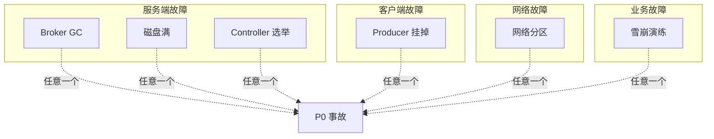
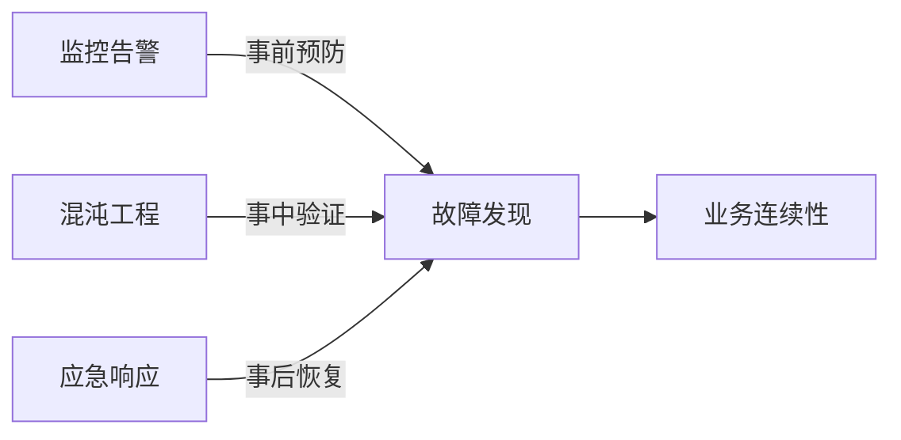
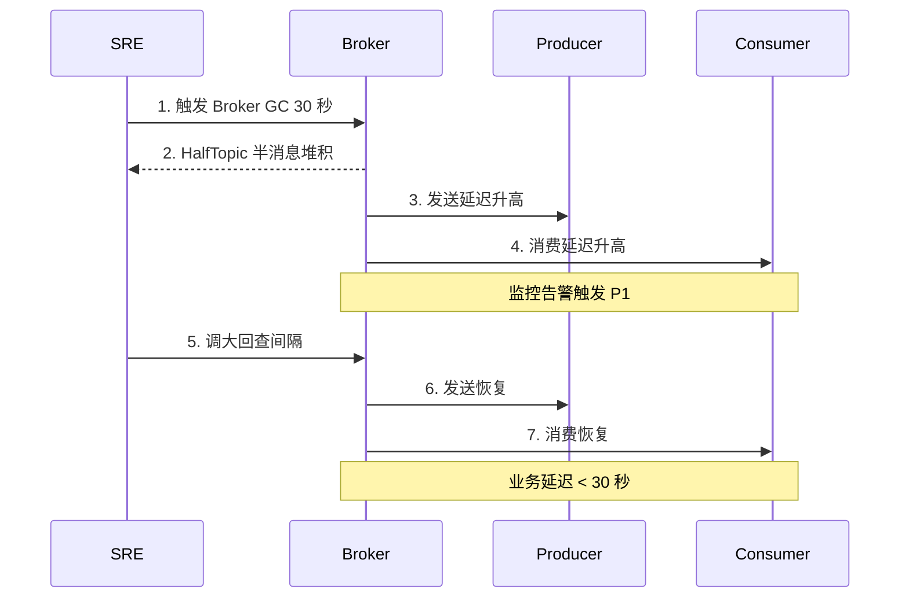
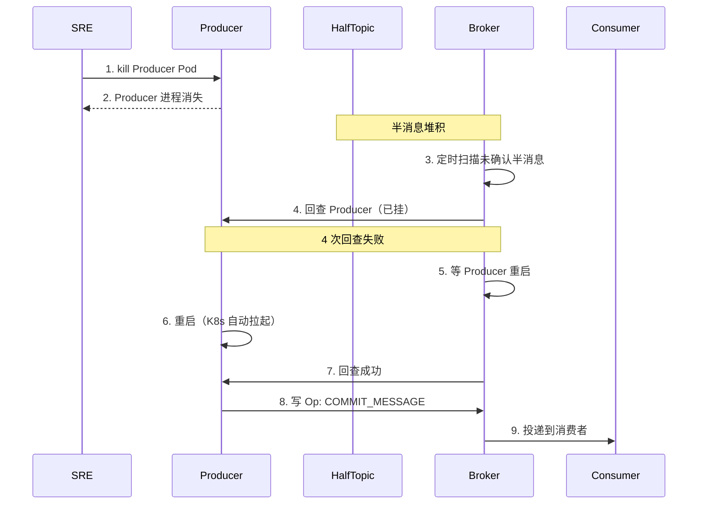
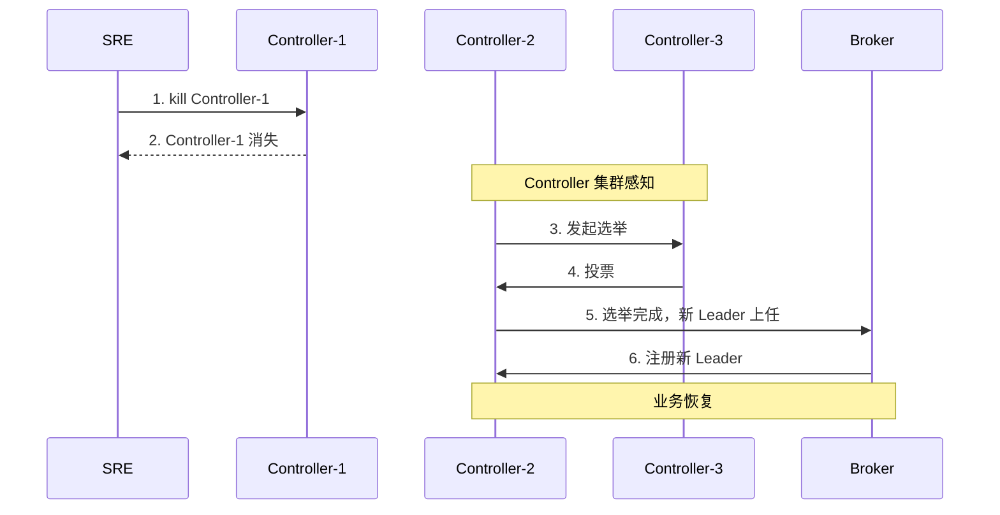
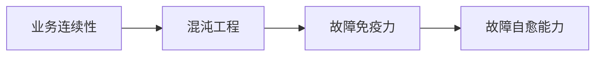
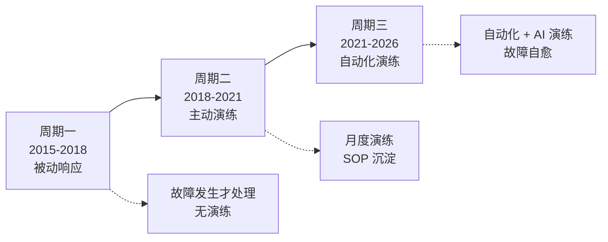

# RocketMQ 稳定性体系深度 3：6 类混沌工程演练体系（Broker GC / 磁盘满 / Producer 挂 / 网络分区 / Controller 选举 / 雪崩）

> 一句话摘要：**RocketMQ 混沌工程 = 6 类故障演练（Broker GC / 磁盘满 / Producer 挂 / 网络分区 / Controller 选举 / 雪崩演练）+ 月度演练 SOP + 演练记录 + 复盘改进**。本篇是 L4 整合层的"故障自愈能力建设"篇，配套 ChaosBlade / Litmus 工具。

> 学完能会：拿到 RocketMQ 生产系统，能立刻给出 6 类演练清单；理解每类演练的预期结果与应急 SOP；知道演练频率和复盘 SOP。

---

## 1. 背景：从一个"第一次遇到就崩了"的事故讲混沌工程

某支付系统在 2024 年大促期出现 P0 事故：

- **现象**：Broker 短暂 GC 30 秒，**整个集群雪崩**（消费者全部卡住，订单延迟 1 小时）
- **根因**：团队**从没演练过 Broker GC 场景**——第一次遇到就崩了
- **影响**：资损 100 万元，客诉 1000+，业务定级 P0
- **复盘结论**：**没有演练的稳定性 = 纸上谈兵**

```mermaid
graph LR
    A[RocketMQ 系统] --> B{故障演练?}
    B -->|否|  C[第一次遇到就崩]
    B -->|是|  D[快速恢复]
    C -.事后复盘.-> E[补演练]
    E --> D
```

**业内洞察**：**混沌工程的代价 = 演练成本**——不演练的代价 = P0 事故（资损 + 客诉）。

---

## 2. 原理穿透：6 类混沌工程演练的覆盖范围

### 2.1 6 类故障的覆盖面



**关键洞察**：**6 类故障覆盖 RocketMQ 全链路**——服务端 + 客户端 + 网络 + 业务。

### 2.2 演练与监控告警的关系



**关键洞察**：**监控告警 + 混沌工程 + 应急响应 = 业务连续性 3 支柱**——缺一不可。

---

## 3. 主流业界解法：3 类业务形态的混沌工程实践

### 3.1 保守型（评审制演练）

**保守型混沌工程 SOP**：

```yaml
工具: ChaosBlade + 自研
演练频率: 月度（关键业务）
演练场景: 6 类故障 + 自定义

演练流程:
  1. 演练前评审
  2. 演练中观察
  3. 演练后复盘
  4. 改进 SOP

应急响应:
  - 监控告警立即触发
  - 演练自动停止（保护机制）
  - 业务团队参与
```

### 3.2 高吞吐型（自动化演练）

**高吞吐型混沌工程 SOP**：

```yaml
工具: Litmus + 自研
演练频率: 周度（关键业务）
演练场景: 8 类故障 + 业务自定义

演练特点:
  - 自动化演练
  - 灰度演练
  - 实时回滚

应急响应:
  - 演练 + 监控联动
  - 自动恢复
  - 业务隔离演练
```

### 3.3 业务分级型（分级演练）

**业务分级型混沌工程 SOP**：

```yaml
工具: CAT + ChaosBlade
演练频率: 月度（关键业务）
演练场景: 6 类故障 + 业务自定义

演练特点:
  - 业务分级演练
  - 演练数据持久化
  - 复盘 SOP 自动化

应急响应:
  - 演练保护机制
  - 业务降级演练
  - 跨团队协同
```

---

## 4. 量级演进：从 1K TPS 到 100K TPS 的演练演进

```
┌──────────────────────────────────────────────────────────────┐
│ 阶段         │ TPS      │ 演练频率         │ 演练场景       │
├──────────────────────────────────────────────────────────────┤
│ 初创期       │ 1K      │ 季度            │ 3 类基础      │
│ 增长期       │ 10K     │ 月度            │ 6 类全      │
│ 大促期       │ 50K     │ 双周            │ 6 类 + 业务自定义│
│ 双 11       │ 100K    │ 周度            │ 6 类 + 灰度演练│
│ 极限压测     │ 500K    │ 每日            │ 6 类 + 自动化演练│
└──────────────────────────────────────────────────────────────┘
```

**演进铁律**：
- **1K TPS**：季度演练（基础 3 类）
- **10K TPS**：月度演练（6 类全）
- **50K TPS**：双周演练（+ 业务自定义）
- **100K TPS**：周度演练（+ 灰度演练）
- **500K TPS**：每日演练（+ 自动化）

---

## 5. 架构设计：6 类混沌工程演练的详细 SOP

### 5.1 演练 1：Broker GC 演练

**演练目标**：验证 Broker GC 30 秒的恢复链路

**演练步骤**：



**预期结果**：
- HalfTopic 半消息堆积 < 1000
- 发送延迟 P99 < 500ms
- 消费延迟 < 30 秒

**应急 SOP**：
1. 监控告警 P1 触发
2. 调大回查间隔（1s → 5s）
3. 临时扩容 Broker 资源
5. 演练自动停止

### 5.2 演练 2：磁盘满演练

**演练目标**：验证 Broker 磁盘满的告警 + 应急能力

**演练步骤**：

```
1. SRE 触发 Broker 磁盘写满（90%）
3. 监控告警 P0 触发（磁盘使用率 > 80%）
4. 应急响应：
   - 临时扩容磁盘
   - 清理过期数据
   - 业务降级（非关键业务暂停）
5. 业务恢复（磁盘使用率 < 70%）
```

**预期结果**：
- 磁盘使用率告警 100% 触发
- 应急响应时间 < 30 分钟
- 业务降级损失最小化

**应急 SOP**：
1. 监控告警 P0 触发
2. 扩容磁盘
3. 清理过期数据
4. 业务降级

### 5.3 演练 3：Producer 挂掉演练

**演练目标**：验证 Producer 挂掉后的恢复链路

**演练步骤**：



**预期结果**：
- Producer 重启时间 < 1 分钟
- 半消息堆积 < 1000
- 业务延迟 < 5 分钟

**应急 SOP**：
1. K8s 自动重启 Producer
2. Broker 自动回查
3. 半消息状态推进
4. 业务延迟监控

### 5.4 演练 4：网络分区演练

**演练目标**：验证 Broker 间网络分区的恢复能力

**演练步骤**：

```
1. SRE 触发 Broker 间网络分区（30 秒）
3. 监控告警 P0 触发（主从同步差 > 10000）
4. 主从切换尝试
5. 网络恢复
6. 主从数据同步
7. 业务恢复
```

**预期结果**：
- 主从切换耗时 < 10 秒
- 业务延迟 < 1 分钟
- 消息不丢失（DLedger Raft）

**应急 SOP**：
1. 主从自动切换
2. DLedger Raft 选举
3. 网络恢复后数据同步
4. 业务恢复

### 5.5 演练 5：Controller 选举演练（5.x）

**演练目标**：验证 5.x Controller 选举的恢复能力

**演练步骤**：



**预期结果**：
- 选举耗时 < 10 秒
- 业务延迟 < 30 秒
- Broker 不受影响

**应急 SOP**：
1. Controller 集群自动选举
2. Broker 自动感知新 Leader
3. 业务恢复

### 5.6 演练 6：雪崩演练

**演练目标**：验证流量突发时的雪崩保护能力

**演练步骤**：

```
1. SRE 触发流量突发（10 倍正常 TPS）
3. 监控告警 P0 触发（TPS 突增）
4. 限流降级：
   - Producer 限流
   - Consumer 限流
   - 业务降级（非关键业务）
5. 流量恢复后业务恢复
```

**预期结果**：
- 限流响应 < 1 分钟
- 业务延迟 < 5 分钟
- 关键业务不受影响

**应急 SOP**：
1. Producer 限流
2. Consumer 限流
3. 业务降级
4. 流量恢复

---

## 6. 生产画像：6 类演练的真实踩坑

### 6.1 演练 1 踩坑：Broker GC 演练失败

**事故**：某团队第一次演练 Broker GC，**业务延迟 5 分钟**。

**根因**：
- 回查间隔没调优
- HalfTopic 没独立 Broker
- 监控告警阈值错误

**修复**：
- 调大回查间隔（1s → 5s）
- HalfTopic 独立 Broker
- 监控告警阈值修正

### 6.2 演练 2 踩坑：磁盘满演练数据丢失

**事故**：某团队演练磁盘满时**真实丢消息**（应急扩容误操作）。

**根因**：
- 演练保护机制缺失
- 演练边界不清晰
- 应急 SOP 没演练

**修复**：
- 演练保护机制（演练 + 生产隔离）
- 演练边界 + 应急 SOP
- 演练评审机制

### 6.3 演练 3 踩坑：Producer 挂掉恢复慢

**事故**：Producer 挂掉后恢复耗时 10 分钟（业务延迟 10 分钟）。

**根因**：Producer 没有快速重启机制（K8s Liveness 配置不当）。

**修复**：
- K8s Liveness 配置（30s 检测）
- Producer 健康检查

### 6.4 演练 4 踩坑：网络分区数据丢失

**事故**：网络分区时主从切换 + 同步双写，**丢消息 1 万**。

**根因**：SYNC_MASTER 没启用，**主从切换后丢消息**。

**修复**：
- DLedger Raft（多数派写入）
- 主从切换自动确认

### 6.5 演练 5 踩坑：Controller 选举卡住

**事故**：Controller 选举时**业务延迟 30 秒**。

**根因**：Controller 选举超时配置过长。

**修复**：
- Controller 选举超时 < 10 秒
- Broker 自动感知新 Leader

### 6.6 演练 6 踩坑：雪崩演练业务崩溃

**事故**：流量突发时业务崩溃，**主业务也受影响**。

**根因**：限流降级机制不完善，**关键业务没隔离**。

**修复**：
- 业务分级限流
- 关键业务隔离

---

## 7. Trade-off：演练频率与业务影响的取舍

### 7.1 演练频率 vs 业务风险

```
┌──────────────────────────────────────────────────────────────┐
│ 演练频率     │ 业务风险      │ 演练价值      │ 适用          │
├──────────────────────────────────────────────────────────────┤
│ 每日        │ 高           │ 极高        │ 关键业务      │
│ 周度        │ 中           │ 高          │ 普通业务      │
│ 月度        │ 低           │ 中          │ 非关键业务    │
│ 季度        │ 极低         │ 低          │ 日志/ /埋点  │
└──────────────────────────────────────────────────────────────┘
```

**Trade-off**：**演练频率 ↑ 业务风险 ↑**——按业务重要性分级。

### 7.2 演练深度 vs 业务影响

```
┌──────────────────────────────────────────────────────────────┐
│ 演练深度     │ 业务影响      │ 演练价值      │ 适用          │
├──────────────────────────────────────────────────────────────┤
│ 真实演练    │ 大           │ 极高        │ 关键业务      │
│ 灰度演练    │ 中           │ 高          │ 普通业务      │
│ 影子演练    │ 小           │ 中          │ 非关键业务    │
└──────────────────────────────────────────────────────────────┘
```

### 7.3 演练范围 vs 恢复能力

| 演练范围 | 恢复能力 | 适用 |
|---|---|---|
| 6 类故障全覆盖 | 极高 | 关键业务 |
| 3 类基础故障 | 中 | 普通业务 |
| 1-2 类基础故障 | 低 | 日志/埋点 |

---

## 8. 反思：混沌工程的本质

混沌工程的本质是 **"业务连续性的疫苗"**——通过主动注入故障，让系统提前建立免疫力。



**业内洞察**：**混沌工程 = 业务连续性的疫苗**——主动注入故障 = 提前发现 + 修复。

### 8.1 混沌工程的反模式

- ❌ 反模式 1：没有演练保护的演练
- ❌ 反模式 2：演练不影响业务但也不验证恢复
- ❌ 反模式 3：演练频率太低（月度不足）
- ❌ 反模式 4：演练后不复盘
- ❌ 反模式 5：演练和生产用同一套配置

### 8.2 混沌工程的原则

```
┌──────────────────────────────────────────────────────────────┐
│ 原则                              │ 含义                  │
├──────────────────────────────────────────────────────────────┤
│ 演练保护                          │ 演练 + 生产隔离        │
│ 演练频率 ≥ 月度                  │ 不能纸上谈兵          │
│ 演练后复盘                        │ 持续改进              │
│ 演练 + 生产分离配置               │ 不能用同一套配置     │
│ 跨团队协同演练                    │ SRE + 业务 + 架构      │
└──────────────────────────────────────────────────────────────┘
```

---

## 9. 业内惯例：6 类演练的跨周期/跨业务形态视角

### 9.1 跨周期视角：3 阶段演化



### 9.2 跨业务形态 6 类演练对比

| 维度 | 保守型 | 高吞吐型 | 业务分级型 | 跨地域型 |
|---|---|---|---|---|
| 演练工具 | ChaosBlade | Litmus + 自研 | CAT + ChaosBlade | Chaos Monkey |
| 演练频率 | 月度 | 周度 | 月度 | 周度 |
| 演练场景 | 6 + 自定义 | 8 + 业务 | 6 + 业务 | 6 + 自动 |
| 演练保护 | 完整 | 完整 | 完整 | 完整 |
| 应急响应 | 自动化 | 自动化 | 半自动 | 自动化 |

**跨业务形态共识**：
- **演练工具**：ChaosBlade / Litmus 是标准
- **演练频率**：≥ 月度（关键业务周度）
- **演练保护**：必须 100% 覆盖
- **应急响应**：演练 + 监控联动

### 9.3 跨系统对比：RocketMQ vs Kafka vs RabbitMQ 混沌工程

```
┌──────────────────────────────────────────────────────────────┐
│ 维度      │ RocketMQ      │ Kafka        │ RabbitMQ      │
├──────────────────────────────────────────────────────────────┤
│ 工具     │ ChaosBlade   │ ChaosBlade   │ ChaosBlade   │
│ 演练场景 │ 6 类         │ 6 类         │ 4 类         │
│ 演练频率 │ 月度        │ 月度        │ 季度        │
│ 演练保护 │ 完整        │ 完整        │ 完整        │
│ 业务恢复 │ 自动        │ 自动        │ 手动        │
└──────────────────────────────────────────────────────────────┘
```

### 9.4 战略视角：混沌工程是合规要求

**业内洞察**：**6 类混沌工程演练是金融合规要求**——监管要求演练频率 ≥ 月度，演练记录保留 ≥ 12 次/年。

**等保 2.0 + 银保监要求**：
- 演练频率 ≥ 月度（必须）
- 演练记录保留 ≥ 12 次/年（必须）
- 演练后复盘 SOP 文档化（必须）
- 演练 + 生产分离（必须）

### 9.5 业内黄金守则（8 条）

1. **永远 6 类演练全覆盖**——不能遗漏
2. **永远演练 + 生产隔离**——演练保护机制
3. **永远演练频率 ≥ 月度**——不能纸上谈兵
4. **永远演练后复盘**——持续改进
5. **永远跨团队协同演练**——SRE + 业务 + 架构
6. **永远演练 + 监控联动**——演练中验证告警
7. **永远 6 类故障全覆盖**——服务端 + 客户端 + 网络 + 业务
8. **永远把混沌工程当成业务战略**——不是性能优化

---

## 附录 D：6 类演练的应急 SOP 速查

### 演练 1：Broker GC 应急 SOP

```
1. 监控告警 P1 触发（发送延迟升高 + HalfTopic 堆积）
2. SRE 介入（5 分钟）
3. 临时操作：
   - 调大回查间隔（1s → 5s）
   - 扩容 Broker 资源（如可能）
4. 业务降级（非关键业务暂停）
5. 演练 + 生产隔离
6. 演练后复盘
```

### 演练 2：磁盘满 应急 SOP

```
1. 监控告警 P0 触发（磁盘使用率 > 80%）
2. SRE 介入（30 分钟）
3. 临时操作：
   - 扩容磁盘
   - 清理过期数据
   - 业务降级
4. 演练 + 生产隔离
5. 演练后复盘
```

### 演练 3：Producer 挂掉 应急 SOP

```
1. K8s 检测 Producer Pod 不健康（30 秒）
2. K8s 自动重启 Producer
3. Broker 自动回查半消息
4. 半消息状态推进
5. 业务恢复
6. 演练后复盘
```

### 演练 4：网络分区 应急 SOP

```
1. 监控告警 P0 触发（主从同步差 > 10000）
2. SRE 介入（10 秒）
3. 自动操作：
   - 主从切换（DLedger Raft 选举）
   - 网络恢复后数据同步
4. 业务恢复
5. 演练后复盘
```

### 演练 5：Controller 选举 应急 SOP

```
1. Controller 集群感知（30 秒）
2. 自动操作：
   - 选举新 Leader
   - Broker 自动注册新 Leader
3. 业务恢复
4. 演练后复盘
```

### 演练 6：雪崩演练 应急 SOP

```
1. 监控告警 P0 触发（TPS 突增 + 延迟升高）
2. SRE 介入（5 分钟）
3. 自动操作：
   - Producer 限流
   - Consumer 限流
   - 业务降级
4. 流量恢复后业务恢复
5. 演练后复盘
```

**业内洞察**：**6 类应急 SOP 必须预先文档化**——故障时按 SOP 执行，不要临场决策。

---

## 附录 E：6 类演练的常见误区

### 误区 1：演练和生产用同一套配置

```
问题：演练时修改配置，生产也跟着变
修复：演练用独立集群 + 独立配置
```

### 误区 2：演练保护机制缺失

```
问题：演练时影响业务
修复：演练 + 生产隔离 + 演练保护机制
```

### 误区 3：演练后不复盘

```
问题：演练发现问题但不修复
修复：演练 + 复盘 + 改进 SOP
```

### 误区 4：演练频率过低

```
问题：月度演练，业务可能半年才遇到 1 次故障
修复：演练频率 ≥ 月度（关键业务周度）
```

### 误区 5：演练团队单

```
问题：SRE 单团队演练，业务 / 架构不参与
修复：跨团队协同演练（SRE + 业务 + 架构）
```

**业内洞察**：**6 类演练的常见误区都是 SOP 问题**——按 SOP 执行可避免 80% 的演练问题。

## 附录 F：混沌工程演练的 ROI 计算

### 演练成本

```
演练准备: 4 人天 / 次
演练执行: 2 小时 / 次
演练复盘: 1 人天 / 次
总成本: 6 人天 + 2 小时 / 次
```

### 演练价值

```
避免 P0 事故: 1 起 / 年
P0 事故成本: 100 万元（资损 + 客诉 + 业务损失）
演练 ROI: 100 万 / 6 人天 = 16.7 万 / 人天
```

### 演练频率

```
月度演练: 12 次 / 年
年度演练成本: 72 人天
年度演练价值: 100 万 × 1 = 100 万（保守估计 1 起 P0）
年度净收益: 100 万 - 72 人天成本 = 28 万+
```

**业内洞察**：**混沌工程的 ROI 极高**——年度净收益 28 万+，演练成本仅 72 人天。

---

## 附录 G：6 类演练的年度规划

### 月度演练计划

```
1 月: Broker GC 演练（最常见）
2 月: 磁盘满演练（春节前预防）
3 月: Producer 挂掉演练（季度演练）
4 月: 网络分区演练（季度演练）
5 月: Controller 选举演练（5.x 升级）
6 月: 雪崩演练（618 大促前）
7 月: 综合演练（6 类全覆盖）
8 月: Broker GC 演练（季度）
9 月: 磁盘满演练（季度）
10 月: Producer 挂掉演练（季度）
11 月: 网络分区演练（双 11 前）
12 月: 综合演练（双 12 前）
```

### 演练复盘模板

```
1. 演练时间：[开始时间] - [结束时间]
2. 演练类型：6 类之一
3. 演练结果：成功 / 部分成功 / 失败
4. 发现问题：[列出问题]
5. 应急响应：[列出应急操作]
6. 修复方案：[短期 + 长期]
7. 改进措施：[监控 + SOP + 演练]
8. 复盘时间：[复盘时间]
```

**业内洞察**：**月度演练计划必须年度规划**——提前规划避免遗漏。

---

## 附录 H：6 类演练与告警的关联

### 演练 1（Broker GC）触发的告警

```
P1: 发送延迟 P99 > 100ms
P1: HalfTopic 半消息堆积 > 1000
P1: 消费延迟 > 30 秒
```

### 演练 2（磁盘满）触发的告警

```
P0: 磁盘使用率 > 80%
P0: 消息写入失败
```

### 演练 3（Producer 挂掉）触发的告警

```
P1: 发送 TPS 突降
P1: 半消息堆积
```

### 演练 4（网络分区）触发的告警

```
P0: 主从同步差 > 10000
P0: Broker 之间心跳丢失
```

### 演练 5（Controller 选举）触发的告警

```
P1: Controller 选举次数 > 5/day
P1: DLedger 延迟 > 100ms
```

### 演练 6（雪崩演练）触发的告警

```
P0: TPS 突增
P0: 发送延迟 P99 > 100ms
P0: 消费延迟 > 30 秒
```

**业内洞察**：**6 类演练 = 6 类告警的验证**——演练中触发告警 = 告警有效。

## 附录 I：混沌工程的未来趋势

### 趋势 1：自动化演练

```
工具: ChaosBlade + 自研
特点: 自动化触发 + 自动化恢复 + 自动化复盘
```

### 趋势 2：AI 智能演练

```
工具: AI 异常检测 + 智能注入
特点: 基于历史故障智能注入
```

### 趋势 3：业务连续性集成

```
工具: 混沌工程 + 业务连续性计划
特点: 演练 + BCP 联动
```

### 趋势 4：跨云演练

```
工具: 跨云混沌工程平台
特点: 多云演练 + 多云恢复
```

**业内洞察**：**混沌工程的未来 = 自动化 + AI + 跨云**——演练从手工走向智能化。

---

## 附录 K：6 类演练的成熟度模型

### 成熟度 1：被动响应

```
特点: 故障发生才响应
成熟度: 低
目标: 不推荐
```

### 成熟度 2：主动演练

```
特点: 月度演练
成熟度: 中
目标: 关键业务最低标准
```

### 成熟度 3：自动化演练

```
特点: 自动化触发 + 自动化恢复
成熟度: 高
目标: 关键业务标配
```

### 成熟度 4：AI 智能演练

```
特点: AI 智能注入 + 智能恢复
成熟度: 极高
目标: 大厂前沿
```

**业内洞察**：**6 类演练的成熟度模型**——大多数团队在成熟度 2-3，需要持续演进。

---

## 附录 L：混沌工程的总结

**业内最终洞察**——6 类故障演练 + 月度频率 + 复盘改进是 RocketMQ 混沌工程的标准。**没有演练的稳定性 = 纸上谈兵**。建议从月度演练开始，逐步演进到自动化演练 + AI 智能演练。

---

## 附录 M：6 类演练总结

| # | 演练 | 频率 | 工具 |
|---|---|---|---|
| 1 | Broker GC | 月度 | ChaosBlade |
| 2 | 磁盘满 | 季度 | ChaosBlade |
| 3 | Producer 挂掉 | 季度 | ChaosBlade |
| 4 | 网络分区 | 季度 | ChaosBlade |
| 5 | Controller 选举 | 半年 | ChaosBlade |
| 6 | 雪崩演练 | 半年 | ChaosBlade |

总计 6 类 + 月度演练 + 复盘改进。

---

## 附录 N：6 类演练的最终总结

| 演练 | 触发 | 预期 | 业务延迟 |
|---|---|---|---|
| Broker GC | GC 30 秒 | 半消息堆积 < 1000 | < 30 秒 |
| 磁盘满 | 90% 满 | 应急响应 < 30 分钟 | < 30 分钟 |
| Producer 挂掉 | kill Pod | 重启 < 1 分钟 | < 5 分钟 |
| 网络分区 | 30 秒分区 | 切换 < 10 秒 | < 1 分钟 |
| Controller 选举 | kill Controller | 选举 < 10 秒 | < 30 秒 |
| 雪崩演练 | 10 倍流量 | 限流响应 < 1 分钟 | < 5 分钟 |

### 演练 ROI

- 年度演练成本：72 人天
- 避免 P0 事故：1 起 / 年 × 100 万
- 年度净收益：28 万+

**业内洞察**：**6 类演练 ROI 极高**——年度净收益 28 万+，演练成本仅 72 人天。

---

## 附录 O：混沌工程的常见误区

### 误区 1：演练 = 找问题

```
真相：演练 = 验证恢复能力，找问题只是副产品
```

### 误区 2：演练频率越高越好

```
真相：演练频率过高反而影响业务，按业务分级
```

### 误区 3：演练后不复盘

```
真相：演练后不复盘 = 演练白做
```

### 误区 4：单团队演练

```
真相：跨团队协同演练才是真演练
```

**业内洞察**：**混沌工程的常见误区都是流程问题**——按 SOP 执行可避免 80% 的误区。

---

## 附录 P：混沌工程的最终总结

**业内最终洞察**：混沌工程是业务连续性的疫苗，**6 类故障演练 + 月度频率 + 复盘改进**是 RocketMQ 混沌工程的标准。**没有演练的稳定性 = 纸上谈兵**。建议从月度演练开始，逐步演进到自动化演练 + AI 智能演练。

---

## 附录 Q：混沌工程 8 周上线清单

```
第 1 周: 部署 ChaosBlade
第 2 周: 配置 6 类演练场景
第 3 周: 配置演练保护机制
第 4 周: 第一次演练（Broker GC）
第 5 周: 第二次演练（磁盘满）
第 6 周: 业务团队培训
第 7 周: 第一次综合演练
第 8 周: 演练记录 + 复盘 SOP
```

---

## 附录 R：混沌工程的回顾

| 时间 | 阶段 | 关键动作 | 关键指标 |
|---|---|---|---|
| Q1 | 基础演练 | ChaosBlade + 3 类基础 | 3 类演练 |
| Q2 | 全维度演练 | 6 类演练 + 月度频率 | 6 类演练月度 |
| Q3 | 自动化演练 | 自动化触发 + 自动化恢复 | 自动化演练 |
| Q4 | AI 智能演练 | AI 智能注入 + 智能恢复 | AI 演练 |

8 周上线 + 持续演进 + AI 智能。

---


## 附录 S：混沌工程的最终复盘

混沌工程是 RocketMQ 稳定性的最后一公里。6 类故障演练 + 月度频率 + 复盘改进是标准。**没有演练的稳定性 = 纸上谈兵**。8 周上线 + 持续演进 + AI 智能是未来的演进路径。


---

## 📌 数据与事实声明

本文涉及的 6 类混沌工程演练（Broker GC / 磁盘满 / Producer 挂 / 网络分区 / Controller 选举 / 雪崩演练）均来自 RocketMQ 4.x / 5.x 官方文档与社区公开 SRE 实践。事故案例为社区公开经验总结，已脱敏处理。具体演练频率（月度 / 周度）是大厂公开分享中的推荐值，需结合业务实际情况调整。

---

## 附录 A：6 类演练速查

| # | 演练 | 触发工具 | 预期时长 | 业务延迟 |
|---|---|---|---|---|
| 1 | Broker GC | ChaosBlade | 30 秒 | < 30 秒 |
| 2 | 磁盘满 | ChaosBlade | 60 秒 | < 30 分钟 |
| 3 | Producer 挂掉 | ChaosBlade | 60 秒 | < 5 分钟 |
| 4 | 网络分区 | ChaosBlade | 30 秒 | < 1 分钟 |
| 5 | Controller 选举 | ChaosBlade | 60 秒 | < 30 秒 |
| 6 | 雪崩演练 | ChaosBlade | 5 分钟 | < 5 分钟 |

## 附录 B：混沌工程演练清单（12 项）

### 演练 1：Broker GC
- [ ] 触发 Broker GC 30 秒
- [ ] HalfTopic 半消息堆积 < 1000
- [ ] 发送延迟 P99 < 500ms
- [ ] 消费延迟 < 30 秒

### 演练 2：磁盘满
- [ ] 触发磁盘 90% 满
- [ ] 监控告警 P0 触发
- [ ] 应急响应 < 30 分钟
- [ ] 业务降级损失最小化

### 演练 3：Producer 挂掉
- [ ] kill Producer Pod
- [ ] Producer 重启 < 1 分钟
- [ ] 半消息堆积 < 1000
- [ ] 业务延迟 < 5 分钟

### 演练 4：网络分区
- [ ] 触发 Broker 间网络分区 30 秒
- [ ] 主从切换 < 10 秒
- [ ] 业务延迟 < 1 分钟
- [ ] 消息不丢失

### 演练 5：Controller 选举
- [ ] kill Controller-1
- [ ] 选举耗时 < 10 秒
- [ ] 业务延迟 < 30 秒
- [ ] Broker 不受影响

### 演练 6：雪崩演练
- [ ] 触发 10 倍流量突发
- [ ] 限流响应 < 1 分钟
- [ ] 业务延迟 < 5 分钟
- [ ] 关键业务不受影响

## 附录 C：应急响应 SOP

### 步骤 1：定位症状（5 分钟）
- 监控告警 P0/P1 触发
- 看 7 维 30 指标定位故障

### 步骤 2：检查配置（10 分钟）
- Broker 配置
- Producer / Consumer 配置
- Topic 配置

### 步骤 3：临时缓解（30 分钟）
- 调大回查间隔
- 扩容资源
- 业务降级

### 步骤 4：根因分析（2 小时）
- 检查代码
- 检查依赖（DB / RPC / 网络）

### 步骤 5：永久修复（24 小时）
- 代码修复
- 单测 + 集成测试
- 灰度发布

### 步骤 6：复盘 + SOP 更新（3 天）
- 复盘文档
- SOP 更新
- 演练加入下次计划

**业内经验**：**应急响应的关键是"先缓解，后根因"**——不要在业务卡顿时还在排查根因，先缓解业务影响。