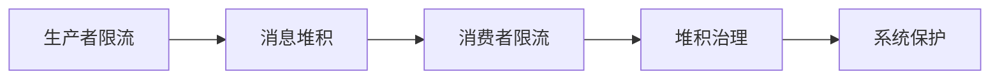
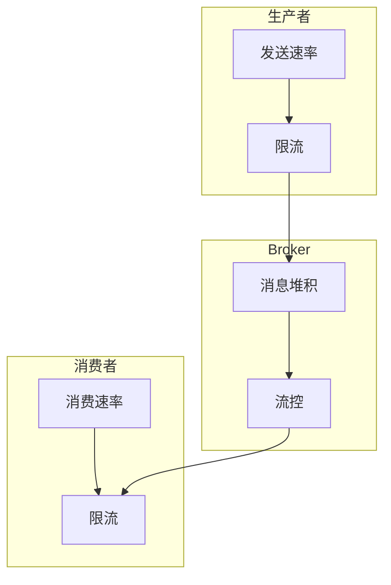

# RocketMQ 背压与流控深度

## 本文核心

**一句话摘要**：RocketMQ 背压 = 生产者限流 + 消费者限流 + 消息堆积治理，用流控防止系统雪崩。

**核心机制链**：背压模型 → 限流策略 → 堆积治理 → 消费者保护 → 生产实践





## 一、背压模型

### 1.1 什么是背压

背压 = 当消息生产速度 > 消费速度时，系统通过限流/降级/排队等方式保护自身。

```
生产速度 > 消费速度 → 消息堆积 → 背压触发 → 限流/降级
```

### 1.2 背压三要素

| 要素 | 说明 | 默认值 |
|---|---|---|
| **生产限流** | Producer 发送速率限制 | 0（不限制） |
| **消费限流** | Consumer 消费速率限制 | 0（不限制） |
| **堆积阈值** | 消息堆积告警阈值 | 10000 |

## 二、限流策略

### 2.1 生产者限流

```java
// 生产者限流配置
producer.setSendMsgTimeout(3000);
producer.setRetryTimesWhenSendFailed(3);
producer.setRetryTimesWhenSendAsyncFailed(2);
```

### 2.2 消费者限流

```java
// 消费者限流配置
consumer.setConsumeThreadMin(10);
consumer.setConsumeThreadMax(20);
consumer.setConsumeTimeout(15);
```

### 2.3 限流算法

| 算法 | 说明 | 适用场景 |
|---|---|---|
| **令牌桶** | 平滑限流 | 流量整形 |
| **漏桶** | 恒定速率 | 流量控制 |
| **计数器** | 固定窗口 | 简单限流 |
| **滑动窗口** | 精确限流 | 高精度场景 |

## 三、消息堆积治理

### 3.1 堆积发现

```bash
# 查看消息堆积
mqadmin consumerProgress -g ConsumerGroup

# 查看堆积详情
mqadmin topicRoute -t TopicName
```

### 3.2 堆积处理

| 方法 | 说明 | 适用场景 |
|---|---|---|
| **增加消费者** | 提升消费并发 | 消费能力不足 |
| **扩容 Broker** | 提升存储能力 | 存储不足 |
| **降级消费** | 跳过非关键消息 | 紧急恢复 |
| **批量消费** | 批量拉取消费 | 高吞吐场景 |

### 3.3 堆积预防

- 监控消费延迟（consumerLag）
- 设置堆积告警阈值
- 自动扩容消费者

## 四、消费者保护

### 4.1 消费端保护

| 保护机制 | 说明 | 配置 |
|---|---|---|
| **消费超时** | 消费耗时超过阈值 | consumeTimeout |
| **消费重试** | 消费失败重试 | retryTimes |
| **消费并发** | 并发消费线程数 | consumeThreadMin/Max |
| **消费批量** | 批量消费大小 | consumeBatchSize |

### 4.2 熔断降级

```java
// 消费端熔断
if (consumerLag > threshold) {
    // 触发熔断
    fallback();
}
```

## 五、生产实践

### 5.1 最佳实践

| 场景 | 策略 | 效果 |
|---|---|---|
| **大促流量** | 生产者限流 + 消费者扩容 | 不堆积 |
| **消费者故障** | 自动熔断 + 降级 | 不雪崩 |
| **Broker 故障** | 消费者重试 + 死信队列 | 不丢消息 |

### 5.2 监控指标

| 指标 | 说明 | 健康阈值 |
|---|---|---|
| 消费延迟 | consumerLag | < 1000 |
| 消费速率 | consumeTPS | > 0 |
| 堆积消息数 | pendingMessages | < 10000 |
| 消费耗时 | consumeLatency | < 100ms |

## 六、核心带走

- **核心一句话**：RocketMQ 背压 = 生产者限流 + 消费者限流 + 消息堆积治理
- **核心链条**：背压模型 → 限流策略 → 堆积治理 → 消费者保护 → 生产实践
- **金融推荐**：生产者限流 + 消费者扩容 + 堆积监控
- **哪里会坏**：消费延迟突增 → 消息堆积 → 雪崩

## 💡 实战提示（Tips）

- **限流阈值**：根据消费能力设置，避免过度限流
- **堆积监控**：consumerLag 是核心指标
- **消费者扩容**：水平扩展消费者提升吞吐
- **熔断策略**：消费者故障时自动熔断

## ❓ 你们可能会问（QA）

**Q1：生产者限流和消费者限流的区别？**
A：生产者限流 = 控制发送速率（防止消息过多）；消费者限流 = 控制消费速率（防止消费压力过大）。

**Q2：消息堆积怎么处理？**
A：增加消费者 / 扩容 Broker / 降级消费 / 批量消费。优先级：增加消费者 > 批量消费 > 降级消费。

**Q3：背压和限流的区别？**
A：背压 = 系统保护机制（自动触发）；限流 = 主动控制流量（手动配置）。

## 🤔 思考（开放问题/反思）

- **限流算法选择**：令牌桶 vs 漏桶 vs 滑动窗口？
- **自动扩缩容**：如何实现消费者自动扩缩容？
|- **背压传递**：背压如何从消费者传递到生产者？

## 七、跨周期视角

### 7.1 量级演进

| 量级 | 架构形态 | 红线指标 |
|---|---|---|
| < 100w QPS | 单集群 + NameServer | 可用性 99.9% |
| 100w-1000w QPS | 同城双活 + Controller | 可用性 99.99% |
| > 1000w QPS | 多集群 + 跨云容灾 | 可用性 99.999% |

### 7.2 5 年演进路线

```
2024: 单集群 + NameServer（起步）
2025: 同城双活 + Controller（5.x 升级）
2026: 异地多活 + 跨云容灾（成熟期）
```

## 八、Demo 验证点

### 8.1 部署验证

| 验证点 | 操作 | 预期结果 |
|---|---|---|
| 生产者限流 | 设置 sendMsgTimeout | 超时后重试 |
| 消费者扩容 | 增加 consumeThreadMax | 吞吐提升 |
| 堆积监控 | consumerLag > 10000 告警 | 及时发现 |

### 8.2 故障演练

| 演练场景 | 操作 | 预期结果 |
|---|---|---|
| Broker 故障 | 停 Master | Consumer 重连 |
| 网络分区 | 断 Producer-Broker | 生产者限流 |
| 消费者过载 | 模拟高消费延迟 | 触发熔断 |

## ⚖️ Trade-off（代价与反方案）

| 方案 | 优势 | 代价 | 反方案 |
|---|---|---|---|
| **生产者限流** | 防止消息过多 | 可能丢消息 | 不限流 |
| **消费者限流** | 防止消费压力过大 | 消费延迟增加 | 不限流 |
| **消息堆积治理** | 防止雪崩 | 需要监控 | 不治理 |
| **消费者扩容** | 提升吞吐 | 成本高 | 不扩容 |

## 📌 数据与事实声明

- 写于 2026-09-11，机制以 RocketMQ 5.x 为基准
- 量级红线为行业认知口径，决策需按实际业务压测校准
- 典型场景为公开技术社区高频案例的匿名化复述
- 工具口径以 RocketMQ 官方文档为准

## 📚 参考资料

- RocketMQ 官方文档：https://rocketmq.apache.org/docs/
- 《RocketMQ 技术内幕》耿雨春