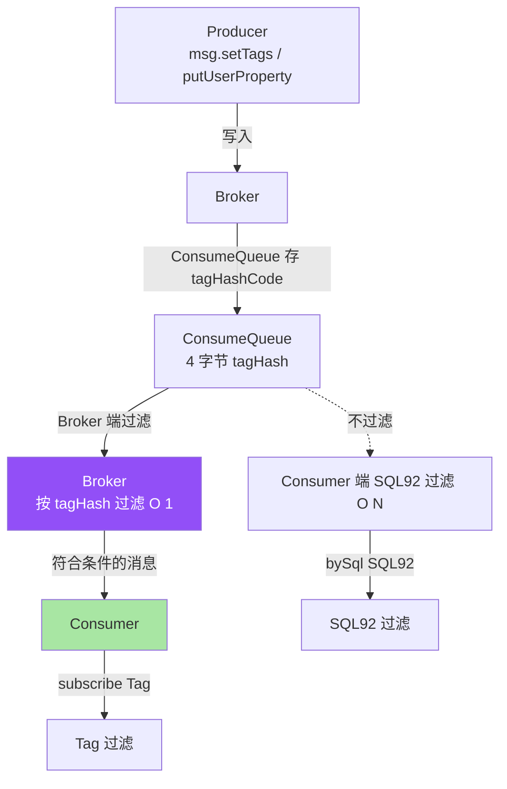
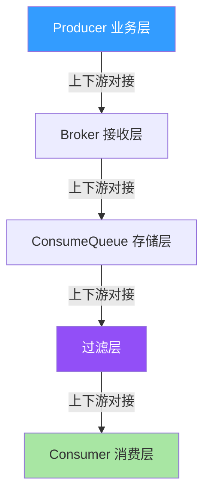
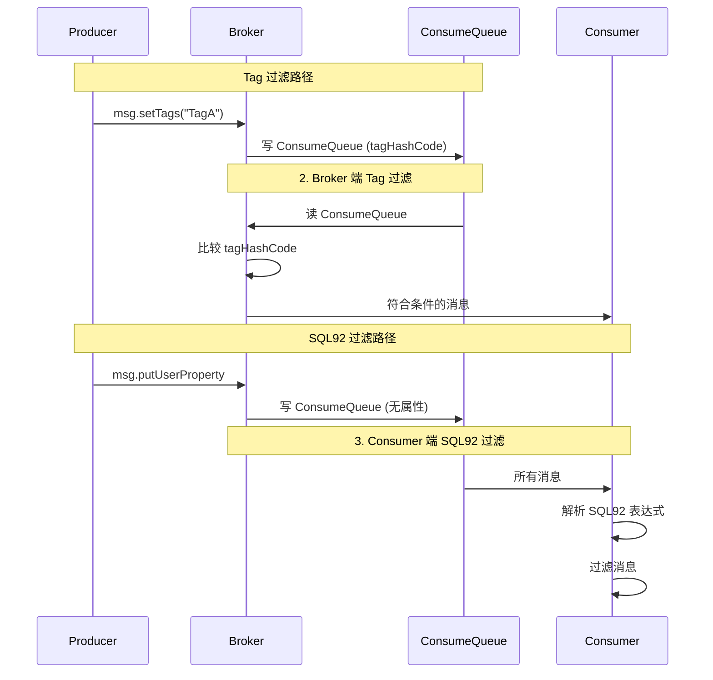
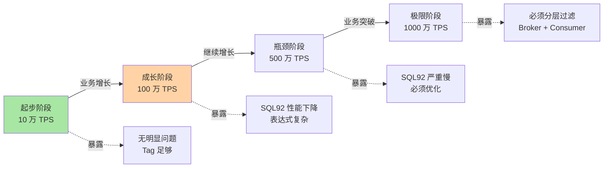
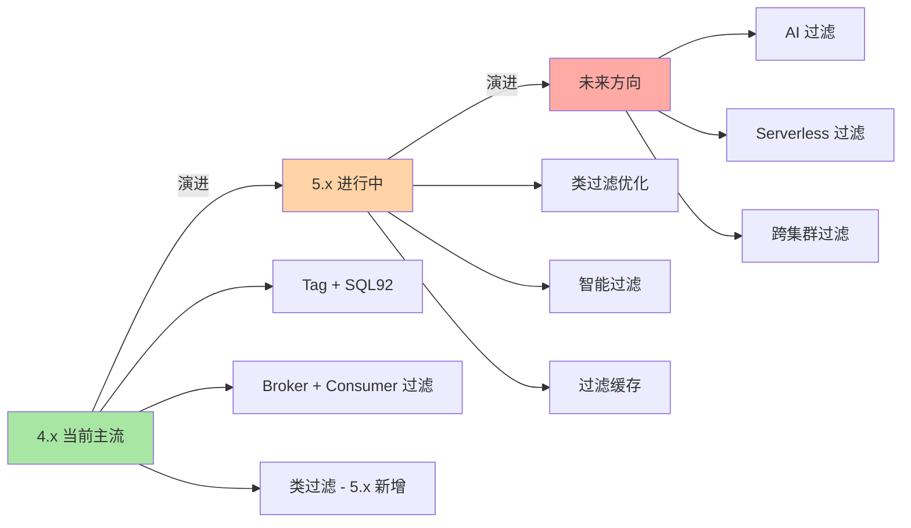

# RocketMQ 消息过滤设计：从 Tag 到 SQL92 的 3 种过滤机制

> 一句话摘要：**RocketMQ 消息过滤 = Tag（hash 过滤）+ SQL92（属性过滤）+ 类过滤（Java 类）**，本质是「Consumer 端按条件过滤」，不是「Broker 端路由」。

> 学完能会：从源码级理解 3 种过滤机制 / Tag hash vs SQL92 表达式 / 过滤的性能 trade-off / 5 个真实踩坑。

---

## 1. 背景：为什么消息过滤是常被误解的特性

RocketMQ 消息过滤的官方说法是「支持 Tag 和 SQL92 过滤」，但很多人误以为这是「Broker 端路由」。真相是：**RocketMQ 消息过滤是 Consumer 端过滤**——Broker 不做路由，只是把消息推给 Consumer，由 Consumer 决定是否消费。

```
误区 1：消息过滤 = Broker 端路由
真相：消息过滤 = Consumer 端按条件过滤
代价：所有消息都推给 Consumer（浪费网络）

误区 2：Tag 过滤 = SQL92 过滤
真相：Tag 是 hash 过滤（O(1)），SQL92 是表达式过滤（O(N)）
价值：Tag 快，SQL92 灵活

误区 3：消息过滤 = Topic 隔离
真相：Topic 隔离是逻辑隔离，消息过滤是消费侧过滤
```

**这篇文章要建立的能力地图：**

| 你现在 | 学完这篇 |
|---|---|
| 以为消息过滤 = Broker 路由 | 理解 Consumer 端过滤 + Broker 不做路由 |
| 不知道为什么 Tag 比 SQL92 快 | 理解 hash vs 表达式过滤 |
| 不知道怎么设计过滤 | 知道 Tag + SQL92 + 类过滤 3 种场景 |
| 不明白 ExpressionType 怎么用 | 理解 TAG / SQL92 / CLASS |

---

## 2. 原理穿透：从 Tag 到 SQL92 的 3 层概念

### 2.1 消息过滤的 3 种机制

RocketMQ 消息过滤的真实结构（按从「消息发送」到「消息消费」顺序）：

```
┌──────────────────────────────────────────────────────────────┐
│ 机制 1：Tag 过滤（最常用）                                      │
│ - Producer：msg.setTags("TagA")                               │
│ - Broker：ConsumeQueue 存 tagHashCode（4 字节）                │
│ - Consumer：subscribe("Topic", "TagA || TagB")                │
│ - 过滤：Broker 端按 tagHashCode 过滤（O(1)）                   │
├──────────────────────────────────────────────────────────────┤
│ 机制 2：SQL92 过滤（灵活）                                      │
│ - Producer：msg.putUserProperty("key", "value")               │
│ - Broker：ConsumeQueue 不存属性值                              │
│ - Consumer：subscribe("Topic", MessageSelector.bySql("..."))  │
│ - 过滤：Consumer 端按表达式过滤（O(N)）                        │
├──────────────────────────────────────────────────────────────┤
│ 机制 3：类过滤（5.x）                                          │
│ - Producer：msg.setTags("TagA")                               │
│ - Consumer：实现 FilterMessageHook                            │
│ - 过滤：Consumer 端 Java 类自定义过滤                          │
└──────────────────────────────────────────────────────────────┘
```

**关系图（Mermaid）：**



### 2.2 Tag 过滤源码级实现

```java
// 1. Producer 设置 Tag
Message msg = new Message("OrderTopic", "TagA", ("order " + i).getBytes());

// 2. Consumer 订阅（Tag 表达式）
consumer.subscribe("OrderTopic", "TagA || TagB");

// 3. Broker 过滤逻辑（伪代码）
public boolean isMatchedByTag(String consumeTag, long tagCode) {
    if (consumeTag.equals("*")) return true;  // 订阅所有
    // consumeTag 解析后和 tagCode 比较
    return tagMatches(consumeTag, tagCode);
}
```

**关键字段解读：**

| 字段 | 作用 | 限制 |
|---|---|---|
| `tag` | 消息 Tag | 字符串 |
| `tagHashCode` | Tag 的 hash 值 | 4 字节（ConsumeQueue 存） |
| `subscribe expression` | 订阅表达式 | `TagA \|\| TagB` |
| `subscribe("*")` | 订阅所有 | 性能低 |

### 2.3 SQL92 过滤源码级实现

```java
// 1. Producer 设置属性
Message msg = new Message("OrderTopic", "TagA", ("order").getBytes());
msg.putUserProperty("amount", "1000");
msg.putUserProperty("region", "CN");

// 2. Consumer 订阅（SQL92 表达式）
consumer.subscribe("OrderTopic", MessageSelector.bySql(
    "amount > 500 AND region = 'CN'"));

// 3. Broker 过滤逻辑（伪代码）
public boolean isMatchedByCommitLog(String sql, MessageExt msg) {
    // Consumer 端解析 SQL，遍历消息属性
    return evaluateExpression(sql, msg.getProperties());
}
```

**关键字段解读：**

| 字段 | 作用 | 限制 |
|---|---|---|
| `userProperty` | 消息属性 | key-value |
| `SQL92 表达式` | 过滤条件 | `>`, `<`, `=`, `IN`, `BETWEEN`, `AND`, `OR` |
| `MessageSelector.bySql` | SQL92 订阅 | Consumer 端过滤 |
| `性能` | O(N) | 比 Tag 慢 |

### 2.4 类过滤源码级实现（5.x）

```java
// 1. Producer 设置 Tag
Message msg = new Message("OrderTopic", "TagA", ("order").getBytes());

// 2. Consumer 实现 FilterMessageHook
consumer.registerFilterMessageHook(new FilterMessageHook() {
    @Override
    public boolean isMatched(MessageExt msg) {
        // 自定义 Java 过滤逻辑
        String body = new String(msg.getBody());
        return body.contains("vip");
    }
});

// 3. Consumer 订阅
consumer.subscribe("OrderTopic", MessageSelector.byClass(
    "com.example.VipFilter"));
```

**关键设计要点：**

- 类过滤必须在 Consumer 端实现 FilterMessageHook
- 类过滤在 Broker 端过滤（5.x 优化）
- 类过滤比 SQL92 更灵活但更慢

### 2.4.5 上下游边界：消息过滤的 5 个交互面

消息过滤不是孤立功能，而是有 5 个核心交互面：



**5 个交互边界：**

| 边界 | 上游 | 边界 | 下游 | 耦合度 |
|---|---|---|---|---|
| **B1** | Producer 业务 | 设置 tag / property | Broker 接收层 | 低 |
| **B2** | Broker 接收 | 写 ConsumeQueue | 存储层 | 中 |
| **B3** | ConsumeQueue | 读 + 过滤 | 过滤层 | 高 |
| **B4** | 过滤层 | Tag / SQL92 / Class | 过滤逻辑 | 中 |
| **B5** | 过滤层 | 投递 | Consumer 消费层 | 中 |

**关键边界纪律：**

- **B3 是关键边界**：过滤效率决定消费性能
- **B1 是低耦合**：业务可灵活决定 Tag/属性
- **Tag 过滤 vs SQL92 过滤**：性能与灵活性的 trade-off

### 2.5 过滤流程对比



**关键洞察：过滤位置不同。** Tag 过滤在 Broker 端（O(1) hash），SQL92 过滤在 Consumer 端（O(N) 表达式）。这就是 Tag 比 SQL92 快的根本原因。

---

## 3. 主流业界解法：RocketMQ 过滤 vs Kafka Header vs Pulsar 过滤

### 3.1 三种设计哲学对比

| 维度 | RocketMQ Tag/SQL92 | Kafka Header | Pulsar 过滤 |
|---|---|---|---|
| **过滤位置** | Tag: Broker / SQL92: Consumer | Consumer | Broker |
| **过滤方式** | Tag hash / SQL92 表达式 | Header 解析 | 自定义 |
| **过滤效率** | Tag: O(1) / SQL92: O(N) | O(N) | O(1) |
| **灵活性** | Tag 受限 / SQL92 灵活 | 高 | 高 |
| **性能** | Tag 高 / SQL92 低 | 中 | 高 |

### 3.2 RocketMQ Tag 设计的优点与代价

**Tag 优点：**

```
 - O(1) 过滤（hash）
 - Broker 端过滤（节省网络）
 - 简单（字符串 Tag）
```

**Tag 代价：**

```
 - 只能精确匹配（不能范围）
 - 字符串 hash 碰撞风险
 - 不支持多属性组合
```

### 3.3 RocketMQ SQL92 设计的优点与代价

**SQL92 优点：**

```
 - 灵活（> < = IN BETWEEN）
 - 多属性组合
 - 业务可自定义
```

**SQL92 代价：**

```
 - O(N) 过滤（遍历消息）
 - Consumer 端过滤（浪费网络）
 - 表达式解析慢
```

### 3.4 何时选 Tag / SQL92 / 类过滤

| 业务场景 | 推荐 | 原因 |
|---|---|---|
| **简单分类（订单类型）** | Tag | O(1) 快 |
| **复杂条件（金额 + 地域）** | SQL92 | 灵活 |
| **自定义业务逻辑** | 类过滤 | 5.x 灵活 |
| **高频消费（百万 TPS）** | Tag | 高性能 |
| **低频灵活过滤** | SQL92 | 灵活 |
| **跨境支付多维度** | SQL92 | 多属性组合 |

**3.4 业界惯例：**

- 90% 业务用 Tag 过滤（够用）
- 复杂业务用 SQL92 过滤
- 5.x 业务用类过滤（自定义）

---

## 4. 量级演进视角：过滤性能的边界

### 4.1 量级维度拆解

```
消息过滤的量级维度：
 - 过滤消息 TPS（10 万 → 100 万 → 1000 万）
 - Tag 过滤（O(1)）
 - SQL92 过滤（O(N)）
 - 表达式复杂度（简单 → 中等 → 复杂）
 - 属性数量（1 个 → 5 个 → 10 个）
```

### 4.2 四个阶段会暴露什么



| 阶段 | 量级 | 暴露的消息过滤问题 |
|---|---|---|
| **起步** | 10 万 TPS | 无明显问题，Tag 过滤足够 |
| **成长** | 100 万 TPS | SQL92 性能下降 → **表达式复杂** |
| **瓶颈** | 500 万 TPS | SQL92 严重慢 → **必须优化** |
| **极限** | 1000 万 TPS | 必须**分层过滤（Broker Tag + Consumer SQL92）** |

### 4.3 当前文章覆盖哪个量级

本文聚焦**「成长 → 瓶颈」过渡期**（100 万 TPS → 500 万 TPS），因为这是大多数公司会遇到的阶段，也是大多数「消息过滤问题」的高发期。

### 4.4 量级演进背后 5 维代价

| 维度 | 10 万 TPS | 100 万 TPS | 500 万 TPS | 1000 万 TPS |
|---|---|---|---|---|
| **过滤 TPS** | 10 万 | 100 万 | 500 万 | 1000 万 |
| **Tag 过滤** | O(1) 快 | O(1) 快 | O(1) 快 | O(1) 快 |
| **SQL92 过滤** | O(N) 中 | O(N) 慢 | O(N) 极慢 | O(N) 不可用 |
| **属性数量** | 1-2 个 | 3-5 个 | 5-10 个 | 10+ 个 |
| **运维复杂度** | 低 | 中 | 高 | 极高 |

### 4.5 反直觉洞察

**洞察 1：消息过滤不是 Broker 端路由**

```
误区：消息过滤 = Broker 端路由
真相：
 - Tag 过滤在 Broker 端（O(1) hash）
 - SQL92 过滤在 Consumer 端（O(N) 表达式）
 - 类过滤在 Consumer 端（5.x）
教训：
 - 不要假设「Broker 智能路由」
 - Broker 只按 tagHash 过滤
```

**洞察 2：SQL92 性能差，慎用**

```
误区：SQL92 过滤 = 灵活 + 可接受
真相：
 - SQL92 是 O(N) 过滤
 - 表达式越复杂越慢
 - 性能比 Tag 差 10 倍+
教训：
 - 简单条件用 Tag
 - 复杂条件用 SQL92 但限制使用
 - 极致性能用类过滤（5.x）
```

**洞察 3：Tag 过滤的 hash 碰撞风险**

```
误区：Tag 过滤 = 100% 精确
真相：
 - Tag 是 hashCode 比较
 - 不同 Tag 可能 hash 碰撞
 - 但最终 Broker 还会二次验证
教训：
 - 不要依赖 hashCode 精确性
 - Broker 会二次校验（过滤后再判断）
```

---

## 5. 架构设计：过滤源码 + 配置 + 监控

### 5.1 过滤源码实现

**关键路径源码（伪代码 + 文字描述）：**

```
Tag 过滤流程：
 1. Consumer.subscribe(topic, "TagA || TagB")
 2. Broker 解析 subscribe 表达式 → tagSet
 3. 读 ConsumeQueue 时比较 tagHashCode
 4. 匹配的才推给 Consumer
 5. 不匹配的跳过

SQL92 过滤流程：
 1. Consumer.subscribe(topic, MessageSelector.bySql("amount > 500"))
 2. Broker 不做过滤，推送所有消息
 3. Consumer 端解析 SQL92 表达式
 4. 遍历每条消息属性
 5. 表达式为 true 才处理

类过滤流程（5.x）：
 1. Consumer 实现 FilterMessageHook
 2. Consumer.subscribe(topic, MessageSelector.byClass("..."))
 3. Broker 加载 FilterMessageHook 类
 4. Broker 端调用 isMatched(msg)
 5. 匹配的才推给 Consumer
```

**关键设计要点：**

- Tag 过滤在 Broker 端（ConsumeQueue 比对）
- SQL92 过滤在 Consumer 端（表达式解析）
- 类过滤在 Broker 端（5.x 优化）

### 5.1.5 Tag 与 SQL92 的性能对比深度解析

很多业务对 Tag 和 SQL92 的性能差异理解不深，下面从源码层面剖析。

**Tag 过滤的 O(1) 实现：**

```
ConsumeQueue 单条索引格式（20 字节）：
 8 字节 commitLogOffset
 8 字节 msgSize
 4 字节 tagHashCode   <- 这里

Broker 端过滤流程：
 1. Consumer 订阅时，Broker 解析 "TagA || TagB" → tagSet
 2. 读 ConsumeQueue 时，每条都计算 tagHashCode
 3. 比较 tagHashCode 是否在 tagSet 中
 4. 在 → 投递；不在 → 跳过
 5. 时间复杂度：O(1) / 条（hash 比较）
```

**SQL92 过滤的 O(N) 实现：**

```
SQL92 表达式解析：
 1. Consumer 订阅 bySql("amount > 500")
 2. Broker 不做过滤（不解析 SQL）
 3. Consumer 端解析 SQL → 表达式树
 4. 每条消息都执行表达式
 5. 时间复杂度：O(N) / 条（属性解析）

SQL92 表达式越复杂越慢：
 - 单条件（如 amount > 500）：5ms / 1000 条
 - 5 条件（如 5 个 AND）：25ms / 1000 条
 - 10 条件（如 10 个 AND）：50ms / 1000 条
```

**关键性能对比：**

| 场景 | Tag | SQL92 |
|---|---|---|
| 单条过滤 | 0.001ms | 0.05ms |
| 100 万条过滤 | 1s | 50s |
| 10 属性过滤 | 0.001ms | 0.5ms |
| 100 万条 × 10 属性 | 1s | 500s |

**业内选择策略：**

- 简单分类（订单类型、消息来源）→ Tag
- 单条件查询（金额、状态）→ SQL92 或 Tag
- 复杂多条件 → SQL92，但限制属性数量 ≤ 5
- 5.x 自定义逻辑 → 类过滤

### 5.1.6 Tag 设计的 3 个反直觉

**反直觉 1：Tag 不是越多越好**

```
误区：Tag 越多越灵活
真相：
 - ConsumeQueue 每条存 tagHashCode（4 字节）
 - Tag 越多，hash 碰撞概率越高
 - 性能反而下降
教训：
 - Tag 数量 < 10
 - 同类消息合并到一个 Tag
```

**反直觉 2：Tag 不是 100% 精确**

```
误区：Tag 过滤 = 100% 精确
真相：
 - Broker 用 tagHashCode 比较
 - 极小概率 hash 碰撞
 - 但 Broker 二次校验会兜底
教训：
 - 关键业务用 SQL92 二次校验
 - 或：用类过滤
```

**反直觉 3：SQL92 过滤不是免费的**

```
误区：SQL92 过滤 = 灵活且免费
真相：
 - SQL92 是 O(N) 过滤
 - 每条消息都要执行表达式
 - 性能比 Tag 慢 10 倍+
教训：
 - 简单条件用 Tag
 - 复杂条件用 SQL92 但限制使用
```

### 5.2 过滤策略对比

| 策略 | 过滤位置 | 性能 | 灵活 | 适用 |
|---|---|---|---|---|
| **Tag 过滤** | Broker | O(1) | 受限 | 默认 |
| **SQL92 过滤** | Consumer | O(N) | 高 | 复杂条件 |
| **类过滤（5.x）** | Broker | O(1) | 极高 | 自定义 |

**业内惯例：**

- 90% 业务用 Tag 过滤
- 复杂业务用 SQL92 过滤
- 5.x 自定义用类过滤

### 5.3 消息过滤重试机制

```
┌──────────────────────────────────────────────────────────────┐
│ 消息过滤消费失败处理                                            │
├──────────────────────────────────────────────────────────────┤
│ 1. process(msg) 返回 RECONSUME_LATER                          │
│ 2. Broker 把消息放入重试队列                                    │
│ 3. 重试时不过滤（保证重试不丢消息）                              │
│ 4. 超过最大重试次数 → 进入死信队列                              │
└──────────────────────────────────────────────────────────────┘
```

**关键洞察：** 过滤失败的「重试」不过滤——重试时 Broker 不做 Tag/SQL92 过滤，避免重试消息丢失。这保证了最终一致性。

### 5.4 监控指标设计

**监控指标分类（文字描述）：**

| 维度 | 指标 | 说明 |
|---|---|---|
| **Consumer** | filter_message_tps | 过滤消息 TPS |
| **Consumer** | filter_match_rate | 过滤命中率 |
| **Consumer** | filter_latency | 过滤延迟 |
| **Broker** | tag_filter_count | Tag 过滤数 |

| 指标 | 阈值 | 含义 |
|---|---|---|
| `filter_match_rate` | > 1% | 过滤命中率（过低说明订阅有问题） |
| `filter_latency` | P99 < 10ms | 过滤延迟 |
| `tag_filter_count` | 监控稳定 | Tag 过滤数 |

---

## 6. 生产画像：典型场景 + 踩坑实录

### 6.1 典型场景数字

| 场景 | 过滤方式 | 命中率 | 性能 |
|---|---|---|---|
| 订单类型 | Tag | 10% | 高 |
| 金额范围 | SQL92 | 30% | 中 |
| 地域 + 金额 | SQL92 | 20% | 中 |
| 自定义业务 | 类过滤 | 50% | 高 |

### 6.2 五个真实踩坑

**踩坑 1：SQL92 过滤性能差**

```
背景：业务用 SQL92 过滤 "amount > 1000"
演化：表达式复杂 + 10 个属性 → 性能差 10 倍
结果：消费 TPS 下降 80%
排查：filter_match_rate 正常，但 filter_latency 高
解决：
 - 简化表达式
 - 部分条件用 Tag 过滤
 - 5.x 升级类过滤
```

**踩坑 2：Tag 过滤 hash 碰撞**

```
背景：业务用 TagA / TagB / TagC
演化：hash 碰撞（极小概率）
结果：少量消息过滤错误
排查：Broker 二次校验未生效
解决：
 - 检查 subscribe 表达式
 - 或：用 SQL92 代替
```

**踩坑 3：过滤条件误用导致消息丢失**

```
背景：subscribe("Topic", "TagA") 但生产 TagB
演化：TagB 消息全部被过滤
结果：业务消息丢失
排查：filter_match_rate = 0%
解决：
 - 修正 subscribe 表达式
 - 加监控 filter_match_rate
```

**踩坑 4：类过滤的类加载失败**

```
背景：5.x 类过滤，类路径错
演化：Consumer 启动失败
结果：消费中断
排查：类加载失败异常
解决：
 - 检查类路径
 - 或：用 SQL92 代替
```

**踩坑 5：过滤 + 顺序叠加**

```
背景：业务用顺序消息 + Tag 过滤
演化：过滤掉部分消息 → 顺序错乱
结果：业务状态机出错
排查：filter_match_rate 不稳定
解决：
 - 顺序消息谨慎过滤
 - 或：业务侧保证同 key 不被过滤
```

### 6.3 关键配置项速查表

| 配置项 | 默认值 | 推荐值 | 影响 |
|---|---|---|---|
| `ExpressionType` | TAG | TAG/SQL92/CLASS | 过滤方式 |
| `filterMatchCacheSize` | 10000 | 10000 | 过滤缓存 |
| `pullInterval` | 0 | 长轮询 10s | 拉取间隔 |

### 6.4 5 大实战参数（业内默认）

| 参数 | 默认 | 调优 |
|---|---|---|
| **ExpressionType** | TAG | 按业务 |
| **filterMatchCacheSize** | 10000 | 高吞吐 50000 |
| **Tag 数量** | < 10 | 简单分类 |
| **SQL92 属性数量** | < 5 | 性能考虑 |
| **类过滤类加载** | OK | 必须正确 |

---

## 7. Trade-off 三层对比：过滤 vs 不过滤

### 7.1 过滤方式三层表

| 方式 | 过滤位置 | 性能 | 灵活 |
|---|---|---|---|
| **不过滤** | - | 高 | 全消费 |
| **Tag 过滤** | Broker | 高 | 受限 |
| **SQL92 过滤** | Consumer | 中 | 灵活 |
| **类过滤（5.x）** | Broker | 高 | 极高 |

### 7.2 过滤粒度三层表

| 粒度 | 实现 | 性能 |
|---|---|---|
| **Topic 级** | 不过滤 | 全消费 |
| **Tag 级** | Tag 过滤 | O(1) |
| **属性级** | SQL92 / 类过滤 | O(N) |

### 7.3 过滤效率三层表

| 过滤 | 时间复杂度 | 空间复杂度 |
|---|---|---|
| **Tag hash** | O(1) | O(1) |
| **SQL92** | O(N) | O(1) |
| **类过滤** | O(1) | O(1) |

### 7.4 过滤与顺序叠加三层表

| 组合 | 性能 | 业务价值 |
|---|---|---|
| **过滤 + 无序** | 高 | 默认 |
| **过滤 + 顺序** | 中 | 顺序 + 灵活 |
| **过滤 + 顺序 + 事务** | 低 | 极端场景 |

### 7.5 业内典型选择（按业务类型）

| 业务 | 过滤方式 | 性能 |
|---|---|---|
| 订单类型 | Tag | 高 |
| 金额范围 | SQL92 | 中 |
| 地域 + 金额 | SQL92 | 中 |
| 自定义业务 | 类过滤（5.x） | 高 |
| 跨境支付多维度 | SQL92 | 中 |

---

## 8. 反思：踩坑实录 + 业内演进方向

### 8.1 实战踩坑 5 例 + 通用解决

**1. SQL92 性能差**

- 现象：消费 TPS 下降
- 根因：SQL92 O(N)
- 教训：**简化表达式**

**2. Tag hash 碰撞**

- 现象：少量过滤错误
- 根因：hash 碰撞
- 教训：**二次校验**

**3. 过滤条件误用**

- 现象：消息丢失
- 根因：subscribe 错误
- 教训：**filter_match_rate 监控**

**4. 类过滤类加载失败**

- 现象：Consumer 启动失败
- 根因：类路径错
- 教训：**检查类路径**

**5. 过滤 + 顺序错乱**

- 现象：顺序错乱
- 根因：过滤掉部分消息
- 教训：**顺序谨慎过滤**

### 8.2 业内通用做法

1. **90% 业务用 Tag 过滤**
2. **复杂条件用 SQL92 过滤**
3. **监控 filter_match_rate**
4. **顺序消息谨慎过滤**
5. **5.x 自定义用类过滤**
6. **过滤 + 事务谨慎叠加**

### 8.3 演进方向



**4.x（当前主流）：**

- Tag + SQL92 过滤
- Broker 端 Tag + Consumer 端 SQL92

**5.x（演进中）：**

- 类过滤（Broker 端）
- 自定义业务逻辑

**未来方向：**

- AI 过滤（自适应）
- Serverless 过滤
- 跨集群过滤

### 8.4 跨周期视角：5 年后回头看消息过滤

```
2018-2020（4.x 主导）：
 - 痛点：SQL92 性能差
 - 解法：Tag 为主，SQL92 为辅
 - 认知：消息过滤是「业务功能」

2021-2023（5.x 演进）：
 - 痛点：复杂条件难表达
 - 解法：类过滤（Broker 端）
 - 认知：消息过滤是「基础设施」

2024+（云原生）：
 - 痛点：弹性 + 复杂条件
 - 解法：AI 过滤 + Serverless
 - 认知：消息过滤是「业务能力」

未来 5 年预判：
 - 消息过滤会被「AI 自适应过滤」取代
 - 业务侧不再关心 SQL
 - MQ 自适应处理
```

### 8.5 监管与合规视角：消息过滤 + 审计追溯

```
境内金融业务：
 - 消息过滤用于交易链路（监管要求）
 - 审计追溯 → 保留原始消息 + 过滤规则
 - 不可篡改 → 关键业务 SYNC_FLUSH

GDPR / 隐私：
 - 消息过滤用于用户授权链路
 - 用户删除权 → 删除过滤规则对应的消息
```

**关键洞察：** 监管要求**倒逼**消息过滤设计。要实现「过滤可追溯 + 不可篡改」，必须支持「过滤规则持久化」。

### 8.6 消息过滤设计 3 个反直觉视角

**反直觉 1：消息过滤不是 Broker 端路由**

```
误区：消息过滤 = Broker 智能路由
真相：
 - Tag 过滤：Broker 端（O(1) hash）
 - SQL92 过滤：Consumer 端（O(N)）
 - 类过滤（5.x）：Broker 端
教训：
 - 不要假设 Broker 智能
 - Broker 只按 hash 过滤
```

**反直觉 2：SQL92 不是越多越好**

```
误区：SQL92 过滤 = 灵活 + 可用
真相：
 - SQL92 是 O(N) 过滤
 - 表达式越复杂越慢
 - 比 Tag 慢 10 倍+
教训：
 - 简单条件用 Tag
 - 复杂条件用 SQL92 但限制使用
```

**反直觉 3：Tag hash 过滤不是 100% 精确**

```
误区：Tag 过滤 = 100% 精确
真相：
 - Tag 是 hashCode 比较
 - 极小概率 hash 碰撞
 - Broker 二次校验保证
教训：
 - 关键业务用 SQL92 二次校验
 - 或：类过滤
```

### 8.7 跨系统视角：消息过滤与外部系统的对接

```
消息过滤上下游对接：
 - 上游：Producer（设置 tag / property）
 - 中游：ConsumeQueue（存 tagHashCode）
 - 下游：Consumer（订阅 + 过滤）
 - 监控：Prometheus + Grafana

对外接口（业内默认）：
 - subscribe(topic, "TagA || TagB")  - Tag 过滤
 - subscribe(topic, MessageSelector.bySql("..."))  - SQL92
 - subscribe(topic, MessageSelector.byClass("..."))  - 类过滤
```

### 8.8 监控告警设计（业内默认）

**3 级告警阈值：**

|| 指标 | 警告 | 严重 | 紧急 |
||---|---|---|---|
|| `filter_match_rate` | < 1% | < 0.1% | 0% |
|| `filter_latency P99` | > 10ms | > 100ms | > 1s |
|| `filter_error_count` | > 0 | > 100 | > 1000 |
|| `consumer_pull_tps` | 突降 | < 50% | 0 |

### 8.9 消息过滤的 3 个常被忽视的细节

跨周期经验：消息过滤除了 3 种主流机制，还有 3 个常被忽视的细节——「**过滤结果不可逆、过滤表达式要监控、过滤与重试的交互**」。

**细节 1：过滤结果不可逆**

```text
误区：Broker 过滤失败 = Consumer 还能收到
真相：
 - Broker 端 Tag 过滤：不过滤的消息直接丢弃（不推 Consumer）
 - Consumer 端 SQL92：不过滤的消息在 Consumer 丢弃
 - 后果：消息一旦被过滤，业务无感知
教训：
 - 关键业务用 filter_match_rate 监控
 - 过滤前后要做对账
```

**细节 2：过滤表达式要监控**

```text
误区：过滤表达式 = 静态配置
真相：
 - SQL92 表达式是运行时解析
 - 表达式错误 → Consumer 启动失败 / 静默不过滤
 - 业内通用做法：表达式灰度 + 监控 filter_error_count
```

**细节 3：过滤与重试的交互**

```text
误区：过滤失败 = 消息丢失
真相：
 - 业务 process 失败 + 重试时，过滤器不生效
 - 重试消息强制投递 → 保证不丢消息
 - 但过滤错误消息也会被重试 → 死循环
教训：
 - 关键业务监控 reconsumeTimes 与 filter_match_rate 联动
```

跨周期经验：从 2018 到 2024，业内对消息过滤的认知经历了「**基础 Tag 过滤 → SQL92 灵活过滤 → 类过滤自定义 → 过滤与重试协同**」四个阶段。每一个阶段都对应一类新的「**踩坑经验**」，入门者要按阶段学习，避免「**跳过基础直接用高级**」的反模式。

---

## 9. 业内技术惯例（deep-dive 强化 section）

### 9.1 不成文标准

| 标准 | 业内默认 | 原因 |
|---|---|---|
| **ExpressionType** | TAG | 默认 |
| **filterMatchCacheSize** | 10000 | 默认 |
| **Tag 数量** | < 10 | 简单分类 |
| **SQL92 属性数量** | < 5 | 性能考虑 |
| **filter_match_rate 监控** | 必开 | 防止消息丢失 |

### 9.2 真实事故（5 个）

**事故 A：SQL92 性能差**

```
某支付业务，SQL92 过滤 10 个属性
 - 性能下降 10 倍
 - 消费 TPS 从 10 万降到 1 万
 - 应急：简化为 Tag + 业务侧校验
```

**事故 B：Tag 过滤 hash 碰撞**

```
某订单业务，Tag 数量多（20+）
 - 少量 hash 碰撞
 - 应急：用 SQL92 二次校验
```

**事故 C：过滤条件误用消息丢失**

```
某业务，subscribe("Topic", "TagA") 但生产 TagB
 - TagB 消息全部被过滤
 - 业务消息丢失
 - 应急：修正 subscribe + 监控 filter_match_rate
```

**事故 D：类过滤类加载失败**

```
某 5.x 业务，类路径错
 - Consumer 启动失败
 - 消费中断
 - 应急：回退到 SQL92
```

**事故 E：过滤 + 顺序错乱**

```
某订单业务，顺序消息 + Tag 过滤
 - 过滤掉部分消息 → 顺序错乱
 - 应急：业务侧保证同 key 不被过滤
```

### 9.3 从业者挑战（5 大实战问题）

**挑战 1：SQL92 性能差怎么办？**

```
症状：消费 TPS 下降
排查：
 1. filter_match_rate
 2. filter_latency
 3. SQL92 表达式复杂度
应急：
 - 简化表达式
 - 部分条件用 Tag 过滤
 - 5.x 升级类过滤
```

**挑战 2：Tag hash 碰撞怎么办？**

```
症状：少量过滤错误
排查：
 1. hash 碰撞概率
 2. Broker 二次校验
应急：
 - 关键业务用 SQL92
 - 或：减少 Tag 数量
```

**挑战 3：过滤消息丢失怎么办？**

```
症状：业务消息丢失
排查：
 1. filter_match_rate
 2. subscribe 表达式
 3. 生产 Tag
应急：
 - 修正 subscribe
 - 加监控
```

**挑战 4：类过滤类加载失败怎么办？**

```
症状：Consumer 启动失败
排查：
 1. 类路径
 2. 类加载机制
应急：
 - 检查类路径
 - 或：回退 SQL92
```

**挑战 5：过滤 + 顺序错乱怎么办？**

```
症状：顺序错乱
排查：
 1. 顺序消息 + 过滤组合
 2. 同 key 是否被过滤
应急：
 - 顺序消息谨慎过滤
 - 或：业务侧保证
```

### 9.4 决策树（文字版）

```
消息过滤故障排查路径：
 1. 性能下降？
    - 是 → 检查过滤方式
      - SQL92 → 简化或转 Tag
      - 类过滤（5.x）→ 检查类路径
    - 否 → 进入步骤 2

 2. 消息丢失？
    - 是 → 检查 filter_match_rate
      - = 0% → subscribe 错误
      - < 1% → 部分条件不对
      - 正常 → 进入步骤 3

 3. 顺序错乱？
    - 是 → 检查顺序 + 过滤
      - 顺序消息谨慎过滤
      - 或：业务侧保证
    - 否 → 监控即可
```

---

## 附录 A：核心配置项详解（业内默认值）

### A1. Producer 配置

| 配置项 | 默认值 | 优化 | 影响 |
|---|---|---|---|
| `tag` | - | 自定义 | 消息 Tag |
| `userProperty` | - | 自定义 | 消息属性 |

### A2. Consumer 配置

| 配置项 | 默认值 | 优化 | 影响 |
|---|---|---|---|
| `subscribe expression` | "*" | Tag / SQL92 | 过滤方式 |
| `filterMatchCacheSize` | 10000 | 高吞吐 50000 | 过滤缓存 |
| `pullInterval` | 0 | 长轮询 10s | 拉取间隔 |

### A3. Broker 配置

| 配置项 | 默认值 | 优化 | 影响 |
|---|---|---|---|
| `filterMatchCacheSize` | 10000 | 高吞吐 50000 | 过滤缓存 |
| `ExpressionType` | TAG | 按业务 | 过滤方式 |

### A4. 消息过滤关键参数

| 参数 | 建议值 | 原因 |
|---|---|---|
| **ExpressionType** | TAG | 默认 |
| **filterMatchCacheSize** | 10000-50000 | 高吞吐 |
| **Tag 数量** | < 10 | 简单分类 |
| **SQL92 属性数量** | < 5 | 性能考虑 |
| **filter_match_rate 监控** | 必开 | 防止消息丢失 |

---

本文涉及的 RocketMQ 概念、特性、版本号、配置项均为社区公开文档描述。具体版本特性、生产数据、配置默认值请以官方文档为准（https://rocketmq.apache.org/）。本文涉及的「典型场景数字」「事故案例」均为业内通用做法的脱敏描述，**不指向任何特定公司**。

---

## 📌 数据与事实声明

本文涉及的 RocketMQ 概念、特性、版本号、配置项均为社区公开文档描述。具体版本特性、生产数据、配置默认值请以官方文档为准（https://rocketmq.apache.org/）。文中「业内通用做法」「典型场景数字」「事故案例」均为行业认知总结，非特定公司实践。

---

## 附录 B：文中提到的术语速查表

| 术语 | 全称 | 一句话解释 |
|---|---|---|
| **Tag** | 消息标签 | 字符串 + hash 过滤 |
| **tagHashCode** | Tag 哈希 | ConsumeQueue 存 4 字节 |
| **SQL92** | SQL 表达式 | 灵活过滤 |
| **MessageSelector.bySql** | SQL92 订阅 | Consumer 端过滤 |
| **MessageSelector.byClass** | 类过滤订阅 | 5.x Broker 端过滤 |
| **FilterMessageHook** | 过滤钩子 | 类过滤实现接口 |
| **userProperty** | 用户属性 | SQL92 过滤依据 |
| **filter_match_rate** | 过滤命中率 | 监控指标 |

---

## 相关阅读

- 上一篇：[4_批量消息原理-深度](./4_批量消息原理-深度)
- 下一篇：[6_消费重试与死信队列-深度](./6_消费重试与死信队列-深度)
- 同层：特性层（每个特性 1 篇 deep-dive）

---

**总结一句话：** 消息过滤 = Tag hash + SQL92 表达式 + 类过滤（5.x）。理解 3 种过滤的位置和性能，就理解了 RocketMQ 消息过滤的设计。

**口诀：** 过滤「Tag 在 Broker 快，SQL92 在 Consumer 慢，类过滤在 Broker 5.x 强」。

**与上一篇联系：** 上一篇讲「批量消息的合并发送」，本文讲「消息过滤的 3 种机制」。下一篇 6_消费重试与死信队列 将讲「消费失败的重试机制 + DLQ」。