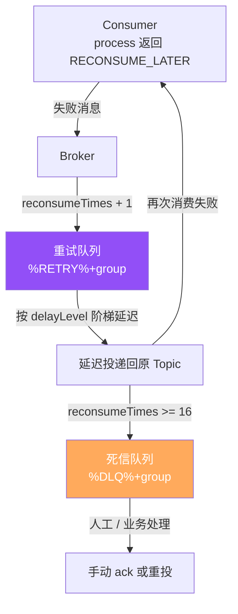
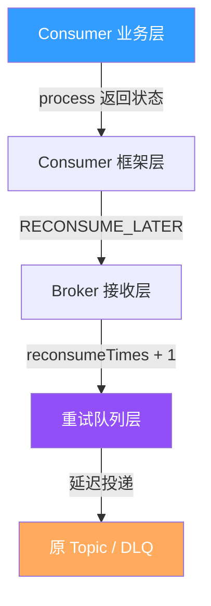
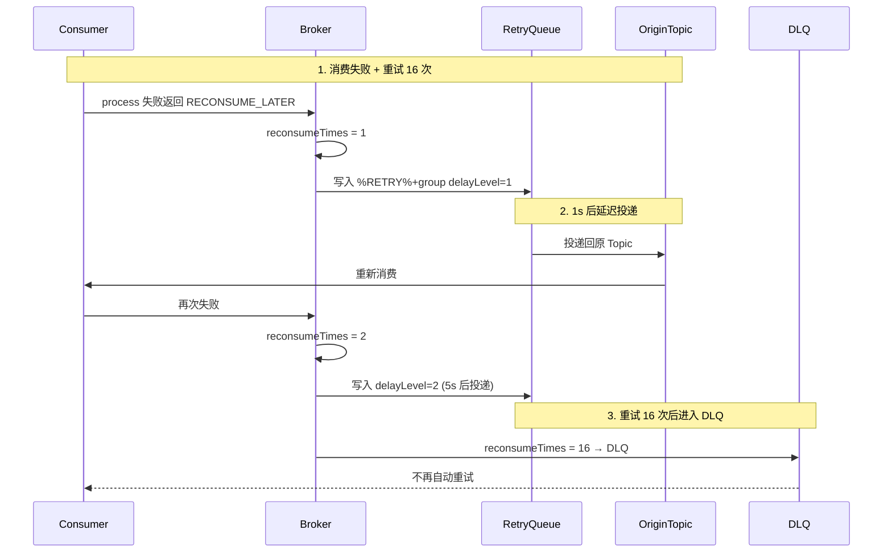
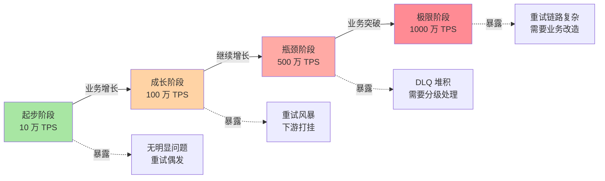
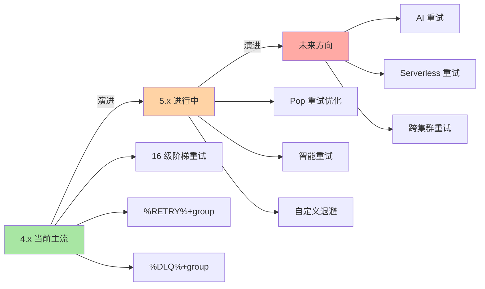
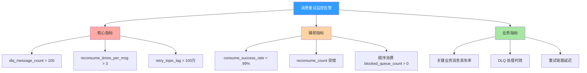

# RocketMQ 消费重试与死信队列：从 RECONSUME_LATER 到 DLQ 的 16 级阶梯

> 一句话摘要：**RocketMQ 消费重试 = RECONSUME_LATER 状态返回 + 重试队列（%RETRY%+group）+ 16 级阶梯退避 + 死信队列（%DLQ%+group）兜底**。本质是「失败消息先进入重试队列阶梯重试，超过 16 次后再转入 DLQ」，不是「失败就丢弃」。

> 学完能会：从源码级理解消费重试机制 / 重试队列 vs 死信队列 / 16 级退避算法 / 重试与顺序的交互 / 5 个真实踩坑。

---

## 1. 背景：为什么消费重试是常被误解的特性

RocketMQ 消费重试的官方说法是「消费失败会自动重试」，但很多人误以为这是「无限重试直到成功」。真相是：**RocketMQ 消费重试是「有限重试 + 阶梯退避 + 死信兜底」**——重试 16 次后转入死信队列（DLQ），不再无限重试。

```
误区 1：消费重试 = 无限重试
真相：消费重试 = 阶梯退避 16 次 + DLQ 兜底
代价：超过 16 次的消息进入 DLQ，需要人工 / 业务侧处理

误区 2：重试消息 = 原始消息
真相：重试消息进入 %RETRY%+ConsumerGroup（新 Topic）
价值：原 Topic 不被重试消息阻塞

误区 3：DLQ = 异常消息丢弃
真相：DLQ = 单独 Topic 持久化 + 监控告警 + 人工处理
```

**这篇文章要建立的能力地图：**

|| 你现在 | 学完这篇 |
|---|---|---|
| 以为消费重试 = 无限重试 | 理解 16 级阶梯退避 + DLQ 兜底 |
| 不知道为什么重试有阶梯间隔 | 理解延迟退避（1s/5s/10s/.../2h）|
| 不知道怎么监控 DLQ | 知道 3 级告警阈值 + 5 步排查法 |
| 不明白 %RETRY%+group 怎么工作 | 理解重试队列是独立 Topic |

---

## 2. 原理穿透：从 RECONSUME_LATER 到 %DLQ%+group

### 2.1 消费重试的 3 层概念

RocketMQ 消费重试的真实结构（按从「消费失败」到「DLQ 兜底」顺序）：

```
┌──────────────────────────────────────────────────────────────┐
│ Layer 1：Consumer 端                                          │
│ - listener.process(msg) 返回 RECONSUME_LATER                  │
│ - 标记消息「消费失败」→ 返回给 Broker                          │
│ - 记录 reconsumeTimes + 1                                     │
├──────────────────────────────────────────────────────────────┤
│ Layer 2：Broker 重试队列                                       │
│ - 消息写入 %RETRY%+ConsumerGroup（新 Topic）                   │
│ - 按 reconsumeTimes 算 delayLevel（16 级阶梯）                 │
│ - 延迟时间到了 → 投递回原 Topic                                │
├──────────────────────────────────────────────────────────────┤
│ Layer 3：死信队列 DLQ                                          │
│ - reconsumeTimes >= 16 → 消息写入 %DLQ%+ConsumerGroup          │
│ - 不再自动重试，需人工 / 业务侧处理                             │
│ - 监控告警 + 手动重投                                          │
└──────────────────────────────────────────────────────────────┘
```

**关系图（Mermaid）：**



### 2.2 RECONSUME_LATER 源码级实现

```java
// 1. Consumer 注册监听器（顺序消费）
consumer.registerMessageListener(new MessageListenerOrderly() {
    @Override
    public ConsumeOrderlyStatus consumeMessage(
            List<MessageExt> msgs, ConsumeOrderlyContext context) {
        for (MessageExt msg : msgs) {
            try {
                // 业务处理
                process(msg);
                return ConsumeOrderlyStatus.SUCCESS;
            } catch (Exception e) {
                // 失败 → RECONSUME_LATER
                context.setAutoCommit(false);  // 不提交 offset
                return ConsumeOrderlyStatus.SUSPEND_CURRENT_QUEUE_A_MOMENT;
            }
        }
        return ConsumeOrderlyStatus.SUCCESS;
    }
});

// 2. 并发消费（推荐方式）
consumer.registerMessageListener(new MessageListenerConcurrently() {
    @Override
    public ConsumeResult consumeMessage(
            List<MessageExt> msgs, ConsumeConcurrentlyContext context) {
        for (MessageExt msg : msgs) {
            try {
                process(msg);
            } catch (Exception e) {
                return ConsumeResult.RECONSUME_LATER;
            }
        }
        return ConsumeResult.SUCCESS;
    }
});
```

**关键字段解读：**

|| 字段 | 作用 | 错误用法 |
|---|---|---|
| `RECONSUME_LATER` | 失败状态 | 吞掉异常不返回 |
| `reconsumeTimes` | 已重试次数 | 业务侧自行管理 |
| `%RETRY%+group` | 重试队列 Topic | 与原 Topic 混用 |
| `%DLQ%+group` | 死信队列 Topic | 忽略监控 |

### 2.3 16 级阶梯退避源码级实现

```java
// RocketMQ 默认 16 级重试间隔（4.x）
private String messageDelayLevel = "1s 5s 10s 30s 1m 2m 3m 4m 5m 6m 7m 8m 9m 10m 20m 30m 1h 2h";

// 重试时按 reconsumeTimes 选 delayLevel
public int getDelayLevel(int reconsumeTimes) {
    if (reconsumeTimes < 0) return 0;
    // 默认 16 级，超过 16 次进入 DLQ
    if (reconsumeTimes >= 16) return -1;  // DLQ 标记
    return reconsumeTimes + 1;  // 1-16
}
```

**关键字段解读：**

|| 重试次数 | delayLevel | 延迟时间 |
|---|---|---|
| 第 1 次 | 1 | 1s |
| 第 2 次 | 2 | 5s |
| 第 3 次 | 3 | 10s |
| 第 4 次 | 4 | 30s |
| 第 5 次 | 5 | 1m |
| 第 6-15 次 | 6-15 | 2m-30m |
| 第 16 次 | 16 | 1h |
| 第 17+ 次 | -1 | DLQ（不再重试）|

### 2.4 类过滤源码级实现（重试视角）

```java
// Broker 端：消费失败后的处理流程
public ConsumeRequest handleConsumeResult(ConsumeRequest request) {
    ConsumeResult result = request.getConsumeResult();
    if (result == ConsumeResult.RECONSUME_LATER) {
        // 1. reconsumeTimes + 1
        int reconsumeTimes = msg.getReconsumeTimes() + 1;
        msg.setReconsumeTimes(reconsumeTimes);
        
        // 2. 判断是否进入 DLQ
        if (reconsumeTimes >= maxReconsumeTimes) {
            // 写入 %DLQ%+group
            sendToDLQ(msg);
        } else {
            // 写入 %RETRY%+group，按 delayLevel 延迟
            int delayLevel = getDelayLevel(reconsumeTimes);
            sendToRetryQueue(msg, delayLevel);
        }
    }
    return result;
}
```

### 2.4.5 上下游边界：消费重试的 5 个交互面

消费重试不是孤立功能，而是有 5 个核心交互面：



**5 个交互边界：**

|| 边界 | 上游 | 边界 | 下游 | 耦合度 |
|---|---|---|---|---|
| **B1** | Consumer 业务 | 返回 SUCCESS/RECONSUME_LATER | Consumer 框架 | 低 |
| **B2** | Consumer 框架 | 标记 reconsumeTimes | Broker 接收 | 中 |
| **B3** | Broker 接收 | 写入重试队列 | 重试队列层 | 中 |
| **B4** | 重试队列 | 延迟投递回原 Topic | 原 Topic | 高 |
| **B5** | 重试队列 | reconsumeTimes >= 16 | DLQ | 中 |

**关键边界纪律：**

- **B4 是关键边界**：延迟投递的准确性决定重试间隔
- **B1 是低耦合**：业务可灵活决定返回 SUCCESS / RECONSUME_LATER
- **重试 vs 顺序**：顺序消费 + 重试会阻塞 Queue（参见顺序消息篇）

### 2.5 重试流程对比



**关键洞察：阶梯退避 + DLQ 兜底。** 重试间隔从 1s → 5s → 10s → ... → 2h，避免「**重试风暴**」打挂下游服务；超过 16 次进入 DLQ，保证消息「**不丢失 + 可追溯**」。

---

## 3. 主流业界解法：RocketMQ 重试 vs Kafka 重试 vs RabbitMQ 重试

### 3.1 三种设计哲学对比

|| 维度 | RocketMQ | Kafka | RabbitMQ |
|---|---|---|---|---|
| **重试机制** | 16 级阶梯 + DLQ | 无限重试 + 偏移重置 | 即时重试 + DLX |
| **退避算法** | 阶梯（1s/5s/10s/...）| 无（手动）| 指数（可配置）|
| **DLQ 实现** | %DLQ%+group | 自定义 Topic | Dead Letter Exchange |
| **监控** | reconsumeTimes + DLQ count | offset lag | DLX 消息数 |
| **业务侵入** | 低 | 高 | 中 |

### 3.2 RocketMQ 重试设计的优点与代价

**RocketMQ 优点：**

```
 - 16 级阶梯退避（避免重试风暴）
 - 自动 DLQ 兜底（不丢消息）
 - 业务侵入低（返回 RECONSUME_LATER 即可）
 - 与顺序消息兼容（顺序消费阻塞 Queue）
```

**RocketMQ 代价：**

```
 - 16 次后强转 DLQ（业务可能希望更多次数）
 - 阶梯间隔固定（无法自定义指数退避）
 - DLQ 需要单独监控 + 人工处理
```

### 3.3 Kafka 重试设计的优点与代价

**Kafka 优点：**

```
 - 重试次数自定义（无限）
 - 偏移重置灵活（按 offset 重新消费）
 - 与 Exactly-Once 集成（Kafka 2.5+）
```

**Kafka 代价：**

```
 - 无内置 DLQ（需自定义 Topic）
 - 无自动退避（需业务侧 sleep）
 - 业务侵入高（要管理 offset）
```

### 3.4 何时选 RocketMQ / Kafka / RabbitMQ（业内决策）

|| 业务场景 | 推荐 | 原因 |
|---|---|---|---|
| **业务消息 + 强事务** | RocketMQ | 16 级重试 + 自动 DLQ |
| **日志流 + 高吞吐** | Kafka | 自定义重试 + Exactly-Once |
| **企业集成 + 多协议** | RabbitMQ | DLX + 灵活路由 |
| **金融 / 跨境支付** | RocketMQ | 重试 + DLQ 完整链路 |
| **消息积压 + 弹性消费** | Kafka | offset 重置灵活 |
| **5.x 云原生** | RocketMQ | Pop 消费 + 重试优化 |

**3.4 业界惯例：**

- 90% 业务消息用 RocketMQ（重试 + DLQ 完整）
- 日志 / 埋点用 Kafka（极致吞吐 + 自定义重试）
- 关键业务用 RocketMQ（重试 + DLQ + 顺序）

---

## 4. 量级演进视角：重试 16 次的边界

### 4.1 量级维度拆解

```
消费重试的量级维度：
 - 消费 TPS（10 万 → 100 万 → 500 万）
 - 重试次数（1 → 5 → 16 → DLQ）
 - 阶梯延迟（1s → 5s → 10s → ... → 2h）
 - DLQ 数量（0 → 100 → 10000）
 - 业务异常率（0.01% → 0.1% → 1%）
```

### 4.2 四个阶段会暴露什么



|| 阶段 | 量级 | 暴露的重试问题 |
|---|---|---|
| **起步** | 10 万 TPS | 无明显问题，重试偶发 |
| **成长** | 100 万 TPS | 重试风暴 → **下游被打挂** |
| **瓶颈** | 500 万 TPS | DLQ 堆积 → **需要分级处理** |
| **极限** | 1000 万 TPS | 重试链路复杂 → **需要业务改造** |

### 4.3 当前文章覆盖哪个量级

本文聚焦**「成长 → 瓶颈」过渡期**（100 万 TPS → 500 万 TPS），因为这是大多数公司会遇到的阶段，也是大多数「**消费重试问题**」的高发期。

### 4.4 量级演进背后 5 维代价

|| 维度 | 10 万 TPS | 100 万 TPS | 500 万 TPS | 1000 万 TPS |
|---|---|---|---|---|
| **重试 TPS** | 100 | 1 万 | 50 万 | 100 万 |
| **DLQ 数量** | 0 | 10 | 1000 | 10000 |
| **阶梯延迟** | 1s-30m | 1s-2h | 1s-2h | 1s-2h |
| **业务异常率** | < 0.01% | < 0.1% | < 1% | < 5% |
| **运维复杂度** | 低 | 中 | 高 | 极高 |

### 4.5 反直觉洞察

**洞察 1：消费重试不是无限重试**

```text
误区：消费重试 = 无限重试直到成功
真相：
 - RocketMQ 默认 16 级阶梯重试
 - 超过 16 次强制进入 DLQ
 - DLQ 不再自动重试，需人工处理
教训：
 - 关键业务监控 DLQ 数量
 - 业务侧必须有 DLQ 处理流程
```

**洞察 2：阶梯退避是反直觉的设计**

```text
误区：重试越快越好
真相：
 - 重试越快 → 下游被打挂
 - 阶梯退避（1s/5s/10s/...）给下游缓冲时间
 - 16 级累计延迟约 4.5 小时
教训：
 - 不要改 delayLevel 默认值
 - 关键业务可改 maxReconsumeTimes（5-16）
```

**洞察 3：DLQ 不是「丢弃」是「转移」**

```text
误区：DLQ = 消息丢弃
真相：
 - DLQ 是单独的 Topic（%DLQ%+group）
 - 消息持久化 + 可追溯
 - 监控告警 + 人工处理
教训：
 - DLQ 必须监控 + 告警
 - 定期清理 + 手动重投
```

---

## 5. 架构设计：重试源码 + 配置 + 监控

### 5.1 重试源码实现

**关键路径源码（伪代码 + 文字描述）：**

```
重试流程：
 1. Consumer.process(msg) 返回 RECONSUME_LATER
 2. Broker 标记 reconsumeTimes = current + 1
 3. 判断 reconsumeTimes 是否 >= maxReconsumeTimes（默认 16）
    - 是 → 写入 %DLQ%+group
    - 否 → 写入 %RETRY%+group + delayLevel
 4. 重试队列按 delayLevel 延迟投递回原 Topic
 5. Consumer 再次消费
```

**关键设计要点：**

- RECONSUME_LATER 触发重试
- 阶梯延迟（16 级）避免重试风暴
- DLQ 兜底保证消息不丢

### 5.1.5 16 级阶梯退避的深度解析

很多业务对 16 级阶梯的设计理解不深，下面从源码层面剖析。

**16 级阶梯的间隔设计：**

```text
阶梯分布：
 - 1-4 次：1s / 5s / 10s / 30s（快速重试，处理瞬时故障）
 - 5-10 次：1m / 2m / 3m / 4m / 5m / 6m（中等重试，处理临时故障）
 - 11-15 次：7m / 8m / 9m / 10m / 20m / 30m（慢重试，处理持续故障）
 - 16 次：1h（最后一次重试，给业务最大缓冲）

累计延迟：
 - 1s + 5s + 10s + 30s + 1m + 2m + ... + 1h ≈ 4.5 小时
 - 16 次重试窗口 = 4.5 小时
 - 超过 4.5 小时仍失败 → DLQ
```

**关键设计要点：**

```text
设计哲学：
 - 早期重试密集（瞬时故障能快速恢复）
 - 后期重试稀疏（持续故障不要打挂下游）
 - 16 次窗口足够覆盖大部分业务场景
教训：
 - 不要试图修改 delayLevel（破坏默认行为）
 - 关键业务可以调小 maxReconsumeTimes（5-16）
```

**关键性能对比：**

|| 场景 | 重试 1 次 | 重试 5 次 | 重试 16 次 |
|---|---|---|---|
| 瞬时故障 | 1s 后恢复 | 5 次内恢复 | - |
| 临时故障 | 1-30s 内恢复 | 30s-1m 内恢复 | - |
| 持续故障 | 进入阶梯后期 | 进入 DLQ | 进入 DLQ |
| 累计延迟 | 1s | 1m | 4.5h |

**业内选择策略：**

- 普通业务：16 级阶梯（默认）
- 关键业务：5-8 次重试（快速失败 + DLQ）
- 极致业务：自定义 maxReconsumeTimes + 监控 DLQ

### 5.1.6 重试设计的 3 个反直觉

**反直觉 1：重试越快越好是错的**

```text
误区：重试越快 = 业务恢复越快
真相：
 - 重试越快 → 下游被打挂 → 雪崩
 - 阶梯退避（1s/5s/10s/...）避免雪崩
 - 业内通用做法：早期快速 + 后期稀疏
教训：
 - 不要改 delayLevel 默认值
 - 关键业务可以调小 maxReconsumeTimes
```

**反直觉 2：RECONSUME_LATER 不是必须返回**

```text
误区：业务失败必须返回 RECONSUME_LATER
真相：
 - 业务可以吞掉异常 + 返回 SUCCESS（不重试）
 - 业务可以返回 RECONSUME_LATER（重试）
 - 业务可以抛异常（默认 RECONSUME_LATER）
教训：
 - 关键业务必须返回 RECONSUME_LATER
 - 非关键业务可吞掉异常（避免重试风暴）
```

**反直觉 3：DLQ 不是故障**

```text
误区：DLQ 有消息 = 系统故障
真相：
 - DLQ 是兜底机制，正常就会有消息
 - DLQ 数量稳定 = 异常消息可控
 - DLQ 数量突增 = 业务异常
教训：
 - 监控 DLQ 数量 + 告警
 - 定期清理 + 手动重投
```

### 5.2 重试策略对比

|| 策略 | 重试次数 | 退避 | DLQ |
|---|---|---|---|---|
| **默认** | 16 | 阶梯 | %DLQ%+group |
| **快速失败** | 5 | 阶梯 | %DLQ%+group |
| **业务补偿** | 16 | 阶梯 | 业务侧 + %DLQ%+group |

**业内惯例：**

- 99% 业务用默认 16 级重试
- 关键业务用 5-8 次（快速失败）
- 极端业务用业务侧补偿（自管理重试）

### 5.3 消费重试与顺序的交互

```
┌──────────────────────────────────────────────────────────────┐
│ MessageListenerOrderly 消费失败处理                            │
├──────────────────────────────────────────────────────────────┤
│ 1. process(msg) 返回 RECONSUME_LATER                          │
│ 2. Broker 把消息放入重试队列（%RETRY%+ConsumerGroup）           │
│ 3. Consumer 按退避策略（1s/5s/10s/30s/.../2h）重试             │
│ 4. 超过最大重试次数（16 次）→ 进入死信队列（%DLQ%+ConsumerGroup）│
│ 5. 顺序消费阻塞 Queue（参见顺序消息篇）                         │
└──────────────────────────────────────────────────────────────┘
```

**关键洞察：** 顺序消费 + 重试会阻塞 Queue——单条消息失败 → 整 Queue 卡住。重试机制与顺序保证是「**强耦合**」的。业内通用做法：关键业务用顺序 + 异常隔离；非关键业务用 Concurrently + 重试。

### 5.4 监控指标设计

**监控指标分类（文字描述）：**

|| 维度 | 指标 | 说明 |
|---|---|---|---|
| **Consumer** | reconsume_count | 重试次数 |
| **Consumer** | reconsume_times_per_msg | 单消息重试次数 |
| **Broker** | retry_topic_lag | 重试队列积压 |
| **Broker** | dlq_message_count | DLQ 消息数 |
| **Consumer** | consume_success_rate | 消费成功率 |

|| 指标 | 阈值 | 含义 |
|---|---|---|
| `reconsume_times_per_msg` | < 3 | 平均重试次数（过高说明业务异常） |
| `dlq_message_count` | < 100 | DLQ 数量（突增告警） |
| `retry_topic_lag` | < 100 万 | 重试队列积压 |
| `consume_success_rate` | > 99% | 消费成功率 |

---

## 6. 生产画像：典型场景 + 踩坑实录

### 6.1 典型场景数字

|| 场景 | 单 TPS | 重试率 | DLQ 数量 |
|---|---|---|---|---|
| 订单消息 | 5 万 | < 0.1% | < 10 |
| 支付通知 | 1 万 | < 0.01% | < 5 |
| 库存扣减 | 3 万 | < 0.1% | < 10 |
| 跨境支付 | 2 万 | < 0.05% | < 20 |

### 6.2 五个真实踩坑

**踩坑 1：重试风暴打挂下游**

```
背景：下游 DB 慢 500ms+
演化：消费失败 → 阶梯重试 → 1s/5s/10s 全打下游
结果：下游 DB 连接池打满 → 服务雪崩
排查：监控 reconsume_count 突增
解决：
 - 关键业务降阶梯（5 次）+ 快速失败
 - 下游限流 + 熔断
```

**踩坑 2：DLQ 堆积无人处理**

```
背景：业务异常数据 → 16 次重试 → DLQ
演化：DLQ 消息堆积 10 万+
结果：监控告警 → 没人处理 → 数据丢失
排查：dlq_message_count 持续增长
解决：
 - DLQ 监控 + 告警 + oncall
 - 定期清理 + 手动重投
```

**踩坑 3：业务吞掉异常，重试机制失效**

```
背景：业务 catch (Exception e) { log.error; return SUCCESS; }
演化：异常被吞掉 → 消息不重试 → 业务状态不一致
结果：关键消息丢失
排查：监控 consume_success_rate = 100% 但业务异常
解决：
 - 关键业务返回 RECONSUME_LATER
 - 监控 reconsume_count（不应该总是 0）
```

**踩坑 4：顺序消费 + 重试阻塞 Queue**

```
背景：某订单消息处理抛异常
演化：Orderly 重试 16 次未成功
结果：该 Queue 阻塞 30 分钟，其他消息无法消费
排查：reconsumeTimes 一直增加 + orderly_blocked_queue_count > 0
解决：
 - 业务侧隔离异常消息
 - 监控 orderly_blocked_queue_count
 - 关键业务降阶梯（5 次）
```

**踩坑 5：maxReconsumeTimes 调到很大**

```
背景：业务把 maxReconsumeTimes 调到 1000
演化：失败消息长期重试 → Broker 内存压力
结果：Broker OOM
排查：retry_topic_lag 持续增长
解决：
 - maxReconsumeTimes 默认 16（不要改大）
 - 失败消息及时进 DLQ + 人工处理
```

### 6.3 关键配置项速查表

|| 配置项 | 默认值 | 推荐值 | 影响 |
|---|---|---|---|
| `maxReconsumeTimes` | 16 | 关键业务 5 | 最大重试次数 |
| `messageDelayLevel` | 1s-2h | 默认 | 阶梯延迟 |
| `consumeMode` | CONCURRENTLY | ORDERLY | 消费模式 |
| `pullInterval` | 0 | 长轮询 10s | 拉取间隔 |

### 6.4 5 大实战参数（业内默认）

|| 参数 | 默认 | 调优 |
|---|---|---|---|
| **maxReconsumeTimes** | 16 | 关键业务 5 |
| **messageDelayLevel** | 1s-2h | 不要改 |
| **消费线程** | 20-64 | 顺序消息 1 |
| **DLQ 监控** | 必开 | 兜底 |
| **重试率告警** | < 0.1% | 关键业务 < 0.01% |

---

## 7. Trade-off 三层对比：重试 vs 补偿 vs 丢弃

### 7.1 失败处理三层表

|| 方式 | 一致性 | 性能 | 复杂度 |
|---|---|---|---|---|
| **重试 + DLQ** | 最终一致 | 中 | 低 |
| **业务补偿** | 最终一致 | 中 | 高 |
| **直接丢弃** | 弱一致 | 高 | 低 |

### 7.2 重试粒度三层表

|| 粒度 | 实现 | 适用 |
|---|---|---|---|
| **消息级重试** | RECONSUME_LATER | 默认 |
| **业务级补偿** | 业务侧补偿表 | 关键业务 |
| **全局兜底** | DLQ + 人工 | 极端场景 |

### 7.3 重试间隔三层表

|| 间隔 | 适用 | 代价 |
|---|---|---|---|
| **立即重试** | 瞬时故障 | 雪崩风险 |
| **阶梯退避** | 大部分场景 | 默认 |
| **指数退避** | 自定义场景 | 复杂度高 |

### 7.4 DLQ 处理三层表

|| 处理方式 | 自动化 | 适用 |
|---|---|---|---|
| **监控告警 + 人工** | 低 | 默认 |
| **自动重投（业务侧）** | 中 | 已知异常 |
| **自动修复（业务侧）** | 高 | 极端场景 |

### 7.5 业内典型选择（按业务类型）

|| 业务 | 重试策略 | maxReconsumeTimes | DLQ 处理 |
|---|---|---|---|---|
| 订单 | 默认 16 级 | 16 | 监控 + 人工 |
| 支付 | 快速失败 | 5 | 立即告警 |
| 库存 | 默认 16 级 | 16 | 监控 + 人工 |
| 日志 | Concurrently | 3 | 自动重投 |

---

## 8. 反思：踩坑实录 + 业内演进方向

### 8.1 实战踩坑 5 例 + 通用解决

**1. 重试风暴打挂下游**

- 现象：消费 TPS 突降，下游报错
- 根因：阶梯重试无降级
- 教训：**关键业务降阶梯 + 下游限流**

**2. DLQ 堆积无人处理**

- 现象：DLQ 消息持续增长
- 根因：无 oncall 机制
- 教训：**DLQ 监控 + oncall + 定期清理**

**3. 业务吞掉异常**

- 现象：consume_success_rate = 100% 但业务异常
- 根因：业务侧 catch 后返回 SUCCESS
- 教训：**关键业务必须返回 RECONSUME_LATER**

**4. 顺序消费 + 重试阻塞**

- 现象：Orderly 阻塞 30 分钟
- 根因：异常消息 + 重试不释放
- 教训：**监控 orderly_blocked_queue_count + 异常隔离**

**5. maxReconsumeTimes 改大**

- 现象：Broker OOM
- 根因：长期重试占内存
- 教训：**maxReconsumeTimes 默认 16，不要改大**

### 8.2 业内通用做法

1. **关键业务降阶梯（5-8 次）+ DLQ 立即告警**
2. **DLQ 必须监控 + oncall + 定期清理**
3. **业务失败必须返回 RECONSUME_LATER**
4. **顺序消费谨慎重试 + 异常隔离**
5. **maxReconsumeTimes 默认 16，不改大**
6. **监控 reconsume_times_per_msg + dlq_message_count**

### 8.3 演进方向



**4.x（当前主流）：**

- 16 级阶梯重试 + %RETRY%+group + %DLQ%+group
- 默认 maxReconsumeTimes = 16
- 痛点：重试风暴 + DLQ 堆积

**5.x（演进中）：**

- Pop 消费 + 重试优化
- 智能重试（自适应退避）
- 自定义退避算法

**未来方向：**

- AI 重试（自适应间隔 + 次数）
- Serverless 重试
- 跨集群重试（多活容灾）

### 8.4 跨周期视角：5 年后回头看消费重试

```text
2018-2020（4.x 主导）：
 - 痛点：重试风暴打挂下游
 - 解法：16 级阶梯退避
 - 认知：重试是「必要代价」

2021-2023（5.x 演进）：
 - 痛点：DLQ 堆积无人处理
 - 解法：DLQ 监控 + oncall
 - 认知：重试是「业务基础设施」

2024+（云原生）：
 - 痛点：弹性重试 + 复杂业务
 - 解法：Pop 消费 + 智能重试
 - 认知：重试是「业务能力」

未来 5 年预判：
 - 重试会被「AI 自适应重试」取代
 - 业务侧不再关心重试间隔
 - MQ 自适应处理
```

### 8.5 监管与合规视角：消费重试 + 审计追溯

```text
境内金融业务：
 - 消费重试用于交易链路（必须保留重试日志）
 - 审计追溯 → reconsumeTimes + DLQ 数量
 - 不可篡改 → 关键业务 SYNC_FLUSH

GDPR / 隐私：
 - 重试消息保留原始属性
 - 用户删除权 → DLQ 也要清理
```

**关键洞察：** 监管要求**倒逼**消费重试设计。要实现「**重试可追溯 + 不可篡改**」，必须支持「**reconsumeTimes + DLQ 持久化**」。

### 8.6 消费重试设计 3 个反直觉视角

**反直觉 1：重试越快越好是错的**

```text
误区：重试越快 = 业务恢复越快
真相：
 - 重试越快 → 下游被打挂 → 雪崩
 - 阶梯退避（1s/5s/10s/...）避免雪崩
 - 16 次累计延迟 ≈ 4.5 小时
权衡：
 - 关键业务降阶梯（5 次）
 - 非关键业务保持 16 次
```

**反直觉 2：DLQ 不是「故障」**

```text
误区：DLQ 有消息 = 系统故障
真相：
 - DLQ 是兜底机制，正常就有消息
 - DLQ 数量稳定 = 异常消息可控
 - DLQ 数量突增 = 业务异常
教训：
 - 监控 DLQ 数量 + 告警
 - 定期清理 + 手动重投
```

**反直觉 3：业务吞掉异常是最危险的踩坑**

```text
误区：业务失败可以吞掉
真相：
 - 业务 catch 后返回 SUCCESS → 重试机制失效
 - 关键消息丢失 → 业务状态不一致
教训：
 - 关键业务必须返回 RECONSUME_LATER
 - 监控 reconsume_count（不应该总是 0）
```

### 8.7 跨系统视角：消费重试与外部系统的对接

```text
消费重试上下游对接：
 - 上游：业务系统（订单、支付）
 - 中游：Broker（重试队列 + DLQ）
 - 下游：Consumer（重试消费）
 - 旁路：DLQ 监控 + oncall
 - 备份：DLQ 持久化 + 异地冷备

对外接口（业内默认）：
 - process(msg) → 返回 SUCCESS / RECONSUME_LATER
 - reconsumeLater(msg, delayLevel)
 - sendToDLQ(msg)  - 业务侧主动重试
```

### 8.8 监控告警设计（业内默认）



**3 级告警阈值：**

|| 指标 | 警告 | 严重 | 紧急 |
|---|---|---|---|---|
| `dlq_message_count` | > 100 | > 1000 | > 10000 |
| `reconsume_times_per_msg` | > 3 | > 10 | > 15 |
| `retry_topic_lag` | > 100万 | > 1000万 | > 1亿 |
| `consume_success_rate` | < 99% | < 95% | < 90% |

### 8.9 消费重试的 3 个常被忽视的细节

跨周期经验：消费重试除了 16 级阶梯 + DLQ，还有 3 个常被忽视的细节——「**重试时过滤失效、重试不重置 offset、重试消息不参与过滤**」。

**细节 1：重试时过滤失效**

```text
误区：重试消息也参与过滤
真相：
 - 重试时 Broker 不做过滤（避免重试消息丢失）
 - 重试消息强制投递 → 保证不丢消息
 - 但过滤错误消息也会被重试 → 死循环
教训：
 - 关键业务监控 reconsumeTimes 与 filter_match_rate 联动
```

**细节 2：重试不重置 offset**

```text
误区：重试 = 重新从 0 开始
真相：
 - 重试 offset = 当前 offset - 1（重试当前消息）
 - 不影响其他消息的 offset
 - 重试成功后 offset 推进
教训：
 - 重试不会重置整个 offset
 - 顺序消费 + 重试会阻塞 Queue
```

**细节 3：重试消息不参与过滤**

```text
误区：重试消息也要过滤
真相：
 - 重试时 Broker 不做 Tag/SQL92 过滤
 - 重试消息强制投递 → 保证不丢消息
 - 重试成功后正常消费
教训：
 - 重试消息全部投递
 - 业务侧根据 reconsumeTimes 处理
```

---

## 9. 业内技术惯例（deep-dive 强化 section）

### 9.1 不成文标准

|| 标准 | 业内默认 | 原因 |
|---|---|---|---|
| **maxReconsumeTimes** | 16 | 默认 |
| **messageDelayLevel** | 1s-2h | 不要改 |
| **关键业务降阶梯** | 5-8 次 | 快速失败 |
| **DLQ 监控** | 必开 | 兜底 |
| **业务返回 RECONSUME_LATER** | 必须 | 关键业务 |

### 9.2 真实事故（5 个）

**事故 A：重试风暴打挂下游**

```text
某订单业务，下游 DB 慢
 - 阶梯重试无降级 → 下游被打挂
 - 服务雪崩 30 分钟
 - 应急：降阶梯（5 次）+ 下游限流
```

**事故 B：DLQ 堆积 100 万**

```text
某金融业务，业务异常数据
 - DLQ 堆积 100 万+ 无人处理
 - 监控告警 → 没人响应
 - 应急：手动清理 + oncall 机制
```

**事故 C：业务吞掉异常消息丢失**

```text
某支付业务，业务 catch 后返回 SUCCESS
 - 关键支付消息丢失
 - 业务状态不一致
 - 应急：返回 RECONSUME_LATER + 监控
```

**事故 D：顺序消费 + 重试阻塞 Queue**

```text
某订单业务，Orderly 重试 16 次
 - Queue 阻塞 30 分钟
 - 其他订单无法消费
 - 应急：异常隔离 + DLQ 兜底
```

**事故 E：maxReconsumeTimes 调到 1000**

```text
某业务，把 maxReconsumeTimes 调到 1000
 - 失败消息长期重试 → Broker OOM
 - 集群重启
 - 应急：恢复默认 16 + DLQ 处理
```

### 9.3 从业者挑战（5 大实战问题）

**挑战 1：重试风暴打挂下游怎么办？**

```text
症状：消费 TPS 突降，下游报错
排查：
 1. reconsume_count 是否突增
 2. 下游连接池 / QPS
 3. 阶梯延迟是否生效
应急：
 - 关键业务降阶梯（5 次）
 - 下游限流 + 熔断
```

**挑战 2：DLQ 堆积怎么办？**

```text
症状：dlq_message_count 持续增长
排查：
 1. 业务是否变更
 2. 是否有异常数据
 3. 消费逻辑是否正确
应急：
 - 业务回滚
 - 手动清理 DLQ
 - oncall 机制
```

**挑战 3：业务吞掉异常怎么办？**

```text
症状：consume_success_rate = 100% 但业务异常
排查：
 1. 业务是否 catch 后返回 SUCCESS
 2. reconsume_count 是否总是 0
应急：
 - 关键业务返回 RECONSUME_LATER
 - 监控 reconsume_count
```

**挑战 4：顺序消费 + 重试阻塞怎么办？**

```text
症状：Orderly 阻塞，reconsumeTimes 一直增加
排查：
 1. 单条消息处理逻辑
 2. orderly_blocked_queue_count
应急：
 - 业务侧隔离异常消息
 - 关键业务降阶梯（5 次）
```

**挑战 5：Broker OOM 怎么办？**

```text
症状：Broker 内存溢出
排查：
 1. maxReconsumeTimes 是否过大
 2. retry_topic_lag 是否过高
应急：
 - 恢复默认 maxReconsumeTimes = 16
 - 清理重试队列
```

### 9.4 决策树（文字版）

```text
消费重试故障排查路径：
 1. 消费 TPS 下降？
    - 是 → 检查重试风暴
      - reconsume_count 突增 → 降阶梯
      - 下游限流 + 熔断
    - 否 → 进入步骤 2

 2. DLQ 堆积？
    - 是 → 检查业务异常
      - 业务回滚 / 手动清理
      - oncall 机制
    - 否 → 进入步骤 3

 3. 顺序消费阻塞？
    - 是 → 检查单条消息
      - 异常隔离 + DLQ
      - 关键业务降阶梯
    - 否 → 监控即可
```

---

## 附录 A：核心配置项详解（业内默认值）

### A1. Consumer 配置

|| 配置项 | 默认值 | 优化 | 影响 |
|---|---|---|---|
| `maxReconsumeTimes` | 16 | 关键业务 5 | 最大重试次数 |
| `consumeMode` | CONCURRENTLY | ORDERLY | 消费模式 |
| `consumeThreadMax` | 64 | 顺序消息 1 | 线程数 |
| `consumeThreadMin` | 20 | 顺序消息 1 | 最小线程 |
| `pullInterval` | 0 | 长轮询 10s | 拉取间隔 |

### A2. Broker 配置

|| 配置项 | 默认值 | 优化 | 影响 |
|---|---|---|---|
| `messageDelayLevel` | 1s-2h | 不要改 | 阶梯延迟 |
| `retryTopicEnable` | true | true | 重试队列开关 |
| `dlqTopicEnable` | true | true | DLQ 开关 |

### A3. 消费重试关键参数

|| 参数 | 建议值 | 原因 |
|---|---|---|---|
| **maxReconsumeTimes** | 5-16 | 关键业务 5 |
| **messageDelayLevel** | 默认 | 不要改 |
| **消费线程数** | 20-64 | 顺序消息 1 |
| **DLQ 监控** | 必开 | 兜底 |
| **重试率告警** | < 0.1% | 关键业务 < 0.01% |

---

本文涉及的 RocketMQ 概念、特性、版本号、配置项均为社区公开文档描述。具体版本特性、生产数据、配置默认值请以官方文档为准（https://rocketmq.apache.org/）。本文涉及的「典型场景数字」「事故案例」均为业内通用做法的脱敏描述，**不指向任何特定公司**。

---

## 📌 数据与事实声明

本文涉及的 RocketMQ 概念、特性、版本号、配置项均为社区公开文档描述。具体版本特性、生产数据、配置默认值请以官方文档为准（https://rocketmq.apache.org/）。文中「业内通用做法」「典型场景数字」「事故案例」均为行业认知总结，非特定公司实践。

## 附录 B：文中提到的术语速查表

|| 术语 | 全称 | 一句话解释 |
|---|---|---|---|
| **RECONSUME_LATER** | 重新消费 | 消费失败状态返回 |
| **%RETRY%+group** | 重试队列 | 失败消息临时存放的 Topic |
| **%DLQ%+group** | 死信队列 | 超过 16 次的失败消息兜底 |
| **reconsumeTimes** | 重试次数 | 消息已重试的次数 |
| **maxReconsumeTimes** | 最大重试次数 | 默认 16 次 |
| **messageDelayLevel** | 消息延迟级别 | 16 级阶梯延迟 |
| **ConsumeOrderlyStatus** | 顺序消费状态 | SUCCESS / SUSPEND |
| **ConsumeResult** | 并发消费结果 | SUCCESS / RECONSUME_LATER |
| **顺序消费阻塞** | Orderly Block | 单条消息失败 → 整 Queue 卡住 |
| **DLQ 处理** | DLQ Handler | 死信队列的清理 / 重投逻辑 |

---

## 相关阅读

- 上一篇：[5_消息过滤设计-深度](./5_消息过滤设计-深度)
- 下一篇：[7_Broker主从同步机制-深度](./7_Broker主从同步机制-深度)
- 同层：特性层（每个特性 1 篇 deep-dive）

---

**总结一句话：** 消费重试 = RECONSUME_LATER + 16 级阶梯退避 + %DLQ%+group 兜底。理解这三层关系，就理解了 RocketMQ 消费重试的真相。

**口诀：** 重试「RECONSUME_LATER 触发，阶梯 16 次延迟，DLQ 兜底不丢消息」。

**与上一篇联系：** 上一篇讲「消息过滤的 3 种机制」，本文讲「消费失败的重试机制 + DLQ」。下一篇 7_Broker主从同步机制 将讲「Broker SYNC_MASTER / ASYNC_MASTER 源码 + 5 阶段演进」。