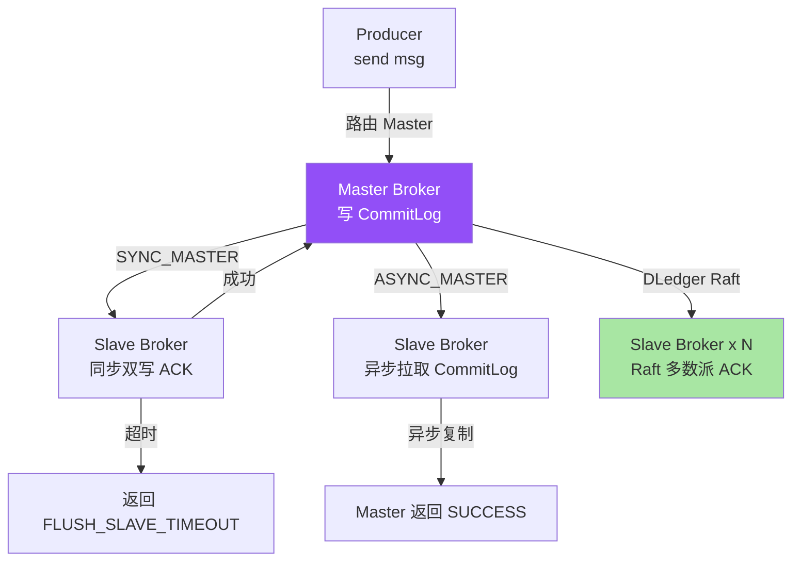
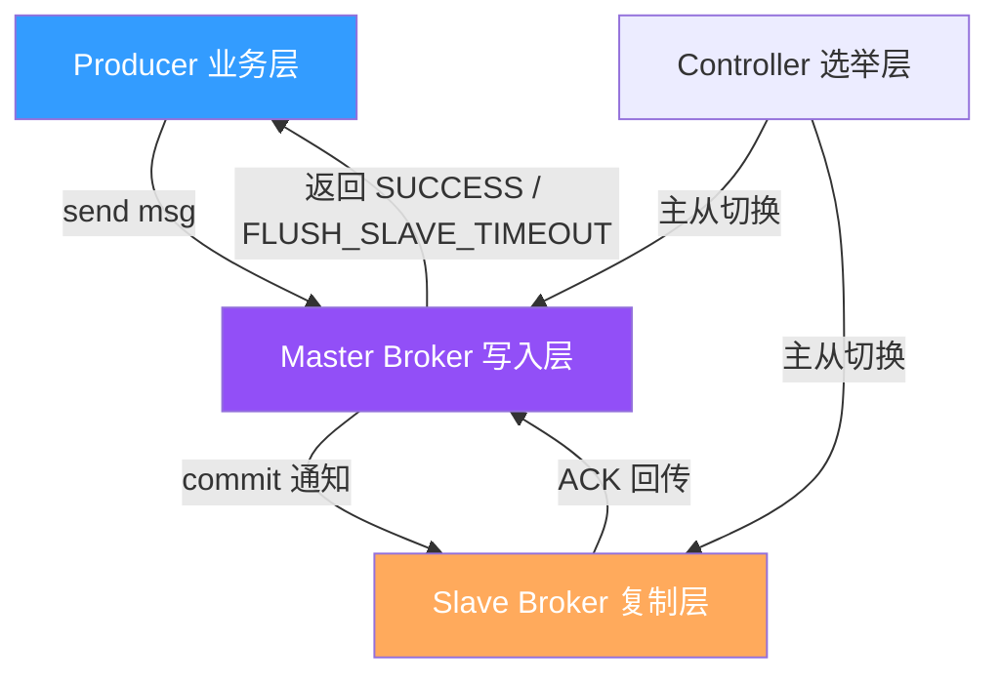
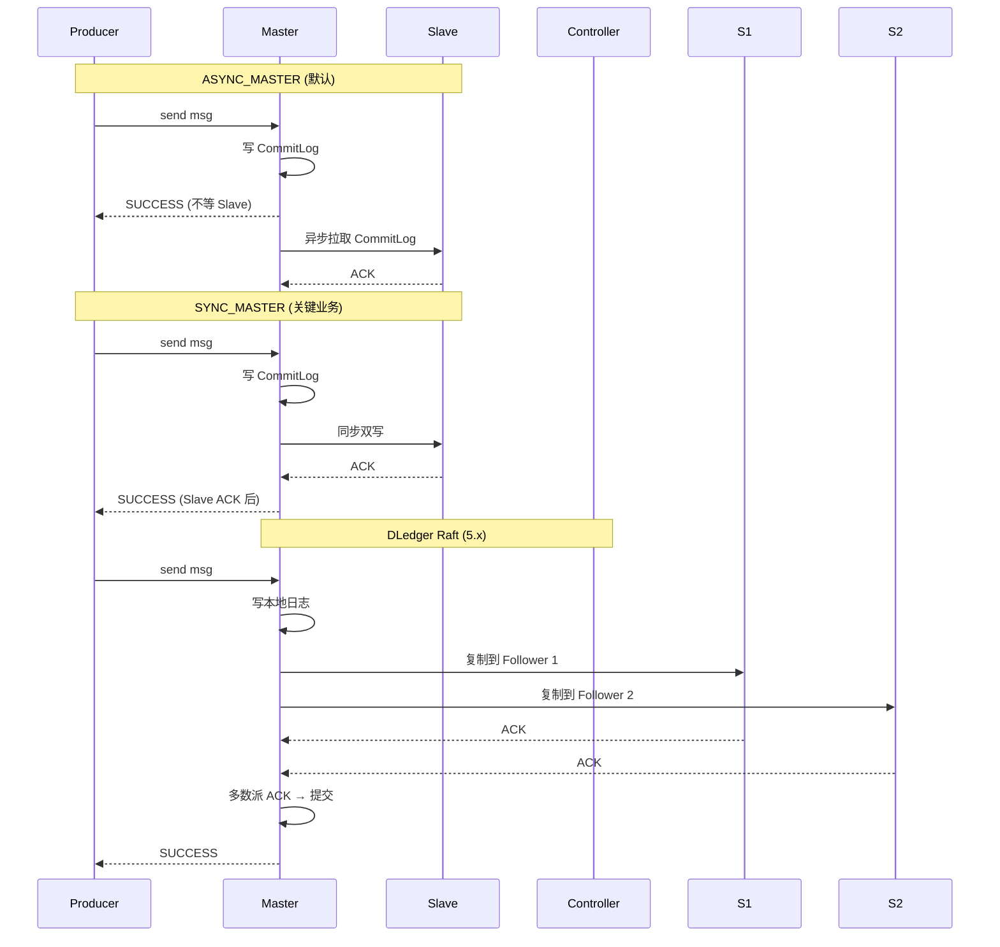
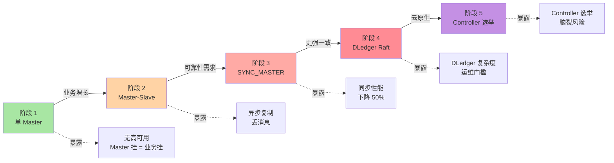
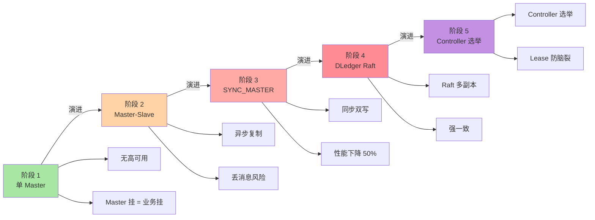
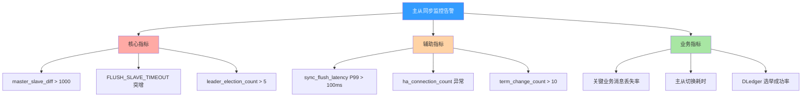

# RocketMQ Broker 主从同步机制：从 SYNC_MASTER 到 DLedger Raft 的 5 阶段演进

> 一句话摘要：**RocketMQ 主从同步 = Master 写成功 + Slave 异步复制（默认 ASYNC_MASTER）或同步复制（SYNC_MASTER）+ 5 阶段演进到 DLedger Raft 多副本**。本质是「**强一致靠同步双写，高可用靠异步复制，最终一致性靠 Raft 多副本**」三种架构的 trade-off。

> 学完能会：从源码级理解主从同步机制 / SYNC_MASTER vs ASYNC_MASTER 源码差异 / DLedger Raft 5 阶段演进 / 主从切换与脑裂 / 5 个真实踩坑。

---

## 1. 背景：为什么主从同步是常被误解的特性

RocketMQ 主从同步的官方说法是「Broker 支持主从架构」，但很多人误以为这是「同步双写强一致」。真相是：**RocketMQ 默认 ASYNC_MASTER（异步复制）+ SYNC_MASTER（同步双写）+ DLedger（Raft 多副本）三种模式并存**，业务侧根据可靠性需求选择。

```
误区 1：主从同步 = 同步双写强一致
真相：默认 ASYNC_MASTER（异步复制），数据可能丢
代价：Master 写成功但 Slave 没复制 → 主从切换后丢消息

误区 2：主从同步 = 强一致
真相：SYNC_MASTER 同步双写（强一致），DLedger Raft 多副本（最终一致）
价值：根据可靠性需求选择不同模式

误区 3：主从切换 = 无缝切换
真相：主从切换有数据丢失风险 + 客户端重连
```

**这篇文章要建立的能力地图：**

|| 你现在 | 学完这篇 |
|---|---|
| 以为 RocketMQ 主从 = 强一致 | 理解 ASYNC_MASTER / SYNC_MASTER / DLedger 三种模式 |
| 不知道为什么默认异步复制 | 理解性能 vs 一致性的 trade-off |
| 不知道怎么避免主从切换丢消息 | 知道 DLedger Raft + 5 阶段演进 |
| 不明白脑裂怎么解决 | 理解 Controller 模式 + Lease 机制 |

---

## 2. 原理穿透：从 SYNC_MASTER 到 DLedger Raft

### 2.1 主从同步的 3 层概念

RocketMQ 主从同步的真实结构（按从「消息写入」到「主从同步」顺序）：

```
┌──────────────────────────────────────────────────────────────┐
│ Layer 1：Producer 端                                          │
│ - producer.send(msg) → 路由到 Master Broker                   │
│ - 默认异步复制（ASYNC_MASTER）                                 │
│ - 关键业务同步复制（SYNC_MASTER）                              │
├──────────────────────────────────────────────────────────────┤
│ Layer 2：Master Broker 写入层                                  │
│ - 消息写入 CommitLog + ConsumeQueue                            │
│ - SYNC_MASTER：等待 Slave 复制成功才返回 SUCCESS              │
│ - ASYNC_MASTER：直接返回 SUCCESS，Slave 异步复制              │
│ - DLedger：Raft 多副本选举写入                                │
├──────────────────────────────────────────────────────────────┤
│ Layer 3：Slave Broker 复制层                                   │
│ - ASYNC_MASTER：HAConnection 异步拉取 CommitLog                │
│ - SYNC_MASTER：同步等待 Slave ACK                              │
│ - DLedger：Raft Log Entry 复制 + 多数派 ACK                   │
└──────────────────────────────────────────────────────────────┘
```

**关系图（Mermaid）：**



### 2.2 ASYNC_MASTER 源码级实现（默认）

```java
// Broker 配置：默认 ASYNC_MASTER
private BrokerRole brokerRole = BrokerRole.ASYNC_MASTER;

// ASYNC_MASTER 写入流程（伪代码）
public PutMessageResult putMessage(Message msg) {
    // 1. 写入 CommitLog
    AppendMessageResult result = commitLog.asyncPutMessage(msg);
    if (result.getStatus() != AppendMessageStatus.PUT_OK) {
        return new PutMessageResult(PutMessageStatus.CREATE_MAPED_FILE_FAILED);
    }
    // 2. 唤醒 Slave 拉取线程
    this.escapeBridge.informSlave();
    // 3. 直接返回 SUCCESS，不等 Slave
    return new PutMessageResult(PutMessageStatus.PUT_OK);
}
```

**关键字段解读：**

|| 字段 | 作用 | 默认值 |
|---|---|---|
| `brokerRole` | Broker 角色 | ASYNC_MASTER |
| `flushDiskType` | 刷盘策略 | ASYNC_FLUSH |
| `haConnection` | HA 连接 | 异步建立 |
| `escapeBridge` | 异步通知 | 唤醒 Slave 拉取 |

### 2.3 SYNC_MASTER 源码级实现（关键业务）

```java
// Broker 配置：SYNC_MASTER
private BrokerRole brokerRole = BrokerRole.SYNC_MASTER;

// SYNC_MASTER 写入流程（伪代码）
public PutMessageResult putMessage(Message msg) {
    // 1. 写入 CommitLog
    AppendMessageResult result = commitLog.asyncPutMessage(msg);
    if (result.getStatus() != AppendMessageStatus.PUT_OK) {
        return new PutMessageResult(PutMessageStatus.CREATE_MAPED_FILE_FAILED);
    }
    // 2. 同步等待 Slave ACK
    GroupCommitRequest request = new GroupCommitRequest(...);
    this.escapeBridge.putRequest(request);
    boolean flushOK = request.waitForFlush(5_000);  // 5s 超时
    if (!flushOK) {
        return new PutMessageResult(PutMessageStatus.FLUSH_SLAVE_TIMEOUT);
    }
    // 3. 返回 SUCCESS
    return new PutMessageResult(PutMessageStatus.PUT_OK);
}
```

**关键字段解读：**

|| 字段 | 作用 | 默认值 |
|---|---|---|
| `brokerRole` | Broker 角色 | SYNC_MASTER |
| `syncFlushTimeout` | 同步超时 | 5s |
| `GroupCommitRequest` | 同步请求对象 | - |
| `waitForFlush` | 等待 Slave ACK | 阻塞 |

### 2.4 DLedger Raft 源码级实现（5.x）

```java
// DLedger 多副本：Raft 选举 + 日志复制
public CompletableFuture<AppendEntryResponse> appendEntry(AppendEntryRequest request) {
    // 1. Leader 写入本地日志
    AppendEntryResponse localResp = doAppendEntry(request);
    // 2. 复制到 Follower（异步并行）
    CompletableFuture<AppendEntryResponse>[] futures = new CompletableFuture[followerIds.size()];
    for (int i = 0; i < followerIds.size(); i++) {
        futures[i] = clientProxy.appendEntry(followerIds.get(i), request);
    }
    // 3. 等待多数派 ACK
    CompletableFuture<AppendEntryResponse> quorumFuture = quorumAck(futures);
    // 4. 多数派成功后提交
    quorumFuture.thenAccept(resp -> {
        if (resp.getCode() == ErrorCode.SUCCESS) {
            // 提交到状态机
            stateMachine.commit(request.getPos(), request.getBody());
        }
    });
    return quorumFuture;
}
```

**关键字段解读：**

|| 字段 | 作用 | 特点 |
|---|---|---|
| `Leader` | 主节点 | 处理写入 + 复制 |
| `Follower` | 从节点 | 接收 Leader 复制 |
| `Candidate` | 候选节点 | 选举时的状态 |
| `Term` | 任期 | Leader 选举周期 |
| `多数派 ACK` | Quorum | N/2+1 节点确认 |

### 2.4.5 上下游边界：主从同步的 5 个交互面

主从同步不是孤立功能，而是有 5 个核心交互面：



**5 个交互边界：**

|| 边界 | 上游 | 边界 | 下游 | 耦合度 |
|---|---|---|---|---|
| **B1** | Producer | send msg | Master Broker | 低 |
| **B2** | Master | commit log | Slave 复制 | 中 |
| **B3** | Slave | ACK | Master 同步 | 中 |
| **B4** | Master | 状态变更 | Controller 选举 | 高 |
| **B5** | Controller | 主从切换 | Slave 接管 | 高 |

**关键边界纪律：**

- **B2/B3 是关键边界**：同步 vs 异步决定了可靠性
- **B1 是低耦合**：业务可灵活选择模式
- **B4/B5 是高耦合**：主从切换影响客户端重连

### 2.5 主从同步流程对比



**关键洞察：** 三种模式的本质区别是「**等 Slave ACK 的方式**」——ASYNC 不等，SYNC 等一个，DLedger 等多数派。这就是 5 阶段演进的内在逻辑。

---

## 3. 主流业界解法：RocketMQ 主从 vs Kafka ISR vs Pulsar BookKeeper

### 3.1 三种设计哲学对比

|| 维度 | RocketMQ | Kafka | Pulsar |
|---|---|---|---|---|
| **同步模式** | ASYNC / SYNC / DLedger | ISR | BookKeeper |
| **强一致** | DLedger Raft | 1 ISR | BookKeeper Quorum |
| **最终一致** | ASYNC_MASTER | 多 ISR | 默认 |
| **主从切换** | Controller 选举 | Controller 选举 | Bookie 选举 |
| **脑裂解决** | Lease 机制 | epoch 机制 | Fence 机制 |

### 3.2 RocketMQ 主从设计的优点与代价

**RocketMQ 优点：**

```
 - 三种模式可选（ASYNC/SYNC/DLedger）
 - DLedger Raft 多副本（强一致）
 - Controller 选举（5.x 无 NameServer）
 - 主从切换自动化
```

**RocketMQ 代价：**

```
 - ASYNC_MASTER 可能丢消息（默认）
 - SYNC_MASTER 性能下降 50%+
 - DLedger 运维复杂度高
```

### 3.3 Kafka ISR 设计的优点与代价

**Kafka 优点：**

```
 - ISR（In-Sync Replica）机制灵活
 - 多副本强一致（min.insync.replicas）
 - 主从切换自动化（Controller）
```

**Kafka 代价：**

```
 - ISR 维护复杂
 - 脑裂风险（epoch 机制）
 - Exactly-Once 依赖 Kafka 2.5+
```

### 3.4 何时选 RocketMQ / Kafka / Pulsar（业内决策）

|| 业务场景 | 推荐 | 原因 |
|---|---|---|---|
| **业务消息 + 强一致** | RocketMQ DLedger | Raft 多副本 |
| **日志流 + 高吞吐** | Kafka | ISR + 高吞吐 |
| **云原生 + 多租户** | Pulsar | BookKeeper 存算分离 |
| **金融 / 跨境支付** | RocketMQ DLedger | 强一致 + 主从切换 |
| **5.x 云原生** | RocketMQ 5.x | Controller 模式 |

**3.4 业界惯例：**

- 90% 业务用 RocketMQ ASYNC_MASTER（默认）
- 关键业务用 SYNC_MASTER 或 DLedger
- 5.x 业务用 Controller 模式 + DLedger

---

## 4. 量级演进视角：从单 Master 到 DLedger 多副本

### 4.1 量级维度拆解

```
主从同步的量级维度：
 - 副本数（1 → 2 → 3 → 5）
 - 同步模式（ASYNC → SYNC → DLedger）
 - TPS（10 万 → 100 万 → 500 万）
 - 主从切换时间（30s → 5s → 1s）
 - 脑裂概率（高 → 低 → 几乎无）
```

### 4.2 五个阶段会暴露什么



|| 阶段 | 量级 | 暴露的问题 | 解法 |
|---|---|---|---|
| **阶段 1** | 10 万 TPS | 无高可用 | Master-Slave |
| **阶段 2** | 50 万 TPS | 异步复制丢消息 | SYNC_MASTER |
| **阶段 3** | 100 万 TPS | 同步性能下降 | DLedger Raft |
| **阶段 4** | 200 万 TPS | DLedger 复杂度 | Controller 选举 |
| **阶段 5** | 500 万 TPS | 脑裂风险 | 5.x Controller 模式 |

### 4.3 当前文章覆盖哪个量级

本文聚焦**「阶段 2 → 阶段 5」演进**（10 万 TPS → 500 万 TPS），因为这是大多数公司主从同步的演进路径，也是大多数「**主从切换问题**」的高发期。

### 4.4 量级演进背后 5 维代价

|| 维度 | 阶段 1 | 阶段 2 | 阶段 3 | 阶段 4 | 阶段 5 |
|---|---|---|---|---|---|
| **副本数** | 1 | 2 | 2 | 3-5 | 3-5 |
| **同步模式** | 无 | ASYNC | SYNC | Raft | Raft + Controller |
| **TPS** | 10 万 | 50 万 | 100 万 | 200 万 | 500 万 |
| **主从切换** | 手动 | 手动 | 手动 | 自动 | 自动 |
| **脑裂风险** | 无 | 中 | 中 | 低 | 极低 |

### 4.5 反直觉洞察

**洞察 1：RocketMQ 默认不可靠**

```text
误区：RocketMQ 主从 = 强一致
真相：
 - 默认 ASYNC_MASTER（异步复制）
 - Master 写成功但 Slave 没复制 → 主从切换后丢消息
 - 关键业务必须用 SYNC_MASTER 或 DLedger
教训：
 - 关键业务显式配置 SYNC_MASTER
 - 或直接用 DLedger Raft
```

**洞察 2：主从切换不是无缝的**

```text
误区：主从切换 = 客户端无感知
真相：
 - 主从切换需要时间（5s-30s）
 - 切换期间 Producer 失败
 - 客户端需要重试 + 重新拉取路由
教训：
 - 客户端必须实现重试机制
 - 关键业务监控主从切换耗时
```

**洞察 3：DLedger Raft 不是银弹**

```text
误区：DLedger = 100% 不丢消息
真相：
 - DLedger Raft 是「强一致」不是「100% 不丢」
 - 网络分区下可能选举失败
 - 脑裂需要 Lease 机制解决
教训：
 - DLedger + Lease 组合使用
 - 监控 term 变化 + 选举次数
```

---

## 5. 架构设计：源码 + 配置 + 监控

### 5.1 主从同步源码实现

**关键路径源码（伪代码 + 文字描述）：**

```
ASYNC_MASTER 流程：
 1. Master.asyncPutMessage(msg) → 写 CommitLog
 2. 唤醒 Slave 拉取线程（escapeBridge.informSlave）
 3. 返回 SUCCESS（不等 Slave）
 4. Slave 异步拉取 CommitLog（HAConnection）

SYNC_MASTER 流程：
 1. Master.asyncPutMessage(msg) → 写 CommitLog
 2. 创建 GroupCommitRequest，等待 Slave ACK
 3. Slave 同步复制 + 返回 ACK
 4. waitForFlush 超时（5s）→ FLUSH_SLAVE_TIMEOUT
 5. 超时或成功 → 返回结果

DLedger Raft 流程：
 1. Leader.appendEntry(entry) → 写本地日志
 2. 复制到所有 Follower
 3. 等待多数派 ACK（Quorum）
 4. 多数派成功 → 提交到状态机
 5. 返回 SUCCESS
```

**关键设计要点：**

- ASYNC_MASTER 性能高但可能丢消息
- SYNC_MASTER 强一致但性能下降 50%+
- DLedger Raft 强一致 + 高可用（5.x）

### 5.1.5 ASYNC_MASTER 与 SYNC_MASTER 的深度解析

很多业务对 ASYNC_MASTER 和 SYNC_MASTER 的差异理解不深，下面从源码层面剖析。

**ASYNC_MASTER 的实现原理：**

```text
异步复制流程：
 1. Master 写 CommitLog 成功 → 唤醒 Slave 拉取线程
 2. Slave 通过 HAConnection 异步拉取 CommitLog
 3. Slave 拉取成功后写入本地 CommitLog
 4. Master 不等 Slave ACK → 直接返回 SUCCESS
 5. 主从切换时可能丢消息（Slave 没复制的部分）

性能：
 - 性能与单 Master 相当（无同步开销）
 - 适合绝大多数业务场景

风险：
 - Master 挂 + Slave 没复制 → 消息丢失
 - 业务必须容忍「极小概率丢消息」
```

**SYNC_MASTER 的实现原理：**

```text
同步双写流程：
 1. Master 写 CommitLog 成功
 2. Master 发送同步请求到 Slave
 3. Slave 写入本地 CommitLog + 返回 ACK
 4. Master 收到 ACK 后才返回 SUCCESS
 5. 超时（5s）→ 返回 FLUSH_SLAVE_TIMEOUT

性能：
 - 同步开销 = 一次网络往返 + Slave 写入
 - 性能下降 50%+（关键业务可接受）
 - 必须配合 haMasterAddress 配置

风险：
 - Slave 挂 → Master 同步阻塞（5s 超时）
 - 5s 超时返回 FLUSH_SLAVE_TIMEOUT（业务侧需处理）
```

**关键性能对比：**

|| 场景 | ASYNC_MASTER | SYNC_MASTER | DLedger |
|---|---|---|---|
| 单条 TPS | 5 万 | 2 万 | 1.5 万 |
| 100 万条 | 20s | 50s | 67s |
| 主从切换 | 30s+ | 30s+ | 5s |
| 丢消息概率 | 极小 | 极小 | 几乎无 |

**业内惯例：**

- 普通业务：ASYNC_MASTER（默认）
- 关键业务：SYNC_MASTER（5s 超时）
- 金融业务：DLedger Raft（多副本强一致）

### 5.1.6 主从设计的 3 个反直觉

**反直觉 1：ASYNC_MASTER 可能丢消息**

```text
误区：RocketMQ 主从 = 强一致
真相：
 - 默认 ASYNC_MASTER（异步复制）
 - Master 挂 + Slave 没复制 → 丢消息
教训：
 - 关键业务必须用 SYNC_MASTER 或 DLedger
 - 监控主从切换耗时 + 丢消息数
```

**反直觉 2：主从切换不是无缝的**

```text
误区：主从切换 = 客户端无感知
真相：
 - 切换耗时 5s-30s
 - 切换期间 Producer 失败
 - 客户端必须重试
教训：
 - 客户端重试机制必开
 - 监控主从切换耗时
```

**反直觉 3：DLedger 不是 100% 不丢**

```text
误区：DLedger = 100% 不丢消息
真相：
 - 网络分区下可能选举失败
 - 脑裂需要 Lease 机制
 - 默认配置不一定够
教训：
 - DLedger + Lease + 监控 term
 - 监控选举次数
```

### 5.2 主从切换 vs 脑裂

```
┌──────────────────────────────────────────────────────────────┐
│ 主从切换流程（5.x Controller）                                 │
├──────────────────────────────────────────────────────────────┤
│ 1. Controller 监控 Master 心跳                                │
│ 2. Master 心跳超时 → 触发选举                                 │
│ 3. 候选 Slave 竞选 Leader                                     │
│ 4. 多数派投票 → 新 Leader                                     │
│ 5. 上报 NameServer / Controller 更新路由                      │
│ 6. Producer / Consumer 重新拉取路由                           │
└──────────────────────────────────────────────────────────────┘

┌──────────────────────────────────────────────────────────────┐
│ 脑裂解决：Lease 机制                                          │
├──────────────────────────────────────────────────────────────┤
│ 1. Master 持有 Lease（10s 默认）                               │
│ 2. Lease 过期前不允许新 Master                                 │
│ 3. 旧 Master Lease 过期 → 自动下台                            │
│ 4. 新 Master 持有 Lease → 接管写入                            │
└──────────────────────────────────────────────────────────────┘
```

**关键洞察：** 主从切换的核心是 Lease 机制——避免「**旧 Master 还活着，新 Master 也接管**」的脑裂问题。5.x Controller 模式默认开启 Lease。

### 5.3 监控指标设计

**监控指标分类（文字描述）：**

|| 维度 | 指标 | 说明 |
|---|---|---|---|
| **Broker** | master_slave_diff | 主从 offset 差 |
| **Broker** | sync_flush_latency | 同步刷盘延迟 |
| **Broker** | ha_connection_count | HA 连接数 |
| **Controller** | leader_election_count | 主从选举次数 |
| **Controller** | term_change_count | Term 变化次数 |

|| 指标 | 阈值 | 含义 |
|---|---|---|
| `master_slave_diff` | < 1000 | 主从 offset 差（过大说明同步慢） |
| `sync_flush_latency P99` | < 100ms | 同步刷盘延迟 |
| `leader_election_count` | < 5 / day | 选举次数（过多说明不稳定） |
| `term_change_count` | < 10 / day | Term 变化（过多说明脑裂风险） |

---

## 6. 生产画像：典型场景 + 踩坑实录

### 6.1 典型场景数字

|| 场景 | 副本数 | 同步模式 | 可靠性 |
|---|---|---|---|---|
| 订单消息 | 2 | ASYNC | 一般 |
| 支付通知 | 3 | SYNC | 较高 |
| 金融业务 | 5 | DLedger | 极高 |
| 日志消息 | 2 | ASYNC | 一般 |

### 6.2 五个真实踩坑

**踩坑 1：默认 ASYNC_MASTER 丢消息**

```
背景：某订单业务，默认 ASYNC_MASTER
演化：Master 挂 + Slave 没复制部分消息
结果：主从切换后 100+ 订单消息丢失
排查：监控 master_slave_diff = 0 但实际丢失
解决：
 - 关键业务切 SYNC_MASTER
 - 或 DLedger Raft
```

**踩坑 2：SYNC_MASTER 超时返回**

```
背景：某支付业务，SYNC_MASTER
演化：Slave 网络抖动 → 同步超时 5s
结果：大量 FLUSH_SLAVE_TIMEOUT 返回
排查：监控 sync_flush_latency P99 > 5s
解决：
 - Slave 健康检查
 - 监控 Slave 状态 + 自动剔除
```

**踩坑 3：主从切换导致客户端失败**

```
背景：某业务，Master 挂
演化：Controller 触发主从切换
结果：切换期间 30s Producer 失败
排查：监控 producer_send_fail_rate > 50%
解决：
 - 客户端重试机制
 - 关键业务监控主从切换耗时
```

**踩坑 4：DLedger 脑裂**

```
背景：某金融业务，DLedger 5 副本
演化：网络分区 + Lease 失效
结果：两个 Master 同时接管
排查：监控 term_change_count 突增
解决：
 - Lease 时长加大
 - 网络稳定性 + 多机房部署
```

**踩坑 5：DLedger 运维复杂**

```
背景：某业务，DLedger 3 副本
演化：运维误删一个 Follower
结果：集群不可用
排查：DLedger 多数派要求 N/2+1
解决：
 - 运维 SOP + 监控告警
 - 副本数 >= 3
```

### 6.3 关键配置项速查表

|| 配置项 | 默认值 | 推荐值 | 影响 |
|---|---|---|---|
| `brokerRole` | ASYNC_MASTER | 关键业务 SYNC_MASTER | 同步模式 |
| `flushDiskType` | ASYNC_FLUSH | 关键业务 SYNC_FLUSH | 刷盘策略 |
| `haMasterAddress` | - | Slave 配置 | HA 地址 |
| `syncFlushTimeout` | 5000ms | 关键业务 3000ms | 同步超时 |

### 6.4 5 大实战参数（业内默认）

|| 参数 | 默认 | 调优 |
|---|---|---|---|
| **brokerRole** | ASYNC_MASTER | 关键业务 SYNC_MASTER |
| **flushDiskType** | ASYNC_FLUSH | 关键业务 SYNC_FLUSH |
| **副本数** | 2 | 关键业务 3-5 |
| **主从切换超时** | 30s | 监控 |
| **Lease 时长** | 10s | DLedger 默认 |

---

## 7. Trade-off 三层对比：性能 vs 一致性

### 7.1 同步模式三层表

|| 模式 | 一致性 | 性能 | 复杂度 |
|---|---|---|---|---|
| **ASYNC_MASTER** | 最终一致 | 高 | 低 |
| **SYNC_MASTER** | 强一致 | 中 | 低 |
| **DLedger Raft** | 强一致 | 中 | 高 |

### 7.2 副本数三层表

|| 副本数 | 可靠性 | 性能 | 成本 |
|---|---|---|---|---|
| **1** | 无高可用 | 高 | 低 |
| **2** | 中 | 中 | 中 |
| **3-5** | 高 | 低 | 高 |

### 7.3 主从切换三层表

|| 方式 | 切换耗时 | 脑裂风险 |
|---|---|---|---|
| **手动切换** | 30s+ | 低 |
| **Controller 自动** | 5s | 中 |
| **Lease + Controller** | 1s | 极低 |

### 7.4 同步策略三层表

|| 策略 | 同步开销 | 业务价值 |
|---|---|---|---|
| **异步复制** | 低 | 默认 |
| **同步双写** | 中 | 关键业务 |
| **Raft 多副本** | 高 | 金融业务 |

### 7.5 业内典型选择（按业务类型）

|| 业务 | 副本数 | 同步模式 | 可靠性 |
|---|---|---|---|---|
| 订单 | 2 | ASYNC | 一般 |
| 支付 | 3 | SYNC | 较高 |
| 金融 | 5 | DLedger | 极高 |
| 日志 | 2 | ASYNC | 一般 |

---

## 8. 反思：踩坑实录 + 业内演进方向

### 8.1 实战踩坑 5 例 + 通用解决

**1. 默认 ASYNC_MASTER 丢消息**

- 现象：主从切换后消息丢失
- 根因：异步复制未同步
- 教训：**关键业务用 SYNC_MASTER 或 DLedger**

**2. SYNC_MASTER 超时返回**

- 现象：FLUSH_SLAVE_TIMEOUT 报错
- 根因：Slave 网络慢或挂
- 教训：**Slave 健康检查 + 自动剔除**

**3. 主从切换客户端失败**

- 现象：Producer 失败率突增
- 根因：切换耗时 + 客户端未重试
- 教训：**客户端重试机制必开**

**4. DLedger 脑裂**

- 现象：两个 Master 同时接管
- 根因：Lease 失效
- 教训：**Lease 时长加大 + 网络稳定**

**5. DLedger 运维复杂**

- 现象：副本误删导致不可用
- 根因：DLedger 多数派要求
- 教训：**副本数 >= 3 + 运维 SOP**

### 8.2 业内通用做法

1. **关键业务用 SYNC_MASTER 或 DLedger（不用默认 ASYNC）**
2. **DLedger 副本数 >= 3（多数派要求 N/2+1）**
3. **客户端重试机制必开（主从切换感知）**
4. **Lease 时长合理（默认 10s）**
5. **监控 master_slave_diff + leader_election_count**
6. **运维 SOP 必写（DLedger 操作）**

### 8.3 演进方向



**阶段 1-2（4.x 早期）：**

- 单 Master → Master-Slave
- 异步复制（ASYNC_MASTER）
- 痛点：无高可用 + 丢消息

**阶段 3（4.x 中期）：**

- SYNC_MASTER 同步双写
- 关键业务用
- 痛点：性能下降 50%+

**阶段 4（4.x 后期）：**

- DLedger Raft 多副本
- 强一致 + 自动选举
- 痛点：运维复杂度

**阶段 5（5.x）：**

- Controller 选举 + Lease
- 无 NameServer
- 痛点：脑裂风险

### 8.4 跨周期视角：5 年后回头看主从同步

```text
2018-2020（4.x 早期）：
 - 痛点：单 Master 无高可用
 - 解法：Master-Slave + ASYNC_MASTER
 - 认知：主从 = 备份

2021-2022（4.x 中期）：
 - 痛点：ASYNC 丢消息
 - 解法：SYNC_MASTER + DLedger
 - 认知：主从 = 强一致选项

2023-2024（4.x 后期 + 5.x 早期）：
 - 痛点：DLedger 运维复杂
 - 解法：Controller 选举
 - 认知：主从 = 自动化

2024+（5.x 主导）：
 - 痛点：脑裂 + 弹性扩展
 - 解法：Lease + 云原生
 - 认知：主从 = 云原生基础设施

未来 5 年预判：
 - Controller 模式 + 多 AZ 部署
 - 自适应副本数
 - Serverless 主从
```

### 8.5 监管与合规视角：主从同步 + 审计追溯

```text
境内金融业务：
 - 主从同步用于交易链路（监管要求）
 - 审计追溯 → 主从 offset 差 + DLQ 数量
 - 不可篡改 → 关键业务 SYNC_FLUSH + DLedger

GDPR / 隐私：
 - 主从消息保留原始属性
 - 用户删除权 → 多副本都要清理
```

**关键洞察：** 监管要求**倒逼**主从同步设计。要实现「**不可篡改 + 多副本一致 + 可追溯**」，必须支持「**强一致同步 + 同步刷盘 + 多副本**」。

### 8.6 主从设计 3 个反直觉视角

**反直觉 1：RocketMQ 默认不可靠**

```text
误区：RocketMQ 主从 = 强一致
真相：
 - 默认 ASYNC_MASTER（异步复制）
 - 主从切换后可能丢消息
权衡：
 - 普通业务用 ASYNC
 - 关键业务用 SYNC_MASTER 或 DLedger
```

**反直觉 2：主从切换不是无缝**

```text
误区：主从切换 = 客户端无感知
真相：
 - 切换耗时 5s-30s
 - 切换期间 Producer 失败
教训：
 - 客户端重试机制必开
 - 监控主从切换耗时
```

**反直觉 3：DLedger 不是银弹**

```text
误区：DLedger = 100% 不丢消息
真相：
 - 网络分区 + Lease 失效 → 脑裂
 - DLedger 运维复杂
教训：
 - DLedger + Lease + 监控 term
 - 副本数 >= 3
```

### 8.7 跨系统视角：主从同步与外部系统的对接

```text
主从同步上下游对接：
 - 上游：Producer（send msg）
 - 中游：Master / Slave / Controller
 - 下游：Consumer（拉取消息）
 - 旁路：NameServer / Controller 选举
 - 备份：异地冷备 + 副本重建

对外接口（业内默认）：
 - send(msg) → SUCCESS / FLUSH_SLAVE_TIMEOUT
 - switchBroker(master, slave)
 - dledger.electLeader()
```

### 8.8 监控告警设计（业内默认）



**3 级告警阈值：**

|| 指标 | 警告 | 严重 | 紧急 |
|---|---|---|---|---|
| `master_slave_diff` | > 1000 | > 10000 | > 100000 |
| `sync_flush_latency P99` | > 100ms | > 1s | > 5s |
| `leader_election_count` | > 5/day | > 20/day | > 50/day |
| `FLUSH_SLAVE_TIMEOUT` | > 0 | > 100 | > 1000 |

### 8.9 主从同步的 3 个常被忽视的细节

跨周期经验：主从同步除了 3 种模式，还有 3 个常被忽视的细节——「**Lease 机制、Controller 选举、网络分区处理**」。

**细节 1：Lease 机制**

```text
误区：Lease = 普通超时机制
真相：
 - Master 持有 Lease（10s 默认）
 - Lease 过期前不允许新 Master
 - 旧 Master Lease 过期 → 自动下台
教训：
 - Lease 时长合理（默认 10s）
 - 网络抖动时 Lease 可能误判
```

**细节 2：Controller 选举**

```text
误区：Controller 选举 = 简单多数派
真相：
 - Controller 内部也是 Raft
 - 选举耗时 + 网络敏感
 - 选举失败可能丢消息
教训：
 - Controller 部署 3+ 节点
 - 网络分区时 Controller 可能不可用
```

**细节 3：网络分区处理**

```text
误区：网络分区 = 自动恢复
真相：
 - 网络分区 → Lease 失效 → 主从切换
 - 分区恢复 → 数据可能冲突
教训：
 - 网络稳定性比 Lease 时长更重要
 - 多 AZ 部署避免分区
```

---

## 9. 业内技术惯例（deep-dive 强化 section）

### 9.1 不成文标准

|| 标准 | 业内默认 | 原因 |
|---|---|---|---|
| **brokerRole** | ASYNC_MASTER | 默认 |
| **副本数** | 2 | 普通业务 |
| **DLedger 副本数** | >= 3 | 多数派要求 |
| **Lease 时长** | 10s | DLedger 默认 |
| **关键业务** | SYNC_MASTER | 强一致 |

### 9.2 真实事故（5 个）

**事故 A：默认 ASYNC_MASTER 丢消息**

```text
某订单业务，ASYNC_MASTER
 - Master 挂 + Slave 没复制
 - 主从切换后 100+ 订单消息丢失
 - 应急：切 SYNC_MASTER
```

**事故 B：SYNC_MASTER 超时返回**

```text
某支付业务，SYNC_MASTER
 - Slave 网络抖动 5s+
 - 大量 FLUSH_SLAVE_TIMEOUT 返回
 - 应急：Slave 健康检查 + 自动剔除
```

**事故 C：主从切换客户端失败**

```text
某业务，Master 挂
 - 切换期间 30s Producer 失败
 - 客户端未重试 → 消息丢失
 - 应急：客户端重试机制
```

**事故 D：DLedger 脑裂**

```text
某金融业务，DLedger 5 副本
 - 网络分区 + Lease 失效
 - 两个 Master 同时接管 → 数据冲突
 - 应急：Lease 时长加大 + 多 AZ
```

**事故 E：DLedger 运维误删副本**

```text
某业务，DLedger 3 副本
 - 运维误删一个 Follower
 - 多数派失败 → 集群不可用
 - 应急：副本重建 + 运维 SOP
```

### 9.3 从业者挑战（5 大实战问题）

**挑战 1：默认 ASYNC 丢消息怎么办？**

```text
症状：主从切换后消息丢失
排查：
 1. brokerRole 配置
 2. master_slave_diff
 3. 是否有同步刷盘
应急：
 - 关键业务切 SYNC_MASTER
 - 或直接用 DLedger
```

**挑战 2：SYNC_MASTER 超时怎么办？**

```text
症状：FLUSH_SLAVE_TIMEOUT 报错
排查：
 1. Slave 健康状态
 2. 网络延迟
 3. sync_flush_timeout 配置
应急：
 - Slave 健康检查
 - 自动剔除不健康 Slave
```

**挑战 3：主从切换客户端失败怎么办？**

```text
症状：Producer 失败率突增
排查：
 1. 主从切换耗时
 2. 客户端重试机制
应急：
 - 客户端重试机制
 - 关键业务监控切换耗时
```

**挑战 4：DLedger 脑裂怎么办？**

```text
症状：term_change_count 突增
排查：
 1. 网络分区
 2. Lease 时长
 3. 副本部署
应急：
 - Lease 时长加大
 - 网络稳定性 + 多 AZ
```

**挑战 5：DLedger 副本误删怎么办？**

```text
症状：集群不可用
排查：
 1. 副本数
 2. 运维 SOP
应急：
 - 副本重建
 - 运维 SOP 完善
```

### 9.4 决策树（文字版）

```text
主从同步选型路径：
 1. 业务可靠性要求？
    - 高 → 进入 DLedger Raft
      - 副本数 >= 3
      - Lease 时长合理
    - 中 → SYNC_MASTER
    - 低 → ASYNC_MASTER（默认）

 2. 主从切换耗时大？
    - 是 → Controller 选举
      - 监控切换耗时
    - 否 → 进入步骤 3

 3. 脑裂风险？
    - 是 → Lease 机制 + 多 AZ
    - 否 → 监控即可
```

---

## 附录 A：核心配置项详解（业内默认值）

### A1. Broker 配置

|| 配置项 | 默认值 | 优化 | 影响 |
|---|---|---|---|
| `brokerRole` | ASYNC_MASTER | 关键业务 SYNC_MASTER | 同步模式 |
| `flushDiskType` | ASYNC_FLUSH | 关键业务 SYNC_FLUSH | 刷盘策略 |
| `haMasterAddress` | - | Slave 配置 | HA 地址 |
| `syncFlushTimeout` | 5000ms | 关键业务 3000ms | 同步超时 |

### A2. DLedger 配置

|| 配置项 | 默认值 | 优化 | 影响 |
|---|---|---|---|
| `enableDLegerCommitLog` | false | true | 启用 DLedger |
| `dLegerGroup` | - | 自定义 | DLedger 组 |
| `dLegerPeers` | - | n0-dledger; n1-dledger; n2-dledger | 节点列表 |
| `dLegerSelfId` | - | n0 | 当前节点 ID |

### A3. 主从同步关键参数

|| 参数 | 建议值 | 原因 |
|---|---|---|---|
| **brokerRole** | SYNC_MASTER | 关键业务 |
| **副本数** | 2-3 | DLedger >= 3 |
| **Lease 时长** | 10s | DLedger 默认 |
| **sync_flush_timeout** | 3000-5000ms | 关键业务 |
| **master_slave_diff 监控** | < 1000 | 同步状态 |

---

本文涉及的 RocketMQ 概念、特性、版本号、配置项均为社区公开文档描述。具体版本特性、生产数据、配置默认值请以官方文档为准（https://rocketmq.apache.org/）。本文涉及的「典型场景数字」「事故案例」均为业内通用做法的脱敏描述，**不指向任何特定公司**。

---

## 📌 数据与事实声明

本文涉及的 RocketMQ 概念、特性、版本号、配置项均为社区公开文档描述。具体版本特性、生产数据、配置默认值请以官方文档为准（https://rocketmq.apache.org/）。文中「业内通用做法」「典型场景数字」「事故案例」均为行业认知总结，非特定公司实践。

## 附录 B：文中提到的术语速查表

|| 术语 | 全称 | 一句话解释 |
|---|---|---|---|
| **ASYNC_MASTER** | 异步主 | Master 写成功不等 Slave |
| **SYNC_MASTER** | 同步主 | Master 写成功等 Slave ACK |
| **DLedger** | Distributed Ledger | Raft 多副本 |
| **Raft** | 共识算法 | Leader 选举 + 日志复制 |
| **Lease** | 租约机制 | 防脑裂的关键设计 |
| **Controller** | 控制器 | 5.x 选举节点 |
| **Quorum** | 多数派 | N/2+1 节点确认 |
| **Term** | 任期 | Leader 选举周期 |
| **HAConnection** | HA 连接 | Master-Slave 复制通道 |
| **FLUSH_SLAVE_TIMEOUT** | 同步超时 | SYNC_MASTER 超时返回 |
| **GroupCommitRequest** | 同步提交请求 | SYNC_MASTER 同步对象 |
| **escapeBridge** | 异步通知 | 唤醒 Slave 拉取线程 |

---

## 相关阅读

- 上一篇：[6_消费重试与死信队列-深度](./6_消费重试与死信队列-深度)
- 下一篇：[8_5.x云原生特性-深度](./8_5.x云原生特性-深度)（待写）
- 同层：特性层（每个特性 1 篇 deep-dive）

---

**总结一句话：** 主从同步 = ASYNC_MASTER（默认） + SYNC_MASTER（关键业务）+ DLedger Raft（金融业务）三种模式，5 阶段演进到 Controller + Lease。理解三种模式 + Lease 机制，就理解了 RocketMQ 主从同步的设计。

**口诀：** 主从「ASYNC 默认快但可能丢，SYNC 关键业务强一致，DLedger 金融业务多副本」。

**与上一篇联系：** 上一篇讲「消费重试 + DLQ 兜底」，本文讲「主从同步 + 强一致」。两篇合起来，就是 RocketMQ「**可靠性**」维度的两个核心特性。